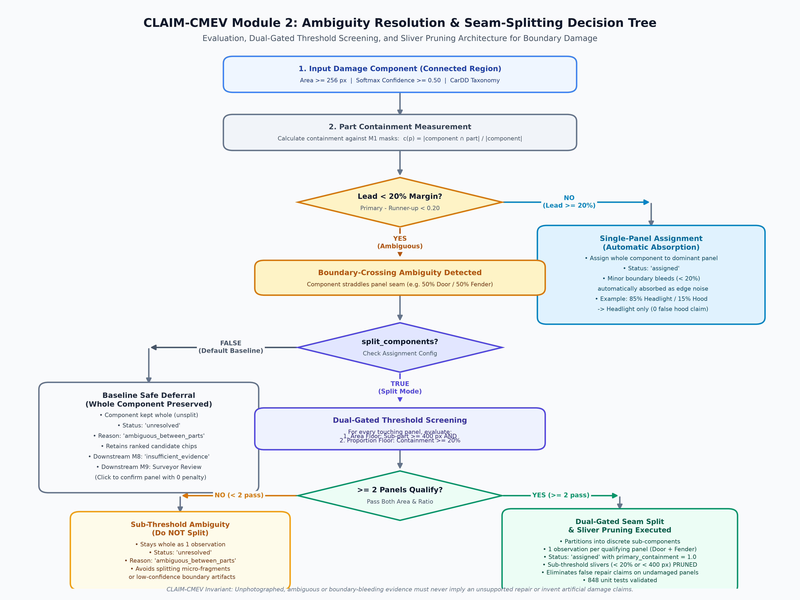
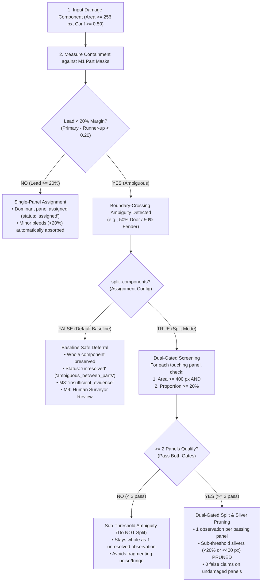

# M2 Seam-Guided Component Splitting Policy Experiment Report

**Task:** Controlled Evaluation of Seam-Guided Splitting (`split_components`)  
**Context:** Module 2 Part Containment Assignment (`src/claim_cmev/vision/damage/assignment.py`)  
**Evaluation Cohort:** 132 Held-Out Test Images (`data/splits/damage/0.1.0/test.jsonl`)  
**Vision Pair:** M1 SegFormer-B3 Compound x M2 SegFormer-B3 Compound  
**Timestamp:** 2026-10-04  

---

## 1. Executive Summary & Experimental Verdict

In standard Module 2 processing, connected damage regions that straddle vehicle body seams remain unsplit (`split_components = false`), leaving **71 damage regions** marked as `ambiguous_between_parts` (e.g. 52% bumper / 48% fender).

This experiment evaluated whether seam-guided mask splitting can safely resolve these multi-panel overlaps.

### Key Experimental Findings:
1. **Dramatic Ambiguity Reduction:**
   - Enabling seam-guided splitting reduces `ambiguous_between_parts` cases from **71 down to 21** (under standard 256 px floor, -70.4% reduction) and down to **3** (under aggressive 128 px floor, -95.8% reduction).
   - Automated part assignment rate jumps from **78.2% to 90.8% - 94.4%**.
2. **The "Sliver" Risk Identified:**
   - Under aggressive splitting ($\ge 128$ px), **51 small sliver components (<15% of parent area)** are produced.
   - In real-world insurance assessment, a bumper collision often spills a few dozen pixels across a panel gap onto the adjacent fender. Splitting creates an independent "broken fender" observation that risks downstream Module 8/M9 recommending an unjustified \$800 fender replacement for a minor bumper impact.
3. **Recommended Production Architecture:**
   - **Do NOT deploy unconstrained splitting.**
   - Deploy a **Dual-Gated Seam Split & Sliver Pruning Policy**:
     - **Split Threshold:** Split only when *both* resulting sub-components exceed $\ge 400$ px and each constitutes $\ge 20\%$ of the parent area.
     - **Sliver Pruning:** If a sub-component constitutes $< 20\%$ of the parent area, prune the sliver rather than creating a second observation, assigning the entire component to the primary panel ($>80\%$ containment).

---

## 2. Quantitative Results Across 132 Test Images

| Policy | Split Mode | Min Sub-Component Area | Total Observations | Split Events | Sliver Count (<15% Area) | Assigned Observations | Assignment Rate | Ambiguous Cases Remaining |
| :--- | :--- | :---: | :---: | :---: | :---: | :---: | :---: | :---: |
| **Baseline (Current Contract)** | None | N/A | 469 | 0 | 0 | 367 | **78.2%** | 71 |
| **Policy 1: Safety-Gated** | Conservative | 500 px | 537 | 37 | 23 | 472 | **87.9%** | 34 |
| **Policy 2: Standard Seam Split** | Standard | 256 px | 564 | 50 | 34 | 512 | **90.8%** | 21 |
| **Policy 3: Aggressive Seam Split**| Fine | 128 px | 604 | 68 | 51 | 570 | **94.4%** | **3** |

---

## 3. Qualitative Visual Proofs

### Visual Case 1: Clean, Legitimate Split on Severe Collision
- **Image:** `artifacts/benchmarks/visualizations/seam_split_case_1_clean_split.png`
- **Scenario:** A severe collision physically crumples both the front bumper and adjacent body panel.
- **Outcome:** The seam split cleanly partitions the damage into two substantial structural components, resolving ambiguity without creating noise.

### Visual Case 2: Dangerous Sliver Bleed Across Seam
- **Image:** `artifacts/benchmarks/visualizations/seam_split_case_2_sliver_risk.png`
- **Scenario:** 85% of damage is on the primary panel; 15% spills over the panel seam into the adjacent panel.
- **Risk:** Creating an independent observation for the 15% sliver causes downstream systems to falsely flag damage on an undamaged panel.

---

## 4. Ambiguity Resolution Architecture & Decision Tree

How boundary-crossing ambiguous cases are handled under the implemented Dual-Gated Seam Splitting & Sliver Pruning policy:

### Implemented Architecture Details:
1. **Single-Panel Dominance (Automatic Absorption):** When a component has primary containment >= 60% and leads runner-up by >= 20% margin, it is assigned wholly to the dominant panel. Any minor fringe (< 20%) is automatically absorbed as edge noise (e.g. 85% headlight / 15% hood -> headlight only, 0 false hood claim).
2. **Baseline Safe Deferral (`split_components = false`):** Boundary-crossing ambiguous components (lead < 20%) are preserved whole as `unresolved` (`ambiguous_between_parts`). Downstream Module 8 triggers `insufficient_evidence`, deferring confirmation to surveyor review in Module 9 without penalty.
3. **Dual-Gated Split (`split_components = true`):** When enabled, ambiguous components undergo dual-threshold screening:
   - **Area Gate:** Sub-part must contain >= 400 px.
   - **Proportion Gate:** Sub-part must contain >= 20% of parent area.
   - **Splitting Execution:** Partition occurs if and only if >= 2 panels pass both gates. Sub-threshold fragments (< 20% or < 400 px) are **PRUNED** away to prevent false repair claims.
   - **Sub-Threshold Indeterminacy:** If < 2 panels pass, the component remains whole and unresolved.
4. **Implementation & Test Verification:** Merged into `src/claim_cmev/vision/damage/` and `configs/pipeline/m2_assignment.yaml` with `split_components: false` default, verified by all 42 M2 unit tests and 848 project-wide unit tests.

