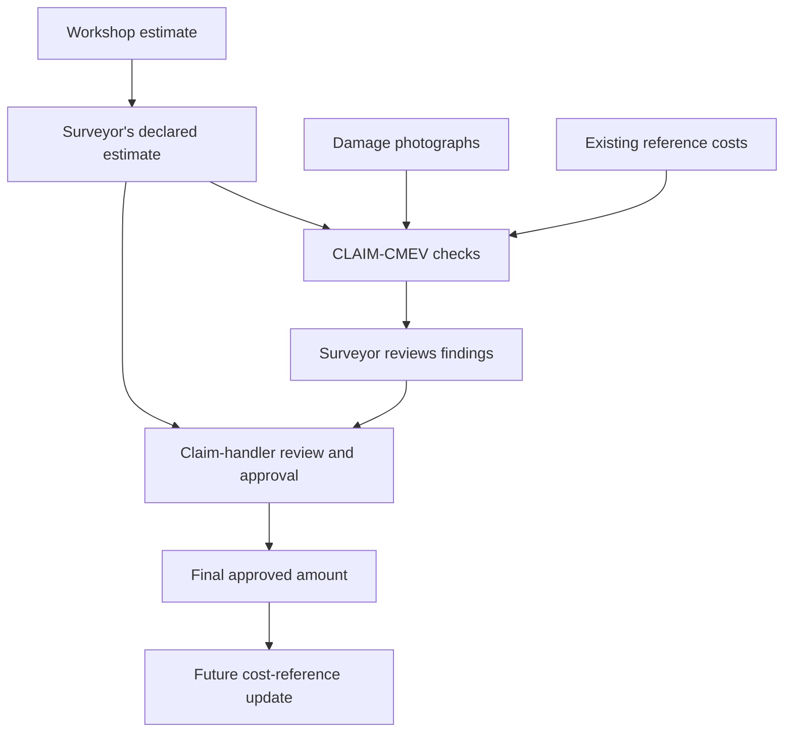
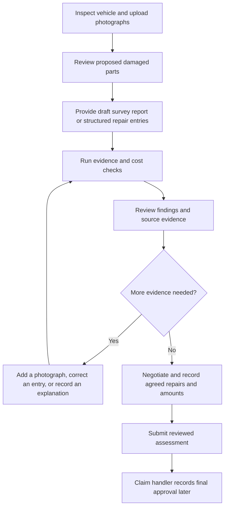
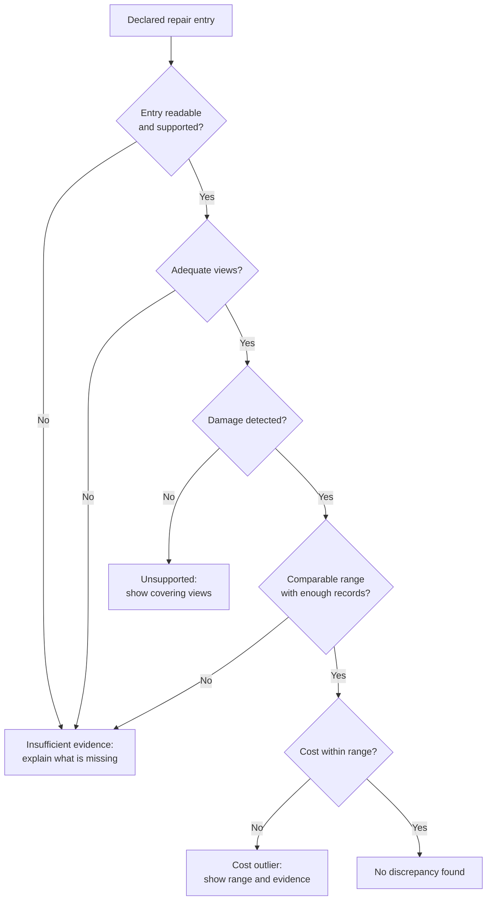
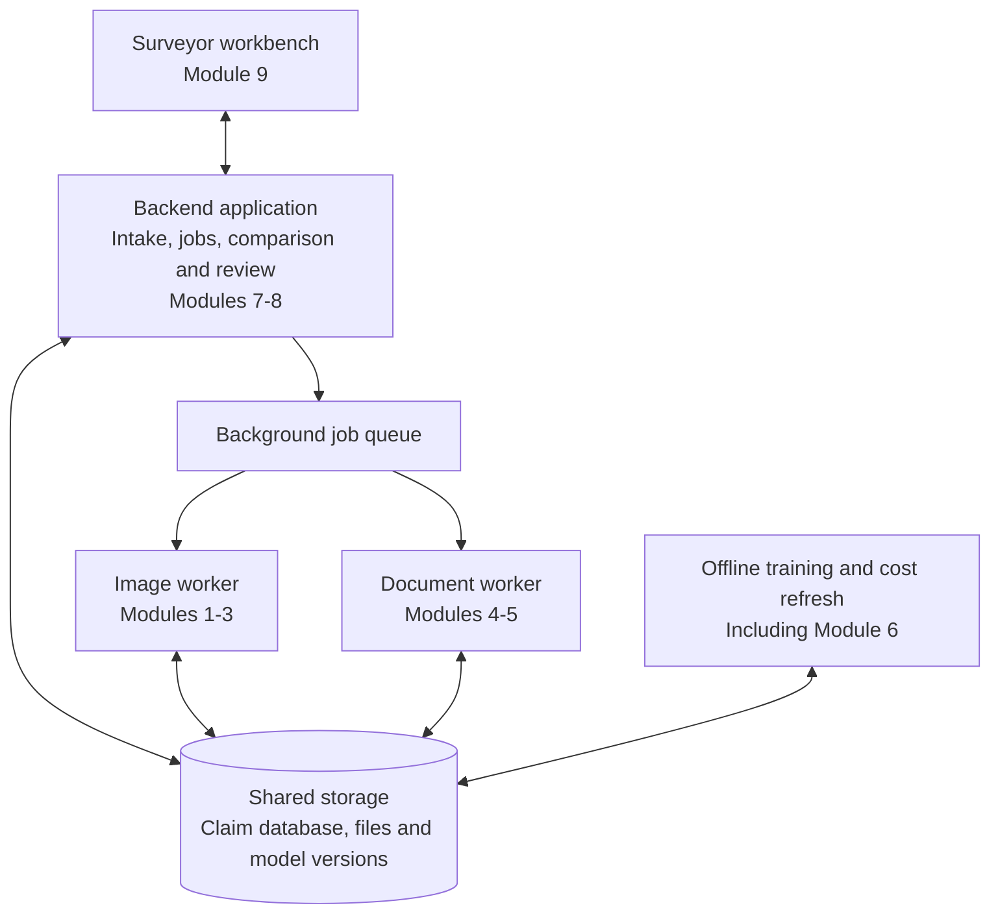
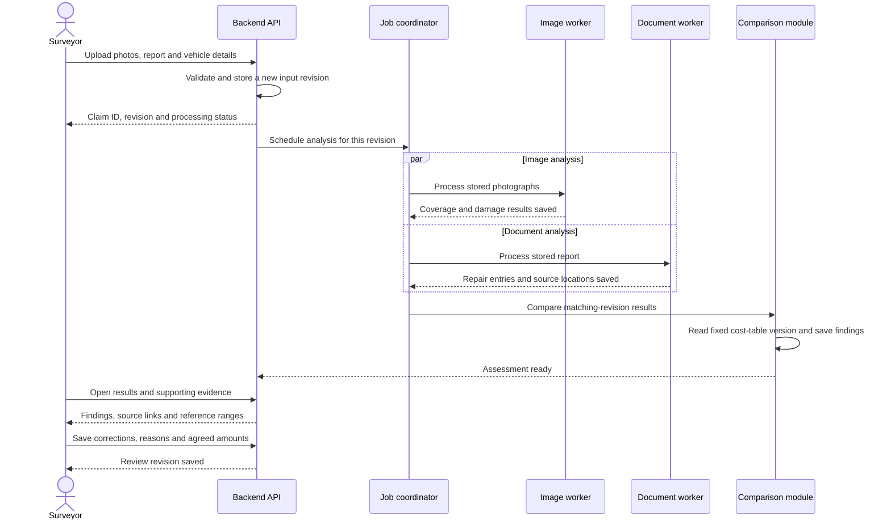
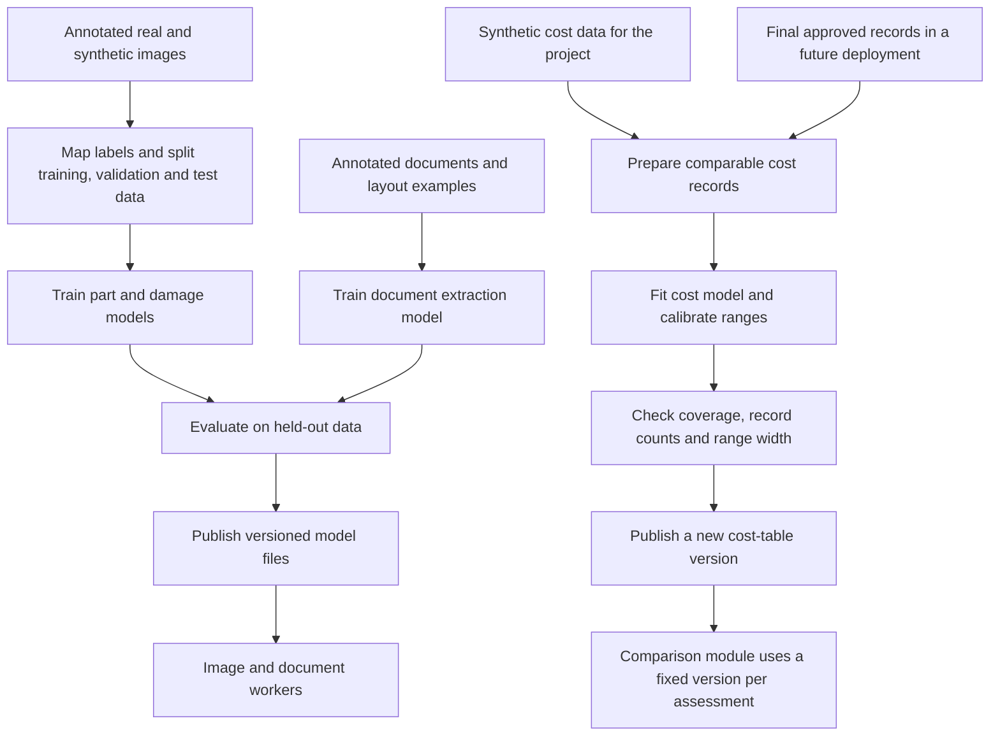

# CLAIM-CMEV

## Cross-Modal Evidence Verification of Declared Repair Scope Against Photographic Damage Evidence in Motor Own-Damage Claims

**Project Proposal**

| | |
|---|---|
| **Group ID** | ACERY |
| **Members** | Divakaran Pillai Arunkumar; Miguel Rodel Felipe; Lau Lay Khoon; Lim Chong Jen; Sun Yan |
| **Programme** | NUS-ISS Graduate Certificate in Pattern Recognition Systems |
| **Modules** | PSUPR, PRMLS, ISSM |
| **Document version** | v1, for submission |

**In plain terms:** CLAIM-CMEV checks the repairs and costs listed in a motor survey report against damage photographs and reference repair costs. It gives the surveyor findings to review, with links to the evidence.

CMEV stands for **Cross-Modal Evidence Verification**. “Cross-modal” means using different types of evidence: images and document text. CLAIM identifies the motor-claims application; it is not an acronym.

---

## 1. Executive summary

A motor own-damage claim covers damage to the policyholder's own vehicle. The workshop prepares an estimate, a surveyor inspects the vehicle and assesses the repairs, and a claim handler approves the claim. The surveyor's work includes identifying damaged parts, checking repair entries, negotiating costs, and preparing a report.

CLAIM-CMEV aims to reduce the manual work involved in preparing and checking that report. It processes the photographs and report separately, then compares their results. The photograph-processing modules identify vehicle parts and visible damage. The document-processing modules extract each repair entry: the part, the proposed operation, and the declared cost. A comparison module checks whether the photographs support the repair entry and whether the cost falls within a reference range.

The system presents four possible results for each declared entry: no discrepancy found, photographic support missing despite adequate coverage, cost outside the reference range, or insufficient evidence to assess the entry. Visible damage missing from the report is shown separately as a possible repair-list addition. The surveyor reviews the evidence, corrects the list, and records the agreed amounts. Claim approval remains with the claim handler.

The project will deliver nine functional modules and the supporting application components needed to connect them: file intake, background processing, data storage, review APIs, and model and cost-table versioning. The prototype will include three working screens: vehicle overview, repair-list review, and evidence viewer. Section 10 defines how these components fit together.

A longer-term product could build a repair-cost history from reviewed claims and final approved amounts. This would support comparisons between similar repairs. The project will demonstrate that process using synthetic cost data because the team does not have a suitable public dataset linking damage photographs to settled repair costs. Results will therefore show whether the comparison logic works, not whether the system predicts real repair prices accurately.

The intended benefits are less manual preparation, more consistent checks, and reusable part-level records. Model accuracy, editing effort, and review usability will be evaluated within the project. Actual time savings and financial benefits require a deployment study.

---

## 2. Problem statement and motivation

### 2.1 The problem

The surveyor reviews the workshop's estimate, inspects the vehicle, identifies damaged parts, assesses repair or replacement, and negotiates costs. These tasks require both visual recognition and professional judgement.

The project addresses two limitations in this workflow:

- **Repeated manual checks.** Surveyors compile parts lists and compare repair entries with photographs. Automating parts of this work could leave more time for repair decisions and negotiation.
- **Records that are difficult to compare.** Photographs and PDF reports may be retained without a consistent record linking the vehicle, damaged part, repair operation, and cost. Historical claims are then difficult to use as references for a new repair entry.

For example, a total claim payment of S$2,400 does not show how much was paid to refinish a front bumper. A record linking the bumper, damage type, vehicle model, operation, and approved cost would be more useful for checking a later bumper quote.

### 2.2 Which repair amount does the system check?

**The system checks the repair costs declared in the surveyor's report.** Three amounts occur at different stages of a claim:

1. **Workshop estimate:** the workshop's initial proposed repairs and prices. This is the starting point for the surveyor's review and negotiation.
2. **Surveyor's declared estimate:** the repairs and costs recorded in the survey report. CLAIM-CMEV compares these entries with the photographs and reference cost ranges.
3. **Final approved amount:** the amount the claim handler approves after review. It becomes available later and can be used to update the historical cost reference.

The distinction prevents the system from treating an opening quote as an approved repair cost, or using a claim's eventual outcome while assessing that same claim. A surveyor-agreed amount is stored as a reviewed estimate until final approval is recorded. For the project demonstration, final approval is represented by clearly labelled test records; integration with an insurer's approval system is outside scope.

### 2.3 What the system checks

A **repair entry**, also called a **line item**, contains a part, an operation such as repair or replacement, and a cost. The complete repair list is the **declared repair scope**.

| Check | Question | Example finding |
|---|---|---|
| Photographic support | Is damage visible on a declared part, in photographs clear enough to assess it? | An adjacent panel is listed for repair, but no damage is detected in the views covering it |
| Cost range | Is the declared cost within the reference range for a comparable repair? | The price exceeds the range for the same part, operation, damage type, and vehicle class |
| Missing repairs | Is visible damage absent from the report? | A damaged rear door is not listed |

Adding an undamaged adjacent panel is sometimes called **panel spillover**. A declared part without supporting damage may be called a **phantom part**. A cost discrepancy could involve excess labour hours or **grade substitution**, such as charging for an original equipment manufacturer (OEM) part when an aftermarket part is fitted. The system identifies entries for review; a cost flag alone cannot establish these causes.

If a part is not visible, is obscured, or appears only in poor-quality photographs, the result is **insufficient evidence**. The system requests a useful additional view instead of flagging an unsupported repair.

### 2.4 Industry context

The General Insurance Association of Singapore (GIA) reported motor insurance gross written premiums of S$1.28 billion in 2025, representing 20.9% of Singapore's domestic general insurance market. The segment recorded an underwriting loss of S$6.9 million, while net incurred motor claims increased by 11% despite the number of motor accidents recorded by GIA remaining broadly stable. GIA materials have also estimated that insurers pay up to S$140 million annually for inflated and fraudulent motor insurance claims.

Repair costs can increase for valid reasons, including electric vehicle (EV) batteries, structural aluminium, and advanced driver-assistance systems (ADAS) such as sensors in bumpers and windscreens. Aggregate claim totals cannot by themselves separate these increases from inflated repair entries. Linking damage and repair costs at part level could help insurers investigate the reasons for cost changes.

### 2.5 Who is affected

| Stakeholder | Problem the project addresses |
|---|---|
| Insurer | Unnecessary repair payments and limited detail for explaining changes in claims costs |
| Policyholder | Missing repairs and the potential effect of higher claims costs on premiums |
| Honest workshop | Difficulty supporting a reasonable quote with comparable repair evidence |
| Surveyor | Time spent identifying parts, preparing lists, and checking entries manually |
| Regulator / GIA | Limited structured evidence for analysing repair-cost trends |

### 2.6 What the system does not do

- Approve or reject a claim, choose a settlement amount, or replace the surveyor's repair judgement.
- Treat an unphotographed part as an undamaged part.
- Detect staged collisions, false passenger claims, or fraud at policy inception.
- Train on fraud outcomes. The project has no fraud labels; unusual costs are identified from reference cost patterns.

### 2.7 Valid reasons for a mismatch

A declared repair or cost may be reasonable even when external photographs do not explain it. The review workflow must allow the surveyor to record:

- Hidden structural or mechanical damage found after dismantling the vehicle.
- ADAS calibration, EV inspection, or specialist repair procedures.
- Changes in parts prices or availability.
- Poor lighting, obstruction, dirt, water, or missing photographic views.

These explanations remain part of the assessment record. The system must withhold a judgement when the available evidence cannot support one.

### 2.8 Why the project is feasible

Claim workflows already produce photographs and reports. Public datasets provide training examples for identifying vehicle parts, locating damage, and extracting document fields. The project connects these tasks through shared part names and a comparison engine. Its contribution is the complete, traceable check of declared repair entries against the available evidence.

---

## 3. Project goals

### 3.1 Primary goal

Build a working pipeline that reads a claim's photographs and survey report, checks each declared repair entry, and presents the findings with supporting evidence for surveyor review.

### 3.2 Technical objectives

1. **Identify vehicle parts.** Label the image regions belonging to each supported vehicle part.
2. **Identify damage.** Label damage type and affected area, then match each damage region to its part.
3. **Combine views.** Merge observations across photographs of the same vehicle without counting the same damage repeatedly.
4. **Extract repair entries.** Read each part, operation, and cost from the report, keeping the source page and location.
5. **Build reference cost ranges.** Estimate lower and upper bounds for comparable repairs and report how many records support each range.
6. **Compare the results.** Check photographic support, costs, and missing repairs. Explain findings and withhold judgement when evidence is insufficient.
7. **Store reviewed records.** Save surveyor corrections and agreed amounts, and support a separate update using final approved costs.

### 3.3 Product objectives

8. Build the vehicle overview, repair-list review, and evidence viewer using real model output.
9. Specify the remaining screens and audit view, with static mockups showing their intended behaviour.
10. Describe and evaluate the workflow steps where the system could reduce manual effort.

### 3.4 Research questions

- **RQ1:** Are the part and damage models accurate enough to produce a useful vehicle damage summary? How do photograph quality and coverage affect the result?
- **RQ2:** Does training with synthetic images labelled for both parts and damage improve the matching of damage regions to vehicle parts?
- **RQ3:** How well does combining views remove duplicate detections, and what errors remain in the vehicle summary?
- **RQ4:** How useful are the cost flags, and how does their precision change when fewer comparable reference records are available?

### 3.5 What is outside the project scope

Production deployment, real-time processing guarantees, integration with a live claims-management system, automated settlement, detection of non-visual fraud, and inference of hidden structural damage are outside scope. The project also cannot validate repair-cost accuracy against real workshop invoices with the data currently available (§12.4).

---

## 4. Mapping to course requirements

The proposal targets the course's minimum of three of four required aspects and aims to demonstrate all four. The table lists the proposed methods and also identifies the intelligent sensing contribution. The grouping and the treatment of cost anomaly detection should be confirmed against the assessment rubric before submission.

| Aspect | Proposed implementation | Evidence for assessment |
|---|---|---|
| Supervised learning | Part segmentation (Module 1), damage segmentation (Module 2), line-item recognition (Module 5), and cost regression (Module 6) | Trained models and results on data kept separate from training |
| Unsupervised learning | Cost anomaly detection without fraud labels (Module 7); course classification to confirm | Cost deviation scores, flag rates, and results on deliberately altered repair entries |
| Machine learning / deep learning | SegFormer for image segmentation; LayoutLMv3 or Donut for document extraction; gradient boosting for costs | Model design, training results, and comparisons between configurations |
| Hybrid / ensemble approach | Combine the independently trained image and document outputs in Module 8 | Compare the combined result with each branch used alone |
| Intelligent sensing / sense-making | Combine many photographs into one vehicle damage summary in Module 3 | Duplicate-removal results and accuracy of the vehicle summary |

**Supervised cost prediction and anomaly detection are different steps.** Module 6 learns a range from cost examples. Module 7 checks for unusual values relative to that range. Neither uses fraud outcomes, but the absence of fraud labels does not by itself make cost regression unsupervised. The team must confirm that the selected anomaly method meets the course requirement.

**The image and document models meet after prediction.** Each produces a structured result, and the comparison engine combines those results. This is called decision-level fusion. It allows findings to retain links to their source photographs and report entries.

---

## 5. Proposed product and commercial model

### 5.1 Product purpose

CLAIM-CMEV is proposed as decision-support software for motor insurers. Its primary purpose is to help surveyors prepare and check repair assessments. Structured records created during review would also support repair-cost analysis over time.

The immediate benefit to evaluate is reduced manual effort. The longer-term benefit is a growing history of comparable repairs and approved costs. Both are intended outcomes that require evidence from deployment.

### 5.2 Value to buyers

| Buyer | Intended benefit | Measure |
|---|---|---|
| Head of Motor Claims | More assessments completed with the available surveyors | Claims completed per surveyor; turnaround time |
| Chief Underwriting Officer | More detail on changes in repair costs | Cost trends by part, operation, and vehicle class |
| Head of Special Investigation Unit (SIU) | Consistent screening of repair entries | Review coverage and investigation yield |
| Risk / Compliance | Assessments that can be reconstructed and explained | Completeness of evidence and review records |
| Chief Financial Officer | Fewer unnecessary repair payments | Validated change in avoidable cost per claim |

### 5.3 Commercial model

The proposed pricing is a platform fee plus a charge per claim processed. Each insurer owns its reference cost data, which is kept separate from other customers' data. A commercial deployment would run inside the insurer's environment or in a dedicated customer environment, with controlled access to claim documents and photographs.

### 5.4 Deployment stages

| Stage | What happens | Evidence needed before progressing |
|---|---|---|
| Pilot in shadow mode | Process a limited set of claims without showing findings to surveyors | Compare results with existing assessments and measure errors |
| Assisted review | Show proposed parts lists, findings, and evidence | Measure review effort, corrections, and surveyor feedback |
| Cost-history updates | Add eligible final approved records to new cost-table versions | Check record quality, coverage, and price-range calibration |
| Portfolio reporting | Summarise cost trends for claims and underwriting teams | Confirm that trends have sufficient data and a clear interpretation |

These stages describe a future commercial rollout. The project demonstrates processing, review, and a controlled cost-reference update using test data.

### 5.5 Product limits

CLAIM-CMEV checks an existing repair assessment. It does not generate a settlement amount. It cannot explain costs caused by damage that is invisible in the supplied evidence, and it cannot prove inflation from a price difference alone. Reference ranges also depend on the quantity, quality, and age of their source records.

---

## 6. Users and personas

| ID | User | Role |
|---|---|---|
| **P1** | **Surveyor / motor assessor** | Primary user. Reviews parts and findings, checks evidence, corrects entries, and records agreed amounts |
| P2 | Claims executive / handler | Uses the reviewed assessment and records the final approval |
| P3 | SIU investigator | Examines selected claims and their supporting records |
| P4 | Claims operations manager | Monitors claim progress, processing time, and review patterns |
| P5 | Model risk / compliance officer | Reviews evidence, model versions, cost-table versions, and human decisions |
| P6 | Workshop manager | Receives questions about specific repair entries during negotiation |
| P7 | Policyholder | Indirect beneficiary of complete repairs and efficient assessment; does not operate the system |

### 6.1 Primary user: the surveyor

The surveyor works near the vehicle, usually with a tablet or phone. Lighting and network coverage may be poor, and other vehicles may be waiting. The interface must support quick review and access to original evidence.

The surveyor needs to identify all relevant damage, assess repair or replacement, negotiate reasonable costs, and explain the final assessment. The system is useful only if its proposed list saves work and its findings are easy to verify or correct.

---

## 7. Surveyor workflow

### 7.1 Current workflow

The timings below are planning estimates from the proposal and still require validation with a practising surveyor.

| Step | Current activity | Estimated time | Proposed support |
|---|---|---|---|
| 1 | Travel to workshop | 30–60 min | None |
| 2 | Inspect the vehicle | 10–20 min | Evidence available for reference |
| 3 | Photograph the damage | 10–15 min | Indicate missing or inadequate views |
| 4 | Compile the parts list | 15–25 min | Propose damaged parts from photographs |
| 5 | Check repair entries | 15–30 min | Compare the declared assessment with evidence and costs |
| 6 | Negotiate repairs and prices | 15–45 min | Show evidence and reference ranges |
| 7 | Prepare the report | 20–30 min | Save structured entries and produce an assessment export |
| 8 | Submit the assessment | About 5 min | Retain the reviewed record and its evidence links |

### 7.2 Proposed workflow

The photograph-based parts list can be prepared before a survey report exists. Full comparison starts only when a draft survey report or surveyor-entered repair list is available. This distinction avoids requiring a completed report before the surveyor can use the parts-list assistance.

### 7.3 Example review

An illustrative cost finding could read: “Quarter panel repair declared at S$1,150. Reference range: S$620–S$890, based on 47 comparable records.” The surveyor can inspect the damage photographs and reference information, then accept the finding or dismiss it with a reason.

An illustrative photographic finding could read: “No damage detected on the front bumper in four adequate covering views.” The linked photographs let the surveyor check the model's result. If the bumper cannot be assessed from those photographs, the interface asks for better evidence instead.

After negotiation, the surveyor records the agreed repair entries. The system preserves both the original entries and the reviewed values. Final approved amounts are recorded separately when they become available (§2.2).

### 7.4 What will determine adoption

- The proposed parts list must save more editing work than it creates.
- Each finding must explain the issue and link directly to the supporting evidence.
- A surveyor must be able to correct an entry or dismiss a finding without unnecessary steps.
- A dismissed finding must not reappear unchanged on the same assessment revision.

---

## 8. User interface specification

The product design contains six screens and an audit view. The prototype implements Screens 2, 3, and 4. The other views are static mockups.

### 8.1 Screen 1 — Claim queue

**Users:** P1, P4. Show claim reference, vehicle, photograph count, processing state, and finding count. Distinguish queued, processing, ready, incomplete, and failed claims. A processing failure must not appear as a completed assessment with no findings.

### 8.2 Screen 2 — Vehicle overview

**User:** P1. Show a vehicle diagram with damaged parts highlighted and a coverage indicator for each supported part. Separate “damage detected”, “no damage detected in adequate views”, and “not assessable”. List possible damaged parts not yet included in the repair report.

### 8.3 Screen 3 — Parts list and comparison

**User:** P1. Show one row per declared entry with part, operation, declared cost, result, reference range, and review action. Keep the original declared value visible when an entry is edited.

| Internal result | Display label | Review action |
|---|---|---|
| `ok` | No discrepancy found in the available checks | Confirm or edit |
| `unsupported` | No visible damage detected in adequate views | View evidence; accept or dismiss finding |
| `cost_outlier` | Cost outside reference range | View range and supporting record count; accept or dismiss finding |
| `insufficient_evidence` | More information needed | Request a view, correct extraction, or record a manual assessment |

`insufficient_evidence` is informational and must look different from a discrepancy flag. Its explanation identifies whether the missing information is photographic, documentary, or cost-related.

Show possible missing repairs in a separate list because they have no declared report row yet. The surveyor can add, edit, or dismiss a proposed entry. Record additions and removals for evaluation; an addition is not automatically a model error, since it may reflect newly discovered hidden damage.

**Dismissal:** selecting a reason records the dismissal without another confirmation step. The proposed reasons are hidden damage, ADAS or calibration cost, parts price change, inadequate photograph, system error, and other. The team will agree the final list before implementation.

### 8.4 Screen 4 — Evidence viewer

**Users:** P1, P3. Show the relevant photographs with part and damage overlays. An overlay is a coloured region marking the model's prediction. Allow one-tap access to the original photograph and navigation through all views covering the part. Also show the source report page with the declared entry highlighted.

### 8.5 Screen 5 — Cost range detail

**Users:** P1, P3. Show the declared amount against the lower and upper reference bounds, the number of supporting records, the comparison criteria, currency, and cost-table date and version. A distribution chart can show how comparable approved costs are spread within and around the range. Synthetic demonstration data must be labelled as synthetic.

### 8.6 Screen 6 — Operations dashboard

**Users:** P4, P5. Show claims processed, processing and review times, findings by type, dismissal rates, and reference-data coverage. Review dismissal rates alongside finding counts: a high count alone does not show useful performance.

### 8.7 Audit view

**User:** P5. For a historical assessment, show its input revision, original and edited entries, findings, linked evidence, model and cost-table versions, reviewer actions, reasons, and approval status. These records allow a later reviewer to reconstruct the assessment.

### 8.8 Interface requirements

| Requirement | Reason |
|---|---|
| Large controls and text readable on a tablet | The surveyor may be standing beside a vehicle |
| Clear display in bright and dim conditions | Workshop lighting varies |
| Preserve unsent edits during a connection interruption and show retry status | A failed submission must not lose review work |
| Dismiss a finding by selecting its reason | Keep repeated review actions quick |
| Open the original photograph in one tap from a photographic finding | Support independent inspection |
| Show the assessment and cost-table versions | Identify which results are being reviewed |
| Separate processing failure, missing evidence, and a completed check | Prevent incomplete work from appearing as a successful assessment |

### 8.9 Excluded interface behaviour

The interface does not recommend a settlement amount, assign a fraud probability to a payout, rank workshops by suspicion, or escalate a claim automatically. Payment and escalation decisions require human action.

### 8.10 Prototype scope

Screens 2–4 will use actual pipeline results. The prototype will support evidence navigation, edits, dismissals, review persistence, and a basic structured assessment export. Screens 1, 5, 6, and the audit view will be static mockups; the underlying evidence and review records will still be stored for testing.

The prototype will demonstrate preservation and retry of unsent review edits. Full offline file synchronisation, production identity integration, live claim approval, and insurer-specific report generation are outside the build scope.

---

## 9. Solution overview

The system uses separate image and document models, followed by explicit comparison rules. This allows each model to use an appropriate training dataset and makes it possible to trace a finding to a photograph, report entry, and cost-table version.

The system answers two different questions. Photographs support a judgement about **visible damage**. Historical records support a judgement about **cost comparability**. Neither establishes that a particular repair operation is technically required; the surveyor retains that decision.

### 9.1 Decision flow for a declared repair entry

The engine stores each check separately as well as the overall result. For example, an entry may have photographic support but insufficient cost history. The interface must show that distinction rather than imply that no check was completed.

### 9.2 Finding repairs missing from the report

The engine also compares the vehicle damage summary with the declared list in the reverse direction. A supported damage observation with no matching repair entry becomes a proposed addition for surveyor review. It keeps its photograph references and is not assigned an invented declared cost.

---

## 10. Architecture and data flow

### 10.1 Components and deployment boundaries

A **module** is a unit of functionality. A **microservice** is a separately deployed application with its own interface. The nine functional modules in §11 do not require nine microservices.

For this project, use a workbench application, a backend application, an image-processing worker, and a document-processing worker. A worker runs longer tasks in the background so that the interface can remain responsive. Cost-model training and reference-table refresh run as offline jobs. This design allows image and document processing to run independently while keeping deployment manageable for five members.

The arrows show data access and task submission. The backend contains the job coordinator, comparison rules, cost lookup, and review API. The job coordinator starts comparison only after the required worker results for the same claim revision are available. The queue can be a persistent job table for the prototype; it does not require a separate message-broker service.

| Component | Responsibility | Input → output | Deployment / owner |
|---|---|---|---|
| Workbench | Display results and collect review actions | Assessment and evidence → corrections, decisions, and agreed amounts | Frontend; Lane 5 |
| Claim intake and review API | Validate uploads, create claim revisions, retrieve evidence, save reviews, and export assessments | Files, vehicle details, and user actions → stored records and job identifiers | Backend; Lane 5 |
| Job coordinator | Schedule work, track completion, retry failed tasks, and start comparison | Claim revision → processing states and completed assessment | Backend; Lane 5 |
| Image analysis | Check image quality; identify parts and damage; combine views and assess coverage | Photographs → part coverage and vehicle damage observations | Image worker, Modules 1–3; Lanes 1–2 |
| Document analysis | Read text and layout; extract and normalise repair entries | Survey report → entries with source locations and extraction confidence | Document worker, Modules 4–5; Lane 3 |
| Cost lookup and comparison | Retrieve comparable ranges; check evidence, costs, and missing repairs | Normalised entries, observations, and ranges → explained findings | Backend, Modules 7–8; Lane 4 |
| Review and approval records | Preserve original entries, surveyor decisions, and separately supplied final approvals | Review actions or approval import → versioned history and eligible cost records | Backend; Lane 5 with Lane 4 |
| Training and reference refresh | Train and evaluate models; build new cost-table versions | Training data or eligible approved records → evaluated model files and cost ranges | Offline jobs, including Module 6; relevant model lanes |
| Shared storage | Retain files, metadata, results, job states, and version identifiers | Component reads and writes → retrievable evidence and reproducible assessments | File storage and relational database; Lane 5 |

Part-name mapping is a shared library and versioned mapping file used by both workers and the comparison engine. Lane 4 owns it with input from Lanes 1–3. It must preserve side information, such as left or right, and mark unknown parts rather than forcing an incorrect match.

### 10.2 Data flow when processing a claim

1. **Intake:** assign stable identifiers to the claim, each file, and the input revision. Validate file type, readability, vehicle metadata, and monetary fields. Keep the original files.
2. **Image analysis:** record image dimensions and quality limitations; identify parts and damage; match damage regions to parts; merge repeated views; store coverage even when no damage is detected.
3. **Document analysis:** read each page, group fields into repair entries, and map names to the shared vocabulary. Retain original text and page coordinates so the surveyor can check extraction errors.
4. **Comparison:** combine results for the same input revision, retrieve a fixed cost-table version, apply the checks in §9.1, and identify possible missing entries (§9.2).
5. **Review:** show stored results and evidence. Save user actions separately from model predictions. New photographs or changed declared entries create a new assessment revision; prior results remain available.
6. **Later approval:** record final approved amounts through a controlled import. Eligible records are included in a later cost-reference refresh, not in the assessment that originally checked them.

For photographs without a report, complete image analysis and show the proposed damage list. Mark comparison as awaiting declared entries. If a worker fails, retain the successful branch's result but show the overall assessment as incomplete until the required work succeeds.

### 10.3 Data exchanged between modules

Every processing result carries the claim ID, input revision, processing status, schema version, and relevant model or mapping versions. A schema defines the fields and their meanings so that independently built modules can exchange compatible records.

| Record | Required information | Why it is needed |
|---|---|---|
| Claim input | Claim ID, vehicle make/model/year, available vehicle features, file IDs, currency, input revision | Associates all inputs with one vehicle and processing run |
| Part coverage | Normalised part and side, covering photo IDs, part-mask references, visibility/quality state, reason | Distinguishes an adequately photographed part from an unseen or unassessable part |
| Damage observation | Observation ID, part and side, damage type, confidence, affected area, photo IDs, mask references, duplicate-group ID | Describes damage once while preserving every supporting view |
| Declared repair entry | Stable entry ID, original and normalised part names, side, operation, amount, currency, extraction confidence, page and bounding box | Supports reliable matching and navigation back to the report |
| Reference cost range | Comparison key, lower/upper bounds, currency, record count, calibration level, as-of date, table version, synthetic-data marker | Shows whether a cost comparison is relevant and sufficiently supported |
| Assessment finding | Finding ID, entry or observation ID, results of individual checks, overall result, reason, evidence references, applied cost range and versions | Drives the interface and allows the finding to be reproduced |
| Review / approval | Assessment revision, reviewer, timestamp, action, reason, original and edited values, agreed amount, approval status, final approved amount when available | Separates machine results, surveyor judgement, and final approval |

A bounding box is the rectangular location of text on a report page. A mask is the region of an image assigned to a part or damage type. Store file references to these artefacts rather than copying large images into database records or queue messages.

**Cost matching:** compare the same part, side where relevant, operation, damage type, vehicle class, and currency. Repair and replacement must not share a range by default. Preserve available quantity, labour, and parts-grade information; if the report and reference table use incompatible cost units or required fields are missing, withhold the cost check and explain why. Do not infer a missing damage label in a price dataset without documenting how it was obtained.

**Missing values:** an unavailable cost range is stored as absent, not as a zero-price range. Possible missing repairs reference an observation and have no declared entry ID or amount until the surveyor adds them.

### 10.4 Training and reference-data updates

Training runs separately from claim processing. Serving workers load an evaluated model version; they do not retrain while a surveyor waits.

Use separate training, calibration, and test partitions. Keep photographs of the same vehicle together when vehicle identifiers are available. Keep related synthetic views and report templates together to avoid testing on near-duplicates of training examples. Record where source datasets lack the identifiers needed to guarantee separation.

Cost refresh reads eligible final approved entries, excludes duplicate and superseded records, and gives recent records appropriate weight. Surveyor dismissals and unapproved estimates do not automatically become approved cost examples. Publish a new table version after evaluation; preserve earlier versions so past findings can be reproduced. The demonstration uses a controlled synthetic approval import to exercise this path.

### 10.5 Storage and failure handling

- **File storage:** original photographs and reports, rendered report pages, predicted masks, and assessment exports.
- **Relational records:** claims, file metadata, job states, coverage, observations, repair entries, findings, reviews, approval imports, and reference cost tables.
- **Versioned model storage:** model files, label mappings, training configuration, and evaluation results.

Task retries must not create duplicate observations, reviews, or cost records. Use stable record IDs and a unique job key consisting of claim, revision, task, and model version. A stale worker result may be retained for its own revision but must not replace the current assessment.

A cost-table update must not silently change an assessment already under review. Reassessment creates a new result revision and records the newly applied table version. Access to files and records is checked through the backend; a future multi-insurer deployment must also enforce customer separation.

---

## 11. Functional modules

The modules below implement the technical objectives. Section 10.1 shows which application or worker runs each module.

### Module 1 — Vehicle part segmentation

**Purpose:** identify vehicle parts in a photograph by labelling their pixels. This is called semantic segmentation.

**Method:** fine-tune SegFormer on annotated part images. Use a shared image-training pipeline with Module 2, with separate labels and model outputs.

**Initial classes:** the 21 HITL categories are windshield, back-windshield, front-window, back-window, front-door, back-door, front-wheel, back-wheel, front-bumper, back-bumper, headlight, tail-light, hood, trunk, licence-plate, mirror, roof, grille, rocker-panel, quarter-panel, and fender.

**Output:** part masks, confidence, and photograph references. HITL does not distinguish left and right sides; the shared vocabulary and supplementary labels must address this, or mark the side as unresolved.

### Module 2 — Damage segmentation and part matching

**Purpose:** locate damage and associate it with a vehicle part.

**Method:** fine-tune SegFormer for eight initial damage classes: dent, cracked, scratch, flaking, broken part, paint chip, missing part, and corrosion. Find the overlap between damage and part masks. For example, a scratch region overlapping a front-door region becomes a front-door scratch observation.

**Output:** per-image part, damage type, affected area, confidence, and mask references. Evaluate dents, scratches, and cracks separately because they may look similar or occur together. RQ2 tests whether joint part-and-damage labels improve this matching step.

### Module 3 — Multi-view aggregation and coverage

**Purpose:** combine photographs into one vehicle damage summary and record which parts can be assessed.

**Method:** investigate mapping single-view detections onto a common 3D vehicle representation and merging detections that occupy the same region, following van Ruitenbeek and Bhulai. Use controlled multi-view images from CrashCar101 for development and evaluation where real grouped photographs are unavailable. Record the limits of applying this method to uncontrolled workshop views.

**Output:** merged damage observations, supporting photographs, and a separate coverage record for each supported part. Coverage considers visibility, image quality, and unresolved side or part identity. It must include visible parts without detected damage; a damage-only list cannot distinguish these from unphotographed parts.

### Module 4 — Document text and layout extraction

**Purpose:** read text and preserve its position on survey-report pages.

**Method:** use optical character recognition (OCR) for scanned pages and retain page layout and word coordinates. Extract available embedded PDF text where suitable. If the selected document model reads page images directly, preserve an equivalent route back to the source entry.

**Output:** page text, word or region locations, reading order, and extraction-quality indicators. Unreadable content is marked for correction.

### Module 5 — Repair line-item recognition

**Purpose:** group document fields into complete repair entries.

**Method:** adapt LayoutLMv3 or Donut using DocILE and survey-report layout examples. Map extracted part names and operations to the shared vocabulary while retaining the original text. Preserve quantity, labour, and parts-grade fields when available.

**Output:** part, operation, amount, currency, confidence, stable entry ID, and source-page location. Missing or uncertain required fields are exposed for review before cost comparison.

### Module 6 — Reference cost model

**Purpose:** provide a lower and upper cost bound for a comparable repair, rather than a single predicted price.

**Method:** train a gradient-boosting model with quantile regression or conformal prediction to construct prediction intervals. A prediction interval is a range intended to contain a stated proportion of comparable costs. Check its actual coverage on held-out data.

**Input:** the documented synthetic cost table for the project (§12.4). Separate repair and replacement and retain currency and cost units. Confirm which part, damage, operation, and vehicle combinations the data actually supports.

**Output:** versioned ranges with supporting record counts, dates, comparison criteria, and calibration results. Unsupported combinations have no range.

### Module 7 — Cost anomaly detection

**Purpose:** identify declared costs outside a sufficiently supported reference range.

**Method:** compare each eligible amount with Module 6's bounds and calculate its deviation. No fraud outcomes are used. Missing ranges, incompatible cost units, or inadequate reference counts produce a withheld cost check rather than a cost flag.

**Output:** within-range, outside-range, or insufficient-support result, with the applied bounds and reason. The team must confirm the course classification of this anomaly method (§4).

### Module 8 — Evidence comparison

**Purpose:** combine the image findings, declared repair entries, and cost results.

**Method:** apply the ordered checks in §9.1 and the reverse comparison in §9.2. Preserve individual check outcomes. An uncertain extraction or an unassessable part must not become an unsupported-repair flag.

**Output:** explained findings with report locations, photographs, masks, and cost-table references; plus possible missing repairs for review. This module implements decision-level fusion of the two model branches.

### Module 9 — Surveyor workbench and review capture

**Purpose:** let a surveyor inspect the results and record a reviewed assessment.

**Method:** implement Screens 2–4 against the backend API. Support evidence overlays, original images and report pages, edits, additions, dismissals with reasons, and agreed amounts. Keep user decisions separate from model predictions.

**Output:** a stored review revision and basic assessment export. A later approval import supplies final approved cost records for the refresh path. The remaining screens are static mockups (§8.10).

---

## 12. Data sources and limitations

The tables below retain the dataset sizes and licence information recorded in the proposal. Outstanding access and licence checks are listed in §16; this document revision does not verify the releases or their terms.

### 12.1 Vehicle part images

| Dataset | Recorded contents | Classes | Recorded licence / access | Planned use |
|---|---|---|---|---|
| HITL Car Parts and Car Damages | 998 part images and 814 damage images; polygon masks; 24,851 polygons | 21 part classes and 8 damage classes | CC0 1.0 | Primary part dataset and supplementary damage data |
| DSMLR Car-Parts-Segmentation | Multi-view images; COCO-format masks; anonymised plates and faces | 18 part classes, including side information | Research use; GitHub release | Supplementary part and side labels |
| Ultralytics Carparts-Seg | 3,833 images with masks and predefined splits | 23 classes | AGPL-3.0 | Reserve; assess licence implications before use |

These labels do not cover every component priced in a survey report. Examples include pillars, wheel arch liners, radiator supports, and ADAS mounts. Build an explicit mapping between dataset labels and report terms. Unmapped parts or unresolved sides remain unassessable unless suitable additional labels are available.

### 12.2 Damage images

| Dataset | Recorded contents | Classes | Recorded licence / access | Planned use |
|---|---|---|---|---|
| VehiDE | 13,945 images; more than 32,000 labelled instances | 8 damage classes | Kaggle mirror; original terms to verify | Main source by volume, subject to licence confirmation |
| CarDD | 4,000 high-resolution images; more than 9,000 instances | 6 damage classes | Signed licensing form required | Supplementary high-quality damage data, subject to access |
| CrashCar101 | Generated images of damaged 3D vehicles, with part and damage labels | Configurable | Academic release associated with WACV 2024 | Joint labels and controlled multi-view experiments |

Different datasets use different damage categories and annotation formats. Convert them to the project vocabulary and document categories that cannot be mapped reliably.

Image quality is relevant to the task itself: small damage may be invisible in low-resolution or blurred photographs. Record quality limitations when assessing coverage. CrashCar101 offers controlled labels and views, but improvements on generated images must be tested on real photographs before claiming transfer to workshop conditions.

### 12.3 Photographs grouped by vehicle

The team has not identified a suitable public claim-level damage dataset containing complete photograph groups for each vehicle. Module 3 needs such groups to evaluate repeated views of the same damage.

Use CrashCar101 to construct controlled groups and investigate the single-view projection method in Module 3. The method choice and the availability of real grouped test images remain open. Results from synthetic groups must be reported separately from results on real vehicles.

### 12.4 Repair-cost data and the initial reference table

The team has not identified a suitable public dataset pairing damage photographs with final repair costs at line-item level. The literature cited in this proposal identifies limited access to repair data as a constraint.

**Assumption A1 — initial cost history:** a future insurer deployment has historical approved repair records from which an initial reference table can be prepared. CLAIM-CMEV can then add eligible records from subsequent approved claims.

Preparing that history requires normalising part names, repair operations, vehicle categories, currencies, and cost units. Historical claim totals alone do not provide the part-level evidence required by this project. The availability and quality of suitable insurer records remain deployment assumptions.

The project plans to use a **synthetic `prices_dataset.csv`**, described in the current design as 630 rows covering 18 parts, 5 vehicle models, 7 model years, and 3 workshops. Confirm the row structure, whether workshop quotes are columns or separate rows, and how operation and damage type are represented. Do not assume all combinations exist.

Synthetic prices allow the team to test whether the engine flags an amount outside a supplied range and withholds a check when reference support is weak. They do not validate real-world repair prices, savings, or fraud detection.

Each published reference range must show its supporting record count and date. Common repairs may have more support than rare ones. New data may improve coverage and calibration, but does not guarantee narrower ranges. Retain prior table versions and evaluate each refresh before using it for new assessments (§10.4).

### 12.5 Document datasets

| Dataset | Recorded contents | Task | Recorded licence |
|---|---|---|---|
| DocILE | 6,680 annotated real documents; about 100,000 synthetic and 1 million unlabelled documents; 55 annotation classes | Field extraction, source localisation, and line-item recognition | MIT |
| CORD | 1,000 receipts, split 800/100/100; text and location annotations | Receipt field extraction; 30 entities in 4 categories | CC BY-SA 4.0 |
| SROIE | About 1,000 scanned receipts; 626 training and 347 test examples | Text recognition and extraction of company, address, date, and total | MIT |
| FUNSD | 199 scanned forms, split 149/50 | Entity extraction and linking | Non-commercial academic |

DocILE is the primary source because its line-item task is relevant to extracting repair-table entries. The other datasets support smaller document-reading benchmarks.

These datasets are business documents, receipts, and forms, not Singapore motor survey reports. Use synthetic survey reports to adapt the layout, while keeping related templates out of independent test partitions. Report performance on public benchmarks and any real survey reports separately. Synthetic-template results alone cannot establish accuracy on real reports.

### 12.6 Datasets excluded from the design

- **freMTPL2:** French third-party-liability policies and claim amounts, without damage photographs or repair entries. It cannot provide part-level own-damage repair-cost ground truth.
- **PASCAL-Part:** general natural-scene images with a coarser car-part vocabulary. HITL is the preferred starting point for this project.

### 12.7 Data sufficiency

The planned real image sources provide approximately 20,000 images, subject to access, filtering, duplicates, and compatible annotations. The team will fine-tune pretrained models rather than train from scratch. The main constraints are realistic survey reports, vehicle-grouped photographs, and real approved repair costs. Record the actual usable dataset sizes and splits in the final report.

---

## 13. Team allocation and integration plan

The five workstreams below are referred to as lanes. Member assignments remain to be confirmed.

| Lane | Responsibility | Modules / components | Member |
|---|---|---|---|
| 1 | Part labels, part segmentation, and part-mask evaluation | Module 1; image worker with Lane 2 | To confirm |
| 2 | Damage segmentation, duplicate removal, and photographic coverage | Modules 2–3; image worker | To confirm |
| 3 | Text extraction, report layout, and repair-entry extraction | Modules 4–5; document worker | To confirm |
| 4 | Shared part mapping, cost data and model, anomaly checks, and comparison | Modules 6–8; backend comparison and offline cost refresh | To confirm |
| 5 | Workbench, API, jobs, storage, review and approval import, and integration tests | Module 9; application infrastructure and evaluation harness | To confirm |

Lanes 1 and 2 share data-conversion and training code. All lanes use the record definitions in §10.3. Lane 5 provides the integration framework; each model owner supplies and tests the code that runs their module within it.

| Checkpoint | Required output |
|---|---|
| First working session | Agree part names, record schemas, cost units, processing states, and module ownership |
| First week | Connect all components using sample outputs; demonstrate upload, processing, review, and persistence |
| Model integration | Replace sample outputs with trained models; test evidence links and uncertain-input handling |
| Evaluation | Freeze test data and versions; run module, comparison, and workflow evaluations |
| Demonstration | Process an unseen test case, review its evidence, save corrections, and demonstrate a separate synthetic approval and cost refresh |

---

## 14. Evaluation and success criteria

### 14.1 Module-level metrics

**Metric definitions:** Intersection over Union (IoU) measures the overlap between a predicted image region and its labelled region; mIoU averages that score across classes. Precision measures how many predictions or flags are correct. Recall measures how many relevant items are found. F1 combines precision and recall. Average precision (AP) summarises precision across recall levels. Prediction-interval coverage measures the proportion of known costs falling inside the predicted range.

| Module | Metric | Initial target | Interpretation |
|---|---|---|---|
| 1. Part segmentation | mIoU and per-class IoU | mIoU ≥ 0.60; no panel class below 0.40 | Check each part as well as overall overlap |
| 2. Damage segmentation | mIoU, per-class IoU, and AP | mIoU ≥ 0.45 | Report dents, scratches, and cracks separately |
| 3. Multi-view aggregation | Duplicate reduction and vehicle-summary F1 | At least 90% duplicate reduction | Also measure lost or incorrectly merged damage observations |
| 5. Line-item recognition | F1 for complete entries and source-location accuracy | F1 ≥ 0.75 on DocILE line-item evaluation | Map this benchmark to repair fields explicitly; report survey-report results separately |
| 6. Cost model | Interval coverage and average range width | Coverage within 5 percentage points of the nominal 90% | With synthetic costs, this measures calibration on synthetic data only |

These are initial project targets, not achieved results. Review them after the first baseline run and document any revision. Keep the test set fixed when comparing model versions.

### 14.2 Comparison-engine evaluation

Create held-out test cases with known repair lists and damage observations. Introduce controlled discrepancies: unsupported parts, added adjacent panels, cost changes of different sizes, and omitted damaged parts. Include grade-substitution scenarios only where the test input represents parts grade; a changed price alone does not establish substitution.

Run these cases first on known structured inputs to test the comparison rules, then through the full pipeline to measure the effect of extraction and image errors. Keep these results separate. Constructed cases do not establish performance on real fraudulent claims.

| Measure | Definition | Target |
|---|---|---|
| Flag precision | Proportion of flagged entries containing an introduced discrepancy | ≥ 0.70 |
| Recall by discrepancy type | Proportion of introduced discrepancies found, including missing repairs | Report separately by type |
| False flags on clean cases | Mean number of flags per unmodified case | ≤ 0.05 flags per case |
| Correct withholding of judgement | Proportion of entries correctly marked insufficient when their parts are absent from all views | ≥ 0.95 |

Also test blurred or obstructed views, unresolved part names, uncertain amounts, missing ranges, and sparse cost history. These cases must not turn missing information into a confident discrepancy finding. Report cost-detection recall against the size of the introduced cost change.

### 14.3 End-to-end and service checks

| Check | What it establishes |
|---|---|
| Proposed-list accuracy and number of edits | How much correction is needed to reach the reviewed parts list |
| Photograph, mask, and report-page links | Whether findings point to the correct source evidence |
| Worker failure and retry | Incomplete processing is visible and retry does not duplicate records |
| New-input revision | Results from old and new photographs or reports are not mixed |
| Review save and reconnect | Corrections and reasons persist without duplicate submission |
| Approval import and cost refresh | Unapproved estimates are excluded; approved records are not counted twice |
| Reproduction of a prior assessment | The stored inputs and model, mapping, and cost-table versions explain the historical result |

These checks cover the application components introduced in §10 as well as the model outputs. They demonstrate a working prototype, not production reliability or a measured financial benefit.

### 14.4 Evaluation with fewer reference records

Repeat the cost checks with progressively fewer comparable records. Measure flag precision, interval coverage, and range width. Use the results to select the minimum support threshold for cost checks. This answers RQ4 and supplies the threshold used by Modules 7–8.

### 14.5 Usability evaluation

| Measure | Method |
|---|---|
| Review time | Compare manual preparation with workbench-assisted review on comparable cases; alternate order to reduce familiarity effects |
| Finding comprehension | Ask a reviewer to explain why a finding was raised and what evidence supports it |
| Dismissal effort | Count actions needed to dismiss a finding with a reason |
| Evidence access | Confirm that the reviewer can open original photographs and the relevant report entry |

Use practising surveyors if available. Otherwise, use team members outside the implementing lane and state this limitation. The results are preliminary workflow evidence; deployment is needed to validate actual productivity gains.

### 14.6 Model comparisons

Compare the combined pipeline with image-only and document-only checks to measure what the combination adds. Retain two experimental comparators from the original design:

- **Joint image-text model:** uses photographs and report text together to predict entry-level results.
- **Image-text alignment:** tests whether a repair entry retrieves a relevant supporting photograph in a shared representation space.

Use the same eligible held-out cases and report data limitations. These experiments do not replace the structured pipeline deliverable, and no performance advantage is assumed in advance.

### 14.7 Overall success criteria

The project succeeds when:

1. An unseen test case passes through intake, analysis, comparison, and review with evidence attached.
2. Module targets are met or any shortfall is measured and explained.
3. The ≥ 0.95 target for correctly withholding judgement on unphotographed parts is met.
4. The required course aspects are demonstrated, with the mapping confirmed against the rubric.
5. All four research questions are answered using the evaluation results.
6. The three working screens use model output, preserve review actions, and satisfy the prototype interface requirements.
7. The controlled approval and cost-refresh demonstration preserves the distinction between declared, agreed, and approved amounts.

---

## 15. Risks and mitigation

| ID | Risk and effect | Likelihood | Planned response | Owner |
|---|---|---|---|---|
| R1 | CarDD access is delayed, reducing available damage data | Medium | Request access early; proceed with accessible, licensed alternatives | Lane 2 |
| R2 | Part names or side labels cannot be matched across inputs | High | Build the shared mapping first; mark unsupported parts and unresolved sides as insufficient evidence | Lane 4 with Lanes 1–3 |
| R3 | Real survey reports are unavailable, limiting document evaluation | High | Use public document benchmarks and synthetic layouts; state the limits on real-report accuracy | Lane 3 |
| R4 | Synthetic costs are mistaken for validated repair prices | High | Label synthetic data and restrict claims to comparison logic and synthetic calibration | Lane 4 |
| R5 | Gains from generated images do not transfer to real photographs | Medium | Evaluate on separate real images and report results by data source | Lanes 1–2 |
| R6 | Multiple photographs cause duplicate or incorrectly merged damage | Medium | Measure both duplicate removal and preservation of distinct damage | Lane 2 |
| R7 | Model and application scope exceeds five members' capacity | High | Integrate sample outputs in week one; group modules into the four runtime components in §10.1 | All lanes; Lane 5 coordinates |
| R8 | Components exchange incompatible or stale records | Medium | Agree schemas early; require claim revisions and version fields; test integration and retries | Lane 5 with module owners |
| R9 | Overall damage accuracy hides failure on rare or similar classes | Medium | Report per-class metrics and evaluate class-weighted training | Lane 2 |
| R10 | Poor image quality hides damage and produces false findings | Medium | Use explicit coverage and image-quality states; test insufficient-evidence cases | Lanes 2, 4 |
| R11 | Dataset licence terms do not fit the intended use | Low for reserve dataset; checks outstanding | Verify original terms before use, including AGPL-3.0 implications for Carparts-Seg | Relevant data owner |
| R12 | Noisy findings or slow interactions discourage surveyor use | High | Evaluate corrections, comprehension, evidence access, and dismissal effort; use shadow mode before assisted deployment | Lane 5 |
| R13 | Building all proposed screens delays the demonstration | Medium | Build Screens 2–4; provide static mockups for the remaining views | Lane 5 |
| R14 | Unapproved or duplicate costs enter the reference history | Medium | Separate review and approval states; validate approval imports and refresh eligibility | Lanes 4–5 |

External photographs cannot reveal all structural or mechanical damage. They also cannot explain every legitimate specialist cost, such as an inspection or calibration procedure. These remain limits of the evidence, even if model accuracy improves.

---

## 16. Open items before submission and implementation

- [ ] Confirm member assignments and owners of the shared part vocabulary and data schemas.
- [ ] Confirm the course-requirement grouping and whether the selected cost anomaly method satisfies unsupervised learning.
- [ ] Verify and cite the GIA figures, including their applicable years and reporting status; develop a defensible per-claim cost example if data permits.
- [ ] Submit the CarDD access request and verify original dataset licences, including VehiDE and any reserve datasets.
- [ ] Complete the mapping between image labels, survey-report part names, operations, and left/right sides.
- [ ] Confirm the synthetic cost table's row structure, currencies, units, operation fields, and damage labels.
- [ ] Select the multi-view method and define separate synthetic and real evaluation sets.
- [ ] Agree the schemas in §10.3, processing-state transitions, and backend/worker interfaces.
- [ ] Define how final approval is represented in the demonstration and which records qualify for cost refresh.
- [ ] Select the image-quality and minimum cost-support thresholds through evaluation.
- [ ] Validate the surveyor workflow and timing assumptions, or document the absence of practitioner input.
- [ ] Agree the dismissal-reason list and confirm Screens 2–4 against the demonstration plan.

---

## References

- Wang, X., Li, W. and Wu, Z. *CarDD: A New Dataset for Vision-Based Car Damage Detection.* IEEE Transactions on Intelligent Transportation Systems 24(7), 2023. https://cardd-ustc.github.io/
- Huynh et al. *VehiDE Dataset: New dataset for Automatic vehicle damage detection in Car insurance.* IEEE, 2023; and *Powering AI-driven car damage identification based on VeHIDE dataset.* Journal of Information and Telecommunication 9(1), 2025.
- Humans in the Loop. *Car Parts and Car Damages Dataset* (CC0 1.0). https://humansintheloop.org/resources/datasets/car-parts-and-car-damages-dataset/
- Pasupa, K., Kittiworapanya, P., Hongngern, N. and Woraratpanya, K. *Evaluation of deep learning algorithms for semantic segmentation of car parts.* Complex & Intelligent Systems, 2021. https://github.com/dsmlr/Car-Parts-Segmentation
- Parslov, J., Riise, E. and Papadopoulos, D. P. *CrashCar101: Procedural Generation for Damage Assessment.* WACV 2024. https://crashcar.compute.dtu.dk/
- Šimsa, Š. et al. *DocILE Benchmark for Document Information Localization and Extraction.* ICDAR 2023. https://docile.rossum.ai/
- Park, S. et al. *CORD: A Consolidated Receipt Dataset for Post-OCR Parsing.* 2019.
- Huang, Z. et al. *ICDAR 2019 Competition on Scanned Receipt OCR and Information Extraction (SROIE).* ICDAR 2019.
- Jaume, G., Ekenel, H. K. and Thiran, J.-P. *FUNSD: A Dataset for Form Understanding in Noisy Scanned Documents.* 2019.
- van Ruitenbeek, R. E. and Bhulai, S. *Multi-view damage inspection using single-view damage projection.* Machine Vision and Applications 33(46), 2022.
- Hasan et al. *Vehicle Damage Detection Using Artificial Intelligence: A Systematic Literature Review.* WIREs Data Mining and Knowledge Discovery, 2025.
- Xie, E. et al. *SegFormer: Simple and Efficient Design for Semantic Segmentation with Transformers.* NeurIPS 2021.
- Huang, Y. et al. *LayoutLMv3: Pre-training for Document AI with Unified Text and Image Masking.* 2022.
