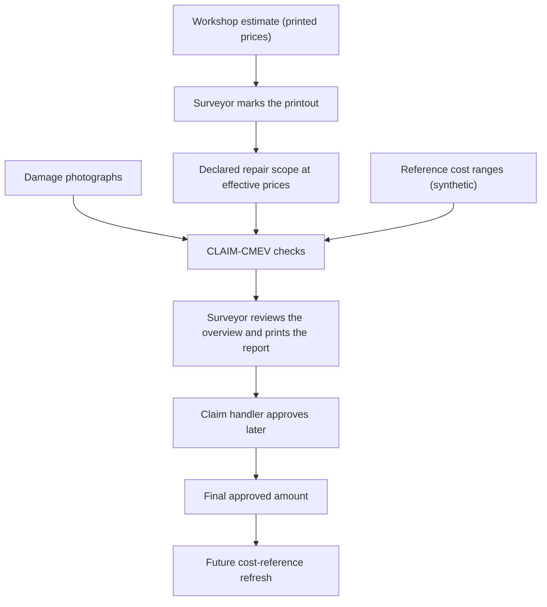
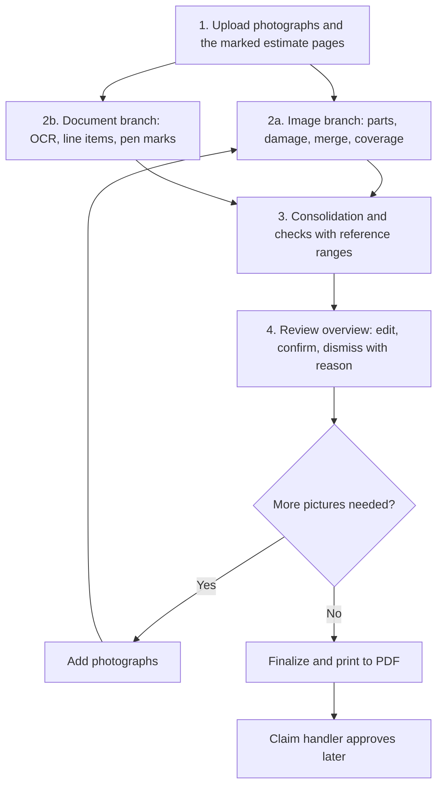
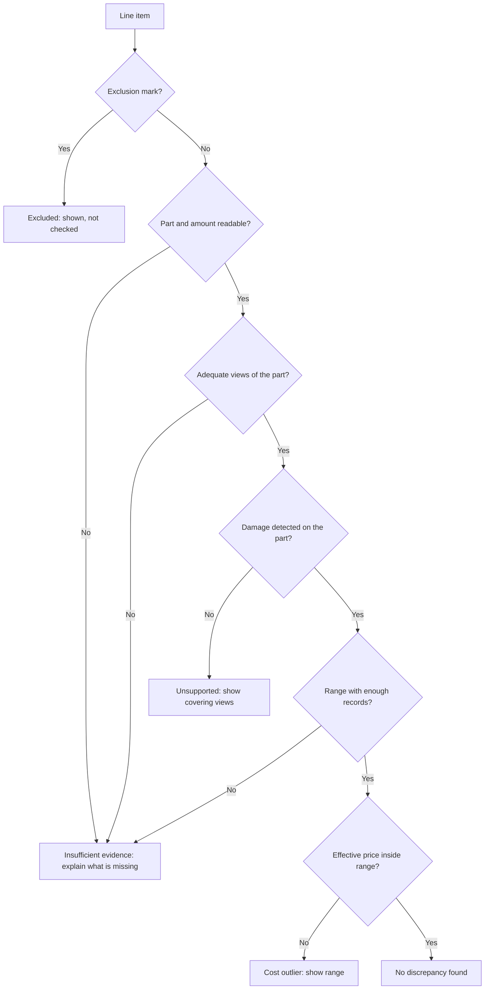
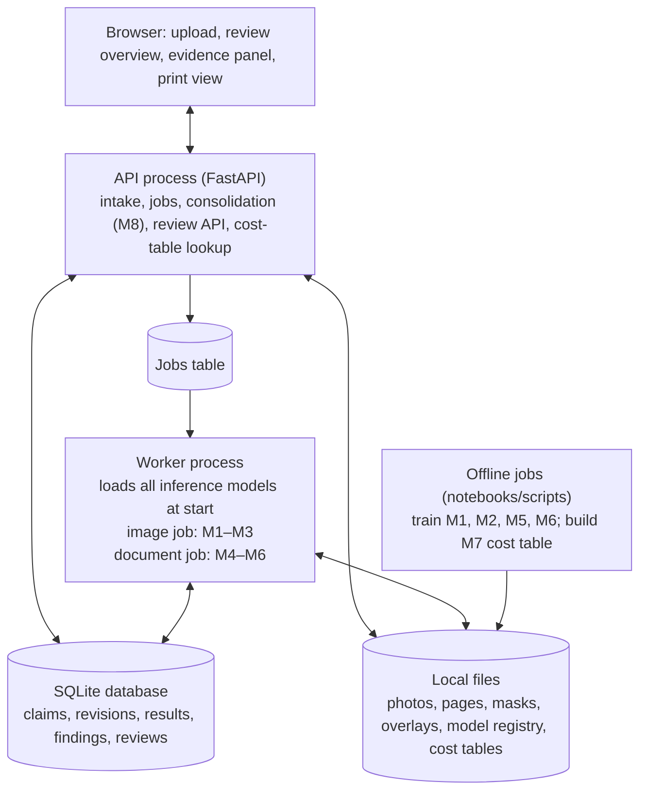

# CLAIM-CMEV

## Cross-Modal Evidence Verification of Declared Repair Scope Against Photographic Damage Evidence in Motor Own-Damage Claims

**Project Proposal — version 2 (simplified scope)**

| | |
|---|---|
| **Group ID** | ACERY |
| **Members** | Divakaran Pillai Arunkumar; Miguel Rodel Felipe; Lau Lay Khoon; Lim Chong Jen; Sun Yan |
| **Programme** | NUS-ISS Graduate Certificate in Pattern Recognition Systems |
| **Modules** | PSUPR, PRMLS, ISSM |
| **Document version** | v2, simplified scope. This version replaces [v1](CLAIM-CMEV_project_proposal_v1.md) for planning. |
| **Effort budget** | 10 person-days per member, including report writing and presentation preparation. 50 person-days in total. |

**In plain terms:** A surveyor uploads photographs of a damaged car and a photographed copy of the workshop's repair estimate. The surveyor has already marked the estimate with a pen: an "X" on items that will not be paid, and a new price where the price changes. CLAIM-CMEV reads both inputs. It lists the damaged parts seen in the photographs. It reads the repair items and prices from the estimate, including the pen marks. It then shows one combined list. The list tells the surveyor which items have no photo evidence and which prices look high. The surveyor edits the list and prints it as a PDF report.

CMEV stands for **Cross-Modal Evidence Verification**. "Cross-modal" means using different types of evidence: images and document text. CLAIM identifies the motor-claims application; it is not an acronym.

---

## Changes from version 1

Version 2 keeps the purpose, the checks and the main safety rules of version 1. It changes the document input, reduces the number of screens, reduces the datasets to those the team can obtain quickly, and simplifies deployment. The table lists each change and its reason.

| Area | Version 1 | Version 2 | Reason |
|---|---|---|---|
| Document input | Digital or scanned survey report written by the surveyor | Photographed or scanned printout of the **workshop estimate**, marked by the surveyor with a pen | Matches the real working method described by the team |
| Document models | LayoutLMv3 or Donut, trained on DocILE | Pretrained OCR + fine-tuned LayoutLMv3 + a new fine-tuned **pen-mark detector** + pretrained TrOCR for handwritten amounts | Pen marks need a vision model; DocILE is large and needs a token |
| Document data | DocILE, CORD, SROIE, FUNSD | CORD, generated workshop estimates, and printouts marked and photographed by the team | Smaller, open, and closer to the task |
| Vision data | HITL, VehiDE, CarDD, CrashCar101, DSMLR | HITL committed; VehiDE optional; the rest not used | Access forms, licences and approval gates take time |
| Multi-view method | 3D projection method with CrashCar101 groups | Rule-based merge by part and damage type; coverage from mask area and blur | Research-grade method does not fit the budget |
| Screens | Three working screens and four static mockups | One working **review overview** page with an evidence panel, an upload page and a print view | The workflow centres on one list |
| Assessment export | Structured export | The surveyor prints the finalized overview to PDF | Requested output |
| Cost data | A 630-row synthetic file (never supplied) | A generated price table with documented rules | Gives known ranges and controlled sparsity |
| Cost key | Part, side, operation, damage type, vehicle class, currency | Part, operation, vehicle class, currency | Fewer dimensions give more records per range |
| Deployment | Workbench, backend, image worker, document worker, PostgreSQL | Two processes from one code base (API and worker), SQLite, local files | Less plumbing |
| Extra comparators | Joint image-text model; image-text alignment | Not included | No time |
| RQ2 | Do synthetic joint labels improve part matching? | Can pen marks on photographed printouts be read reliably? | Fits the new input |
| Approval import and cost refresh | Demonstrated | Small scripted demonstration; first item to cut if time runs out | Lower priority than the main workflow |

---

## 1. Executive summary

A motor own-damage claim covers damage to the policyholder's own vehicle. The workshop prepares an estimate. A surveyor inspects the vehicle, photographs the damage, and decides which estimate items to accept, reject or reprice. A claim handler later approves the claim.

In the working method addressed by this project, the surveyor prints the workshop estimate and marks it with a pen. An "X" means the item will not be paid. A handwritten number means a new price. The surveyor then uploads the damage photographs and the marked estimate.

CLAIM-CMEV processes the two inputs separately and then combines the results:

1. **Image branch.** Two segmentation models find vehicle parts and damage in each photograph. The results from all photographs are merged into one list of damaged parts with damage types. The system also records which parts were photographed well enough to judge.
2. **Document branch.** An OCR model reads the printed text. A layout model groups the text into repair line items: part, repair operation and price. A detector finds the surveyor's pen marks and links each mark to its line item. A handwriting model reads new prices; the surveyor confirms them.
3. **Consolidation.** A rule-based module combines the two lists with reference cost ranges. For each line item it reports one of four results: no discrepancy, no photo evidence in adequate views, cost outside the reference range, or insufficient evidence. Damage seen in photographs but missing from the estimate is listed as a possible addition.
4. **Review and print.** The surveyor sees one editable overview page. The surveyor corrects entries, dismisses findings with a reason, confirms amounts, and prints the finalized page to PDF.

The project delivers nine modules, one working review page with upload and print, five trained or fine-tuned models, and an evaluation of each model and of the combined checks. Reference costs are synthetic. Results show whether the checks work, not whether the system predicts real repair prices.

---

## 2. Problem and inputs

### 2.1 The surveyor's work today

The surveyor reviews the workshop estimate, inspects the vehicle, identifies damaged parts, decides on repair or replacement, negotiates prices, and prepares a report. Two problems remain:

- **Repeated manual checks.** The surveyor compares each estimate item with the photographs by eye.
- **Records that are hard to compare.** Photographs and marked estimates are stored as files. There is no structured record linking vehicle, part, operation and price. A later claim for a similar repair cannot easily use the earlier one as a reference.

### 2.2 The marked workshop estimate

The document input is a **marked workshop estimate**: a printout of the workshop's repair estimate, marked by the surveyor with a pen, then photographed with a phone or scanned. Workshops may call this document a quotation or a repair list. It is not an invoice: nothing has been paid at this stage. It can have several pages.

The prototype reads two kinds of pen marks. The marking rules below are the input convention for the project. They will be confirmed with a practising surveyor if one is available.

| Mark | Meaning | Name in this document |
|---|---|---|
| An "X" written over a line item or over its amount | The surveyor will not pay this item | **Exclusion mark** |
| A number written next to or above the printed amount | The new amount for this item | **Price change** |

Other marks, such as ticks, circles or notes, are not interpreted. They remain visible in the page image.

Two terms follow from the marks:

- The **effective price** of a line item is the handwritten amount if there is one, otherwise the printed amount.
- The **declared repair scope** is the set of line items without an exclusion mark, each at its effective price.

### 2.3 Three amounts that must stay separate

| Amount | Where it comes from | How the system uses it |
|---|---|---|
| **Workshop printed price** | Printed on the estimate | Shown for reference; extracted by the document branch |
| **Surveyor's effective price** | Printed price, or the handwritten price change, confirmed by the surveyor | Checked against the reference cost range |
| **Final approved amount** | Recorded later by the claim handler | Never used in the assessment of the same claim; may feed a later cost-reference refresh |



The system stores all three amounts separately. A surveyor's edit in the overview is a reviewed amount, not an approval.

### 2.4 What the system checks

A **line item** is one row of the estimate: a part, a repair operation, and a price. The image branch produces **damage observations**: a part, a damage type, and the photographs that show it.

| Check | Question | Example finding |
|---|---|---|
| Photo evidence | Is damage visible on the declared part, in photographs clear enough to judge? | "Rear door repair: no damage visible in three adequate views" |
| Cost range | Is the effective price inside the reference range for the same part, operation and vehicle class? | "Front bumper replace: S$1,150 is above the reference range S$620–S$890 (47 records)" |
| Missing repairs | Is visible damage absent from the estimate? | "Dent seen on the left fender; no estimate item for the fender" |

If a part is not photographed, is obscured, or appears only in poor-quality photographs, the result is **insufficient evidence**. The system asks for more pictures of that part. It does not flag the item as unsupported.

### 2.5 What the system does not do

- Approve or reject a claim, choose a settlement amount, or replace the surveyor's judgement.
- Treat an unphotographed part as an undamaged part.
- Detect staged accidents or fraud outside the estimate and photographs.
- Train on fraud outcomes. The project has no fraud labels.
- Interpret pen marks other than exclusion marks and price changes.

### 2.6 Valid reasons for a mismatch

A repair or price can be correct even when the photographs do not show why. The surveyor can record a reason when dismissing a finding: hidden damage found after dismantling, ADAS calibration or specialist procedure, parts price change, inadequate photograph, system error, or other. The reason stays in the record.

---

## 3. Goals

### 3.1 Primary goal

Build a working pipeline that reads a claim's photographs and its marked workshop estimate. The pipeline checks each line item and shows the results in one editable overview. The surveyor prints the overview as a PDF report.

### 3.2 Technical objectives

1. **Identify vehicle parts** in photographs by labelling their pixels.
2. **Identify damage** by type and area, and match each damage region to its part.
3. **Merge photographs** into one damage summary and record which parts can be judged.
4. **Read the estimate**: recognise the printed text and group it into line items with page locations.
5. **Read the pen marks**: find exclusion marks and price changes, link them to line items, and read handwritten amounts for confirmation.
6. **Build reference cost ranges** with supporting record counts.
7. **Consolidate and check**: apply the photo-evidence, cost and missing-repair checks and explain each result.
8. **Store the reviewed record** with every surveyor action, and print the finalized report.

### 3.3 Product objectives

9. Build the upload page, the review overview page with its evidence panel, and the print view, using real model output.
10. Describe the remaining views (claim list, cost-range detail, operations dashboard, audit view) in the report. Static mockups are optional.
11. Measure the editing effort and the review usability of the overview page.

### 3.4 Research questions

- **RQ1:** Are the part and damage models accurate enough to produce a useful damage summary? How do photograph quality and coverage change the result?
- **RQ2:** Can the system read the surveyor's pen marks from a photographed printout reliably enough to reconstruct the declared repair scope? Which errors remain: missed marks, marks linked to the wrong line item, or misread amounts?
- **RQ3:** How well does the part-level merge remove duplicate detections across photographs, and what errors remain?
- **RQ4:** How useful are the cost flags, and how does their precision change when fewer reference records are available?

### 3.5 Outside the project scope

Production deployment, live claims-system integration, automated settlement, non-visual fraud, hidden structural damage, real repair-price validation, and pen marks other than the two defined kinds.

---

## 4. Mapping to course requirements

The project targets the course minimum of three of four required aspects and attempts the fourth if time allows.

| Aspect | Implementation | Evidence |
|---|---|---|
| Supervised learning | Part segmentation (M1), damage segmentation (M2), line-item extraction (M5), pen-mark detection (M6), reference cost ranges (M7) | Trained models and results on held-out data |
| Machine learning / deep learning | SegFormer, LayoutLMv3, Faster R-CNN, TrOCR, LightGBM | Model design, training runs, and comparisons with simple baselines |
| Hybrid / ensemble | Decision-level fusion of the image branch, the document branch and the cost ranges in M8 | Combined result versus each branch alone |
| Intelligent sensing / sense-making | Merging many photographs into one damage summary with coverage states (M3); reading a surveyor's decisions from a photographed paper page (M6) | Duplicate-removal results; pen-mark reading results |
| Unsupervised learning (optional) | An Isolation Forest anomaly score over cost records, compared with the interval check in M8 | Only if time allows; the course classification must be confirmed |

The cost check compares an amount with a learned range. The absence of fraud labels does not make it unsupervised. The team will confirm the classification against the rubric before the final report.

---

## 5. Product, users and value

CLAIM-CMEV is decision-support software for motor insurers. Its first benefit is less manual checking for the surveyor. Its later benefit is a structured history of parts, operations and prices that supports cost comparison. Both need evidence from a deployment; this project measures model accuracy, editing effort and review usability only.

| User | Role in this project |
|---|---|
| **P1 Surveyor** (primary) | Uploads inputs, reviews the overview, edits, confirms, prints |
| P2 Claim handler | Receives the printed report; records final approval outside the prototype |
| P3 Investigator / compliance reviewer | Needs the stored record: inputs, model versions, findings, actions and reasons |

The commercial model, deployment stages and buyer value from v1 §5 are unchanged and are not repeated here.

---

## 6. Workflow



**Example.** The surveyor uploads six photographs and two estimate pages. The overview shows eight line items. Item 3, "rear door — repair — S$480", has an exclusion mark; it is shown struck through as "excluded by surveyor". Item 5, "front bumper — replace — S$1,150" has a price change to S$980; the overview shows the printed price, the read handwritten amount, and a "confirm" button. The evidence check on item 5 is supported by two adequate views. The cost check shows S$980 inside the range S$620–S$1,020. Item 7, "left fender — repair", has no adequate view; the overview says "take more pictures of the left fender". A dent on the bonnet appears in the possible-additions list with its photograph. The surveyor adds it, confirms the amounts, and prints the report.

---

## 7. User interface

### 7.1 Upload page

Fields: claim reference, vehicle make, model and year, currency, photographs (JPEG/PNG), estimate pages (JPEG/PNG/PDF). Shows the processing state: queued, processing, ready, incomplete or failed. A failure must not look like a finished assessment with no findings.

### 7.2 Review overview page

This is the main working screen. It has four sections.

**Damage summary.** One row per supported part: damage detected (with types), no damage detected in adequate views, or not assessable. Each row links to the photographs.

**Line items.** One row per estimate line item.

| Column | Content |
|---|---|
| Part, operation | Extracted text and the mapped vocabulary term; editable |
| Printed price | From the estimate |
| Pen marks | "Excluded" or the read price change; each needs surveyor confirmation |
| Effective price | Handwritten amount if confirmed, otherwise printed price; editable |
| Photo evidence | Supported (n views) / No damage visible (n views) / Take more pictures |
| Cost check | Within range / Above range / Below range / Not checked (reason) |
| Result | One of the four results below |
| Actions | Confirm, edit, dismiss finding with reason, open evidence |

| Result | Display label | Meaning |
|---|---|---|
| `ok` | No discrepancy found | Supported and within range |
| `unsupported` | No damage visible in adequate views | Adequate photographs, no damage detected |
| `cost_outlier` | Cost outside reference range | Supported, but effective price outside the range |
| `insufficient_evidence` | More information needed | Part not assessable, entry unreadable, or no reliable range |

`insufficient_evidence` is informational. It must look different from a discrepancy flag. Excluded items are shown, struck through, with their original text. They are not checked.

**Possible additions.** Damage observations with no matching line item. The surveyor can add, edit or dismiss each one. An added item has no invented price; the surveyor enters it.

**Finalize.** A "Finalize" button freezes the review revision and opens the print view.

Every edit keeps the original extracted value visible. Dismissing a finding takes one action: select the reason.

### 7.3 Evidence panel

Opens beside the overview when the surveyor selects a row. It shows:

- The photographs that cover the part, with part and damage overlays, and a one-tap link to the original photograph.
- The estimate page image with the line item's box highlighted, and any detected pen mark boxes.

### 7.4 Print view and assessment report

The print view renders the finalized overview as a report. It contains:

- claim and vehicle details;
- the damage summary;
- the final line items with printed and effective prices;
- excluded items;
- possible additions accepted by the surveyor;
- findings and dismissal reasons;
- a footer with the assessment ID, revision, model versions and cost-table version.

The surveyor prints it to PDF from the browser. The stored review revision is the authoritative record. The PDF is a rendering of it.

### 7.5 Views described but not built

Claim list, cost-range detail, operations dashboard and audit view are described in the report. A minimal claim list may be built if time allows because the data already exists. Static mockups are optional.

### 7.6 Interface requirements

- Large controls that are readable on a tablet.
- One-tap access to the original photograph.
- Visible model and cost-table versions.
- A clear difference between a processing failure, missing evidence and a completed check.
- An idempotent save, so that a retried submission does not duplicate a review action.

---

## 8. Decision rules

### 8.1 Rules for one line item



Each check result is stored separately as well as the overall result. An item can be supported by photographs and still have no cost check.

### 8.2 Possible additions

A merged damage observation with no matching line item becomes a possible addition. If the surveyor excluded an item for the same part, no addition is proposed; the excluded row shows an informational note "damage detected on this part" instead. This avoids proposing an item the surveyor has already rejected.

### 8.3 Cost matching

The cost key is part, operation, vehicle class and currency. Repair and replacement never share a range. Side (left or right) is not part of the key. Damage type is not part of the key in v2; ranges are therefore wider than in v1. A missing range is stored as absent, never as a zero range. A range with fewer unique records than the minimum support threshold gives "not checked (too few records)".

---

## 9. Architecture and serving

### 9.1 Processes and storage

The system runs as two processes built from one Python code base, plus a browser front end.



| Component | Responsibility | Notes |
|---|---|---|
| Browser front end | Upload, overview, evidence panel, print | React + TypeScript + Vite. Overlays and highlighted pages are images rendered by the server, so the browser does no drawing |
| API process | Validate uploads, create input revisions, create jobs, run consolidation, serve evidence and review endpoints | FastAPI. Loads the pinned cost table into memory at start. Loads no neural models |
| Worker process | Poll the jobs table, run the image job and the document job for a revision, write results | One process. Loads every inference model once at start. CPU by default; uses a GPU if present |
| Jobs table | Persistent queue | A database table with job key (claim, revision, task, model versions), state, attempts and error text. No message broker |
| SQLite database | All structured records | Write-ahead-log mode so the API and the worker can share it |
| Local files | Originals, derived images, model registry, cost tables | Model registry and cost tables are read-only for the API and worker |
| Offline jobs | Training, evaluation, cost-table builds | Colab/Kaggle GPU or a team GPU. Never run inside a surveyor request |

Docker Compose is optional. GPU/CPU timings are measured and recorded, not assumed.

### 9.2 Processing sequence

```mermaid
sequenceDiagram
    actor S as Surveyor
    participant A as API process
    participant W as Worker process
    S->>A: Upload photos, estimate pages, vehicle details
    A->>A: Validate; store input revision; create image job and document job
    A-->>S: Claim ID, revision, state = queued
    W->>A: (polls jobs table) take image job
    W->>W: M1 parts, M2 damage, M3 merge and coverage
    W-->>A: Observations and coverage saved; job done
    W->>W: take document job: M4 OCR, M5 line items, M6 pen marks
    W-->>A: Line items and pen marks saved; job done
    A->>A: Both jobs done → M8 consolidation with pinned cost table; assessment ready
    S->>A: Open overview; confirm, edit, dismiss, add
    A-->>S: Review revision saved
    S->>A: Finalize
    A-->>S: Print view
```

If one job fails, the other job's result is kept and the assessment is shown as incomplete. If photographs are uploaded without an estimate, the damage summary is shown and the line-item section says "waiting for the estimate". New photographs or pages create a new input revision and a new assessment; earlier results stay stored.

### 9.3 Records exchanged between modules

Every result carries claim ID, input revision, schema version and the versions of the models or tables used.

| Record | Main fields |
|---|---|
| Claim input | Claim ID, vehicle make/model/year, vehicle class, currency, file IDs, input revision |
| Part coverage | Part, side (unresolved in v2), covering photo IDs, mask references, state (adequate / inadequate / not visible), reason |
| Damage observation | Observation ID, part, damage type, confidence, area, photo IDs, mask references, merged-from IDs |
| Page reading | Page ID, page image reference, words and lines with boxes and confidence, quality flags |
| Line item | Entry ID, original text, mapped part and operation, quantity if present, printed amount, currency, confidence, page and box |
| Pen mark | Entry ID, type (exclusion / price change), box, confidence, read amount (price change), confirmation state |
| Reference cost range | Cost key, lower and upper bound, currency, unique record count, as-of date, table version, synthetic marker |
| Finding | Finding ID, entry or observation ID, each check result, overall result, reason text, evidence references, range used, versions |
| Review action | Review revision, actor, time, action type, reason, original and new values, idempotency key |

### 9.4 How each model is served

"Served" means how a trained model is loaded and run when a claim is processed. All neural models run inside the worker process. Nothing retrains at request time.

| Model | Runs in | Loaded from | Input → output | How the result is stored |
|---|---|---|---|---|
| M1 part segmentation (SegFormer) | Worker, at start | Model registry `parts/<version>` via Hugging Face `transformers` | Photograph resized to 512×512 → class per pixel, per-class confidence | Part mask PNG per photograph; coverage rows |
| M2 damage segmentation (SegFormer) | Worker, at start | Model registry `damage/<version>` | Photograph → damage class per pixel, confidence | Damage mask PNG; observation rows after overlap with part masks |
| M3 merge and coverage | Worker | Code and a versioned threshold config; no weights | All observations and masks for one revision → merged observations, coverage | Rows with merged-from IDs |
| M4 OCR (PaddleOCR) | Worker, at start | Pinned pretrained weights, recorded by version | Corrected page image → lines and words with boxes and confidence | Page-reading JSON per page |
| M5 line-item extraction (LayoutLMv3) | Worker, at start | Model registry `lineitems/<version>` | Page image + OCR words and boxes → label per token → grouped line items | Line-item rows with page and box |
| M6 pen-mark detector (Faster R-CNN) | Worker, at start | Model registry `penmarks/<version>` | Page image → boxes with class (exclusion / price change) and score | Pen-mark rows linked to line items by vertical overlap |
| M6 handwritten amount reader (TrOCR) | Worker, at start | Pinned pretrained weights (`trocr-base-handwritten`) | Crop of a price-change box → text → decimal amount, or "unreadable" | Read amount on the pen-mark row; always "needs confirmation" |
| M7 reference cost model (LightGBM) | **Not served.** Offline only | Offline script | Synthetic price records → a table of ranges with counts | Cost table `cost_tables/<version>` on disk; the API loads it into memory at start |
| M8 consolidation and checks | API process | Code and the pinned cost table | Observations, coverage, line items, pen marks → findings | Finding rows; assessment revision |

Serving rules:

- The worker refuses to start if a registry version listed in the serving configuration is missing or its manifest fails validation.
- Every result row stores the model version that produced it. The assessment stores all versions used. A cost-table update never changes an existing assessment; a reassessment creates a new revision.
- Inference runs on CPU by default. Expected time per claim with six photographs and two pages is tens of seconds on a laptop CPU; the measured value will be recorded.
- Fixture mode (sample outputs used before models are ready) is marked as fixture in every record and cannot be shown as real inference.

### 9.5 Model registry

Each trained model is a folder `artifacts/models/<model_id>/<version>/` with the weights and a `manifest.json`. The manifest records the model ID, version, base checkpoint and its licence. It also records the training dataset names and split hashes, the label schema, preprocessing, metrics on held-out data, known limits, and status (candidate or approved). The serving configuration lists the approved version for each model. Cost tables use the same pattern under `artifacts/cost_tables/<version>/` with the build manifest, exclusion report and calibration results.

### 9.6 Failure handling

- A job key of claim, revision, task and model versions is unique. A retried job overwrites its own partial result and never duplicates rows.
- A stale result for an old revision is kept for that revision and never replaces the current assessment.
- Review saves carry an idempotency key from the browser. A repeated save is ignored.
- Model files, datasets and generated exports stay in ignored local folders; only manifests and aggregate results are tracked.

---

## 10. Functional modules

Version 2 keeps nine modules. The last column maps each one to v1 so that the existing module specifications can be updated rather than rewritten.

| v2 | Module | Runs in | Method (short) | v1 |
|---|---|---|---|---|
| M1 | Vehicle part segmentation | Worker | SegFormer-B0 fine-tuned on HITL part labels, 21 classes | M01 |
| M2 | Damage segmentation and part matching | Worker | SegFormer-B0 fine-tuned on HITL damage labels, 8 classes; a damage region is assigned to the part with the largest overlap | M02 |
| M3 | Merge and coverage | Worker | Group observations with the same part and damage type across photographs; coverage per part from mask area and blur score | M03 (simplified) |
| M4 | Page reading | Worker | Page detection and perspective correction (OpenCV), then PaddleOCR | M04 (photographed pages instead of digital PDFs) |
| M5 | Line-item extraction | Worker | LayoutLMv3 token classification, adapted on CORD then on generated estimates; vocabulary mapping; rule-based parser as baseline and fallback | M05 |
| M6 | Pen-mark recognition | Worker | Faster R-CNN detector for exclusion marks and price changes; TrOCR reads price-change crops; link to line items by geometry | New |
| M7 | Reference cost ranges | Offline | LightGBM quantile regression (5th and 95th percentiles) on generated prices; empirical percentiles as baseline; versioned table with counts | M06 |
| M8 | Consolidation and checks | API | Rules in §8; cost comparison with deviation; explanations; version pinning | M07 + M08 |
| M9 | Review overview and report | Browser + API | Upload page, overview, evidence panel, print view; review revisions | M09 |

### M1 — Vehicle part segmentation

**Purpose:** label the pixels of each vehicle part in a photograph.
**Method:** fine-tune SegFormer-B0 (the smallest SegFormer) with the Hugging Face `transformers` training loop. Use B1 or B2 if training time allows. Input 512×512. Share the training code with M2.
**Classes:** the 21 HITL part classes.
**Output:** part mask, per-class confidence, photograph reference. HITL has no left/right labels, so side is "unresolved" in v2.

### M2 — Damage segmentation and part matching

**Purpose:** find damage and assign it to a part.
**Method:** fine-tune SegFormer-B0 on the 8 HITL damage classes. For each connected damage region, compute its overlap with each part mask. Assign the region to the part with the largest overlap if the overlap covers at least a threshold share of the region; otherwise the observation has part "unknown". Thresholds are chosen on validation data.
**Output:** per-photograph observations with part, damage type, area, confidence and mask reference.

### M3 — Merge and coverage

**Purpose:** one damage summary per vehicle and a coverage state per part.
**Method:** merge observations with the same part and damage type across photographs into one merged observation that keeps every photograph and mask reference. Coverage per part has three states. "Adequate" means the part mask is large enough in at least one photograph that passes the blur threshold. "Inadequate" means the part is visible only in low-quality photographs. "Not visible" means no photograph shows the part.
**Limit:** two separate dents on the same part are merged into one observation in v2. This is recorded as a limitation and measured in RQ3.

### M4 — Page reading

**Purpose:** turn a photographed or scanned estimate page into text with positions.
**Method:** convert PDF pages to images; detect the paper outline and correct perspective and rotation with OpenCV; run PaddleOCR to get text lines and words with boxes and confidence. docTR or Tesseract is the fallback if PaddleOCR cannot be installed on the demonstration machine.
**Output:** words and lines with boxes, reading order, and quality flags (low confidence, low resolution, strong skew).

### M5 — Line-item extraction

**Purpose:** group the words into line items: part, operation, quantity, printed amount.
**Method:** LayoutLMv3-base token classification with labels PART, OPERATION, QTY, UNIT_PRICE, AMOUNT and OTHER. Stage 1 adapts the model on CORD receipts, whose item name, count, unit price and price fields map to these labels. Stage 2 fine-tunes on generated workshop estimates in the project vocabulary, using OCR output on the rendered pages so that training and serving see the same kind of input. Tokens are grouped into rows by their line boxes. A rule-based parser (header detection, column positions, amount pattern) is the baseline and the fallback. Part and operation text is mapped to the project vocabulary by a dictionary with fuzzy matching; unmapped text stays "unresolved".
**Output:** line items with original text, mapped terms, printed amount, confidence, page and box. Rows that look like totals, tax lines or repeated headers are marked as non-items.

### M6 — Pen-mark recognition

**Purpose:** find the surveyor's exclusion marks and price changes and link them to line items.
**Method:** a Faster R-CNN detector (ResNet-50 FPN backbone from torchvision, COCO-pretrained) fine-tuned for two classes: exclusion mark and price change. Each detection is linked to the line item whose row box overlaps it most vertically; a detection with no overlapping row is reported as "unlinked". For each price-change box, TrOCR (`trocr-base-handwritten`) reads the crop; the text is parsed as a decimal amount. Every price change needs surveyor confirmation, whatever its confidence.
**Output:** pen-mark rows per line item with type, box, confidence, read amount and confirmation state.

### M7 — Reference cost ranges

**Purpose:** a lower and upper bound for a comparable repair, with the number of records behind it.
**Method:** LightGBM with quantile objectives at the 5th and 95th percentiles, features part, operation, vehicle class and model year, trained on the generated price table. Empirical coverage is measured on held-out records; if it misses the nominal 90 percent by more than five points, a conformal adjustment is applied and recorded. Empirical percentiles per cost key are the baseline. The build publishes a versioned table: cost key, bounds, unique record count, as-of date, synthetic marker.
**Rule:** a cost key with fewer unique records than the support threshold gets no range. The threshold comes from RQ4.

### M8 — Consolidation and checks

**Purpose:** combine everything into findings.
**Method:** the rules in §8. The cost check returns within range, above range (with the amount above the upper bound), below range, or not checked with a reason. Each finding has a short explanation and links to its photographs, masks, page box and range.

### M9 — Review overview and report

**Purpose:** let the surveyor review, correct, confirm and print.
**Method:** the pages in §7 against the API. Every action is a review-action row. "Finalize" freezes the revision and opens the print view.

---

## 11. Models and datasets

### 11.1 Summary

| Model | Trained or pretrained | Training data (committed) | Additional data (optional) | Evaluation data | Licence and access notes |
|---|---|---|---|---|---|
| M1 SegFormer parts | Fine-tuned | HITL part images (998) | DSMLR (side labels) | HITL held-out split; team vehicle photographs (qualitative) | HITL CC0; SegFormer checkpoints under NVIDIA research licence (non-commercial) |
| M2 SegFormer damage | Fine-tuned | HITL damage images (814) | VehiDE (13,945 images) if terms are confirmed; CarDD if access is granted | HITL held-out split; team vehicle photographs | VehiDE mirror shows Apache-2.0, original terms unverified; CarDD needs a signed form |
| M4 PaddleOCR | Pretrained, not trained | — | — | Team-photographed pages (word accuracy) | Apache-2.0 |
| M5 LayoutLMv3 line items | Fine-tuned in two stages | CORD (1,000 receipts); generated workshop estimates | DocILE if time allows (not planned) | Held-out generated templates; team-photographed pages | CORD CC BY 4.0 per publisher README; LayoutLMv3 weights CC BY-NC-SA 4.0 (non-commercial) |
| M6 Faster R-CNN pen marks | Fine-tuned | Generated marked pages (synthetic marks); part of the team-marked real pages | IAM handwriting for more realistic synthetic marks | Held-out team-marked real pages | torchvision BSD-3; EMNIST public domain; IAM registration, research use |
| M6 TrOCR handwritten | Pretrained; optional fine-tune | — (optional: generated handwritten amounts) | — | Team-marked real pages (amount read accuracy) | MIT |
| M7 LightGBM cost ranges | Trained | Generated price table | — | Held-out generated records; RQ4 subsets | MIT; data synthetic |

Five models are fine-tuned or trained: M1, M2, M5, M6 detector and M7. Two are used pretrained: PaddleOCR and TrOCR. Both non-commercial model licences are acceptable for this academic prototype; a commercial product would need differently licensed backbones (for example torchvision segmentation models under BSD).

### 11.2 Vehicle image datasets

| Dataset | Contents | Classes | Licence / access | Use in v2 |
|---|---|---|---|---|
| HITL Car Parts and Car Damages | 998 part images, 814 damage images, polygon masks | 21 parts, 8 damage types | CC0 1.0; free access form on the publisher page | **Committed.** Primary training and evaluation data for M1 and M2 |
| VehiDE | 13,945 images, more than 32,000 instances | 8 damage types | Kaggle mirror advertises Apache-2.0; original terms to verify | **Optional.** Added to M2 training only after the HITL baseline, and only if terms are confirmed. Improves rare classes |
| CarDD | 4,000 high-resolution images | 6 damage types | Signed licensing form | **Optional.** Used only if access arrives early |
| DSMLR Car-Parts-Segmentation | Multi-view images, COCO masks | 18 parts including side | No explicit licence in the repository; research use to confirm | **Optional, low priority.** Would give left/right labels to M1 |

HITL damage classes differ from VehiDE and CarDD classes. Any added dataset is mapped to the HITL class list; classes that cannot be mapped are dropped and recorded.

### 11.3 Document datasets

| Dataset | Contents | Licence / access | Use in v2 |
|---|---|---|---|
| CORD v2 | 1,000 photographed receipts with text, boxes and line-item fields (item name, count, unit price, price) | CC BY 4.0 per the publisher README; public download from Hugging Face | **Committed.** Stage-1 adaptation of M5. Receipts are photographed like the estimate pages, which helps |
| Generated workshop estimates | Team-generated pages in 4–6 layouts, using the project part and operation vocabulary and prices drawn from the generated price table; rendered to PDF and PNG with ground-truth boxes per field | Project-owned | **Committed.** Stage-2 fine-tuning of M5; base pages for the marked-page generator; held-out templates for evaluation |
| Generated marked pages | Generated estimates with synthetic exclusion marks (drawn strokes) and price changes (digit images from EMNIST and handwriting-style fonts), then photo-style augmentation: perspective, blur, shadow, paper texture, lighting | Project-owned; EMNIST public domain; fonts under the SIL Open Font License | **Committed.** Training data for the M6 detector |
| Team-marked real pages | About 60 generated estimates printed on paper, marked by hand by at least three team members with different pens, photographed with phones in varied light | Project-owned | **Committed.** Evaluation data for M4, M5 and M6 and for RQ2. A small part may be used for fine-tuning; the rest is held out by the person who marked the page and by template |
| DocILE, SROIE, FUNSD | Business documents, receipts, forms | Token, portal or licence checks | **Not used in v2** |

### 11.4 Handwriting sources for synthesis

| Source | Use | Licence |
|---|---|---|
| EMNIST digits | Compose handwritten amounts such as "980.00" from individual digit images | Public domain (NIST Special Database 19) |
| Handwriting-style fonts | Alternative amounts with different styles | SIL Open Font License |
| IAM Handwriting Database | Optional, for more varied strokes | Registration; non-commercial research |

Synthetic marks are for training only. The evaluation of pen-mark reading uses the team-marked real pages.

### 11.5 Team-made data

**Team-marked real pages.** Protocol:

1. Print generated estimates.
2. At least three members each mark about 20 pages, following the rules in §2.2. Use different pens. Include clean and messy marking.
3. Photograph each page with a phone, in normal and poor light, flat and slightly angled.
4. Label each mark with its type, its box and the line item it belongs to.
5. Record who marked each page.

**Team vehicle photographs.** Protocol:

1. Photograph 5–10 vehicles owned by team members, 4–6 views each. Include at least one vehicle with visible minor damage.
2. Hide number plates and faces.
3. Label each photograph with the visible parts and any damage, by part and type.

Vehicle groups give the demonstration cases and the RQ3 data. The team makes these labels, not surveyors. The report states this.

### 11.6 Cost data

No public dataset links repair line items to approved costs. The v1 plan named a 630-row file that was never supplied. Version 2 uses a **generated price table** with documented rules:

- Keys: part (18 HITL parts that appear on estimates), operation (repair, replace, paint), vehicle class (4 classes from a lookup of make and model), model year (7 years).
- Each key has a base price. A record adds a workshop factor and random noise. Some keys are made sparse on purpose so that RQ4 can test the support threshold.
- About 5,000–10,000 records with a synthetic marker, a record ID and a base-case ID.

The same rules generate the printed prices on the generated estimates, with controlled deviations for test cases (§13.2). Synthetic prices test the comparison logic and calibration only. They do not validate real repair prices.

### 11.7 Datasets not used in v2

CrashCar101 (needed only for the 3D method and the old RQ2), DocILE, SROIE, FUNSD, Ultralytics Carparts-Seg (AGPL-3.0), freMTPL2 and PASCAL-Part.

### 11.8 Splits and leakage

- HITL: fixed training, validation and test splits by image; recorded by hash.
- CORD: publisher splits.
- Generated estimates and marked pages: templates are kept out of the test split; team-marked pages are split by the person who marked the page and by template.
- Team vehicles: all photographs of one vehicle stay in one split.
- Prices: split by base-case ID and by date cutoff.

---

## 12. Team, effort budget and plan

### 12.1 Lanes and effort

Each member has 10 person-days: 8 for building and evaluation, 2 for the report and presentation. Members are to be confirmed.

| Lane | Owns | Build days |
|---|---|---|
| 1 Vision | HITL access and conversion, shared training code, M1, M2, overlap matching, M3, overlay rendering, RQ1 quality test | 8 |
| 2 Document extraction | M4 preprocessing and OCR, rule-based parser, CORD preparation, M5 two-stage training and evaluation, vocabulary mapping | 8 |
| 3 Document synthesis and pen marks | Estimate generator, marked-page generator, team page collection and labelling, M6 detector training, TrOCR integration, RQ2 evaluation | 8 |
| 4 Costs and checks | Price generator, M7 training and calibration, table publishing, M8 rules, discrepancy test cases, RQ4, scripted approval and refresh demonstration | 8 |
| 5 Platform and front end | Schema and revisions, intake and jobs, worker entry point, review API, review overview page, evidence panel, print view, service tests, integration | 8 |

All members contribute vehicle photographs and page marking. Lane 5 is the tightest lane; other lanes take integration tasks as they finish.

### 12.2 Checkpoints (in build days per member)

| Day | Output |
|---|---|
| 1–2 | Vocabulary, record schemas, states and marking rules frozen. All lanes connected on fixture outputs: upload, jobs, overview, save |
| 4 | Estimate generator and price generator running; HITL converted; first model training runs started |
| 6 | Real model outputs replace fixtures for M1, M2, M4, M7. M5 and M6 candidates in the registry |
| 7 | Test data and versions frozen |
| 8 | Evaluations run; demonstration case processed end to end |
| 9–10 | Report and presentation |

### 12.3 Contingency ladder

If a lane is behind, cut in this order:

1. M5 LayoutLMv3 → rule-based parser only. Saves about 3 days.
2. TrOCR amount reading → detect price changes only; the surveyor types the amount. Saves half a day and removes a failure mode.
3. Optional datasets (VehiDE, CarDD, DSMLR, IAM) → not used.
4. Scripted approval import and cost refresh → described, not demonstrated.
5. Usability test → one walkthrough with one non-lane member.
6. M7 LightGBM → empirical percentiles only.

Never cut: M8 rules and their insufficient-evidence tests; version pinning; the review overview on real model output; print to PDF; the separation of printed, effective and approved amounts.

---

## 13. Evaluation and success criteria

### 13.1 Module metrics

| Module | Metric | Initial target | Data |
|---|---|---|---|
| M1 parts | mIoU and per-class IoU | mIoU ≥ 0.60; no panel class below 0.40 | HITL test split |
| M2 damage | mIoU and per-class IoU | mIoU ≥ 0.45; dents, scratches and cracks reported separately | HITL test split |
| M3 merge | Duplicate reduction; false merges; lost distinct damage | Report; small-sample caution | Team vehicle groups |
| M4 OCR | Word accuracy on printed text | Report; no numeric target | Team-marked pages |
| M5 line items | Complete-entry F1 (part, operation and amount all correct); box accuracy | F1 ≥ 0.75 on held-out generated templates; team pages reported separately | Generated templates; team-marked pages |
| M6 exclusion marks | Per-line-item precision and recall of "excluded" | Precision and recall ≥ 0.90 | Team-marked pages |
| M6 price changes | Detection precision and recall; exact amount read rate | Detection ≥ 0.85; read rate reported | Team-marked pages |
| M7 cost ranges | Empirical coverage; average width; results by support count | Coverage within 5 points of 90 percent | Held-out generated records |

Targets are initial project targets. Any shortfall is measured and explained.

### 13.2 Consolidation-check evaluation

Build test cases with known line items, observations and prices. Then introduce controlled changes: an item for an undamaged part, an added adjacent panel, prices above and below range by different amounts, an omitted damaged part, an exclusion mark, and a price change. Run the cases first on structured inputs to test the rules. Then run them through the full pipeline to measure the effect of model errors. Report the two results separately.

| Measure | Target |
|---|---|
| Flag precision (flagged items that contain an introduced change) | ≥ 0.70 |
| Recall by change type | Report separately |
| False flags on clean cases | ≤ 0.05 per case |
| Correct withholding when the part is absent from all views | ≥ 0.95 |
| Correct handling of excluded items (not checked, no addition proposed) | 1.00 on structured inputs |

### 13.3 End-to-end and service checks

| Check | What it shows |
|---|---|
| Unseen case: team vehicle photographs and a marked estimate → overview → edits → PDF | The workflow works on real model output |
| Evidence links | Each finding points to the right photographs, masks and page box |
| Job failure and retry | Incomplete state is visible; retry does not duplicate rows |
| New input revision | Old and new results are not mixed |
| Idempotent review save | A repeated save does not duplicate an action |
| Version pinning | The stored versions explain a stored result |
| Scripted approval import and cost refresh (if kept) | Unapproved amounts are excluded; the new table does not change an existing assessment |

### 13.4 Fewer reference records (RQ4)

Repeat the cost checks with progressively fewer records per cost key. Measure flag precision, coverage and width. Choose the minimum support threshold from the results and compare LightGBM with the percentile baseline.

### 13.5 Usability

Two team members outside the implementing lane review three cases each. We measure the time to reach a corrected list, the number of edits, whether they can explain each finding, and the number of actions needed to dismiss a finding. Practising surveyors are used instead if available. The report states the limitation.

### 13.6 Success criteria

1. An unseen case passes through upload, both branches, consolidation, review and print with evidence attached.
2. Module targets are met, or each shortfall is measured and explained.
3. Correct withholding on unphotographed parts reaches ≥ 0.95.
4. At least three course aspects are demonstrated and confirmed against the rubric.
5. RQ1 to RQ4 are answered with measured results.
6. The review overview uses real model output, keeps every surveyor action, and shows the versions used.
7. Printed, effective and approved amounts stay separate in the records and in the printed report.

---

## 14. Risks and mitigation

| ID | Risk | Likelihood | Response | Owner |
|---|---|---|---|---|
| R1 | Pen marks on phone photographs are missed or linked to the wrong line item | High | Real team-marked test pages; row-overlap linking with a tolerance; every mark needs confirmation; results reported by the person who marked the page | Lane 3 |
| R2 | OCR errors on photographed printouts break line items | Medium | Perspective correction; confidence flags; rule-based fallback; editable rows | Lane 2 |
| R3 | Workshop estimate layouts vary more than the generated templates | High | Several templates; layout model; unknown layouts still show OCR rows for manual correction; limitation stated | Lanes 2–3 |
| R4 | Left/right sides cannot be resolved | High | Side is unresolved by design; ambiguous cases give insufficient evidence | Lane 4 |
| R5 | Synthetic prices are mistaken for real prices | High | Synthetic marker on every range and on the printed report; claims limited to logic and calibration | Lane 4 |
| R6 | Rare damage classes score poorly | Medium | Per-class results; class weights; VehiDE if terms allow | Lane 1 |
| R7 | Scope exceeds 50 person-days | High | Fixtures in days 1–2; contingency ladder; weekly check of the budget | All |
| R8 | Lanes exchange incompatible records | Medium | Schemas and versions frozen on day 2; integration tests | Lane 5 |
| R9 | Non-commercial model licences (SegFormer, LayoutLMv3) | Low for the project | Acceptable for the academic prototype; noted for any product | Lane 5 |
| R10 | Team-made marks do not represent real surveyors' marks | Medium | Several team members and pens; marking rules stated; limitation reported | Lane 3 |
| R11 | Dataset access delays (HITL form, VehiDE terms) | Medium | Submit the HITL form on day 1; VehiDE optional | Lane 1 |
| R12 | Poor photographs hide damage | Medium | Coverage states; "take more pictures" result; RQ1 quality test | Lanes 1, 4 |

External photographs cannot show hidden structural damage, and a price difference alone cannot prove inflation. These limits remain whatever the model accuracy.

---

## 15. Open items

- [ ] Confirm member assignments per lane.
- [ ] Confirm the marking rules (§2.2) with a practising surveyor, or record that none was available.
- [ ] Submit the HITL access form; decide on VehiDE after checking its original terms.
- [ ] Freeze the part and operation vocabulary, the cost key, vehicle classes and processing states.
- [ ] Confirm the course-requirement grouping and whether an unsupervised component will be attempted.
- [ ] Choose the support threshold and the coverage thresholds from validation results.
- [ ] Decide whether the approval import and cost refresh demonstration stays in scope after day 6.

---

## References

- Humans in the Loop. *Car Parts and Car Damages Dataset* (CC0 1.0). https://humansintheloop.org/resources/datasets/car-parts-and-car-damages-dataset/
- Huynh et al. *VehiDE Dataset: New dataset for Automatic vehicle damage detection in Car insurance.* IEEE, 2023.
- Wang, X., Li, W. and Wu, Z. *CarDD: A New Dataset for Vision-Based Car Damage Detection.* IEEE Transactions on Intelligent Transportation Systems 24(7), 2023.
- Pasupa, K. et al. *Evaluation of deep learning algorithms for semantic segmentation of car parts.* Complex & Intelligent Systems, 2021. https://github.com/dsmlr/Car-Parts-Segmentation
- Xie, E. et al. *SegFormer: Simple and Efficient Design for Semantic Segmentation with Transformers.* NeurIPS 2021.
- Park, S. et al. *CORD: A Consolidated Receipt Dataset for Post-OCR Parsing.* 2019. https://huggingface.co/datasets/naver-clova-ix/cord-v2
- Huang, Y. et al. *LayoutLMv3: Pre-training for Document AI with Unified Text and Image Masking.* ACM Multimedia 2022.
- Du, Y. et al. *PP-OCR: A Practical Ultra Lightweight OCR System.* 2020. https://github.com/PaddlePaddle/PaddleOCR
- Ren, S. et al. *Faster R-CNN: Towards Real-Time Object Detection with Region Proposal Networks.* NeurIPS 2015.
- Li, M. et al. *TrOCR: Transformer-based Optical Character Recognition with Pre-trained Models.* AAAI 2023. https://huggingface.co/microsoft/trocr-base-handwritten
- Cohen, G. et al. *EMNIST: Extending MNIST to handwritten letters.* IJCNN 2017.
- Marti, U.-V. and Bunke, H. *The IAM-database: an English sentence database for offline handwriting recognition.* IJDAR 2002.
- Ke, G. et al. *LightGBM: A Highly Efficient Gradient Boosting Decision Tree.* NeurIPS 2017.
- Romano, Y., Patterson, E. and Candès, E. *Conformalized Quantile Regression.* NeurIPS 2019.
- Hasan et al. *Vehicle Damage Detection Using Artificial Intelligence: A Systematic Literature Review.* WIREs Data Mining and Knowledge Discovery, 2025.
- Parslov, J., Riise, E. and Papadopoulos, D. P. *CrashCar101: Procedural Generation for Damage Assessment.* WACV 2024. (Not used in v2; cited for the excluded-dataset note.)
- Šimsa, Š. et al. *DocILE Benchmark for Document Information Localization and Extraction.* ICDAR 2023. (Not used in v2; cited for the excluded-dataset note.)
