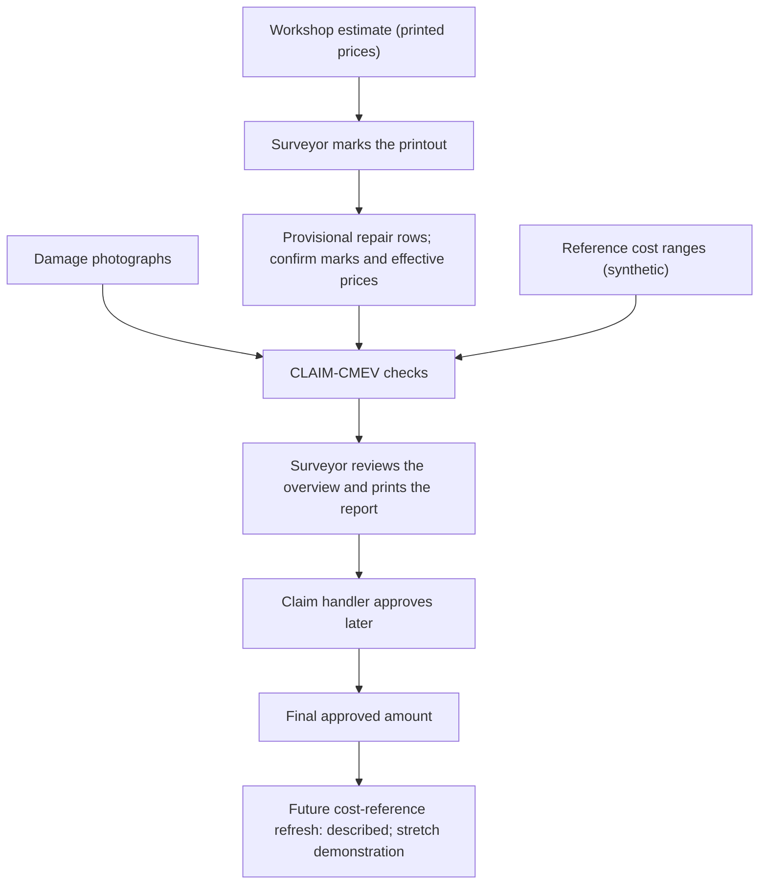
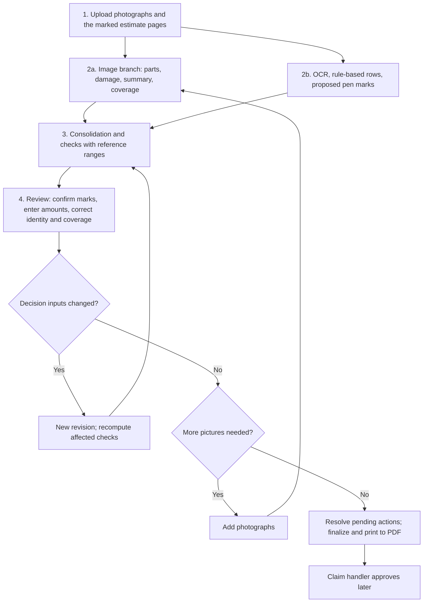
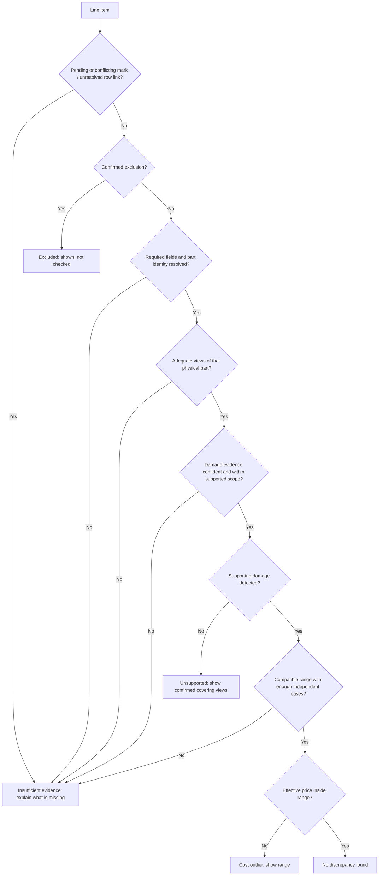
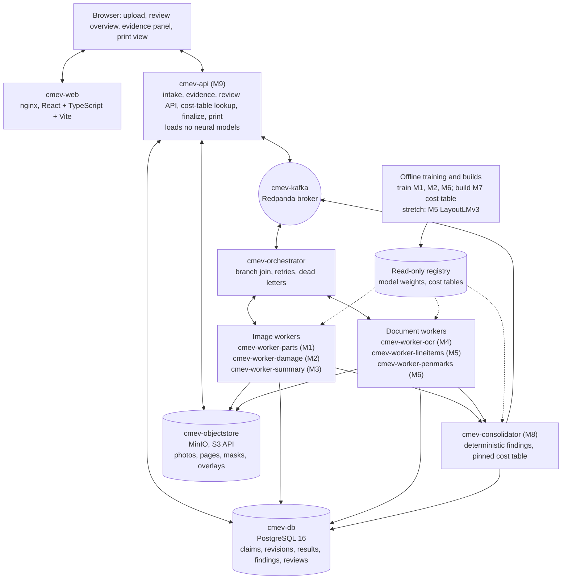

# CLAIM-CMEV

## Cross-Modal Evidence Verification of Declared Repair Scope Against Photographic Damage Evidence in Motor Own-Damage Claims

**Project Proposal — version 2 (simplified scope)**

| | |
|---|---|
| **Group ID** | ACERY |
| **Members** | Divakaran Pillai Arunkumar; Miguel Rodel Felipe; Lau Lay Khoon; Lim Chong Jen; Sun Yan |
| **Programme** | NUS-ISS Graduate Certificate in Pattern Recognition Systems |
| **Modules** | PSUPR, PRMLS, ISSM |
| **Document version** | v2, revised 22 September 2026 following scope review. This version replaces [v1](CLAIM-CMEV_project_proposal_v1.md) for planning; existing implementation specifications still need alignment (§16). |
| **Effort budget** | 10 person-days per member: 5 implementation/data, 2 integration/evaluation, 1 contingency, 2 report/presentation. 50 person-days in total. |

**In plain terms:** A surveyor uploads photographs of a damaged car and a photographed copy of the workshop's repair estimate. The surveyor has marked the estimate with a pen: an "X" on items that will not be paid, and a new price where the price changes. CLAIM-CMEV identifies visible damage, reads the printed repair rows and proposes the locations of pen marks. The surveyor confirms exclusions and types revised amounts. One overview links the repair list to its evidence and synthetic cost ranges. Unclear inputs stay marked as needing information. The surveyor corrects the list and prints the reviewed report to PDF.

CMEV stands for **Cross-Modal Evidence Verification**. "Cross-modal" means using different types of evidence: images and document text. CLAIM identifies the motor-claims application; it is not an acronym.

---

## Changes from version 1

Version 2 keeps the purpose, the checks and the main safety rules of version 1. It narrows supported document layouts, reduces screens and datasets, and simplifies deployment. CarDD access has been requested; receipt of consent and usable files remains a prerequisite. The table lists each change and its reason.

| Area | Version 1 | Version 2 | Reason |
|---|---|---|---|
| Document input | Digital or scanned survey report written by the surveyor | Photographed or scanned printout of the **workshop estimate**, marked by the surveyor with a pen | Matches the real working method described by the team |
| Document methods | LayoutLMv3 or Donut, trained on DocILE | Pretrained OCR, rule-based parser for 2–3 layout families, pen-mark detector, manual amount entry; LayoutLMv3 and TrOCR are stretch goals | Bounds data preparation and model integration work |
| Document data | DocILE, CORD, SROIE, FUNSD | Generated estimates and team-marked printouts; CORD preparation and label alignment only for the LayoutLMv3 stretch goal | Keeps domain evaluation in the core scope |
| Vision data | HITL, VehiDE, CarDD, CrashCar101, DSMLR | HITL parts; CarDD damage, subject to requested access; small team-labelled matching and vehicle-group sets | One primary source per segmentation task |
| Multi-view method | 3D projection method with CrashCar101 groups | Conservative part summary with retained observations; manual identity/coverage confirmation where needed | Avoids claiming physical damage deduplication from category labels alone |
| Screens | Three working screens and four static mockups | One working **review overview** page with an evidence panel, an upload page and a print view | The workflow centres on one list |
| Assessment export | Structured export | The surveyor prints the finalized overview to PDF | Requested output |
| Cost data | A 630-row synthetic file (never supplied) | A generated price table with documented rules | Gives known ranges and controlled sparsity |
| Cost key | Part, side, operation, damage type, vehicle class, currency | Part, operation, vehicle class, currency under one fixed cost basis; no model-year feature | Keeps generation, training and lookup consistent |
| Deployment | Workbench, backend, image worker, document worker, PostgreSQL | Containerised, one container per module, Kafka between them, PostgreSQL, MinIO (§9.1, [ADR 0002](adr/0002-containerised-event-runtime.md)) | User-directed on 2026-09-22 for independent module ownership and restart; more plumbing than the two-process design this row originally proposed |
| Extra comparators | Joint image-text model; image-text alignment | Not included | No time |
| RQ2 | Do synthetic joint labels improve part matching? | Can marks be detected and linked reliably enough to support human confirmation? | Does not require automatic handwriting recognition |
| Approval import and cost refresh | Demonstrated | Described only in the core scope; a script is a stretch goal | Preserves the separation of amounts without adding core integration work |
| Effort reserve | No explicit allocation | Five person-days of contingency, separate from integration, evaluation and reporting | Accounts for failed experiments and integration problems |

---

## 1. Executive summary

A motor own-damage claim covers damage to the policyholder's own vehicle. The workshop prepares an estimate. A surveyor inspects the vehicle, photographs the damage, and decides which estimate items to accept, reject or reprice. A claim handler later approves the claim.

In the working method addressed by this project, the surveyor prints the workshop estimate and marks it with a pen. An "X" means the item will not be paid. A handwritten number means a new price. The surveyor then uploads the damage photographs and the marked estimate.

CLAIM-CMEV processes the two inputs separately and then combines the results:

1. **Image branch.** Two segmentation models find parts and damage. A part summary retains the source observations. Side and coverage remain unresolved unless supported by evidence or a recorded human confirmation.
2. **Document branch.** Pretrained OCR reads printed text and its positions. A rule-based parser groups it into repair rows for 2–3 supported layout families. A detector proposes exclusion and price-change marks. The surveyor confirms exclusions and enters revised amounts.
3. **Consolidation.** Rules combine the two branches with synthetic cost ranges. Pending marks, uncertain identity, incomplete extraction and inadequate views withhold the affected checks. Eligible items receive photo-evidence and cost results; possible additions require sufficiently complete declarations.
4. **Review and print.** The surveyor corrects entries and dismisses findings with a reason. Corrections affecting decisions create a new assessment using the corrected inputs. The final print view records the exact reviewed revision.

The core plan has nine modules, one review workflow with upload and print, four trained or fine-tuned models (M1, M2, the M6 detector and M7), and pretrained OCR. M5 is a parser, not a trained model. LayoutLMv3 with CORD adaptation, TrOCR and an approval-refresh script are stretch goals (§12.3). Reference costs are synthetic; results establish logic and calibration under the generator, not real repair-price accuracy. Any contingency reduction is reported against the original commitments.

---

## 2. Problem and inputs

### 2.1 The surveyor's work today

The surveyor reviews the workshop estimate, inspects the vehicle, identifies damaged parts, decides on repair or replacement, negotiates prices, and prepares a report. Two problems remain:

- **Repeated manual checks.** The surveyor compares each estimate item with the photographs by eye.
- **Records that are hard to compare.** Photographs and marked estimates are stored as files. There is no structured record linking vehicle, part, operation and price. A later claim for a similar repair cannot easily use the earlier one as a reference.

### 2.2 The marked workshop estimate

The document input is a **marked workshop estimate**: a printout of the workshop's repair estimate, marked by the surveyor with a pen, then photographed with a phone or scanned. Workshops may call this document a quotation or a repair list. It is not an invoice: nothing has been paid at this stage. It can have several pages.

The prototype detects two kinds of pen marks; it does not automatically read revised amounts in the core scope. The marking rules below are the input convention. They will be confirmed with a practising surveyor if one is available. Printed rows must use one of the supported layout families (§10, M5); other layouts remain available for manual entry.

| Mark | Meaning | Name in this document |
|---|---|---|
| An "X" written over a line item or over its amount | The surveyor will not pay this item | **Exclusion mark** |
| A number written next to or above the printed amount | The new amount for this item | **Price change** |

Other marks, such as ticks, circles or notes, are not interpreted. They remain visible in the page image.

Two terms follow from the marks:

- The **effective price** is the revised amount entered and confirmed by the surveyor, or the readable printed amount when no price change is pending or confirmed. A pending price change leaves the effective price unresolved; it does not fall back to the printed amount.
- The **declared repair scope** contains the non-excluded rows at their effective prices. Before confirmation it is provisional. Only a confirmed exclusion removes a row from checks; pending marks remain visible and block a confident decision for that row.

Each proposed mark is `pending`, `confirmed` or `rejected`. Rejection dismisses a false detection; confirmation records the actual decision and, for a price change, an exact amount. An unlinked mark or conflicting marks require correction of their row association. The surveyor can also add a missed mark. A confirmation of one mark does not silently resolve another pending mark.

### 2.3 Three amounts that must stay separate

| Amount | Where it comes from | How the system uses it |
|---|---|---|
| **Workshop printed price** | Printed on the estimate | Shown for reference; extracted by the document branch |
| **Surveyor's effective price** | Readable printed price without a pending change, or a revised amount entered and confirmed by the surveyor | Checked only when resolved and comparable with the reference range |
| **Final approved amount** | Recorded later by the claim handler | Never used in the assessment of the same claim; may feed a later cost-reference refresh |



The system keeps the original printed extraction, reviewed effective values and any final approval separate. Final approval is normally absent in this prototype and is never fabricated. A surveyor's edit is not an approval. The approval-refresh workflow is described; importing approvals is a stretch demonstration.

### 2.4 What the system checks

A **line item** is one row of the estimate: a part, a repair operation, and a price. The image branch produces **damage observations**: a part, a damage type, and the photographs that show it.

| Check | Question | Example finding |
|---|---|---|
| Photo evidence | Is damage visible on the same physical part, with resolved identity and adequate views? | "Right rear door repair: no supported damage type detected in the confirmed adequate views" |
| Cost range | Is the effective price inside the reference range for the same part, operation and vehicle class? | "Front bumper replace: S$1,150 is above the reference range S$620–S$890 (47 records)" |
| Missing repairs | Is supported visible damage absent from sufficiently complete declarations? | "Dent on confirmed left fender; no matching estimate row found" |

If a part is not photographed, its identity is unresolved, or it is cropped, obscured or poorly lit, the result is **insufficient evidence**. A sharp, large mask alone cannot establish adequate coverage. Unsupported findings are limited to supported damage categories and assessable parts; uncertain damage evidence also withholds the decision.

### 2.5 What the system does not do

- Approve or reject a claim, choose a settlement amount, or replace the surveyor's judgement.
- Treat an unphotographed part as an undamaged part.
- Detect staged accidents or fraud outside the estimate and photographs.
- Train on fraud outcomes. The project has no fraud labels.
- Interpret pen marks other than exclusion marks and price changes.

### 2.6 Valid reasons for a mismatch

A repair or price can be correct even when the photographs do not show why. The surveyor can record a reason when dismissing a finding: hidden damage found after dismantling, ADAS calibration or specialist procedure, parts price change, inadequate photograph, system error, or other. The reason stays in the record.

---

## 3. Goals

### 3.1 Primary goal

Build a working pipeline that reads a claim's photographs and its marked workshop estimate. The pipeline checks each line item and shows the results in one editable overview. The surveyor prints the overview as a PDF report.

### 3.2 Technical objectives

1. **Identify vehicle parts** in photographs by labelling their pixels.
2. **Identify damage** by type and area, and match each damage region to its part.
3. **Summarise photographs** by part while retaining observations, side uncertainty and coverage limits.
4. **Read the estimate**: recognise the printed text and group it into line items with page locations.
5. **Detect the pen marks**: propose exclusions and price changes, link them to rows, and capture human confirmation and revised amounts.
6. **Build reference cost ranges** with supporting record counts.
7. **Consolidate and check**: apply the photo-evidence, cost and missing-repair checks and explain each result.
8. **Store the reviewed record** with every surveyor action, and print the finalized report.

### 3.3 Product objectives

9. Build the upload page, the review overview page with its evidence panel, and the print view, using real model output.
10. Describe the remaining views (claim list, cost-range detail, operations dashboard, audit view) in the report, without committing additional screens or mockups.
11. Measure the editing effort and the review usability of the overview page.

### 3.4 Research questions

- **RQ1:** How accurate are part segmentation, damage segmentation and damage-to-part assignment? How do photograph quality and coverage affect decisions and withholding?
- **RQ2:** How accurately are exclusion and price-change marks detected and linked to rows, and how many corrections are needed to reconstruct the scope? Automatic amount-reading accuracy is evaluated only if the TrOCR stretch goal is attempted.
- **RQ3:** On a small labelled vehicle-group set, how useful is the conservative part summary compared with separate per-image observations? What opposite-side errors, incorrect groupings or lost observations remain? This is an exploratory case study, not a general claim of physical damage deduplication.
- **RQ4:** Under the documented synthetic price generator, how do interval coverage, width, anomaly-flag precision and withholding change with fewer independent reference cases?

### 3.5 Outside the project scope

Production deployment, live claims-system integration, automated settlement, non-visual fraud, hidden structural damage, real repair-price validation, arbitrary workshop layouts, automatic repair-operation selection and pen marks other than the two defined kinds. New vehicle datasets and larger segmentation backbones are not planned. Stretch goals in §12.3 are not required for core success.

---

## 4. Mapping to course requirements

The project targets the course minimum of three required aspects using the contributions below. The team will confirm which contributions count against the rubric before implementation. No unsupervised-learning component is planned.

| Aspect | Implementation | Evidence |
|---|---|---|
| Supervised learning | Part segmentation (M1), damage segmentation (M2), pen-mark detection (M6), reference cost ranges (M7) | Trained models and results on held-out data |
| Machine learning / deep learning | SegFormer, Faster R-CNN and LightGBM; pretrained OCR supports extraction | Model design, training runs and bounded baseline comparisons |
| Hybrid / ensemble | Decision-level fusion of the image branch, the document branch and the cost ranges in M8 | Combined result versus each branch alone |
| Intelligent sensing / sense-making | Part summary with uncertainty and coverage states (M3); detection and human confirmation of marks (M6) | Grouped-view case study; mark detection, linking and correction results |

The cost model learns reference ranges from labelled price records. The cost check applies rules to those ranges; it is not claimed as unsupervised learning. The parser is deterministic. LayoutLMv3 and TrOCR are additional experiments only; course compliance must not depend on completing them. The rows above describe contributions, not a verified count of independent rubric categories.

---

## 5. Product, users and value

CLAIM-CMEV is decision-support software for motor insurers. Its first benefit is less manual checking for the surveyor. Its later benefit is a structured history of parts, operations and prices that supports cost comparison. Both need evidence from a deployment; this project measures model accuracy, editing effort and review usability only.

| User | Role in this project |
|---|---|
| **P1 Surveyor** (primary) | Uploads inputs, reviews the overview, edits, confirms, prints |
| P2 Claim handler | Receives the printed report; records final approval outside the prototype |
| P3 Investigator / compliance reviewer | Needs the stored record: inputs, model versions, findings, actions and reasons |

The commercial model, deployment stages and buyer value from v1 §5 are unchanged and are not repeated here.

---

## 6. Workflow



**Example.** The surveyor uploads six photographs and two estimate pages in a supported layout. Item 3, "rear door — repair — S$480", has a proposed exclusion; checks are withheld until the surveyor confirms it, after which it is struck through. Item 5, "front bumper — replace — S$1,150", has a proposed price change. The surveyor types and confirms S$980. A new assessment checks that amount against the pinned synthetic range S$620–S$1,020. The old extracted amount and previous findings remain stored. Item 7, "left fender — repair", has no adequate confirmed view; the overview asks for more pictures. After the surveyor checks declaration completeness, a bonnet dent without a matching row appears as a possible addition. The surveyor adds it without an invented price, resolves remaining mark actions and prints the report with any outstanding insufficient-evidence results.

---

## 7. User interface

### 7.1 Upload page

Fields: claim reference, vehicle make, model and year, currency, photographs (JPEG/PNG), estimate pages (JPEG/PNG/PDF). The cost comparison supports SGD only; other currencies remain visible with no cost check. Model year is metadata and does not change the synthetic reference. Shows queued, processing, ready for review, incomplete or failed. A failure must not look like a finished assessment with no findings.

### 7.2 Review overview page

This is the main working screen. It has four sections.

**Damage summary.** One row per resolved part/side, with unresolved observations listed separately: damage detected (with types), no supported damage type detected in adequate views, or not assessable. Each row expands to its source observations. The evidence panel lets the surveyor confirm the identity of a visible part and whether its views cover enough of the part to judge; these actions retain actor, source and revision.

**Line items.** One row per estimate line item.

| Column | Content |
|---|---|
| Part, side, operation | Extracted text and mapped terms; unresolved values stay explicit and are editable |
| Printed price | From the estimate |
| Pen marks | Proposed type and pending / confirmed / rejected state; unlinked marks stay visible |
| Effective price | Confirmed revised amount entered by the surveyor, or readable printed amount without a pending change; otherwise unresolved |
| Photo evidence | Supported (n views) / No damage visible (n views) / Take more pictures |
| Cost check | Within range / Above range / Below range / Not checked (reason) |
| Result | One of the four results below |
| Actions | Confirm/reject or add a mark, enter an amount, correct a row, dismiss finding with reason, open evidence |

| Result | Display label | Meaning |
|---|---|---|
| `ok` | No discrepancy found | Supported and within range |
| `unsupported` | No supporting damage detected in adequate views | Resolved identity, adequate coverage and confidently no supported damage type detected |
| `cost_outlier` | Cost outside reference range | Supported, but effective price outside the range |
| `insufficient_evidence` | More information needed | Pending mark, unresolved identity/amount, incomplete extraction, uncertain damage, inadequate views or no compatible range |

`insufficient_evidence` is informational. It must look different from a discrepancy flag. Only confirmed exclusions are struck through and not checked. Exclusion is a separate row state, not an `ok` finding. The page also shows declaration completeness and any unreadable or unlinked regions.

**Possible additions.** Eligible observations without matching rows, subject to the completeness and identity safeguards in §8.2. The surveyor can add, edit or dismiss each one. An added item has no invented price or repair operation; the surveyor supplies them.

**Finalize.** The button freezes the current review revision and opens the print view only after decision-changing edits have been assessed and pending marks have been confirmed, rejected or explicitly corrected. Unlinked marks must be resolved. It cannot finalize while a required job or recomputation is unfinished or failed. Insufficient-evidence results can remain in the report with their reasons; finalization does not turn them into passes.

Every edit keeps the original extracted value visible. A changed part, side, operation, effective amount, mark decision, declaration-completeness confirmation or coverage confirmation creates a new input/assessment revision (§8.4). Dismissals create review events for the existing finding; selecting a reason records the dismissal.

### 7.3 Evidence panel

Opens beside the overview when the surveyor selects a row. It shows:

- The photographs that cover the part, with part and damage overlays, and a one-tap link to the original photograph.
- The estimate page image with the line item's box highlighted, and any detected pen mark boxes.
- Controls to correct row/mark association and to confirm visible part identity or coverage without altering model predictions.

### 7.4 Print view and assessment report

The print view renders the finalized overview as a report. It contains:

- claim and vehicle details;
- the damage summary;
- the final line items with printed and effective prices;
- confirmed excluded items and the record of mark decisions;
- possible additions accepted by the surveyor;
- findings, unresolved evidence or declaration gaps, and dismissal reasons;
- a clear synthetic-cost label and the fixed cost basis; final approval shown as not recorded unless an approval was actually imported in a stretch demonstration;
- a footer with input, assessment and review revisions, model/parser/configuration versions and cost-table version.

The surveyor prints it to PDF from the browser. The stored review revision is the authoritative record. The PDF is a rendering of it.

### 7.5 Views described but not built

Claim list, cost-range detail, operations dashboard and audit view are described in the report. They are not additional implementation commitments within the 50-person-day plan.

### 7.6 Interface requirements

- Large controls that are readable on a tablet.
- One-tap access to the original photograph.
- Visible model and cost-table versions.
- A clear difference between a processing failure, missing evidence and a completed check.
- An idempotent save, so that a retried submission does not duplicate a review action.

---

## 8. Decision rules

### 8.1 Rules for one line item



Each check result is stored separately as well as the overall result. A supported photo check can coexist with a withheld cost check. Pending price changes never trigger a cost comparison against the printed amount. A detection failure is not proof that no pen mark or damage exists; unreadable regions, low-confidence results and review corrections remain explicit. Failed processing is an operational state, not an empty successful result. Skipped checks are `not_evaluated`.

No left/right identity is inferred from HITL's unsided labels. A declaration for the left door cannot use the right door's coverage or damage. A recorded human identity confirmation may enable a match; uncertain part categories or sides withhold it. Blur and mask size are screening signals, not proof of full-panel visibility. Cropping, obstruction, lighting and the supported damage types also constrain a negative finding.

### 8.2 Possible additions

A confident damage observation on a resolved physical part can become a possible addition only when the relevant declarations are sufficiently complete and no row matches it. An uncertain part name, unknown side, unreadable row/page, unlinked mark or pending exclusion may hide a match. Show an ambiguity for review in those cases. A parser returning no rows is not an explicitly empty estimate; the surveyor must confirm an empty scope.

If the surveyor confirmed an exclusion for the same resolved part, suppress the addition and put an informational damage note on that excluded row. An exclusion on the right door does not suppress left-door damage. Multiple operations on one part can be legitimate. A proposed addition retains its observations but has no invented operation or amount.

### 8.3 Cost matching

The cost key is **part, operation, vehicle class and currency**, under a versioned, fixed cost basis. The generator, LightGBM features, percentile groups and published lookup use these same dimensions. Model year remains claim metadata; it is excluded from generation, training and lookup. Side and damage type are also excluded from cost grouping, although physical identity is still required for photographic matching.

The prototype compares SGD amounts for one part and one operation, before tax, without discounts. Replacement means part supply only; repair means repair labour only; paint means paint materials and labour. Bundled operations, unspecified bases, quantities other than one, other currencies, unknown classes and unsupported part/operation combinations receive no cost comparison. A missing quantity is not silently set to one. These are synthetic comparison conventions, not claims about workshop billing practice.

Repair, replacement and paint never share a range. Exact decimal amounts and the applicable cost basis are retained. Support counts independent eligible base cases, not repeated quotes from one case. A missing or sparse range is absent with a reason, never a zero range. Equality at a bound is within range. Exceeding a reference interval indicates an unusual synthetic price, not proof of an incorrect price or fraud.

### 8.4 Corrections and reassessment

The original extraction, predictions and findings are immutable. A decision-changing correction or confirmation records the actor, original/new value and source, then creates a new input/assessment revision. Unchanged image/OCR results can be explicitly reused with their lineage; rerunning the neural models is not necessary for a price correction. Recompute affected summary/coverage rules and M8 findings using the pinned model/configuration/cost bundle. The old assessment remains available.

Dismissals and notes reference their original findings and create review revisions. They do not silently apply to changed findings. Review saves and reassessment requests are idempotent. The print view uses only a completed assessment and its matching frozen review revision; it never mixes new values with stale findings.

---

## 9. Architecture and serving

### 9.1 Processes and storage

The system runs as containerised services built from one Python code base, plus a browser front end. One container per module exchanges work over Kafka; there is no shared jobs table and no single worker process. This section is the high-level view; [ADR 0002](adr/0002-containerised-event-runtime.md) records the decision and the [technical specification](specs/technical_specification.md) is the maintained, detailed source.



| Component | Responsibility | Notes |
|---|---|---|
| Browser front end | Upload, overview, evidence panel, print | React + TypeScript + Vite, served by `cmev-web`. Overlays and highlighted pages are images rendered by the server, so the browser does no drawing |
| `cmev-api` (M9) | Validate uploads, create input revisions, publish Kafka commands, serve evidence and review endpoints, finalize, print | FastAPI. Reads the cost-table version pinned to each assessment; retains access to earlier tables. Loads no neural models |
| `cmev-orchestrator` | Track per-input-revision branch completion, emit the consolidate command, retry, route to the dead-letter queue | No neural models |
| Image workers (M1–M3) | `cmev-worker-parts`, `cmev-worker-damage`, `cmev-worker-summary` | One container each in the `full` profile. M1/M2 load SegFormer-B0 weights; M3 is rules only |
| Document workers (M4–M6) | `cmev-worker-ocr`, `cmev-worker-lineitems`, `cmev-worker-penmarks` | One container each in the `full` profile. M4/M6 load pretrained/fine-tuned weights; M5 is the rule-based parser, with LayoutLMv3 behind a flag as a stretch goal |
| `cmev-consolidator` (M8) | Deterministic findings from observations, coverage, line items and pen marks against the pinned cost table | No neural models |
| `cmev-kafka` | Transport between every module | Redpanda, Kafka-API compatible, topics named `cmev.<kind>.<name>.v1`, keyed by claim ID |
| `cmev-db` | All structured records | PostgreSQL 16, replacing SQLite so that several containers can write concurrently |
| `cmev-objectstore` | Originals, derived images | MinIO behind the existing storage adapter, replacing local files |
| Read-only registry | Model registry and cost tables | Mounted read-only into every worker, the consolidator and the API; never written to inside a claim request |
| Offline jobs | Training, evaluation, cost-table builds | Colab/Kaggle GPU or a team GPU. Never run inside a surveyor request |

Two Compose profiles run this same graph. `lean` registers every worker, the orchestrator and the consolidator handler in one combined process, alongside `cmev-kafka`, `cmev-db` and `cmev-objectstore`, for a laptop demonstration. `full` runs one container per row above, for independent restart and resource limits. Both profiles use the same code, topic contracts and records; a result must not differ between them. On days 1–2, install the pinned dependencies and run a small inference batch against the target profile. Record peak memory, startup time and per-stage CPU/GPU latency, and use these results to choose CPU or an available GPU; no laptop latency target is assumed.

### 9.2 Processing sequence

```mermaid
sequenceDiagram
    actor S as Surveyor
    participant A as cmev-api
    participant O as cmev-orchestrator
    participant IW as Image workers (M1-M3)
    participant DW as Document workers (M4-M6)
    participant C as cmev-consolidator (M8)
    S->>A: Upload photos, estimate pages, vehicle details
    A->>A: Validate; store input revision
    A->>O: evt.input-revision-created (Kafka)
    A-->>S: Claim ID, revision, state = queued
    O->>IW: cmd.parts-segment, cmd.damage-segment, cmd.part-summary
    IW-->>O: Observations and coverage saved; image branch complete
    O->>DW: cmd.page-read, cmd.line-items-extract, cmd.pen-marks-detect
    DW-->>O: Line items and pen marks saved; document branch complete
    O->>C: cmd.consolidate (both branches joined)
    C-->>A: evt.assessment-ready; provisional assessment with pinned cost table
    S->>A: Confirm marks, enter amounts, correct identity/coverage
    A->>C: cmd.consolidate (reassessment)
    C-->>A: New input/assessment revision; recompute affected checks
    A-->>S: Updated findings and matching review revision
    S->>A: Dismiss finding with reason or add review note
    A-->>S: Review-only action saved against its finding
    S->>A: Finalize
    A-->>S: Print view
```

If one branch fails, the other branch's result is kept and the assessment is shown as incomplete; `cmev-orchestrator` owns retries and the dead-letter queue. If photographs are uploaded without an estimate, the damage summary is shown and the line-item section says "waiting for the estimate". New photographs or pages create a new input revision and a new assessment; earlier results stay stored.

### 9.3 Records exchanged between modules

Claim results carry claim ID, input revision, schema version and relevant model/parser/configuration versions. Findings and review events also identify their assessment and review revisions. Offline cost tables carry a build identity rather than an artificial claim ID. All monetary values are exact decimals with currency and cost basis.

| Record | Main fields |
|---|---|
| Claim input | Claim ID, vehicle metadata, resolved class or unknown, currency, file IDs, input revision, prior revision and corrected-input references |
| Part coverage | Part/side or unresolved candidates, covering photo/mask IDs, adequate / inadequate / not_visible / unresolved state, quality reasons, human identity/coverage confirmation and provenance |
| Damage observation / part summary | Stable IDs, part identity, damage type, confidence, image-area measure, photo/mask references, all member observation IDs; no inferred count of physical damage instances |
| Page reading / declaration status | Page image, text and boxes with actual OCR granularity/confidence, transforms, quality flags, complete / partial / unreadable / explicitly_empty scope status and source of any human confirmation |
| Line item | Stable entry ID, original text/amount, mapped part/side/operation, quantity, unit price and line total where readable, currency/basis, field uncertainty, page/boxes; corrected values reference their review actions |
| Pen mark | Mark ID, nullable entry ID, candidate rows, type, box, detection confidence, pending / confirmed / rejected state, confirming action; human-entered amount separate from any optional TrOCR suggestion |
| Reference cost range | Cost key and fixed basis, bounds, unique independent base-case count, as-of/cutoff date, table version, provenance and synthetic marker |
| Finding | Finding ID, assessment revision, entry or observation ID, individual checks, overall result, reasons, evidence/range references, pinned versions |
| Review action | Assessment/review revision, actor, time, action type, reason, original/new values, expected prior review revision and idempotency key |

These are proposal-level records to align with the shared contracts (§16). Absent amounts remain null with reasons. Original coordinates and transformation metadata support navigation back to the uploaded images. Predictions, human corrections and final approvals have distinct provenance.

### 9.4 How each model is served

"Served" means how a trained model is loaded and run when a claim is processed. Each neural model runs in its own module worker container, loaded once at container start from the read-only registry. Nothing retrains at request time.

| Model | Runs in | Loaded from | Input → output | How the result is stored |
|---|---|---|---|---|
| M1 part segmentation (SegFormer) | Worker, at start | Model registry `parts/<version>` via Hugging Face `transformers` | Photograph resized to 512×512 → class per pixel, per-class confidence | Part mask PNG per photograph; coverage rows |
| M2 damage segmentation (SegFormer) | Worker, at start | Model registry `damage/<version>` | Photograph → damage class per pixel, confidence | Damage mask PNG; observation rows after overlap with part masks |
| M3 summary and coverage | Worker, with confirmed identity/coverage inputs applied during reassessment | Versioned code/configuration; no weights | Observations and masks → conservative summary and coverage proposals | Member observation IDs; human confirmations stored separately |
| M4 OCR (PaddleOCR) | Worker, at start | Pinned pretrained weights | Corrected page image → located text with confidence | Page-reading JSON per page |
| M5 line-item parser | Worker; no neural weights | Versioned header aliases, layout rules and vocabulary | Located OCR text → rows, fields and uncertainty | Line items, page/boxes and declaration completeness |
| M6 pen-mark detector (Faster R-CNN) | Worker, at start | Model registry `penmarks/<version>` | Page image → boxes with class (exclusion / price change) and score | Unambiguous geometric row links; ambiguous marks retain candidate rows |
| M5 LayoutLMv3 — stretch only | Worker only if explicitly enabled | Candidate/approved `lineitems/<version>` registry entry | Page + aligned OCR tokens/boxes → field labels → same row contract as parser | Alternative extraction with its own method/version |
| M6 TrOCR — stretch only | Worker only if explicitly enabled | Pinned pretrained `trocr-base-handwritten` weights | Price-change crop → suggested amount or unreadable | Suggestion remains separate from the human-confirmed amount |
| M7 reference cost model (LightGBM) | **Not served.** Offline only | Offline script | Synthetic records → ranges and independent support counts | Versioned table; API looks up the assessment's pinned version |
| M8 consolidation and checks | `cmev-consolidator` container | Code and the pinned cost table | Observations, coverage, line items, pen marks → findings | Finding rows; assessment revision |

Serving rules:

- The worker refuses to start if a required configured model is missing or invalid. Disabled stretch models and datasets are not startup dependencies.
- Every result row stores the model or rule/configuration version that produced it. The assessment stores all versions used. A cost-table update never changes an existing assessment; a reassessment creates a new revision.
- Select the serving device, dependencies and model architectures after the early smoke test; freeze evaluated weight/configuration versions at the release checkpoint. Measure a six-photo, two-page case; report latency and memory without assuming a particular result.
- Fixture mode (sample outputs used before models are ready) is marked as fixture in every record and cannot be shown as real inference.

### 9.5 Model registry

Each trained model is a folder `artifacts/models/<model_id>/<version>/` with weights and a manifest recording the checkpoint/licence, data/split hashes, label schema, preprocessing, evaluation, limits and candidate/approved status. Approval here means model-release status, not claim approval. The parser and matching/coverage rules have code and configuration versions. Cost tables under `artifacts/cost_tables/<version>/` retain build membership, exclusions, independent support counts and calibration results. Disabled stretch experiments have no required registry entry.

### 9.6 Failure handling

- A job key of claim, input revision, task and model/parser/configuration versions is unique. A retried job replaces its own unfinished partial result without duplicating rows or rewriting a completed historical assessment.
- A stale result for an old revision is kept for that revision and never replaces the current assessment.
- Review saves carry an idempotency key and expected review revision. A repeat returns the original result; a stale conflicting edit is rejected for reload rather than overwriting newer decisions.
- Corrected inputs and reused inference artifacts retain lineage. Finalization rejects stale or unfinished reassessments.
- Model files, datasets and generated exports stay in ignored local folders; only manifests and aggregate results are tracked.

---

## 10. Functional modules

Version 2 keeps nine modules. The last column maps each one to v1 so that the existing module specifications can be updated rather than rewritten.

| v2 | Module | Runs in | Method (short) | v1 |
|---|---|---|---|---|
| M1 | Vehicle part segmentation | Worker | SegFormer-B0 fine-tuned on HITL part labels, 21 classes | M01 |
| M2 | Damage segmentation and part matching | Worker | SegFormer-B0 fine-tuned on the 6 CarDD damage categories; conservative mask-overlap assignment | M02 |
| M3 | Part summary and coverage | Worker + reviewed inputs | Retain observations grouped by resolved part identity; quality screening and recorded identity/coverage confirmation | M03 (simplified) |
| M4 | Page reading | Worker | Page detection and perspective correction (OpenCV), then PaddleOCR | M04 (photographed pages instead of digital PDFs) |
| M5 | Line-item extraction | Worker | Header/column/row rules for 2–3 layout families; conservative vocabulary mapping; LayoutLMv3/CORD adaptation is stretch only | M05 |
| M6 | Pen-mark recognition | Worker + review API | Faster R-CNN detects exclusion/price-change marks; geometric linking; human confirmation and amount entry | New |
| M7 | Reference cost ranges | Offline | LightGBM quantile regression (5th and 95th percentiles) on generated prices; empirical percentiles as baseline; versioned table with counts | M06 |
| M8 | Consolidation and checks | API | Rules in §8; cost comparison with deviation; explanations; version pinning | M07 + M08 |
| M9 | Review overview and report | Browser + API | Upload page, overview, evidence panel, print view; review revisions | M09 |

### M1 — Vehicle part segmentation

**Purpose:** label the pixels of each vehicle part in a photograph.
**Method:** fine-tune SegFormer-B0 at 512×512 with shared training code for M2. Larger backbones are outside the plan.
**Classes:** the 21 HITL part categories, plus a background label in the documented encoding.
**Output:** part mask, confidence and photograph reference. HITL has no left/right labels, so the prediction preserves unresolved side. A separate human confirmation can associate a visible part with a physical part/side; it never rewrites the model output.

### M2 — Damage segmentation and part matching

**Purpose:** find damage and assign it to a part.
**Method:** fine-tune SegFormer-B0 on CarDD's six categories: dent, scratch, crack, glass shatter, lamp broken and tire flat. Convert the instance annotations to semantic masks with a recorded policy for overlaps and background. Report semantic segmentation metrics; do not call them instance-segmentation results. The model does not cover HITL-only damage types such as corrosion or flaking.

For each connected damage region, calculate its overlap with the predicted part masks. Assign a part only when the overlap is sufficient and the candidate is unambiguous; otherwise preserve unknown identity. Choose thresholds on validation data. This predicts a part category, not a resolved side or a required repair operation. Evaluate assignment on a small independently labelled set with both damage and part identities (§11.5).

**Output:** per-photograph observations with part or unresolved candidates, damage type, image-area measure, confidence and mask reference. CarDD consent and acquisition are prerequisites; a delayed-source fallback is described in §12.4 and cannot silently reuse CarDD class names or targets.

### M3 — Part summary and coverage

**Purpose:** a readable part summary with explicit limits on identity and visibility.
**Method:** group observations under a resolved physical part/side and retain every source observation. Unknown-side observations stay separate and cannot establish a same-panel match. A group means that observations refer to one part; it does not assert that they show one physical dent. Do not sum repeated mask areas or infer a damage-instance count.

Coverage states are `adequate`, `inadequate`, `not_visible` and `unresolved`. Mask area, blur, lighting and crop/obstruction checks screen photographs. They do not establish whole-panel coverage. A negative finding requires a resolved physical part and recorded confirmation that the relevant views cover enough of it to judge the supported damage types. Unknown identity remains unresolved; a failed model run is a processing failure rather than not_visible.

**Limit:** no 3D reconstruction or automatic physical-damage deduplication is promised. RQ3 reports the small-sample summary results, identity errors and whether distinct observations remain accessible. Human-assisted and automatic results are reported separately.

### M4 — Page reading

**Purpose:** turn a photographed or scanned estimate page into text with positions.
**Method:** convert PDF pages to images; correct perspective/rotation with OpenCV where the page boundary can be found reliably; run a pinned PaddleOCR version. Establish the actual text-box granularity in the early smoke test. Do not invent word-level boxes when the engine supplies only line boxes. If text spans several table columns without reliable field locations, flag it for correction. Tesseract is an installation fallback selected by day 2, not an additional model comparison.
**Output:** located text, recognition confidence, reading order, transforms back to the original page, and quality flags. Failed correction/OCR or obscured print marks the affected page/rows incomplete.

### M5 — Line-item extraction

**Purpose:** turn printed OCR output into repair rows while preserving uncertain fields and extraction completeness.
**Committed method:** a deterministic parser for 2–3 documented table-layout families. It uses headers and relative column positions, not one set of absolute page coordinates.

| Step after OCR | Rule and output |
|---|---|
| Locate the repair table | Match header aliases such as Description, Operation, Qty, Unit Price and Amount; identify columns and table boundaries |
| Group text into rows | Use vertical alignment and spacing; attach a wrapped description only when its continuation is unambiguous |
| Assign fields | Use column locations and row membership; preserve multiple operations on the same part as separate rows |
| Map vocabulary | Use reviewed aliases, e.g. FRT BUMPER → front-bumper and RPL → replace; ambiguous or fuzzy matches remain suggestions for correction |
| Parse values | Read exact decimals, currency, quantity and unit/line amounts without substituting zero for missing text |
| Validate | Check required fields, plausible row alignment and quantity × unit price when applicable; identify headings, totals and tax lines without treating uncertain rows as absent |
| Publish | Emit rows with original text/page boxes, field uncertainty and declaration-completeness status |

For example, `FRT BUMPER | REPLACE | 1 | 980.00 | 980.00` becomes part `front-bumper`, operation `replace`, quantity `1` and printed line amount `980.00`. Currency and cost basis come from explicit document/claim information or a recorded correction. Pen marks are handled by M6 and never silently replace the printed extraction.

Unsupported layouts, ambiguous columns and obscured values remain visible for manual correction. A no-row result cannot mean a confirmed empty scope. The parser needs development and evaluation, but no CORD preparation or model training in the core plan. **LayoutLMv3 training, CORD preparation and training-label alignment remain a combined stretch goal in §12.3, S1.**

### M6 — Pen-mark recognition

**Purpose:** propose marks and their row associations for human review.
**Method:** fine-tune a COCO-pretrained Faster R-CNN (ResNet-50 FPN) for exclusion and price-change boxes. Link a detection only when its geometry identifies a row unambiguously; vertical overlap, distance and amount-column position are used with validation-set tolerances. A mark above an amount may overlap the preceding row, so maximum vertical overlap alone is insufficient. No clear match means unlinked, with candidate rows retained.

All proposals start pending. The surveyor confirms or rejects exclusions, corrects associations and types revised amounts. A detected amount-shaped mark is not a recognised amount. Conflicting marks remain unresolved; the surveyor can add missed marks. The optional TrOCR experiment (§12.3, S2) supplies suggestions only.

**Output:** mark IDs, boxes, candidate/resolved entry IDs, type and confidence. Review actions store confirmation and the entered amount separately from the original detection.

### M7 — Reference cost ranges

**Purpose:** publish a comparable synthetic price interval and its independent support count.
**Method:** compare empirical percentiles with a bounded LightGBM experiment using 5th and 95th quantile objectives. Features are part, operation and vehicle class, with SGD and the fixed cost basis held constant (§8.3). Model year is excluded. Both methods publish the same lookup key and basis.

Use training data for fitting and validation data for method/support-threshold selection. If conformal adjustment is selected, fit it on a separate calibration partition. Freeze the policy before evaluating the untouched final test set. Do not adjust intervals in response to final test results. Record interval ordering, coverage, width, withholding and support by key; invalid or crossed bounds cannot be served as a valid range.

**Rule:** keys below the selected minimum number of independent eligible base cases receive no range. Repeated workshop quotes cannot inflate that count. The manifest records generator rules, split/cutoff, calibration, membership and synthetic provenance. The empirical method is the contingency fallback (§12.4).

### M8 — Consolidation and checks

**Purpose:** combine everything into findings.
**Method:** the rules in §8. The cost check returns within range, above range (with the amount above the upper bound), below range, or not checked with a reason. Each finding has a short explanation and links to its photographs, masks, page box and range.

### M9 — Review overview and report

**Purpose:** let the surveyor review, correct, confirm and print.
**Method:** the pages in §7 against the API. Every action is a review-action row. "Finalize" freezes the revision and opens the print view.

---

## 11. Models and datasets

### 11.1 Core and stretch methods

| Method | Commitment | Development/training inputs | Evaluation inputs |
|---|---|---|---|
| M1 SegFormer-B0 parts | Core fine-tuning | HITL part images (998); access and annotation inspection required | Held-out HITL parts; team photos as a separately reported domain check |
| M2 SegFormer-B0 damage | Core fine-tuning, subject to requested CarDD access | CarDD (4,000 images, six damage categories) | Held-out CarDD damage; team photos reported separately |
| M3 part summary | Core rules and reviewed identity/coverage | Development vehicle groups; no learned weights | Separate labelled vehicle groups; automatic and human-assisted results |
| M4 PaddleOCR | Core pretrained inference | No project training; pinned OCR version and preprocessing | Team-photographed pages, including printed amount fields |
| M5 rule-based parser | Core deterministic extraction | Generated estimates in 2–3 layout families; development pages and vocabulary | Held-out page/template variants within supported families; unsupported layouts separately |
| M6 Faster R-CNN detector | Core fine-tuning | Generated marks and a designated development subset of team-marked pages | Held-out team-marked pages; writer, template and physical-page separation |
| M7 LightGBM and empirical percentiles | Core bounded comparison | Generated prices with independent base-case IDs | Separate validation/calibration/final-test partitions and RQ4 subsets |
| M5 LayoutLMv3 + CORD adaptation | **Stretch S1 only** | CORD preparation, OCR/ground-truth label alignment and two-stage training (§12.3) | Same frozen document test cases as the parser; unseen-layout results separate |
| M6 TrOCR | **Stretch S2 only**, pretrained | Isolated price-change crops; no additional fine-tuning commitment | Exact amount accuracy on held-out team pages; suggestions always confirmed |

Four models are trained or fine-tuned in the core plan: M1, M2, the M6 detector and M7. OCR is pretrained. LayoutLMv3 and TrOCR are not core startup or success dependencies. Record exact checkpoint and dependency licences in manifests: the selected SegFormer and LayoutLMv3 checkpoints have research/non-commercial restrictions. Dataset access and model licensing are separate considerations.

### 11.2 Vehicle image datasets

| Dataset | Contents | Role and access status |
|---|---|---|
| HITL Car Parts and Car Damages | 998 part-labelled images, 814 separately damage-labelled images; 21 part categories and 8 damage categories | **Core: parts only.** Publisher lists CC0 and an access form. The damage subset is a contingency source, not an extra committed training dataset |
| CarDD | 4,000 high-resolution images with six damage categories and instance annotations | **Planned primary damage dataset.** The team has sent its request. Consent and acquisition have not been confirmed; research use requires prior consent under the [publisher's licence](https://cardd-ustc.github.io/docs/CarDD_license.pdf) |
| Team-labelled matching sample | Small sample with damage regions associated with part and side, including unknown identity | **Core evaluation.** Checks M1–M2 assignment, which separate segmentation datasets do not establish |
| Team vehicle groups | Multiple views of the same vehicle, with identity, coverage and observation labels | **Core exploratory evaluation.** Checks the summary and uncertainty rules; no surveyor labels are claimed |

Use CarDD's six categories as the M2 vocabulary. Do not force them into HITL's eight damage labels. Keep background distinct from unsupported/unannotated damage. If the contingency dataset is selected, version the different taxonomy and revise methods and targets before training. VehiDE and DSMLR are not additional commitments in this plan.

### 11.3 Document datasets

| Dataset | Contents | Use |
|---|---|---|
| Generated workshop estimates | 2–3 supported table-layout families with multiple template variants; project vocabulary; exact field/row locations and printed values | **Core.** Parser development/evaluation and base pages for mark synthesis. Reserve variants before rule tuning; include unknown layouts as manual-correction cases |
| Generated marked pages | Synthetic X strokes and handwritten-style price changes on those estimates; perspective, blur, shadow and lighting augmentation | **Core detector training.** Preserve mark type, box and row association; do not count synthetic accuracy as real-page performance |
| Team-marked real pages | About 60 distinct printed estimates, marked by at least three people and photographed under varied conditions | **Core pilot.** Separate development, validation and final-test groups; label printed rows, marks, associations and effective decisions |
| CORD v2 | 1,000 receipt images with text, boxes and item fields; CC BY 4.0 per publisher | **Stretch S1 only.** Preparation and label alignment precede LayoutLMv3 adaptation; receipts do not supply repair-operation labels |

A known layout family is not evidence of performance on arbitrary workshop documents. Report supported-family performance separately from unseen families. Original photographed pages remain available when OCR, parser or mark recognition fails.

### 11.4 Handwriting sources for synthesis

Use a small recorded set of handwriting-style fonts with suitable terms and/or team-written digit crops for the committed mark generator. EMNIST digit images are an optional synthesis source already identified by the project; decimal separators and currency marks need explicit rendering. Preserve the source and licence of each asset. IAM acquisition and additional handwriting datasets are outside the plan.

Synthetic pages train the mark detector. Final mark detection/linking evaluation uses team-marked physical pages. The core model detects the presence and type of a price-change mark; it does not need the digits to be recognised. TrOCR amount reading remains a separate stretch experiment.

### 11.5 Team-made data and annotation

**Team-marked pages.** Plan approximately 60 distinct physical pages, with at least three writers contributing about 20 each. Before collection, allocate writer/template groups to development, validation and final test. With three writers, one can supply each group; report this limited writer diversity. Keep every photograph or augmentation of a physical page in its group, and keep related generated base pages together. Template variants can differ across partitions while retaining the documented layout families.

Include exclusions, price changes, untouched rows, distracting ticks/notes, marks above or between rows, multiple/conflicting marks and partially obscured print. Capture clean and difficult photographs. Retain generated printed text and row ground truth, label visible mark boxes and row associations, and record the intended decision/amount independently of model output. Report pages, rows, marks and writers per partition. Human corrections used for final workflow demonstration must not enter model training or threshold selection.

**Damage-to-part assignment sample.** Label a bounded sample, initially about 30–50 permitted photographs from held-out sources or team photos, with each damage region's part/side or explicit unknown identity. Include boundary-crossing damage, small regions and confusing neighbouring panels. Separate development/validation examples from final evaluation; report the actual class and part counts. Keep final samples out of both segmentation training sets. Dense part-mask annotation is not required solely to score region-to-part assignment.

**Vehicle groups.** Aim for 5–10 vehicles with 4–6 views each. Collect examples of the same damage seen repeatedly, distinct damage on one part, similar left/right parts, adequately visible undamaged parts and obscured/cropped views. Prioritise several damaged vehicles where available, rather than satisfying collection with one damaged vehicle. Preserve vehicle identity and label physical parts, observation correspondence, coverage and uncertain cases. Hide number plates and faces in shared material.

All views of a vehicle stay in one partition. If the small real set lacks a required scenario, report that gap; a structured test can validate its rule but cannot establish real multi-view accuracy. Team labels are a pilot reference, not practitioner ground truth. RQ3 is reported as an exploratory case study with raw counts and examples.

### 11.6 Cost data

The team has no supplied approved-repair price dataset. The unsupplied v1 price file is replaced with a reproducible synthetic generator:

- Up to 18 eligible HITL part categories: omit front-wheel, back-wheel and licence-plate from the cost catalogue. Three operations (repair, replace, paint), four documented vehicle classes, SGD and the fixed basis in §8.3 give at most 216 keys. Freeze eligible part/operation combinations; do not generate implausible combinations merely to fill the grid.
- Model year, side and damage type do not influence generated prices or model features. Year remains display metadata. Left/right price pooling is a synthetic convention; it does not resolve photographic side identity.
- Each eligible key has a documented base price. Independent base cases receive workshop/noise factors. Record IDs distinguish quotes, while base-case IDs identify independent support. Deliberate sparse keys test withholding.
- Generate about 5,000–10,000 records, recording seed, generator version, base-case/workshop IDs, synthetic date, currency, basis and provenance. Record the independent case count after splits; the total row count does not guarantee sufficient support per key.

Use separate base cases for training references and test estimates. Generate ordinary prices and controlled anomalous changes separately, with labels determined by the experiment rather than the model's predicted interval. Synthetic dates support a reproducible cutoff but do not demonstrate real market drift. These experiments test the specified generator, logic and calibration, not real repair-price accuracy or fraud.

### 11.7 Datasets outside the core plan

VehiDE, DSMLR, CrashCar101, DocILE, SROIE, FUNSD, IAM, Ultralytics Carparts-Seg, freMTPL2 and PASCAL-Part are not planned. CORD is reserved exclusively for stretch S1. HITL damage is a named access contingency (§12.4), not an extra experiment beside CarDD.

### 11.8 Splits and leakage

Reserve final-test membership before fitting models, tuning parser rules or selecting thresholds, ideally by day 2. Freeze the final release versions later; freezing versions is not permission to choose test examples after observing results.

- **HITL and CarDD:** record train/validation/test manifests and hashes. Inspect publisher partitions where available, cross-source overlap and near duplicates; group related vehicle/source images where identifiers exist. Disclose missing group metadata. Image hashes alone do not exclude related-view leakage.
- **Matching samples and vehicle groups:** prevent overlap with either segmentation training set; keep all views of one vehicle together and distinguish pilot development from final cases.
- **Documents:** group writer, physical page, generated base page and related template variants. Evaluate held-out variants within supported layout families separately from unseen-family generalization. The parser must not be retuned on final pages.
- **CORD, if S1 starts:** use publisher splits and reserve the project's final document tests for the same comparison used by the parser.
- **Prices:** keep every quote from a base case together. Reserve disjoint training, validation, calibration (if used) and final-test partitions with documented cutoffs. Select support thresholds on validation; never refit calibration on the final test set.

---

## 12. Team, effort budget and plan

### 12.1 Effort and ownership

Each member has 10 person-days. The plan explicitly reserves integration/evaluation, contingency and report time. These are planning allocations, not measured estimates. Data collection, annotation, installation, specification alignment and meetings count against them. GPU runtime can overlap other work, but access delays remain calendar risks.

| Activity | Days per member | Team person-days |
|---|---|---|
| Implementation and data preparation | 5 | 25 |
| Integration and evaluation | 2 | 10 |
| Contingency for failures and corrections | 1 | 5 |
| Report and presentation | 2 | 10 |
| **Total** | **10** | **50** |

| Lane | Core ownership within the five implementation/data days | Assigned integration/evaluation work within the two reserved days |
|---|---|---|
| 1 Vision | HITL/CarDD acquisition checks and conversion; shared M1/M2 training code; conservative assignment and M3 summary; overlays | Image worker adapter and artifact/coordinate checks; RQ1 and exploratory RQ3; lead the bounded assignment/vehicle annotation protocol |
| 2 Document extraction | M4 preprocessing/OCR; M5 parser for supported layout families; vocabulary mapping and completeness | Document worker adapter and line-item response contract; extraction/evidence-link checks and M4/M5 evaluation |
| 3 Document synthesis and marks | Early estimate generator; simple mark synthesis; shared page collection/labels; M6 detector | Mark-to-row linking, confirmation cases and mark-overlay integration; RQ2 and page annotation quality checks |
| 4 Costs and checks | Price generator; M7 percentile/LightGBM comparison; M8 rules and comparison API integration; taxonomy and fixed cost basis | Structured discrepancy/uncertainty tests, RQ4, reassessment and pinned-range integration with Lane 5 |
| 5 Platform and front end | Coordinate schema; intake/storage/jobs; review APIs; upload, overview, evidence panel and print view | Service/retry/revision tests, full-pipeline harness and usability walkthrough; coordinate the end-to-end demonstration |

Every module owner supplies its callable adapter, fixture records, failure cases and evaluation outputs. Lane 5 coordinates integration; it does not take over all adapters or module tests. All members contribute page marking and vehicle labels within their allocations. Lane 3 delivers an initial estimate layout and Lane 4 a price-generator interface on day 1 so document work does not wait until day 4. Named members remain to be assigned.

### 12.2 Checkpoints (elapsed working days per member)

The schedule assumes the members can work concurrently; it is not a promise that 50 person-days always fit ten calendar days. Track lane dependencies and remaining effort at each checkpoint.

| Day | Output / decision |
|---|---|
| 1 | Confirm supported layouts, marking convention, rubric mapping and core dataset access status. Create first estimate/price fixtures. Assign contract/adapter owners and begin the v1-to-v2 specification alignment |
| 2 | Freeze initial vocabulary, fixed cost basis, records and uncertainty rules. Reserve test membership. Install dependencies and run small real inference smoke tests on the demonstration hardware. Connect upload → fixture results → overview → save. Decide the CarDD access contingency if necessary |
| 3–4 | Fine-tune bounded baseline candidates. Connect OCR/parser, image outputs, mark proposals and cost checks to the review workflow using actual baseline outputs. Exercise pending marks, manual amounts and recomputation. Record candidate quality; early inference is not final evaluated performance |
| 5 | Core feature cutoff. Baseline runs through review and print. Review remaining effort and validation results; start a stretch goal only if its gate below is met. Otherwise retain it as a documented future experiment |
| 6 | Integration/recovery checks, validation and any separate calibration completed. Freeze release configurations, thresholds and artifacts before final evaluation |
| 7 | Run untouched module and pipeline test sets, exploratory grouped-view cases and usability checks; record denominators, failures and corrections. Produce the demonstration and evaluation artifacts |
| 8 | Contingency reserve for failed runs or integration corrections. Record any repeated test exposure and changed versions; do not tune on final test outcomes |
| 9–10 | Report and presentation, including limitations, omitted stretch work and actual effort |

Data access and device smoke tests are early gates. If usable data or a baseline is unavailable, record the shortfall and choose the bounded fallback; do not replace real inference with fixtures while claiming completion.

### 12.3 Stretch goals

Stretch work is optional. Start only after the core workflow and service checks work, validation results and frozen test inputs exist, and the owner records an effort allowance that fits unused implementation capacity. Protect the five contingency person-days and ten report/presentation person-days. A stretch experiment must not become a dependency of the baseline. If it cannot fit, describe its design and leave it unimplemented.

**S1 — LayoutLMv3 line-item extraction with CORD preparation and training-label alignment.** Owner: Lane 2, with Lane 3 supplying the existing generated-page labels. This is the first document stretch priority.

1. **Prepare CORD.** Acquire the publisher dataset, record its licence/version and preserve its splits. Convert text, boxes and item fields into the training representation. Item name, count, unit price and line amount can map to PART, QTY, UNIT_PRICE and AMOUNT. CORD has no repair-operation supervision; OPERATION is learned from generated repair estimates in stage 2.
2. **Align training labels with OCR.** Run the selected OCR/preprocessing pipeline on training pages and align its tokens/boxes to ground-truth fields and rows. Retain coordinate transforms; define token/subword labelling. Ambiguous, merged or missing OCR tokens are masked or flagged, not assigned guessed labels. Verify whether word-level locations are available; reliable alignment is a prerequisite, not an assumed OCR feature.
3. **Train LayoutLMv3.** Adapt on CORD, then fine-tune on the existing generated workshop estimates using PART, OPERATION, QTY, UNIT_PRICE, AMOUNT and OTHER field labels. Preserve row membership for grouping. Keep final page/template/writer groups out of both stages. Bound checkpoint selection and training runs using validation data.
4. **Compare with the parser.** Evaluate complete-entry F1, amount accuracy, row/box association, uncertainty and latency on the same frozen project test cases. Report supported layout families and unseen families separately. If capacity permits a direct-generated-data training baseline, use it to isolate the value of CORD; otherwise do not claim CORD itself caused an improvement.
5. **Integrate a validation-selected candidate.** Return the same line-item/completeness contract, source evidence and revision fields as the parser. Record model and alignment versions. Choose the serving method on validation before the final paired test; do not use final-test errors to select or retune it. Use an explicit configuration switch and retain the parser. Report failed, unfinished or inferior experiments without making them dependencies of the baseline demonstration.

**S2 — TrOCR amount suggestions.** Owner: Lane 3. Apply a pinned pretrained model to isolated price-change crops; measure exact monetary-value accuracy and unreadable results on held-out real pages. No additional fine-tuning is committed. Suggestions remain pending until the surveyor confirms them; automatic reading never bypasses the amount-entry/confirmation rules.

**S3 — Scripted final approval and cost-reference refresh.** Owner: Lane 4, with a small persistence check from Lane 5. Import explicitly synthetic final approvals, exclude unapproved/rejected/superseded records, deduplicate lineage and publish a new versioned reference. Demonstrate that an existing assessment stays pinned. The core report describes this workflow without implementing it.

### 12.4 Contingency and scope controls

The stretch goals above are already outside the committed scope; omitting them does not recover time already budgeted for core work. If a core lane is behind:

1. Stop any stretch experiment and keep its work/results labelled as incomplete. Add no new datasets, backbones or screens.
2. Keep the parser at two documented layout families and simplify generator variations; preserve an unsupported-layout correction path and held-out testing.
3. Reduce exploratory vehicle-group breadth or usability to a documented pilot, reporting the actual scenario gaps. Preserve the corresponding structured safety-rule tests.
4. If the bounded LightGBM comparison cannot finish, publish empirical-percentile ranges and report the missing learned comparator and revised course evidence. Do not invent model results.

If CarDD consent/files are unavailable at the day-2 checkpoint, use an already accessible HITL damage subset only after recording its distinct taxonomy, split, targets and affected proposal/specification changes. Do not combine sources merely to rescue sample counts. If neither is usable, report the vision deliverable as blocked and progress independent work; fixture integration cannot satisfy the real-model demonstration criterion. The same principle applies to unavailable HITL part data.

Never cut: real model output in the demonstrated core branches; explicit failed/incomplete states; M8 uncertainty and opposite-side tests; mark confirmation and reassessment; version pinning; source evidence; review persistence; print to PDF; separation of original, reviewed and approved amounts. A failed model target is reported as a shortfall, even when the editable workflow still functions.

---

## 13. Evaluation and success criteria

### 13.1 Module metrics

| Module | Metric | Initial target / reporting commitment | Data |
|---|---|---|---|
| M1 parts | mIoU and per-class IoU | mIoU ≥ 0.60; no agreed supported panel class below 0.40 | Held-out HITL part split |
| M2 damage | Semantic mIoU and per-class IoU | mIoU ≥ 0.45; all six CarDD categories reported, including dent, scratch and crack | Held-out CarDD split |
| M2 assignment | Correct part assignment, unknown/withheld rate and errors by part/side | Report counts and errors; do not infer this quality from separate mask IoUs | Jointly labelled damage-to-part sample |
| M3 summary/coverage | Part-summary precision/recall, incorrect identity groupings, lost observations, decision/withholding rate | Exploratory counts and cases against a per-image baseline; no universal duplicate-reduction claim | Held-out team vehicle groups |
| M4 OCR | Printed-text word error rate and exact printed-amount accuracy | Report by image quality and whether print is obscured | Team-marked pages |
| M5 parser | Complete-entry F1, row association and source-box accuracy | F1 ≥ 0.75 on held-out variants within supported families; unsupported layouts and physical pages reported separately | Generated and team-photographed pages |
| M6 exclusion marks | Per-row detection/linking precision and recall before human correction | Precision and recall ≥ 0.90; raw counts by writer/template | Held-out team-marked pages |
| M6 price changes | Detection precision/recall and correct row association before correction | Detection precision and recall ≥ 0.85; linking and correction counts reported | Held-out team-marked pages |
| M7 cost ranges | Coverage, width, available-range rate and independent support | Nominal 90% coverage, initial target 85%–95% on eligible final-test records; report per-support-group results | Held-out generated records |
| Stretch S1 / S2 | Same M5 metrics / exact amount-read accuracy | Report only if attempted, separately from core results and human correction | Same frozen project test cases |

Complete-entry scoring requires correct part/side where applicable, operation, quantity, currency/basis and line amount; row/box matching tolerances are fixed on validation. Counts and denominators accompany every percentage. Measure automatic extraction/detection before the surveyor corrects it, then report the reviewed outcome and editing effort separately. For small samples, show raw errors and uncertainty rather than claiming broad reliability.

Targets are hypotheses, not measured results. A shortfall is reported against the original target; explaining it does not mean it was met. Do not narrow reported classes or test cases after observing errors. RQ1 includes a bounded comparison of usable and degraded/cropped views, grouped with their originals to avoid leakage.

### 13.2 Three separate consolidation experiments

**A. Deterministic rule tests on structured inputs.** Build known observations, coverage states, rows, mark states and prices. Require the specified outcome for every case, including:

- resolved adequate coverage with/without supporting damage; opposite-side evidence; uncertain identity or damage; sharp but cropped views; missing photographs; failed inference;
- pending, confirmed, rejected, missed/manually added and unlinked marks; unreadable revised amounts; pending changes that must not use the printed amount; conflicting marks;
- incomplete/empty extraction, ambiguous rows that could hide a match, confirmed exclusions on the same versus opposite side, and legitimate multiple operations;
- exact interval boundaries, incompatible quantity/currency/basis, absent/sparse ranges and unknown vehicle classes;
- corrected amounts/identity/coverage creating a new assessment, preserved original findings, and finalization against the current revision.

These tests establish rule correctness, not model accuracy. Correct structured-input withholding/exclusion handling is required in every specified case. Clean structured cases with explicitly supported damage and compatible in-range amounts must produce zero discrepancy flags.

**B. Full pipeline on controlled claim cases.** Pass the photos and documents through the actual models/parser. Include clean cases and labelled changes: unsupported parts, omitted repairs, price changes and surveyor mark decisions. A legitimate exclusion or repricing is an expected workflow event, not automatically an anomaly. Keep the expected outcome independent of model predictions.

| Measure | Initial target / report |
|---|---|
| Precision of discrepancy flags on controlled cases | ≥ 0.70; report unsupported and cost-outlier flags separately |
| Recall by introduced discrepancy type and magnitude | Report separately with counts |
| False flags on constructed clean cases with known compatible in-range prices | Initial target ≤ 0.05 per case; report actual result and case sizes |
| Correct withholding for unphotographed parts | ≥ 0.95; also report opposite-side, cropped and ambiguous cases |
| Decision rate on assessable entries | Report the fraction receiving a substantive check, with eligible and total denominators |
| Possible additions | Separate precision/recall and withheld ambiguities; never include them silently in discrepancy-flag counts |
| Human assistance | Corrections and outcomes before/after review, reported separately |

An always-withhold system can pass a withholding metric while providing little help. Report photo-check and cost-check completion separately, including counts withheld for identity, coverage, document and reference reasons. Safety cases and assessable positive/negative cases are both required.

**C. Ordinary synthetic-price calibration and anomaly experiments.** Sample ordinary records from the generator and measure empirical interval coverage and exceedance rates. A calibrated 90% interval leaves about 10% of ordinary prices outside it. Eight eligible ordinary-price rows therefore give about 0.8 expected interval exceedances per case; the ≤0.05 target above does not apply to this population. An interval exceedance alone is not proof of an incorrect repair price.

Separately inject labelled deviations into independent ordinary base cases, including different change magnitudes, and report anomaly precision/recall at a stated anomaly prevalence. Keep ordinary tail values in the analysis. Do not define every price outside the learned interval as a true anomaly. RQ4 uses this distinction when judging interval width, support and flag usefulness.

### 13.3 End-to-end and service checks

| Check | Required evidence |
|---|---|
| Unseen case through photos + marked estimate → overview → corrections → PDF | Actual core model/parser outputs, with the amount of human assistance recorded |
| Evidence links | Correct original photo, mask, page and mark/row box; preserved coordinate transforms |
| Job failure and retry | Visible incomplete state, no duplicate rows and no false clean assessment |
| New inputs or decision-changing confirmation | New input/assessment revision, explicitly reused artifacts and recomputed findings; original results retained |
| Idempotent review and stale edit | Repeated save returns the same action/result; stale conflicting writes cannot silently overwrite newer review |
| Pending marks and finalization | No premature exclusion, no printed-price fallback for pending repricing, no print of stale findings |
| Version pinning and historical rendering | Stored versions and exact review snapshot explain the printed result; a later table never changes it |
| Stretch S3, only if attempted | Synthetic final approvals eligible for a new build; unapproved/duplicate/superseded rows excluded; old assessment unchanged |

For course evidence, compare the combined pipeline with checks using only the available single-branch information on the same controlled cases. State which questions each branch can answer; withhold cross-modal decisions when an input branch is absent rather than treating absence as evidence. Report the incremental checks and errors without inventing a standalone document-only damage judgement.

### 13.4 Fewer reference cases (RQ4)

Reduce the independent training base cases per eligible key, keeping validation/calibration/test groups separate. Compare empirical percentiles with the bounded LightGBM method. Report coverage, width, ordinary-price exceedances, injected-anomaly precision/recall and the fraction of keys/entries withheld. Select the minimum support threshold on validation, freeze it and then report final-test results. If a comparator is dropped under contingency, name the missing comparison and limit the conclusion.

### 13.5 Usability

Two members outside the implementing lane review three cases each. Measure time, edits, mark-link corrections, amount entry, finding comprehension and evidence access. Use practising surveyors if available; otherwise disclose team familiarity and the small sample. If claiming reduced effort, include comparable manual cases and alternate manual/assisted order. Without that baseline, report assisted-review effort only. Do not infer deployment savings from this pilot.

### 13.6 Success criteria

1. An unseen case completes upload, both core branches, consolidation, reviewed corrections and PDF export with real model output and source evidence. Human assistance is explicitly recorded.
2. Required deterministic safety and service checks pass. Processing failure, pending marks, unknown identity and incompatible prices cannot appear as successful checks.
3. Module targets and full-pipeline targets are measured on reserved test data. Report each as met or unmet; a working workflow does not establish model adequacy.
4. Withholding on unphotographed parts reaches the initial ≥ 0.95 target, with decision rates on assessable cases also reported. Unmet targets remain shortfalls.
5. At least three required course aspects are demonstrated under the confirmed rubric mapping. No stretch model is necessary to claim the planned course coverage.
6. RQ1, RQ2 and RQ4 have measured results; RQ3 has a labelled exploratory case study with scenario gaps and sample limits stated.
7. Original extractions, reviewed values and final approvals remain separate. Every surveyor action and relevant version is retained; absent approval and synthetic costs are visible in the report.
8. Core work, contingency use and reporting fit the 50-person-day budget, or the overrun and resulting scope reductions are reported. Stretch outcomes are optional and cannot conceal a core shortfall.

Functional completion, measured model performance and budget adherence are reported separately. These criteria do not assert readiness for production or real-price validation.

---

## 14. Risks and mitigation

| ID | Risk | Likelihood | Response | Owner |
|---|---|---|---|---|
| R1 | Pen marks missed or linked to the wrong row | High | Real-page evaluation, ambiguous links withheld, every proposed decision confirmed, manual addition of missed marks, reassessment after correction | Lane 3 |
| R2 | OCR errors or obscured print break rows | Medium | Early OCR smoke test, source boxes, field uncertainty, explicit partial/unreadable state and manual correction | Lane 2 |
| R3 | Workshop layouts exceed parser coverage | High | Commit to 2–3 layout families, report unseen layouts separately; LayoutLMv3 remains a gated stretch experiment | Lanes 2–3 |
| R4 | Opposite sides are confused or a cropped part is called adequate | High | Retain unresolved identity, human confirmation of physical part and coverage, opposite-side/crop tests; never infer coverage from mask size and blur alone | Lanes 1, 4 |
| R5 | Synthetic cost flags are mistaken for real-price findings | High | Synthetic marker and fixed basis in records/report; separate ordinary interval exceedance from injected anomalies; no real-price/fraud claims | Lane 4 |
| R6 | Rare damage classes or domain transfer perform poorly | Medium | Per-class CarDD results, bounded training and held-out team checks; no unbudgeted additional datasets | Lane 1 |
| R7 | Work exceeds 50 person-days | High | Explicit five-day team contingency, assigned adapter ownership, day-4 real baseline, day-5 cutoff and bounded stretch gate | All |
| R8 | Records or revisions are incompatible across lanes | Medium | Initial contracts and v1-to-v2 alignment by day 2, representative fixture/failure records, revision and adapter tests | Lane 5 with all producers |
| R9 | Checkpoint terms or runtime dependencies prevent intended use | Medium | Record exact licences/versions, validate the academic use conditions and smoke-test hardware early; keep optional models disabled | Model owners / Lane 5 |
| R10 | Team-made marks and vehicles do not represent practitioners | High | Writer/page/vehicle separation, raw counts and correction effort; classify results as a pilot and RQ3 as exploratory | Lanes 1, 3 |
| R11 | HITL or requested CarDD files are unavailable | Medium | Confirm access and annotations on days 1–2; use the documented taxonomy-aware contingency only if usable data exists; report remaining gaps | Lane 1 |
| R12 | Automatic withholding hides an unhelpful system | Medium | Report substantive-decision rates as well as withholding accuracy; include assessable positive and negative cases | Lanes 1, 4 |
| R13 | Pen confirmations or edits leave stale findings in the PDF | Medium | New assessment for changed decision inputs, idempotent actions, matching frozen review, finalization checks | Lanes 4–5 |

External photographs cannot show hidden structural damage, and an unusual amount alone cannot prove inflation. The project evaluates a bounded, assisted workflow; it does not establish production readiness.

---

## 15. Open items and early decisions

- [ ] Assign named lane members, schema/adapter owners and the shared collection tasks within the stated budgets.
- [ ] Confirm rubric grouping before implementation; optional unsupervised learning has been removed.
- [ ] Confirm the marking convention with a practitioner if available; otherwise record it as a project convention.
- [ ] Confirm CarDD consent and file receipt for the request already sent, and obtain/inspect HITL parts. Record the day-2 access decision rather than assuming availability.
- [ ] Freeze the 2–3 supported layout families, part/side vocabulary, six CarDD damage labels, operations, vehicle-class lookup and eligible cost combinations.
- [ ] Freeze the fixed SGD/quantity/tax/operation basis and generator rules; exclude model year from price features and lookup.
- [ ] Allocate page/writer/template/vehicle groups and untouched final tests before tuning. Confirm required grouped-view scenarios and report collection gaps.
- [ ] Smoke-test the pinned runtime on the demonstration hardware and record memory/latency.
- [ ] Align v1 implementation specifications with this proposal (§16), including mark confirmation, declaration completeness and revised module numbering.
- [ ] Select confidence, coverage and independent-cost-support thresholds using validation, with a separate calibration partition if needed.
- [ ] At the day-5 checkpoint, record whether stretch S1, S2 or S3 fits unused implementation capacity. Unstarted stretch work remains optional.

---

## 16. Implementation-document transition

This revision recorded the agreed planning direction and preserves [v1](CLAIM-CMEV_project_proposal_v1.md) as historical context. The [specification index](specs/README.md), module specifications and shared contracts have since been rewritten to this direction, and the runtime target changed again after this table was first written: [ADR 0002](adr/0002-containerised-event-runtime.md), directed by the user on 2026-09-22, supersedes [ADR 0001](adr/0001-prototype-runtime.md) and the "API plus one worker" target this table originally named; see §9.1 for the current architecture. Updating this proposal does not by itself mean every specification, schema, model or piece of code has been migrated or measured; check the current files and [CONTEXT.md](../CONTEXT.md) for verified state.

The initial alignment work belongs in days 1–2 of the existing budget. Record the scope/runtime change in an ADR and update the affected specifications using the module mapping in §10; this is a documentation/implementation task, not another approval gate for the agreed scope.

| Area to align | Required change |
|---|---|
| Product/platform and M09 | One overview workflow; mark decisions and manual amounts; corrected-input reassessment; reviewed PDF; approval import is stretch |
| M01–M03 and image contracts | HITL parts, CarDD six-category damage, conservative part/side identity, retained observations and confirmed coverage; exploratory RQ3 |
| M04–M05 and new v2 M6 | OCR/parser baseline, completeness and uncertainty, detector/linking/confirmation states; LayoutLMv3/CORD and TrOCR explicitly optional |
| Old M06–M08 and cost contracts | v2 M7 reference model and v2 M8 combined checks; fixed price basis, no year feature, independent support, separate calibration and confirmed-input gates |
| Technical specification / ADR | Containerised, event-driven runtime superseding this row's original "API plus one worker, SQLite/local storage" target: one container per module, Kafka transport, PostgreSQL, MinIO ([ADR 0002](adr/0002-containerised-event-runtime.md)); configured core model loading, pinned historic artifacts and module-owned adapters carried over unchanged |
| Evaluation plan and workflow guidance | Reserved splits, automatic versus assisted results, three consolidation experiments, 50-person-day allocation and stretch gates |

Preserve old record/artifact meaning during implementation. If any persisted fixtures or model bundles use v1 labels or amount semantics, give v2 a distinct schema/taxonomy version and an explicit conversion or rejection policy; do not silently reinterpret them. Application code remains scaffolded, so no migration or executable compatibility check is claimed by this proposal.

---

## References

- Humans in the Loop. *Car Parts and Car Damages Dataset* (CC0 1.0). https://humansintheloop.org/resources/datasets/car-parts-and-car-damages-dataset/
- Huynh et al. *VehiDE Dataset: New dataset for Automatic vehicle damage detection in Car insurance.* IEEE, 2023.
- Wang, X., Li, W. and Wu, Z. *CarDD: A New Dataset for Vision-Based Car Damage Detection.* IEEE Transactions on Intelligent Transportation Systems 24(7), 2023. [Project and annotation overview](https://cardd-ustc.github.io/); [research-use licence](https://cardd-ustc.github.io/docs/CarDD_license.pdf).
- Pasupa, K. et al. *Evaluation of deep learning algorithms for semantic segmentation of car parts.* Complex & Intelligent Systems, 2021. https://github.com/dsmlr/Car-Parts-Segmentation
- Xie, E. et al. *SegFormer: Simple and Efficient Design for Semantic Segmentation with Transformers.* NeurIPS 2021.
- Park, S. et al. *CORD: A Consolidated Receipt Dataset for Post-OCR Parsing.* 2019. https://huggingface.co/datasets/naver-clova-ix/cord-v2
- Huang, Y. et al. *LayoutLMv3: Pre-training for Document AI with Unified Text and Image Masking.* ACM Multimedia 2022.
- Du, Y. et al. *PP-OCR: A Practical Ultra Lightweight OCR System.* 2020. https://github.com/PaddlePaddle/PaddleOCR
- Ren, S. et al. *Faster R-CNN: Towards Real-Time Object Detection with Region Proposal Networks.* NeurIPS 2015.
- Li, M. et al. *TrOCR: Transformer-based Optical Character Recognition with Pre-trained Models.* AAAI 2023. https://huggingface.co/microsoft/trocr-base-handwritten
- Cohen, G. et al. *EMNIST: Extending MNIST to handwritten letters.* IJCNN 2017.
- Marti, U.-V. and Bunke, H. *The IAM-database: an English sentence database for offline handwriting recognition.* IJDAR 2002.
- Ke, G. et al. *LightGBM: A Highly Efficient Gradient Boosting Decision Tree.* NeurIPS 2017.
- Romano, Y., Patterson, E. and Candès, E. *Conformalized Quantile Regression.* NeurIPS 2019.
- Hasan et al. *Vehicle Damage Detection Using Artificial Intelligence: A Systematic Literature Review.* WIREs Data Mining and Knowledge Discovery, 2025.
- Parslov, J., Riise, E. and Papadopoulos, D. P. *CrashCar101: Procedural Generation for Damage Assessment.* WACV 2024. (Not used in v2; cited for the excluded-dataset note.)
- Šimsa, Š. et al. *DocILE Benchmark for Document Information Localization and Extraction.* ICDAR 2023. (Not used in v2; cited for the excluded-dataset note.)
