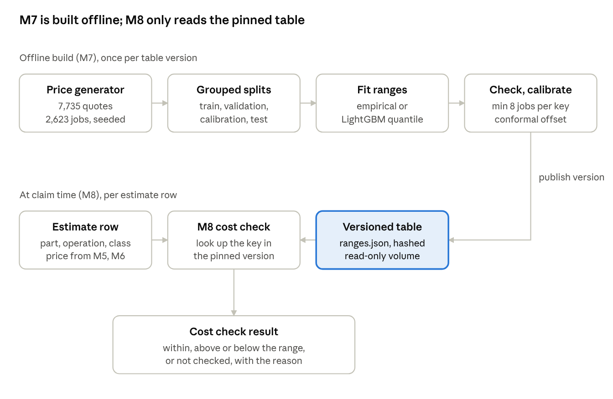
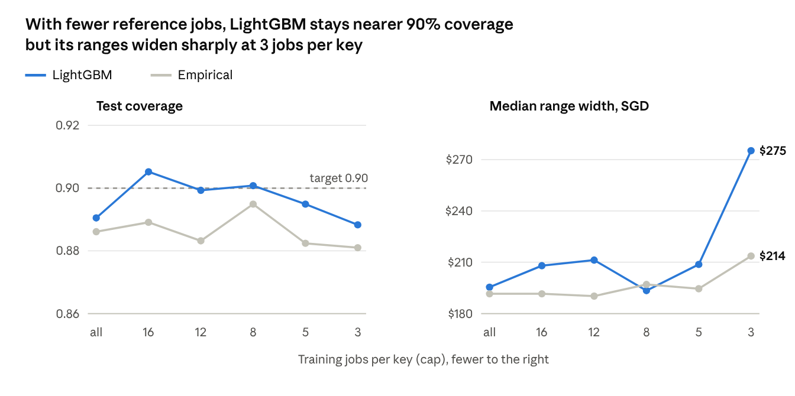

# M7 Reference Cost Ranges: Summary Report

6 October 2026 · Edwin

## Summary

M7 publishes a versioned table of normal price ranges, one per part, operation and vehicle class, so M8 can flag an estimate price as unusual. Two methods were built and compared on synthetic prices: empirical percentiles and a LightGBM quantile model.

Both met the coverage target on the untouched test data. LightGBM was selected on validation by a rule fixed in advance: its ranges are about 9% narrower (median $189 against $207) for slightly lower coverage (0.886 against 0.904). It is the default build on the `m7-lightgbm` branch; `main` still builds the empirical table.

Every price is synthetic. These results show the method and its calibration work, not that the ranges match real Singapore repair prices.

## Where M7 sits

M7 runs offline and never per claim. It publishes a table that M8's cost check reads, which decides between `ok` and `cost_outlier` for rows already supported by the photos.

*M7 build and M8 lookup · from the M7 specification and code*

A price outside the range becomes `cost_outlier`; a withheld range leaves the row `insufficient_evidence` with the reason.

## Data: a seeded synthetic price generator

No public dataset links vehicle parts and repair operations to real prices, and the team has no insurer data, so M7 uses a reproducible generator. With seed 20260924 it produced 7,735 quotes from 2,623 independent repair jobs.

| Setting | Value |
| --- | --- |
| Keys | 128: 32 eligible part and operation pairs over 14 parts, times 4 vehicle classes |
| Base prices | One documented SGD price per pair for a standard sedan, e.g. front bumper replace $800 |
| Class multipliers | Hatchback 0.85, sedan 1.00, SUV 1.20, van 1.30 |
| Jobs and quotes | Each independent job (base case) gets 1 to 5 quotes from 6 workshops |
| Price | Base price × job factor (σ 0.12) × workshop factor (σ 0.06) × quote noise (σ 0.03), all lognormal |
| Deliberate gaps | 20% of keys get 2 to 6 jobs; 5% get none, to test withholding |
| Anomaly run | A separate seeded run; 10% of jobs changed by +25%, +50% or −30% and labelled |

The cost key is part, operation, vehicle class and currency under one fixed basis: single part, before tax, no discount. Side, damage type and model year never affect price.

## Methods: empirical percentiles and LightGBM quantiles

Both methods estimate the 5th to 95th percentile price range for each key and publish the same table format. They differ in what data each range is built from.

| | Empirical percentiles | LightGBM quantile regression |
| --- | --- | --- |
| Idea | Sort that key's own past prices; read off the 5th and 95th percentile | Two gradient-boosted tree models, one predicting the 5th and one the 95th percentile |
| Data used per range | Only that key's jobs | All jobs and keys together |
| Inputs | None beyond the key | Part, operation, vehicle class (categorical) |
| Training | None; counting only | Quantile loss on log price, early stopping on validation |
| With few jobs per key | Noisy, or no range | Borrows shared patterns, e.g. SUVs cost about 20% more for every part |
| Explainability | "90% of 19 past jobs fell in this range" | Comes from a model |

Both methods first reduce each job to one value, the median of its quotes, so a job quoted five times counts once. Quantile loss penalises misses unevenly: at 0.95, predicting too low costs 19 times more than too high, so the model settles just above 95% of prices.

## Safeguards

A range is published only when it is well supported and calibrated; otherwise the key is withheld with a reason, never given a zero or guessed range.

- **Grouped splits.** Jobs are split 55% train, 15% validation, 10% calibration, 20% test, with every quote of a job kept together. Test membership is hashed before any fitting and read once at the end.
- **Independent support rule.** A key needs at least 8 distinct training jobs, a threshold chosen on validation. Repeated quotes never raise the count. Below it: `insufficient_support`.
- **Conformal calibration.** Raw ranges were too narrow, covering about 76% of validation prices for the empirical method. A log-scale offset fitted on the calibration split widens them toward the 90% target.
- **Crossed bounds.** A learned key whose lower bound exceeds its upper bound is withheld as `range_invalid`. None occurred.
- **Exact money and pinning.** Bounds are exact decimals rounded once to cents. Each table is an immutable version, and every assessment records the version it used.

## Outcome 1: LightGBM selected for narrower ranges at target coverage

The selection rule, fixed before any result was seen: among methods whose validation coverage is inside 0.85 to 0.95, pick the narrower median range; on a tie or if neither qualifies, keep the empirical method. Both qualified and LightGBM was narrower. Test results were read only after the choice.

| Split | Method | Coverage (covered of evaluated) | Median width | Keys with a range |
| --- | --- | --- | --- | --- |
| Validation | Empirical | 0.906 (799 of 882) | $207.41 | 85 of 128 |
| Validation | LightGBM | 0.887 (782 of 882) | $189.33 | 85 of 128 |
| Test | Empirical | 0.904 (1,082 of 1,197) | $207.41 | 85 of 128 |
| Test | LightGBM | 0.886 (1,060 of 1,197) | $189.33 | 85 of 128 |

Both methods used support threshold 8 and conformal calibration (offset 0.080 empirical, 0.039 LightGBM). Neither produced a crossed range. About 12% of test quotes fall on keys with no range and get no cost check.

## Outcome 2: anomaly detection and fewer reference cases

The two methods catch injected price anomalies about equally well. The separate labelled run had 384 records, 38 labelled anomalies (prevalence 0.099); 13 of those fell on keys with no range and got no cost check.

| Method | Caught (of 25 checked) | Missed | False flags | Precision | Recall among checked |
| --- | --- | --- | --- | --- | --- |
| Empirical | 17 | 8 | 26 | 0.395 | 0.680 |
| LightGBM | 18 | 7 | 27 | 0.400 | 0.720 |

Precision is low by design: a 90% range flags about 10% of ordinary prices, which outnumber the anomalies. Both methods miss most +25% changes (3 and 4 of 8 caught) and catch nearly all +50% ones.

For RQ4, training jobs per key were capped at 16, 12, 8, 5 and 3. With the support threshold of 8 in force, both methods held 0.89 to 0.91 coverage down to 8 jobs and withheld every key below it. The chart lifts the threshold to show what each method would produce; these ranges are never published.

*RQ4 report, seed 20260924 · model-only view (support threshold 1), reserved test split*

LightGBM stays at 0.888 to 0.905 coverage against 0.881 to 0.895 for the empirical method, but at 3 jobs its median range jumps to $275.

## How M8 uses the table

The table is a folder of files, not a database table, and M8 reads it by pinned version.

1. **Build.** At stack start, `cmev-cost-bootstrap` builds the table into a shared volume and marks it active in `registry.json`.
2. **Pin.** At claim intake, `cmev-api` records the active table version on the claim.
3. **Load.** The consolidator loads `ranges.json` for that version, checks every file's SHA-256 against `build_manifest.json`, and caches it in memory. The volume is mounted read-only.
4. **Look up.** For each estimate row, M8 builds the key (e.g. `front-bumper / replace / sedan_standard / SGD`) and gets bounds plus support, or a reason with no bounds.
5. **Compare and store.** M8 returns within, above or below range, or not evaluated with the reason. PostgreSQL stores the table version and a copy of the values used in each finding.

`ranges.csv` holds the same rows for people to read. A new build is a new version, so it never changes an earlier assessment.

## Limitations

- **Synthetic prices only.** The generator is a base price times lognormal factors, a pattern a log-scale model recovers almost exactly. Results say nothing about real repair prices.
- **Small anomaly set.** 38 labelled anomalies, 25 on keys with a range. Anomaly figures are counts, not stable rates.
- **An exceedance is not fraud.** A 90% range flags about 10% of ordinary prices by design.
- **Few features.** Three categorical inputs limit what LightGBM can add. Make, model, OEM vs aftermarket and date would need real insurer data and a change to the v2 cost key.
- **Showcase gap.** With this seed, `front-bumper / replace / sedan_standard` is withheld for support, which affects the proposal's worked example.
- **Unverified packaging.** The app image change adding `libgomp1` for LightGBM has not been built; Docker image pulls stalled on the test machine.
- **Proposed values.** The recipe, support threshold and base prices are proposals, pending Lane 4 review.

## Status and next steps

M7 is built and tested on synthetic data and pushed to the `m7-lightgbm` branch (merge commit `2246f93`), awaiting a pull request into `main`. The full test suite passes: 1,436 tests, 3 skipped.

- [ ] Open and review the `m7-lightgbm` pull request into `main`
- [ ] Build the app image and run the bootstrap on a machine whose Docker can pull images
- [ ] Lane 4 review of the LightGBM recipe, support threshold and base prices
- [ ] Decide whether to exempt showcase keys such as sedan front-bumper replacement from the sparsity plan
- [ ] Retrain the same pipeline on real insurer settled-claims data, if it becomes available

Reproduce any result with `python pipelines/costs/eval_cost_table.py <compare|experiment-c|rq4> --seed 20260924`. The plan is in [`docs/plans/m7-lightgbm-quantile-plan.md`](../../plans/m7-lightgbm-quantile-plan.md).
