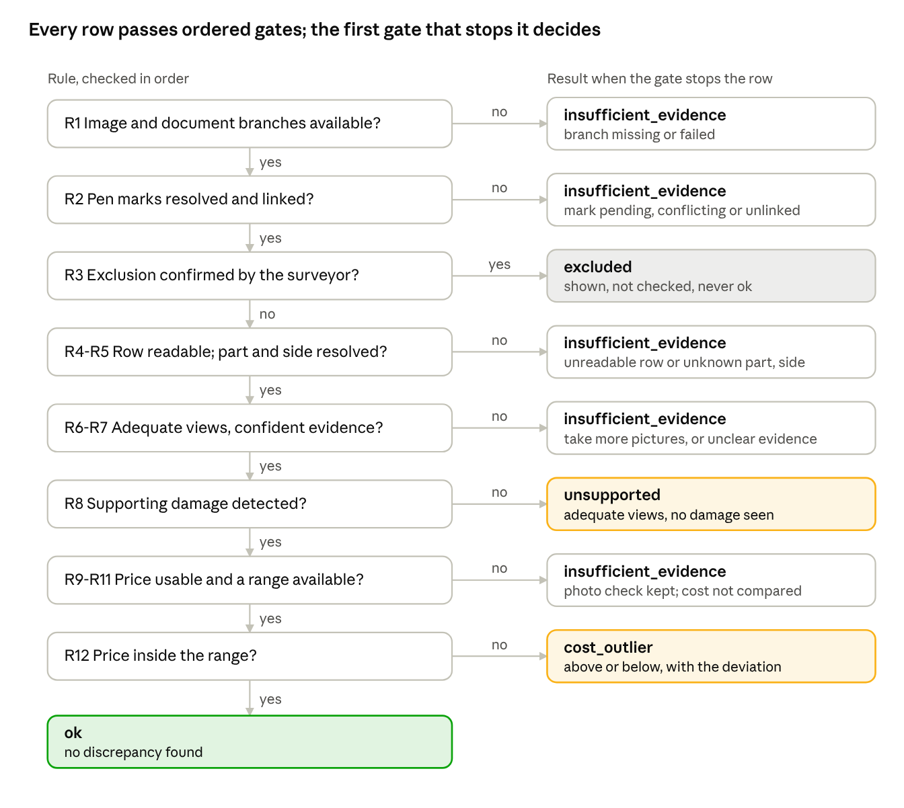

# M8 Consolidation and Checks: Summary Report

7 October 2026 · Edwin

Integration status updated 9 October 2026 after rebasing onto the real image-worker implementation.

## Summary

M8 is the module that decides. For each estimate row it combines the photo evidence (M3), the read estimate (M5), the pen-mark decisions (M6) and the pinned cost table (M7) into one of four results: `ok`, `unsupported`, `cost_outlier` or `insufficient_evidence`.

The rule engine is complete and runs for real inside the `cmev-consolidator` container. All 42 required rule cases pass. With `docker-compose.image.yml`, M1 and M2 run the configured trained models and M3 supplies real summaries and coverage to M8. The document stages remain fixture producers. End-to-end evaluation (experiment B) remains outstanding; the decision table below distinguishes implemented behaviour from proposals.

M8 uses deterministic rules only. No language model takes part, so every result is reproducible and names the rule that produced it.

## How M8 decides

Each estimate row runs through twelve ordered rules; the first rule that stops the row decides its result and records a reason code.

*M8 rules R1 to R12 · from the M8 specification and `src/claim_cmev/comparison/adapter.py`*

Only two results are discrepancy flags, `unsupported` and `cost_outlier`. Missing photos, unknown sides and pending marks always give `insufficient_evidence`, never a flag.

## Checks, cost arithmetic and possible additions

Each row stores four separate checks plus the overall result, so a passed photo check can sit beside a withheld cost check. A check the flow never reached is `not_evaluated`, never `passed`.

| Check | Rules | Question |
| --- | --- | --- |
| Mark state | R2, R3 | Are the row's pen marks resolved, and is it excluded? |
| Documentary | R4, R5 | Is the row readable, mapped, and its part and side resolved? |
| Photographic | R6 to R8 | Is damage visible on that physical part in adequate views? |
| Cost | R9 to R12 | Is the effective price inside the pinned range? |

**Negative photographic findings.** Under `m8-rules/0.2.1`, when there is no confident supporting damage, discarded or unknown M2 filtering in a confirmed covering photo withholds the negative conclusion as `damage_evidence_uncertain`. This preserves uncertainty even after identity and coverage are confirmed.

**Cost arithmetic.** Money is exact decimals, rounded once to cents. Equality at a bound is inside the range. A missing quantity, a quantity other than 1, another currency or basis, or a withheld range gives no comparison and no deviation. A zero-width range never divides.

**Possible additions (A1 to A8)** run once per claim, in reverse: visible damage with no matching estimate row. They are proposed only when the estimate is complete (or confirmed empty), the part and side are resolved, coverage is adequate and no ambiguous row or pending mark could hide a match. A confirmed exclusion on the same part and side suppresses the addition; one on the other side does not. An addition never carries an invented operation or price.

## How it runs

M8 is a pure function, `consolidate()`, wrapped by a Kafka consumer in `cmev-consolidator`. The function reads no clock and opens no socket, so the same inputs always give the same assessment.

1. The orchestrator waits for the image and document branches, then sends one `cmd.consolidate` command carrying record references and pinned versions (rules config, cost table).
2. The consumer loads the records and the pinned cost table, and refuses mixed input revisions or unknown schemas (dead-letter queue).
3. `consolidate()` applies the rules and returns an immutable assessment with findings, per-check results, reason codes, evidence references and versions.
4. The assessment is written to PostgreSQL and `evt.assessment-ready` is published.

A duplicate command creates no second assessment. A surveyor correction (a confirmed mark, an entered amount, an identity or coverage confirmation) creates a new assessment revision; the old one stays readable. A command for an outdated revision still writes a historical assessment but does not become current.

## What is verified

All 42 rule cases required by the M8 specification (experiment A) pass, built from structured inputs with no models. A meta-test checks that every numbered case and safety invariant maps to a test.

| Case group | Cases | Examples |
| --- | --- | --- |
| Evidence and coverage | 1 to 8 | Opposite-side damage never supports or refutes a row; a cropped view is inadequate, not unsupported |
| Marks and amounts | 9 to 17 | A pending price change never compares the printed amount; a confirmed exclusion is never `ok` |
| Extraction and additions | 18 to 24 | No parsed rows is never an empty estimate; a right-door exclusion does not hide left-door damage |
| Cost arithmetic | 25 to 36 | Equality at a bound is inside; quantity 2 or another currency gets no comparison |
| Revisions | 37 to 42 | A corrected amount creates a new assessment; a duplicate command creates none |

On 2026-10-07 the M8 unit and integration suites passed (130 tests), and the full suite on the `m7-lightgbm` branch passed with 1,436 tests. These show rule correctness, not model accuracy.

## What is not done yet

- **Real document inputs.** The real M1/M2/M3 image branch is integrated, including reassessment after confirmations. M5 and M6 remain fixtures in the current Compose modes. This integration does not establish model accuracy or complete real-document evaluation.
- **Experiment B, the full-pipeline evaluation.** Not built. It measures flag precision (target 0.70), false flags on clean cases (target 0.05 per case), withholding on unphotographed parts (target 0.95) and the decision rate.
- **Experiment C through M8.** Injected price anomalies were scored against the M7 tables directly, not through `consolidate()`.
- **Threshold tuning.** The confidence thresholds in `m8_rules.yaml` (`m8-rules/0.2.1`) remain proposed, not chosen on validation data.

A point for the evaluation: sided parts reach `ok` or `unsupported` only after a surveyor confirms the side, and `unsupported` also needs a coverage confirmation. The automatic decision rate on doors and fenders will be near zero by design, so experiment B must report automatic and human-assisted rates separately.

## Open decisions

The original report listed seven decisions. The current implementation already settles D6 as described below; the remaining recommendations are not new accepted changes.

| # | Decision | Current behaviour | Recommendation |
| --- | --- | --- | --- |
| D1 | Run the cost check on an `unsupported` row? | No; the flow stops | Keep: proposal v2 section 8.1 governs |
| D2 | Require a recorded coverage confirmation before `unsupported`? | Yes | Keep; report decision rates separately |
| D3 | Carry a dismissal forward when the finding is unchanged? | Yes, by content hash | Keep |
| D4 | Does an exclusion with unknown side suppress an addition? | No | Keep; no damage gets hidden |
| D5 | Stricter confidence for additions (0.60) than for R7 (0.50)? | Placeholders | Select both on validation |
| D6 | Can a photos-only claim be finalized? | Yes, with missing-evidence reasons preserved; covered by `test_photos_only_and_pages_only_can_freeze_with_missing_evidence_reasons` | Preserve the implemented incomplete-evidence semantics |
| D7 | Does any pending or unlinked mark block all additions? | Yes, strict reading | Narrow to marks whose candidate rows could match the same part |

## Next steps

- [ ] Reconcile the remaining decision notes with current behaviour; implement D7 only if the narrower reading is chosen
- [ ] Build the experiment B case set and scorer against fixtures, so they are ready for real outputs
- [ ] Score the injected anomalies through `consolidate()` to complete experiment C at the M8 level
- [ ] Evaluate M8 with real document outputs alongside the already integrated real image branch
- [ ] Select the R7 and A3 confidence thresholds on validation data and freeze them

The [M8 specification](../../specs/module-08-consolidation-checks.md)'s implementation checklist was updated on 2026-10-07 to tick what this report lists as verified.
