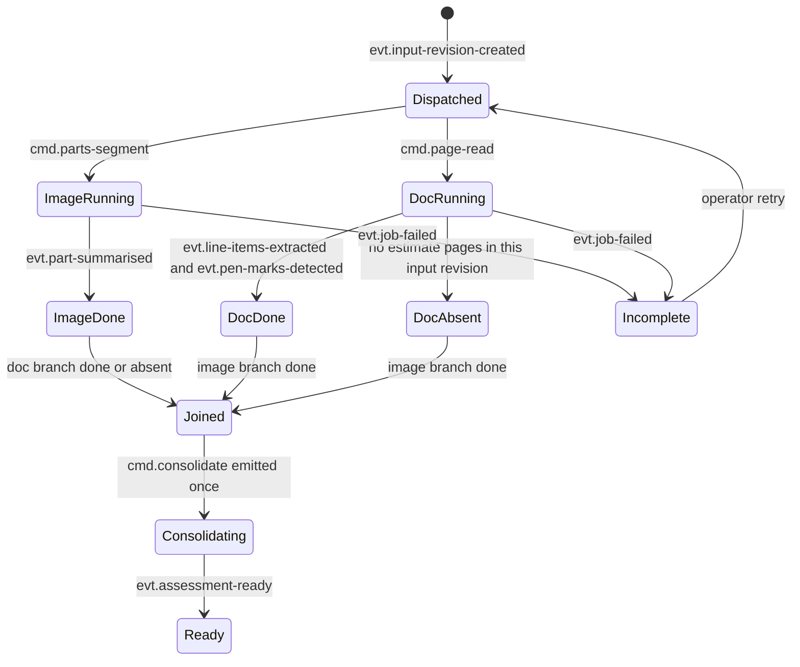

# Application platform specification

Status: implementation baseline for `cmev-api`, `cmev-orchestrator` and `cmev-consolidator`. Nothing here is implemented or measured. Library choices, limits and defaults are **proposed** until the day-2 smoke test records a result.
Owner: Lane 5 for intake, jobs, review and deployment. Lane 4 for consolidation rules, cost lookup and approvals.
Source: [proposal v2](../CLAIM-CMEV_project_proposal_v2.md) sections 7, 8, 9 and 16, plus the containerised event runtime in [ADR 0002](../adr/0002-containerised-event-runtime.md) and the [technical specification](technical_specification.md).

Code locations: `apps/api/`, `workers/orchestrator/`, `workers/consolidator/`, `src/claim_cmev/orchestration/`, `src/claim_cmev/messaging/`, `src/claim_cmev/persistence/`, `infra/`.
Contracts: [shared records](data_contracts.md) and [integration contracts](integration_contracts.md).

## 1. Purpose and boundaries

This document covers the backend: intake, jobs, the branch join, consolidation triggering, the review API, cost-table lookup, finalize and print. It is item 1 of the user's request together with the [technical specification](technical_specification.md), which covers the runtime itself.

The runtime is containerised and event driven. The v1 platform was one backend process with a polled jobs table; the work below is now split across three containers plus a shared Python package.

**No language model sits in the decision path.** Part and damage integration is deterministic mask overlap in M2. Vision and document integration is the deterministic rule set in M8, running in `cmev-consolidator`. Findings must be reproducible, version-pinned and immutable, and a language model cannot be pinned or evaluated inside the 50-person-day budget. The optional stretch service `cmev-explainer` may rewrite an already-computed finding into a sentence; it is off by default, never changes a result or a state, and is marked in `provenance`.

## 2. Container responsibilities

| Container | Owns | Must not |
| --- | --- | --- |
| `cmev-api` | HTTP under `/api/v1`. Claim and file intake, staging, input revisions, evidence serving, image summary, assessment fetch, review persistence, mark and amount actions, identity and coverage confirmation, dismissal, finalize, print-view data, cost-range lookup, approval import (stretch). Publishes `evt.input-revision-created.v1` through the outbox. Consumes `evt.assessment-ready.v1` and `evt.job-failed.v1` to update claim state | Load neural weights. Run M1 to M6. Compute M8 findings. Call a worker synchronously. Write another container's result tables |
| `cmev-orchestrator` | The workflow. Fan-out from `evt.input-revision-created.v1` to the branch commands, stage chaining, the branch join, the single emit of `cmd.consolidate.v1`, retry dispatch, dead-letter routing, `ops.jobs` and `ops.branch_state` | Compute anything about a claim's content. Read a mask, a line item or a finding. Decide a result |
| `cmev-consolidator` | M8 only. Reads branch results and the pinned cost table, applies the proposal v2 section 8 rules, writes the assessment revision, findings, per-check results and possible additions, publishes `evt.assessment-ready.v1` | Serve HTTP to the browser. Mutate a branch result. Change an existing assessment |
| `src/claim_cmev/` shared package | Record and envelope definitions, taxonomy, the M8 rule implementation, repositories, transactions, the storage adapter, the messaging runtime, the job state machine and the join policy | Import FastAPI, Kafka clients or UI code inside domain modules |

The same shared package is installed into every image. In the `lean` profile the orchestrator and consolidator run inside `cmev-worker-combined` through the same topics and the same handlers, so behaviour is identical.

## 3. HTTP surface

All paths are under `/api/v1`. Requests and responses validate against the shared contracts; the OpenAPI schema is exported for the typed workbench client.

Conventions used in the table:

- **Idem key** means the `Idempotency-Key` header is required. A replay with the same key and the same payload returns the original committed response. The same key with a different payload is `409`.
- **Expected rev** means the body must carry `expected_review_revision`, and for decision-changing actions `expected_input_revision` as well, per proposal v2 section 9.6.
- **New assessment** means the action creates a new input revision and therefore a new assessment revision, per proposal v2 section 8.4.

### 3.1 Claim, intake and processing

| Method and path | Request | Response | Errors | Idempotency |
| --- | --- | --- | --- | --- |
| `POST /claims` | Claim reference, vehicle make, model, year, currency | `claim_id`, created time | 400 invalid field, 409 duplicate reference if enforced | Idem key |
| `GET /claims/{claim_id}` | none | Claim metadata, current input, assessment and review revisions, processing state | 404 | n/a |
| `POST /claims/{claim_id}/files` | Multipart: one or more files, each with `role` of `photograph` or `estimate_page` | Per-file `file_id`, SHA-256, media type, byte size, page number, staged state | 400, 413 too large, 415 unsupported media, 422 unreadable file | Idem key; replay returns the same `file_id` set |
| `POST /claims/{claim_id}/input-revisions` | Ordered `file_id` list, vehicle metadata, currency, declaration source, optional `reuse_hint` | `input_revision`, created job keys, state `queued` | 400, 409 unknown or already-committed file, 422 no photographs and no estimate pages | Idem key; replay returns the same revision and job keys |
| `GET /claims/{claim_id}/input-revisions/{input_revision}` | none | Immutable file set with hashes, metadata and lineage | 404 | n/a |
| `GET /claims/{claim_id}/processing` | Optional `input_revision` | Per-branch and per-stage state, attempt counts, reason codes, awaiting-input reason, dead-letter flag | 404 | n/a |
| `GET /claims/{claim_id}/jobs` | Optional `input_revision` | Job rows: job key, task, state, attempts, last error code, last attempt time | 404 | n/a |
| `POST /claims/{claim_id}/jobs/{job_key}/retry` | none | Updated job row and new attempt number | 404, 409 job already `succeeded`, 422 job not retryable | Idem key; a `succeeded` job is never re-dispatched |

### 3.2 Results and evidence

| Method and path | Request | Response | Errors | Idempotency |
| --- | --- | --- | --- | --- |
| `GET /claims/{claim_id}/image-summary` | `input_revision` | Part summary rows, coverage states with reasons, unresolved observations, member observation ids. Available even when the document branch has not run | 404, 409 if the image branch has not completed | n/a |
| `GET /claims/{claim_id}/assessments` | none | Assessment revisions with state, created time and pinned versions | 404 | n/a |
| `GET /claims/{claim_id}/assessments/{assessment_revision}` | none | Line items, per-check results, overall results, possible additions, pen-mark states, evidence references, pinned versions, current review revision | 404 | n/a |
| `POST /claims/{claim_id}/assessments` | `input_revision`, optional explicit version bundle | Accepted job reference and the input revision it will assess. Never a premature `ready` | 404, 409 branch results missing, 422 incompatible version bundle | Idem key |
| `GET /claims/{claim_id}/evidence/{artifact_id}` | Optional `disposition` | Object bytes with media type, `ETag` from the object SHA-256, long cache headers | 403 artifact belongs to another claim, 404 | n/a |
| `GET /claims/{claim_id}/pages/{page_no}` | `input_revision`, `render` of `original` or `corrected` | Page image bytes | 403, 404 | n/a |

`GET /evidence/{artifact_id}` checks that the artifact belongs to the claim in the path before any byte is read. A wrong-claim artifact id returns `403` with no bytes and no size hint. Presigned object-store URLs are never returned to the browser; see the technical specification section 9.2.

### 3.3 Review actions

Every endpoint in this section creates exactly one `review.review_actions` row and advances the review revision. They are thin wrappers over one service function; `POST .../review-events` is the batch form used by the workbench when several edits are saved together.

| Method and path | Request | Response | Errors | Idempotency and revision effect |
| --- | --- | --- | --- | --- |
| `GET /claims/{claim_id}/assessments/{r}/review` | none | Current review revision, ordered actions, actor, state | 404 | n/a |
| `POST /claims/{claim_id}/assessments/{r}/review-events` | Ordered action batch, `expected_review_revision` | New review revision, committed action ids, and any created input or assessment revision | 400, 404, 409 stale revision, 409 key reuse with a different payload | Idem key, expected rev. Batch commits atomically: all actions or none |
| `POST /claims/{claim_id}/assessments/{r}/marks/{mark_id}/decision` | `decision` of `confirm` or `reject`, optional corrected `entry_id`, reason | New review revision, mark state | 404, 409 stale, 422 mark already resolved with a different decision | Idem key, expected rev. **New assessment**: a mark decision changes the declared scope |
| `POST /claims/{claim_id}/assessments/{r}/marks` | `page_no`, box, `type`, optional `entry_id` | Created mark in `confirmed` state with human provenance | 400, 404, 409 stale | Idem key, expected rev. **New assessment** |
| `POST /claims/{claim_id}/assessments/{r}/line-items/{entry_id}/amount` | Decimal string amount, currency, cost basis, `mark_id` if it resolves a price change | New effective amount and its provenance | 400 non-decimal or negative, 404, 409 stale, 422 currency or basis mismatch | Idem key, expected rev. **New assessment** |
| `POST /claims/{claim_id}/assessments/{r}/line-items/{entry_id}/correction` | Corrected part, side, operation, quantity or row link, with the original value retained | New line-item revision and its review action | 400, 404, 409 stale, 422 value outside the taxonomy version | Idem key, expected rev. **New assessment** |
| `POST /claims/{claim_id}/assessments/{r}/parts/{part_key}/identity-confirmation` | Confirmed part and side, the photographs it is based on | Confirmation record with actor and source | 404, 409 stale, 422 unsupported part identity | Idem key, expected rev. **New assessment** |
| `POST /claims/{claim_id}/assessments/{r}/parts/{part_key}/coverage-confirmation` | `adequate` or `inadequate`, covering photo ids, reason | Confirmation record | 404, 409 stale | Idem key, expected rev. **New assessment** |
| `POST /claims/{claim_id}/assessments/{r}/declaration-completeness` | `complete`, `partial`, `unreadable` or `explicitly_empty`, with a reason | Declaration status with human provenance | 404, 409 stale | Idem key, expected rev. **New assessment** |
| `POST /claims/{claim_id}/assessments/{r}/additions` | Accept a proposed addition, or add one, with surveyor-supplied operation and amount if any | Accepted addition record | 400, 404, 409 stale, 422 invented amount without a supplied value | Idem key, expected rev. **New assessment** |
| `POST /claims/{claim_id}/assessments/{r}/additions/{addition_id}/dismiss` | Reason code and note | Dismissal record | 404, 409 stale | Idem key, expected rev. Review revision only |
| `POST /claims/{claim_id}/assessments/{r}/findings/{finding_id}/dismiss` | Reason code from proposal v2 section 2.6 and an optional note | Dismissal record against that finding id | 400 unknown reason code, 404, 409 stale | Idem key, expected rev. **Review revision only**: a dismissal never changes a finding |
| `POST /claims/{claim_id}/assessments/{r}/notes` | Note text scoped to a finding or the claim | Note record | 404, 409 stale | Idem key, expected rev. Review revision only |

### 3.4 Finalize, print, cost lookup and approvals

| Method and path | Request | Response | Errors | Idempotency |
| --- | --- | --- | --- | --- |
| `GET /claims/{claim_id}/assessments/{r}/finalize-preconditions` | none | Per-precondition pass or fail with reason codes, from section 9.1 | 404 | n/a |
| `POST /claims/{claim_id}/assessments/{r}/finalize` | `expected_review_revision` | Frozen review revision and the print-view URL | 404, 409 stale revision, 412 preconditions not met with the failing list | Idem key, expected rev. Replay returns the same frozen revision |
| `GET /claims/{claim_id}/assessments/{r}/print-view` | `review_revision` | Everything proposal v2 section 7.4 requires, from one frozen assessment and its matching frozen review revision | 404, 409 review revision does not match this assessment, 412 not finalized | n/a |
| `GET /cost-ranges` | `part`, `operation`, `vehicle_class`, `currency`, `table_version` | Bounds as decimal strings, fixed cost basis, independent support count, table version, synthetic marker. Or an absent range with a reason code | 400 missing key part, 404 unknown table version, 422 unsupported currency | n/a |
| `GET /cost-tables` | none | Table versions with build identity, cutoff, calibration method, active flag | none | n/a |
| `POST /approval-imports` | Stretch S3 only. Explicitly synthetic approval rows | Row-level validation results and a batch summary | 400, 409 duplicate batch, 422 row-level failures | Idem key |
| `GET /healthz`, `GET /readyz`, `GET /version` | none | Liveness, readiness detail, image digest, code revision, contract version, loaded versions | none | n/a |

### 3.5 Error semantics

| Status | Meaning | Example |
| --- | --- | --- |
| 400 | Invalid field or malformed request | Amount is not a decimal string |
| 403 | Resource exists but belongs to another claim | Evidence id from a different claim |
| 404 | Unknown claim, revision, job, artifact or finding | Assessment revision never created |
| 409 | Conflict: stale revision, or idempotency key reused with a different payload | Two edits with the same `expected_review_revision` |
| 412 | Precondition failed | Finalize while marks remain pending |
| 413 | Payload too large | File above the configured size limit |
| 415 | Unsupported media type | TIFF uploaded as a photograph |
| 422 | Contract or semantic failure | Part value outside the taxonomy version |
| 503 | Transport unavailable, with `Retry-After` | Broker unreachable and the outbox backlog exceeds its threshold |

Every error body carries a stable `reason_code` and a readable message with no claim content. Asynchronous submissions return accepted job references, never a premature `ready`. A conflict response returns the current server revision and the caller's submitted values so the workbench can preserve local edits.

## 4. Intake validation

| Rule | Value (proposed) |
| --- | --- |
| Photograph media types | `image/jpeg`, `image/png` |
| Estimate page media types | `image/jpeg`, `image/png`, `application/pdf` |
| Maximum single file | 25 MB |
| Maximum files per input revision | 40 photographs, 10 estimate pages |
| Maximum PDF pages | 10; each page is rendered to its own page image at intake |
| Minimum image dimension | 640 px on the short side, below which the file is accepted with a recorded quality warning, not rejected |
| Filename handling | The original filename is stored in the database. Object keys are generated. No user-supplied string ever forms a storage path |

Validation order at `POST /claims/{claim_id}/files`:

1. Check the declared media type against the sniffed magic bytes. A mismatch is `415`, not a warning.
2. Check size and, for PDFs, page count.
3. Decode the image, or render the PDF pages, far enough to prove it is readable. An undecodable file is `422`.
4. Compute SHA-256 over the original bytes. A file already staged for this claim with the same hash returns the existing `file_id` rather than a second copy.
5. Write the original object under the staging prefix and insert a `claim.input_files` row in state `staged`.

**A failed upload never creates a complete input.** Staged files are not an input revision. `POST /input-revisions` is the only place a revision is committed, and it commits in one transaction: the revision row, the file rows moved to `committed`, the `ops.jobs` rows for every required stage, and the `ops.outbox` row carrying `evt.input-revision-created.v1`. If any part fails, none of it commits and the files stay staged.

Staged files that are never committed are retained, not deleted during ordinary retries. Cleanup is an explicit, dated operation, because the invariant is that original evidence is preserved.

## 5. The job model with Kafka carrying the work

At-least-once delivery plus a database job key is what makes retries safe. Splitting ownership precisely is the point of this section.

| Concern | Owner | Why |
| --- | --- | --- |
| Job identity | **PostgreSQL**, `ops.jobs`, unique on `(claim_id, input_revision, task, version_signature)` | Proposal v2 section 9.6. A redelivered command maps to the same row, so it cannot produce a second result set |
| Job state | **PostgreSQL** | The UI reads state from the database, never from Kafka |
| Attempt count and last error | **PostgreSQL**, `ops.jobs` and `ops.job_attempts` | Retained after exhaustion so a failure stays visible |
| Result pointers | **PostgreSQL** | Committed with the result rows in one transaction |
| Message delivery and ordering | **Kafka** | Key `claim_id`, so one claim keeps its order |
| Backlog and buffering | **Kafka** | A slow worker builds consumer lag rather than blocking the API |
| Delivery position | **Kafka** offsets, committed manually after the database transaction | The gap between the two is covered by `ops.consumed_messages` |
| Delivery deduplication | **PostgreSQL**, `ops.consumed_messages`, unique on `dedup_key` | Kafka cannot deduplicate across a consumer restart |
| Retry transport | **Kafka** for operator retries, in-process backoff for transient failures | See the technical specification section 6.6 |
| Dead letters | **Kafka** `cmev.dlq.v1` for the message, **PostgreSQL** `ops.dead_letters` for the reason | Inspection needs both |

There is no lease and no heartbeat. The v1 design needed them because workers polled a table and could die holding a row. Kafka's consumer group gives the same protection: a dead consumer loses its partition assignment at the session timeout and another replica takes it from the last committed offset. What replaces the lease is the dedup key plus the job-key check, which is stronger, because it also covers a duplicate produced by the orchestrator.

Job states:

| State | Meaning | Leaves to |
| --- | --- | --- |
| `pending` | Row created, command not yet published by the outbox relay | `dispatched` |
| `dispatched` | Command published to its topic | `running`, `failed` |
| `running` | A consumer has taken it and inserted its dedup row | `succeeded`, `failed` |
| `succeeded` | Results and the job row committed together | terminal |
| `failed` | Attempts exhausted or a permanent error. `job-failed` published | `pending` on an operator retry |
| `dead_lettered` | The message was routed to `cmev.dlq.v1` | `pending` on an operator retry |
| `not_required` | The stage does not apply to this input revision, for example the document stages with no estimate pages | terminal |

The consumer algorithm that every worker shares is specified once in the [technical specification](technical_specification.md) section 6.5 and lives in `workers/_shared/`. A worker that reimplements it is a review finding.

### 5.1 The outbox, and why upload survives a broker outage

`cmev-api` never publishes to Kafka inside a request. It writes an `ops.outbox` row in the same transaction as the input revision. A relay loop publishes unpublished rows in id order and stamps `published_at`.

Consequences:

- The upload succeeds and returns `201` even when the broker is down. The claim shows `queued`, with a `dispatch_pending` flag in `GET /processing` so the state is honest rather than looking like a stuck worker.
- The same pattern in every worker removes the gap between "results committed" and "completion event published".
- A crash mid-publish republishes the row, which the consumer's dedup key absorbs.
- If the outbox backlog exceeds its configured threshold, `POST /input-revisions` starts returning `503` with `Retry-After` rather than accepting work that will never dispatch.

## 6. The orchestrator join

### 6.1 How it knows a branch finished

`ops.branch_state` holds one row per `(claim_id, input_revision)` with one column per required stage: `parts`, `damage`, `summary`, `page_read`, `line_items`, `pen_marks`. Each holds `pending`, `running`, `done`, `failed` or `not_required`.

On each completion event the orchestrator opens one transaction, inserts its dedup row, sets that stage to `done`, dispatches the next stage in that branch if any, and evaluates the join condition. The join is read from the table, never from message arrival order, so events arriving out of order across branches are normal.

Join condition: `summary` is `done`, and `line_items` and `pen_marks` are each `done` or `not_required`.



### 6.2 When one branch fails

- The failed stage is set to `failed` with its reason code.
- `cmd.consolidate.v1` is **not** emitted. No assessment is created, because an assessment with a missing branch would be an assessment that silently passed checks it never ran.
- The claim's processing state becomes `incomplete`. The successful branch's results stay readable: `GET /image-summary` still serves the image branch, which is what proposal v2 section 9.2 requires.
- The UI shows the failed branch with its reason code. A failure never appears as a finished assessment with no findings.
- An operator retry sets the job back to `pending` and republishes the command. If it succeeds, the join is re-evaluated in the ordinary way.

### 6.3 How it avoids emitting consolidate twice

One column, `consolidate_emitted_at`, and one statement:

```sql
UPDATE ops.branch_state
   SET consolidate_emitted_at = now()
 WHERE claim_id = :claim_id
   AND input_revision = :input_revision
   AND consolidate_emitted_at IS NULL
RETURNING id;
```

Only one transaction gets a row back, even with several orchestrator replicas and even if two completion events arrive at the same instant. The winner writes the `cmd.consolidate.v1` outbox row in the same transaction. Everyone else sees zero rows and does nothing.

Three protections stack, and all three are needed:

1. This conditional update, against concurrent orchestrator replicas.
2. `ops.consumed_messages`, against a redelivered completion event.
3. The consolidator's own job key, against a duplicated `cmd.consolidate.v1`.

### 6.4 Superseded input revisions

Branch state is per input revision, so a newer revision gets its own row and its own join. A late completion event for an older revision updates that older row, and may even complete its join and produce an assessment for that revision. It can never move the claim's current assessment pointer, which moves forward only. This is proposal v2 section 9.6 unchanged.

### 6.5 Reassessment and reuse

A decision-changing review action creates a new input revision whose file set may be byte-identical to the previous one. The API sets `reuse_hint` listing stages whose inputs are unchanged. The orchestrator may mark those stages `done` by copying the prior result references with recorded lineage rather than dispatching them again. Rerunning SegFormer for a price correction is not required, which is the explicit reuse allowed by proposal v2 section 8.4.

Reuse is recorded, not implied: the new assessment records which stage results were reused and from which revision. If any pinned version in the signature differs, reuse is refused and the stage is dispatched.

## 7. State models

### 7.1 Assessment processing

| State | Meaning | Notes |
| --- | --- | --- |
| `queued` | Input revision committed, commands not all dispatched | Includes `dispatch_pending` when the outbox has not drained |
| `processing` | At least one stage running | |
| `awaiting_declared_entries` | Valid photographs exist, no estimate pages in this input revision | The image summary is available; the line-item section says the estimate is awaited. Possible additions are withheld because declaration completeness is unknown |
| `incomplete` | A required stage failed or was dead-lettered, and useful results remain | Retry is offered. This is not a finished assessment |
| `ready` | Consolidation committed for this input revision | **May contain `insufficient_evidence` findings.** Processing completion is not evidence adequacy |
| `failed` | No usable results | Explicit retry may resume |

A `ready` assessment is not a claim that everything was checked. A missing cost-table artifact is an operational failure and blocks `ready`; a valid table that has no comparable range for a key is an `insufficient_evidence` finding inside a `ready` assessment. The two must never be confused.

### 7.2 Job

See section 5. `pending`, `dispatched`, `running`, `succeeded`, `failed`, `dead_lettered`, `not_required`.

### 7.3 Pen mark

| State | Set by | Effect |
| --- | --- | --- |
| `pending` | M6 detection. Every proposal starts here | Blocks a confident result for its row. Never silently excludes a row and never falls back to the printed price for a pending price change |
| `confirmed` | Surveyor | An exclusion strikes the row through and removes it from checks. A price change requires a typed amount before the effective price resolves |
| `rejected` | Surveyor | The detection is dismissed. It does not resolve any other mark |
| `unlinked` | M6 when geometry is ambiguous | Candidate rows retained and shown. Must be resolved before finalize |

Exclusion is a row state, not an `ok` finding. Confirming one mark never resolves another.

### 7.4 Review

| State | Meaning |
| --- | --- |
| `unreviewed` | A `ready` assessment with no review actions |
| `in_review` | At least one review action saved |
| `finalized` | The review revision is frozen and the print view is available |

### 7.5 Approval

`not_supplied`, `pending`, `approved`, `rejected`, `superseded`. Separate from assessment and review. Normally `not_supplied` in this prototype, and never fabricated. A surveyor's edit is not an approval. Any imported approval in stretch S3 is visibly synthetic.

## 8. Review persistence

- **Idempotency.** Every mutation requires an `Idempotency-Key`. `ops.idempotency_keys` is unique on `(claim_id, endpoint, idempotency_key)` and stores the request hash and the committed response. Same key and same payload replays the stored response with the original revision numbers. Same key and a different payload is `409`. A save that times out after the server committed is safe to retry.
- **Optimistic concurrency.** Every mutation carries `expected_review_revision`. The service compares it inside the transaction. A mismatch is `409` carrying the current server revision, the actions committed since the caller's revision, and the caller's submitted values, so the workbench can show the conflict without losing local edits. It never silently overwrites another user's edit.
- **Decision-changing versus review-only.** This split follows proposal v2 section 8.4 exactly:

| Action | Creates |
| --- | --- |
| Confirm or reject a mark, add a mark, enter an effective amount, correct part, side, operation, quantity or row link, confirm identity, confirm coverage, set declaration completeness, accept or add an addition | A review action **and** a new input revision **and** a new assessment revision |
| Dismiss a finding with a reason, dismiss a proposed addition, add a note | A review action and a new review revision only. The original finding is unchanged |

- **Atomicity across the split.** A decision-changing action commits in one transaction: the review action, the new input revision, the new job rows, and the outbox row carrying `evt.input-revision-created.v1`. The response returns both the new review revision and the new input revision, so the workbench knows a recomputation is pending.
- **Immutability.** The original extraction, the original predictions and the original findings are never rewritten. Every action stores actor, time, original value, new value and source. A dismissal references the finding id it was made against and does not carry forward to a different finding in a later assessment.
- **Provenance.** Model output, human correction and any imported approval have distinct provenance. A confirmed identity never rewrites the model's prediction; it is stored beside it.

## 9. Finalize and print

### 9.1 Preconditions

From proposal v2 section 7.2. `GET /finalize-preconditions` returns each one separately so the UI can name what is blocking.

| Precondition | Failure reason code |
| --- | --- |
| No required job is unfinished or failed for the current input revision | `processing_incomplete` |
| Every decision-changing edit has produced an assessment that is `ready` | `reassessment_pending` |
| No pen mark is `pending` | `marks_pending` |
| No pen mark is `unlinked` | `marks_unlinked` |
| Every confirmed price change has a typed effective amount | `amount_missing` |
| The review revision presented equals the current review revision | `stale_review_revision` |

`insufficient_evidence` findings do **not** block finalize. They are carried into the report with their reasons. Finalization never converts them into passes. That is explicit in proposal v2 section 7.2 and is a safety property, not a convenience.

### 9.2 Freezing and printing

`POST /finalize` sets `finalized_at` on the review revision and records the assessment revision it was frozen against. `GET /print-view` takes both revision numbers and refuses any other combination with `409`.

**The print view never mixes new values with stale findings.** It is built from one frozen assessment revision and the one review revision frozen against it. If a later edit creates a new assessment, the old print view still renders the old pairing, unchanged, and the new one must be finalized separately.

The print view carries everything proposal v2 section 7.4 lists, including the synthetic-cost label, the fixed cost basis, final approval shown as not recorded unless one was actually imported, and a footer with input, assessment and review revisions plus model, parser, configuration and cost-table versions. The surveyor prints it to PDF from the browser. The stored review revision is the authoritative record; the PDF is a rendering of it.

## 10. Cost-table lookup

`cmev-api` serves `GET /cost-ranges` and `cmev-consolidator` reads the same table through the same shared code, so the UI and the findings cannot disagree.

- **Pinned per assessment.** An assessment stores `cost_table_version` at creation. Every lookup for that assessment uses that version. `CMEV_ACTIVE_COST_TABLE_VERSION` affects only new assessments. Promoting a new table while a claim is open leaves the open assessment unchanged; a reassessment creates a new revision with the then-active version.
- **Key.** Part, operation, vehicle class and currency, under the versioned fixed cost basis from proposal v2 section 8.3. Model year, side and damage type are not part of the key. Repair, replacement and paint never share a range.
- **Absent range with a reason, never a zero range.** Reason codes: `no_key`, `insufficient_support`, `unsupported_combination`, `unknown_vehicle_class`, `currency_unsupported`, `basis_mismatch`, `quantity_not_one`, `bundled_operation`. The response carries `range: null` plus the reason. A zero lower bound and a zero upper bound are never returned as a range, and a support count below the selected minimum is `insufficient_support`, not a narrow range.
- **Decimal only.** Bounds are decimal strings with currency and cost basis. Equality at a bound is inside the range.
- **Support is independent base cases**, not repeated quotes from one case, exactly as proposal v2 section 8.3 requires.
- **Invalid table refusal.** A table whose manifest fails validation, or whose bounds are crossed, is not served. `cmev-consolidator` refuses to start on it rather than serving a bad range.

## 11. Acceptance scenarios

The first nine carry over from the v1 platform. The rest are new and exist because the transport changed.

| Scenario | Required result |
| --- | --- |
| Same input submitted twice with one idempotency key | Same input revision and same job keys returned; one set of jobs |
| One branch fails after the other succeeds | Successful branch remains readable; processing state `incomplete`; no assessment; retry offered |
| Worker crashes after writing masks and before committing | Retry publishes one result set; orphan objects are never referenced by a committed row and never appear as findings |
| Old stage completes after new photographs were uploaded | Result stored against its own input revision; the current assessment pointer does not move |
| Review save times out after the server committed | Replay with the same key returns the original response; one saved action |
| Two edits use the same `expected_review_revision` | One commits; the other gets `409` with its local values preserved |
| Same approved row imported twice (stretch S3) | One eligible reference member |
| New cost table promoted while a claim is open | Open assessment unchanged; explicit reassessment creates a new revision with the new version |
| Wrong-claim evidence id requested | `403`, no bytes returned, no size disclosed |
| **Duplicate delivery of the same command** | The second delivery hits the `dedup_key` conflict, or finds the job `succeeded`. No second result set, no second completion event acted on, one duplicate counter incremented |
| **Consumer restart between the database commit and the offset commit** | On restart the message is redelivered and recognised as a duplicate. Exactly one result set exists |
| **Consumer restart mid-batch** | Uncommitted messages in the batch are redelivered from the last committed offset. Every redelivered message is either processed once or recognised as a duplicate |
| **Command for a superseded input revision** | Processed and stored against that revision. Its join may complete and create an assessment for that revision; the claim's current pointer does not move |
| **Two orchestrator replicas see the join complete at the same instant** | `cmd.consolidate.v1` is emitted exactly once. The losing replica commits nothing |
| **Permanent failure routed to the dead-letter queue** | `cmev.dlq.v1` holds the message, `ops.dead_letters` holds the reason code, the branch shows failed with that code, and no assessment is created |
| **Broker unavailable at upload time** | `POST /input-revisions` commits and returns `201`. The claim shows `queued` with `dispatch_pending`. When the broker returns, the outbox relay publishes and processing starts. Nothing is lost and nothing is duplicated |
| **Outbox backlog above its threshold** | `POST /input-revisions` returns `503` with `Retry-After` and a reason code. No half-committed revision is created |
| **Message fails envelope validation** | Routed to the dead-letter queue immediately with `schema_unsupported` or `envelope_invalid`. Not retried |
| **Worker starts with a model whose hash does not match its manifest** | The worker refuses to start and is never marked ready. No command is consumed. No fixture output is substituted |
| **Same claim assessed under the `lean` and `full` profiles** | Identical findings from identical inputs and identical pinned versions |

## 12. Tasks

- [ ] Implement `cmev-api`: configuration, HTTP surface in section 3, Kafka producer through the outbox, result consumer for `assessment-ready` and `job-failed`.
- [ ] Implement Alembic migrations for `claim.*`, `review.*`, `assessment.*`, `cost.*` and `ops.*`.
- [ ] Implement file staging, media sniffing, hashing, PDF page rendering and the atomic input-revision commit.
- [ ] Implement the transactional outbox and its relay, with the backlog threshold and the `503` path.
- [ ] Implement `ops.consumed_messages` deduplication and the job state machine in `src/claim_cmev/orchestration/`.
- [ ] Implement `cmev-orchestrator`: fan-out, stage chaining, branch join, the single-emit claim, retry dispatch and dead-letter routing.
- [ ] Implement `reuse_hint` handling and reuse lineage for reassessment.
- [ ] Implement `cmev-consolidator` with the proposal v2 section 8 rules, the pinned cost table and per-check results.
- [ ] Implement the review action service: idempotency keys, optimistic concurrency, the decision-changing versus review-only split, and the conflict response shape.
- [ ] Implement mark decisions, amount entry, row correction, identity and coverage confirmation, declaration completeness, additions and dismissals.
- [ ] Implement the claim-authorised evidence and page routes with `ETag` and no presigned URLs to the browser.
- [ ] Implement finalize preconditions, freezing and the print-view data endpoint.
- [ ] Implement cost-range lookup with pinned versions, absent-range reason codes and the never-zero rule.
- [ ] Implement `/healthz`, `/readyz` and `/version` on all three containers.
- [ ] Implement the stretch approval import behind its flag, visibly synthetic, with row-level validation.
- [ ] Execute every acceptance scenario in section 11 and record the results.
- [ ] Document and exercise the local bootstrap, snapshot and restore from the [technical specification](technical_specification.md) section 11.7.

## 13. Open decisions

| Item | Owner | Note |
| --- | --- | --- |
| File and page limits in section 4 | Lane 5 with Lane 3 | Set from the real marked-page collection, not guessed |
| Whether typed review endpoints or only the batch `review-events` endpoint are built | Lane 5 with Lane 4 | Both are specified; the batch form alone is the smaller build |
| Retention for staged-but-uncommitted files | Lane 5 | Must be an explicit dated policy, not deletion during retries |
| Demo identity and claim scope checks | Lane 5 | A controlled demo identity is sufficient; server-side scope checks are still required. Production SSO is out of scope |
| Outbox backlog threshold and relay interval | Lane 5 | Measure on day 2 |
| Whether `cmev-orchestrator` stays separate or collapses into `cmev-api` | Lane 5 | Contingency cut 2 in the [technical specification](technical_specification.md) section 15 |

## 14. Related documents

| Document | Relationship |
| --- | --- |
| [Technical specification](technical_specification.md) | Runtime, containers, topics, storage, deployment and the effort note |
| [Integration contracts](integration_contracts.md) | Message envelope and per-topic payloads |
| [Data contracts](data_contracts.md) | Shared record fields, units, versions and invariants |
| [UI specification](ui_specification.md) | How `cmev-web` uses this API |
| [Module 08 consolidation and checks](module-08-consolidation-checks.md) | The rules `cmev-consolidator` runs |
| [Module 07 reference cost ranges](module-07-reference-cost-ranges.md) | The table this API looks up |
| [Module 09 review and report](module-09-review-report.md) | Review, finalize and print behaviour |
| [Evaluation plan](evaluation_plan.md) | Service checks and end-to-end evidence |
| [ADR 0002](../adr/0002-containerised-event-runtime.md) | The runtime decision this document implements |
