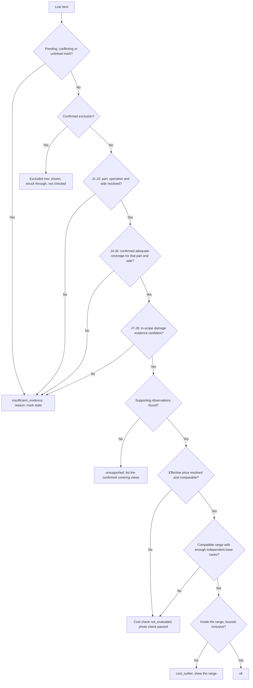

# Integration contracts

Status: **proposed** integration baseline for v2, target schema version `0.2.0`. Nothing here is implemented or measured. Owner: Lane 5 coordinates; each module owner owns its own adapter and topic payloads; Lane 4 owns taxonomy, cost and finding semantics. Source: [proposal v2](../CLAIM-CMEV_project_proposal_v2.md) sections 8 (decision rules), 9.2 to 9.6 (sequence, records, serving, registry, failure handling), 10 (modules), 11 (datasets) and 16 (transition). Shared records: [data contracts](data_contracts.md). Behavioural detail for the HTTP surface: [application platform](application_platform.md). Training recipes: [model training specification](model_training_specification.md). Screens: [UI specification](ui_specification.md).

## Runtime change from proposal v2 section 9.1

Proposal v2 section 9.1 specifies two processes built from one code base, a database jobs table, "no message broker", SQLite and local files. **The team has since directed a different runtime: one container per module, with Kafka as the main transport between modules.** This document targets that containerised, event-driven runtime. Proposal v2 has not been rewritten, so the two documents differ on this point, and only on this point.

| Item | Proposal v2 section 9.1 | This specification | Consequence |
|---|---|---|---|
| Processes | API process plus one worker | One container per module plus infrastructure containers | More build, configuration and startup work |
| Transport | Database jobs table, no broker | Kafka topics, Redpanda in development, plus direct HTTP for the browser only | New topic contracts, consumer groups, retry and dead-letter design |
| Database | SQLite in write-ahead-log mode | PostgreSQL 16 | Several containers write concurrently. SQLite cannot safely take concurrent writers from separate containers |
| Binary storage | Local files | MinIO behind a storage adapter | Object references replace file paths in messages |
| Effort | Least plumbing | More platform effort in Lane 5 | The extra effort must come out of the contingency and integration allocations, or scope must be cut. It is not free |

Every **domain** rule of v2 is unchanged: the decision rules of section 8, the records of section 9.3, the module scope of section 10, the datasets of section 11 and the evaluation plan of section 13. Only runtime and transport change.

This change is recorded in [ADR 0002](../adr/0002-containerised-event-runtime.md), which supersedes [ADR 0001](../adr/0001-prototype-runtime.md). This document is the contract-level expression of that decision. The runtime mechanics live in the [technical specification](technical_specification.md); where the two overlap, that document owns the platform detail and this one owns the message and record shapes. Any remaining disagreement between them is listed in section 12.

---

## 1. Integration principles

### 1.1 No language model in the decision path

**No large language model sits in the decision path.** This is a hard rule.

- Part and damage integration is **deterministic mask overlap** in M2 (section 3 below).
- Vision and document integration is the **deterministic rule set** in M8 (section 4 below).

Reasons:

1. Findings must be **reproducible**. The same input revision, the same pinned versions and the same configuration must give the same finding, every time.
2. Findings must be **version-pinned**. Every stored result names the exact model, taxonomy, configuration and cost-table version that produced it (v2 section 9.4). A hosted language model cannot be pinned this way.
3. Findings must be **immutable**. A stored assessment must never change meaning later (v2 section 8.4).
4. A language model cannot be **evaluated** inside the 50-person-day budget. The evaluation plan (v2 section 13.2) requires deterministic rule tests where every specified case must produce the specified outcome. A sampled generator cannot satisfy that.

### 1.2 The optional explainer stretch service

An optional stretch service `cmev-explainer` may turn an **already-computed** finding into a readable sentence. Its limits are hard.

| Limit | Rule |
|---|---|
| Off by default | The container is absent from the `lean` profile and disabled by configuration in the `full` profile |
| No decision power | It receives a finished finding and returns text only. It never changes a result, a check outcome, a state, a price or a revision |
| No new facts | It may only restate fields present in the finding it was given. It reads no images, no masks and no cost table |
| Marked in provenance | Any stored sentence carries `provenance.source_kind = "explainer"`, the service version and the finding ID it restated |
| Never printed as a check | The print view shows the deterministic reason codes. An explainer sentence is optional decoration beside them |
| Not on the critical path | If it is slow, missing or failing, the assessment is still complete |

Any change to these limits is a contract change and needs its own ADR.

### 1.3 Other standing principles

| Principle | Rule |
|---|---|
| References, not bytes | Kafka messages carry artifact IDs and object-store URIs. Image, mask and render bytes never enter a message |
| One writer per record | Each record type has exactly one producing service. No second service updates it |
| Immutable machine results | A correction never edits a machine row. It creates a new input revision and a new assessment (v2 section 8.4) |
| Withhold rather than guess | Every integration point has an explicit "cannot decide" outcome with a reason code |
| Version every row | Every persisted row stores the model, taxonomy, configuration and, where relevant, cost-table version that produced it |
| Profile parity | A `lean` result and a `full` result must be identical for the same input revision and pinned versions |

---

## 2. Module boundary map

### 2.1 Service list

| Service | Module | Role | Loads neural weights |
|---|---|---|---|
| `cmev-web` | M9 | React + TypeScript + Vite SPA, served by nginx | No |
| `cmev-api` | M9 | FastAPI. Intake, revisions, evidence, review API, cost-table lookup, finalize and print. Kafka producer and result consumer | No |
| `cmev-orchestrator` | - | Tracks per-input-revision branch completion, emits the consolidate command, handles retries and the dead-letter queue | No |
| `cmev-worker-parts` | M1 | SegFormer part segmentation | Yes |
| `cmev-worker-damage` | M2 | SegFormer damage segmentation plus mask-overlap part assignment | Yes |
| `cmev-worker-summary` | M3 | Part summary and coverage rules | No |
| `cmev-worker-ocr` | M4 | OpenCV page correction plus PaddleOCR | Pretrained only |
| `cmev-worker-lineitems` | M5 | Rule-based parser, optional LayoutLMv3 behind a flag | No, in the core plan |
| `cmev-worker-penmarks` | M6 | Faster R-CNN pen-mark detector, optional TrOCR behind a flag | Yes |
| `cmev-consolidator` | M8 | Deterministic findings | No |
| `cmev-kafka` | - | Redpanda, Kafka API compatible, single broker in development | No |
| `cmev-db` | - | PostgreSQL 16 | No |
| `cmev-objectstore` | - | MinIO, S3 API, behind a storage adapter | No |
| `cmev-explainer` | - | **Stretch, off by default.** Sentence rendering for a finished finding | Out of scope to decide here |

M7 has no container. It is offline only (v2 section 9.4). It writes a versioned cost table that `cmev-api` and `cmev-consolidator` read.

### 2.2 Compose profiles

| Profile | Services | Purpose |
|---|---|---|
| `lean` | `cmev-web`, `cmev-api`, `cmev-worker-combined`, `cmev-kafka`, `cmev-db`, `cmev-objectstore` | Laptop demonstration. `cmev-worker-combined` is the same code with every module handler, the orchestrator handler and the consolidator handler registered in one process |
| `full` | Every service in the table above | Module isolation, independent restart, separate resource limits |

Both profiles use the **same code, the same topic contracts and the same records**. A result produced under `lean` must equal the same result produced under `full`, given the same input revision and the same pinned versions. The profile name is recorded in `provenance.runtime_profile` so a difference can be detected rather than hidden.

### 2.3 Producer to consumer edges

Transport values: `kafka` is a topic, `db` is a PostgreSQL read or write, `obj` is an object-store access through the storage adapter, `http` is a direct synchronous call.

| # | From | To | Transport | Record or payload exchanged | Synchronous |
|---|---|---|---|---|---|
| 1 | Browser (M9) | `cmev-api` | `http` | Upload, input revision, review action, finalize | Yes |
| 2 | `cmev-api` | `cmev-objectstore` | `obj` | Original photo and page bytes | Yes |
| 3 | `cmev-api` | `cmev-orchestrator` | `kafka` `cmev.evt.input-revision-created.v1` | `ClaimInput` reference plus the file list | No |
| 4 | `cmev-orchestrator` | `cmev-worker-parts` | `kafka` `cmev.cmd.parts-segment.v1` | One photo reference | No |
| 5 | `cmev-worker-parts` | `cmev-objectstore` | `obj` | Part mask PNG written | Yes |
| 6 | `cmev-worker-parts` | `cmev-db` | `db` | `PartPrediction` rows written | Yes |
| 7 | `cmev-worker-parts` | `cmev-orchestrator` | `kafka` `cmev.evt.parts-segmented.v1` | Mask references and per-class confidence | No |
| 8 | `cmev-orchestrator` | `cmev-worker-damage` | `kafka` `cmev.cmd.damage-segment.v1` | Photo reference plus the part-mask reference from edge 7 | No |
| 9 | `cmev-worker-damage` | `cmev-objectstore` | `obj` | Part mask read, damage mask PNG written | Yes |
| 10 | `cmev-worker-damage` | `cmev-db` | `db` | `ImageDamageObservation` rows written | Yes |
| 11 | `cmev-worker-damage` | `cmev-orchestrator` | `kafka` `cmev.evt.damage-segmented.v1` | Observation IDs with part assignment or unknown identity | No |
| 12 | `cmev-orchestrator` | `cmev-worker-summary` | `kafka` `cmev.cmd.part-summary.v1` | All observation and part-mask IDs for the input revision, plus recorded human confirmations | No |
| 13 | `cmev-worker-summary` | `cmev-db` | `db` | `PartSummary` and `PartCoverage` rows written | Yes |
| 14 | `cmev-worker-summary` | `cmev-orchestrator` | `kafka` `cmev.evt.part-summarised.v1` | Summary and coverage IDs. Image branch complete | No |
| 15 | `cmev-orchestrator` | `cmev-worker-ocr` | `kafka` `cmev.cmd.page-read.v1` | One estimate page reference | No |
| 16 | `cmev-worker-ocr` | `cmev-objectstore` | `obj` | Corrected page render and page-reading JSON written | Yes |
| 17 | `cmev-worker-ocr` | `cmev-orchestrator` | `kafka` `cmev.evt.page-read.v1` | `DocumentPage` ID, corrected render reference, transform | No |
| 18 | `cmev-orchestrator` | `cmev-worker-lineitems` | `kafka` `cmev.cmd.line-items-extract.v1` | All `DocumentPage` IDs for the input revision | No |
| 19 | `cmev-worker-lineitems` | `cmev-db` | `db` | `LineItem` rows and `DeclarationCompleteness` written | Yes |
| 20 | `cmev-worker-lineitems` | `cmev-orchestrator` | `kafka` `cmev.evt.line-items-extracted.v1` | Line-item IDs, row boxes, completeness state | No |
| 21 | `cmev-orchestrator` | `cmev-worker-penmarks` | `kafka` `cmev.cmd.pen-marks-detect.v1` | Page renders plus the row boxes from edge 20 | No |
| 22 | `cmev-worker-penmarks` | `cmev-db` | `db` | `PenMark` rows written, all in state `pending` | Yes |
| 23 | `cmev-worker-penmarks` | `cmev-orchestrator` | `kafka` `cmev.evt.pen-marks-detected.v1` | Mark IDs, boxes, linked or candidate entry IDs. Document branch complete | No |
| 24 | `cmev-orchestrator` | `cmev-consolidator` | `kafka` `cmev.cmd.consolidate.v1` | Input revision, branch result IDs, pinned version bundle, pinned cost-table version | No |
| 25 | `cmev-consolidator` | `cmev-db` | `db` | Reads observations, coverage, line items, marks and human confirmations. Writes `AssessmentFinding` and `ProposedRepairAddition` | Yes |
| 26 | `cmev-consolidator` | `cmev-db` | `db` | Reads the `ReferenceCostRange` rows of the pinned cost-table version | Yes |
| 27 | `cmev-consolidator` | `cmev-api` | `kafka` `cmev.evt.assessment-ready.v1` | Assessment revision and counts by overall result | No |
| 28 | Any worker or `cmev-consolidator` | `cmev-orchestrator` and `cmev-api` | `kafka` `cmev.evt.job-failed.v1` | Job key, stage, reason code, attempt count | No |
| 29 | `cmev-orchestrator` | Dead-letter store | `kafka` `cmev.dlq.v1` | The original message plus its failure history | No |
| 30 | `cmev-api` | `cmev-consolidator` | `kafka` `cmev.cmd.consolidate.v1` | Reassessment after a decision-changing review action (v2 section 8.4) | No |
| 31 | `cmev-api` | `cmev-db` | `db` | Review events, mark decisions, manual amounts, identity and coverage confirmations | Yes |
| 32 | `cmev-api` | `cmev-objectstore` | `obj` | Evidence artifact streaming to the browser after an access check | Yes |
| 33 | Offline training jobs | Registry volume or `cmev-objectstore` | `obj` | Model weights, manifests, split manifests, evaluation reports | Yes |
| 34 | Offline M7 build | `cmev-db` and registry | `db`, `obj` | `ReferenceCostRange` rows plus the cost-table build manifest | Yes |
| 35 | `cmev-api` | `cmev-explainer` | `http` | **Stretch only.** A finished finding in, a sentence out | Yes |

Rules that follow from the table.

- **Kafka carries references, never image bytes.** Every mask, render and original travels as an artifact ID plus an object-store URI.
- **No worker calls another worker.** Every worker-to-worker dependency goes through the orchestrator.
- **No worker calls the API.** Workers write to PostgreSQL and publish events.
- **The browser talks only to `cmev-api`.** It never reads Kafka, PostgreSQL or MinIO directly.
- **Only `cmev-api` and `cmev-orchestrator` produce commands.** Workers produce events and failures only.
- **Nothing publishes to Kafka from inside a module.** A producing service writes the outgoing message into the outbox table in the same transaction as its result rows, and a relay publishes it. "Producer" in the tables above means the service that owns the message, not a direct broker call.

### 2.4 Boundary diagram

```mermaid
flowchart TD
    UI["cmev-web (M9 SPA)"] -->|HTTP /api/v1| API["cmev-api (M9)"]
    API -->|evt.input-revision-created| ORCH["cmev-orchestrator"]
    ORCH -->|cmd.parts-segment| WP["cmev-worker-parts (M1)"]
    WP -->|evt.parts-segmented| ORCH
    ORCH -->|cmd.damage-segment| WD["cmev-worker-damage (M2)"]
    WD -->|evt.damage-segmented| ORCH
    ORCH -->|cmd.part-summary| WS["cmev-worker-summary (M3)"]
    WS -->|evt.part-summarised| ORCH
    ORCH -->|cmd.page-read| WO["cmev-worker-ocr (M4)"]
    WO -->|evt.page-read| ORCH
    ORCH -->|cmd.line-items-extract| WL["cmev-worker-lineitems (M5)"]
    WL -->|evt.line-items-extracted| ORCH
    ORCH -->|cmd.pen-marks-detect| WM["cmev-worker-penmarks (M6)"]
    WM -->|evt.pen-marks-detected| ORCH
    ORCH -->|cmd.consolidate| CON["cmev-consolidator (M8)"]
    API -->|cmd.consolidate on reassessment| CON
    CON -->|evt.assessment-ready| API
    WP -.evt.job-failed.-> ORCH
    WD -.evt.job-failed.-> ORCH
    WO -.evt.job-failed.-> ORCH
    WL -.evt.job-failed.-> ORCH
    WM -.evt.job-failed.-> ORCH
    CON -.evt.job-failed.-> ORCH
    ORCH -.retries exhausted.-> DLQ["cmev.dlq.v1"]
    WP <--> OBJ[("cmev-objectstore")]
    WD <--> OBJ
    WO <--> OBJ
    API <--> OBJ
    WP --> DB[("cmev-db, PostgreSQL 16")]
    WD --> DB
    WS --> DB
    WO --> DB
    WL --> DB
    WM --> DB
    CON <--> DB
    API <--> DB
    OFF["Offline jobs: train M1, M2, M6; build the M7 table"] --> REG[("Model and cost registry, read-only to the runtime")]
    REG --> WP
    REG --> WD
    REG --> WM
    REG --> CON
    API -.stretch, off by default.-> EX["cmev-explainer"]
```

### 2.5 Branch ledger in the orchestrator

The orchestrator holds one ledger row per input revision. It is the only place that knows a branch is finished.

| Field | Meaning |
|---|---|
| `claim_id`, `input_revision` | Ledger identity |
| `expected_photos`, `expected_pages` | Counts taken from `cmev.evt.input-revision-created.v1` |
| `parts_done`, `damage_done`, `pages_done` | Per-item completion counts |
| `image_branch_state` | `pending`, `running`, `complete`, `failed`, `skipped_no_photos` |
| `document_branch_state` | `pending`, `running`, `complete`, `failed`, `skipped_no_pages` |
| `consolidate_emitted_at` | Null until the consolidate command is produced |
| `failures` | List of `job_key` and reason code |

The consolidate command is emitted when both branch states are terminal and at least one is `complete`. A `failed` branch does not block consolidation. It produces an **incomplete** assessment, as v2 section 9.2 requires. A `skipped_no_pages` branch produces the "waiting for the estimate" state.

---

## 3. How the part model and the damage model integrate (M1 into M2)

This is the deterministic answer to "how do the two vision models talk to each other". There is no learned fusion and no language model. M2 owns the algorithm. M1 only supplies masks.

### 3.1 What M2 receives

| Input | Source | Note |
|---|---|---|
| Original photo | Object store, by artifact ID | Same bytes M1 used |
| Part mask raster | `cmev.cmd.damage-segment.v1`, written by M1 | One label per pixel in the M1 encoding, at the M1 output resolution, with its transform back to the original photo |
| Part class confidence map or per-class summary | Same message | Used for the part-confidence gate |
| `taxonomy_version`, `parts_model_version` | Same message | Recorded on every produced observation |
| Assignment configuration | `configs/pipeline/damage_assignment.yaml` | Versioned. See section 3.5 |

M1 and M2 preprocess with the **same policy**, so the part mask and the damage mask share one frame (`mask_frame = model`) and one pixel grid. No resampling of a class map is needed, and none is permitted with an interpolation that invents class values. If the two transforms do not match, or if `versions.parts_model` differs from the model that produced the referenced masks, M2 fails the job with `mask_geometry_mismatch` or `parts_version_mismatch`. It does not guess.

[M2](module-02-damage-segmentation.md) owns this algorithm and its threshold names. This section is the boundary contract for it.

### 3.2 The algorithm

1. **Run damage segmentation.** SegFormer produces a per-pixel argmax over seven logits: background plus the six CarDD classes.
2. **Threshold.** Pixels below `min_damage_confidence` become background. The dropped-pixel count is recorded as a quality signal.
3. **Extract connected components.** Per damage class, using `connectivity` (proposed 8). Components of different classes are never merged. Each component is one candidate damage region.
4. **Drop tiny regions.** Discard components below `min_damage_pixels`, recording the count with reason `below_min_pixels`. A dropped component is counted on the event, not silently lost.
5. **Compute containment against every part region.** For each component and each part region:

   **`containment(part) = |component intersect part| / |component|`**

   Containment, not IoU, because a part mask is far larger than a damage region and IoU would always be small. A small dent fully inside a large bonnet scores 1.0, which is the right answer. Also compute `containment(background)`.
6. **Rank.** Sort the parts by containment. `primary` is the highest, `runner_up` the second.
7. **Assign only when every condition holds.** Otherwise the observation keeps unknown part identity.

| Condition | Must hold |
|---|---|
| `primary` is an M1 accepted part for that photo | otherwise reason `part_not_accepted` |
| `primary_containment >= assign_min_containment` | otherwise reason `below_containment_threshold`, or `no_part_overlap` when no part overlaps at all |
| `primary_containment - runner_up_containment >= assign_ambiguity_margin` | otherwise reason `ambiguous_between_parts`, both candidates retained |
| `containment(background) <= assign_background_max` | otherwise reason `mostly_background` |
| A part mask exists for the photo | otherwise reason `part_masks_missing`, and damage detection still stands |

A boundary-crossing component is **not split** across two parts (`split_components = false`). A component straddling a panel edge is ambiguous evidence; splitting it would invent two observations from one region.

Proposed initial values, selected on validation data and frozen at the day-6 checkpoint (v2 section 10, M2):

| Setting | Proposed initial value |
|---|---|
| `min_damage_confidence` | 0.50 |
| `min_damage_pixels` | 256 |
| `connectivity` | 8 |
| `assign_min_containment` | 0.60 |
| `assign_ambiguity_margin` | 0.20 |
| `assign_background_max` | 0.50 |
| `split_components` | false |

### 3.3 Output fields per damage region

Each surviving component produces exactly one `ImageDamageObservation` row.

| Field | Type | Required | Meaning |
|---|---|---|---|
| `observation_id` | string, ULID | yes | Stable. Deterministic from `job_key` plus component index, so a replay reuses it |
| `photo_id` | string | yes | Original photo artifact ID |
| `damage_type` | enum, six CarDD codes | yes | Never "unknown". An unclassifiable region is not emitted |
| `damage_confidence` | number in [0,1] | yes | Mean damage-class probability over the region |
| `assignment_status` | enum | yes | `assigned` or `unresolved` |
| `part_code` | string or null | yes, nullable | Null whenever `assignment_status = unresolved`, and then `part_reason` is required |
| `part_reason` | enum | required when `part_code` is null | `no_part_overlap`, `below_containment_threshold`, `ambiguous_between_parts`, `part_not_accepted`, `mostly_background`, `part_masks_missing` |
| `side` | enum | yes | **Always `unknown` from this module**, with reason `hitl_labels_unsided`. See section 3.4 |
| `candidates` | array | yes, may be empty | Each entry `{part_code, containment, rank}`, always populated, including when assigned |
| `primary_containment` | number in [0,1] | yes | Recorded for evaluation and for review display |
| `runner_up_containment` | number in [0,1] or null | yes, nullable | Null when only one part region overlaps |
| `background_containment` | number in [0,1] | yes | Feeds the `mostly_background` rule |
| `area_pixels` | integer | yes | Pixel count of the component in the model frame |
| `area_fraction` | number in [0,1] | yes | `area_pixels` divided by the model-frame pixel count, for example `262144` at 512 by 512. The denominator is recorded, never assumed |
| `damage_mask_ref` | artifact reference | yes | The class mask and the component-id raster, plus the component index |
| `part_mask_ref` | artifact reference or null | yes, nullable | Null only with reason `part_masks_missing` |
| `bbox_norm` | `[x_min, y_min, x_max, y_max]` | yes | Normalised to the **original** photo, after inverting every transform |
| `versions` | object | yes | `damage_model`, `parts_model`, `taxonomy`, `assignment_config` |
| `assignment_config_version` | string | yes | The exact configuration version that produced the decision |

`area_pixels` and `area_fraction` are **image measures**. They are not square centimetres, not severity and not a count of physical dents. M3 must not add them across views (v2 section 10, M3).

### 3.4 Side is never resolved here

HITL part labels carry no left or right information (v2 sections 10 M1 and 8.1). Therefore:

- M2 always emits `side = "unknown"` with reason `hitl_labels_unsided`.
- M2 must never infer side from image position, from vehicle orientation, from another part's position or from the photograph's file name.
- Only a **recorded human identity confirmation** through the evidence panel can attach a side. That confirmation is a separate record with its own actor, timestamp and revision. It never rewrites the model row (v2 sections 9.3 and 10 M1).

### 3.5 Thresholds are versioned configuration, not constants

Every threshold in section 3.2 lives in `configs/pipeline/damage_assignment.yaml`, which carries a `config_version`. Model keys live in `configs/models/damage.yaml`. Rules:

- No threshold may be a literal in Python code. A code review that finds one treats it as a defect.
- Thresholds are selected on the **validation** partition of the jointly labelled damage-to-part sample (v2 sections 11.5 and 13.1). They are frozen before the final test set is touched.
- A changed `config_version` produces a new `job_key` and therefore a new job, a new result and a new assessment. It never rewrites an existing observation.
- The observation row stores the config version, so an old finding can always be explained by the configuration that produced it.

### 3.6 What this integration does not do

It does not choose a repair operation. It does not prove a repair is needed. It does not deduplicate physical damage across photographs. It does not resolve side. Those are M3, M8 and human review concerns.

---

## 4. How the vision branch and the OCR branch integrate (M3 and M5 into M8)

### 4.1 They never touch each other

`cmev-worker-summary` (M3) and `cmev-worker-lineitems` (M5) share no topic, no table write and no call. There is no image-to-text model and no joint embedding. The branches meet only inside `cmev-consolidator` (M8), which reads both from PostgreSQL and applies the rules of v2 section 8. This is a deliberate design choice, restated from v2 section 1: the branches are processed separately and then combined by rules.

### 4.2 The join key

The join key has exactly three parts.

**`canonical part code` + `resolved side` + `operation`**

| Key part | From the document side (M5, corrected by review) | From the vision side (M3, plus human confirmation) |
|---|---|---|
| Canonical part code | Mapped from the printed description through the versioned alias table | Predicted part code from M2, carried into the M3 summary |
| Resolved side | Parsed from the printed description, or corrected by the surveyor | **Never from a model.** Only from a recorded identity confirmation |
| Operation | Mapped from the printed operation column | **Not produced by the vision branch at all** |

The vision branch never supplies an operation. The join therefore works like this: a line item selects the vision rows by part code and side, and the operation is used only for the cost check and for the "multiple operations on one part are legitimate" rule (v2 section 8.2).

### 4.3 Join rules

Evaluated in order for one line item.

| Step | Rule | Failure outcome |
|---|---|---|
| J1 | The line item must have a mapped `part_code` with mapping status `resolved` | `insufficient_evidence`, reason `part_unmapped` |
| J2 | The line item must have a mapped `operation` with mapping status `resolved` | `insufficient_evidence`, reason `operation_unmapped` |
| J3 | The line item's `side` must be `left`, `right`, `centre` or `not_applicable` | `insufficient_evidence`, reason `side_unresolved` |
| J4 | A `PartCoverage` row must exist for that part code and side | `insufficient_evidence`, reason `no_coverage_slot` |
| J5 | That coverage row's state must be `adequate` | `insufficient_evidence`, reason `coverage_inadequate`, `coverage_not_visible` or `coverage_unresolved` |
| J6 | Coverage `adequate` must be backed by a recorded human coverage confirmation | `insufficient_evidence`, reason `coverage_unconfirmed` |
| J7 | Damage observations are then selected where `part_code` matches, `side` matches after confirmation, and `damage_confidence >= min_damage_conf` | Zero rows is a valid result, not a failure. It feeds the `unsupported` branch of v2 section 8.1 |
| J8 | Observations whose `damage_type` is outside the supported CarDD six are excluded from support and recorded in `out_of_scope_damage_count` | Not a failure. It constrains a negative finding |

### 4.4 What makes a join fail

| Failure cause | Reason code | Result |
|---|---|---|
| Part name could not be mapped, or mapped ambiguously | `part_unmapped`, `part_ambiguous` | `insufficient_evidence` |
| Operation unreadable, ambiguous, bundled or "other" | `operation_unmapped`, `operation_bundled` | `insufficient_evidence` |
| Side is `unknown` on either the line item or the coverage slot | `side_unresolved` | `insufficient_evidence` |
| No coverage slot exists for the part and side | `no_coverage_slot` | `insufficient_evidence` |
| Coverage state is `inadequate`, `not_visible` or `unresolved` | `coverage_inadequate`, `coverage_not_visible`, `coverage_unresolved` | `insufficient_evidence` |
| Coverage is `adequate` but unconfirmed by a human | `coverage_unconfirmed` | `insufficient_evidence` |
| A pending or conflicting pen mark sits on the row | `mark_pending`, `mark_conflicting` | `insufficient_evidence`, before any join is attempted |
| A pen mark is unlinked and could belong to this row | `mark_unlinked_candidate` | `insufficient_evidence` |
| The effective price is unresolved because a price change is pending | `effective_price_unresolved` | Cost check `not_evaluated`. The photo check may still run |
| Declaration completeness is `partial` or `unreadable` | `declaration_incomplete` | Possible additions are suppressed. Per-row checks may still run |
| The image branch failed | `image_branch_failed` | Photo check `not_evaluated`, assessment marked incomplete |
| The document branch failed | `document_branch_failed` | No line items exist. The damage summary is still shown |

### 4.5 Withholding outcomes required by v2 section 8.1

These are not optional. They are the safety rules.

- An unresolved side **blocks a match**. A declaration for the left door can never use the right door's coverage or damage. The only thing that unblocks it is a **recorded human identity confirmation** carrying actor, timestamp, the photo it was made on and the review revision.
- A pending mark blocks the row before anything else is evaluated. A pending price change never falls back to the printed amount.
- A sharp, large mask does not establish adequate coverage. Coverage must be confirmed.
- A confident absence of damage requires all of: resolved identity, confirmed adequate coverage, and confident in-scope damage evidence. Only then may the result be `unsupported`.
- A failed model run is a **processing failure**, never `not_visible` and never an empty successful check.
- Skipped checks are `not_evaluated`. A skipped cost check is not a passed cost check.

### 4.6 Consolidation order inside M8



Each check result is stored separately as well as the overall result. A passed photo check can sit beside a withheld cost check.

### 4.7 Possible additions

A vision observation with no matching line item becomes a `ProposedRepairAddition` only when **all** of these hold (v2 section 8.2):

1. Declaration completeness is `complete` or `explicitly_empty`, confirmed by the surveyor.
2. No pen mark is pending or unlinked anywhere in the document.
3. The observation's part identity is resolved and its side is confirmed.
4. No line item matches that part and side.
5. No **confirmed exclusion** exists for the same resolved part and side. If one does, suppress the addition and attach an informational damage note to the excluded row. An exclusion on the right door never suppresses left-door damage.

Otherwise, record an **ambiguity for review**, not a confident omission. A proposed addition never carries an invented operation or amount.

---

## 5. Kafka topic specifications

### 5.1 Naming, keys and cluster settings

Topic naming is `cmev.<kind>.<name>.v1`. `cmd` is work to do. `evt` is a fact that happened. `dlq` is the dead-letter topic.

| Cluster setting | Development value | Note |
|---|---|---|
| Broker | Redpanda, single node, Kafka API compatible | One broker in `cmev-kafka` |
| Replication factor | 1 | Single broker in development. Not a production setting |
| Message key | `claim_id` for every topic | One claim keeps its order on one partition |
| Compression | `zstd` | Proposed |
| Auto topic creation | Off | Topics are created by `infra/kafka/topics.sh` from this table |
| Cleanup policy | `delete` on every topic | Compaction is wrong here: `claim_id` repeats across revisions and the history is the record |

**Why the key is `claim_id`.** Kafka guarantees order within a partition. Keying by `claim_id` puts every message for one claim on one partition, so `parts-segmented` for a claim can never overtake `input-revision-created` for the same claim. Keying by `job_key` would spread one claim across partitions and lose that guarantee. The cost is that one very large claim cannot be parallelised across partitions. That is acceptable at this scale.

### 5.2 The shared envelope

Defined once. Every message on every topic carries it. Payload fields are then listed per topic and never repeat these.

| Envelope field | Type | Required | Meaning |
|---|---|---|---|
| `schema_version` | string, semver | yes | Contract version of this message, for example `0.2.0`. Validated on produce and on consume |
| `claim_id` | string, ULID | yes | Also the Kafka message key |
| `input_revision` | integer >= 1 | yes | The claim-local input revision this message belongs to |
| `job_key` | string | yes | Unique work identity. See section 6.6 |
| `versions` | object | yes | Map of version names to values: `taxonomy`, `code`, and the model, parser or configuration versions relevant to the stage. Empty object is invalid |
| `provenance` | object | yes | `{source_kind: real \| synthetic \| fixture, runtime_profile: lean \| full, producer_service, source_dataset_id?}` |
| `occurred_at` | string, RFC 3339 UTC | yes | When the fact happened, not when it was published |
| `dedup_key` | string, 64 hex | yes | `sha256(topic + "\|" + job_key + "\|" + attempt_epoch)`. Stable across **redeliveries** of one logical message, so a duplicate is caught. A deliberate operator retry mints a new `attempt_epoch` and therefore a new key, so the retry is genuinely new work |
| `trace_id` | string | yes | Propagated unchanged from the originating HTTP request through every downstream message |
| `assessment_revision` | integer or null | no | Present on consolidate and assessment topics only |
| `attempt` | integer >= 1 | no | Producer-side attempt counter. Default 1 |
| `causation_id` | string or null | no | `dedup_key` of the message that caused this one. Null on `input-revision-created` |

Envelope validation failure is a **hard reject**. The consumer sends the message straight to `cmev.dlq.v1` with reason `envelope_invalid`. It does not retry, because a malformed envelope will not become valid on a retry.

### 5.3 Topic table

Retention is a development proposal. Partition counts are proposed for a single broker.

Consumer groups are named exactly after the consuming container, as the [technical specification](technical_specification.md) section 6.4 requires. One group subscribes to every topic that container consumes.

| Topic | Purpose | Producer | Consumer group | Partitions | Retention | Cleanup |
|---|---|---|---|---|---|---|
| `cmev.evt.input-revision-created.v1` | A new input revision is committed and its files are stored | `cmev-api` outbox relay | `cmev-orchestrator` | 3 | 7 days | delete |
| `cmev.cmd.parts-segment.v1` | Segment parts on one photo | `cmev-orchestrator` | `cmev-worker-parts` | 3 | 7 days | delete |
| `cmev.evt.parts-segmented.v1` | Part masks exist for one photo | `cmev-worker-parts` | `cmev-orchestrator` | 3 | 7 days | delete |
| `cmev.cmd.damage-segment.v1` | Segment damage on one photo and assign parts | `cmev-orchestrator` | `cmev-worker-damage` | 3 | 7 days | delete |
| `cmev.evt.damage-segmented.v1` | Damage observations exist for one photo | `cmev-worker-damage` | `cmev-orchestrator` | 3 | 7 days | delete |
| `cmev.cmd.part-summary.v1` | Summarise every observation for the input revision | `cmev-orchestrator` | `cmev-worker-summary` | 3 | 7 days | delete |
| `cmev.evt.part-summarised.v1` | Part summary and coverage exist. Image branch complete | `cmev-worker-summary` | `cmev-orchestrator` | 3 | 7 days | delete |
| `cmev.cmd.page-read.v1` | Correct and OCR one estimate page | `cmev-orchestrator` | `cmev-worker-ocr` | 3 | 7 days | delete |
| `cmev.evt.page-read.v1` | Located text exists for one page | `cmev-worker-ocr` | `cmev-orchestrator` | 3 | 7 days | delete |
| `cmev.cmd.line-items-extract.v1` | Parse rows from every page of the input revision | `cmev-orchestrator` | `cmev-worker-lineitems` | 3 | 7 days | delete |
| `cmev.evt.line-items-extracted.v1` | Line items and completeness exist | `cmev-worker-lineitems` | `cmev-orchestrator` | 3 | 7 days | delete |
| `cmev.cmd.pen-marks-detect.v1` | Detect and link pen marks on every page | `cmev-orchestrator` | `cmev-worker-penmarks` | 3 | 7 days | delete |
| `cmev.evt.pen-marks-detected.v1` | Pending marks exist. Document branch complete | `cmev-worker-penmarks` | `cmev-orchestrator` | 3 | 7 days | delete |
| `cmev.cmd.consolidate.v1` | Build an assessment from the stored branch results | `cmev-orchestrator`, `cmev-api` | `cmev-consolidator` | 3 | 7 days | delete |
| `cmev.evt.assessment-ready.v1` | An assessment revision is committed | `cmev-consolidator` | `cmev-api`, and `cmev-explainer` only if that stretch service is enabled | 3 | 30 days | delete |
| `cmev.evt.job-failed.v1` | A stage failed | Any worker, `cmev-consolidator` | `cmev-orchestrator`, `cmev-api` | 3 | 30 days | delete |
| `cmev.dlq.v1` | Retries exhausted, or the message was unprocessable | `cmev-orchestrator` | None automatic. Manual inspection, plus the read-only admin endpoint | 1 | 30 days | delete |

### 5.4 Payload field lists

Envelope fields are not repeated. `R` means required.

**`cmev.evt.input-revision-created.v1`**

| Field | Type | R | Meaning |
|---|---|---|---|
| `previous_input_revision` | integer or null | yes | Null on the first revision |
| `external_reference` | string or null | yes | The insurer's claim reference, nullable with reason |
| `vehicle` | object | yes | `{make, model, year, vehicle_class \| null, class_reason \| null}` |
| `currency` | string, ISO 4217 | yes | `SGD` enables the cost check. Others are stored and skipped |
| `photos` | array of `FileRef` | yes | May be empty. Empty means the image branch is skipped |
| `pages` | array of `FileRef` | yes | May be empty. Empty means the document branch is skipped |
| `reused_artifacts` | array of objects | no | Prior-revision artifacts explicitly reused, with lineage (v2 section 8.4) |

`FileRef` is `{file_id, object_uri, sha256, media_type, byte_count, width, height, page_number \| null, exif_orientation \| null}`.

**`cmev.cmd.parts-segment.v1`**

| Field | Type | R | Meaning |
|---|---|---|---|
| `photo` | `FileRef` | yes | One photo only |
| `model_id`, `model_version` | string | yes | Registry entry to load |
| `preprocess_config_version` | string | yes | Resize, pad and normalise settings |
| `taxonomy_version` | string | yes | Part vocabulary version |

**`cmev.evt.parts-segmented.v1`**

| Field | Type | R | Meaning |
|---|---|---|---|
| `photo_id` | string | yes | |
| `part_mask_ref` | artifact reference | yes | `{artifact_id, object_uri, sha256, width, height, encoding}` |
| `transform` | object | yes | Inverse transform back to the original photo: scale, pad, rotation |
| `parts` | array | yes | `{part_code, pixel_count, mean_confidence}` per predicted class present |
| `part_prediction_ids` | array of string | yes | Database row IDs written |
| `image_quality` | object | yes | `{state, blur_score, exposure_state, reasons[]}` |
| `empty_result` | boolean | yes | True when no part was predicted. **Not** proof the vehicle is absent |

**`cmev.cmd.damage-segment.v1`**

| Field | Type | R | Meaning |
|---|---|---|---|
| `photo` | `FileRef` | yes | |
| `part_mask_ref` | artifact reference | yes | From `parts-segmented` |
| `transform` | object | yes | Copied unchanged from `parts-segmented` |
| `model_id`, `model_version` | string | yes | Damage model registry entry |
| `preprocess_config_version` | string | yes | |
| `assignment_config_version` | string | yes | The section 3.5 configuration |
| `taxonomy_version` | string | yes | Damage vocabulary version, CarDD six |

**`cmev.evt.damage-segmented.v1`**

| Field | Type | R | Meaning |
|---|---|---|---|
| `photo_id` | string | yes | |
| `damage_mask_ref` | artifact reference | yes | |
| `observations` | array | yes | One entry per surviving region, fields as section 3.3 |
| `observation_ids` | array of string | yes | Database row IDs written |
| `dropped_region_count` | integer | yes | Components removed by the size filter |
| `unknown_part_count` | integer | yes | Observations left with unknown part identity |
| `empty_result` | boolean | yes | True when no damage region survived. **Not** proof of no damage |

**`cmev.cmd.part-summary.v1`**

| Field | Type | R | Meaning |
|---|---|---|---|
| `observation_ids` | array of string | yes | Every observation for the input revision |
| `part_prediction_ids` | array of string | yes | Every part prediction for the input revision |
| `photo_ids` | array of string | yes | Every photo, including those with no observation |
| `identity_confirmations` | array | yes | May be empty. `{confirmation_id, photo_id, part_code, side, actor, recorded_at, review_revision}` |
| `coverage_confirmations` | array | yes | May be empty. Same shape plus `covers_enough: boolean` |
| `summary_config_version` | string | yes | Grouping and quality-screen rules |
| `taxonomy_version` | string | yes | |

**`cmev.evt.part-summarised.v1`**

| Field | Type | R | Meaning |
|---|---|---|---|
| `summary_ids` | array of string | yes | `PartSummary` rows written |
| `coverage_ids` | array of string | yes | `PartCoverage` rows written, one per vocabulary slot |
| `unresolved_observation_ids` | array of string | yes | Observations that could not be grouped, kept separate |
| `coverage_counts` | object | yes | `{adequate, inadequate, not_visible, unresolved}` |
| `branch` | constant `"image"` | yes | Signals branch completion to the orchestrator |

**`cmev.cmd.page-read.v1`**

| Field | Type | R | Meaning |
|---|---|---|---|
| `page` | `FileRef` | yes | One page image or one rendered PDF page |
| `ocr_engine`, `ocr_version` | string | yes | Pinned PaddleOCR build, or the recorded fallback |
| `preprocess_config_version` | string | yes | OpenCV page detection and perspective correction settings |

**`cmev.evt.page-read.v1`**

| Field | Type | R | Meaning |
|---|---|---|---|
| `page_id` | string | yes | `DocumentPage` row ID |
| `page_number` | integer >= 1 | yes | One-based |
| `corrected_render_ref` | artifact reference | yes | The image the parser and the detector must both use |
| `page_reading_ref` | artifact reference | yes | The located-text JSON in the object store |
| `transform` | object | yes | Inverse transform back to the uploaded page |
| `text_granularity` | enum | yes | `word`, `line` or `block`. Must state what the engine actually gave |
| `token_count` | integer | yes | |
| `mean_text_confidence` | number in [0,1] or null | yes | Null with reason when the engine gives none |
| `page_quality` | object | yes | `{state, reasons[]}` |
| `correction_applied` | boolean | yes | False when the page boundary could not be found reliably |

**`cmev.cmd.line-items-extract.v1`**

| Field | Type | R | Meaning |
|---|---|---|---|
| `pages` | array | yes | `{page_id, page_number, corrected_render_ref, page_reading_ref, transform}` |
| `parser_config_version` | string | yes | Header aliases, layout family rules, vocabulary |
| `taxonomy_version` | string | yes | |
| `claim_currency` | string | yes | Used only when the document states none |
| `engine` | enum | yes | `parser` by default. `layoutlmv3` only when the stretch flag is on |
| `model_id`, `model_version` | string or null | yes, nullable | Null for the parser |

**`cmev.evt.line-items-extracted.v1`**

| Field | Type | R | Meaning |
|---|---|---|---|
| `line_item_ids` | array of string | yes | |
| `line_items` | array | yes | Summary per row: `{entry_id, page_id, row_box_norm, part_code \| null, part_mapping_status, side, operation \| null, operation_mapping_status, quantity \| null, unit_price \| null, printed_line_amount \| null, currency, cost_basis, field_uncertainty[]}` |
| `layout_family` | string or null | yes, nullable | Null with reason when no supported family matched |
| `declaration_completeness` | enum | yes | `complete`, `partial`, `unreadable`, `explicitly_empty` |
| `completeness_reasons` | array of string | yes | May be empty only when `complete` |
| `unparsed_region_count` | integer | yes | Regions visible but not turned into rows |
| `engine` | enum | yes | `parser` or `layoutlmv3` |
| `branch_stage` | constant `"line_items"` | yes | |

A zero-length `line_items` array with `declaration_completeness = "unreadable"` is **not** an empty estimate. Only an explicit surveyor confirmation produces `explicitly_empty`.

**`cmev.cmd.pen-marks-detect.v1`**

| Field | Type | R | Meaning |
|---|---|---|---|
| `pages` | array | yes | `{page_id, page_number, corrected_render_ref, transform}` |
| `row_boxes` | array | yes | `{entry_id, page_id, row_box_norm, amount_box_norm \| null}` from the line-item event |
| `model_id`, `model_version` | string | yes | Faster R-CNN registry entry |
| `link_config_version` | string | yes | Vertical overlap, distance and amount-column tolerances |
| `trocr_enabled` | boolean | yes | False in the core plan |

**`cmev.evt.pen-marks-detected.v1`**

| Field | Type | R | Meaning |
|---|---|---|---|
| `mark_ids` | array of string | yes | |
| `marks` | array | yes | `{mark_id, page_id, mark_type, box_norm, detection_confidence, entry_id \| null, candidate_entry_ids[], link_reason, state: "pending", trocr_suggestion \| null}` |
| `unlinked_count` | integer | yes | Marks with no unambiguous row |
| `conflicting_count` | integer | yes | Rows carrying contradictory marks |
| `branch` | constant `"document"` | yes | Signals branch completion to the orchestrator |

`trocr_suggestion` is `{text, confidence}` or null. It is a suggestion only and is stored apart from any human-entered amount.

**`cmev.cmd.consolidate.v1`**

| Field | Type | R | Meaning |
|---|---|---|---|
| `trigger` | enum | yes | `branches_complete`, `reassessment`, `retry` |
| `image_branch_state` | enum | yes | `complete`, `failed`, `skipped_no_photos` |
| `document_branch_state` | enum | yes | `complete`, `failed`, `skipped_no_pages` |
| `summary_ids`, `coverage_ids` | array of string | yes | May be empty when the image branch is absent |
| `line_item_ids`, `mark_ids` | array of string | yes | May be empty when the document branch is absent |
| `review_revision` | integer or null | yes | The review revision whose confirmations are applied. Null on the first pass |
| `cost_table_version` | string | yes | Pinned for the life of the assessment |
| `rules_config_version` | string | yes | The M8 rule and threshold configuration |
| `pinned_versions` | object | yes | Every model, parser, taxonomy and configuration version used by the branches |
| `reason` | string or null | no | Present on `reassessment`, naming the review action that caused it |

**`cmev.evt.assessment-ready.v1`**

| Field | Type | R | Meaning |
|---|---|---|---|
| `assessment_revision` | integer >= 1 | yes | Also present in the envelope |
| `assessment_state` | enum | yes | `ready` or `incomplete` |
| `finding_counts` | object | yes | `{ok, unsupported, cost_outlier, insufficient_evidence, excluded}` |
| `proposed_addition_count` | integer | yes | |
| `suppressed_addition_count` | integer | yes | Additions withheld by the section 4.7 safeguards |
| `cost_checks` | object | yes | `{within_range, outside_range, insufficient_support, not_evaluated}` |
| `pinned_versions` | object | yes | Copied from the command, stored on the assessment |
| `incomplete_reasons` | array of string | yes | Empty only when `assessment_state = "ready"` |

**`cmev.evt.job-failed.v1`**

| Field | Type | R | Meaning |
|---|---|---|---|
| `stage` | enum | yes | `parts_segment`, `damage_segment`, `part_summary`, `page_read`, `line_items_extract`, `pen_marks_detect`, `consolidate` |
| `target_ref` | string or null | yes | The photo, page or document this stage was working on |
| `reason_code` | string | yes | Stable code, for example `model_load_failed`, `mask_geometry_mismatch`, `artifact_missing`, `ocr_engine_error`, `timeout`, `out_of_memory` |
| `reason_text` | string | yes | Readable. **No claim content and no credentials** |
| `attempt` | integer | yes | The attempt that failed |
| `retryable` | boolean | yes | False sends the message straight to the dead-letter queue |
| `partial_artifacts` | array | no | Artifacts written before the failure, for cleanup |

**`cmev.dlq.v1`**

| Field | Type | R | Meaning |
|---|---|---|---|
| `original_topic` | string | yes | |
| `original_envelope` | object | yes | The full envelope, verbatim |
| `original_payload` | object or string | yes | Verbatim. A string when the payload could not be parsed |
| `failure_history` | array | yes | `{attempt, occurred_at, reason_code, reason_text}` |
| `dlq_reason` | enum | yes | `retries_exhausted`, `envelope_invalid`, `schema_invalid`, `not_retryable`, `poison_message` |
| `first_failed_at`, `last_failed_at` | RFC 3339 UTC | yes | |
| `replayable` | boolean | yes | False when the input revision is already superseded |

### 5.5 Example messages

**`cmev.evt.input-revision-created.v1`**

```json
{
  "schema_version": "0.2.0",
  "claim_id": "01JAX7Q0VN4Z3K9F2M8R6T1C5D",
  "input_revision": 1,
  "job_key": "01JAX7Q0VN4Z3K9F2M8R6T1C5D:1:intake:all:a91c4f2e",
  "versions": { "taxonomy": "parts-1.0.0", "code": "0.2.0" },
  "provenance": { "source_kind": "real", "runtime_profile": "full", "producer_service": "cmev-api" },
  "occurred_at": "2026-09-22T03:14:07Z",
  "dedup_key": "3f7c9a1b4e2d8c60a5f1b3d7e9c2a4867b0d5e1f3a9c7b2d4e6f8a0c1b3d5e7f",
  "trace_id": "9d1f0c2a7b3e4f58",
  "causation_id": null,
  "payload": {
    "previous_input_revision": null,
    "external_reference": "OD-2026-004417",
    "vehicle": { "make": "Toyota", "model": "Corolla Altis", "year": 2019, "vehicle_class": "sedan_standard", "class_reason": null },
    "currency": "SGD",
    "photos": [
      { "file_id": "ph_01JAX7Q1A", "object_uri": "s3://cmev-originals/01JAX.../ph_01JAX7Q1A.jpg", "sha256": "b2c3...", "media_type": "image/jpeg", "byte_count": 3874112, "width": 4032, "height": 3024, "page_number": null, "exif_orientation": 6 },
      { "file_id": "ph_01JAX7Q1B", "object_uri": "s3://cmev-originals/01JAX.../ph_01JAX7Q1B.jpg", "sha256": "c3d4...", "media_type": "image/jpeg", "byte_count": 3551904, "width": 4032, "height": 3024, "page_number": null, "exif_orientation": 1 }
    ],
    "pages": [
      { "file_id": "pg_01JAX7Q2A", "object_uri": "s3://cmev-originals/01JAX.../pg_01JAX7Q2A.jpg", "sha256": "d4e5...", "media_type": "image/jpeg", "byte_count": 2214480, "width": 3024, "height": 4032, "page_number": 1, "exif_orientation": 1 }
    ],
    "reused_artifacts": []
  }
}
```

**`cmev.cmd.parts-segment.v1`**

```json
{
  "schema_version": "0.2.0",
  "claim_id": "01JAX7Q0VN4Z3K9F2M8R6T1C5D",
  "input_revision": 1,
  "job_key": "01JAX7Q0VN4Z3K9F2M8R6T1C5D:1:parts_segment:ph_01JAX7Q1A:7d2e9b14",
  "versions": { "parts_model": "parts-segformer-b0/1.2.0", "preprocess_config": "vision-pre-1.0.0", "taxonomy": "parts-1.0.0", "code": "0.2.0" },
  "provenance": { "source_kind": "real", "runtime_profile": "full", "producer_service": "cmev-orchestrator" },
  "occurred_at": "2026-09-22T03:14:08Z",
  "dedup_key": "aa14bd93c7e0f2615d8a3b4c9e7f0a2d6b8c1e3f5a7d9b0c2e4f6a8d1b3c5e70",
  "trace_id": "9d1f0c2a7b3e4f58",
  "causation_id": "3f7c9a1b4e2d8c60a5f1b3d7e9c2a4867b0d5e1f3a9c7b2d4e6f8a0c1b3d5e7f",
  "payload": {
    "photo": { "file_id": "ph_01JAX7Q1A", "object_uri": "s3://cmev-originals/01JAX.../ph_01JAX7Q1A.jpg", "sha256": "b2c3...", "media_type": "image/jpeg", "byte_count": 3874112, "width": 4032, "height": 3024, "page_number": null, "exif_orientation": 6 },
    "model_id": "parts-segformer-b0",
    "model_version": "1.2.0",
    "preprocess_config_version": "vision-pre-1.0.0",
    "taxonomy_version": "parts-1.0.0"
  }
}
```

**`cmev.evt.damage-segmented.v1`**

```json
{
  "schema_version": "0.2.0",
  "claim_id": "01JAX7Q0VN4Z3K9F2M8R6T1C5D",
  "input_revision": 1,
  "job_key": "01JAX7Q0VN4Z3K9F2M8R6T1C5D:1:damage_segment:ph_01JAX7Q1A:c04a1f88",
  "versions": { "damage_model": "damage-segformer-b0/0.9.0", "parts_model": "parts-segformer-b0/1.2.0", "assignment_config": "assign-1.0.0", "taxonomy": "damage-cardd-1.0.0", "code": "0.2.0" },
  "provenance": { "source_kind": "real", "runtime_profile": "full", "producer_service": "cmev-worker-damage" },
  "occurred_at": "2026-09-22T03:14:31Z",
  "dedup_key": "51ea03c7b98d2f461a0c3e5d7b9f1a2c4e608b1d3f5a7c9e0b2d4f6a8c1e3057",
  "trace_id": "9d1f0c2a7b3e4f58",
  "causation_id": "aa14bd93c7e0f2615d8a3b4c9e7f0a2d6b8c1e3f5a7d9b0c2e4f6a8d1b3c5e70",
  "payload": {
    "photo_id": "ph_01JAX7Q1A",
    "damage_mask_ref": { "artifact_id": "am_01JAX8R4", "object_uri": "s3://cmev-derived/01JAX.../damage_ph_01JAX7Q1A.png", "sha256": "e5f6...", "width": 512, "height": 512, "encoding": "class_index_png" },
    "observations": [
      {
        "observation_id": "ob_01JAX8R5A", "photo_id": "ph_01JAX7Q1A",
        "damage_type": "dent", "damage_confidence": 0.83,
        "assignment_status": "assigned",
        "part_code": "front-bumper", "part_reason": null,
        "side": "unknown", "side_reason": "hitl_labels_unsided",
        "candidates": [
          { "part_code": "front-bumper", "containment": 0.91, "rank": 1 },
          { "part_code": "grille", "containment": 0.06, "rank": 2 }
        ],
        "primary_containment": 0.91, "runner_up_containment": 0.06, "background_containment": 0.03,
        "area_pixels": 5412, "area_fraction": 0.0206,
        "bbox_norm": [0.3120, 0.5504, 0.4871, 0.6693],
        "damage_mask_ref": { "artifact_id": "am_01JAX8R4", "component_index": 1 },
        "part_mask_ref": { "artifact_id": "pm_01JAX8Q9" },
        "assignment_config_version": "assign-1.0.0"
      },
      {
        "observation_id": "ob_01JAX8R5B", "photo_id": "ph_01JAX7Q1A",
        "damage_type": "scratch", "damage_confidence": 0.64,
        "assignment_status": "unresolved",
        "part_code": null, "part_reason": "ambiguous_between_parts",
        "side": "unknown", "side_reason": "hitl_labels_unsided",
        "candidates": [
          { "part_code": "front-door", "containment": 0.52, "rank": 1 },
          { "part_code": "fender", "containment": 0.44, "rank": 2 }
        ],
        "primary_containment": 0.52, "runner_up_containment": 0.44, "background_containment": 0.04,
        "area_pixels": 913, "area_fraction": 0.0035,
        "bbox_norm": [0.6015, 0.4402, 0.7233, 0.4880],
        "damage_mask_ref": { "artifact_id": "am_01JAX8R4", "component_index": 2 },
        "part_mask_ref": { "artifact_id": "pm_01JAX8Q9" },
        "assignment_config_version": "assign-1.0.0"
      }
    ],
    "observation_ids": ["ob_01JAX8R5A", "ob_01JAX8R5B"],
    "dropped_region_count": 3,
    "unknown_part_count": 1,
    "empty_result": false
  }
}
```

**`cmev.evt.line-items-extracted.v1`**

```json
{
  "schema_version": "0.2.0",
  "claim_id": "01JAX7Q0VN4Z3K9F2M8R6T1C5D",
  "input_revision": 1,
  "job_key": "01JAX7Q0VN4Z3K9F2M8R6T1C5D:1:line_items_extract:all:2b6f74ac",
  "versions": { "parser_config": "parser-1.0.0", "taxonomy": "parts-1.0.0", "code": "0.2.0" },
  "provenance": { "source_kind": "real", "runtime_profile": "full", "producer_service": "cmev-worker-lineitems" },
  "occurred_at": "2026-09-22T03:14:55Z",
  "dedup_key": "7c2d40be1a935f68c0e2a4b6d8f0135792bd4e6a8c0f2b4d6e8a0c2e4f60813b",
  "trace_id": "9d1f0c2a7b3e4f58",
  "causation_id": "e0b3...",
  "payload": {
    "line_item_ids": ["li_01JAX9T1A", "li_01JAX9T1B", "li_01JAX9T1C"],
    "line_items": [
      { "entry_id": "li_01JAX9T1A", "page_id": "dp_01JAX8S1", "row_box_norm": [0.08, 0.318, 0.95, 0.346],
        "part_code": "front-bumper", "part_mapping_status": "resolved", "side": "not_applicable",
        "operation": "replace", "operation_mapping_status": "resolved",
        "quantity": "1", "unit_price": "980.00", "printed_line_amount": "980.00",
        "currency": "SGD", "cost_basis": "single_part_pre_tax_no_discount_v1", "field_uncertainty": [] },
      { "entry_id": "li_01JAX9T1B", "page_id": "dp_01JAX8S1", "row_box_norm": [0.08, 0.351, 0.95, 0.379],
        "part_code": "back-door", "part_mapping_status": "resolved", "side": "unknown",
        "operation": "repair", "operation_mapping_status": "resolved",
        "quantity": "1", "unit_price": "480.00", "printed_line_amount": "480.00",
        "currency": "SGD", "cost_basis": "single_part_pre_tax_no_discount_v1",
        "field_uncertainty": [ { "field": "side", "reason": "side_absent_in_text" } ] },
      { "entry_id": "li_01JAX9T1C", "page_id": "dp_01JAX8S1", "row_box_norm": [0.08, 0.384, 0.95, 0.412],
        "part_code": null, "part_mapping_status": "ambiguous", "side": "unknown",
        "operation": null, "operation_mapping_status": "unmapped",
        "quantity": null, "unit_price": null, "printed_line_amount": "135.00",
        "currency": "SGD", "cost_basis": "single_part_pre_tax_no_discount_v1",
        "field_uncertainty": [ { "field": "part_code", "reason": "ocr_low_confidence" }, { "field": "operation", "reason": "column_not_located" } ] }
    ],
    "layout_family": "family_a_bordered_table",
    "declaration_completeness": "partial",
    "completeness_reasons": ["unreadable_row_present"],
    "unparsed_region_count": 1,
    "engine": "parser",
    "branch_stage": "line_items"
  }
}
```

**`cmev.evt.pen-marks-detected.v1`**

```json
{
  "schema_version": "0.2.0",
  "claim_id": "01JAX7Q0VN4Z3K9F2M8R6T1C5D",
  "input_revision": 1,
  "job_key": "01JAX7Q0VN4Z3K9F2M8R6T1C5D:1:pen_marks_detect:all:9ef10d35",
  "versions": { "penmark_model": "penmarks-frcnn-r50/0.7.0", "link_config": "marklink-1.0.0", "code": "0.2.0" },
  "provenance": { "source_kind": "real", "runtime_profile": "full", "producer_service": "cmev-worker-penmarks" },
  "occurred_at": "2026-09-22T03:15:12Z",
  "dedup_key": "b60f3a1c85d27e49f0a2c4e6b8d0f13579ace2468bd0f2a4c6e8013579bdf2468",
  "trace_id": "9d1f0c2a7b3e4f58",
  "causation_id": "7c2d40be1a935f68c0e2a4b6d8f0135792bd4e6a8c0f2b4d6e8a0c2e4f60813b",
  "payload": {
    "mark_ids": ["pm_01JAXA01", "pm_01JAXA02"],
    "marks": [
      { "mark_id": "pm_01JAXA01", "page_id": "dp_01JAX8S1", "mark_type": "exclusion",
        "box_norm": [0.10, 0.350, 0.62, 0.381], "detection_confidence": 0.88,
        "entry_id": "li_01JAX9T1B", "candidate_entry_ids": ["li_01JAX9T1B"],
        "link_reason": "unambiguous_row_overlap", "state": "pending", "trocr_suggestion": null },
      { "mark_id": "pm_01JAXA02", "page_id": "dp_01JAX8S1", "mark_type": "price_change",
        "box_norm": [0.79, 0.306, 0.93, 0.325], "detection_confidence": 0.71,
        "entry_id": null, "candidate_entry_ids": ["li_01JAX9T1A", "li_01JAX9T1B"],
        "link_reason": "mark_between_rows", "state": "pending", "trocr_suggestion": null }
    ],
    "unlinked_count": 1,
    "conflicting_count": 0,
    "branch": "document"
  }
}
```

**`cmev.cmd.consolidate.v1`**

```json
{
  "schema_version": "0.2.0",
  "claim_id": "01JAX7Q0VN4Z3K9F2M8R6T1C5D",
  "input_revision": 2,
  "job_key": "01JAX7Q0VN4Z3K9F2M8R6T1C5D:2:consolidate:all:41c8ba07",
  "versions": { "rules_config": "rules-1.0.0", "cost_table": "costs-2026.09.1", "taxonomy": "parts-1.0.0", "code": "0.2.0" },
  "provenance": { "source_kind": "real", "runtime_profile": "full", "producer_service": "cmev-api" },
  "occurred_at": "2026-09-22T03:41:02Z",
  "dedup_key": "d81b5e07f3a92c64b0d2f4a6c8e0125793bdf5a7c9e1b3d5f7092a4c6e80b1d3",
  "trace_id": "2ab4e6c8d0f13579",
  "assessment_revision": null,
  "causation_id": "5a91...",
  "payload": {
    "trigger": "reassessment",
    "image_branch_state": "complete",
    "document_branch_state": "complete",
    "summary_ids": ["ps_01JAX9B1", "ps_01JAX9B2"],
    "coverage_ids": ["pc_01JAX9C1", "pc_01JAX9C2", "pc_01JAX9C3"],
    "line_item_ids": ["li_01JAX9T1A", "li_01JAX9T1B", "li_01JAX9T1C"],
    "mark_ids": ["pm_01JAXA01", "pm_01JAXA02"],
    "review_revision": 3,
    "cost_table_version": "costs-2026.09.1",
    "rules_config_version": "rules-1.0.0",
    "pinned_versions": {
      "parts_model": "parts-segformer-b0/1.2.0",
      "damage_model": "damage-segformer-b0/0.9.0",
      "penmark_model": "penmarks-frcnn-r50/0.7.0",
      "ocr": "paddleocr/2.7.3",
      "parser_config": "parser-1.0.0",
      "assignment_config": "assign-1.0.0",
      "summary_config": "summary-1.0.0",
      "link_config": "marklink-1.0.0",
      "taxonomy_parts": "parts-1.0.0",
      "taxonomy_damage": "damage-cardd-1.0.0"
    },
    "reason": "review_action:confirm_price_change:pm_01JAXA02"
  }
}
```

**`cmev.evt.job-failed.v1`**

```json
{
  "schema_version": "0.2.0",
  "claim_id": "01JAX7Q0VN4Z3K9F2M8R6T1C5D",
  "input_revision": 1,
  "job_key": "01JAX7Q0VN4Z3K9F2M8R6T1C5D:1:page_read:pg_01JAX7Q2A:6d3f01ab",
  "versions": { "ocr": "paddleocr/2.7.3", "preprocess_config": "doc-pre-1.0.0", "code": "0.2.0" },
  "provenance": { "source_kind": "real", "runtime_profile": "full", "producer_service": "cmev-worker-ocr" },
  "occurred_at": "2026-09-22T03:15:44Z",
  "dedup_key": "0c9a27e4b1d38f56a0c2e4b6d8f1032547698badcfe0213456789abcdef01234",
  "trace_id": "9d1f0c2a7b3e4f58",
  "attempt": 3,
  "causation_id": "f1a2...",
  "payload": {
    "stage": "page_read",
    "target_ref": "pg_01JAX7Q2A",
    "reason_code": "ocr_engine_error",
    "reason_text": "PaddleOCR predictor raised RuntimeError during recognition on page 1",
    "attempt": 3,
    "retryable": false,
    "partial_artifacts": [ { "artifact_id": "dr_01JAX8S0", "object_uri": "s3://cmev-derived/01JAX.../corrected_pg_01JAX7Q2A.png" } ]
  }
}
```

**`cmev.dlq.v1`**

```json
{
  "schema_version": "0.2.0",
  "claim_id": "01JAX7Q0VN4Z3K9F2M8R6T1C5D",
  "input_revision": 1,
  "job_key": "01JAX7Q0VN4Z3K9F2M8R6T1C5D:1:page_read:pg_01JAX7Q2A:6d3f01ab",
  "versions": { "code": "0.2.0" },
  "provenance": { "source_kind": "real", "runtime_profile": "full", "producer_service": "cmev-orchestrator" },
  "occurred_at": "2026-09-22T03:15:46Z",
  "dedup_key": "4e81c0a37b69d2f50a1c3e5b7d9f0224466880aacce02468acef13579bdf0246",
  "trace_id": "9d1f0c2a7b3e4f58",
  "causation_id": "0c9a27e4b1d38f56a0c2e4b6d8f1032547698badcfe0213456789abcdef01234",
  "payload": {
    "original_topic": "cmev.cmd.page-read.v1",
    "original_envelope": { "schema_version": "0.2.0", "claim_id": "01JAX7Q0VN4Z3K9F2M8R6T1C5D", "input_revision": 1, "job_key": "01JAX7Q0VN4Z3K9F2M8R6T1C5D:1:page_read:pg_01JAX7Q2A:6d3f01ab", "trace_id": "9d1f0c2a7b3e4f58" },
    "original_payload": { "page": { "file_id": "pg_01JAX7Q2A", "object_uri": "s3://cmev-originals/01JAX.../pg_01JAX7Q2A.jpg" }, "ocr_engine": "paddleocr", "ocr_version": "2.7.3", "preprocess_config_version": "doc-pre-1.0.0" },
    "failure_history": [
      { "attempt": 1, "occurred_at": "2026-09-22T03:15:20Z", "reason_code": "ocr_engine_error", "reason_text": "RuntimeError during recognition" },
      { "attempt": 2, "occurred_at": "2026-09-22T03:15:32Z", "reason_code": "ocr_engine_error", "reason_text": "RuntimeError during recognition" },
      { "attempt": 3, "occurred_at": "2026-09-22T03:15:44Z", "reason_code": "ocr_engine_error", "reason_text": "RuntimeError during recognition" }
    ],
    "dlq_reason": "retries_exhausted",
    "first_failed_at": "2026-09-22T03:15:20Z",
    "last_failed_at": "2026-09-22T03:15:44Z",
    "replayable": true
  }
}
```

---

## 6. Message contract rules

### 6.1 Serialisation: JSON with a schema registry file per topic

**Decision: JSON, validated against a JSON Schema file per topic, stored under `src/claim_cmev/contracts/events/`.**

Layout:

```text
src/claim_cmev/contracts/events/
  envelope.v1.schema.json
  cmev.evt.input-revision-created.v1.schema.json
  cmev.cmd.parts-segment.v1.schema.json
  ... one file per topic ...
  examples/
    cmev.evt.input-revision-created.v1.valid.json
    cmev.evt.input-revision-created.v1.invalid-missing-currency.json
    ...
```

Each topic schema uses `$ref` to `envelope.v1.schema.json` for the envelope and defines only its own `payload` object. Producers validate before publishing. Consumers validate on receipt. Both use the same files, so a drift is a test failure rather than a runtime surprise.

**Why this location.** The [technical specification](technical_specification.md) already designates `src/claim_cmev/contracts/` for serialisable record definitions with no application imports, and that document is canonical for repository layout. Shipping the schemas inside the package puts them in every container image with no mount and no path configuration. `configs/` holds small tunable configuration, and a message schema is not tunable: changing one is a contract change that follows section 6.2, not a settings edit. A non-Python reader can still read the files straight from the repository. This resolves what was an open question between the two documents; the path is baked into every validator, so it is settled here rather than left to day 1.

**Why Avro or Protobuf is deferred.** Both are better at compact encoding and enforced compatibility, and both would be the right answer for a long-lived production system. For this team, in this budget, they are not:

| Cost | Detail |
|---|---|
| Extra infrastructure | A schema registry container plus its client library in every service, for a five-person team already adding Kafka, PostgreSQL and MinIO |
| Build-step coupling | Generated classes must be regenerated and committed whenever a field changes. That slows the day-1 to day-4 integration rhythm the checkpoints depend on (v2 section 12.2) |
| Debugging cost | A binary payload cannot be read in a terminal or pasted into a bug report. JSON can |
| No size pressure | Messages carry references, not bytes, so they stay small. Compact encoding buys nothing here |
| Reversible | JSON Schema files map cleanly to Avro records later. Deferring is not a dead end |

Record the choice in the runtime ADR. If the team later adds a registry, the `.v1` topics stay valid and a `.v2` topic carries the new encoding.

### 6.2 The `.v1` suffix and breaking changes

The `.v1` in a topic name is the **message contract major version**, not the product version. It changes only for a breaking change. A breaking change means producing a `.v2` topic, running both for a migration window, and moving consumers over.

| Change | Breaking | Why |
|---|---|---|
| Add an optional field with a default | No | Old consumers ignore it |
| Add a required field | **Yes** | Old producers cannot supply it |
| Remove a field any consumer reads | **Yes** | The consumer breaks |
| Rename a field | **Yes** | It is a remove plus an add |
| Widen an enum with a new value a consumer must handle | **Yes** | An unhandled value is a silent wrong decision. See the rule below |
| Narrow an enum by removing a value | **Yes** | Stored history becomes unreadable |
| Change a type, for example number to string | **Yes** | Even `980.00` to `980.0` changes money semantics |
| Tighten a constraint, for example a new `maxLength` | **Yes** | Previously valid messages become invalid |
| Loosen a constraint | No | Previously valid messages stay valid |
| Change a field's **meaning** while keeping its name and type | **Yes, and the most dangerous kind** | Nothing fails. The results quietly change. Rename the field instead |

**Enum rule.** Every enum-valued field in a payload is consumed with an explicit default branch that produces a reason code, never a guess. An unknown `damage_type`, `coverage_state`, `mark_type` or `overall_result` must route to `insufficient_evidence` or to a failure, not to a nearby value.

### 6.3 Compatible and incompatible evolution, with examples

**Compatible.** Adding `runner_up_part_confidence` as an optional number to `cmev.evt.damage-segmented.v1`. The consolidator that does not read it keeps working. The evaluation harness that does read it gains detail.

**Compatible.** Adding `page_skew_degrees` as an optional number to `cmev.evt.page-read.v1` for diagnostics.

**Incompatible.** Changing `area_fraction` from "fraction of the model frame" to "fraction of the assigned part mask". The name and type do not change, so nothing fails, but every stored threshold comparison silently changes meaning. This must be a new field `area_fraction_of_part` plus a `.v2` topic if the old field is dropped.

**Incompatible.** Adding `tire_puncture` to the damage enum. Old consumers would either crash or, worse, map it to the closest known value. Requires `.v2` and a new `taxonomy_version`.

**Incompatible.** Moving `currency` from the line-item object up to the payload root. Consumers read it from the old path.

**Incompatible.** Changing money from a decimal string `"980.00"` to a number `980.0`. JSON numbers are floating point and lose exactness. Money is always a decimal string (see [data contracts](data_contracts.md)).

### 6.4 Message size and binary artifacts

| Rule | Value |
|---|---|
| Broker maximum message size | 1 MiB, the Kafka default. Do not raise it |
| Producer hard reject | 256 KiB. The producer refuses to send above this. Hitting it means a list grew unbounded and needs pagination, not a larger limit |
| Soft target | 64 KiB per message |
| Binary artifacts | **Never inline.** Images, masks, renders and page-reading JSON travel as `{artifact_id, object_uri, sha256, media_type}` |
| Large arrays | An event whose array would exceed the soft target writes the array to the object store and carries a reference plus a count. `cmev.evt.line-items-extracted.v1` and `cmev.evt.damage-segmented.v1` are the likely cases |
| Base64 | Forbidden in any payload field |
| Hash on every reference | The consumer verifies `sha256` after reading. A mismatch is `artifact_corrupt`, not a silent continue |

### 6.5 Ordering

| Guarantee | Statement |
|---|---|
| Within one `claim_id` | Total order. All messages share a key, so they share a partition |
| Across claims | No guarantee, and none needed |
| Across topics | **No guarantee.** `evt.parts-segmented` for photo A and `evt.page-read` for page 1 may arrive in either order. The orchestrator ledger is what reconciles them |
| Consumer concurrency | Each consumer group must run at most one consumer per partition. Raising worker concurrency inside a partition would break per-claim order and is forbidden |
| Stale revision | A message for an input revision older than the claim's current one is processed for **its own** revision and never replaces the current assessment (v2 section 9.6) |

### 6.6 At-least-once delivery and the idempotency recipe

Kafka delivery is at-least-once. Every consumer will eventually see a duplicate. The recipe below is mandatory for every consumer.

**Step 1. Build the job key.** The [technical specification](technical_specification.md) holds the canonical definition; this repeats it.

```text
job_key = "<claim_id>:<input_revision>:<task>:<target>:<version_signature>"
```

In the core scope a task is dispatched once per input revision, so `target` is the fixed sentinel `all`. The field is kept so that a later per-photograph or per-page fan-out changes its value rather than the key format.

| Part | Meaning |
|---|---|
| `claim_id` | The claim |
| `input_revision` | The input revision |
| `task` | `intake`, `parts_segment`, `damage_segment`, `part_summary`, `page_read`, `line_items_extract`, `pen_marks_detect`, `consolidate` |
| `target` | The photo ID, page ID, or the literal `all` for document-wide and claim-wide tasks |
| `version_signature` | First 8 hex characters of `sha256` over the `versions` map, serialised with sorted keys |

This is the uniqueness rule of v2 section 9.6, refined with `target`. V2's single worker took one job per branch, so `(claim, input revision, task, versions)` was already unique. This runtime fans commands out per photo and per page, so two `parts_segment` commands for one input revision would otherwise collide. The [technical specification](technical_specification.md) section 6.5 states the four-part form; treat `target` as part of `task` when reading that document. The two must be reconciled in one place before implementation. See section 12, decision 12.

**Step 2. Insert or ignore into the consumed-messages table.**

The platform owns the table definition (`ops.consumed_messages` in the [technical specification](technical_specification.md) section 10). The contract requirement is: a unique key on `dedup_key`, an `INSERT ... ON CONFLICT DO NOTHING` on receipt, and a stored reference to the result the first delivery produced.

| Column | Contract requirement |
|---|---|
| `dedup_key` | Unique. The value from the envelope |
| `job_key` | Recorded so a duplicate can be traced to its work |
| `consumer_group` | Recorded, because two groups legitimately consume the same message |
| `completed_at` | Null while in flight, stamped in the same transaction as the result |
| `result_ref` | The identifiers the first delivery produced, so a replay can answer without redoing the work |

- **Zero rows inserted** means this message was already seen. Roll back, commit the offset, publish nothing, and increment a duplicate counter. The first delivery already did the work and already wrote its completion event to the outbox.
- **One row inserted** means this is new work. Take the `ops.jobs` row for the job key with `SELECT ... FOR UPDATE`. A job already `succeeded` is treated as a duplicate.

**Step 3. One transaction for the work, the marker and the outgoing event.**

The result rows, the `completed_at` stamp, the `result_ref` and the completion event are written to PostgreSQL in **one** transaction, the completion event going into `ops.outbox`. Artifacts are written to the object store first, under temporary names, and moved to their final keys before the transaction commits, so a committed row never references a half-written object.

**Step 4. Offsets after the commit.** Commit the Kafka offset only after the transaction commits. A crash between the two causes a redelivery, which step 2 absorbs.

**Step 5. The outbox relay publishes.** A separate small loop publishes unpublished outbox rows in order and stamps them published. A double publish is absorbed by the consumer's own dedup key. This transactional outbox is what removes the "committed to the database but never published" gap. A worker never publishes directly from inside `run`.

**The replay rule.** A replay returns the original result and never duplicates rows. Concretely: the same `job_key` always yields the same `observation_id`, `entry_id`, `mark_id` and finding IDs, because those IDs are derived deterministically from the job key plus a stable index. Re-running a job with a changed model or configuration version produces a **different** job key, which is new work, a new result and a new assessment. It never rewrites history.

### 6.7 Retries and the dead-letter queue

Retry mechanics are owned by the [technical specification](technical_specification.md) section 6.6. The contract-level rules are these.

| Setting | Value |
|---|---|
| Transient failure | Retried in place inside the consumer, up to 3 attempts with backoff 2 s, 8 s, 30 s plus jitter. The offset is not committed until the sequence ends |
| Permanent failure | No retry. Publish `cmev.evt.job-failed.v1` with a stable reason code, route the original message to `cmev.dlq.v1`, commit the offset |
| Never retried | `envelope_invalid`, `schema_unsupported`, `mask_geometry_mismatch`, `artifact_missing`, `taxonomy_version_mismatch`, `manifest_hash_mismatch`, any failure with `retryable = false` |
| Attempt tracking | Envelope `attempt`, the `ops.jobs` attempt count, and the orchestrator ledger `failures` list |
| Exhaustion | Treated as permanent for that attempt: `job-failed` plus dead-letter routing. The branch is marked `failed` and consolidation produces an **incomplete** assessment, never a clean one |
| Operator retry | `POST /api/v1/claims/{claim_id}/jobs/{job_key}/retry`. It writes a fresh command with a new `dedup_key` and never re-dispatches a `succeeded` job |
| Never | An automatic dead-letter drain. A poison message must be looked at by a person |

There are no per-topic retry topics in the core scope. That choice is recorded in the technical specification and is deliberate: thirteen extra topics buy little at this scale.

---

## 7. Backend HTTP endpoints

This is the **contract-shaped** view: shape in, shape out, error cases and topic effects. The behavioural detail, state model and acceptance scenarios live in [application platform](application_platform.md). Screen behaviour lives in the [UI specification](ui_specification.md).

All paths are under `/api/v1`. All request and response bodies validate against the same shared record definitions as the Kafka payloads ([data contracts](data_contracts.md)). Mutating endpoints accept an `Idempotency-Key` header. Endpoints that change decisions also accept `expected_review_revision`.

`{r}` below is an assessment revision. The **Topic** column is the part this document owns: which Kafka message, if any, the call ultimately produces.

| Method and path | Purpose | Request summary | Response summary | Error cases | Topic produced |
|---|---|---|---|---|---|
| `POST /claims` | Create claim metadata | Claim reference, make, model, year, currency | `claim_id`, created time | 400, 409 duplicate reference | none |
| `GET /claims/{claim_id}` | Claim header and current revisions | none | Metadata, current input, assessment and review revisions, processing state | 404 | none |
| `POST /claims/{claim_id}/files` | Stage originals, no revision yet | Multipart, each part with role `photograph` or `estimate_page` | Per file: `file_id`, SHA-256, media type, bytes, page number, staged state | 400, 413, 415, 422 unreadable | none |
| `POST /claims/{claim_id}/input-revisions` | Commit an input revision atomically | File ID list, vehicle metadata, currency, declaration source, optional reuse hint | `input_revision`, created job keys, state `queued` | 400, 409 unknown or already-committed file, 422 no photographs and no pages | `cmev.evt.input-revision-created.v1` through the outbox |
| `GET /claims/{claim_id}/input-revisions/{input_revision}` | The immutable file set | none | Files with hashes, metadata, lineage | 404 | none |
| `GET /claims/{claim_id}/processing` | Branch and stage status | Optional `input_revision` | Per-branch and per-stage state, attempts, reason codes, awaiting-input reason, dead-letter flag | 404 | none |
| `GET /claims/{claim_id}/jobs` | Job rows for a revision | Optional `input_revision` | Job key, task, state, attempts, last reason code | 404 | none |
| `POST /claims/{claim_id}/jobs/{job_key}/retry` | Operator retry of one failed job | none | Updated job row and new attempt number | 404, 409 already succeeded, 422 not retryable | The original `cmev.cmd.*` topic, new `dedup_key` |
| `GET /claims/{claim_id}/image-summary` | Damage summary and coverage, photos only | `input_revision` | Summary rows, coverage states with reasons, unresolved observations, member observation IDs | 404, 409 image branch incomplete | none |
| `GET /claims/{claim_id}/assessments` | Assessment revision list | none | Revisions with state, created time, pinned versions | 404 | none |
| `GET /claims/{claim_id}/assessments/{r}` | Full assessment for the overview | none | Line items, per-check results, overall results, additions, mark states, evidence references, pinned versions, current review revision | 404 | none |
| `POST /claims/{claim_id}/assessments` | Explicit reassessment | `input_revision`, optional version bundle | Accepted job reference. Never a premature `ready` | 404, 409 branch results missing, 422 incompatible bundle | `cmev.cmd.consolidate.v1` |
| `GET /claims/{claim_id}/evidence/{artifact_id}` | Evidence bytes: original, render, mask, overlay | Optional disposition | Bytes, media type, `ETag` from the object SHA-256 | 403 wrong claim, 404 | none |
| `GET /claims/{claim_id}/pages/{page_no}` | Page image, original or corrected | `input_revision`, `render` | Page bytes | 403, 404 | none |
| `GET /claims/{claim_id}/assessments/{r}/review` | Current review state | none | Review revision, ordered actions, actor | 404 | none |
| `POST /claims/{claim_id}/assessments/{r}/review-events` | Batch of review actions | Ordered action batch, `expected_review_revision` | New review revision, action IDs, any created input or assessment revision | 400, 404, 409 stale, 409 key reuse | `cmev.cmd.consolidate.v1` when a decision input changed |
| `POST /claims/{claim_id}/assessments/{r}/marks/{mark_id}/decision` | Confirm or reject one proposed mark | `decision` of `confirm` or `reject`, optional corrected `entry_id`, reason, amount for a confirmed price change | New review revision, mark state | 404, 409 stale, 422 already resolved differently, 422 price change confirmed without an amount | `cmev.cmd.consolidate.v1` |
| `POST /claims/{claim_id}/assessments/{r}/marks` | Add a mark the detector missed | `page_no`, box, type, optional `entry_id` | Created mark in `confirmed` state with human provenance | 400, 404, 409 stale | `cmev.cmd.consolidate.v1` |
| `POST /claims/{claim_id}/assessments/{r}/line-items/{entry_id}/amount` | Manual effective amount entry | Decimal string amount, currency, cost basis, `mark_id` if it resolves a price change | New effective amount and its provenance | 400 non-decimal, 404, 409 stale, 422 currency or basis mismatch | `cmev.cmd.consolidate.v1` |
| `POST /claims/{claim_id}/assessments/{r}/line-items/{entry_id}/correction` | Correct part, side, operation, quantity or row link | Corrected values, original retained | New line-item revision and its review action | 400, 404, 409 stale, 422 outside the taxonomy | `cmev.cmd.consolidate.v1` |
| `POST /claims/{claim_id}/assessments/{r}/parts/{part_key}/identity-confirmation` | Confirm the physical part and side shown | Confirmed part and side, the photographs it rests on | Confirmation with actor and source | 404, 409 stale, 422 unsupported identity, 422 `unknown` is not a confirmation | `cmev.cmd.consolidate.v1` |
| `POST /claims/{claim_id}/assessments/{r}/parts/{part_key}/coverage-confirmation` | Confirm the views cover enough to judge | `adequate` or `inadequate`, covering photo IDs, reason | Confirmation record | 404, 409 stale, 422 empty photo list | `cmev.cmd.consolidate.v1` |
| `POST /claims/{claim_id}/assessments/{r}/declaration-completeness` | Confirm the declared list state | `complete`, `partial`, `unreadable` or `explicitly_empty`, with a reason | Declaration status with human provenance | 404, 409 stale, 422 outside the enum | `cmev.cmd.consolidate.v1` |
| `POST /claims/{claim_id}/assessments/{r}/additions` | Accept or add a possible addition | Surveyor-supplied operation, and amount if any | Accepted addition record | 400, 404, 409 stale, 422 amount without a supplied value. **The server never invents an operation or a price** | `cmev.cmd.consolidate.v1` |
| `POST /claims/{claim_id}/assessments/{r}/additions/{addition_id}/dismiss` | Dismiss an addition with a reason | Reason code and note | Dismissal record | 404, 409 stale | none. Review revision only |
| `POST /claims/{claim_id}/assessments/{r}/findings/{finding_id}/dismiss` | Dismiss a finding with a reason | Reason code from v2 section 2.6, optional note | Dismissal against that finding ID | 400 unknown reason, 404, 409 stale | none. A dismissal never changes a finding |
| `POST /claims/{claim_id}/assessments/{r}/notes` | Note on a finding or the claim | Note text | Note record | 404, 409 stale | none |
| `GET /claims/{claim_id}/assessments/{r}/finalize-preconditions` | Why finalize is blocked | none | Per-precondition pass or fail with reason codes | 404 | none |
| `POST /claims/{claim_id}/assessments/{r}/finalize` | Freeze the review revision | `expected_review_revision` | Frozen review revision and the print-view URL | 404, 409 stale, 412 preconditions not met with the failing list | none |
| `GET /claims/{claim_id}/assessments/{r}/print-view` | Print payload | `review_revision` | Everything v2 section 7.4 requires, from one frozen assessment and its matching frozen review revision | 404, 409 revision mismatch, 412 not finalized | none |
| `GET /cost-ranges` | Cost-range lookup | `part`, `operation`, `vehicle_class`, `currency`, `table_version` | Bounds as decimal strings, fixed cost basis, independent support count, table version, synthetic marker, or an absent range with a reason | 400 missing key part, 404 unknown table version, 422 unsupported currency | none |
| `GET /cost-tables` | Table versions | none | Version, build identity, cutoff, calibration method, active flag | none | none |
| `POST /approval-imports` | **Stretch S3 only.** Import explicitly synthetic approvals | Approval rows | Row-level validation results and a batch summary | 400, 409 duplicate batch, 422 row failures | none |
| `GET /healthz` | Liveness | none | Process is up | none | none |
| `GET /readyz` | Readiness | none | Dependency and manifest detail, or 503 naming the failing item | 503 any dependency down, any configured manifest missing or incompatible | none |
| `GET /version` | Loaded versions | none | Image digest, code revision, contract `schema_version`, loaded model and configuration versions | none | none |
| `GET /admin/dead-letters` | Read-only dead-letter listing | Optional `claim_id` | Dead-lettered messages with reason codes and replayability | 403 | none |

Standing rules for the surface:

- A mutation returns the committed identifiers and revision numbers. An asynchronous submission returns an accepted job reference, never a premature "ready".
- A repeat with the same `Idempotency-Key` **and the same body** returns the original committed result. The same key with a different body is `409`.
- A stale `expected_review_revision` is `409`, and the response carries the current server revision plus the caller's submitted values so the client can reload without losing edits.
- Every endpoint marked as producing `cmev.cmd.consolidate.v1` creates a new input revision and therefore a new assessment (v2 section 8.4). The message is written to the outbox in the same transaction as the review action, never published directly.
- An entered or agreed amount never rewrites the printed amount and never counts as an approval (v2 section 2.3).
- Evidence access is checked against claim ownership before any byte is read. A wrong-claim artifact ID returns `403` with no bytes and no size hint.
- Presigned object-store URLs are never returned to the browser.

---

## 8. Model input and output contracts

### 8.1 The shared adapter shape

Every served module exposes the same two callables, so a module owner can implement to one pattern and Lane 5 can register them uniformly. Module code lives under `src/claim_cmev/<area>/`; the container entrypoint is a thin Kafka consumer that calls the adapter.

```python
from typing import Protocol, Sequence, Mapping, Any, Optional, Literal
from decimal import Decimal
from pathlib import Path

class AdapterContext(Protocol):
    """Everything an adapter may touch. Adapters never open a socket themselves."""
    storage: "StorageAdapter"          # get_bytes(uri) -> bytes; put_bytes(uri, data, sha256) -> ArtifactRef
    db: "UnitOfWork"                   # one transaction; the caller commits
    versions: Mapping[str, str]        # copied verbatim onto every produced row
    job_key: str
    trace_id: str
    config: Mapping[str, Any]          # the versioned configuration already loaded and validated

class ModuleAdapter(Protocol):
    module_id: str                     # "M1" ... "M8"
    config_version: str

    @classmethod
    def load(cls, registry_root: Path, config: Mapping[str, Any]) -> "ModuleAdapter":
        """Load weights and configuration. Raise ManifestError on a missing or
        incompatible manifest. Called once at container start, never per message."""

    def run(self, request: Any, ctx: AdapterContext) -> Any:
        """Pure with respect to the request and the pinned versions.
        Writes rows through ctx.db and artifacts through ctx.storage.
        Never publishes to Kafka. Never calls another module."""
```

Rules that apply to every adapter:

- `load` happens at container start. A missing or incompatible manifest makes the container **fail to start** (v2 section 9.4). It must not start and then fail on the first message.
- `run` never publishes. The consumer wrapper publishes the event after the transaction commits (section 6.6).
- `run` is deterministic for a fixed request and fixed versions. Random seeds are fixed in configuration.
- Every produced row carries `ctx.versions` verbatim.

### 8.2 M1 vehicle part segmentation

```python
@dataclass(frozen=True)
class PartsSegmentRequest:
    photo: FileRef
    taxonomy_version: str

@dataclass(frozen=True)
class PartsSegmentResult:
    photo_id: str
    part_mask_ref: ArtifactRef
    transform: ImageTransform
    parts: Sequence["PartClassSummary"]     # part_code, pixel_count, mean_confidence
    part_prediction_ids: Sequence[str]
    image_quality: "ImageQuality"
    empty_result: bool

class PartsAdapter(ModuleAdapter):
    def run(self, request: PartsSegmentRequest, ctx: AdapterContext) -> PartsSegmentResult: ...
```

| Item | Contract |
|---|---|
| Input tensor | `float32[1, 3, 512, 512]`, RGB, EXIF orientation applied, aspect ratio preserved by letterbox padding, ImageNet mean and standard deviation normalisation. Settings come from `preprocess_config_version` |
| Raw output | `float32[1, C, H_out, W_out]` logits, `C = 22` (21 part classes plus background), upsampled bilinearly to `512 x 512` |
| Post-processing | `argmax` over classes, then softmax maximum per pixel for confidence. Per-class mean confidence over that class's pixels. Padding pixels are removed before any statistic |
| Persisted artifact | Single-channel class-index PNG at `512 x 512` with the class map recorded in the manifest, not in code |
| Persisted record | `PartPrediction` per present class, plus one `ImageQuality` row per photo |
| Invariant | `side` is not produced. Every downstream consumer treats part identity as unsided |

### 8.3 M2 damage segmentation and part assignment

```python
@dataclass(frozen=True)
class DamageSegmentRequest:
    photo: FileRef
    part_mask_ref: ArtifactRef
    transform: ImageTransform
    taxonomy_version: str
    assignment_config_version: str

@dataclass(frozen=True)
class DamageSegmentResult:
    photo_id: str
    damage_mask_ref: ArtifactRef
    observations: Sequence["ImageDamageObservation"]
    observation_ids: Sequence[str]
    dropped_region_count: int
    unknown_part_count: int
    empty_result: bool

class DamageAdapter(ModuleAdapter):
    def run(self, request: DamageSegmentRequest, ctx: AdapterContext) -> DamageSegmentResult: ...
```

| Item | Contract |
|---|---|
| Input tensor | `float32[1, 3, 512, 512]`, same preprocessing family as M1 so the two masks share a grid |
| Raw output | `float32[1, 7, 512, 512]` logits: six CarDD damage classes plus background |
| Post-processing | Section 3.2 in full: per-pixel confidence threshold, per-class 8-connected components, size filter, containment against the shared-frame part mask, then the assignment conditions |
| Persisted artifact | Damage class-index PNG plus a component-index PNG, so an observation can be located inside the mask |
| Persisted record | `ImageDamageObservation` per surviving component, fields as section 3.3 |
| Invariant | `side` is always `unknown`. Unknown part identity retains its candidate list |

### 8.4 M3 part summary and coverage

```python
@dataclass(frozen=True)
class PartSummaryRequest:
    observation_ids: Sequence[str]
    part_prediction_ids: Sequence[str]
    photo_ids: Sequence[str]
    identity_confirmations: Sequence["IdentityConfirmation"]
    coverage_confirmations: Sequence["CoverageConfirmation"]
    taxonomy_version: str

@dataclass(frozen=True)
class PartSummaryResult:
    summary_ids: Sequence[str]
    coverage_ids: Sequence[str]
    unresolved_observation_ids: Sequence[str]
    coverage_counts: Mapping[str, int]

class SummaryAdapter(ModuleAdapter):
    def run(self, request: PartSummaryRequest, ctx: AdapterContext) -> PartSummaryResult: ...
```

| Item | Contract |
|---|---|
| Input | Database rows only. **No weights, no tensors, no images decoded** |
| Processing | Group observations under a resolved physical part and side. A confirmed identity attaches a side. An unconfirmed observation stays in `unresolved_observation_ids` |
| Coverage | One `PartCoverage` row per slot of the vehicle vocabulary, including parts with no detected damage. State is `adequate`, `inadequate`, `not_visible` or `unresolved` |
| Hard rule | `adequate` requires a recorded human coverage confirmation. Mask area, sharpness and lighting are screening signals and are stored as such, never as proof |
| Hard rule | Never sum `area_pixels` or `area_fraction` across views. Never emit a count of physical damage instances |
| Persisted record | `PartSummary` with every member observation ID, plus `PartCoverage` |

### 8.5 M4 page reading

```python
@dataclass(frozen=True)
class PageReadRequest:
    page: FileRef
    page_number: int

@dataclass(frozen=True)
class PageReadResult:
    page_id: str
    corrected_render_ref: ArtifactRef
    page_reading_ref: ArtifactRef
    transform: PageTransform
    text_granularity: Literal["word", "line", "block"]
    token_count: int
    mean_text_confidence: Optional[float]
    page_quality: "PageQuality"
    correction_applied: bool

class OcrAdapter(ModuleAdapter):
    def run(self, request: PageReadRequest, ctx: AdapterContext) -> PageReadResult: ...
```

| Item | Contract |
|---|---|
| Preprocessing | PDF pages rasterised at a recorded DPI. OpenCV page-boundary detection and perspective correction only when a reliable quadrilateral is found. `correction_applied = false` otherwise, with the reason recorded |
| Model input | The corrected page image at the pinned PaddleOCR input configuration |
| Raw output | Engine-native detections: polygon or box, text, confidence |
| Post-processing | Normalise boxes to `[0,1]` on the **corrected** render, record the inverse transform to the uploaded page, assign reading order |
| Hard rule | `text_granularity` states what the engine actually gave. **Do not invent word boxes from line boxes** (v2 section 10, M4) |
| Persisted artifact | Corrected render PNG plus the page-reading JSON |
| Persisted record | `DocumentPage` with tokens, boxes, confidences and quality flags |

### 8.6 M5 line-item extraction

```python
@dataclass(frozen=True)
class LineItemsRequest:
    pages: Sequence["PageReadingRef"]
    claim_currency: str
    taxonomy_version: str
    engine: Literal["parser", "layoutlmv3"]

@dataclass(frozen=True)
class LineItemsResult:
    line_item_ids: Sequence[str]
    line_items: Sequence["LineItem"]
    layout_family: Optional[str]
    declaration_completeness: Literal["complete", "partial", "unreadable", "explicitly_empty"]
    completeness_reasons: Sequence[str]
    unparsed_region_count: int
    engine: str

class LineItemsAdapter(ModuleAdapter):
    def run(self, request: LineItemsRequest, ctx: AdapterContext) -> LineItemsResult: ...
```

| Item | Contract |
|---|---|
| Input | Page-reading JSON plus the page renders. No tensors in the core plan |
| Processing | The seven parser steps of v2 section 10, M5: locate the table, group rows, assign fields, map vocabulary, parse values, validate, publish |
| Money | Decimal strings only. A missing amount is `null` with a reason. **Never substitute zero** |
| Hard rule | Zero rows never means an empty estimate. It means `unreadable` or `partial` until a surveyor confirms `explicitly_empty` |
| Hard rule | Headings, totals and tax lines are identified and excluded, but an uncertain row is kept and flagged, not dropped |
| Persisted record | `LineItem` per row with page, row box, field uncertainty and mapping status; one `DeclarationCompleteness` per input revision |

### 8.7 M6 pen-mark recognition

```python
@dataclass(frozen=True)
class PenMarksRequest:
    pages: Sequence["PageRenderRef"]
    row_boxes: Sequence["RowBox"]
    link_config_version: str
    trocr_enabled: bool

@dataclass(frozen=True)
class PenMarksResult:
    mark_ids: Sequence[str]
    marks: Sequence["PenMark"]
    unlinked_count: int
    conflicting_count: int

class PenMarksAdapter(ModuleAdapter):
    def run(self, request: PenMarksRequest, ctx: AdapterContext) -> PenMarksResult: ...
```

| Item | Contract |
|---|---|
| Input tensor | `float32[1, 3, H, W]` at the torchvision Faster R-CNN convention, the shorter side resized to the configured value, the original aspect ratio preserved |
| Raw output | `{boxes: float32[N,4], labels: int64[N], scores: float32[N]}` with two foreground classes: exclusion and price change |
| Post-processing | Score threshold, class-wise non-maximum suppression, box normalisation to the corrected render, then geometric linking against `row_boxes` using vertical overlap, centre distance and amount-column position with validation-set tolerances |
| Linking rule | Link only when one row is unambiguous. A mark sitting above an amount can overlap the preceding row, so maximum vertical overlap alone is never sufficient. No clear winner means `entry_id = null` with `candidate_entry_ids` retained |
| Hard rule | Every mark is created in state `pending`. The detector never confirms anything |
| Hard rule | A detected price-change box is **not a read amount**. `trocr_suggestion` stays null unless the stretch flag is on, and a suggestion is never an effective price |
| Persisted record | `PenMark` per detection |

### 8.8 M8 consolidation and checks

```python
@dataclass(frozen=True)
class ConsolidateRequest:
    trigger: Literal["branches_complete", "reassessment", "retry"]
    image_branch_state: Literal["complete", "failed", "skipped_no_photos"]
    document_branch_state: Literal["complete", "failed", "skipped_no_pages"]
    summary_ids: Sequence[str]
    coverage_ids: Sequence[str]
    line_item_ids: Sequence[str]
    mark_ids: Sequence[str]
    review_revision: Optional[int]
    cost_table_version: str
    rules_config_version: str
    pinned_versions: Mapping[str, str]

@dataclass(frozen=True)
class ConsolidateResult:
    assessment_revision: int
    assessment_state: Literal["ready", "incomplete"]
    finding_ids: Sequence[str]
    finding_counts: Mapping[str, int]
    proposed_addition_ids: Sequence[str]
    suppressed_addition_count: int
    cost_checks: Mapping[str, int]
    incomplete_reasons: Sequence[str]

class ConsolidatorAdapter(ModuleAdapter):
    def run(self, request: ConsolidateRequest, ctx: AdapterContext) -> ConsolidateResult: ...
```

| Item | Contract |
|---|---|
| Input | Database rows only. **No weights, no tensors, no language model** |
| Processing | Section 4.3 join rules, then the ordered rule flow of section 4.6, then the cost check |
| Cost check | For an eligible amount `a` and bounds `[L, U]`: equality at a bound is within range; deviation is `L - a` below `L`, `a - U` above `U`, zero inside. Never divide by `U - L` without handling a zero width |
| Hard rule | The cost table version is pinned at assessment creation and never re-read later. A newer table never changes an existing assessment |
| Hard rule | A skipped check is `not_evaluated`, never `passed` |
| Persisted record | `AssessmentFinding` per line item with per-check results and the overall result, plus `ProposedRepairAddition` |

### 8.9 Stretch model contracts

**S1 LayoutLMv3 line-item extraction.** Same `LineItemsRequest` and `LineItemsResult` as section 8.6, selected by `engine = "layoutlmv3"`. Additional contract: input is the page image plus aligned OCR tokens and boxes; raw output is per-token field labels over `PART`, `OPERATION`, `QTY`, `UNIT_PRICE`, `AMOUNT`, `OTHER`; post-processing groups labelled tokens back into rows using the preserved row membership. It must return the **identical** record shape, source evidence and revision fields as the parser, and record its own model and alignment versions. The parser stays available behind the flag.

**S2 TrOCR amount suggestion.**

```python
@dataclass(frozen=True)
class AmountSuggestRequest:
    crop_ref: ArtifactRef          # the price-change box, cropped from the corrected render
    mark_id: str

@dataclass(frozen=True)
class AmountSuggestResult:
    mark_id: str
    suggestion: Optional[str]      # decimal string, or None
    confidence: Optional[float]
    unreadable_reason: Optional[str]
```

Hard limits: the suggestion is stored in `PenMark.trocr_suggestion`, never in `effective_price`. It never changes a mark state. It never triggers a reassessment. A confirmed amount always comes from the surveyor.

---

## 9. Files produced by the offline training processes

The offline jobs are notebooks and scripts (v2 section 9.1). They never run inside a request. They write into a registry that the runtime mounts **read-only**. The recipes are in [model training specification](model_training_specification.md); this section is the file contract only.

### 9.1 Artifact table

| Artifact | Path | Format | Written by | Read by |
|---|---|---|---|---|
| Model weights | `artifacts/models/<model_id>/<version>/weights/` | Framework-native, `safetensors` preferred | Offline training | `cmev-worker-parts`, `cmev-worker-damage`, `cmev-worker-penmarks` at start |
| Model manifest | `artifacts/models/<model_id>/<version>/manifest.json` | JSON, schema in `src/claim_cmev/contracts/events/` | Offline training | Every model worker at start; the API for the readiness response |
| Label schema | `artifacts/models/<model_id>/<version>/labels.json` | JSON: index to canonical code, plus the taxonomy version | Offline training | The worker, to map class indices. **Never hard-coded in Python** |
| Preprocessing configuration | `artifacts/models/<model_id>/<version>/preprocess.json` | JSON: resize, pad, normalise, seed | Offline training | The worker, at inference |
| Evaluation report | `artifacts/evaluation/<model_id>/<version>/report.json` and `.md` | JSON plus readable Markdown | Offline evaluation | The team, the final report, the release gate |
| Confusion and per-class detail | `artifacts/evaluation/<model_id>/<version>/per_class.csv` | CSV | Offline evaluation | The team |
| Split manifest | `data/splits/<dataset_id>/<split_version>.json` | JSON: per-item ID, group ID, partition, hash | Offline data preparation | Training, evaluation, and any leakage check |
| Cost table | `artifacts/cost_tables/<version>/ranges.parquet` and `ranges.csv` | Parquet plus CSV | Offline M7 build | `cmev-consolidator` and `cmev-api` after load into PostgreSQL |
| Cost-table build manifest | `artifacts/cost_tables/<version>/build_manifest.json` | JSON | Offline M7 build | `cmev-api` for the version list; the team for lineage |
| Cost-table membership | `artifacts/cost_tables/<version>/members.parquet` | Parquet | Offline M7 build | Audit and the RQ4 experiments |
| Generator seed record | `artifacts/cost_tables/<version>/generator.json` | JSON: seed, generator version, rules | Offline M7 build | Reproduction of the synthetic prices |

Weights, datasets and generated exports stay in ignored local folders. Only manifests, split manifests and aggregate evaluation results are tracked in Git (v2 section 9.6).

### 9.2 Model manifest field list

`artifacts/models/<model_id>/<version>/manifest.json`

| Field | Type | R | Meaning |
|---|---|---|---|
| `schema_version` | string | yes | Manifest contract version |
| `model_id` | string | yes | `parts-segformer-b0`, `damage-segformer-b0`, `penmarks-frcnn-r50`, `lineitems-layoutlmv3` |
| `version` | string, semver | yes | Registry version, used in `versions.<name>` on every row |
| `module` | string | yes | `M1`, `M2`, `M6`, `M5` |
| `task` | string | yes | `semantic_segmentation`, `object_detection`, `token_classification` |
| `status` | enum | yes | `candidate` or `approved`. **Model-release status, not claim approval** |
| `base_checkpoint` | object | yes | `{name, source_uri, sha256, licence, licence_url, commercial_use_permitted}` |
| `framework` | object | yes | `{name, version, python_version, cuda_version \| null}` |
| `weights` | array | yes | `{path, sha256, byte_count}` per file |
| `label_schema_ref` | string | yes | Relative path to `labels.json` |
| `taxonomy_version` | string | yes | Must match the runtime taxonomy version or the worker refuses to start |
| `preprocess_ref` | string | yes | Relative path to `preprocess.json` |
| `input_spec` | object | yes | `{shape, dtype, colour_space, value_range}` |
| `output_spec` | object | yes | `{shape, dtype, semantics}` |
| `training` | object | yes | `{dataset_ids[], split_manifest_ref, split_hash, epochs, batch_size, optimiser, learning_rate, seed, started_at, finished_at, hardware}` |
| `evaluation` | object | yes | `{report_ref, test_split_hash, headline_metrics{}, per_class_ref}` |
| `limits` | array of string | yes | Known failure modes in plain words. Empty array is invalid |
| `provenance` | object | yes | `{source_kind: real \| synthetic \| mixed, dataset_licences[], consent_recorded: bool}` |
| `compatible_schema_versions` | array of string | yes | Contract versions this model may serve |
| `built_at` | RFC 3339 UTC | yes | |
| `built_by` | string | yes | Lane and member, or the script identity |

### 9.3 Cost-table build manifest field list

`artifacts/cost_tables/<version>/build_manifest.json`

| Field | Type | R | Meaning |
|---|---|---|---|
| `schema_version` | string | yes | Manifest contract version |
| `table_version` | string | yes | Pinned into every assessment that used it |
| `status` | enum | yes | `candidate` or `published` |
| `method` | enum | yes | `empirical_percentile` or `lightgbm_quantile` |
| `nominal_coverage` | number | yes | Initially `0.90` |
| `quantiles` | array | yes | `[0.05, 0.95]` |
| `cost_key_fields` | array | yes | Exactly `["part_code", "operation", "vehicle_class", "currency"]`. **No year, no side, no damage type** |
| `cost_basis` | string | yes | The single fixed basis, for example `single_part_pre_tax_no_discount_v1` |
| `currency` | string | yes | `SGD` |
| `source` | object | yes | `{kind: "synthetic", generator_ref, generator_version, seed}` |
| `splits` | object | yes | `{train_ref, validation_ref, calibration_ref \| null, test_ref}` with hashes |
| `cutoff_date` | date | yes | The as-of date of the included records |
| `min_independent_support` | integer | yes | Selected on validation, then frozen |
| `support_selection` | object | yes | `{selected_on: "validation", frozen_at, validation_metric}` |
| `calibration` | object or null | yes, nullable | `{method, partition_ref, applied: bool}`. Null when none |
| `key_count` | integer | yes | Keys with a published range |
| `withheld_key_count` | integer | yes | Keys refused for insufficient independent support |
| `members_ref` | string | yes | Relative path to `members.parquet` |
| `exclusions` | array | yes | `{reason_code, record_count}` |
| `validation_results` | object | yes | `{coverage, mean_width, by_support_group[]}` |
| `interval_integrity` | object | yes | `{crossed_bounds: 0, zero_width_allowed: bool}`. A crossed bound must fail the build |
| `synthetic` | constant `true` | yes | Always true in this project |
| `built_at`, `built_by` | string | yes | |

### 9.4 Startup and registry rules

- A worker **refuses to start** when its configured manifest is missing, when a weight hash does not match, when `taxonomy_version` does not match the runtime taxonomy, or when the runtime `schema_version` is not in `compatible_schema_versions`. It exits with a non-zero code and a clear message. It does not start in a degraded state.
- `GET /ready` on `cmev-api` returns `503` until every configured manifest validates and the pinned cost table is loadable.
- The registry is **read-only to the runtime**. It is mounted `:ro` in Compose. No container writes a model file. Only offline jobs write there.
- A disabled stretch model is **not** a startup dependency. Its absence must not block readiness.
- A published cost table is never edited. A correction is a new `table_version`. Historical assessments keep their pinned version (v2 section 9.4).
- **Fixture mode.** A fixture artifact carries `provenance.source_kind = "fixture"` on every row it produces and is rejected by the release gate. A fixture result can never be displayed as real inference.

---

## 10. Contract versioning and change process

### 10.1 The version axes

| Version | What it covers | Where it lives | Pinned into an assessment |
|---|---|---|---|
| `schema_version` | Record and message field shapes | `src/claim_cmev/contracts/events/`, the envelope | **Yes** |
| `taxonomy_version` | Part codes, damage codes, operations, vehicle classes, aliases | `configs/taxonomy/` | **Yes**, separately for parts and damage |
| Configuration versions | `preprocess`, `assignment`, `summary`, `parser`, `marklink`, `rules` | `configs/pipeline/` | **Yes**, each one |
| Model versions | One per served model | `artifacts/models/<id>/<version>/` | **Yes** |
| `cost_table_version` | The published reference ranges | `artifacts/cost_tables/<version>/` | **Yes** |
| `code_version` | The application build | Git describe plus image tag | **Yes**, recorded for reproduction |
| Topic version `.v1` | Kafka message contract major version | The topic name | Recorded through `schema_version` |

Every one of these is copied onto the assessment at creation and shown in the print-view footer (v2 section 7.4). A later change to any of them never alters a stored assessment. It can only produce a new one.

### 10.2 Change process

1. Propose the change against this document and [data contracts](data_contracts.md), using the `cmev-change-contract` workflow.
2. Classify it using the table in section 6.2. Breaking means a new topic version and a migration window.
3. Bump the right axis. Never reuse a version number.
4. Add or update the JSON Schema file and its valid and invalid examples under `src/claim_cmev/contracts/events/examples/`.
5. Update producers and consumers together. A consumer that cannot yet read the new field is a blocker, not a follow-up.
6. Record the decision. A material change gets an ADR.
7. Run the contract tests of section 11.

### 10.3 The v1 compatibility rule

From v2 section 16, and mandatory here:

> If any persisted fixtures or model bundles use v1 labels or amount semantics, v2 gets a distinct schema and taxonomy version and an explicit conversion or rejection policy. **Do not silently reinterpret them.**

Concretely:

- v1 contracts were `schema_version 0.1.0`. v2 contracts are `0.2.0`. A `0.1.0` payload is **rejected** at every boundary with reason `schema_unsupported`. It is not coerced.
- The v1 damage vocabulary of eight HITL labels and the v2 vocabulary of six CarDD labels are **different taxonomies with different versions**. They are never merged, mapped implicitly or pooled. See [data contracts](data_contracts.md).
- The v1 cost key included side, damage type and a make, model and year grouping. The v2 key does not. A v1 cost table is **not loadable** by a v2 runtime. The build manifest's `cost_key_fields` is the check.
- v1 `DeclaredRepairEntry` rows do not become v2 `LineItem` rows by renaming. v2 adds an effective price held apart from the printed price, which v1 had no concept of.
- The application is a scaffold with no code, so no executable migration is claimed here. The rule exists so that fixtures written before the transition cannot leak into v2 results.

---

## 11. Contract test requirements

These belong in `tests/contracts/`. None of them exist yet.

- [ ] **Round-trip validation.** Every record and every topic payload serialises to JSON, validates against its schema and deserialises to an equal object. Decimal money survives as an exact decimal string.
- [ ] **Example messages validate.** Every example in section 5.5 is stored under `src/claim_cmev/contracts/events/examples/` and validated in CI. An example that stops validating fails the build.
- [ ] **Invalid examples are rejected.** At least one invalid example per topic: missing required field, wrong type, unknown enum value, money as a JSON number, an inline base64 blob.
- [ ] **Envelope completeness.** A message missing any of the nine required envelope fields is rejected and routed to the dead-letter queue with `envelope_invalid`, without a retry.
- [ ] **Consumer idempotency.** Deliver the same message twice to every consumer. Assert: exactly one set of result rows, identical result IDs, the second delivery re-publishes the original event, and no duplicate finding, observation, line item or mark.
- [ ] **Interrupted-commit idempotency.** Kill the consumer between the database commit and the event publish. On restart, assert the event is published exactly once from `result_ref` and no work is repeated.
- [ ] **Job-key uniqueness.** Two messages with the same `claim_id`, `input_revision`, task, target and version signature produce the same `job_key` and one result. A changed configuration version produces a different `job_key` and a separate result that leaves the first untouched.
- [ ] **Coordinate round-trip.** A mask box and a page row box, normalised and then inverted through the stored transform, land on the correct region of the **original uploaded** image, including a rotated photo, a letterboxed photo and a perspective-corrected page. Tolerance is fixed in configuration.
- [ ] **Stale revision.** A `parts-segmented` event for input revision 1 arriving after input revision 2 is current is stored against revision 1 and never replaces revision 2's assessment or its current pointer.
- [ ] **Ordering per key.** Messages for one `claim_id` are consumed in production order. A test with interleaved claims asserts no cross-claim ordering is assumed.
- [ ] **Profile parity.** The same fixture input revision through the `lean` profile and the `full` profile produces identical findings, identical IDs and identical pinned versions.
- [ ] **Manifest refusal.** A worker with a missing manifest, a mismatched weight hash, a mismatched `taxonomy_version` or an unsupported `schema_version` exits non-zero at start. `GET /ready` reports `503` naming the failing item.
- [ ] **Schema rejection.** A `0.1.0` payload, a v1 damage label and a v1 cost table are each rejected with the documented reason code, never coerced.
- [ ] **Null carries a reason.** Every nullable field in every record: a null without its reason field fails validation.
- [ ] **Side is never invented.** Fuzz M2 outputs and assert `side == "unknown"` in every one. Assert M8 withholds any match whose side is unresolved and that only a recorded identity confirmation unblocks it.
- [ ] **No language model in the path.** A static check asserts that no module in the decision path imports a language-model client, and that `cmev-explainer` is absent from the `lean` profile and disabled by default in `full`.
- [ ] **Dead-letter replay.** A replayed message reuses its `job_key`, produces no duplicate rows, and is refused when the input revision has been superseded.

---

## 12. Open decisions

| # | Decision needed | Why it matters | Proposed default |
|---|---|---|---|
| 1 | Should pen-mark detection run **after** line-item extraction, as specified here, or in parallel with linking deferred to M8? | Sequencing adds latency. Parallel splits the linking rules across two modules and complicates evaluation of M6 linking (v2 section 13.1) | Keep it sequential. Revisit only if the day-4 latency measurement makes it a problem |
| 2 | Partition count and whether `claim_id` keying is enough | Keying by claim serialises one claim. A large claim cannot fan out across partitions | 3 partitions, `claim_id` keying. Measure before changing |
| 3 | Does `cmev-orchestrator` own the branch ledger in PostgreSQL, or a Kafka compacted state topic? | A ledger table is simpler to inspect and test. A state topic is more idiomatic | PostgreSQL table. Simpler for this team |
| 4 | Where the object store lives in the `lean` profile | MinIO is another container on a laptop. A filesystem-backed storage adapter would be lighter | Keep MinIO in both profiles so the storage adapter is exercised identically |
| 5 | Whether `cmev-api` consumes `cmev.evt.assessment-ready.v1` or polls the database | A consumer gives push updates to the browser. Polling is simpler | Consume it. The API is already a producer |
| 6 | Exact initial values for `assign_min_containment`, `assign_ambiguity_margin` and `assign_background_max` | They decide how often M2 withholds part identity | Section 3.2 proposals, selected on validation and frozen at the day-6 checkpoint |
| 7 | Whether a **coverage confirmation** is strictly required for an `adequate` state, or only for a negative `unsupported` finding | Strict confirmation is safer and matches v2 section 8.1, but it means nothing is `unsupported` until a human acts | Require it for any negative finding. Record the choice in the M3 and M8 specifications |
| 8 | Whether `cmev.evt.page-read.v1` should be named `page-read` when a command shares the stem | The command and event stems are identical apart from `cmd` and `evt`. It is easy to misconfigure a consumer | Keep the canonical names as given. Add a lint that asserts each consumer subscribes to the `evt` or `cmd` form it intends |
| 9 | Retention values | 30 days of events on a laptop may be more than the disk allows | Section 5.3 proposals. Reduce after measuring disk use |
| 10 | Whether the stretch `cmev-explainer` is worth any of the contingency budget at all | It adds a service, a dependency and a provenance rule for cosmetic value | Do not start it before the day-5 gate, and only if S1, S2 and S3 are all declined |
| 11 | Settled, no longer open. The JSON Schema files live under `src/claim_cmev/contracts/events/`, matching the [technical specification](technical_specification.md). Section 6.1 records the reason | The path is baked into every producer and consumer validator, so one location is required | Closed on 2026-09-22 during specification consolidation. Reopen only through the section 6.2 change process |
| 12 | Whether `job_key` has four parts or five | This document adds `target` because commands fan out per photo and per page. The technical specification states the four-part form from v2 section 9.6. A mismatch means two workers compute different keys for the same work | Adopt the five-part form and amend the technical specification, or fold `target` into `task`. Either way, one definition, in one document |
| 13 | Whether the `cmev-api` result consumer and the outbox relay run in the API process or as a sidecar | A relay inside a replicated API process needs leader election or an advisory lock | Advisory lock inside the API process. Simplest, and testable |
