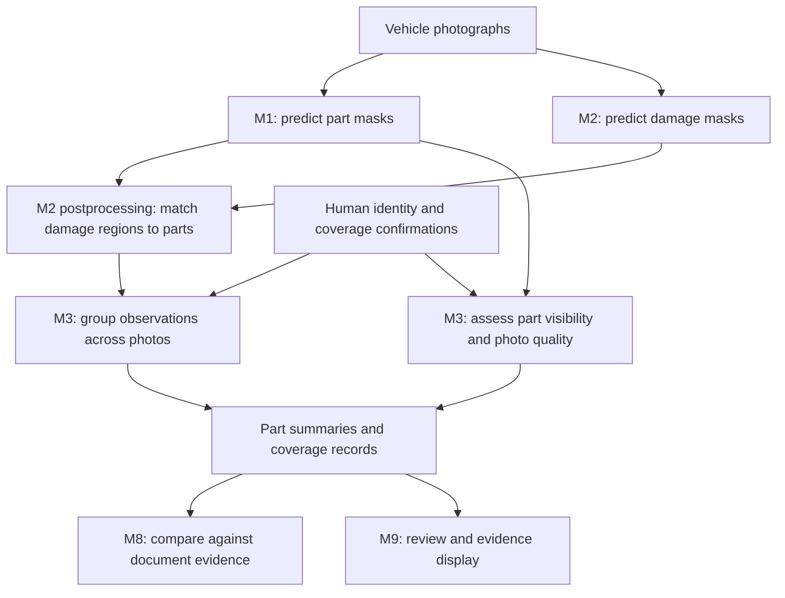
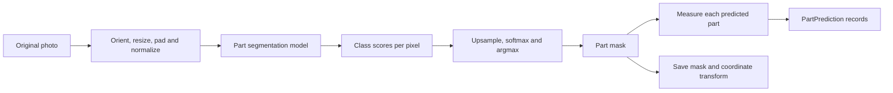
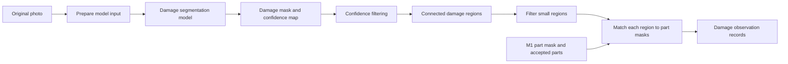
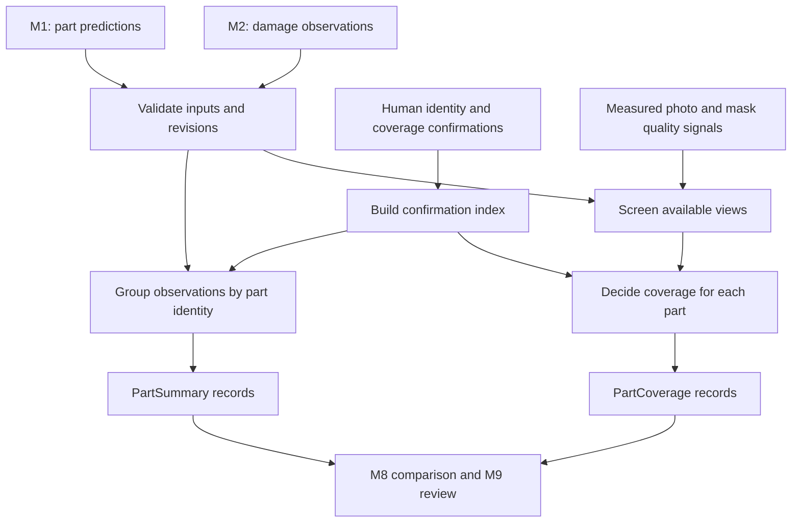

# Image Worker Workflow

Detailed drawings: [illustrated M1 → M2 → M3 workflow](vision-workflow-illustrated.md), including a zoomable viewer, tensor shapes and a two-photo summary example.

**M1 identifies the vehicle parts, M2 identifies damage and associates it with those parts, and M3 turns the individual photo observations into a claim-level summary with coverage information.** M3 uses deterministic rules; it has no trained model or neural weights.

The important workflow detail is that **the first combination of M1 and M2 happens inside M2’s postprocessing**. M3 receives the resulting damage-to-part observations, together with M1’s predictions.



The diagram shows the data dependencies. The specified orchestration runs M1, then the complete M2 stage, then M3.

1. **Each photograph produces two different masks.**

   M1 predicts a part label for each pixel: front door, fender, bumper, window, and so on. It also records each part’s confidence, pixel count, mask reference and whether the prediction passes acceptance thresholds.

   M2’s neural model processes the photograph and predicts damage labels per pixel, such as scratch or dent. Its neural input is the photograph; the M1 mask is used afterward for assignment.

   Both masks must refer to the **same photograph and aligned coordinate frame**. Rotation, resizing and padding therefore need recorded transforms. Matching a 512-pixel part mask directly against an unrelated 640-pixel damage grid would be invalid.

   The offline HITL notebooks use separate SegFormer-B2 models for the two tasks. Their training and damage vocabularies are documented in the [training guide](../training-hitl-notebooks.md).

2. **M2 converts damage pixels into observations and matches them to parts.**

   M2’s postprocessing filters low-confidence damage pixels, extracts connected regions of each damage class, and removes regions below the configured size threshold.

   For each surviving region, it measures how much falls inside each M1 part mask:

   \[
   \text{containment}(D,P)
   =\frac{\text{damage-region pixels inside part }P}
          {\text{all pixels in damage region }D}
   \]

   For example, suppose a scratch region contains 1,000 pixels:

   | M1 label underneath the scratch | Pixels | Containment |
   |---|---:|---:|
   | Front door | 850 | 85% |
   | Fender | 100 | 10% |
   | Background | 50 | 5% |

   This supports assigning the scratch to the front door, provided M1 accepted that part prediction.

   The current **proposed**, uncalibrated configuration requires at least 60% containment, a 20-percentage-point lead over the next part, and no more than 50% background. A 47% door / 44% fender split remains unresolved; the system retains both candidates.

   Each resulting `ImageDamageObservation` contains the photo, damage type and confidence, assigned part or uncertainty reason, candidate overlaps, area and mask references. **Side remains unknown**: neither mask establishes left versus right.

   See the [assignment implementation](../../src/claim_cmev/vision/damage/assignment.py) and [proposed thresholds](../../configs/pipeline/m2_assignment.yaml).

3. **M3 groups observations across all photographs in the claim revision.**

   M3 receives M2’s observations, M1’s part predictions, view-quality measurements, processing status and any human confirmations.

   It places each distinct observation into exactly one group:

   | Group status | Meaning |
   |---|---|
   | `resolved` | A human confirmation establishes the physical part and side, such as the left front door. |
   | `part_only` | The part category is known, such as front door, but physical identity remains uncertain. |
   | `unresolved` | M2 could not assign a part; the observation remains in its own group. |

   This distinction prevents two photographs labelled “front door” from automatically being treated as photographs of the same door. They could show opposite sides.

   A summary retains all member observation IDs, supporting photos and masks, the set of damage types, identity confirmations and reasons. The current implementation records the highest member damage confidence and uses the **largest single member’s area fraction** as its representative area.

   It does not add areas across views or infer a count of physical dents. Two scratch observations could be two views of the same scratch. The reported observation count describes model observations, not unique damage instances. See [grouping.py](../../src/claim_cmev/vision/multiview/grouping.py).

4. **M3 separately assesses whether each part has enough photographic coverage.**

   This is why M3 needs M1 predictions directly, even after M2 has used them. A part can be visible without any detected damage, and that still needs a coverage record.

   For each supported part, M3 considers accepted M1 views and screens:

   - Part size within the image.
   - Sharpness.
   - Lighting and clipped exposure.
   - Contact with the photo border, as a cropping signal.

   Missing measurements do not count as passes. These signals also cannot establish that an obstruction is absent or the whole panel is visible.

   M3 then assigns coverage using ordered rules:

   | Situation | Coverage |
   |---|---|
   | Relevant processing failed, or physical identity is unresolved | `unresolved` |
   | Identity resolved, processing succeeded, but no accepted part view exists | `not_visible` |
   | Views are insufficient, screening is incomplete, or coverage confirmation is missing/negative | `inadequate` |
   | Identity resolved, a confirmed view passes screening, and the human confirms sufficient coverage | `adequate` |

   **Passing automatic quality checks alone never produces adequate coverage.** The coverage confirmation must refer to suitable views of that particular part. See [coverage.py](../../src/claim_cmev/vision/multiview/coverage.py).

5. **Human review can update M3 without rerunning the models.**

   Consider this illustrative sequence:

   | Stage | Front-door summary | Coverage |
   |---|---|---|
   | Photo A and Photo B each contain an assigned scratch | Two observations; front door; side unknown | `unresolved` |
   | Surveyor confirms both photos show the left front door | Two observations grouped under left front door | `inadequate` until coverage is confirmed |
   | Surveyor confirms sufficient coverage, with a passing view | Same two observations and their evidence links | `adequate` |

   If the observations have area fractions of 0.9% and 1.2%, the representative value is 1.2%. It is an image-area measure—not the percentage of the physical door damaged.

   Identity or coverage confirmation creates a new input revision. M3 recomputes using retained M1/M2 outputs, preserves the previous results and records reuse lineage. Adding a new photograph requires new model processing. This reuse path is implemented in [review_summary.py](../../src/claim_cmev/orchestration/review_summary.py).

6. **M3 passes two complementary outputs downstream.**

   `PartSummary` answers: **“What damage observations do we have for this part, and where is the evidence?”**

   `PartCoverage` answers: **“Have we established which physical part this is, and are the available views sufficient to judge it?”**

   M8 uses both when comparing photographic evidence with document line items. An empty damage summary alone cannot justify an unsupported-repair finding. M8 must also apply the identity, coverage and damage-confidence rules. M9 presents the summaries, evidence and review actions.

**In the current repository**, the M2 assignment logic and M3 grouping, screening and coverage logic exist. M1 also has an inference adapter, which is newer than some handoff statements. However, the application orchestration remains fixture-based; the trained M1/M2 checkpoints are not established as an integrated end-to-end M1 → M2 → M3 workflow. The HITL M2 experiment also uses a different damage vocabulary from the serving contract, so its outputs require explicit integration work. The workflow above describes the intended model integration and the deterministic logic already present in code.

## M1 Workflow
**Each module contains three stages: prepare the photograph → run its segmentation model → convert pixel predictions into structured evidence.** The neural model produces numerical pixel predictions; the module adds filtering, identifiers, geometry, provenance and—in M2—damage-to-part matching.

I’m describing inference on uploaded photographs. Training happens separately.

| | M1: vehicle parts | M2: damage |
|---|---|---|
| Neural model input | Vehicle photograph | The same vehicle photograph |
| Neural model output | Scores for each part class at each pixel | Scores for each damage class at each pixel |
| Module postprocessing | Create part mask and accepted/rejected part records | Create damage regions and associate them with M1 parts |
| Module output | `PartPrediction` records, part mask, transform and quality record | `ImageDamageObservation` records, damage mask and component mask |

M1’s mask enters **M2’s postprocessing**, not the damage neural network itself.

**M1 workflow: photograph → vehicle-part evidence**



1. **Read and prepare the photograph.**

   The worker retrieves the original photo using its storage reference and verifies its recorded hash. It decodes the photo into RGB and applies EXIF orientation so a portrait image is processed upright.

   It then resizes the photo while preserving its proportions and pads it to the configured square input size. For example, a 1200 × 800 photo fitted into a 512 × 512 frame becomes approximately 512 × 341, with black padding filling the remaining space below it: the photo sits top-left (`longest_edge_pad`). The worker refuses a checkpoint whose `preprocessing.json` records another frame.

   Pixel values are converted to floating point, scaled and normalized. The resulting input tensor has shape:

   ```text
   [batch size, 3 RGB channels, input height, input width]
   ```

   The original photo is preserved. The module records the resize, orientation and padding information so predictions can later be displayed over the original.

2. **Run the part segmentation model.**

   In the SegFormer model, the encoder extracts visual features and the segmentation decoder converts them into spatial class scores.

   M1 has **22 output classes: 21 vehicle-part categories plus background**. The raw output is a tensor of *logits*, meaning unnormalized scores:

   ```text
   [batch size, 22 classes, output height, output width]
   ```

   At each output location, there is a score for front door, fender, hood, background, and every other class. The model has not yet produced a database record or a coloured overlay.

3. **Convert scores into a part mask.**

   The adapter upsamples the scores to the model input frame, applies softmax to obtain class probabilities, and chooses the highest-scoring class at each pixel.

   This produces:

   - A **class-index mask**: a two-dimensional array containing one part-class ID per pixel.
   - Class probabilities used to calculate confidence.

   A coloured mask is a visualization of these IDs. The underlying result is a label array.

   This is **semantic segmentation**: it labels part categories. It does not assign separate physical identities to two doors appearing in one image, and it does not resolve left/right.

4. **Create a record for each predicted part class.**

   For every non-background class present in the mask, the adapter calculates:

   - The number of pixels assigned to that part.
   - The mean probability for that class over its assigned pixels.
   - Whether both the size and confidence thresholds pass.

   The existing configuration uses 512 pixels and mean confidence 0.50 as acceptance thresholds. These are configuration values, not demonstrated accuracy guarantees.

   Weak predictions remain in the records with `accepted = false`; they are not silently removed from the evidence.

5. **Save the module output.**

   M1’s output package is:

   | Output | Contents and purpose |
   |---|---|
   | Part mask PNG | One part-class ID per pixel; M2 uses it for overlap calculations. |
   | `PartPrediction` records | Photo ID, part code, `side = unknown`, pixel count, mean confidence, acceptance flag and mask reference. |
   | `ImageTransform` | Maps the model frame back to the original photograph. |
   | `ImageQuality` | Photo-level screening information. The current adapter only performs a basic resolution check. |
   | Completion event | References the artifacts and records so orchestration can advance to M2. |

   Claim/input revision, model/configuration versions and provenance accompany the records. The current implementation is `run_parts_segmentation` in [parts/adapter.py](../../src/claim_cmev/vision/parts/adapter.py#L309).

## M2 Workflow
**M2 workflow: photograph → damage evidence associated with parts**



1. **Receive the photograph and its matching M1 evidence.**

   The complete M2 module needs:

   - The photo.
   - M1’s part mask and accepted part list.
   - The coordinate transform.
   - Matching claim, photo, revision and model-version references.

   The damage model processes the photo. The part mask is retained for the later matching step.

   Both output masks must ultimately share an aligned pixel grid. The existing assignment function rejects mismatched grids; it does not automatically repair them.

2. **Run the damage segmentation model.**

   Its numerical output has the same general structure as M1:

   ```text
   [batch size, damage classes including background, output height, output width]
   ```

   The number and meaning of channels depend on the checkpoint:

   | M2 variant | Output classes |
   |---|---|
   | CarDD, used by the serving contract | Six damage classes plus background: 7 channels |
   | HITL notebook experiment | Eight damage classes plus background: 9 channels |

   These vocabularies differ and cannot be interchanged merely by changing class IDs.

   Postprocessing brings the scores to the required frame and derives a **damage-class mask** plus a **per-pixel confidence map**. The confidence map matters: the assignment pipeline needs more than a coloured prediction image.

3. **Remove low-confidence damage pixels.**

   Pixels whose damage confidence falls below the configured threshold become background for region extraction. Their number is recorded.

   The current proposed threshold is 0.50. If a validation-selected background-logit adjustment from the notebooks is adopted for serving, that adjustment also needs to be pinned explicitly in the inference configuration.

4. **Turn damage pixels into connected regions.**

   The code processes each damage class separately and groups adjacent pixels into connected components.

   For example:

   ```text
   Scratch pixels in one connected patch → scratch region 1
   Separate scratch patch               → scratch region 2
   Connected dent patch                 → dent region 3
   ```

   Current proposed settings use eight-neighbour connectivity, discard components smaller than 256 pixels, and retain at most 50 components per photo, keeping the largest when the cap is exceeded.

   Each surviving region gets an ID, damage class, pixel count, average confidence and bounding box. Counts of filtered pixels/regions are also retained.

   A connected region is an image observation; it does not establish a unique physical damage instance. See [regions.py](../../src/claim_cmev/vision/damage/regions.py#L71).

5. **Associate each region with an M1 part.**

   For each damage region, M2 measures the fraction of its pixels lying inside each part mask:

   ```text
   Damage pixels inside the part / total pixels in the damage region
   ```

   It ranks the candidate parts, then checks the leading containment, separation from the runner-up, background overlap and M1 acceptance.

   For example:

   | Region | Door overlap | Fender overlap | Background | Result |
   |---|---:|---:|---:|---|
   | Scratch A | 85% | 10% | 5% | Can be assigned to front door |
   | Dent B | 47% | 44% | 9% | Unresolved: ambiguous between parts |

   An unresolved region remains available with its candidate scores and reason. A region crossing a panel boundary is not automatically split. Side remains `unknown`.

   This is the work performed by the file you have open: [assignment.py](../../src/claim_cmev/vision/damage/assignment.py#L280).

6. **Produce M2’s module output.**

   | Output | Contents and purpose |
   |---|---|
   | Damage-class mask | Identifies the damage class at each pixel. |
   | Component mask | Identifies individual retained regions, allowing the evidence viewer to highlight one observation. |
   | `ImageDamageObservation` records | One record per surviving region, including unresolved regions. |
   | Processing metadata | Filtering counts, reasons and processing status. |
   | Completion event | References the resulting evidence for M3. |

   Each observation records the damage type/confidence, assigned part or uncertainty reason, ranked candidates, overlap scores, pixel area, area fraction with its denominator, original-photo normalized bounding box, mask references and versions.

   Area is an image measurement. It does not directly describe physical size, severity or repair cost. Likewise, zero retained damage regions does not establish that the vehicle is undamaged.

## M3 Workflow
**M3 turns the per-photo results from M1 and M2 into two outputs: a summary of damage evidence for each part, and a separate assessment of whether that part has sufficient photographic coverage.**

It runs deterministic Python rules. There is no additional neural model, training or LLM inside M3.



The main entry point is [`summarise_parts()`](../../src/claim_cmev/vision/multiview/summary.py#L72). Its workflow is as follows.

**1. Gather and validate the evidence**

M3 receives:

| Input | Why M3 needs it |
|---|---|
| M1 `PartPrediction` records | Identify which part categories appear in each photo, including parts with no detected damage. |
| M2 `ImageDamageObservation` records | Supply damage type, assigned part or uncertainty, confidence, area and evidence references. |
| Identity confirmations | Establish which physical part a photo shows—for example, the left front door. |
| Coverage confirmations | Record whether the surveyor considers the specified views sufficient to judge that part. |
| View-quality measurements | Supply sharpness, lighting and cropping information. |
| Processing status and failed photo IDs | Prevent failed inference from being interpreted as absent damage. |

It checks claim identity, permitted input revisions, required version information and provenance. Reused evidence must identify its earlier revision; fixture-derived results retain fixture provenance.

**2. Establish which human confirmations apply**

M3 builds an index so it can answer two different questions:

- **Identity:** “Which side of this part does this photo show?”
- **Coverage:** “Do these photos show enough of that physical part to assess it?”

These are separate decisions. Knowing a photo shows the left door does not establish that the entire relevant area is visible.

Later corrections can supersede earlier confirmations while retaining their history. Conflicting sides stated together leave the identity unresolved.

**3. Group the damage observations**

This is the responsibility of [`grouping.py`](../../src/claim_cmev/vision/multiview/grouping.py#L41).

For each M2 observation, M3 chooses a grouping key:

| Available identity | Group |
|---|---|
| Part and side established through confirmation | `resolved`, grouped by `(part_code, side)` |
| Part category assigned, but physical identity unconfirmed | `part_only`, grouped by `(part_code, unknown)` |
| M2 could not assign a part | `unresolved`, one group for that observation |

For example:

```text
Photo A: scratch assigned to front-door
Photo B: scratch assigned to front-door
Photo C: dent with ambiguous door/fender assignment
```

Before human confirmation, M3 produces:

```text
Group 1: front-door, side unknown
         Members: observations from A and B
         Status: part_only

Group 2: part unknown
         Member: observation from C
         Status: unresolved
```

The first group means both observations concern the **front-door category**. It does not establish that they show the same physical door.

If the surveyor confirms A shows the left front door and B shows the right front door, M3 separates them into two resolved groups. The ambiguous observation from C remains unresolved; M3 does not guess its part.

Identical redeliveries of the same observation ID are deduplicated. Distinct observations from different photos remain separate members.

**4. Compute a compact summary for each group**

Each `PartSummary` includes:

- Part, side and identity status.
- Every member observation ID.
- Supporting photo IDs and mask references.
- The set of observed damage types.
- Observation count.
- Representative area and its source observation.
- Highest member damage confidence.
- Confirmation references, reasons and versions.

Suppose two scratch observations have these values:

| Observation | Area fraction of its model frame | Confidence |
|---|---:|---:|
| A | 0.009 | 0.82 |
| B | 0.012 | 0.76 |

The summary stores:

```text
observation_count: 2
damage_codes: [scratch]
representative_area_fraction: 0.012
representative_observation_id: B
max_confidence: 0.82
```

The area and confidence can come from different observations. They are descriptive summaries, not a newly calculated probability that the whole group is correct.

**Areas are never added across photographs.** M3 also does not decide whether these are two views of one scratch or two separate scratches. Its observation count is not a physical damage count.

**5. Build coverage records independently of damage groups**

M3 creates coverage entries for supported parts and parts appearing in the evidence or confirmations.

This matters because a photo might show a fender clearly while M2 detects no damage. There may be no damage summary for that fender, but M3 still needs to describe its coverage.

For each part/side entry, M3 selects accepted M1 predictions from the relevant photos. A resolved left-door entry only uses photos confirmed to show that left door. Unconfirmed views remain associated with unknown identity.

It then screens each view:

| Signal | What it measures |
|---|---|
| Part area | How much of the model frame is occupied by the predicted part |
| Sharpness | Whether the part crop is sufficiently sharp |
| Lighting | Brightness and clipped exposure inside the part mask |
| Border contact | Whether the part mask appears cropped at the photograph boundary |

The [`screening.py`](../../src/claim_cmev/vision/multiview/screening.py#L40) helper can calculate these measurements from aligned images and masks. The main `summarise_parts()` function consumes supplied measurements and does not itself load images or model weights.

Each view receives `pass`, `fail` or `not_run`. Missing measurements never count as a pass. Screening thresholds still require real-photo calibration.

**6. Decide the coverage state**

The rules in [`coverage.py`](../../src/claim_cmev/vision/multiview/coverage.py#L87) run in order; the first matching rule determines the result.

| Condition | Coverage state |
|---|---|
| Relevant processing failed | `unresolved` |
| Physical identity remains unknown | `unresolved` |
| Identity resolved, but no accepted part view exists | `not_visible` |
| No view passes screening | `inadequate` |
| Coverage confirmation is missing or says the views are insufficient | `inadequate` |
| Confirmation does not name any passing view of that part | `inadequate` |
| Identity resolved, suitable view passes, and coverage is confirmed | `adequate` |

**A sharp photograph alone cannot establish adequate coverage.** It could show only a small section of the panel or leave an obstruction outside the measured region.

Likewise, `adequate` describes the available evidence. It does not mean the part is undamaged or that a repair is justified.

**7. Return the results and support reassessment**

M3 returns the summary records, coverage records, unresolved observation IDs, coverage-state counts and confirmation/reuse lineage.

When a surveyor supplies an identity or coverage confirmation, the system creates a new input revision and reruns M3 using retained M1/M2 results. The original records remain available. If photographs change, new model processing is required.

M8 then uses these outputs to assess document claims. **M3 establishes what photographic evidence exists and whether it can be judged; M8 applies the repair-comparison rules.**

The deterministic M3 core is implemented. Its confirmation-driven reuse path is connected to the fixture-backed application, while integration with live M1/M2 inference remains separate work.
