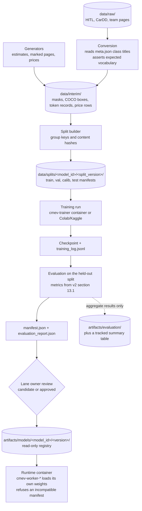

# Model training specification

Status: proposed implementation baseline. Not implemented, not measured. Aligned to [proposal v2](../CLAIM-CMEV_project_proposal_v2.md) sections 9.4, 9.5, 10, 11, 12.3, 12.4 and 13. Owners: Lane 1 (vision models), Lane 2 (document extraction), Lane 3 (mark synthesis and detector), Lane 4 (cost references), Lane 5 (registry contract and serving handover). Written 2026-09-22 against branch `project-structure`, HEAD `0c5ed2e`.

This document is the offline counterpart to the online runtime. It says what is trained, on what data, with what recipe, and what files a run must produce. Every numeric recipe value below is **proposed** until a lane owner records a validation result. Targets quoted from the proposal are hypotheses, not results.

Related documents: [technical specification](technical_specification.md), [integration contracts](integration_contracts.md), [data contracts](data_contracts.md), [evaluation plan](evaluation_plan.md), [dataset downloads](../dataset-downloads.md), [pipelines README](../../pipelines/README.md), [artifacts README](../../artifacts/README.md).

---

## 1. Scope and principle

| Rule | Statement |
| --- | --- |
| Offline only | All training runs on Colab, Kaggle or a team GPU. No training, fine-tuning or threshold fitting happens while a claim is processed |
| No request-time learning | A claim never triggers a training job. Workers load fixed weights at container start and keep them for the container lifetime |
| Evaluated artifacts only | A model reaches the registry with a manifest and an evaluation report. An unevaluated checkpoint cannot be marked `approved` |
| Fixtures are not results | Fixture records are marked as fixtures in every row. A fixture output can never be reported as a model result, a metric, or a demonstration of the real-model criterion (v2 section 12.4) |
| Null carries a reason | Any absent metric, absent range or absent label records why it is absent. An absent value is never written as zero |
| Versions travel with results | Every produced row stores the model or rule version that produced it. A new model version never rewrites an existing assessment (v2 section 9.4) |

### 1.1 No language model in the decision path

No large language model sits in the decision path. Part-and-damage integration is deterministic mask overlap in [M2](module-02-damage-segmentation.md). Vision-and-document integration is the deterministic rule set in [M8](module-08-consolidation-checks.md). An optional stretch service `cmev-explainer` may turn an already-computed finding into a readable sentence; it is off by default and never changes a result. Nothing in this training specification trains, fine-tunes or aligns a language model.

### 1.2 Relationship to the containerised runtime

The user has directed a runtime where each module is its own container and Kafka is the main transport between modules. That change does not alter any training recipe. It alters one thing only: how a trained artifact reaches the runtime. Each module worker container loads its own weights from a read-only model registry mount. The canonical container names are `cmev-web`, `cmev-api`, `cmev-orchestrator`, `cmev-worker-parts` (M1), `cmev-worker-damage` (M2), `cmev-worker-summary` (M3), `cmev-worker-ocr` (M4), `cmev-worker-lineitems` (M5), `cmev-worker-penmarks` (M6), `cmev-consolidator` (M8), `cmev-kafka` (Redpanda), `cmev-db` (PostgreSQL 16) and `cmev-objectstore` (MinIO).

All v2 domain rules stay unchanged: the decision rules in section 8, the records in section 9.3, module scope in section 10, datasets in section 11 and evaluation in section 13.

---

## 2. Verified dataset facts on disk, checked 2026-09-22

These are current repository observations on branch `project-structure`, not settled decisions. Re-check them before any conversion run.

### 2.1 The HITL folder names are swapped

**The folder names do not match their contents. A training script that trusts the folder name will train the wrong model.**

| Folder on disk | What it actually contains | Class count | Images | Annotation files |
| --- | --- | --- | --- | --- |
| `data/raw/Car damages dataset/` | **Part polygons** | 21 part classes | 998 | 998 |
| `data/raw/Car parts dataset/` | **Damage polygons** | 8 damage classes | 814 | 814 |

Confirmed from `meta.json` class titles and from `classTitle` values inside the per-image annotation JSON, not from folder names alone.

Part class titles in `data/raw/Car damages dataset/meta.json`, with the object count observed across all 998 annotation files: Back-window 1237, Mirror 987, Front-window 951, Fender 935, Front-door 917, Headlight 914, Front-wheel 885, Back-wheel 865, Rocker-panel 860, Quarter-panel 855, Roof 793, Tail-light 721, Back-door 721, Hood 712, Front-bumper 705, Windshield 632, Grille 577, Back-bumper 443, Trunk 416, License-plate 370, Back-windshield 271.

Damage class titles in `data/raw/Car parts dataset/meta.json`, with observed object counts across all 814 annotation files: Scratch 3242, Dent 1664, Broken part 1500, Paint chip 1356, Missing part 632, Flaking 337, Corrosion 277, Cracked 76.

Both subsets are heavily imbalanced. `Cracked` has 76 objects and `Corrosion` has 277. Record these counts in the split manifest so a per-class IoU is read against its support.

### 2.2 Both subsets share one filename prefix

Every image in both folders is named `Car damages <n>.<ext>`. For example `Car damages 101.png` exists in both folders. This is why the swap is easy to miss. The filename prefix is not a usable signal for which task a file belongs to.

Observed extensions: parts subset 899 `.png` and 99 `.jpg`; damage subset 731 `.png`, 82 `.jpg` and 1 `.jpeg`. The converter must not assume a single extension. Image sizes vary; 647 distinct height by width pairs were observed across the parts subset, with a common cluster near 600 by 797. No annotation file in either subset has zero objects.

### 2.3 441 images are labelled for both tasks

441 filenames appear in both subsets. A sampled pair is byte-identical: `Car damages 101.png` has SHA-256 `5691ef5aabc07572118814334103e4706f9133c73c76997e0c5c5412b95a9f5c` in both folders. All 441 have at least one part polygon in one subset and at least one damage polygon in the other. None of the 441 is empty on either side.

**This may reduce hand-labelling work planned in v2 section 11.5.** Section 11.5 plans a 30 to 50 photograph damage-to-part assignment sample, because separate segmentation datasets do not establish assignment quality. These 441 images already carry ground-truth damage polygons and ground-truth part polygons on the same photograph, so the geometric assignment rule can be scored without new annotation.

Recommended action for Lane 1: inspect a sample of the 441, then decide whether this reduces or replaces the planned annotation task. **Do not treat the annotation task as cancelled.** It is the team's call and the sample still needs inspection.

Limits of this jointly labelled set, which must be stated wherever it is used:

| Limit | Consequence |
| --- | --- |
| HITL part labels carry no left or right side | This set cannot score side resolution. The v2 side rules in section 8.1 are unaffected and still require recorded human identity confirmation |
| The damage vocabulary here is HITL's 8 classes, not CarDD's 6 | The check measures the geometric assignment rule, not CarDD class performance |
| Anything needing side identity or CarDD categories | Still needs team-labelled data from v2 section 11.5 |

### 2.4 Required leakage rule from the overlap

Because 441 images sit in both subsets, an image used to train M1 can reappear in an M2 assignment evaluation set. **Split manifests must be built over the union of both subsets with a shared grouping key, proposed as the image SHA-256, not independently per subset.** See section 6.3.

### 2.5 Required conversion rule from the swap

The converter must read class titles from each subset's `meta.json`, assert the expected vocabulary, and fail loudly if it sees part class titles where damage classes were expected. Trusting the folder name will silently train the wrong model. See section 7.1.

### 2.6 Other data present and absent

| Path | Observed | Status for v2 core |
| --- | --- | --- |
| `data/raw/Car damages dataset/` | Supervisely format: `File1/ann` polygon JSON, `File1/img`, `File1/masks_human`, `File1/masks_machine`, 998 files each | **Core M1 training source**, after conversion |
| `data/raw/Car parts dataset/` | Same structure, 814 files each | **Contingency M2 source only** (v2 section 12.4), plus the joint-label source in section 2.3 |
| `data/raw/Car-Parts-Segmentation` | DSMLR, 536 files, 23 directories, `trainingset/` and `testset/` with `annotations.json` and `JPEGImages` | Outside v2 core scope (v2 section 11.7). Do not train on it |
| `data/raw/carparts-seg` | Ultralytics, 7667 files, `images/` and `labels/` split into train, val and test | Outside v2 core scope (v2 section 11.7). Do not train on it |
| CarDD | **Not present on disk.** Consent unconfirmed | Blocks M2 core training. See section 13.1 |
| CORD v2 | Not present | Stretch S1 only |
| Team-marked pages, assignment sample, vehicle groups | Not present | Must be collected. See section 8 |
| `scripts/download_datasets.py` | Present, 23 offline tests | Acquisition entrypoint. See [dataset downloads](../dataset-downloads.md) and [`data/manifests/dataset_sources.json`](../../data/manifests/dataset_sources.json) |

The repository is a scaffold. There is no application code, no dependency manifest and no trained model on disk.

---

## 3. What is trained and what is not

| v2 module | Component | Trained in core plan | Method | Registry entry | Lane | Gate |
| --- | --- | --- | --- | --- | --- | --- |
| M1 | Vehicle part segmentation | **Yes, fine-tune** | SegFormer-B0, 21 HITL part classes plus background | `parts/<version>` | 1 | HITL parts on disk, confirmed |
| M2 | Damage segmentation | **Yes, fine-tune** | SegFormer-B0, 6 CarDD damage categories | `damage/<version>` | 1 | **Blocked on CarDD consent and files** |
| M2 | Damage-to-part assignment | No weights | Deterministic mask overlap with validation-selected thresholds | Rule configuration version | 1 | None |
| M3 | Part summary and coverage | No weights | Versioned rules and configuration only | Rule configuration version | 1 | None |
| M4 | Page reading | No | PaddleOCR, pretrained, pinned version, no project training | Pinned pretrained weights, no registry entry | 2 | Version pinned by day 2 |
| M5 | Line-item extraction | No weights in core | Deterministic parser over 2 to 3 layout families | Parser code and configuration version | 2 | None |
| M6 | Pen-mark recognition | **Yes, fine-tune** | Faster R-CNN ResNet-50 FPN, COCO-pretrained, 2 mark classes | `penmarks/<version>` | 3 | Marked-page generator and team pages |
| M7 | Reference cost ranges | **Yes, fit offline** | LightGBM quantile pair plus empirical percentile baseline | `artifacts/cost_tables/<version>/`, **never served as a model** | 4 | Price generator |
| M8 | Consolidation and checks | No weights | Deterministic rules in v2 section 8 | Rule configuration version | 4 | None |
| M9 | Review overview and report | No weights | Application code | None | 5 | None |

**Four models are trained or fine-tuned in the core plan: M1, M2, the M6 detector and M7.** OCR is pretrained and pinned. M3, M5 and M8 are rules with configuration versions, not weights.

Stretch models, gated at the day-5 checkpoint in v2 section 12.3, and never a core dependency:

| Stretch | Component | Method | Registry entry | Lane |
| --- | --- | --- | --- | --- |
| S1 | LayoutLMv3 line-item extraction | CORD adaptation, then fine-tune on generated estimates | `lineitems/<version>` | 2 |
| S2 | TrOCR amount suggestion | Pinned pretrained `trocr-base-handwritten`, no fine-tuning committed | Pinned pretrained weights | 3 |
| S3 | Approval and cost-reference refresh | Scripted build, no new model | New cost table version | 4 |

Record the exact checkpoint and dependency licence in every manifest. The selected SegFormer and LayoutLMv3 checkpoints carry research or non-commercial restrictions (v2 section 11.1). Dataset access and model licensing are separate considerations.

---

## 4. The parser question: rule-based parser or LayoutLMv3

The user asked whether to build the rule-based parser instead of a full LayoutLMv3 model.

**Recommendation: build the rule-based parser as the committed path. Treat LayoutLMv3 as stretch S1 behind the day-5 gate.** This agrees with v2 sections 10 (M5), 11.1 and 12.3.

### 4.1 Honest comparison

| Dimension | Rule-based parser (committed) | LayoutLMv3 (stretch S1) |
| --- | --- | --- |
| Label alignment cost | None. Rules consume OCR boxes directly | High. OCR tokens and boxes must be aligned to ground-truth fields and rows. Ambiguous, merged or missing tokens must be masked or flagged, never guessed. v2 section 12.3 step 2 makes reliable alignment a prerequisite, not an assumed OCR feature |
| CORD preparation cost | None | Acquire CORD v2, record licence and version, preserve publisher splits, convert text, boxes and item fields. CORD has no repair-operation supervision, so OPERATION must still come from generated estimates in stage 2 |
| GPU time | None | Two training stages, plus bounded checkpoint selection on validation. **Proposed** 1 to 2 hours per stage on one T4-class GPU, excluding failed runs |
| Evaluation burden | One set of M5 metrics | The same M5 metrics on the same frozen test cases, plus a separate supported-family and unseen-family breakdown, plus an optional direct-generated-data baseline to isolate whether CORD caused any improvement |
| Versioning | A code and configuration version. A diff shows exactly what changed | A weights version plus an alignment version plus a preprocessing version. A behaviour change needs a retrained checkpoint to reproduce |
| Explainability inside the decision rules | Every field carries the rule that produced it. M8 can state why a row was uncertain | Field labels carry a confidence, not a reason. Explaining a withheld row inside v2 section 8.1 needs extra work |
| Debuggability | A wrong row is traced to a header alias or a column rule and fixed in minutes | A wrong row needs error analysis, possibly relabelling, and a retrain |
| Day-4 checkpoint risk | Low. Rules can produce real output early | High. Nothing usable exists until alignment works |

### 4.2 What the team gives up

The honest cost of skipping LayoutLMv3 is **generalisation to unseen layouts**. A rule set tuned on 2 to 3 documented layout families will not read an arbitrary workshop document it has never seen. A learned model has a better chance on an unseen layout, although v2 makes no measured claim about that.

### 4.3 How the parser handles that instead

The parser does not pretend to generalise. It makes the gap visible and routes it to a human:

| Situation | Parser behaviour (v2 sections 10 M5 and 8.2) |
| --- | --- |
| Header aliases do not match a supported family | Mark the page as an unsupported layout. Do not emit guessed rows |
| Columns are ambiguous | Emit the row with field uncertainty on the affected fields. Keep the original text and page boxes |
| A value is obscured or unreadable | Leave the field null with a reason. Never substitute zero |
| No rows found | Declaration completeness is `partial` or `unreadable`, never `explicitly_empty`. Only the surveyor can confirm an empty scope |
| Any of the above | The original photographed page stays available, and the surveyor corrects the row in the review UI. A correction creates a new input revision under v2 section 8.4 |

Evaluation reports supported-family performance separately from unseen-family performance (v2 sections 11.3 and 13.1). A known layout family is not evidence of performance on arbitrary workshop documents.

### 4.4 Gate condition for starting S1

Start S1 only when all of the following are recorded at the day-5 checkpoint: the core workflow runs end to end with real outputs, module validation results exist, final test inputs are frozen, and the owner records an effort allowance that fits unused implementation capacity. The five contingency person-days and ten report person-days are protected and cannot fund S1. If S1 cannot fit, describe its design and leave it unimplemented.

---

## 5. Offline training architecture

### 5.1 Flow

Only the final arrow touches the serving runtime. The training path never writes to `cmev-db`, never publishes to `cmev-kafka` and never runs inside a serving container.

### 5.2 Pipeline directory layout

The existing scaffold already reserves these directories. See [`pipelines/README.md`](../../pipelines/README.md).

| Path | Owner | Contents (**proposed**) |
| --- | --- | --- |
| `pipelines/vision/convert_hitl.py` | Lane 1 | Supervisely polygon JSON to indexed semantic masks. Reads `meta.json` class titles. Emits a conversion report |
| `pipelines/vision/convert_cardd.py` | Lane 1 | CarDD instance annotations to semantic masks, with a recorded overlap and background policy |
| `pipelines/vision/build_splits.py` | Lane 1 | Group-aware split manifests over the union of HITL subsets, keyed on image SHA-256 |
| `pipelines/vision/train_segformer.py` | Lane 1 | Shared training entrypoint for M1 and M2. One config file selects the task, class list and split |
| `pipelines/vision/eval_segmentation.py` | Lane 1 | mIoU, per-class IoU, per-class support, confusion counts |
| `pipelines/vision/eval_assignment.py` | Lane 1 | Damage-to-part assignment scoring on jointly labelled images. Threshold sweep on validation only |
| `pipelines/documents/generate_estimates.py` | Lane 3 | Estimate generator, section 9.1 |
| `pipelines/documents/generate_marked_pages.py` | Lane 3 | Marked-page generator, section 9.2 |
| `pipelines/documents/convert_marks.py`, `train_penmarks.py`, `eval_penmarks.py` | Lane 3 | Marked-page labels to detection boxes; Faster R-CNN fine-tune; detection and row-linking precision and recall by writer and template |
| `pipelines/documents/prepare_cord.py`, `train_layoutlmv3.py` | Lane 2 | **Stretch S1 only.** CORD preparation, OCR token alignment, two-stage training |
| `pipelines/costs/generate_prices.py` | Lane 4 | Price generator, section 9.3 |
| `pipelines/costs/build_cost_table.py`, `eval_cost_table.py` | Lane 4 | Empirical percentiles and LightGBM quantiles, support counts, table publication; coverage, width, withholding rate, RQ4 subsets |

Every entrypoint takes a versioned config file plus explicit input and output locations. Every entrypoint records source hashes, split hashes, code revision, seeds and metrics. No entrypoint may read from or write to the runtime database.

### 5.3 The `cmev-trainer` container

**Proposed.** Build one training image, separate from every serving image.

| Property | Value (**proposed**) |
| --- | --- |
| Image name | `cmev-trainer` |
| Base | CUDA runtime image matching the pinned PyTorch build; a CPU-only tag for the price pipeline and for smoke runs |
| Dependencies | `requirements-train.txt`, pinned and separate from each worker's runtime requirements |
| Compose profile | `training` only. **Never** listed in the `core` or `full` serving profiles |
| Invocation | Manual, one run at a time, for example `docker compose --profile training run --rm cmev-trainer python -m pipelines.vision.train_segformer --config configs/models/parts_v1.yaml` |
| Mounts | `data/` read-only, `configs/` read-only, `artifacts/` read-write, plus a scratch cache volume |
| Network | No connection to `cmev-kafka` or `cmev-db`. It does not join the application network |
| GPU | `--gpus all` where a local GPU exists. A run without a GPU must fail with a clear message rather than silently running for hours on CPU |
| Not included | No scheduler, no retry loop, no API. A failed run is re-run by a person |

Colab and Kaggle use the same pipeline modules and the same pinned `requirements-train.txt`. The notebook is a thin driver: clone the repository, install pinned dependencies, mount data, call the same entrypoint, copy the artifact folder back. A notebook must not contain its own copy of the training loop. Keep notebooks under `notebooks/` and the logic in `pipelines/`.

### 5.4 How an artifact reaches a worker

1. A training run writes a complete artifact folder to `artifacts/models/<model_id>/<version>/`.
2. The lane owner reviews the evaluation report and sets `status` to `candidate` or `approved` in the manifest.
3. The deployment configuration pins the exact `<model_id>/<version>` per worker container.
4. Each worker container mounts `artifacts/models/` read-only and loads only its own pinned entry at start.
5. The worker validates the manifest against its expected contract. On a mismatch it refuses to start (section 12).

A worker never downloads weights at request time, never writes to the registry, and never overwrites an existing version. Publishing a new version does not change any existing assessment; a reassessment under v2 section 8.4 creates a new revision.

---

## 6. Split and leakage policy

The rules come from v2 section 11.8. Reserve final-test membership before fitting any model, tuning any parser rule or selecting any threshold, ideally by day 2. Freezing release versions later is not permission to choose test examples after seeing results.

### 6.1 Partitions

| Partition | Used for | Rule |
| --- | --- | --- |
| `train` | Fitting weights and fitting the empirical or LightGBM cost models | Never used to select a threshold |
| `val` | Selecting thresholds, checkpoints, support minimums and serving method | Never used to fit weights |
| `calib` | Conformal adjustment for M7, only if that method is selected | A separate partition. Never refit on the test set |
| `test` | Final reported metrics | Touched once, after all versions and thresholds are frozen |

### 6.2 Split manifest format

**Proposed** path `data/splits/<model_id>/<split_version>/{train,val,calib,test}.jsonl`, one record per example:

| Field | Meaning |
| --- | --- |
| `example_id` | Stable identifier within the dataset |
| `source_path` | Path relative to `data/` |
| `content_sha256` | Hash of the image, page or price record |
| `group_key` | The value that must not cross a partition boundary. See 6.3 |
| `label_ref` | Path to the converted label |
| `class_counts` | Per-class object or pixel counts for reporting support |
| `provenance` | `real`, `synthetic` or `team_collected` |

Alongside them, `split_manifest.json` records the split version, the seed, the ratios, the grouping key definition, the per-partition counts, the per-class counts and the SHA-256 of each `.jsonl` file. Training runs record these hashes. A training run whose split hashes do not match its manifest is invalid.

### 6.3 Grouping keys per dataset

| Dataset | Group key | Reason |
| --- | --- | --- |
| **HITL parts and HITL damage** | **Image `content_sha256`, computed over the union of both subsets** | 441 images appear in both subsets (section 2.3). Splitting the subsets independently would put the same photograph in an M1 training partition and an M2 or assignment evaluation partition |
| CarDD | Publisher split where available, then vehicle or source identifier where one exists | Publisher partitions come first. Disclose missing group metadata rather than assuming independence |
| Jointly labelled assignment set | Same image `content_sha256` as above | Final assignment examples must stay out of both segmentation training sets |
| Team vehicle groups | Vehicle identifier | All views of one vehicle stay in one partition |
| Generated estimates | Generated base page identifier plus template family | Related template variants must not straddle a boundary |
| Generated marked pages | The base page identifier of the estimate they were drawn on | A synthetic mark inherits its base page group |
| Team-marked real pages | Writer identifier and physical page identifier | Every photograph or augmentation of a physical page stays in its group. Assign writer and template groups before collection |
| CORD (S1 only) | Publisher splits | Preserve them |
| Generated prices | Base-case identifier | Every quote from one base case stays together. Repeated quotes cannot inflate independent support |

### 6.4 Additional leakage checks

- Run a near-duplicate check across HITL and any additional source before training. Image hashes alone do not exclude related-view leakage.
- Human corrections used for the final workflow demonstration must not enter model training or threshold selection (v2 section 11.5).
- The parser must not be retuned on final test pages.
- For prices, keep documented cutoffs between partitions and keep ordinary and injected-anomaly experiments separate (v2 section 13.2 C).

---

## 7. Per-model training recipes

All values marked **proposed**. Record what was actually run in the manifest.

### 7.1 M1 vehicle part segmentation

**Purpose.** Label the pixels of each vehicle part in a photograph, so M2 can assign damage and M3 can judge coverage. See [M1 specification](module-01-vehicle-part-segmentation.md).

**Dataset and exact source.** `data/raw/Car damages dataset/` (the folder that actually holds part polygons). 998 images with 998 Supervisely annotation files, 21 part classes.

**Label conversion steps.**

1. Read `meta.json` and load the class title list. **Assert that the titles match the expected 21-part vocabulary. Fail loudly if damage class titles appear.** Do not infer the task from the folder name.
2. For each `File1/ann/<image>.json`, read `size.height`, `size.width` and each object's `classTitle`, `points.exterior` and `points.interior`.
3. Rasterise polygons to a single-channel indexed PNG. Index 0 is background. Interior rings are holes.
4. Record a documented overlap policy for polygons that intersect. **Proposed:** paint in descending object area so a smaller part stays visible on top of a larger one. Record the policy string in the manifest.
5. Verify the produced mask against `File1/masks_machine` for a sample. Report disagreement counts rather than silently trusting either source.
6. Emit a conversion report with per-class pixel counts, images skipped and the reason for each skip.

**Split policy.** Group key is the image `content_sha256`, computed over the union of both HITL subsets (section 6.3). **Proposed** ratios 70 train, 15 val, 15 test. Record actual counts, not ratios, in the manifest.

**Preprocessing.** Decode with orientation applied. Resize to the training resolution with the aspect policy recorded. Retain the resize, pad and rotation transforms so masks map back to original coordinates. Normalise with the checkpoint's documented mean and standard deviation.

| Recipe item | **Proposed** value |
| --- | --- |
| Architecture | SegFormer-B0, `nvidia/mit-b0` ImageNet-pretrained encoder, 22 output classes (21 parts plus background) |
| Input size | 512 by 512 |
| Batch size | 8, with gradient accumulation to an effective 16 if memory is tight |
| Optimiser | AdamW, weight decay 0.01 |
| Learning rate | 6e-5 for the decode head, 6e-6 for the encoder |
| Schedule | Linear warmup over 500 steps, then polynomial decay, power 1.0 |
| Epochs | 80, with early stopping |
| Augmentation | Horizontal flip, scale jitter 0.5 to 2.0, random crop to input size, photometric jitter on brightness, contrast and saturation |
| Loss | Cross-entropy with `ignore_index` for unlabelled pixels |
| Class weighting | None initially. If a supported panel class falls below the 0.40 target, try inverse square-root frequency weighting and record it as a separate run |
| Early stopping | Stop after 10 evaluations without validation mIoU improvement. Keep the best-mIoU checkpoint |
| Seed | 20260922, recorded in the manifest. Note that full determinism is not guaranteed on GPU |

**Horizontal flip note.** HITL part labels carry no left or right side, so a horizontal flip does not corrupt a side label here. If the taxonomy ever gains sided classes, flip must be removed or paired with a label swap. Record this in the manifest so a future reader does not reuse the augmentation blindly.

**Optional or fallback recipe.** If GPU time is short, reduce to 40 epochs and 384 by 384 input, and record the reduction. If the encoder licence blocks use, the fallback is a DeepLabV3 with a ResNet-50 backbone under a permissive licence, recorded as a different architecture with its own metrics. Do not compare a fallback run against the original target without saying which model produced it.

**Metrics and targets** (v2 section 13.1): mIoU and per-class IoU on the held-out HITL part split. Initial target mIoU at or above 0.60, with no agreed supported panel class below 0.40. Report every class score with its support count. Team photographs are a separately reported domain check, not part of the target.

**Compute estimate (proposed).** About 700 training images, batch 8, 80 epochs is roughly 7000 optimiser steps. Estimated 1.5 to 2.5 hours on one T4-class GPU, plus evaluation. Budget two or three runs.

**Failure and contingency.** If mIoU falls short, report the shortfall against the original target (v2 section 13.1). Permitted responses, each recorded as a separate run: class weighting, longer training within budget, or a larger input size. Not permitted: narrowing the reported class list after seeing errors, or moving examples out of the test split. If HITL part data becomes unusable, report the vision deliverable as blocked and progress independent work (v2 section 12.4). Fixture integration cannot satisfy the real-model criterion.

### 7.2 M2 damage segmentation

**Purpose.** Find damage regions and, through a separate deterministic step, assign each region to a part. See [M2 specification](module-02-damage-segmentation.md).

**Dataset and exact source.** CarDD, 4000 high-resolution images, six categories: dent, scratch, crack, glass shatter, lamp broken and tire flat. **CarDD is not on disk. Consent is unconfirmed.** The request has been sent (v2 section 11.2). The publisher licence requires prior consent for research use.

**Label conversion steps.**

1. Confirm consent evidence and record it in the acquisition manifest before any conversion.
2. Convert CarDD instance annotations to semantic masks with a recorded overlap policy and a recorded background policy.
3. Keep background distinct from unsupported or unannotated damage. An unannotated pixel is not a confirmed undamaged pixel.
4. Report semantic segmentation metrics only. Do not present them as instance-segmentation results.
5. Use CarDD's six categories as the M2 vocabulary. Do not force them into HITL's eight damage labels.

**Split policy.** Publisher splits first. Add vehicle or source grouping where identifiers exist and disclose missing group metadata. Keep the final assignment evaluation examples out of this training set.

**Preprocessing.** Same shared code as M1. CarDD images are high resolution, so record the downscale factor; small scratches can disappear at low resolution. Report the smallest annotated region size retained after resize.

| Recipe item | **Proposed** value |
| --- | --- |
| Architecture | SegFormer-B0, `nvidia/mit-b0`, 7 output classes (6 damage plus background) |
| Input size | 512 by 512, with a 640 by 640 variant recorded if small scratches are lost |
| Batch size | 8 |
| Optimiser | AdamW, weight decay 0.01 |
| Learning rate | 6e-5 head, 6e-6 encoder |
| Schedule | Linear warmup 500 steps, polynomial decay |
| Epochs | 60, early stopping on validation mIoU |
| Augmentation | Horizontal flip, scale jitter 0.5 to 2.0, random crop, photometric jitter. No vertical flip |
| Loss | Cross-entropy. If rare classes underperform, add a Dice term and record it as a separate run |
| Class weighting | Inverse square-root frequency, given expected imbalance across the six categories |
| Early stopping | 10 evaluations without improvement |
| Seed | 20260922 |

**Assignment step, no weights.** For each connected damage region, compute overlap with predicted part masks. Assign a part only when overlap exceeds the selected threshold and the leading candidate is unambiguous. Otherwise preserve unknown identity. **Proposed** starting values, to be selected on validation, not on test: minimum overlap fraction 0.5 of the damage region, and a margin of at least 0.2 between the best and second-best candidate. Record the selected values as a rule configuration version. This predicts a part category, not a resolved side and not a required repair operation.

**Optional or fallback recipe.** If CarDD is unavailable at the day-2 checkpoint, see section 13.1. If GPU time is short, reduce epochs and record it.

**Metrics and targets** (v2 section 13.1): semantic mIoU and per-class IoU on the held-out CarDD split, initial target mIoU at or above 0.45, with all six categories reported including dent, scratch and crack. Assignment is scored separately on jointly labelled data: correct part assignment count, unknown or withheld rate, and errors broken down by part. Do not infer assignment quality from mask IoU.

**Compute estimate (proposed).** About 3000 training images, batch 8, 60 epochs is roughly 22500 steps. Estimated 3 to 5 hours on one T4-class GPU. Budget two runs plus evaluation.

**Failure and contingency.** See section 13.1 for the CarDD contingency. A per-class shortfall is reported per class, with support counts (v2 risk R6). Do not add unbudgeted datasets to rescue a class.

### 7.3 M6 pen-mark detection

**Purpose.** Propose exclusion marks and price-change marks on a photographed estimate page, for human confirmation. See [M6 specification](module-06-pen-mark-recognition.md).

**Dataset and exact source.** Training is mostly synthetic: generated marked pages from section 9.2, drawn on generated estimates from section 9.1. A designated development subset of team-marked real pages is added. Final evaluation uses held-out team-marked real pages only.

**Label conversion steps.**

1. The marked-page generator emits, per page, the mark type, the mark box in page pixel coordinates, the linked row identifier, and the intended decision.
2. Convert to a detection format with two foreground classes: `exclusion` and `price_change`. **Proposed** COCO JSON.
3. Retain the row identifier alongside each box. The detector predicts boxes; row linking is a separate geometric rule evaluated separately.
4. For team-marked pages, label the visible mark boxes and row associations by hand, and record the intended decision independently of any model output.

**Split policy.** Group key is writer identifier and physical page identifier for real pages, and base page identifier for synthetic pages. Allocate writer and template groups to development, validation and final test **before** collection. With three writers, one can supply each group; report this limited writer diversity as a stated limitation.

**Preprocessing.** Apply the same page detection and perspective correction used at serving time (M4), so training and serving see the same geometry. Record the transform. Resize the longest side to the training resolution and keep the scale factor for mapping boxes back.

| Recipe item | **Proposed** value |
| --- | --- |
| Architecture | `fasterrcnn_resnet50_fpn` from torchvision, COCO-pretrained, box predictor replaced with 3 classes (background, exclusion, price_change) |
| Input size | Shortest side 800, longest side 1333, standard torchvision transform |
| Batch size | 4, or 2 with gradient accumulation on a small GPU |
| Optimiser | SGD, momentum 0.9, weight decay 5e-4 |
| Learning rate | 0.005, with a 500-step linear warmup |
| Schedule | Step decay by 0.1 at 70 percent and 90 percent of total epochs |
| Epochs | 20 over the synthetic set, then 10 more including the real development subset |
| Augmentation | Horizontal flip off (a page is not mirror-symmetric); perspective jitter, rotation up to 5 degrees, shadow and lighting simulation, blur, JPEG compression, brightness and contrast jitter |
| Loss | Standard Faster R-CNN classification plus box regression loss |
| Class weighting | None. Balance mark counts in the generator instead |
| Early stopping | Keep the best validation checkpoint on mean per-row detection F1. Stop after 5 evaluations without improvement |
| Seed | 20260922 |

**Two-stage note.** **Proposed** stage 1 trains on synthetic pages only. Stage 2 fine-tunes on a mixture that includes the real development subset at a recorded ratio. Report stage 1 and stage 2 results separately so synthetic accuracy is never reported as real-page performance.

**Optional or fallback recipe.** If Faster R-CNN training does not converge within budget, the fallback is a smaller single-stage detector recorded as a different architecture. If detection quality is poor but the workflow must be demonstrated, the marks remain pending and the surveyor adds them manually; report the detector shortfall rather than hiding it behind manual entry.

**Metrics and targets** (v2 section 13.1): per-row detection and linking precision and recall **before** human correction, on held-out team-marked pages. Initial targets: exclusion marks precision and recall at or above 0.90; price changes detection precision and recall at or above 0.85 with linking and correction counts reported. Report raw counts by writer and template. Report reviewed outcomes and editing effort separately.

**Compute estimate (proposed).** 1500 to 3000 synthetic pages, batch 4, 20 epochs is roughly 10000 steps at a large input size. Estimated 3 to 5 hours on one T4-class GPU for stage 1, plus about 1 hour for stage 2.

**Failure and contingency.** A detection failure is not proof that no mark exists (v2 section 8.1). Unlinked marks retain their candidate rows. A mark above an amount may overlap the preceding row, so maximum vertical overlap alone is not a sufficient linking rule; select tolerances on validation. If real-page performance is far below synthetic performance, report the gap and the likely domain causes rather than retuning on the final test pages.

### 7.4 M7 reference cost ranges

**Purpose.** Publish a comparable synthetic price interval per cost key, with its independent support count. See [M7 specification](module-07-reference-cost-ranges.md). **M7 is offline only and is never served as a model.** The API looks up the cost table version pinned to the assessment.

**Dataset and exact source.** Generated price records only, from the price generator in section 9.3. The team has no supplied approved-repair price dataset. Every published range carries a synthetic marker.

**Cost key.** Part, operation, vehicle class and currency, under a versioned fixed basis (v2 section 8.3). Model year, side and damage type are excluded from generation, from features and from lookup. Repair, replacement and paint never share a range.

**Split policy.** Group key is the base-case identifier. Every quote from one base case stays together. Reserve disjoint `train`, `val`, `calib` and `test` partitions with documented cutoffs. Use separate base cases for training references and for test estimates.

#### 7.4.1 Empirical percentile baseline

| Step | Rule |
| --- | --- |
| Group | Group `train` records by the exact cost key |
| Estimate | Take the 5th and 95th empirical percentiles of the price within each key. **Proposed** linear interpolation, with the interpolation method recorded |
| Support | Count **distinct base-case identifiers**, not record rows, within the key |
| Withhold | If support is below the selected minimum, publish no range for that key, with reason `insufficient_independent_support` |
| Validate | Check lower bound is at or below upper bound. A crossed or invalid bound cannot be served |

This is the contingency fallback if the LightGBM comparison cannot finish (v2 section 12.4 item 4).

#### 7.4.2 LightGBM quantile method

| Recipe item | **Proposed** value |
| --- | --- |
| Library | LightGBM, version pinned in `requirements-train.txt` |
| Models | Two models, `objective="quantile"` with `alpha=0.05` and `alpha=0.95` |
| Features | Part (categorical), operation (categorical), vehicle class (categorical). Currency and basis are held constant, so they are recorded rather than used as features |
| Excluded features | Model year, side, damage type, workshop identifier, record date. Record this exclusion list in the manifest |
| Trees | `n_estimators` 400, `learning_rate` 0.05, `num_leaves` 15, `min_data_in_leaf` 20 |
| Regularisation | `feature_fraction` 1.0 (only three features), `lambda_l2` 1.0 |
| Early stopping | On the validation partition, 50 rounds without improvement in pinball loss |
| Seed | 20260922, with `deterministic=True` and `force_row_wise=True` |
| Crossed bounds | If the 5th-quantile prediction exceeds the 95th-quantile prediction for a key, that key publishes no range, with reason `crossed_bounds` |

#### 7.4.3 Calibration partition

Optional conformal adjustment, in the style of conformalized quantile regression. If selected:

- Fit it on the separate `calib` partition only. Never on `train`, never on `val`, never on `test`.
- Record the conformal offset per key or per group, and the group definition.
- Freeze the policy before touching the final test set. Do not adjust intervals in response to final test results.
- If conformal adjustment is not selected, record that decision and the reason in the manifest.

#### 7.4.4 Independent base-case support rule

Support counts **unique independent base cases**, not repeated quotes from one case. A base case that produced eight quotes contributes one to support. The generator issues base-case identifiers separately from record identifiers precisely so this count is computable (section 9.3).

The **minimum support threshold is selected on the validation partition**, then frozen before the final test run. **Proposed** starting candidates for the sweep: 3, 5, 8 and 12 independent base cases. The selection criterion is the validation coverage closest to the nominal 90 percent, with the withheld-key fraction reported alongside. Record the sweep, the selected value and the reason.

Keys below the threshold publish no range. A missing or sparse range is absent with a reason, never a zero range.

**Metrics and targets** (v2 section 13.1): interval coverage, interval width, available-range rate, and independent support per key on held-out generated records. Nominal 90 percent coverage with an initial target band of 85 to 95 percent on eligible final-test records. Report per-support-group results. Report ordinary-price interval exceedance separately from injected anomalies (v2 section 13.2 C). An interval exceedance alone is not proof of an incorrect price or of fraud.

**Compute estimate (proposed).** 5000 to 10000 records with three categorical features. Seconds to a few minutes on CPU. No GPU. The real cost here is the generator design and the evaluation, not the fit.

**Failure and contingency.** If the bounded LightGBM comparison cannot finish, publish empirical-percentile ranges, and report the missing learned comparator and the revised course evidence (v2 section 12.4 item 4). Do not invent model results. If a comparator is dropped, name the missing comparison and limit the RQ4 conclusion.

### 7.5 Stretch S1: LayoutLMv3 line-item extraction

Start only under the day-5 gate in section 4.4. Owner Lane 2, with Lane 3 supplying existing generated-page labels.

**Purpose.** An alternative to the rule-based parser that returns the same line-item and completeness contract.

**Datasets.** CORD v2 for stage 1 adaptation, publisher splits preserved, licence and version recorded. Generated workshop estimates for stage 2. CORD has no repair-operation supervision, so OPERATION is learned only in stage 2.

**Label conversion and alignment.**

1. Convert CORD text, boxes and item fields to the training representation. Item name, count, unit price and line amount map to PART, QTY, UNIT_PRICE and AMOUNT.
2. Run the selected OCR and preprocessing pipeline on training pages, then align its tokens and boxes to ground-truth fields and rows. Retain coordinate transforms.
3. Define token and subword labelling explicitly. **Ambiguous, merged or missing OCR tokens are masked or flagged, never assigned a guessed label.**
4. Verify whether word-level locations are actually available from the pinned OCR version. Reliable alignment is a prerequisite, not an assumed feature. If alignment is unreliable, stop S1 and record why.
5. Preserve row membership for grouping.

| Recipe item | **Proposed** value |
| --- | --- |
| Architecture | `microsoft/layoutlmv3-base`, token classification head |
| Labels | PART, OPERATION, QTY, UNIT_PRICE, AMOUNT, OTHER, in BIO or IO encoding, recorded |
| Input | 512 tokens, page image at 224 by 224 for the visual branch, normalised boxes |
| Batch size | 8 |
| Optimiser | AdamW, weight decay 0.01 |
| Learning rate | 5e-5, linear warmup 10 percent of steps, linear decay |
| Epochs | Stage 1 on CORD 20 epochs; stage 2 on generated estimates 20 epochs |
| Augmentation | None on tokens. Page-image augmentation only if it preserves box coordinates exactly |
| Loss | Token-level cross-entropy with masked positions ignored |
| Early stopping | Best validation entity F1, bounded run count |
| Seed | 20260922 |

**Split rule.** Keep final page, template and writer groups out of both stages.

**Metrics and targets.** The same M5 metrics on the same frozen project test cases: complete-entry F1, row association and source-box accuracy, plus uncertainty and latency. Report supported layout families and unseen families separately. If capacity permits a direct-generated-data training baseline, use it to isolate the value of CORD; otherwise do not claim CORD caused an improvement.

**Serving.** Only a validation-selected candidate integrates, behind an explicit configuration switch, returning the same line-item and completeness contract, source evidence and revision fields as the parser. The parser is retained. Do not use final-test errors to select or retune the serving method. A worker loads `lineitems/<version>` only when the switch is on; a disabled stretch model is not a startup dependency.

**Compute estimate (proposed).** 1 to 2 hours per stage on one T4-class GPU, excluding failed runs and excluding the alignment work, which is mostly engineering time rather than GPU time.

**Failure path.** Report failed, unfinished or inferior experiments. Do not make S1 a dependency of the baseline demonstration.

### 7.6 Stretch S2: TrOCR amount suggestions

Start only under the day-5 gate. Owner Lane 3.

**No fine-tuning is committed.** Apply a pinned pretrained `microsoft/trocr-base-handwritten` to isolated price-change crops taken from confirmed mark boxes.

| Item | **Proposed** value |
| --- | --- |
| Weights | `microsoft/trocr-base-handwritten`, exact revision pinned and recorded |
| Input | The mark box crop, expanded by a recorded margin, upscaled to the processor's expected size |
| Decoding | Beam search, `num_beams` 4, maximum 16 tokens |
| Post-processing | Accept only a string that parses as a monetary amount under the fixed basis. Anything else returns `unreadable` with a reason |
| Training | None committed. If a small fine-tune is attempted later, it becomes a separate recorded experiment with its own version |

**Metrics.** Exact monetary-value accuracy and unreadable rate on held-out real pages (v2 section 13.1). Report only if attempted, separately from core results.

**Rules that do not change.** A suggestion stays pending until the surveyor confirms it. Automatic reading never bypasses the amount-entry and confirmation rules. A detected amount-shaped mark is not a recognised amount. The suggestion is stored separately from the human-entered amount.

---

## 8. Datasets per model

Status column reflects the repository on 2026-09-22.

| Model | Training data | Validation data | Calibration data | Test data | Access status | Blocking prerequisite |
| --- | --- | --- | --- | --- | --- | --- |
| M1 parts (SegFormer) | HITL part subset, in `data/raw/Car damages dataset/` | Held-out HITL parts | Not used | Held-out HITL parts; team photos reported separately as a domain check | **On disk**, 998 images, 21 classes | Conversion that reads `meta.json`, plus union-level split manifests |
| M2 damage (SegFormer) | CarDD, 6 categories | Held-out CarDD | Not used | Held-out CarDD; team photos reported separately | **Not on disk. Consent unconfirmed** | CarDD consent evidence and file receipt |
| M2 assignment rule | Thresholds selected on validation only | Jointly labelled damage-and-part images | Not used | Reserved jointly labelled images, kept out of both segmentation training sets | 441 jointly labelled HITL images **on disk** (section 2.3); team sample **not collected** | Inspect the 441; decide whether they reduce or replace the 30 to 50 sample |
| M3 summary and coverage rules | No weights. Development vehicle groups | Development vehicle groups | Not used | Separate labelled vehicle groups | **Not collected.** 5 to 10 vehicles, 4 to 6 views each | Authorised collection with plates and faces hidden |
| M4 OCR (PaddleOCR) | No project training | Smoke set for the day-2 granularity check | Not used | Team-photographed pages | Pretrained weights, version to be pinned | Pin the version and establish actual text-box granularity |
| M5 parser (rules) | Generated estimates, development pages and vocabulary | Held-out generated variants within supported families | Not used | Held-out variants plus team-photographed pages; unsupported layouts reported separately | Generator **not built** | Freeze 2 to 3 supported layout families |
| M6 pen marks (Faster R-CNN) | Generated marked pages, plus a designated development subset of team-marked pages | Validation writer and template group | Not used | Held-out team-marked pages | Generator **not built**; pages **not collected** | About 60 physical pages from at least 3 writers, groups allocated before collection |
| M7 cost ranges | Generated price records, `train` partition | `val` partition, for method and support threshold | `calib` partition, only if conformal adjustment is selected | `test` partition, plus RQ4 reduced-support subsets | Generator **not built**. No supplied price dataset | Freeze eligible part and operation combinations, vehicle classes and the fixed SGD basis |
| M8 rules | No weights | Structured rule cases | Not used | Structured rule cases plus controlled claim cases | Cases **not built** | Freeze the record contracts |
| S1 LayoutLMv3 | CORD v2 stage 1, generated estimates stage 2 | Publisher validation split and held-out generated variants | Not used | The same frozen project document test cases as the parser | CORD **not acquired**. Listed CC BY 4.0 by the publisher, which differs from the v1 proposal text | Day-5 gate, plus reliable OCR token alignment |
| S2 TrOCR | None. Pretrained only | Small development crop set | Not used | Held-out team-marked pages | Pretrained weights available | Day-5 gate |

### 8.1 Team-made data to collect (v2 section 11.5)

| Item | Target | Content requirements | Group allocation |
| --- | --- | --- | --- |
| Team-marked pages | About 60 distinct physical pages, at least 3 writers contributing about 20 each | Exclusions, price changes, untouched rows, distracting ticks and notes, marks above or between rows, multiple and conflicting marks, partially obscured print. Clean and difficult photographs | Allocate writer and template groups to development, validation and final test **before** collection. Every photograph or augmentation of a physical page stays in its group |
| Damage-to-part assignment sample | Initially 30 to 50 permitted photographs. **Reconsider this number against the 441 jointly labelled HITL images in section 2.3** | Each damage region labelled with part and side, or explicit unknown identity. Include boundary-crossing damage, small regions and confusing neighbouring panels | Separate development and validation examples from final evaluation. Keep final samples out of both segmentation training sets |
| Vehicle groups | 5 to 10 vehicles, 4 to 6 views each | Same damage seen repeatedly, distinct damage on one part, similar left and right parts, adequately visible undamaged parts, obscured and cropped views. Prioritise several damaged vehicles | All views of one vehicle stay in one partition |

Report pages, rows, marks and writers per partition. Team labels are a pilot reference, not practitioner ground truth. RQ3 is an exploratory case study with raw counts and examples. Hide number plates and faces in shared material. Human corrections used for the final workflow demonstration must not enter model training or threshold selection.

### 8.2 Synthetic generators are build tasks

The estimate generator, the marked-page generator and the price generator are implementation work, not datasets that arrive. They belong in the five implementation and data days. Lane 3 delivers an initial estimate layout and Lane 4 a price-generator interface on **day 1**, so document work does not wait until day 4 (v2 section 12.1).

---

## 9. Synthetic data generation specifications

### 9.1 Estimate generator

Owner Lane 3. Entrypoint `pipelines/documents/generate_estimates.py`.

| Aspect | Specification |
| --- | --- |
| Inputs | Part and operation vocabulary from the frozen taxonomy; a price sampler (may call the price generator or a simple bounded sampler); 2 to 3 documented layout family templates; a header alias list per family |
| Parameters | `--families` (the layout families to emit), `--variants-per-family`, `--rows-per-page` range, `--seed`, `--output`, `--include-unsupported` (emit a small set of deliberately unsupported layouts as manual-correction cases) |
| Layout variation | Column order, header wording drawn from the alias list, font family and size, row spacing, presence of subtotal, tax and discount lines, wrapped descriptions, currency symbol placement |
| Content variation | Multiple operations on one part, quantity other than one, missing unit price, headings and totals interleaved with rows |
| Output format | One rendered page image per document (**proposed** PNG at a recorded DPI), plus one ground-truth JSON per page |
| Ground truth per page | Base page ID, layout family, template variant ID, row list with row ID, part, operation, quantity, unit price, line amount, currency, basis, plus the exact pixel box of every field and of every row |
| Manifest fields | `generator_version`, `seed`, `family_list`, `variant_count`, `page_count`, `row_count`, `vocabulary_version`, `taxonomy_version`, `render_dpi`, `font_assets` with licence per asset, `output_sha256` per page, `provenance: synthetic` |

**Rules.** Reserve template variants before parser rule tuning. Unsupported layouts are emitted deliberately and are evaluated separately from supported families. A generated page is never presented as a real workshop document.

### 9.2 Marked-page generator

Owner Lane 3. Entrypoint `pipelines/documents/generate_marked_pages.py`.

| Aspect | Specification |
| --- | --- |
| Inputs | Rendered pages and ground truth from 9.1; a small recorded set of handwriting-style fonts with suitable terms, and/or team-written digit crops; optionally EMNIST digit images as an additional synthesis source |
| Parameters | `--source-pages`, `--marks-per-page` range, `--exclusion-fraction`, `--price-change-fraction`, `--distractor-fraction`, `--offset-jitter` (so marks sit above, between and across rows), `--conflict-fraction`, `--seed`, `--output` |
| Mark synthesis | Exclusion: an X or a strike stroke over a row, with stroke width, colour and pressure variation. Price change: a crossed-out printed amount plus a handwritten replacement amount near the amount column |
| Distractors | Ticks, initials, margin notes and underlines that are not decisions |
| Page augmentation | Perspective warp, rotation, blur, shadow, uneven lighting, JPEG compression, to simulate a photographed page |
| Output format | Augmented page image plus a label JSON per page |
| Ground truth per page | Base page ID (inherited, used as the group key), mark ID, mark type, mark box in page pixels **after** augmentation, linked row ID or explicit null with reason, intended decision, intended replacement amount where applicable |
| Manifest fields | `generator_version`, `seed`, `source_manifest_sha256`, `page_count`, `mark_counts_by_type`, `handwriting_assets` with source and licence per asset, `augmentation_ranges`, `output_sha256` per page, `provenance: synthetic` |

**Rules.** Preserve mark type, box and row association. Synthetic pages train the detector; final mark detection and linking evaluation uses team-marked physical pages. **Do not count synthetic accuracy as real-page performance.** Decimal separators and currency marks need explicit rendering; do not assume a digit source supplies them. Record the source and licence of every handwriting asset. IAM acquisition is outside the plan.

### 9.3 Price generator

Owner Lane 4. Entrypoint `pipelines/costs/generate_prices.py`. Detail follows v2 section 11.6.

| Aspect | Specification |
| --- | --- |
| Eligible parts | **Up to 18** HITL part categories. Omit `Front-wheel`, `Back-wheel` and `License-plate` from the cost catalogue |
| Operations | Three: repair, replace, paint |
| Vehicle classes | Four documented classes |
| Currency and basis | SGD only, under the fixed basis in v2 section 8.3: one part, before tax, no discounts. Replacement means part supply only; repair means repair labour only; paint means paint materials and labour |
| Maximum key count | At most 216 keys (18 by 3 by 4). Freeze the eligible part and operation combinations. **Do not generate implausible combinations merely to fill the grid** |
| Excluded from generation, features and lookup | Model year, side, damage type. Year stays display metadata only |
| Base price | Each eligible key has one documented base price |
| Independent base cases | Each key gets a number of independent base cases. Each base case receives workshop and noise factors |
| Identifiers | `record_id` identifies a quote. `base_case_id` identifies independent support. **They are separate fields.** Repeated quotes from one base case share a `base_case_id` |
| Sparse keys | Deliberately leave some keys with very low base-case counts, to test the withholding rule |
| Volume | About **5000 to 10000 records** |
| Parameters | `--seed`, `--records`, `--eligible-keys`, `--base-cases-per-key` range, `--quotes-per-base-case` range, `--workshop-count`, `--noise-scale`, `--sparse-keys`, `--cutoff-date`, `--output` |
| Output format | One CSV or Parquet table of price records, plus a generator manifest |
| Record fields | `record_id`, `base_case_id`, `workshop_id`, `part`, `operation`, `vehicle_class`, `currency`, `cost_basis_version`, `amount` (exact decimal), `synthetic_date`, `provenance: synthetic` |
| Manifest fields | `generator_version`, `seed`, `eligible_key_list`, `base_price_table`, `record_count`, `base_case_count_per_key`, `workshop_factor_ranges`, `noise_model`, `cutoff_date`, `currency`, `cost_basis_version`, `output_sha256`, `provenance: synthetic` |

**Separate generation runs.** Generate ordinary prices and controlled anomalous changes in **separate runs with separate manifests**. Anomaly labels are determined by the experiment, never by the model's predicted interval. Use separate base cases for training references and for test estimates.

**Rules.** Record the independent base-case count **after** splitting. A total row count does not guarantee sufficient support per key. Left and right price pooling is a synthetic convention and does not resolve photographic side identity. Synthetic dates support a reproducible cutoff but do not demonstrate real market drift. These experiments test the specified generator, logic and calibration, not real repair-price accuracy and not fraud.

---

## 10. Artifacts produced

### 10.1 Registry paths

| Path | Contents |
| --- | --- |
| `artifacts/models/<model_id>/<version>/` | One trained model. `model_id` is `parts`, `damage`, `penmarks`, or `lineitems` for stretch S1 |
| `artifacts/cost_tables/<version>/` | One published cost table build with its membership, support counts and calibration report |
| `artifacts/evaluation/<run_id>/` | Evaluation outputs, metrics and plots for a run |
| `artifacts/exports/` | Assessment exports and demonstration outputs |

**Proposed** version format `v<major>.<minor>.<patch>` with an optional build suffix, for example `parts/v0.1.0`. A version folder is written once and never modified in place. A correction is a new version.

**Git status.** `artifacts/models/**`, `artifacts/cost_tables/**`, `artifacts/evaluation/**` and `artifacts/exports/**` are ignored by git, as are `data/raw/**`, `data/interim/**`, `data/processed/**` and `data/synthetic/**`. Only directory markers, documentation, manifests copied into a tracked location, and aggregate results are tracked. Do not commit weights, datasets or claim material.

### 10.2 Required contents of a model version folder

| File | Required | Contents |
| --- | --- | --- |
| `weights.<ext>` | Yes | The checkpoint, in the format the worker loads. Record its SHA-256 in the manifest |
| `manifest.json` | Yes | See 10.3 |
| `label_schema.json` | Yes | Ordered class index to canonical label mapping, the background index, the taxonomy version, and an explicit statement that side is unresolved where that applies |
| `preprocessing.json` | Yes | Input size, resize and pad policy, normalisation values, colour space, and the transform record needed to map outputs back to original coordinates |
| `split_manifest.json` | Yes | A copy of the split version, ratios, per-partition counts, per-class counts, grouping key definition, and the SHA-256 of every split file |
| `evaluation_report.json` | Yes | Metrics with denominators, per-class results with support, the split version evaluated, and any shortfall against the stated target |
| `training_log.jsonl` | Yes | Per-evaluation loss and metric history, plus the final effective configuration |
| `config.yaml` | Yes | The exact config used, including seed |
| `NOTICE.md` | Yes | Base checkpoint licence, dataset licence and access evidence reference, and any research or non-commercial restriction |

### 10.3 `manifest.json` fields

| Field | Meaning |
| --- | --- |
| `model_id` | `parts`, `damage`, `penmarks`, `lineitems` |
| `version` | This artifact version |
| `status` | `candidate` or `approved`. See 10.4 |
| `created_at` | ISO 8601 timestamp with timezone |
| `created_by` | Lane and contributor |
| `task` | `semantic_segmentation`, `object_detection`, `token_classification` |
| `architecture` | For example `segformer-b0` |
| `base_checkpoint` | Exact repository name and revision, for example a Hugging Face repo plus commit |
| `base_checkpoint_licence` | Exact licence string, including any research or non-commercial restriction |
| `weights_sha256` | Hash of the checkpoint file |
| `label_schema_version` | Version of `label_schema.json` |
| `taxonomy_version` | Project taxonomy version the labels map to |
| `preprocessing_version` | Version of `preprocessing.json` |
| `dataset_ids` | Source dataset identifiers, matching [`data/manifests/dataset_sources.json`](../../data/manifests/dataset_sources.json) |
| `dataset_access_evidence` | Reference to the recorded consent or access evidence, or null with a reason |
| `split_version` | Split manifest version used |
| `split_hashes` | SHA-256 per partition file |
| `conversion_version` | Version of the label conversion code, plus the recorded overlap and background policy strings |
| `seed` | Seed used |
| `hardware` | GPU model, driver, RAM, and whether the run was on Colab, Kaggle or a team machine |
| `dependency_versions` | Framework and library versions, or a hash of the pinned requirements file |
| `code_revision` | Git commit of the pipeline code at run time, plus a dirty flag |
| `training_duration_s` | Wall-clock training time |
| `metrics` | The evaluation summary, with denominators |
| `targets` | The stated v2 target for each metric and whether it was met, unmet or not evaluated |
| `known_limits` | Free text. For M1 it records that side is unresolved. For M2 it records the damage vocabulary in use |
| `provenance` | `real`, `synthetic` or `mixed`, with the mixture recorded |
| `contract_version` | The record contract version the worker must expect |

An absent field is written as null **with a reason field**, never omitted silently and never defaulted to zero.

### 10.4 Candidate and approved status

| Status | Meaning | Who sets it | May a worker load it |
| --- | --- | --- | --- |
| `candidate` | Trained and evaluated, not yet accepted by the lane owner | The training run writes this by default | Only in a development configuration, with the candidate status visible in the run record |
| `approved` | Reviewed by the lane owner against the evaluation report and the handover checklist | The lane owner, in a recorded decision | Yes, in the demonstration and evaluation configurations |

`approved` here means **model-release status. It is not claim approval.** The two must never share a field or a vocabulary.

A cost table build carries the same two statuses. A cost table version is immutable once published. A later table never changes an existing assessment, because each assessment pins the table version it used.

---

## 11. Reproducibility and experiment tracking

| Item | Requirement |
| --- | --- |
| Seeds | One `seed` per run, set for Python, NumPy and the framework, recorded in the manifest. State that full GPU determinism is not guaranteed and that a repeat run may differ slightly |
| Dependencies | `requirements-train.txt` with exact pinned versions, separate from each worker's runtime requirements. Record the file hash in the manifest |
| Hardware | Record GPU model, driver version, RAM and platform (Colab, Kaggle or team machine). A metric without its hardware record is not comparable |
| Code revision | Record the git commit and a dirty flag. A run from a dirty tree is marked and cannot be `approved` without an explanation |
| Data hashes | Record source dataset hashes, conversion version and split file hashes. A run whose split hashes do not match its manifest is invalid |
| Config | The full effective config, after defaults are applied, is written into the artifact folder |

**Proposed lightweight tracking, suitable for a student team.** No hosted experiment service is required.

1. Each run writes `artifacts/evaluation/<run_id>/` with the manifest, the evaluation report and the training log. `run_id` is `<model_id>-<date>-<short-git-sha>-<seed>`.
2. A short script appends one row per run to a tracked Markdown or CSV summary under `docs/` or `artifacts/evaluation/summary.csv`, with run ID, model, split version, key metrics, hardware, duration and status. Only this aggregate row and the manifest are tracked in git; weights and datasets stay ignored.
3. Weights are shared through the team's agreed storage, not through git.
4. If a hosted tracker is wanted later, propose it as an addition; it must not become a training prerequisite.

A shortfall is reported against the original target. Explaining a shortfall does not mean the target was met. Do not narrow the reported class list or test cases after seeing errors.

---

## 12. Training-to-serving handover checklist

Complete this before a model version is marked `approved` and pinned in a deployment configuration.

- [ ] The artifact folder contains every required file from section 10.2.
- [ ] `manifest.json` has no silently omitted field. Every null carries a reason.
- [ ] `weights_sha256` matches the checkpoint actually in the folder.
- [ ] The evaluation report names the split version, the partition, the denominators and the per-class support.
- [ ] Each v2 section 13.1 target is recorded as met, unmet or not evaluated. An unmet target is a reported shortfall, not a removed row.
- [ ] Split hashes in the manifest match the split manifest on disk.
- [ ] The final test partition was touched once, after thresholds and versions were frozen.
- [ ] Base checkpoint licence and dataset access evidence are recorded in `NOTICE.md`.
- [ ] `label_schema.json` maps to the current project taxonomy version, and unresolved side is stated where it applies.
- [ ] `preprocessing.json` matches the preprocessing the worker will apply. Training and serving preprocessing are identical, or the difference is recorded and justified.
- [ ] The worker validates `contract_version`, `label_schema_version`, `preprocessing_version` and `taxonomy_version` at start, **and refuses to start on a mismatch** rather than running with a silently wrong label map.
- [ ] The worker refuses to start if a required configured model is missing or invalid. A disabled stretch model is not a startup dependency.
- [ ] Every result row written by the worker carries the model version that produced it.
- [ ] **A new model version never changes an existing assessment.** A reassessment creates a new revision under v2 section 8.4, and the old assessment stays available.
- [ ] A smoke run on the demonstration hardware is recorded, with peak memory, container start time and per-stage latency on a six-photo, two-page case.
- [ ] The registry mount is read-only for every worker container.
- [ ] No fixture record can be produced by this configuration without the fixture marker.

---

## 13. Honest limits

### 13.1 CarDD consent is unconfirmed, so M2 is gated

CarDD is not on disk. The team has sent its request. Research use requires prior consent under the publisher licence. **Until consent and files are confirmed, M2 core training cannot start.**

Contingency from v2 section 12.4, to be decided at the **day-2 checkpoint**:

| Step | Requirement |
| --- | --- |
| 1 | If CarDD consent and files are unavailable at day 2, the team may use the accessible HITL damage subset, which is the folder named `Car parts dataset/` (814 images, 8 damage classes) |
| 2 | Before using it, **record its distinct taxonomy**. HITL has 8 damage classes (Missing part, Broken part, Scratch, Cracked, Dent, Flaking, Paint chip, Corrosion). CarDD has 6 (dent, scratch, crack, glass shatter, lamp broken, tire flat). They are not the same vocabulary and are not interchangeable |
| 3 | Record the affected consequences: a new split, revised targets, and the specification and proposal changes that follow. The v2 section 13.1 M2 target of mIoU at or above 0.45 is stated **for the CarDD categories**; it does not transfer unchanged to a different taxonomy |
| 4 | Record the class support. `Cracked` has only 76 annotated objects and `Corrosion` has 277 (section 2.1). A per-class IoU on such support is a weak estimate and must be reported with its count |
| 5 | Apply the union-level split rule in section 6.3. With the HITL damage subset in use, M1 and M2 share 441 images, so independent splits would leak directly |
| 6 | **Do not combine sources merely to rescue sample counts** |
| 7 | If neither source is usable, report the vision deliverable as blocked and progress independent work. **Fixture integration cannot satisfy the real-model demonstration criterion** |

The same principle applies to unavailable HITL part data.

### 13.2 The swapped folder names must be handled in code

The conversion step must read `meta.json` class titles and assert the expected vocabulary. It must fail loudly when part class titles appear where damage classes were expected, and vice versa. A converter that trusts the folder name will silently train the wrong model, and the resulting metrics will look plausible.

**Proposed** guard, to live in `pipelines/vision/convert_hitl.py`: take the expected class title set as an explicit argument, load `meta.json`, compare sets, and raise with both sets printed on any mismatch. Do not auto-correct by swapping the folders, because a future re-download may not have the same swap. Record the observed folder-to-content mapping in the conversion report with its check date.

### 13.3 Other stated limits

| Limit | Statement |
| --- | --- |
| Synthetic pages | Detector accuracy on synthetic pages is not real-page performance. Report the two separately |
| Synthetic prices | These experiments test the specified generator, logic and calibration. They do not establish real repair-price accuracy and do not establish fraud |
| Side identity | No trained model here resolves left or right. HITL part labels carry no side. Side comes from recorded human confirmation under v2 section 8.1 |
| Small samples | Team-collected sets are small. Report raw errors and counts rather than claiming broad reliability |
| Writer diversity | With three writers, each partition may hold one writer. Report this as a limitation of the M6 result |
| Targets | Every target in this document is a hypothesis from v2 section 13.1, not a measured result |
| Effort | All compute estimates are planning figures. No training run has been executed in this repository |

---

## 14. Implementation tasks

### Lane 1, vision

- [ ] Re-verify the swapped HITL folder names and the 441 overlapping images, and record the check date.
- [ ] Inspect a sample of the 441 jointly labelled images and report whether they reduce or replace the planned 30 to 50 assignment sample. Bring the recommendation to the team; do not cancel the task unilaterally.
- [ ] Build `pipelines/vision/convert_hitl.py` with the `meta.json` vocabulary assertion from section 13.2.
- [ ] Build `pipelines/vision/build_splits.py` with the union-level SHA-256 grouping key from section 6.3.
- [ ] Reserve the M1 final test membership by day 2, before any tuning.
- [ ] Build the shared `train_segformer.py` entrypoint used by both M1 and M2.
- [ ] Train and evaluate M1; write the full artifact folder from section 10.2.
- [ ] Confirm CarDD consent and file receipt, or record the day-2 contingency decision from section 13.1.
- [ ] Build `convert_cardd.py` with a recorded overlap and background policy, once files exist.
- [ ] Train and evaluate M2, or record the blocked state with its reason.
- [ ] Implement and evaluate the assignment overlap rule; select thresholds on validation only; record them as a rule configuration version.
- [ ] Plan and collect the vehicle groups with plates and faces hidden.

### Lane 2, document extraction

- [ ] Pin the PaddleOCR version and establish the actual text-box granularity in the day-2 smoke test. Do not invent word-level boxes.
- [ ] Record the Tesseract installation fallback decision by day 2.
- [ ] Build the deterministic parser for the frozen 2 to 3 layout families, with the unsupported-layout path from section 4.3.
- [ ] Reserve held-out template variants before rule tuning.
- [ ] Record the parser code and configuration version in every emitted row.
- [ ] Hold S1 behind the day-5 gate. If started, do CORD preparation and OCR token alignment first, and stop if alignment is unreliable.

### Lane 3, synthesis and marks

- [ ] Deliver an initial estimate layout on day 1.
- [ ] Build `generate_estimates.py` to the specification in section 9.1, including deliberate unsupported layouts.
- [ ] Build `generate_marked_pages.py` to the specification in section 9.2, recording every handwriting asset source and licence.
- [ ] Allocate writer, template and physical page groups **before** collecting the roughly 60 team-marked pages.
- [ ] Collect and label the team-marked pages, recording the intended decision independently of model output.
- [ ] Train and evaluate the M6 detector; report stage 1 synthetic and stage 2 real results separately.
- [ ] Select row-linking tolerances on validation; keep candidate rows on an ambiguous link.

### Lane 4, costs and checks

- [ ] Deliver a price-generator interface on day 1.
- [ ] Freeze the eligible part and operation combinations, the four vehicle classes and the fixed SGD basis.
- [ ] Build `generate_prices.py` to the specification in section 9.3, with separate `record_id` and `base_case_id`.
- [ ] Generate ordinary and injected-anomaly records in separate runs with separate manifests.
- [ ] Build the empirical percentile baseline first, since it is the contingency fallback.
- [ ] Build the bounded LightGBM quantile comparison with the excluded-feature list recorded.
- [ ] Sweep the minimum independent base-case support threshold on validation, then freeze it.
- [ ] Decide and record whether conformal adjustment is used; if so, fit it on the `calib` partition only.
- [ ] Publish the cost table with membership, exclusions, independent support counts and the calibration report.
- [ ] Verify that a crossed or invalid bound cannot be served as a valid range.

### Lane 5, platform and registry

- [ ] Agree the registry path convention and the `manifest.json` field list in section 10.3 with all model owners.
- [ ] Implement the worker manifest validation and the refusal-to-start behaviour in section 12.
- [ ] Mount `artifacts/models/` read-only in every worker container.
- [ ] Build the `cmev-trainer` image on a `training` compose profile only, and verify it is absent from the serving profiles.
- [ ] Verify the trainer has no route to `cmev-kafka` or `cmev-db`.
- [ ] Record the demonstration-hardware smoke run with peak memory, container start time and per-stage latency.
- [ ] Verify that publishing a new model version leaves every existing assessment unchanged.
- [ ] Add the aggregate run summary row from section 11 to the tracked results file.

### All lanes

- [ ] Keep weights, datasets, claim material and exports in the ignored locations listed in section 10.1.
- [ ] Mark every fixture record as a fixture, in every row, at every boundary.
- [ ] Record a shortfall against its original target rather than restating the target.
