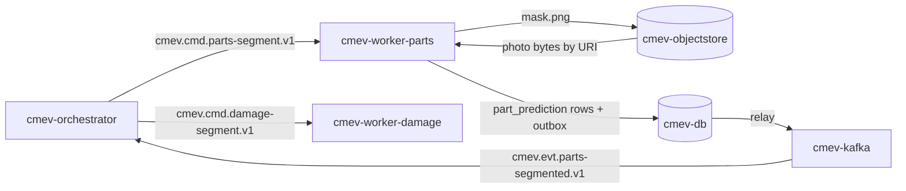

# M1 - Vehicle part segmentation

Owner lane: 1 (Vision). Runtime container: `cmev-worker-parts`. Code: `src/claim_cmev/vision/parts/`. Training pipeline: `pipelines/vision/`. Source: [proposal v2](../CLAIM-CMEV_project_proposal_v2.md) sections 8.1, 9.3, 9.4, 10 (M1), 11.1, 11.2, 11.8, 12.1, 13.1. Status: specified for v2; not implemented, not measured.

> **Runtime note.** The user has directed containerised modules with Kafka as the transport between them. This replaces proposal v2 section 9.1 (one API process plus one worker, a jobs table, no broker). Every v2 domain rule is unchanged: the decision rules in section 8, the exchanged records in section 9.3, module scope in section 10, datasets in section 11 and targets in section 13.1.

> **No large language model sits in the decision path.** Part and damage integration is deterministic mask overlap in [M2](module-02-damage-segmentation.md). Vision and document integration is the deterministic rule set in [M8](module-08-consolidation-checks.md). An optional stretch service `cmev-explainer` may turn an already computed finding into a readable sentence. It is off by default and never changes a result.

## Purpose and scope

Label the pixels of each vehicle part in one uploaded photograph, so that [M2](module-02-damage-segmentation.md) can assign damage to a part and [M3](module-03-part-summary-coverage.md) can screen visibility.

In scope: per pixel part class, per class confidence, mask artifacts and the transforms back to the original photograph.

Not in scope: damage, repair necessity, cost, and left or right side. The HITL part labels carry no side, so every prediction leaves side unresolved. A human identity confirmation is a separate record held by M3. It never rewrites or overwrites an M1 output row.

## Inputs, outputs and dependencies

| Direction | Contract |
| --- | --- |
| Input | `cmev.cmd.parts-segment.v1` message: envelope plus photo references and object store URIs. No image bytes travel on Kafka |
| Input | Pinned checkpoint `artifacts/models/parts/<version>`, mounted read only, and the taxonomy version from [data contracts](data_contracts.md) |
| Output | `cmev.evt.parts-segmented.v1` with one result block per photo |
| Output | Part mask PNG per photograph in `cmev-objectstore`, plus `part_prediction` rows in `cmev-db` |
| Consumers | M2 (overlap), M3 (screening), [M9](module-09-review-report.md) evidence panel (overlays) |
| Dependencies | [Integration contracts](integration_contracts.md) for the envelope, [model training specification](model_training_specification.md) for the checkpoint, [application platform](application_platform.md) for the container base image |

Classes are the 21 HITL part categories plus a background label at class id 0: quarter-panel, front-wheel, back-window, trunk, front-door, rocker-panel, grille, windshield, front-window, back-door, headlight, back-wheel, back-windshield, hood, fender, tail-light, licence-plate, front-bumper, back-bumper, mirror, roof. The dataset title `License-plate` maps to the canonical code `licence-plate` through the reviewed mapping in [data contracts](data_contracts.md), not by an ad hoc rename in training code.

### Dataset warning, repository evidence dated 2026-09-22

Under `data/raw/` the two HITL folder names are swapped relative to their contents. This was confirmed from annotation content, not only from `meta.json`.

| Folder on disk | Actual polygon content | Classes | Images |
| --- | --- | --- | --- |
| `data/raw/Car damages dataset/` | **Part** polygons. This is the M1 training source | 21 part classes | 998 |
| `data/raw/Car parts dataset/` | **Damage** polygons. Not an M1 source | 8 damage classes | 814 |

Both subsets reuse the same filename prefix, for example `Car damages 101.png` exists in both. That is why the swap is easy to miss. 441 filenames appear in both subsets and a sampled pair is byte identical, so the same photograph can carry a part polygon in one subset and a damage polygon in the other. See [M2](module-02-damage-segmentation.md) for how that overlap is used and bounded.

Annotations are Supervisely polygon JSON under `File1/ann`, images under `File1/img`, with `masks_human` and `masks_machine` also present. `data/raw/Car-Parts-Segmentation` (DSMLR) and `data/raw/carparts-seg` (Ultralytics) are present on disk but are outside v2 core scope and must not enter the M1 training or test manifests.

These are dated repository observations. The team still has to inspect the annotations and record the confirmed decision.

### Artifacts and database rows

| Written to | Name | Content |
| --- | --- | --- |
| `cmev-objectstore` | `claims/{claim_id}/{input_revision}/parts/{photo_id}/mask.png` | Paletted PNG, one class id per pixel, in the model frame |
| `cmev-objectstore` | `claims/{claim_id}/{input_revision}/parts/{photo_id}/overlay.png` | Optional display overlay for M9, written only when `parts.write_overlay` is true |
| `cmev-db` | `part_prediction` | One row per accepted or rejected class per photo: photo id, part code, side `unknown`, accepted flag, confidence, pixel count, bbox in the model frame, reason code, versions |
| `cmev-db` | `image_preprocessing` | One row per photo: original width, height, EXIF orientation, applied rotation, scale, pad x, pad y, model frame size |
| `cmev-db` | `job_run` | One row per `job_key`: status, attempts, first and last seen, reason, emitted event id |

## Container and transport

| Item | Value |
| --- | --- |
| Container | `cmev-worker-parts` |
| Compose profiles | `lean`, `full` |
| Consumer group | `cmev-worker-parts` |
| Consumes | `cmev.cmd.parts-segment.v1` |
| Produces | `cmev.evt.parts-segmented.v1`, `cmev.evt.job-failed.v1`, dead letters to `cmev.dlq.v1` |
| Message key | `claim_id`, so all work for one claim stays ordered inside one partition |
| Delivery | At least once. The consumer is idempotent through `job_key` uniqueness, as in v2 section 9.6 |
| Publishing | Rows and the outbound event are written in one `cmev-db` transaction. A relay publishes the outbox to `cmev-kafka` |
| GPU | Optional. Device is a configuration key decided after the day 2 smoke test |



### Message fields read and written

| Direction | Field | Meaning |
| --- | --- | --- |
| Read | `schema_version`, `claim_id`, `input_revision`, `job_key`, `versions`, `provenance`, `occurred_at`, `dedup_key`, `trace_id` | Standard envelope |
| Read | `photos[]` = `{photo_id, uri, sha256, media_type, width, height, exif_orientation}` | Object store references only |
| Read | `versions.parts_model`, `versions.taxonomy`, `versions.parts_config` | Pins the checkpoint, vocabulary and thresholds |
| Write | `photo_results[]` = `{photo_id, mask_uri, mask_sha256, mask_frame, transform, parts[]}` | One block per processed photo |
| Write | `parts[]` = `{part_code, side, accepted, confidence, pixel_count, bbox, reason}` | `side` is always `unknown` in this module |
| Write | `processing_status` = `succeeded` / `partial` / `failed`, `reasons[]` | `partial` means some photos failed and are named in `reasons[]` |

### Adapter entry point

The container shell and the unit tests call the same function. The adapter computes and writes artifacts. It does not touch Kafka and does not write domain rows. The consumer shell persists rows and publishes the event.

```python
# src/claim_cmev/vision/parts/adapter.py
def run_parts_segmentation(
    request: PartsSegmentRequest,   # envelope: JobEnvelope, photos: Sequence[PhotoRef]
    context: WorkerContext,         # object_store, config, versions, clock, logger, trace_id
) -> PartsSegmentResult:            # records, artifacts, processing_status, reasons, metrics
    ...
```

`JobEnvelope`, `WorkerContext`, `ArtifactRef` and `Reason` are shared types in `src/claim_cmev/contracts/`. M2, M3, M4 and M5 expose the same signature shape.

### Duplicate delivery and superseded revisions

| Situation | Required behaviour |
| --- | --- |
| Same `job_key` already succeeded | No recompute. Republish the stored event with the same `dedup_key`, then commit the offset |
| Same `job_key` running on another replica | Take an advisory lock on `job_key`. The second consumer writes nothing and commits after the lease resolves |
| Same `job_key` previously failed | Retry up to `parts.max_attempts`, then emit `cmev.evt.job-failed.v1` and copy the message to `cmev.dlq.v1` |
| `input_revision` below the claim's current revision | **Proposed:** do not recompute. Record `processing_status = superseded` with reason `superseded_input_revision`, emit no branch event, commit. Rows already completed for that revision are kept unchanged and stay readable for their historical assessment, as in v2 section 9.6 |
| Unknown `schema_version` | Do not guess. Dead letter to `cmev.dlq.v1` with reason `unsupported_schema_version` |

## Processing specification

1. Validate the envelope against the published schema. An unknown `schema_version` is dead lettered, never coerced.
2. Look up `job_key` in `job_run`. Apply the duplicate and superseded table above before any model work.
3. Read each photo from `cmev-objectstore` by URI. Verify SHA-256 against the recorded hash. A mismatch fails that photo with reason `artifact_hash_mismatch`; it is not silently re-fetched.
4. Decode, apply EXIF orientation, and record the original width, height and orientation.
5. Preprocess to the model frame. **Proposed policy:** scale the longest edge to 512 preserving aspect ratio, then pad right and bottom with the dataset mean pixel to 512 by 512. Persist `{rotation, scale, pad_x, pad_y, original_w, original_h}` in `image_preprocessing` so every mask maps back to the original photograph.
6. Run the pinned SegFormer-B0 checkpoint. Batch size and device come from configuration.
7. Take the per pixel argmax over 22 logits, being background plus 21 parts. For each predicted class record the pixel count and the mean softmax probability over the pixels assigned to it.
8. Apply `min_part_pixels` and `min_part_confidence`. A class below either threshold is written with `accepted = false` and a reason code. It is retained, not deleted, so M2 and M3 can see that something weak was observed.
9. Write the mask PNG in the model frame. Record `mask_frame = model` in the row and in the event. All downstream overlap arithmetic in M2 and M3 runs in this frame. Only display in M9 converts back to the original frame using the stored transform.
10. Set `side = unknown` and `side_source = not_resolved` with reason `hitl_labels_unsided` on every prediction.
11. Write `part_prediction`, `image_preprocessing`, `job_run` and the outbox event in one transaction. The relay then publishes `cmev.evt.parts-segmented.v1`.

### Worked example

Claim `CLM-2026-0412`, input revision 3, six photos, `job_key = CLM-2026-0412:3:parts-segment:all:parts/0.1.0+cfg/0.1.0`.

Photo `ph_02` is 4032 by 3024 JPEG with EXIF orientation 6. After rotation it is 3024 by 4032. Scale is 512 / 4032 = 0.12698, giving 384 by 512, padded right by 128.

| part_code | pixel_count | confidence | accepted | reason |
| --- | --- | --- | --- | --- |
| front-door | 41208 | 0.88 | true | |
| fender | 12905 | 0.79 | true | |
| front-window | 9330 | 0.83 | true | |
| mirror | 402 | 0.61 | false | `below_min_pixels` |

All four rows carry `side = unknown`. The mask is written to `claims/CLM-2026-0412/3/parts/ph_02/mask.png`. The event carries `processing_status = succeeded` and `dedup_key = parts-segment:CLM-2026-0412:3:batch-1`. A redelivery of the same message republishes this event and runs no inference.

## Configuration and thresholds

All keys live in versioned configuration under `configs/models/parts.yaml`. Thresholds are selected on the validation split only. They are never chosen after looking at the final test set, and the selected values are frozen at the day 6 checkpoint in v2 section 12.2.

| Key | Proposed default | Note |
| --- | --- | --- |
| `parts.model_version` | `parts/0.1.0-candidate` | Registry folder under `artifacts/models/` |
| `parts.device` | `cpu` | Decided after the day 2 smoke test on the demonstration machine |
| `parts.input_size` | `512` | Fixed by the M1 training recipe |
| `parts.resize_policy` | `longest_edge_pad` | Must match the training recipe exactly |
| `parts.batch_size` | `4` | Tune to the measured memory ceiling |
| `parts.min_part_pixels` | `512` | Pixels in the 512 by 512 frame, about 0.2 percent of the frame |
| `parts.min_part_confidence` | `0.50` | Mean softmax over the class pixels |
| `parts.max_photos_per_job` | `20` | Larger uploads are split into several commands by the orchestrator |
| `parts.max_attempts` | `3` | Then job failed plus dead letter |
| `parts.skip_superseded_revisions` | `true` | See the superseded rule above |
| `parts.write_overlay` | `true` | Overlay generation for M9 |

## Failure and uncertainty handling

- Label conversion must read the class titles from each subset's `meta.json`, assert the expected 21 part vocabulary, and fail loudly on any mismatch. Trusting the folder name silently trains the wrong model, because the folders on disk are swapped.
- A missing or invalid configured checkpoint fails container readiness. The container must not start and silently serve nothing.
- A corrupt or undecodable photo fails that photo with a reason code. Other photos in the same job still complete and the job is `partial`.
- A valid run that accepts no part class is a successful empty result with reasons. It is not proof that the vehicle has no parts, and it is not `not_visible`. Coverage is judged only by M3.
- A failed model run is a processing failure. It never becomes an absence of damage or an absence of a part downstream.
- Low confidence and small area predictions stay visible with `accepted = false`. They are screening signals, not proof.
- Fixture mode records `provenance.source_kind = fixture` on every row. A fixture result can never be displayed as real inference.

## Acceptance criteria

Targets are hypotheses from v2 section 13.1, not measured results. Report counts and denominators with every percentage.

| Criterion | Evidence |
| --- | --- |
| mIoU at least 0.60 on the held out HITL part split | Per class IoU and support for all 21 classes, with no class hidden after seeing errors |
| No agreed supported panel class below IoU 0.40 | The supported panel list is agreed and frozen before evaluation |
| Team photographs reported separately | A domain shift check, never merged into the HITL headline number |
| Split manifests cover both HITL subsets | Manifests are built over the union of the part and damage subsets, keyed on image SHA-256, because 441 filenames appear in both and an M1 training image could otherwise reappear in an M2 assignment evaluation set |
| Conversion asserts the vocabulary | A deliberate mismatch test fails the conversion instead of producing a silently wrong label map |
| Masks align on the original photograph | Overlay check on rotated, padded and portrait examples |
| Side stays unresolved | No row in `part_prediction` carries a side other than `unknown` |
| Redelivery is safe | Replaying a `cmev.cmd.parts-segment.v1` message creates no duplicate rows and no second mask |
| Superseded revision is safe | A message for an old `input_revision` never replaces the current assessment |
| Versions recorded | Every row stores model, taxonomy, config and code versions |

## Implementation tasks

- [ ] Confirm HITL access status and licence, and record the folder to content mapping, reading class titles from `meta.json`.
- [ ] Build the Supervisely polygon to semantic mask converter in `pipelines/vision/`, shared with M2, with the class id map pinned at 0 for background and a hard vocabulary assertion.
- [ ] Compute SHA-256 for every image in both HITL subsets and build one shared image index before splitting.
- [ ] Reserve train, validation and test manifests with hashes by day 2, before any tuning. Group near duplicate and same vehicle images where identifiers exist.
- [ ] Fine tune SegFormer-B0 at 512 by 512 and record seeds, recipe and hardware in the model manifest.
- [ ] Export per class IoU and support for all 21 classes on the held out split.
- [ ] Implement `run_parts_segmentation` with the transform record and the model frame mask.
- [ ] Implement the consumer shell: envelope validation, `job_key` lookup, advisory lock, outbox publish and dead letter path.
- [ ] Write the `cmev-worker-parts` Dockerfile and its `lean` and `full` Compose entries.
- [ ] Add tests for duplicate delivery, superseded revision, hash mismatch, corrupt photo, empty accepted set and overlay alignment.
- [ ] Record measured latency and peak memory for a six photo case on the demonstration hardware.

## Open decisions

| Decision | Owner | Resolve by |
| --- | --- | --- |
| Agreed supported panel class list for the 0.40 floor | Lane 1 with Lane 4 | Day 2, recorded in `configs/taxonomy/` |
| Whether the 441 shared images are held out of M1 training so they stay free for M2 assignment scoring | Lane 1 | Day 2, before any fitting |
| Serving device, batch size and whether a GPU profile is added to Compose | Lane 1 with Lane 5 | Day 2 smoke test |
| Final `min_part_pixels` and `min_part_confidence` values | Lane 1 | Validation split, frozen day 6 |
| Whether overlays are generated here or on demand by `cmev-api` | Lane 1 with Lane 5 | Day 3 |
| Partition count for `cmev.cmd.parts-segment.v1` and replica count for this container | Lane 5 | Day 2, see [integration contracts](integration_contracts.md) |
