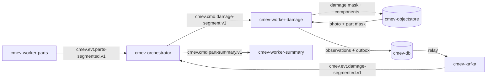

# M2 - Damage segmentation and part matching

Owner lane: 1 (Vision). Runtime container: `cmev-worker-damage`. Code: `src/claim_cmev/vision/damage/`. Training pipeline: `pipelines/vision/`. Source: [proposal v2](../CLAIM-CMEV_project_proposal_v2.md) sections 8.1, 9.3, 9.4, 10 (M2), 11.1, 11.2, 11.5, 11.8, 12.4, 13.1. Status: specified for v2; not implemented, not measured. CarDD access is an open gate.

> **Runtime note.** The user directed containerised modules with Kafka as the transport between them on 2026-09-22. Proposal v2 section 9.1 has since been rewritten to describe this same runtime directly; it originally specified one API process plus one worker, a jobs table and no broker. Every v2 domain rule is unchanged: the decision rules in section 8, the exchanged records in section 9.3, module scope in section 10, datasets in section 11 and targets in section 13.1.

> **No large language model sits in the decision path.** Part and damage integration is the deterministic mask overlap specified in this document. Vision and document integration is the deterministic rule set in [M8](module-08-consolidation-checks.md). An optional stretch service `cmev-explainer` may turn an already computed finding into a readable sentence. It is off by default and never changes a result.

## Purpose and scope

Find visible damage in one photograph, then assign each damage region to a part using deterministic mask overlap against the [M1](module-01-vehicle-part-segmentation.md) part masks for the same photograph.

In scope: a damage class per pixel, connected damage regions, an image area measure, and a conservative part assignment with explicit ambiguity.

Not in scope, and this must stay explicit in the output: this module predicts a **part category**, not a resolved left or right **side**, and not a required **repair operation**. Cost, necessity and the final finding belong to [M7](module-07-reference-cost-ranges.md) and [M8](module-08-consolidation-checks.md).

## Inputs, outputs and dependencies

| Direction | Contract |
| --- | --- |
| Input | `cmev.cmd.damage-segment.v1`: envelope, photo references and the M1 part mask references for the same `claim_id` and `input_revision` |
| Input | Pinned checkpoint `artifacts/models/damage/<version>`, mounted read only, plus the damage taxonomy version |
| Output | `cmev.evt.damage-segmented.v1` with one result block per photo |
| Output | Damage mask PNG and component label PNG per photograph, plus `image_damage_observation` rows |
| Consumers | [M3](module-03-part-summary-coverage.md) grouping and coverage, M8 through the summary, [M9](module-09-review-report.md) evidence panel |
| Dependencies | M1 masks for the same input revision, [data contracts](data_contracts.md), [integration contracts](integration_contracts.md), [model training specification](model_training_specification.md) |

Damage classes are the six CarDD categories: dent, scratch, crack, glass shatter, lamp broken, tire flat, plus a background label at class id 0. The model does not cover HITL only damage types such as corrosion or flaking.

### Instance to semantic conversion policy

CarDD ships instance annotations. The training pipeline converts them to semantic masks, and the conversion policy is recorded in the model manifest.

| Rule | **Proposed** choice | Note |
| --- | --- | --- |
| Rasterisation | Polygon fill at the source resolution, then the same resize and pad policy as M1 | Must match the M1 preprocessing exactly so masks share one frame |
| Overlapping instances, different classes | Smaller area wins the pixel | Keeps a small crack visible on top of a large dent. The alternative fixed class priority list is recorded if chosen instead |
| Overlapping instances, same class | Merged into one class region | Instance identity is not preserved in the semantic target |
| Background | Every pixel with no annotated instance | CarDD annotates damage only, so unannotated damage is indistinguishable from true background. Record this as a known label limitation |
| Reported metrics | Semantic mIoU and per class IoU only | Do not report AP, instance counts or any number labelled as an instance segmentation result |

### CarDD access gate and contingency

CarDD is not present in `data/raw/` and consent is unconfirmed as of 2026-09-22. If consent and files are not available at the day 2 checkpoint, apply the v2 section 12.4 contingency: use the accessible HITL damage subset only after recording its **distinct taxonomy** (8 classes: missing part, broken part, scratch, cracked, dent, flaking, paint chip, corrosion), its own splits, revised targets and the affected specification changes. The 0.45 mIoU target in this document is a CarDD target and does not carry over. Do not reuse CarDD class names for HITL classes, and do not combine the two sources to rescue sample counts. If neither source is usable, report the vision deliverable as blocked; fixture output cannot satisfy the real model demonstration criterion.

### Artifacts and database rows

| Written to | Name | Content |
| --- | --- | --- |
| `cmev-objectstore` | `claims/{claim_id}/{input_revision}/damage/{photo_id}/mask.png` | Paletted PNG, one damage class id per pixel, model frame |
| `cmev-objectstore` | `claims/{claim_id}/{input_revision}/damage/{photo_id}/components.png` | 16 bit PNG, one connected component id per pixel, so M9 can highlight a single observation |
| `cmev-db` | `image_damage_observation` | Observation id, photo id, component id, damage code, part code or null, side `unknown`, assignment status, primary containment, runner up containment, model confidence, pixel count, area fraction with denominator, mask and component references, reason, versions |
| `cmev-db` | `damage_assignment_candidate` | Observation id, candidate part code, containment, rank. Retained whenever the assignment is not resolved |
| `cmev-db` | `job_run` | One row per `job_key`: status, attempts, reason, emitted event id |

## Container and transport

| Item | Value |
| --- | --- |
| Container | `cmev-worker-damage` |
| Compose profiles | `lean`, `full` |
| Consumer group | `cmev-worker-damage` |
| Consumes | `cmev.cmd.damage-segment.v1` |
| Produces | `cmev.evt.damage-segmented.v1`, `cmev.evt.job-failed.v1`, dead letters to `cmev.dlq.v1` |
| Message key | `claim_id` |
| Ordering | `cmev-orchestrator` emits `cmev.cmd.damage-segment.v1` only after it has seen `cmev.evt.parts-segmented.v1` for the same `claim_id` and `input_revision`. This module never waits on M1 itself |
| Delivery | At least once, idempotent through `job_key` uniqueness as in v2 section 9.6 |
| Publishing | Rows plus outbound event in one `cmev-db` transaction, relayed to `cmev-kafka` |



### Message fields read and written

| Direction | Field | Meaning |
| --- | --- | --- |
| Read | Standard envelope: `schema_version`, `claim_id`, `input_revision`, `job_key`, `versions`, `provenance`, `occurred_at`, `dedup_key`, `trace_id` | |
| Read | `photos[]` = `{photo_id, uri, sha256, exif_orientation}` | Object store references only |
| Read | `part_masks[]` = `{photo_id, mask_uri, mask_sha256, mask_frame, transform, accepted_parts[]}` | Copied forward by the orchestrator from the M1 event, so M2 does not query `cmev-db` for it |
| Read | `versions.damage_model`, `versions.parts_model`, `versions.assignment_config`, `versions.taxonomy` | The parts model version is recorded on every observation, because the assignment depends on it |
| Write | `photo_results[]` = `{photo_id, damage_mask_uri, components_uri, observations[]}` | |
| Write | `observations[]` = `{observation_id, damage_code, part_code, side, assignment_status, primary_containment, runner_up_containment, candidates[], confidence, pixel_count, area_fraction, bbox, reason}` | `side` is always `unknown` |
| Write | `processing_status`, `reasons[]` | `partial` names the photos that failed |

### Adapter entry point

```python
# src/claim_cmev/vision/damage/adapter.py
def run_damage_segmentation(
    request: DamageSegmentRequest,  # envelope, photos, part_masks
    context: WorkerContext,         # object_store, config, versions, clock, logger, trace_id
) -> DamageSegmentResult:           # records, artifacts, processing_status, reasons, metrics
    ...
```

The assignment rule is a separate pure function so it can be unit tested against fixed masks without a model:

```python
# src/claim_cmev/vision/damage/assignment.py
def assign_damage_to_part(
    component_mask: NDArray,        # boolean, model frame
    part_mask: NDArray,             # class ids, model frame, same shape
    accepted_parts: Mapping[int, str],
    config: AssignmentConfig,
) -> PartAssignment:                # part_code | None, status, containments, candidates, reason
    ...
```

### Duplicate delivery and superseded revisions

| Situation | Required behaviour |
| --- | --- |
| Same `job_key` already succeeded | No recompute. Republish the stored event with the same `dedup_key`, commit the offset |
| Same `job_key` running on another replica | Advisory lock on `job_key`. The second consumer writes nothing |
| Same `job_key` previously failed | Retry to `damage.max_attempts`, then `cmev.evt.job-failed.v1` and `cmev.dlq.v1` |
| `input_revision` below the claim's current revision | **Proposed:** do not recompute. Record `processing_status = superseded` with reason `superseded_input_revision` and emit no branch event. Completed rows for that revision stay unchanged and readable for their historical assessment |
| `versions.parts_model` differs from the part masks actually referenced | Fail the job with reason `parts_version_mismatch`. Never mix a damage result with part masks from a different model version |
| Part mask missing for a photo | Still segment damage. Every observation on that photo gets `assignment_status = unresolved` with reason `part_masks_missing` |

## Processing specification

1. Validate the envelope. Unknown `schema_version` is dead lettered.
2. Apply the duplicate and superseded table before any model work.
3. Read the photo and the matching M1 part mask. Verify both SHA-256 values. Confirm `mask_frame = model` and that the transform matches the one M1 recorded.
4. Preprocess the photo with the same policy as M1, so the damage mask and the part mask share one frame and one pixel grid.
5. Run the pinned SegFormer-B0 damage checkpoint. Take the per pixel argmax over seven logits, being background plus six classes.
6. Drop pixels below `min_damage_confidence` to background, recording the count of dropped pixels as a quality signal.
7. Extract connected components per damage class using `connectivity` (proposed 8). Discard components below `min_damage_pixels`, recording the discarded count with reason `below_min_pixels`.
8. For each surviving component, compute the **containment** of the component in each part region: `containment(part) = |component and part| / |component|`. Containment is used rather than IoU because a part mask is far larger than a damage region, so IoU would always be small. Also compute `containment(background)`.
9. Rank the parts by containment. `primary` is the highest, `runner_up` the second.
10. Assign a part only when all of these hold. Otherwise the observation keeps unknown part identity.
    - `primary` is an M1 accepted part for that photo.
    - `primary_containment >= assign_min_containment`.
    - `primary_containment - runner_up_containment >= assign_ambiguity_margin`.
    - `containment(background) <= assign_background_max`.
11. When the assignment fails, set `assignment_status = unresolved`, write `part_code = null` with a reason code, and retain every candidate part with its containment in `damage_assignment_candidate`. The available reason codes are `no_part_overlap`, `below_containment_threshold`, `ambiguous_between_parts`, `part_not_accepted`, `mostly_background` and `part_masks_missing`.
12. Do not split a boundary crossing component across two parts by default (`split_components = false`). A component that straddles a panel edge is ambiguous evidence, and splitting it would invent two observations from one region.
13. Set `side = unknown` on every observation with reason `hitl_labels_unsided`. No side is inferred from position in the image.
14. Record the area measure as a pixel count in the model frame plus a fraction with an explicit denominator. Never present it as physical square centimetres or as a severity score.
15. Write artifacts, rows, `job_run` and the outbox event in one transaction, then publish `cmev.evt.damage-segmented.v1`.

### Worked example

Claim `CLM-2026-0412`, input revision 3, photo `ph_02`. Thresholds are the proposed defaults: `assign_min_containment = 0.60`, `assign_ambiguity_margin = 0.20`, `assign_background_max = 0.50`.

| Component | damage_code | pixels | conf | front-door | fender | background | Result |
| --- | --- | --- | --- | --- | --- | --- | --- |
| `c1` | scratch | 3120 | 0.71 | 0.78 | 0.14 | 0.08 | Assigned `front-door`, side `unknown` |
| `c2` | dent | 1845 | 0.66 | 0.47 | 0.44 | 0.09 | Unresolved, reason `ambiguous_between_parts`, both candidates kept |
| `c3` | scratch | 190 | 0.58 | - | - | - | Discarded, reason `below_min_pixels` |
| `c4` | crack | 2210 | 0.62 | 0.11 | 0.05 | 0.84 | Unresolved, reason `mostly_background` |

Component `c1` produces `observation_id = obs_ph02_c1` with `area_fraction = 3120 / 262144 = 0.0119` over the 512 by 512 model frame. Component `c2` stays visible to M3 and M8 as damage with unknown part identity, so it can never support a claim about the front door or the fender.

## Configuration and thresholds

Model keys live in `configs/models/damage.yaml`. Assignment keys live in `configs/pipeline/damage_assignment.yaml`. Both are versioned, and both versions are recorded on every observation. Thresholds are selected on the validation split and frozen at the day 6 checkpoint. They are never chosen after seeing the final test set.

| Key | Proposed default | Note |
| --- | --- | --- |
| `damage.model_version` | `damage/0.1.0-candidate` | Registry folder under `artifacts/models/` |
| `damage.device` | `cpu` | Decided after the day 2 smoke test |
| `damage.input_size` | `512` | Must equal `parts.input_size` |
| `damage.min_damage_confidence` | `0.50` | Per pixel softmax floor |
| `damage.min_damage_pixels` | `256` | About 0.1 percent of the 512 by 512 frame |
| `damage.connectivity` | `8` | Connected component rule |
| `damage.max_components_per_photo` | `50` | Excess components are kept by descending area, with a reason recorded |
| `assign_min_containment` | `0.60` | Fraction of the damage component inside the primary part |
| `assign_ambiguity_margin` | `0.20` | Primary minus runner up containment |
| `assign_background_max` | `0.50` | Above this the component is mostly off vehicle |
| `split_components` | `false` | Boundary crossing components stay whole and ambiguous |
| `damage.max_attempts` | `3` | Then job failed plus dead letter |
| `damage.skip_superseded_revisions` | `true` | See the superseded rule above |

## Failure and uncertainty handling

- Label conversion must read the class titles from each source dataset's metadata, assert the expected vocabulary, and fail loudly on a mismatch. For HITL this is critical because the two folders under `data/raw/` are swapped: `Car damages dataset/` holds part polygons and `Car parts dataset/` holds the 8 damage polygons. Trusting the folder name silently trains the wrong model. See [M1](module-01-vehicle-part-segmentation.md) for the full table.
- A missing part mask never erases a damage detection. The damage stays, with unresolved identity.
- A valid run with no accepted damage is a successful empty result with reasons. It is not proof that the vehicle is undamaged, and M3 and M8 still need coverage before any negative finding.
- A failed model run is a processing failure, never an absence of damage.
- Different damage classes can coexist on one part. Do not merge dent, scratch and crack into one label to make assignment easier.
- Do not infer an instance count. One connected component is one region on one photograph, not one physical dent.
- Fixture mode records `provenance.source_kind = fixture` on every row.

## Acceptance criteria

Targets are hypotheses from v2 section 13.1, not measured results. Report raw counts and denominators.

| Criterion | Evidence |
| --- | --- |
| Semantic mIoU at least 0.45 on the held out CarDD split | Per class IoU for all six categories, including dent, scratch and crack, none omitted after seeing errors |
| Metrics are labelled semantic | No AP or instance count is published from this converted target |
| Assignment measured directly | Correct part assignment, unresolved rate and error breakdown on a jointly labelled sample. This quality is never inferred from the two mask IoU numbers |
| Boundary cases covered | Boundary crossing damage, small regions and confusing neighbouring panels appear in the assignment evaluation set |
| Unresolved stays usable | An unresolved observation is still visible to M3, M8 and M9 with its candidates |
| Split hygiene | Split manifests are built over the union of both HITL subsets keyed on image SHA-256, because 441 filenames appear in both and an M1 training image could otherwise reappear in an M2 assignment evaluation set |
| Redelivery and supersession are safe | No duplicate observations, no overwrite of a historical assessment |
| Versions recorded | Every observation stores the damage model, the parts model and the assignment config version |

### Jointly annotated HITL images, repository evidence dated 2026-09-22

441 filenames appear in both HITL subsets, a sampled pair is byte identical, and all 441 carry at least one part polygon in one subset and at least one damage polygon in the other. That means the team already holds 441 photographs with ground truth damage regions **and** ground truth part regions on the same image, so the assignment rule in step 10 can be scored geometrically without new annotation.

What this does not give:

- **No side.** HITL part labels carry no left or right, so these images cannot measure side identity at all.
- **Not the CarDD vocabulary.** HITL has 8 damage classes and CarDD has 6. Scoring here measures the **assignment geometry**, not CarDD class quality, and the two class sets must not be conflated.
- **Not a replacement for team data.** The v2 section 11.5 plan for a team labelled damage to part sample and for team vehicle groups stays in place. Side identity, coverage confirmation and the CarDD vocabulary still need it.

This is repository evidence, not a settled team decision. Lane 1 should inspect the 441 pairs, confirm that the polygons align, and record the decision before relying on them.

## Implementation tasks

- [ ] Confirm CarDD consent and files, or record the day 2 contingency decision with its distinct taxonomy, splits and revised targets.
- [ ] Build the instance to semantic converter with the recorded overlap and background policy, and a hard vocabulary assertion.
- [ ] Build the shared image index over both HITL subsets keyed on SHA-256, and reserve the assignment evaluation images before any fitting.
- [ ] Inspect the 441 jointly annotated HITL pairs, confirm polygon alignment, and record whether they are adopted for assignment scoring.
- [ ] Fine tune SegFormer-B0 on the six damage categories and record seeds, recipe and hardware in the model manifest.
- [ ] Implement `assign_damage_to_part` as a pure function with fixture mask tests for assigned, ambiguous, background and missing mask cases.
- [ ] Implement `run_damage_segmentation`, the component label artifact and the area measure with its denominator.
- [ ] Implement the consumer shell: envelope validation, `job_key` lookup, parts version check, advisory lock, outbox publish, dead letter path.
- [ ] Write the `cmev-worker-damage` Dockerfile and its `lean` and `full` Compose entries.
- [ ] Select `assign_min_containment` and `assign_ambiguity_margin` on validation data and record the sweep.
- [ ] Report per class IoU for all six categories and the assignment counts separately.

## Open decisions

| Decision | Owner | Resolve by |
| --- | --- | --- |
| CarDD consent and files, or the recorded HITL damage contingency | Lane 1 | Day 2 checkpoint |
| Instance overlap rule: smaller area wins, or a fixed class priority list | Lane 1 | After inspecting CarDD overlaps, before training |
| Whether containment stays the overlap measure, or a part relative measure is added | Lane 1 | Validation sweep |
| Final `assign_min_containment`, `assign_ambiguity_margin` and `assign_background_max` | Lane 1 | Validation split, frozen day 6 |
| Whether the 441 jointly annotated HITL images are adopted for assignment scoring, and whether they are excluded from M1 training | Lane 1 | Day 2, before fitting |
| Whether `split_components` is ever enabled, and under what recorded policy | Lane 1 with Lane 4 | Day 4, only with evidence |
