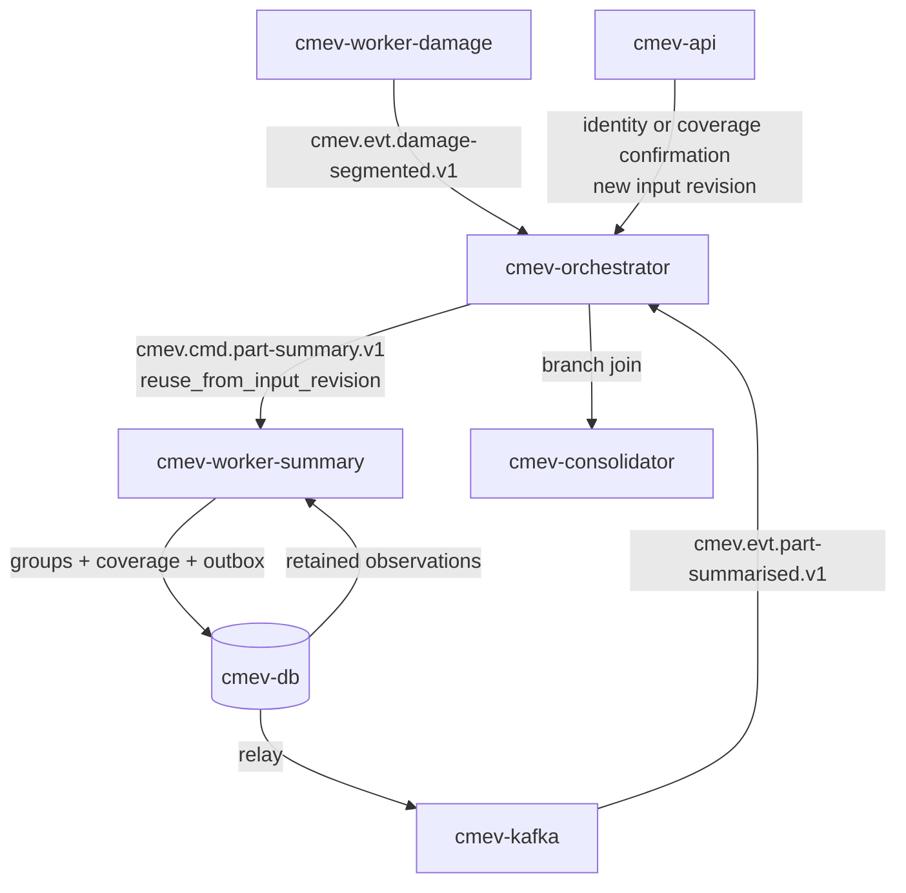

# M3 - Part summary and coverage

Owner lane: 1 (Vision). Runtime container: `cmev-worker-summary`. Code: `src/claim_cmev/vision/multiview/`. Training pipeline: none, this module has no neural weights. Source: [proposal v2](../CLAIM-CMEV_project_proposal_v2.md) sections 8.1, 8.4, 9.3, 9.4, 10 (M3), 11.2, 11.5, 12.1, 13.1. Status: specified for v2; not implemented, not measured. RQ3 is exploratory.

> **Runtime note.** The user has directed containerised modules with Kafka as the transport between them. This replaces proposal v2 section 9.1 (one API process plus one worker, a jobs table, no broker). Every v2 domain rule is unchanged: the decision rules in section 8, the exchanged records in section 9.3, module scope in section 10, datasets in section 11 and targets in section 13.1.

> **No large language model sits in the decision path.** Part and damage integration is deterministic mask overlap in [M2](module-02-damage-segmentation.md). Vision and document integration is the deterministic rule set in [M8](module-08-consolidation-checks.md). An optional stretch service `cmev-explainer` may turn an already computed finding into a readable sentence. It is off by default and never changes a result.

## Purpose and scope

Turn per photograph observations into a readable part summary, and state separately which parts can actually be judged.

In scope: grouping observations under a part identity, retaining every source observation, screening view quality, and publishing a coverage state per part slot.

Not in scope, and this must stay explicit: no 3D reconstruction, no pose estimation, no automatic deduplication of physical damage, and no count of physical damage instances. A group means that the observations refer to one part. It does not assert that they show one physical dent.

## Inputs, outputs and dependencies

| Direction | Contract |
| --- | --- |
| Input | `cmev.cmd.part-summary.v1`: envelope, the M1 part predictions and M2 observations for one claim and input revision, and any recorded human identity or coverage confirmations |
| Input | Part mask and damage mask artifacts by URI, read only when a screening signal needs pixels |
| Output | `cmev.evt.part-summarised.v1` with the groups and the coverage table |
| Output | `part_summary_group`, `part_summary_member` and `part_coverage` rows in `cmev-db` |
| Consumers | [M8](module-08-consolidation-checks.md) findings, [M9](module-09-review-report.md) overview and evidence panel |
| Dependencies | [M1](module-01-vehicle-part-segmentation.md), [M2](module-02-damage-segmentation.md), [data contracts](data_contracts.md), [integration contracts](integration_contracts.md) |

This module loads no weights, so `cmev-worker-summary` is a small container with no model registry mount. Its behaviour is fixed by versioned configuration and code, and both versions are recorded on every row.

### Artifacts and database rows

| Written to | Name | Content |
| --- | --- | --- |
| `cmev-db` | `part_summary_group` | Group id, identity status, part code, side, observation count, damage codes present, representative area with its policy and source observation, max confidence, reasons, versions |
| `cmev-db` | `part_summary_member` | Group id to observation id, one row per member, with the photo id. No observation is ever dropped |
| `cmev-db` | `part_coverage` | Part code, side, state, screen result, covering photo ids, per view signal values, reason codes, human confirmation reference, versions |
| `cmev-db` | `job_run` | One row per `job_key`: status, attempts, reason, emitted event id |
| `cmev-objectstore` | None by default | Screening reads existing masks. Set `summary.write_debug_crops` to keep crops while tuning |

## Container and transport

| Item | Value |
| --- | --- |
| Container | `cmev-worker-summary` |
| Compose profiles | `lean`, `full` |
| Consumer group | `cmev-worker-summary` |
| Consumes | `cmev.cmd.part-summary.v1` |
| Produces | `cmev.evt.part-summarised.v1`, `cmev.evt.job-failed.v1`, dead letters to `cmev.dlq.v1` |
| Message key | `claim_id` |
| Ordering | `cmev-orchestrator` emits the command after `cmev.evt.damage-segmented.v1` for the same `claim_id` and `input_revision`, or after a confirmation triggers a reuse run |
| Delivery | At least once, idempotent through `job_key` uniqueness as in v2 section 9.6 |
| Publishing | Rows plus outbound event in one `cmev-db` transaction, relayed to `cmev-kafka` |



### Message fields read and written

| Direction | Field | Meaning |
| --- | --- | --- |
| Read | Standard envelope: `schema_version`, `claim_id`, `input_revision`, `job_key`, `versions`, `provenance`, `occurred_at`, `dedup_key`, `trace_id` | |
| Read | `observations[]` | The M2 observation rows, each with `observation_id`, `photo_id`, `damage_code`, `part_code` or null, `assignment_status`, `confidence`, `pixel_count`, `area_fraction` |
| Read | `part_predictions[]` | The M1 rows, needed for coverage of parts that carry no damage |
| Read | `confirmations[]` = `{confirmation_id, kind, part_code, side, photo_ids, actor, recorded_at}` | `kind` is `identity` or `coverage`. Supplied by `cmev-api` from the review store |
| Read | `reuse_from_input_revision` | Present when a confirmation triggered this run. Names the revision whose model artifacts are reused |
| Read | `image_branch_status` | `succeeded` / `partial` / `failed` from the upstream branch, so a failure is never read as an empty result |
| Write | `groups[]` = `{group_id, identity_status, part_code, side, member_observation_ids[], observation_count, damage_codes[], representative_area, area_policy, max_confidence, reasons[]}` | |
| Write | `coverage[]` = `{part_code, side, state, screen_result, covering_photo_ids[], signals{}, reasons[], confirmation_id}` | |
| Write | `processing_status`, `reasons[]` | |

### Adapter entry point

```python
# src/claim_cmev/vision/multiview/adapter.py
def run_part_summary(
    request: PartSummaryRequest,    # envelope, observations, part_predictions, confirmations
    context: WorkerContext,         # object_store, config, versions, clock, logger, trace_id
) -> PartSummaryResult:             # records, artifacts, processing_status, reasons, metrics
    ...
```

The two decision rules are pure functions so they can be unit tested from fixed inputs with no image and no model:

```python
# src/claim_cmev/vision/multiview/grouping.py
def group_observations(observations, confirmations, config) -> list[SummaryGroup]: ...

# src/claim_cmev/vision/multiview/coverage.py
def decide_coverage(part_slot, views, confirmations, branch_status, config) -> CoverageDecision: ...
```

### Duplicate delivery and superseded revisions

| Situation | Required behaviour |
| --- | --- |
| Same `job_key` already succeeded | No recompute. Republish the stored event with the same `dedup_key`, commit the offset |
| Same `job_key` running on another replica | Advisory lock on `job_key`. The second consumer writes nothing |
| Same `job_key` previously failed | Retry to `summary.max_attempts`, then `cmev.evt.job-failed.v1` and `cmev.dlq.v1` |
| `input_revision` below the claim's current revision | **Proposed:** do not recompute. Record `processing_status = superseded` with reason `superseded_input_revision` and emit no branch event. Completed rows for that revision stay unchanged and readable for their historical assessment |
| `image_branch_status = failed` | Do not produce coverage states of `not_visible`. Every affected slot is `unresolved` with reason `processing_failed` |

Because the `job_key` includes the summary configuration version and the set of confirmation ids, a new confirmation produces a different `job_key` and therefore a genuine recomputation, while a plain redelivery does not.

## Processing specification

### Grouping

1. Validate the envelope and apply the duplicate and superseded table before any work.
2. Build the confirmation index. An `identity` confirmation maps a set of photo ids and a part code to one physical part with a side. A `coverage` confirmation records that the named views show enough of that physical part to judge the supported damage types.
3. Assign every observation to exactly one group, using the first matching row.

| identity_status | Grouping key | Meaning and limit |
| --- | --- | --- |
| `resolved` | `(part_code, side)` from a recorded identity confirmation covering that observation's photo | One physical part. Only this status can support a negative finding in M8 |
| `part_only` | `(part_code, side = unknown)` | The observations refer to the same part category. Physical identity is not established, so this cannot establish a same panel match and cannot suppress an addition on the opposite side |
| `unresolved` | The observation id itself, one group per observation | No part category. Kept visible so M8 can withhold rather than ignore |

4. Retain every member. Write one `part_summary_member` row per observation with its identifier and photo id. An observation that reaches M3 must be reachable from the group in M9.
5. Compute the representative area. **Proposed policy** `area_policy = max_member`: report the largest single member area with the photo id it came from, and list every member area beside it. **Never sum member areas.** Two photographs of the same scratch are not twice the scratch.
6. Publish `observation_count`, which is the number of observations in photographs. Do not publish a damage instance count, and do not let M9 label `observation_count` as a number of dents.
7. Record the damage codes present in the group as a set, with the member observation that carries each one.

### Coverage

8. Build the coverage slot list: every part in the agreed supported panel list, plus every part code that appears in an M1 prediction or an M2 observation. A slot is `(part_code, side)` when an identity confirmation resolves it, otherwise `(part_code, unknown)`.
9. For each slot and each photograph that carries an accepted M1 mask for that part code, compute the screening signals.

| Signal | Measure | Proposed threshold |
| --- | --- | --- |
| Part area | Part pixels divided by model frame pixels | at least `min_part_area_fraction` |
| Sharpness | Variance of the Laplacian inside the part bounding box | at least `min_blur_score` |
| Lighting | Mean luminance inside the part mask, plus clipped pixel fraction | mean within `[min_mean_luma, max_mean_luma]`, clipped at most `max_clipped_fraction` |
| Crop | Fraction of the part mask perimeter that touches the image border | at most `max_border_touch_fraction` |
| Obstruction | Not reliably measurable from a mask | Human flag only, never inferred |

10. Set `screen_result` to `pass`, `fail` or `not_run` per view, and keep the numeric values so M9 can show why.
11. Decide the coverage state with this table. The first matching row wins.

| Condition | State | Reason code |
| --- | --- | --- |
| The image branch failed, or the part's own job failed | `unresolved` | `processing_failed` |
| No identity confirmation resolves the slot | `unresolved` | `identity_not_resolved` |
| Resolved slot, no accepted part mask in any photograph, branch succeeded | `not_visible` | `no_accepted_part_mask` |
| Resolved slot, at least one view, but every view fails the screen | `inadequate` | The failing signal names, for example `low_sharpness`, `part_too_small`, `cropped_at_border` |
| Resolved slot, at least one view passes the screen, no recorded coverage confirmation | `inadequate` | `awaiting_coverage_confirmation` |
| Resolved slot, at least one view passes the screen, coverage confirmation recorded | `adequate` | Carries `confirmation_id` |

12. `adequate` is therefore never reached automatically. Screening alone produces a candidate that M9 shows to the surveyor for confirmation. This is the v2 section 8.1 rule that a negative finding requires a resolved physical part and a recorded confirmation that the views cover enough of it.
13. Write groups, members, coverage, `job_run` and the outbox event in one transaction, then publish `cmev.evt.part-summarised.v1`.

### Reuse after a human confirmation

14. When the surveyor confirms an identity or a coverage, `cmev-api` records a review action and creates a new input revision, as in v2 section 8.4.
15. `cmev-orchestrator` emits only `cmev.cmd.part-summary.v1` for the new revision, carrying `reuse_from_input_revision` and the retained observation and prediction rows. It does **not** emit `cmev.cmd.parts-segment.v1` or `cmev.cmd.damage-segment.v1`, because no photograph changed.
16. The new rows record `provenance.reused_from = {input_revision, parts_model, damage_model}` so the lineage stays visible. The original groups and coverage for the earlier revision remain stored and readable.
17. A new photograph, by contrast, is a real input change and does re-emit the M1 and M2 commands.

### Worked example

Claim `CLM-2026-0412`, input revision 3, four photographs of one vehicle. M2 produced five observations.

| observation | photo | damage | part_code | assignment_status |
| --- | --- | --- | --- | --- |
| `obs_1` | `ph_01` | scratch | front-door | assigned |
| `obs_2` | `ph_02` | scratch | front-door | assigned |
| `obs_3` | `ph_02` | dent | null | unresolved, `ambiguous_between_parts` |
| `obs_4` | `ph_03` | dent | fender | assigned |
| `obs_5` | `ph_04` | crack | null | unresolved, `mostly_background` |

With no confirmations yet, M3 writes four groups: `part_only` on front-door with members `obs_1` and `obs_2`, `part_only` on fender with `obs_4`, and two `unresolved` groups holding `obs_3` and `obs_5`. The front-door group reports `observation_count = 2` and `representative_area = 0.0119` from `obs_2`, not `0.0119 + 0.0094`.

Front-door coverage is `unresolved` with reason `identity_not_resolved`, even though both views pass the screen, because nothing has established whether this is the left or the right front door. M8 can therefore raise no unsupported finding for a declared left front door.

The surveyor then confirms in M9 that `ph_01` and `ph_02` show the **left** front door, and confirms coverage. That creates input revision 4. The orchestrator emits only `cmev.cmd.part-summary.v1` with `reuse_from_input_revision = 3`. M3 recomputes: the front-door group becomes `resolved` on `(front-door, left)`, coverage becomes `adequate` with the confirmation id, and no neural model runs. Revision 3 rows are untouched.

## Configuration and thresholds

Keys live in versioned configuration at `configs/pipeline/part_summary.yaml`. Thresholds are selected on the validation vehicle groups and frozen at the day 6 checkpoint. They are never chosen after seeing the final test groups.

| Key | Proposed default | Note |
| --- | --- | --- |
| `summary.area_policy` | `max_member` | Summing member areas is forbidden, not merely discouraged |
| `summary.min_part_area_fraction` | `0.02` | Part pixels over model frame pixels |
| `summary.min_blur_score` | `100.0` | Variance of the Laplacian, higher is sharper. Scale depends on the crop size, so calibrate before use |
| `summary.min_mean_luma` | `40` | 0 to 255 scale |
| `summary.max_mean_luma` | `220` | |
| `summary.max_clipped_fraction` | `0.10` | Pixels at 0 or 255 inside the part mask |
| `summary.max_border_touch_fraction` | `0.25` | Crop screen |
| `summary.require_coverage_confirmation` | `true` | Setting this false would break the v2 section 8.1 rule. It exists only for rule test fixtures and is rejected in the release configuration |
| `summary.supported_panel_list` | From `configs/taxonomy/` | The agreed panels that always get a coverage slot |
| `summary.max_attempts` | `3` | Then job failed plus dead letter |
| `summary.skip_superseded_revisions` | `true` | See the superseded rule above |
| `summary.write_debug_crops` | `false` | Tuning only |

## Failure and uncertainty handling

- A failed model run upstream is a processing failure. It becomes `unresolved` with reason `processing_failed`, never `not_visible` and never an absence of damage.
- Mask area, sharpness, lighting and crop are screening signals on one photograph. They do not establish that a whole panel was visible, and the specification must not be read as if they did.
- Obstruction is not inferred. A partly hidden panel that is sharp and large still passes the automatic screen, which is exactly why a human coverage confirmation is required before `adequate`.
- An unknown side stays unknown. A left door declaration can never use right door coverage or right door damage.
- Unresolved observations are never discarded to tidy the summary. They stay as their own groups so M8 withholds instead of ignoring.
- One photograph can support coverage, but a single photograph cannot establish multi view performance. Report that limit with any RQ3 result.
- Fixture mode records `provenance.source_kind = fixture` on every row.

## Acceptance criteria

Targets are hypotheses from v2 section 13.1. RQ3 is an exploratory case study with raw counts and examples, not a reliability claim.

| Criterion | Evidence |
| --- | --- |
| Part summary precision and recall reported | Against a per image baseline on held out team vehicle groups, with raw counts |
| Incorrect identity groupings counted | Every case listed, including any left and right confusion after a confirmation |
| No lost observations | Every input observation id appears in exactly one `part_summary_member` row. This is a hard test, not a metric |
| No summed areas | A test asserts that the group area equals a single member area and is never a sum |
| No instance count | No field in the contract or the UI reports a number of physical dents |
| Withholding rate reported | How often coverage is `unresolved` or `inadequate`, and why, by reason code |
| Reuse works | A confirmation creates a new revision and recomputes groups and coverage with no M1 or M2 command emitted, and with `reused_from` lineage recorded |
| `adequate` requires confirmation | A rule test shows that passing screens alone never produce `adequate` |
| Failure is not absence | A rule test shows a failed image branch producing `unresolved`, never `not_visible` |
| Redelivery and supersession are safe | No duplicate groups, no overwrite of a historical assessment |
| Automatic and assisted results separated | Results before and after human confirmation are reported separately, never merged |

## Implementation tasks

- [ ] Agree the supported panel list and record it in `configs/taxonomy/`.
- [ ] Implement `group_observations` with the three identity statuses and full member retention.
- [ ] Implement `decide_coverage` as a table driven rule with reason codes, ordered exactly as specified.
- [ ] Implement the four screening signals and calibrate the sharpness scale on real team photographs before setting a threshold.
- [ ] Implement the confirmation index and the `reuse_from_input_revision` path, including the `job_key` contribution of the confirmation id set.
- [ ] Implement the consumer shell: envelope validation, `job_key` lookup, advisory lock, outbox publish, dead letter path.
- [ ] Write the `cmev-worker-summary` Dockerfile and its `lean` and `full` Compose entries. No model registry mount.
- [ ] Build deterministic rule test fixtures: opposite side evidence, unknown identity, sharp but cropped view, missing photographs, failed inference, confirmation arriving late.
- [ ] Collect and label 5 to 10 team vehicle groups with 4 to 6 views each, keeping all views of one vehicle in one partition.
- [ ] Report RQ3 counts, identity errors and withholding rate with denominators.

## Open decisions

| Decision | Owner | Resolve by |
| --- | --- | --- |
| Sharpness measure and its threshold, since the Laplacian variance scale depends on crop size | Lane 1 | Day 4, calibrated on real photographs |
| Whether `representative_area` stays `max_member` or becomes the median member area | Lane 1 with Lane 4 | Day 4 |
| Whether a coverage confirmation is per part or per part and damage type | Lanes 1 and 4 | Day 2, affects the M8 rule and the M9 screen |
| Whether unresolved observations get one group each or one shared bucket per photograph | Lane 1 | Day 3, affects the M9 overview layout |
| Whether the supported panel list is the full 21 classes or a smaller agreed subset | Lane 1 with Lane 4 | Day 2 |
| Team vehicle group availability, and which required scenarios are missing | Lane 1 | Day 4, gaps reported not silently dropped |
