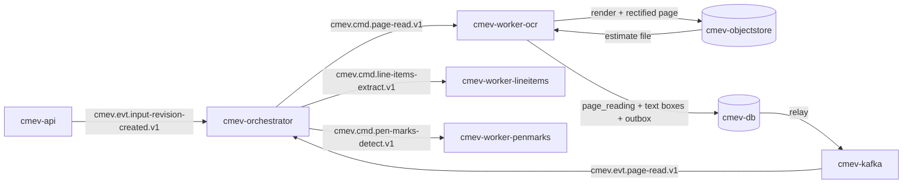

# M4 - Page reading

Owner lane: 2 (Document extraction). Runtime container: `cmev-worker-ocr`. Code: `src/claim_cmev/documents/text_layout/`. Training pipeline: none, OCR is pretrained and pinned. Source: [proposal v2](../CLAIM-CMEV_project_proposal_v2.md) sections 2.2, 8.1, 9.3, 9.4, 10 (M4), 11.1, 11.3, 12.1, 13.1. Status: specified for v2; not implemented, not measured.

> **Runtime note.** The user directed containerised modules with Kafka as the transport between them on 2026-09-22. Proposal v2 section 9.1 has since been rewritten to describe this same runtime directly; it originally specified one API process plus one worker, a jobs table and no broker. Every v2 domain rule is unchanged: the decision rules in section 8, the exchanged records in section 9.3, module scope in section 10, datasets in section 11 and targets in section 13.1.

> **No large language model sits in the decision path.** Part and damage integration is deterministic mask overlap in [M2](module-02-damage-segmentation.md). Vision and document integration is the deterministic rule set in [M8](module-08-consolidation-checks.md). An optional stretch service `cmev-explainer` may turn an already computed finding into a readable sentence. It is off by default and never changes a result.

## Purpose and scope

Turn a photographed or scanned workshop estimate page into located text, and keep a reliable route from every character back to the original uploaded page.

In scope: PDF to image conversion, page boundary detection, perspective and rotation correction, OCR with a pinned engine, reading order, quality flags and the transforms back to the original page.

Not in scope: deciding what a row means, mapping vocabulary, or parsing amounts. That is [M5](module-05-line-item-extraction.md). Pen marks are [M6](module-06-pen-mark-recognition.md). This module never classifies a stroke as a pen mark, and it never decides that a row was excluded.

## Inputs, outputs and dependencies

| Direction | Contract |
| --- | --- |
| Input | `cmev.cmd.page-read.v1`: envelope plus estimate file references and object store URIs |
| Input | Pinned PaddleOCR detection and recognition weights, baked into the image or mounted read only |
| Output | `cmev.evt.page-read.v1` with one block per page |
| Output | Rendered and rectified page images in `cmev-objectstore`, plus `page_reading` and `page_text_box` rows |
| Consumers | [M5](module-05-line-item-extraction.md) row building, [M6](module-06-pen-mark-recognition.md) which reads the same rectified page, [M9](module-09-review-report.md) evidence panel |
| Dependencies | [Data contracts](data_contracts.md), [integration contracts](integration_contracts.md), [application platform](application_platform.md) for the OCR base image |

### Artifacts and database rows

| Written to | Name | Content |
| --- | --- | --- |
| `cmev-objectstore` | `claims/{claim_id}/{input_revision}/pages/{page_id}/render.png` | The page as uploaded or as rasterised from the PDF, after EXIF orientation |
| `cmev-objectstore` | `claims/{claim_id}/{input_revision}/pages/{page_id}/rectified.png` | The geometry corrected page. When no correction was applied this is a copy of `render.png` and the record says so |
| `cmev-objectstore` | `claims/{claim_id}/{input_revision}/pages/{page_id}/boundary_debug.png` | Optional, only when `page.write_debug` is true |
| `cmev-db` | `page_reading` | Page id, file id, one based page number, render and rectified URIs, geometry correction kind, homography and its inverse, render dpi, OCR engine and weight versions, actual text box granularity, page status, quality signals, versions |
| `cmev-db` | `page_text_box` | Box id, page id, reading order index, original text, engine confidence or null, quadrilateral in the rectified frame, quadrilateral mapped back to the original page, granularity, flags |
| `cmev-db` | `job_run` | One row per `job_key`: status, attempts, reason, emitted event id |

## Container and transport

| Item | Value |
| --- | --- |
| Container | `cmev-worker-ocr` |
| Compose profiles | `lean`, `full` |
| Consumer group | `cmev-worker-ocr` |
| Consumes | `cmev.cmd.page-read.v1` |
| Produces | `cmev.evt.page-read.v1`, `cmev.evt.job-failed.v1`, dead letters to `cmev.dlq.v1` |
| Message key | `claim_id` |
| Ordering | Emitted by `cmev-orchestrator` on `cmev.evt.input-revision-created.v1` when the revision contains estimate pages. The document branch runs in parallel with the image branch |
| Delivery | At least once, idempotent through `job_key` uniqueness as in v2 section 9.6 |
| Publishing | Rows plus outbound event in one `cmev-db` transaction, relayed to `cmev-kafka` |



### Message fields read and written

| Direction | Field | Meaning |
| --- | --- | --- |
| Read | Standard envelope: `schema_version`, `claim_id`, `input_revision`, `job_key`, `versions`, `provenance`, `occurred_at`, `dedup_key`, `trace_id` | |
| Read | `files[]` = `{file_id, uri, sha256, media_type, page_count, exif_orientation}` | PDF or image. Object store references only |
| Read | `versions.ocr_engine`, `versions.ocr_weights`, `versions.page_config` | Pins the engine, weights and thresholds |
| Write | `pages[]` = `{page_id, file_id, page_number, render_uri, rectified_uri, geometry_correction, homography, homography_inverse, render_dpi, text_box_granularity, page_status, quality{}, boxes[]}` | |
| Write | `boxes[]` = `{box_id, order_index, text, confidence, quad_rectified, quad_original, flags[]}` | `confidence` is null when the engine supplies none. It is never invented |
| Write | `processing_status`, `reasons[]` | `partial` names the pages that failed |

### Adapter entry point

```python
# src/claim_cmev/documents/text_layout/adapter.py
def run_page_reading(
    request: PageReadRequest,       # envelope, files
    context: WorkerContext,         # object_store, config, versions, clock, logger, trace_id
) -> PageReadResult:                # records, artifacts, processing_status, reasons, metrics
    ...
```

Geometry correction is a separate pure function so it can be tested on fixed images with no OCR engine installed:

```python
# src/claim_cmev/documents/text_layout/geometry.py
def correct_page_geometry(image, config) -> GeometryResult:
    # kind: "perspective" | "rotation" | "none", homography, inverse, reason
    ...
```

### Duplicate delivery and superseded revisions

| Situation | Required behaviour |
| --- | --- |
| Same `job_key` already succeeded | No recompute. Republish the stored event with the same `dedup_key`, commit the offset |
| Same `job_key` running on another replica | Advisory lock on `job_key`. The second consumer writes nothing |
| Same `job_key` previously failed | Retry to `ocr.max_attempts`, then `cmev.evt.job-failed.v1` and `cmev.dlq.v1` |
| `input_revision` below the claim's current revision | **Proposed:** do not recompute. Record `processing_status = superseded` with reason `superseded_input_revision` and emit no branch event. Completed rows for that revision stay unchanged and readable for their historical assessment |
| Unknown `schema_version` | Dead letter with reason `unsupported_schema_version` |

Page ids are deterministic from `(file_id, page_number)`, so a retry reuses page identity and M5 and M6 links stay valid.

## Processing specification

1. Validate the envelope and apply the duplicate and superseded table before any work.
2. Read the file from `cmev-objectstore` and verify its SHA-256. A mismatch fails that file with reason `artifact_hash_mismatch`.
3. If the file is a PDF, rasterise every page at `page.render_dpi`. Record the one based page number and the render scale. The committed path always rasterises and then runs OCR, so a photographed page and a digital page follow one code path. An embedded text fast path is **proposed out of scope** for the core plan.
4. If the file is an image, apply EXIF orientation and treat it as page 1 of that file.
5. Detect the page boundary: greyscale, blur, Canny edges, contours, then the largest convex quadrilateral. The boundary counts as **reliable** only when its area is at least `page.min_page_area_fraction` of the image and every corner angle is within `page.max_corner_angle_deviation_deg` of 90 degrees.
6. If the boundary is reliable, compute the homography with `getPerspectiveTransform` and warp to a rectified page of width `page.rectified_width_px`. Persist the 3 by 3 homography and its inverse.
7. If the boundary is not reliable, **do not warp**. A bad warp destroys the table geometry that M5 and M6 depend on. Fall back to rotation only: estimate the dominant text line angle, and deskew only when the absolute angle is between `page.min_deskew_angle_deg` and `page.max_deskew_angle_deg`.
8. Record `geometry_correction` as `perspective`, `rotation` or `none`, always with a reason code. `none` is a normal successful outcome for a flat scan, and it is also the honest outcome for a page whose boundary could not be found.
9. Run the pinned PaddleOCR version on the rectified page. Record the engine version, the detection and recognition weight identifiers and the language setting.
10. Record the **actual** text box granularity the engine returned as `line`, `word` or `mixed`. The expected value is established in the day 2 smoke test and stored in configuration. If the returned granularity does not match, fail the page with reason `granularity_mismatch`. **Never split a line box into invented word boxes.** Downstream column assignment in M5 must be written against the granularity the engine really gives.
11. Persist every box with its original text, the engine confidence when one is supplied, the quadrilateral in the rectified frame, and the same quadrilateral mapped back to the original page through the inverse homography. A null confidence carries reason `engine_supplies_no_confidence`.
12. Assign a reading order. **Proposed policy:** sort by box centre y into bands of `page.row_band_tolerance_px`, then left to right within a band. This is a convenience for display. M5 does its own row grouping and does not rely on it.
13. Compute page quality signals: box count, mean confidence, fraction of boxes below `ocr.min_box_confidence`, sharpness, clipped pixel fraction and the geometry correction kind.
14. Set `page_status` using the table below, then write rows, `job_run` and the outbox event in one transaction and publish `cmev.evt.page-read.v1`.

| Condition | `page_status` | Effect downstream |
| --- | --- | --- |
| Rasterise or decode failed | `unreadable` | M5 marks the declaration `unreadable` for that page |
| OCR engine raised, or returned no boxes at all | `unreadable` | Same |
| Granularity mismatch | `unreadable` | Reason `granularity_mismatch`, needs a configuration fix, not a silent workaround |
| Boxes returned, but low confidence fraction above `ocr.max_low_confidence_fraction` | `partial` | M5 may still build rows, and marks affected fields uncertain |
| Boundary unreliable and no deskew applied on a clearly skewed page | `partial` | Recorded so a later column failure in M5 is explainable |
| Everything within thresholds | `complete` | |

15. Obscured print: where a pen stroke covers printed text, OCR confidence drops or text is missing. M4 records this as a low confidence region with flag `low_confidence_region`. It does **not** label it a pen mark. M6 owns that decision, and M8 must never read a missing row as a confirmed absence.

### Worked example

Claim `CLM-2026-0412`, input revision 3, one photographed A4 estimate, `job_key = CLM-2026-0412:3:page-read:all:paddleocr-2.7.3+cfg/0.1.0`.

The photograph is 3024 by 4032. The boundary contour covers 0.62 of the image and its corner angles are 88, 93, 87 and 92 degrees, so the boundary is reliable. The page is warped to 2480 by 3508 and the homography is stored.

PaddleOCR returns 214 boxes at **line** granularity, which matches the configured expectation. Mean confidence is 0.93 and 9 boxes fall below 0.50, a fraction of 0.042, under the 0.15 limit, so `page_status = complete`.

| box_id | order_index | text | confidence | quad_rectified (x,y of top left) |
| --- | --- | --- | --- | --- |
| `bx_041` | 41 | `DESCRIPTION` | 0.99 | 198, 806 |
| `bx_047` | 47 | `FRT BUMPER` | 0.97 | 201, 872 |
| `bx_048` | 48 | `REPLACE` | 0.96 | 986, 872 |
| `bx_049` | 49 | `1` | 0.94 | 1402, 872 |
| `bx_050` | 50 | `980.00` | 0.95 | 1640, 872 |
| `bx_061` | 61 | `48O.OO` | 0.41 | 1638, 1044 |

Box `bx_061` is flagged `low_confidence_region`. M4 does not correct it and does not guess that the letter O is a zero. M5 will parse it as uncertain, and M6 may later find a pen stroke over the same area.

## Configuration and thresholds

Keys live in versioned configuration at `configs/pipeline/page_reading.yaml`. Thresholds are selected on development and validation pages and frozen at the day 6 checkpoint. They are never chosen after seeing the final test pages.

| Key | Proposed default | Note |
| --- | --- | --- |
| `ocr.engine` | `paddleocr` | The committed engine |
| `ocr.engine_version` | Pinned exact version, for example `2.7.3` | Recorded on every page row |
| `ocr.lang` | `en` | |
| `ocr.use_angle_cls` | `true` | Engine level 180 degree correction |
| `ocr.min_box_confidence` | `0.50` | Below this a box is flagged, never dropped |
| `ocr.max_low_confidence_fraction` | `0.15` | Above this the page is `partial` |
| `ocr.fallback_engine` | `tesseract`, `enabled: false` | An **installation fallback** only, decided by day 2. It is not a second model comparison and produces no comparison metric |
| `page.render_dpi` | `300` | PDF rasterisation |
| `page.rectified_width_px` | `2480` | A4 width at 300 dpi |
| `page.min_page_area_fraction` | `0.35` | Boundary reliability gate |
| `page.max_corner_angle_deviation_deg` | `20` | Boundary reliability gate |
| `page.min_deskew_angle_deg` | `0.5` | Below this, do not rotate |
| `page.max_deskew_angle_deg` | `15` | Above this, do not trust the estimate |
| `page.expected_text_box_granularity` | `line` | Asserted at runtime, set from the day 2 smoke test |
| `page.row_band_tolerance_px` | `18` | Reading order banding at the rectified scale |
| `page.max_pages_per_job` | `10` | |
| `ocr.max_attempts` | `3` | Then job failed plus dead letter |
| `ocr.skip_superseded_revisions` | `true` | See the superseded rule above |
| `page.write_debug` | `false` | Boundary debug artifact |

## Failure and uncertainty handling

- A failed geometry correction is recorded as `geometry_correction = none` with a reason. It never silently produces a warped page that looks correct but is not.
- A failed OCR run marks the page `unreadable`. It is not an empty page and it is not an empty estimate.
- Obscured print marks the affected page or rows incomplete. M5 turns that into a declaration completeness state, and M8 must withhold rather than conclude.
- Engine confidence is passed through unchanged. When the engine supplies none, the field is null with a reason. No calibrated looking score is invented.
- The granularity assertion is deliberately strict. Silently synthesising word boxes from line boxes would produce column assignments in M5 that look precise and are wrong.
- Tesseract, if enabled, is recorded in `versions.ocr_engine` on every affected row, so no result is ever attributed to the wrong engine.
- Fixture mode records `provenance.source_kind = fixture` on every row.

## Acceptance criteria

v2 section 13.1 sets no single numeric threshold for M4. It requires reporting by image quality and by whether print is obscured. Targets below are hypotheses, and every percentage carries its denominator.

| Criterion | Evidence |
| --- | --- |
| Printed text word error rate reported by quality bucket | Team photographed pages, split into clean, moderate and difficult buckets agreed before measuring |
| Exact printed amount accuracy reported | Amount fields scored as exact string and exact decimal matches, reported separately from general text |
| Obscured print reported separately | Pages where a pen stroke covers print are a named bucket, never merged into the headline number |
| Granularity honesty | A test asserts that the recorded granularity equals what the engine returned, and that a mismatch fails the page |
| Coordinates round trip | A box mapped to the original page and back lands within an agreed pixel tolerance on warped, deskewed and uncorrected pages |
| Geometry correction is gated | A test with a weak boundary shows `none` rather than a wrong warp |
| Page identity is stable | A retry reuses the same `page_id` and `box_id` values, so M5 and M6 links survive |
| Redelivery and supersession are safe | No duplicate pages, no overwrite of a historical assessment |
| Versions recorded | Every page row stores engine, weights, config and code versions |

## Implementation tasks

- [ ] Day 2 smoke test: install the pinned PaddleOCR, run it on three real photographed pages, and record the actual text box granularity, the confidence field and the per page latency and memory.
- [ ] Decide by day 2 whether Tesseract is needed as an installation fallback, and record the decision with its reason.
- [ ] Implement `correct_page_geometry` with the reliability gate, the rotation fallback and the stored homography pair.
- [ ] Implement PDF rasterisation with deterministic page ids from `(file_id, page_number)`.
- [ ] Implement `run_page_reading`, the box round trip mapping and the quality signal set.
- [ ] Implement the granularity assertion and its failing test.
- [ ] Implement the consumer shell: envelope validation, `job_key` lookup, advisory lock, outbox publish, dead letter path.
- [ ] Write the `cmev-worker-ocr` Dockerfile with pinned OCR weights baked in, and its `lean` and `full` Compose entries.
- [ ] Build page fixtures: flat scan, perspective photograph, rotated photograph, glare, shadow, partly obscured print, unreadable page.
- [ ] Agree the image quality buckets with Lane 3 before measuring, so buckets are not chosen after seeing errors.
- [ ] Measure and report word error rate and exact amount accuracy by bucket, with counts.

## Open decisions

| Decision | Owner | Resolve by |
| --- | --- | --- |
| Actual PaddleOCR text box granularity and confidence semantics | Lane 2 | Day 2 smoke test, this blocks the M5 column rules |
| Whether Tesseract is installed as a fallback at all | Lane 2 with Lane 5 | Day 2 |
| Render dpi and rectified width, balancing OCR quality against latency | Lane 2 | Day 2 smoke test |
| Whether M6 consumes `rectified.png` or `render.png` | Lanes 2 and 3 | Day 2, both must use the same frame |
| Image quality bucket definitions for reporting | Lanes 2 and 3 | Day 4, before evaluation |
| Whether an embedded text PDF path is ever added | Lane 2 | Out of core scope unless the team records a change |
