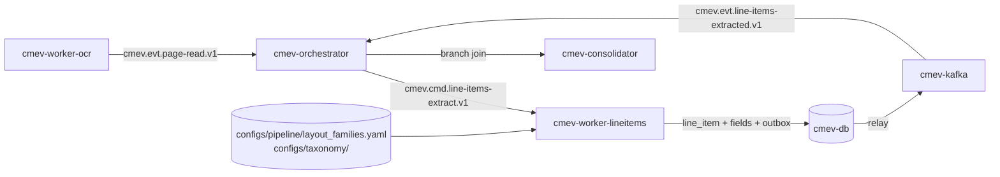

# M5 - Line-item extraction

Owner lane: 2 (Document extraction), with Lane 4 owning the vocabulary and cost basis. Runtime container: `cmev-worker-lineitems`. Code: `src/claim_cmev/documents/line_items/`. Training pipeline: none in the core plan; `pipelines/documents/` is used only if stretch S1 starts. Source: [proposal v2](../CLAIM-CMEV_project_proposal_v2.md) sections 8.1, 8.2, 8.3, 9.3, 9.4, 10 (M5), 11.1, 11.3, 12.1, 12.3, 12.4, 13.1. Status: specified for v2; not implemented, not measured.

> **Runtime note.** The user directed containerised modules with Kafka as the transport between them on 2026-09-22. Proposal v2 section 9.1 has since been rewritten to describe this same runtime directly; it originally specified one API process plus one worker, a jobs table and no broker. Every v2 domain rule is unchanged: the decision rules in section 8, the exchanged records in section 9.3, module scope in section 10, datasets in section 11 and targets in section 13.1.

> **No large language model sits in the decision path.** Part and damage integration is deterministic mask overlap in [M2](module-02-damage-segmentation.md). Vision and document integration is the deterministic rule set in [M8](module-08-consolidation-checks.md). An optional stretch service `cmev-explainer` may turn an already computed finding into a readable sentence. It is off by default and never changes a result.

## Purpose and scope

Turn the located printed text from [M4](module-04-page-reading.md) into declared repair rows, while keeping every uncertain field visible and stating how complete the extracted declaration is.

The **deterministic parser is the committed method**. It needs development and evaluation, but no model training in the core plan.

In scope: locating the repair table, grouping rows, assigning fields to columns, mapping vocabulary, parsing exact decimals, validating rows, and publishing entries with their source boxes and completeness state.

Not in scope: pen marks and revised amounts, which are [M6](module-06-pen-mark-recognition.md); cost ranges, which are [M7](module-07-reference-cost-ranges.md); any finding, which is [M8](module-08-consolidation-checks.md). A printed amount is never replaced by a pen written one here.

## Inputs, outputs and dependencies

| Direction | Contract |
| --- | --- |
| Input | `cmev.cmd.line-items-extract.v1`: envelope plus the M4 page readings and text boxes for one claim and input revision |
| Input | Versioned layout families, vocabulary aliases and parser configuration. No neural weights in the core path |
| Output | `cmev.evt.line-items-extracted.v1` with the entries and the declaration completeness state |
| Output | `line_item`, `line_item_field` and `declaration_status` rows in `cmev-db` |
| Consumers | [M6](module-06-pen-mark-recognition.md) for row linking, [M8](module-08-consolidation-checks.md) for findings, [M9](module-09-review-report.md) for review and correction |
| Dependencies | M4 pages, [data contracts](data_contracts.md), [integration contracts](integration_contracts.md), taxonomy in `configs/taxonomy/` |

### Artifacts and database rows

| Written to | Name | Content |
| --- | --- | --- |
| `cmev-db` | `line_item` | Stable entry id, page id, row band index, row kind, original row text, mapped part code, side, operation, quantity, unit price, line amount, currency, cost basis, mapping status, flags, versions |
| `cmev-db` | `line_item_field` | One row per field of per entry: field name, parsed value, original text, source box ids, status `resolved` / `uncertain` / `missing`, reason code |
| `cmev-db` | `declaration_status` | Claim, input revision, state, reasons, matched layout family, per page coverage, confirmation reference when a human set `explicitly_empty` |
| `cmev-db` | `job_run` | One row per `job_key`: status, attempts, reason, emitted event id |
| `cmev-objectstore` | None by default | The parser writes no images. M9 highlights rows over the M4 rectified page |

## Container and transport

| Item | Value |
| --- | --- |
| Container | `cmev-worker-lineitems` |
| Compose profiles | `lean`, `full`. The `lean` profile has no neural dependency at all |
| Consumer group | `cmev-worker-lineitems` |
| Consumes | `cmev.cmd.line-items-extract.v1` |
| Produces | `cmev.evt.line-items-extracted.v1`, `cmev.evt.job-failed.v1`, dead letters to `cmev.dlq.v1` |
| Message key | `claim_id` |
| Ordering | `cmev-orchestrator` emits the command after `cmev.evt.page-read.v1` for the same `claim_id` and `input_revision` |
| Delivery | At least once, idempotent through `job_key` uniqueness as in v2 section 9.6 |
| Publishing | Rows plus outbound event in one `cmev-db` transaction, relayed to `cmev-kafka` |



### Message fields read and written

| Direction | Field | Meaning |
| --- | --- | --- |
| Read | Standard envelope: `schema_version`, `claim_id`, `input_revision`, `job_key`, `versions`, `provenance`, `occurred_at`, `dedup_key`, `trace_id` | |
| Read | `pages[]` = `{page_id, page_number, page_status, text_box_granularity, rectified_width, rectified_height, boxes[]}` | Copied forward from the M4 event, so M5 does not query `cmev-db` for it |
| Read | `boxes[]` = `{box_id, text, confidence, quad_rectified, flags[]}` | |
| Read | `claim_currency`, `claim_cost_basis` | From the claim input. A document declared currency overrides only through a reviewed rule |
| Read | `versions.layout_families`, `versions.vocabulary`, `versions.parser_code` | Pins every rule that produced a row |
| Write | `entries[]` = `{entry_id, page_id, row_band_index, row_kind, original_text, part_code, side, operation, quantity, unit_price, line_amount, currency, cost_basis, mapping_status, fields[], source_box_ids[], flags[]}` | |
| Write | `declaration` = `{state, reasons[], layout_family, pages_covered[], confirmation_id}` | State is one of `complete`, `partial`, `unreadable`, `explicitly_empty` |
| Write | `processing_status`, `reasons[]` | |

### Adapter entry point

```python
# src/claim_cmev/documents/line_items/adapter.py
def run_line_item_extraction(
    request: LineItemExtractRequest,  # envelope, pages, claim_currency, claim_cost_basis
    context: WorkerContext,           # object_store, config, versions, clock, logger, trace_id
) -> LineItemExtractResult:           # records, artifacts, processing_status, reasons, metrics
    ...
```

The parser itself is a pure function over boxes, so the whole seven step pipeline is unit testable with no OCR engine and no container:

```python
# src/claim_cmev/documents/line_items/parser.py
def parse_pages(
    pages: Sequence[PageReading],
    families: LayoutFamilyConfig,
    vocabulary: VocabularyConfig,
    config: ParserConfig,
) -> ParseOutcome:                    # entries, declaration, diagnostics
    ...
```

When stretch S1 is enabled, the alternative implementation exposes the same call and returns the same `ParseOutcome` type.

### Duplicate delivery and superseded revisions

| Situation | Required behaviour |
| --- | --- |
| Same `job_key` already succeeded | No recompute. Republish the stored event with the same `dedup_key`, commit the offset |
| Same `job_key` running on another replica | Advisory lock on `job_key`. The second consumer writes nothing |
| Same `job_key` previously failed | Retry to `lineitems.max_attempts`, then `cmev.evt.job-failed.v1` and `cmev.dlq.v1` |
| `input_revision` below the claim's current revision | **Proposed:** do not recompute. Record `processing_status = superseded` with reason `superseded_input_revision` and emit no branch event. Completed rows for that revision stay unchanged and readable for their historical assessment |
| Unknown `schema_version` | Dead letter with reason `unsupported_schema_version` |

Entry ids are deterministic: `entry_id = short_hash(page_id, row_band_index, normalised original text of the row's source boxes)`. A retry on unchanged pages reproduces the same ids, so M6 mark links and M9 review actions survive. The id is never derived from row position alone or from the part name alone.

## Supported layout families

Freezing 2 to 3 layout families is a day 1 task in v2 section 12.2. They live in a versioned configuration artifact, not in code, so Lane 3 can add a template variant without a parser change. **Proposed structure** for `configs/pipeline/layout_families.yaml`:

```yaml
schema_version: "0.1.0"
families:
  - family_id: "family-a-ruled-grid"
    description: "Ruled table, five columns, amount right aligned"
    header:
      min_matched_columns: 4
      required_columns: [description, amount]
      aliases:
        description: ["DESCRIPTION", "PARTICULARS", "ITEM", "DESCRIPTION OF WORK"]
        operation:   ["OPERATION", "OPER", "TYPE", "WORK"]
        qty:         ["QTY", "QUANTITY", "NOS", "PCS"]
        unit_price:  ["UNIT PRICE", "U/PRICE", "RATE", "UNIT COST"]
        amount:      ["AMOUNT", "LINE TOTAL", "VALUE"]
    row_grouping:
      band_tolerance_frac: 0.006      # of rectified page height
      max_wrap_gap_frac: 0.010
    column_binding:
      mode: "header_anchored"
      x_tolerance_frac: 0.030
    numbers:
      decimal_separator: "."
      thousands_separator: ","
      max_decimal_places: 2
    terminators: ["SUB TOTAL", "SUBTOTAL", "GST", "TOTAL", "GRAND TOTAL", "DISCOUNT"]
    non_item_row_kinds: ["heading", "total", "tax", "repeated_header"]
```

The parser matches each page against every family and keeps the family with the most matched header columns, provided it reaches `min_matched_columns`. Ties are a failure, not a coin toss: record reason `ambiguous_layout_family`.

## Processing specification

The seven steps below are v2 section 10 M5 written as implementable rules.

### 1. Locate the repair table

1. For each page, take boxes whose text matches a header alias after case folding and whitespace collapse.
2. A header row is a band containing at least `min_matched_columns` distinct matched aliases.
3. The column x interval for each field is the matched header box's x extent, widened by `x_tolerance_frac`. Columns are ordered and must not overlap after widening; an overlap records reason `overlapping_columns` and marks affected fields uncertain.
4. The table starts at the band below the header and ends at the first band matching a terminator, or at the last band on the page. A repeated header on a continuation page restarts the column binding for that page.
5. If no family reaches `min_matched_columns` on any page, set `layout_family = unsupported`. Do not attempt a positional guess.

### 2. Group text into rows

6. Sort boxes by centre y and cut bands wherever the gap between consecutive centre y values exceeds `band_tolerance_frac` of the rectified page height. Each band is a candidate row and gets a `row_band_index`.
7. Attach a wrapped description to the row above **only when the continuation is unambiguous**: the band has text solely inside the description column, no qty, unit price or amount box, and its top is within `max_wrap_gap_frac` of the previous band's bottom. Otherwise it becomes its own row flagged `unlinked_continuation`.

### 3. Assign fields by column location

8. Assign a box to the column whose widened x interval contains the box centre x.
9. If a box's x extent spans more than one column interval by more than the tolerance, do **not** split it. Flag `spanning_box`, mark the affected fields `uncertain` and leave the row for manual correction. This is the case v2 section 10 M4 names: text across several columns without reliable field locations is flagged, not guessed.
10. Keep several operations on the same part as separate rows. Two rows naming the same part are both retained.

### 4. Map vocabulary

11. Map the description and operation text through the reviewed aliases in `configs/taxonomy/estimate_vocabulary.yaml`. Record `mapping_status` as `resolved`, `ambiguous` or `unmapped`, plus the original text.
12. Fuzzy matching is **off by default**. When enabled, a fuzzy hit above `fuzzy_min_ratio` is a **suggestion** with `mapping_status = ambiguous`. It never becomes `resolved` without a human correction.
13. Side comes from the document only. An explicit reviewed alias such as `LH`, `L/H` or `LEFT` sets `side` with `side_source = document_text`. If the resolved part is explicitly unsided in the pinned taxonomy and side text is absent, set `side = not_applicable` with `side_source = absent`. Otherwise absent or ambiguous side text remains `unknown` with `side_source = absent`. No side is ever inferred from an image, and a document stated side is a declaration, not photographic confirmation.

### 5. Parse values

14. Parse exact decimals. Strip only the configured currency symbols and spaces, and always keep the original text.
15. Reject and mark `uncertain` when the text contains letter and digit confusions such as `O` for zero or `l` for one, when separators are ambiguous, when there are more than `max_decimal_places` decimals, or when the source box confidence is below `ocr.min_box_confidence`.
16. **Never substitute zero** for a missing or unreadable value, and **never default quantity to one**. A missing value is null with a reason.
17. Currency and cost basis come from explicit document or claim information, or from a recorded correction. They are not assumed.

### 6. Validate

18. Required fields are `description` and `amount`. A row missing either is published with `row_kind = uncertain`, not dropped.
19. When quantity, unit price and line amount are all present, check `abs(quantity * unit_price - line_amount) <= amount_tolerance`. A mismatch sets flag `arithmetic_mismatch`. **Do not recompute or correct any field.**
20. Classify each row as `item`, `heading`, `total`, `tax`, `repeated_header` or `uncertain`. An uncertain row is never treated as absent.

### 7. Publish

21. Emit entries with original text, source box ids, per field status and reasons, and the declaration completeness state, then write rows, `job_run` and the outbox event in one transaction and publish `cmev.evt.line-items-extracted.v1`.

### Declaration completeness

| State | Condition | Who can set it |
| --- | --- | --- |
| `complete` | Every expected page is `complete` in M4, a family matched, the table terminated normally, and no required field is uncertain | Parser |
| `partial` | Any page is `partial`, or a family matched but some required fields are uncertain, or a continuation page was unreadable, or `layout_family = unsupported` while text was readable, or **zero rows matched on readable pages** (reason `no_rows_matched`) | Parser |
| `unreadable` | No page produced usable text, or every page is `unreadable` in M4 | Parser |
| `explicitly_empty` | The surveyor has confirmed in M9 that the estimate declares no repair rows | **Human only.** The parser can never set this |

A no-row result is therefore never a confirmed empty scope. M8 must treat `partial` and `unreadable` as reasons to withhold a possible addition, as in v2 section 8.2.

### Worked example

Continuing the M4 example on page `pg_01`, family `family-a-ruled-grid` matched 5 of 5 header columns.

| row_band_index | source boxes | row_kind | result |
| --- | --- | --- | --- |
| 7 | `bx_047` `bx_048` `bx_049` `bx_050` | `item` | part `front-bumper`, operation `replace`, qty `1`, unit price `980.00`, amount `980.00`, currency `SGD`, side `unknown` (`not_stated`), mapping `resolved` |
| 9 | `bx_059` `bx_060` `bx_061` | `uncertain` | description `FRT DOOR LH`, part `front-door`, side `left` (`document_text`), amount null with reason `ocr_letter_digit_confusion` from original text `48O.OO` |
| 14 | `bx_090` `bx_091` | `total` | Terminator `SUB TOTAL`, table ends here |

Entry `ent_7` is `FRT BUMPER | REPLACE | 1 | 980.00 | 980.00`, which becomes the record above. Entry `ent_9` keeps its original text and is published with a null amount so the surveyor can correct it. The declaration is `partial` with reason `uncertain_required_field`, so M8 will not report the estimate as a complete declaration and will not treat an unmatched damage observation as a confirmed missing repair.

## Configuration and thresholds

Parser keys live in `configs/pipeline/line_items.yaml`, layout families in `configs/pipeline/layout_families.yaml`, vocabulary in `configs/taxonomy/estimate_vocabulary.yaml`. All three are versioned and all three versions are recorded on every entry. Thresholds are selected on development and validation pages and frozen at the day 6 checkpoint. The parser is never retuned on the final test pages.

| Key | Proposed default | Note |
| --- | --- | --- |
| `lineitems.method` | `parser` | The committed method. `layoutlmv3` is the stretch S1 switch |
| `lineitems.min_matched_columns` | `4` | Per family, may be overridden in the family entry |
| `lineitems.band_tolerance_frac` | `0.006` | Of rectified page height |
| `lineitems.max_wrap_gap_frac` | `0.010` | Wrapped description attachment |
| `lineitems.x_tolerance_frac` | `0.030` | Column widening |
| `lineitems.max_decimal_places` | `2` | |
| `lineitems.amount_tolerance` | `0.01` | Exact decimal comparison for quantity times unit price |
| `lineitems.min_box_confidence` | `0.50` | Below this, a parsed field is uncertain |
| `vocab.fuzzy_enabled` | `false` | Off in the committed path |
| `vocab.fuzzy_min_ratio` | `0.90` | Only used when fuzzy matching is enabled, and only to produce suggestions |
| `lineitems.max_attempts` | `3` | Then job failed plus dead letter |
| `lineitems.skip_superseded_revisions` | `true` | See the superseded rule above |

### Stretch S1, LayoutLMv3

Stretch S1 in v2 section 12.3 is optional and gated. If it runs:

- It is selected only by the explicit switch `lineitems.method = layoutlmv3`, never automatically, and never as a fallback when the parser struggles.
- It returns the **same** `ParseOutcome`, the same entry contract, the same source box links and the same completeness states.
- Weights load only in the `full` Compose profile. The `lean` profile stays free of neural document dependencies, and a missing S1 weight never blocks container start in `lean`.
- Every entry records `versions.extraction_method` and the model and alignment versions, so no result is ever attributed to the wrong method.
- The parser is retained and stays the default. The serving choice is made on validation, before the final paired test.

## Failure and uncertainty handling

- Unreadable amounts, contradictory currencies, unsupported parts and operations, ambiguous columns and uncertain row grouping all stay visible. None of them is silently resolved.
- A missing amount is null with a reason. Zero is a value, not a placeholder.
- A missing quantity is null. It is not one.
- An arithmetic mismatch is flagged and never repaired by the parser.
- An unsupported layout is reported as such and the original page stays available for manual entry in M9.
- Repeated rows for the same part are preserved. Two operations on one part can both be legitimate, as in v2 section 8.2.
- Pen marks never reach this module. A printed amount is never overwritten here, and a pending price change never falls back to the printed amount anywhere in the system.
- Fixture mode records `provenance.source_kind = fixture` on every row.

## Acceptance criteria

Targets are hypotheses from v2 section 13.1. Complete entry scoring requires the correct part and side where applicable, operation, quantity, currency and basis, and line amount. Row and box matching tolerances are fixed on validation before the final test.

| Criterion | Evidence |
| --- | --- |
| Complete entry F1 at least 0.75 | Held out page and template variants **within** the supported layout families, with counts |
| Unsupported layouts reported separately | Never merged into the headline F1 |
| Physical team photographed pages reported separately | Generated pages and real pages are distinct denominators |
| Row association and source box accuracy reported | Every published field traces to the box ids it came from |
| No zero substitution | A test proves a missing amount stays null and a missing quantity stays null |
| No confirmed empty scope | A test proves zero rows on readable pages gives `partial` with `no_rows_matched`, never `explicitly_empty` |
| Deterministic entry ids | Re parsing unchanged pages reproduces the same entry ids, so M6 links and M9 actions survive |
| Wrapped rows and repeated headers handled | Representative fixtures for both, plus an ambiguous continuation that stays unlinked |
| Redelivery and supersession are safe | No duplicate entries, no overwrite of a historical assessment |
| S1, only if attempted | Same metrics, same frozen test cases, reported separately from the parser and from human correction |

## Implementation tasks

- [ ] Day 1: agree and freeze the 2 to 3 supported layout families with Lane 3, and write the first `layout_families.yaml`.
- [ ] Day 1: agree the initial vocabulary and cost basis with Lane 4, and write `estimate_vocabulary.yaml` with reviewed aliases only.
- [ ] Confirm the M4 text box granularity before writing the column binding rules, because line granularity changes step 3.
- [ ] Implement `parse_pages` step by step, with a unit test per step against fixed box fixtures.
- [ ] Implement exact decimal parsing with the letter and digit confusion check and the no zero substitution rule.
- [ ] Implement the declaration completeness table, including the human only `explicitly_empty` path through `cmev-api`.
- [ ] Implement deterministic entry ids and prove stability across a retry.
- [ ] Implement the consumer shell: envelope validation, `job_key` lookup, advisory lock, outbox publish, dead letter path.
- [ ] Write the `cmev-worker-lineitems` Dockerfile and its `lean` and `full` Compose entries, keeping `lean` free of neural dependencies.
- [ ] Build fixtures: wrapped description, repeated header across pages, two operations on one part, spanning box, unsupported layout, zero rows on a readable page, unreadable page.
- [ ] Reserve held out template variants before any rule tuning, by day 2.
- [ ] Report F1, row association and box accuracy by supported family and separately for unsupported layouts.

## Open decisions

| Decision | Owner | Resolve by |
| --- | --- | --- |
| Which 2 to 3 layout families are supported, and their exact header aliases | Lanes 2 and 3 | Day 1, then frozen |
| Whether a third family is dropped under the v2 section 12.4 contingency, leaving two | Lane 2 | Day 5 core cutoff |
| Whether a document stated side is trusted for photographic matching, or only as a declaration that still needs a human confirmation in M3 | Lanes 1, 2 and 4 | Day 2, this changes the M8 rule |
| Required field set: whether `operation` joins `description` and `amount` | Lanes 2 and 4 | Day 2 |
| Whether fuzzy vocabulary matching is ever enabled, and at what ratio | Lanes 2 and 4 | Day 4, suggestions only |
| Currency and cost basis precedence between the document and the claim input | Lane 4 | Day 2 |
| Whether stretch S1 starts at all, under the v2 section 12.3 gate | Lane 2 | Day 5 checkpoint |


### Parser defect remediation (2026-09-25)

A subtotal terminates a section, not the document scan. Inspect subsequent bands for new declared rows and retain later totals/taxes. Numeric regions before a repeated header on a continuation page are preserved as unparsed regions when no reliable column binding exists; the declaration is partial, never silently complete. This conservative fallback requires review rather than guessing cross-page column positions.

The unsided-part policy is recorded as `m5-estimate-vocabulary/0.2.0`. Existing vocabulary 0.1.0 outputs and stored unknown-side rows are not rewritten. The 21 part codes and their taxonomy version are unchanged.
