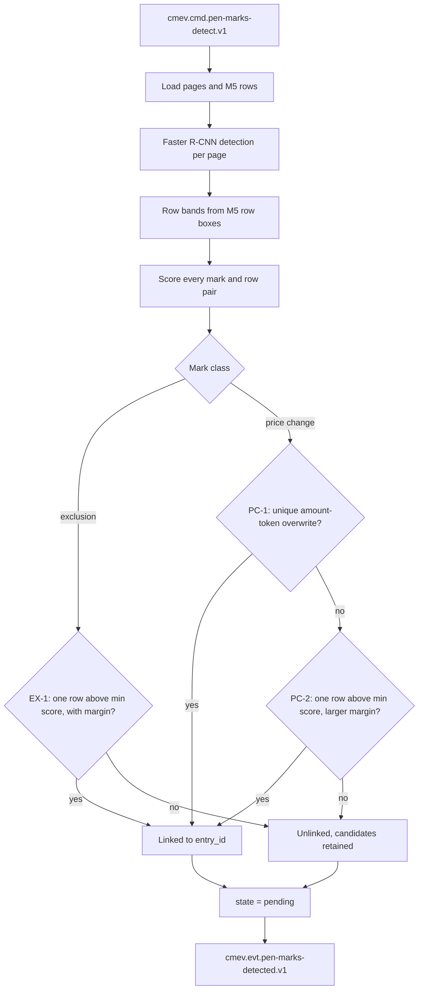

# M6 - Pen-mark recognition

Owner: Lane 3. Runtime container: `cmev-worker-penmarks`, with the mark state machine as a pure library also imported by `cmev-api`. Code: `src/claim_cmev/documents/pen_marks/`. Training pipeline: `pipelines/documents/`. Source: [proposal v2](../CLAIM-CMEV_project_proposal_v2.md) sections 2.2, 8.1, 8.4, 9.3, 9.4, 9.6, 10 (M6), 11.3, 11.4, 11.5, 12.3 and 13.1. Status: specified for v2; no code, no weights and no measurements exist.

## Purpose and scope

M6 proposes where the surveyor marked the printed workshop estimate, and links each proposal to one printed row when the geometry is unambiguous. It detects two mark classes only: an **exclusion mark**, an "X" over a row or its amount, and a **price change**, a handwritten number that replaces a printed amount.

M6 proposes. It never decides. Every proposal starts `pending`. The surveyor confirms, rejects, relinks, adds a missed mark and types the revised amount. M6 does not read handwritten digits in the core scope. A detected amount-shaped mark is a mark, not a recognised number.

Out of scope: ticks, circles, arrows, notes and any other pen mark; automatic amount reading, which is stretch S2 only; changing a printed extraction; judging whether an exclusion is correct.

Requirements covered, from the [product specification](product_specification.md): FR-22, FR-23, FR-24, FR-36 and FR-37 with [M9](module-09-review-report.md), FR-48, FR-49, FR-53, FR-54. Safety invariants: SI-01, SI-04, SI-05, SI-09.

### No language model in the decision path

No large language model takes part in any decision. M8 combines the image branch, the document branch and the cost ranges with deterministic rules only, because findings must be reproducible, version pinned and immutable. An optional stretch service `cmev-explainer` may turn an already computed finding into a readable sentence. It is off by default, it never changes a result or a state, and its use is recorded in provenance.

## Inputs, outputs and dependencies

| Direction | Contract |
| --- | --- |
| Input | Corrected page images and page transforms from [M4](module-04-page-reading.md); line-item rows with page boxes, column geometry and layout family from [M5](module-05-line-item-extraction.md) |
| Output | `PenMark` rows with class, box, score, state and resolved or candidate entry IDs; a per-page mark overlay image; a detection artifact |
| Consumers | [M8](module-08-consolidation-checks.md) gates on mark state; [M9](module-09-review-report.md) shows marks and captures the actions |
| Dependencies | [Integration contracts](integration_contracts.md), [data contracts](data_contracts.md), [model training specification](model_training_specification.md), object store, `cmev-db` |

M6 needs both M4 and M5 for the same `claim_id` and `input_revision`. Detection alone needs only the page image, but a detection without rows cannot be linked, so the module runs as one step after the orchestrator has joined both facts.

## Container and transport

| Item | Value |
| --- | --- |
| Container | `cmev-worker-penmarks` in the `full` profile. In the `lean` profile the same handler is registered inside `cmev-worker-combined`, as the [integration contracts](integration_contracts.md) describe, so the topic contract is identical either way |
| Consumer group | `cmev-worker-penmarks` |
| Consumes | `cmev.cmd.pen-marks-detect.v1` |
| Produces | `cmev.evt.pen-marks-detected.v1`; on permanent failure `cmev.evt.job-failed.v1` plus the original message to `cmev.dlq.v1` |
| Message key | `claim_id`, so all pages of one claim keep their order on one partition |
| Payload rule | Artifact references and object-store URIs only. Page bytes never travel on Kafka |

`cmev.evt.page-read.v1` is the upstream fact whose artifacts this module reads, but M6 does **not** subscribe to it. `cmev-orchestrator` joins `cmev.evt.page-read.v1` and `cmev.evt.line-items-extracted.v1`, then issues one `cmev.cmd.pen-marks-detect.v1` per claim revision. Keeping the join in the orchestrator means M6 holds no cross-topic state.

Envelope fields read on every message: `schema_version`, `claim_id`, `input_revision`, `job_key`, `versions`, `provenance`, `occurred_at`, `dedup_key`, `trace_id`.

| Payload field | Direction | Meaning |
| --- | --- | --- |
| `pages[].page_no` | read | 1-based page number |
| `pages[].corrected_image_uri` | read | Corrected page image in the object store |
| `pages[].transform_uri` | read | Homography and rotation back to the original upload |
| `pages[].width_px`, `pages[].height_px` | read | Corrected page size, needed to clip boxes |
| `pages[].quality_flags` | read | M4 flags such as `blurred`, `glare`, `partial_page` |
| `line_items_uri` | read | M5 rows with `entry_id`, row box, cell boxes and printed-amount token box |
| `layout_family` | read | Which supported family M5 matched, used for the column rules |
| `document_job_key` | read | Lineage back to the M4 and M5 jobs |
| `marks_uri` | written | Detection and linking artifact for this revision |
| `overlay_uris[]` | written | One server-rendered overlay image per page |
| `counts` | written | `exclusion`, `price_change`, `linked`, `unlinked`, `conflicting` |
| `page_failures[]` | written | Pages that could not be processed, each with a reason |
| `partial` | written | True when at least one page failed |

**Duplicate delivery.** Delivery is at-least-once. Before work starts the consumer inserts a `job` row keyed by `job_key`, which is `claim_id`, `input_revision`, `task=pen_marks`, `target=all` and a version signature of detector version and linking config version. The key form is defined in the [technical specification](technical_specification.md). A unique-constraint violation means the work is already done or running. If the stored job is `succeeded`, the consumer republishes the stored `cmev.evt.pen-marks-detected.v1` with the original `dedup_key` and commits the offset; downstream consumers drop it by `dedup_key`, so a lost event is still recovered. If the stored job is `running` and its lease has not expired, the consumer commits the offset and does nothing.

**Superseded input revision.** Detection is expensive, so M6 does not run it for a dead revision. If `input_revision` is lower than the claim's current input revision in `cmev-db`, the consumer marks the job `skipped_superseded`, emits no event and commits the offset. Marks already stored for the old revision stay readable with that revision. A human correction to a mark never re-runs M6: see [reassessment](module-08-consolidation-checks.md#reassessment-and-lineage).

## Processing specification

1. **Load and validate.** Fetch the page artifacts and the M5 rows. Send the message to the DLQ if the schema version is unknown or the layout family is missing. A page whose `quality_flags` contain `page_not_found` is recorded as a page failure, not as a page with no marks.
2. **Detect.** Run the fine-tuned Faster R-CNN, ResNet-50 FPN, COCO pretrained, on each corrected page image. It outputs boxes with class `exclusion` or `price_change` and a score. Apply the per-class score threshold, then class-wise non-maximum suppression, then the per-page cap.
3. **Map coordinates.** Keep every box in corrected-page pixels and also store the box mapped back to the original uploaded image through the M4 transform, so the evidence panel can open the original photograph.
4. **Build row bands.** For each row `r` from M5, take `row_box(r)` as the union of its cell boxes. The band extends above and below by a fraction of the row height: `band(r) = [y0 - a*h, y1 + b*h]`. The band reaches further up than down, because a revised price is usually written above the printed amount.
5. **Score candidate rows.** For a mark `m` and a row `r` compute:
   - `v`, vertical overlap: the height of `m` inside `band(r)` divided by the height of `m`;
   - `c`, mark containment: the area of `m` inside `row_box(r)` divided by the area of `m`;
   - `rc`, row coverage: the area of `m` inside `row_box(r)` divided by the area of `row_box(r)`;
   - `col`, column match: 1 when the centre of `m` lies in a column allowed for that mark class, or within `right_margin_tolerance_px` of the amount column, else 0;
   - `amt`, amount-token overlap: the area of row `r`'s printed-amount token box covered by `m`, divided by that token box area.

   `link_score = w_v*v + w_c*c + w_rc*rc + w_col*col`.
6. **Link exclusion marks, rule EX-1.** Link when exactly one row reaches `link.min_score` and leads the second best row by at least `link.margin_to_second`. Otherwise the mark is `unlinked`.
7. **Link price changes, rules PC-1 to PC-3,** applied in order:
   - **PC-1, strike or overwrite.** Link when exactly one row has `amt >= price_change.amount_overlap_min` and every other row has `amt <= price_change.amount_overlap_second_max`.
   - **PC-2, clear band.** Otherwise link when exactly one row reaches `link.min_score` and leads the second best by at least `price_change.margin_to_second`, which is deliberately larger than the exclusion margin.
   - **PC-3, ambiguous.** Otherwise leave the mark `unlinked`.
8. **Retain candidates.** Every unlinked mark stores its ordered candidate rows: all rows with `link_score >= link.candidate_min_score` or `amt > 0`, each with its component scores. Candidates are evidence for the surveyor, not a ranking to apply automatically.
9. **Detect conflicts.** A row is `conflicting` when it carries both a non-rejected exclusion mark and a non-rejected price change, or two non-rejected price changes. Duplicate exclusion boxes on one row are merged at `dedupe_iou` and counted once.
10. **Write artifacts and rows.** Write the detection artifact and one overlay per page to the object store. Insert `pen_mark` and `pen_mark_candidate` rows in `cmev-db` in one transaction with the job completion.
11. **Publish.** Emit `cmev.evt.pen-marks-detected.v1` with the artifact URIs and counts. The orchestrator counts this as one of the three facts needed before `cmev.cmd.consolidate.v1`.



## Mark states and human actions

The states are `pending`, `confirmed` and `rejected`. Detection produces `pending` only.

Action names follow the `ReviewEvent` action types in [data contracts](data_contracts.md) section 10. `cmev-api` owns the endpoints; `apply_mark_action` owns the rules.

| Action | Who | Effect | Revision effect |
| --- | --- | --- | --- |
| `confirm_mark` on an exclusion | Surveyor | `pending` to `confirmed`; the row leaves the checks | New input revision and new assessment |
| `confirm_mark` on a price change | Surveyor | `pending` to `confirmed`; requires an exact `confirmed_amount` with `confirmed_currency` and `confirmed_cost_basis` in the same request | New input revision and new assessment |
| `reject_mark` | Surveyor | `pending` to `rejected`; the detection is retained and stays visible as a dismissed proposal | New input revision and new assessment |
| `correct_mark_link` | Surveyor | Sets `entry_id` from a candidate or any row on the page, with `link_reason = human_link`; keeps the model link in `model_entry_id` | New input revision and new assessment |
| `add_mark` | Surveyor | Creates a mark with `origin = human_added`, `detection_confidence = null`, state `confirmed`; a price change still needs a `confirmed_amount` | New input revision and new assessment |
| `enter_amount` | Surveyor | Sets or replaces `confirmed_amount` on a confirmed price change; the previous value stays in the action history | New input revision and new assessment |

Every transition records `decision_action_id`, `decided_by`, `decided_at` and the `review_revision` that carried it.

Invariants, taken from proposal section 2.2 and enforced inside `apply_mark_action`:

- A `pending` price change leaves the effective price **unresolved**. The system never falls back to the printed amount, and never sends the printed amount to the cost check for that row.
- Only a `confirmed` exclusion removes a row from the checks. A `pending` exclusion withholds that row's checks instead of excluding it. A `rejected` exclusion leaves the row active.
- Confirming or rejecting one mark never changes the state of another mark. Each mark carries its own action.
- A detection failure is not proof that no mark exists. A failed or skipped page is `page_failed`, never "no marks found".
- An unlinked mark blocks a confident decision on every candidate row it touches, and blocks finalization until it is linked or rejected.
- A human-added mark is `confirmed` at creation, because a person who asserts that a mark exists has already made the decision. Its provenance is `human`, never `model`.
- Confirming a price change requires an exact decimal amount. There is no "confirmed but unknown amount" state.

## Stretch S2: TrOCR amount suggestion

Off by default. When `penmarks.trocr.enabled` is true, `cmev-worker-penmarks` crops each price-change box, runs the pinned `trocr-base-handwritten` weights and writes `trocr_suggestion` as `{text, confidence}` plus the suggestion model version. The suggestion:

- lives in a field separate from `confirmed_amount` and never overwrites it;
- stays pending until the surveyor confirms it by typing or accepting it, which records a human action;
- is never read by M8 and never contributes to an effective price;
- is marked in provenance as `model_suggestion`;
- is measured separately as exact monetary-value accuracy and is excluded from the core M6 targets.

## Python adapter entry point

The worker container and the tests call the same interface. `detect_and_link` performs I/O through injected ports. `link_marks` and `apply_mark_action` are pure and are the unit-test surface.

```python
# src/claim_cmev/documents/pen_marks/adapter.py

def detect_and_link(
    request: PenMarkRequest,      # claim_id, input_revision, pages, rows, layout_family, versions
    *,
    config: PenMarkConfig,        # loaded from configs/, carries its own config_version
    detector: PenMarkDetector,    # protocol: detect(image) -> list[Detection]
    artifacts: ArtifactStore,     # get_bytes(uri) / put_bytes(uri, data)
) -> PenMarkResult:               # marks, candidates, overlays, page_failures, counts, versions
    ...


# src/claim_cmev/documents/pen_marks/linking.py  (pure, no I/O)

def link_marks(
    detections: Sequence[Detection],
    rows: Sequence[LineItemRow],
    *,
    config: LinkingConfig,
) -> list[MarkLink]:              # entry_id or None, candidates, component scores, rule_id
    ...


# src/claim_cmev/documents/pen_marks/state.py  (pure, imported by cmev-api)

def apply_mark_action(
    mark: PenMark,
    action: MarkAction,           # kind, actor, confirmed_amount, target_entry_id, idempotency_key
    *,
    now: datetime,
) -> MarkTransition:              # new state, validation errors, decision_changing flag
    ...
```

`PenMarkDetector` has two implementations: `TorchFasterRCNNDetector` in the `full` profile and `FixturePenMarkDetector` in the `lean` profile. The fixture implementation stamps `provenance.source_kind = "fixture"` on every mark, and the UI and the printed report must show that label.

## Artifacts and database rows

| Target | Path or table | Contents |
| --- | --- | --- |
| Object store | `s3://cmev/claims/{claim_id}/{input_revision}/penmarks/detections.json` | All marks, boxes in corrected and original coordinates, scores, candidates, component scores, rule IDs, versions |
| Object store | `s3://cmev/claims/{claim_id}/{input_revision}/penmarks/page-{n}-overlay.png` | Page image with class-coloured mark boxes and linked entry labels, rendered by the server |
| `cmev-db` | `pen_mark` | The `PenMark` record of [data contracts](data_contracts.md) section 7.4: `mark_id`, `page_id`, `box_norm`, `mark_type`, `detection_confidence`, `entry_id`, `candidate_entry_ids[]`, `link_reason`, `state`, `confirmed_amount`, `confirmed_currency`, `confirmed_cost_basis`, `trocr_suggestion`, `decision_action_id`, `decided_by`, `decided_at`, `review_revision`, `origin`, `versions`. This module adds `claim_id`, `input_revision`, `original_box`, `model_entry_id` and `rule_id` |
| `cmev-db` | `pen_mark_candidate` | `mark_id`, `entry_id`, `rank`, `link_score`, `v`, `c`, `rc`, `col`, `amt`. It expands `candidate_entry_ids[]` with the scores behind the ordering |
| `cmev-db` | `review_event` | One row per human mark action, written by `cmev-api`, with actor, original value, new value, expected review revision and idempotency key |
| `cmev-db` | `job` | Job key, state, attempts, lease, error text and the `skipped_superseded` flag |

`entry_id` is nullable, and a null always carries a `link_reason`. This module uses the stable codes `mark_between_rows` for an ambiguous score, `no_candidate_row` when nothing clears the candidate threshold, `unambiguous_row_overlap` when a link was made and `human_link` after a correction, and adds `page_failed` and `rows_unavailable` for the two operational cases. `mark_type` is `exclusion` or `price_change`, and `origin` is `detector` or `human_added`.

## Configuration and thresholds

Every value below is **proposed**. Each is selected on validation pages, then frozen before the final test. All live under `configs/`, and every result row stores the config version that produced it.

`configs/models/penmarks.yaml`:

| Key | Proposed default | Note |
| --- | --- | --- |
| `detector.architecture` | `fasterrcnn_resnet50_fpn` | COCO pretrained, two classes plus background |
| `detector.weights` | `artifacts/models/penmarks/{version}/model.pt` | Registry entry, candidate or approved |
| `detector.input_min_size` / `input_max_size` | `800` / `1333` | Torchvision defaults |
| `detector.score_threshold.exclusion` | `0.50` | Tuned towards recall at or above 0.90 |
| `detector.score_threshold.price_change` | `0.45` | Tuned towards recall at or above 0.85 |
| `detector.nms_iou` | `0.50` | Class-wise |
| `detector.max_detections_per_page` | `50` | Guards against a degenerate page |
| `detector.device` | `cpu` | Set after the day-2 hardware smoke test |
| `penmarks.trocr.enabled` | `false` | Stretch S2 switch |

`configs/pipeline/penmarks_linking.yaml`:

| Key | Proposed default | Note |
| --- | --- | --- |
| `band.extend_above_row_heights` (`a`) | `0.60` | Larger than below, because prices are written above the amount |
| `band.extend_below_row_heights` (`b`) | `0.25` | |
| `link.weights` | `v 0.45`, `c 0.25`, `rc 0.15`, `col 0.15` | Must sum to 1.0, validated at load |
| `link.min_score` | `0.50` | |
| `link.margin_to_second` | `0.20` | Exclusion marks |
| `price_change.margin_to_second` | `0.35` | Deliberately stricter than exclusions |
| `price_change.amount_overlap_min` | `0.30` | PC-1 fires above this |
| `price_change.amount_overlap_second_max` | `0.10` | PC-1 is blocked when a second row is also touched |
| `link.candidate_min_score` | `0.20` | Candidate retention only, never linking |
| `column.exclusion_columns` | all columns | An X may cross the whole row |
| `column.price_change_columns` | `[unit_price, amount]` | Plus the right margin |
| `column.right_margin_tolerance_px` | `40` | Amounts written beside the column |
| `dedupe_iou` | `0.60` | Merge duplicate boxes of the same class |
| `max_marks_per_row` | `2` | Above this the row is `conflicting` |

## Failure and uncertainty handling

| Situation | Behaviour |
| --- | --- |
| One page fails to load or detect | Record it in `page_failures[]`, set `partial: true`, keep the other pages and emit the event. The page is `page_failed`, never "no marks" |
| M5 supplied no rows for a page | Detection still runs. Every mark on that page is `unlinked` with `link_reason` `rows_unavailable`. An empty row set is not an empty estimate |
| Detector weights missing or invalid | The container refuses to start. This is a startup error, not a claim result |
| Transient object-store or database error | Retry in process, 3 attempts at 2s, 8s and 30s, then `cmev.evt.job-failed.v1` and `cmev.dlq.v1` |
| Unknown schema version or missing layout family | Straight to `cmev.dlq.v1` with a reason. Never guess a layout |
| Mark box outside the page after the transform | Clip to the page, flag `box_clipped`, keep the mark |
| Zero detections on a readable page | A valid result of "no marks proposed". It is still not proof that no mark exists, and the interface says so |

## Acceptance criteria

Targets come from proposal section 13.1. They are hypotheses, not measured results. Every percentage is reported with its counts and denominators.

| Metric | Initial target | Evaluation data |
| --- | --- | --- |
| Exclusion mark per-row detection and linking precision | `>= 0.90` | Held-out team-marked physical pages |
| Exclusion mark per-row detection and linking recall | `>= 0.90` | Held-out team-marked physical pages |
| Price-change detection precision | `>= 0.85` | Held-out team-marked physical pages |
| Price-change detection recall | `>= 0.85` | Held-out team-marked physical pages |
| Price-change correct row association | Report counts, no target | Held-out team-marked physical pages |
| Unlinked rate and corrections per page | Report by writer and template | Held-out team-marked physical pages |
| Stretch S2 exact amount accuracy | Report only if attempted | Same held-out pages |

All four core numbers are measured **before** any human correction. The reviewed outcome and the number of corrections are reported separately, so a good assisted result cannot hide a weak detector. Writer, template and physical page stay in one partition, and the limited writer diversity is reported.

Behavioural criteria, all required:

- A `pending` price change never produces an effective price and never reaches the cost check.
- A `pending` exclusion never removes a row from the checks.
- Confirming one mark leaves every other mark's state unchanged.
- An ambiguous mark stays `unlinked` with its candidates retained, and is never silently attached to the best-scoring row.
- Every mark action is idempotent under a repeated idempotency key.
- A duplicate Kafka delivery produces no duplicate `pen_mark` rows.
- A message for a superseded input revision runs no model and overwrites nothing.
- Fixture detections are labelled `fixture` in every record and in the interface.

## Worked example

Page 1 of a two-page estimate, corrected to 2480 x 3508 px. M5 matched layout family `family-a` and returned rows with an amount column at x 1980 to 2300.

Rows, in corrected-page pixels:

| Entry | Description | Row box `[x0,y0,x1,y1]` | Printed-amount token box |
| --- | --- | --- | --- |
| `e-003` | REAR DOOR / REPAIR | `[620,1296,2300,1354]` | `[2040,1300,2290,1342]` |
| `e-004` | HEADLAMP LH / RPL | `[620,1354,2300,1412]` | `[2040,1362,2290,1404]` |
| `e-005` | FRT BUMPER / REPLACE | `[620,1420,2300,1478]` | `[2040,1428,2290,1470]` |

Detection A, an X over the rear-door amount: class `exclusion`, box `[1850,1300,2320,1362]`, score `0.88`.

- Row `e-003`: `band = [1261.2, 1368.5]`, `v = 1.00`, `c = 0.87`, `rc = 0.25`, `col = 1`, `link_score = 0.855`.
- Row `e-004`: `band = [1319.2, 1426.5]`, `v = 0.69`, `c = 0.13`, `rc = 0.04`, `col = 1`, `link_score = 0.499`.
- The best score `0.855` clears `0.50` and the lead `0.356` clears `0.20`, so rule EX-1 links the mark to `e-003` in state `pending`.

Detection B, a handwritten `980` in the gap above the front-bumper amount: class `price_change`, box `[2005,1381,2210,1441]`, score `0.79`.

- `amt(e-004) = 0.37` and `amt(e-005) = 0.21`. PC-1 needs the runner-up at or below `0.10`, so PC-1 does not fire.
- `link_score(e-004) = 0.80` and `link_score(e-005) = 0.51`. The lead is `0.29`, below the price-change margin of `0.35`, so PC-2 does not fire.
- PC-3 applies. The mark stays `unlinked` with `link_reason = mark_between_rows` and candidates `[e-004 at 0.80, e-005 at 0.51]`.

This is the intended behaviour. A number written between two amounts is genuinely ambiguous, and one tap from the surveyor is cheaper than a confident wrong link.

Review. The surveyor opens the evidence panel, sees the two candidates, relinks the mark to `e-005`, confirms it and types `980.00`. Stored: `entry_id = e-005`, `model_entry_id = null`, `state = confirmed`, `confirmed_amount = "980.00"`, `confirmed_currency = "SGD"`, `confirmed_cost_basis = "single_part_pre_tax_no_discount_v1"`, with actor and timestamp in the `review_event` row. They also confirm detection A. The claim moves to a new input revision, `cmev-api` publishes `cmev.cmd.consolidate.v1` with the image and OCR artifacts reused by lineage, and no neural model re-runs.

Result handed to M8: `e-003` is excluded and not checked; `e-005` has a resolved effective price of `980.00` and is checked; `e-004` is untouched and keeps its printed amount as its effective price.

## Implementation tasks

- [ ] Freeze the two mark classes, the marking convention and the labelling guide with Lane 3 and the page-collection group.
- [ ] Define the `PenMark`, `PenMarkCandidate` and `MarkAction` records with Lane 5 in [data contracts](data_contracts.md) and [integration contracts](integration_contracts.md).
- [ ] Build the synthetic marked-page generator on top of the Lane 3 estimate generator, preserving mark class, box and true row association.
- [ ] Collect and label about 60 team-marked physical pages, with writer, template and physical-page groups allocated before any tuning.
- [ ] Implement `link_marks` as a pure function, with unit tests for EX-1, PC-1, PC-2, PC-3, conflicts and duplicate boxes.
- [ ] Implement `apply_mark_action` with the state machine and its invariants, and export it for `cmev-api`.
- [ ] Fine-tune Faster R-CNN on synthetic pages plus the development subset of team-marked pages, and record the registry manifest.
- [ ] Select score, band, weight and margin thresholds on the validation group only, then freeze them into `configs/`.
- [ ] Implement the Kafka consumer, job-key idempotency, superseded-revision skip, retry and DLQ paths.
- [ ] Render the page overlay on the server and check that boxes align after the M4 transform.
- [ ] Measure the four core targets on the held-out team-marked pages before correction, with counts by writer and template.
- [ ] Only if the day-5 gate allows, implement stretch S2 behind its configuration switch.

## Open decisions

- The conflict policy when one row carries both a confirmed exclusion and a confirmed price change. The current rule blocks the row as `conflicting` and asks the surveyor to reject one. The team must decide whether a confirmed exclusion should instead win automatically.
- Whether a human-added mark starts `confirmed`, the current rule, or `pending`. The current rule avoids asking one person to confirm their own assertion twice.
- Whether `cmev-worker-penmarks` should also subscribe to `cmev.evt.page-read.v1` to start detection before rows exist. That would cut latency and add cross-topic state, so it is currently rejected in favour of the orchestrator join.
- All score thresholds, band fractions, weights and margins. They are placeholders until validation data exists.
- Whether the right-margin tolerance needs to be set per layout family.
