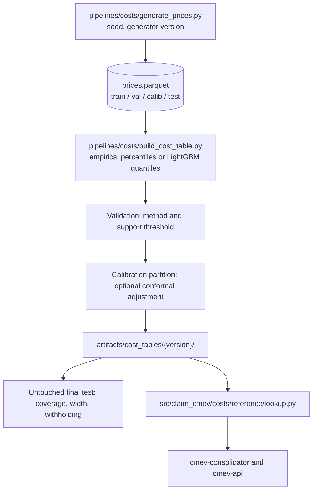

# M7 - Reference cost ranges

Owner: Lane 4. Runtime: **offline only, never served**. No container consumes Kafka for M7. Code: `src/claim_cmev/costs/reference/`, pipeline `pipelines/costs/`. Published artifacts: `artifacts/cost_tables/<version>/`. Source: [proposal v2](../CLAIM-CMEV_project_proposal_v2.md) sections 8.3, 9.3, 9.4, 9.5, 10 (M7), 11.6, 11.8, 12.4, 13.1, 13.4 and 14 (R5). Status: specified for v2; no generator, no table and no measurements exist.

## Purpose and scope

M7 builds a versioned table of synthetic reference price ranges and publishes it as a frozen artifact. Each row gives a lower bound, an upper bound and the number of **independent base cases** that support it. [M8](module-08-consolidation-checks.md) looks the range up through a read-only reader; it never calls a model.

The cost key is **part, operation, vehicle class and currency**, under one versioned fixed cost basis. There is no model year, no side and no damage type in the key, in the generator or in the model features. Model year stays claim metadata for display.

All prices in this module are synthetic and generated by a documented rule set with a recorded seed. They test range logic, calibration and withholding behaviour. They do **not** establish real repair-price accuracy, market drift, savings or fraud. Every published row and every screen that shows a range carries the synthetic marker.

Requirements covered, from the [product specification](product_specification.md): FR-29 and FR-30 jointly with [M8](module-08-consolidation-checks.md), FR-48. Safety invariants: SI-07, SI-08, SI-10, SI-11.

### No language model in the decision path

No large language model takes part in any decision. M8 combines the image branch, the document branch and the cost ranges with deterministic rules only, because findings must be reproducible, version pinned and immutable. An optional stretch service `cmev-explainer` may turn an already computed finding into a readable sentence. It is off by default, it never changes a result or a state, and its use is recorded in provenance.

## Inputs, outputs and dependencies

| Direction | Contract |
| --- | --- |
| Input | Generated price records from `pipelines/costs/generate_prices.py`, the frozen taxonomy in `configs/taxonomy/`, the cost basis definition and the split configuration |
| Output | Frozen table under `artifacts/cost_tables/<version>/`, a build manifest, a metrics report, a build membership file and an exclusion report |
| Consumers | [M8](module-08-consolidation-checks.md) through `lookup_range`; `cmev-api` for the range detail shown in the review overview and the printed report |
| Dependencies | [Data contracts](data_contracts.md), [model training specification](model_training_specification.md), [evaluation plan](evaluation_plan.md) |

The table is read-only for every runtime container. `cmev-api` and `cmev-consolidator` mount `artifacts/cost_tables/` read-only, or fetch the table objects from `cmev-objectstore` at start.

## Container and transport

M7 has no container and no consumer group. It runs as an offline pipeline on a workstation, Colab or Kaggle, and never inside a claim request. Its only runtime surface is the reader library.



A published table is immutable. A new build gets a new `table_version`. A new table **never** changes an existing assessment, because every assessment pins the table version it used and earlier tables stay readable.

## The cost key and the fixed basis

| Dimension | Values | Source |
| --- | --- | --- |
| `part_code` | Up to 18 eligible part categories. The 21 HITL part categories minus `front-wheel`, `back-wheel` and `licence-plate` | `configs/taxonomy/parts.yaml` |
| `operation` | `repair`, `replace`, `paint` | `configs/taxonomy/operations.yaml` |
| `vehicle_class` | Four classes: `hatchback_small`, `sedan_standard`, `suv_crossover`, `van_commercial` (**proposed**) | `configs/taxonomy/vehicle_classes.yaml` |
| `currency` | `SGD` only | Fixed |

The grid holds at most `18 x 3 x 4 = 216` keys. The eligible part and operation combinations are frozen in `configs/costs/eligible_keys.yaml`. Implausible combinations, for example `paint` on `windshield`, are excluded deliberately and never generated just to fill the grid.

The fixed cost basis is `single_part_pre_tax_no_discount_v1`:

- currency `SGD`; quantity exactly `1`; before tax; no discounts;
- `replace` means part supply only; `repair` means repair labour only; `paint` means paint materials and labour;
- repair, replacement and paint never share a range.

Any amount that does not match this basis receives no cost comparison. M8 enforces that; M7 only publishes the basis version so that the mismatch can be detected.

## Build task 1: the synthetic price generator

`pipelines/costs/generate_prices.py`. The generator replaces the v1 price file, which was never supplied. Verified on 2026-09-22: no price dataset exists in this repository.

1. Load the eligible key list and the base price per key from `configs/costs/base_prices.yaml`. Each eligible key has one documented base price with a short justification note.
2. Create **base cases**. A base case is one independent repair situation: `base_case_id`, a key, a vehicle instance, a synthetic date and a base-case multiplier drawn from a documented distribution.
3. Create **quotes** from each base case. One base case yields 1 to 5 quote records, each with its own `record_id` and `workshop_id` and a workshop factor plus noise. Quotes from one base case are correlated by construction and must never count as independent support.
4. Apply deliberate **sparsity**. A recorded subset of keys, **proposed** 15 to 25 percent, receives fewer base cases than the support threshold, so withholding can be measured. A further recorded subset receives no records at all, so an absent key can be measured.
5. Emit 5000 to 10000 records in total. Every record carries `record_id`, `base_case_id`, `workshop_id`, `part_code`, `operation`, `vehicle_class`, `currency`, `cost_basis`, `amount` as a decimal string, `synthetic_date`, `generator_version`, `seed` and `provenance.source_kind = "synthetic"`.
6. Write `data/processed/prices/<generator_version>/prices.parquet` plus a generator manifest. The file stays in an ignored data location; only the manifest and the metrics are tracked.

Model year, side and damage type never enter the generator. Left and right parts share one price by synthetic convention, which is a generation rule and never resolves photographic side identity.

Ordinary prices and injected anomalies are generated **separately**, into different base cases, so that an anomaly label comes from the experiment and never from the model's own interval.

## Build task 2: the two methods

Both methods publish the same lookup key, the same basis and the same row schema, so M8 cannot tell them apart except through `method` in the manifest.

| Method | Definition | Role |
| --- | --- | --- |
| `empirical_percentile` | Per key, the 5th and 95th percentiles of the training amounts, computed with a documented percentile definition, one value per base case first so repeated quotes cannot dominate | Baseline and **contingency fallback** under proposal section 12.4 |
| `lightgbm_quantile` | Two LightGBM regressors with `objective="quantile"`, `alpha=0.05` and `alpha=0.95`, features `part_code`, `operation`, `vehicle_class` as categoricals. Bounded search, small trees, early stopping on validation | The learned comparator for RQ4 |

Optional conformal adjustment, Conformalized Quantile Regression, is fitted on the **separate calibration partition** only, never on training, validation or test. It is selected on validation and then frozen.

If the LightGBM comparison cannot finish, publish the empirical table and report the missing learned comparator and the effect on the course evidence. Do not invent model results.

## Split discipline

| Partition | Use | Rule |
| --- | --- | --- |
| `train` | Fit percentiles or LightGBM | Grouped by `base_case_id` |
| `validation` | Select the method, the support threshold and any conformal option | Grouped, disjoint base cases |
| `calibration` | Fit the conformal adjustment if it is selected | Grouped, disjoint base cases, used only for this |
| `test` | Final coverage, width and withholding, run **once** | Grouped, untouched until the policy is frozen |

Rules, all required:

- Every quote of one base case stays in one partition. Splitting by `record_id` is a defect.
- Partitions carry a documented `synthetic_date` cutoff so a reproducible recency rule can be tested.
- Test membership is reserved before any fitting, ideally by day 2, and its hash is recorded.
- Intervals are never adjusted in response to final-test results. A shortfall is reported as a shortfall.
- Reference base cases and the base cases that generate test estimate amounts are disjoint.

## Support rule

`independent_base_case_count` counts **distinct `base_case_id` values** among the eligible training records for a key. It never counts quotes, records or workshops.

`support_status` takes the two values of the `ReferenceCostRange` contract, `supported` and `withheld`. A withheld row always carries a `withheld_reason` drawn from the lookup reason codes in [application platform](application_platform.md) section 10, so the table, the API and the finding all name the same cause.

- A key with `independent_base_case_count < min_independent_base_cases` publishes **no range**: `support_status = "withheld"`, `withheld_reason = "insufficient_support"`, with the actual count.
- A key in the frozen grid with no eligible records publishes `support_status = "withheld"` and `withheld_reason = "no_records"`.
- A part and operation pair outside the frozen eligible list publishes `support_status = "withheld"` and `withheld_reason = "unsupported_combination"`.
- A key that is not in the frozen grid at all has no row, and `lookup_range` returns `no_key`. That is different from a key that exists and withholds.
- A withheld key is **never** published as a zero range, a zero-width range or a wide fallback range.
- A computed interval with `lower > upper`, a non-finite bound or a negative bound fails validation. The build fails; a malformed interval is never published and never served.
- A zero-width interval, `lower == upper`, is valid and publishable, but M8 must not divide by its width.

`min_independent_base_cases` is **proposed** at `8`, searched over `3, 5, 8, 12, 20` on validation and then frozen. It is not a measured value.

## Published table format

`artifacts/cost_tables/<table_version>/`:

| File | Contents |
| --- | --- |
| `ranges.parquet` | One row per key in the frozen grid, supported and withheld alike |
| `ranges.csv` | Same content, for human inspection and review |
| `manifest.json` | Build identity, see below |
| `metrics.json` | Coverage, width, withheld fraction and per-support-group results |
| `members.csv` | Every `base_case_id` and `record_id` included, with its partition |
| `exclusions.csv` | Every record excluded, with a reason code |
| `model/` | LightGBM boosters and the conformal parameters, only when the learned method is published |
| `config.snapshot.yaml` | The exact taxonomy, eligible keys, base prices and build configuration used |

`ranges.parquet` row schema:

| Field | Type | Note |
| --- | --- | --- |
| `range_id` | string | Stable within the table. Pinned into a finding as `applied_range_id` |
| `part_code`, `operation`, `vehicle_class`, `currency` | string | The cost key |
| `cost_basis` | string | `single_part_pre_tax_no_discount_v1` |
| `support_status` | enum | `supported` or `withheld` |
| `lower_amount`, `upper_amount` | decimal string, nullable | Null only when `support_status` is `withheld`; a null always carries `withheld_reason` |
| `independent_base_case_count` | integer | Distinct base cases, never quotes |
| `record_count` | integer | Reported for transparency, never used as support |
| `withheld_reason` | enum, nullable | `insufficient_support`, `no_records`, `unsupported_combination` |
| `method` | enum | `empirical_percentile` or `lightgbm_quantile` |
| `nominal_coverage` | decimal string | `0.90` |
| `observed_calibration` | object, nullable | Validation coverage and width, or a reference to `metrics.json` |
| `as_of_date`, `cutoff_date` | date | From the generator and the split configuration |
| `table_version` | string | Repeated on every row so an extracted row stays identifiable |
| `synthetic` | boolean | Always `true` in this project |
| `provenance` | object | Generator reference, version and seed |

`manifest.json` fields: `table_version`, `built_at`, `built_by`, `code_revision`, `generator_version`, `generator_seed`, `method`, `conformal` with its partition hash or `null`, `min_independent_base_cases`, `split_config_hash`, `partition_hashes`, `cutoff_date`, `taxonomy_version`, `eligible_keys_hash`, `cost_basis`, `currency`, `nominal_coverage`, `key_count`, `supported_key_count`, `withheld_key_count`, `metrics_ref`, `members_ref`, `exclusions_ref`, `synthetic: true` and `status` of `candidate` or `approved`.

Promotion is atomic: build into a temporary directory, validate, then move into place and register the version. A failed candidate never replaces an active table. `approved` here means table-release status and has nothing to do with claim approval.

## Python adapter entry points

```python
# pipelines/costs/generate_prices.py

def generate_prices(
    *,
    config: GeneratorConfig,       # eligible keys, base prices, sparsity plan, seed
    out_dir: Path,
) -> GeneratorManifest:            # record and base-case counts per key, seed, generator_version
    ...


# pipelines/costs/build_cost_table.py

def build_cost_table(
    records_path: Path,
    *,
    config: CostTableConfig,       # method, splits, support threshold, conformal option
    out_dir: Path,                 # artifacts/cost_tables/{table_version}/
) -> CostTableManifest:            # raises BuildValidationError on crossed or invalid bounds
    ...


# src/claim_cmev/costs/reference/lookup.py   (read-only, no model, imported by cmev-api and cmev-consolidator)

def load_table(table_version: str, *, tables_root: Path) -> CostTable:
    ...

def lookup_range(
    table: CostTable,
    key: CostKey,                  # part, operation, vehicle_class, currency, cost_basis
) -> RangeLookup:                  # status, bounds as Decimal, support, reason, table_version
    ...
```

`lookup_range` never extrapolates, never falls back to another vehicle class, never pools operations and never converts currency. A key that is not in the table returns `no_key`.

## Configuration and thresholds

All values are **proposed** and selected on validation data, then frozen. They live under `configs/costs/`.

| Key | File | Proposed default |
| --- | --- | --- |
| `generator.seed` | `generator.yaml` | `20260922` |
| `generator.total_records` | `generator.yaml` | `8000` |
| `generator.quotes_per_base_case` | `generator.yaml` | `1..5`, mean about `3` |
| `generator.workshop_count` | `generator.yaml` | `6` |
| `generator.base_case_sigma` | `generator.yaml` | `0.12` lognormal |
| `generator.workshop_sigma` | `generator.yaml` | `0.06` lognormal |
| `generator.sparse_key_fraction` | `generator.yaml` | `0.20` |
| `generator.empty_key_fraction` | `generator.yaml` | `0.05` |
| `build.method` | `cost_table.yaml` | `empirical_percentile` until the LightGBM comparison is selected on validation |
| `build.nominal_coverage` | `cost_table.yaml` | `0.90` |
| `build.min_independent_base_cases` | `cost_table.yaml` | `8` |
| `build.conformal` | `cost_table.yaml` | `none`, options `none` or `cqr` |
| `build.percentile_definition` | `cost_table.yaml` | `linear` interpolation, per base-case median first |
| `build.split.ratios` | `splits.yaml` | `train 0.55`, `validation 0.15`, `calibration 0.10`, `test 0.20` |
| `build.split.group_key` | `splits.yaml` | `base_case_id` |
| `lgbm.num_leaves`, `max_depth`, `n_estimators`, `learning_rate` | `lgbm.yaml` | `15`, `4`, `400`, `0.05`, with early stopping on validation |
| `rounding` | `cost_table.yaml` | `Decimal`, 2 places, `ROUND_HALF_UP`, applied once at publication |

Money is a decimal string with a currency and a cost basis in every file and every message. Floats are never used for money at any stage, including inside the build. LightGBM works on floats internally; its output is quantised to a `Decimal` with 2 places before it is written.

## Failure and uncertainty handling

| Situation | Behaviour |
| --- | --- |
| A key has too few independent base cases | `support_status = "withheld"`, `withheld_reason = "insufficient_support"`, bounds null, actual count published |
| A key has no records | `support_status = "withheld"`, `withheld_reason = "no_records"` |
| The lower bound exceeds the upper bound | Build validation error. Nothing is published |
| A bound is non-finite, negative or not a decimal | Build validation error |
| Repeated quotes inflate a count | Prevented by definition: support counts distinct `base_case_id` only. A unit test asserts this on a constructed case |
| The LightGBM run fails or is dropped | Publish the empirical table, record `method = "empirical_percentile"` and report the missing comparator |
| A record has an unknown part, operation or class | Excluded, with a reason in `exclusions.csv`. It is never mapped to a near neighbour |
| A record has a different cost basis or currency | Excluded. Bases and currencies are never pooled |
| The table file is missing at runtime | An operational error in `cmev-api` or `cmev-consolidator`, clearly different from a valid table that holds no matching key |

A withheld or absent range is never a signal that a price is acceptable. M8 records the cost check as `not_evaluated` with the reason from the lookup.

## Acceptance criteria

Targets come from proposal sections 13.1 and 13.4. They are hypotheses, not measured results.

| Metric | Initial target | Evaluation data |
| --- | --- | --- |
| Empirical interval coverage at nominal 90 percent | `0.85` to `0.95` on eligible records | Untouched final-test partition |
| Coverage by support group | Report for each group, no single target | Final test, grouped by `independent_base_case_count` |
| Mean and median interval width per key | Report, with the amount scale | Final test |
| Available-range rate | Report the share of keys and of test entries that receive a range | Final test |
| Ordinary-price exceedance rate | About 10 percent for a calibrated 90 percent interval, reported as measured | Experiment C in proposal section 13.2 |
| Injected-anomaly precision and recall | Report at a stated anomaly prevalence, by change magnitude | Experiment C, separate injected set |
| RQ4 reduced-support behaviour | Report coverage, width, exceedance, anomaly precision and recall, and the withheld fraction as independent base cases fall | Final test at reduced support |

Build criteria, all required:

- Rebuilding from `manifest.json` and the recorded seed reproduces the same table within documented numerical limits.
- Every published row carries its support count, cutoff date, table version, method and synthetic marker.
- No crossed, negative, non-finite or zero-substituted bound reaches `ranges.parquet`.
- Repair, replacement and paint never share a range, and no currency is converted.
- Support never counts more than one value per base case.
- A newly published table leaves every existing assessment unchanged, verified by re-rendering an earlier assessment after a new build.
- An interval exceedance is reported as an unusual synthetic price, never as proof of an incorrect price or of fraud.

## Worked example

Generator run `gen-2026.09.1`, seed `20260922`, 8000 records over 204 eligible keys.

Key `front-bumper / replace / sedan_standard / SGD` under `single_part_pre_tax_no_discount_v1`. Training records for this key: 141 quotes from 47 distinct base cases across 6 workshops. `independent_base_cases = 47`, which clears the threshold of 8.

Published row:

```json
{
  "part_code": "front-bumper",
  "operation": "replace",
  "vehicle_class": "sedan_standard",
  "currency": "SGD",
  "cost_basis": "single_part_pre_tax_no_discount_v1",
  "support_status": "supported",
  "lower_amount": "620.00",
  "upper_amount": "1020.00",
  "independent_base_case_count": 47,
  "record_count": 141,
  "withheld_reason": null,
  "method": "empirical_percentile",
  "nominal_coverage": "0.90",
  "as_of_date": "2026-09-22",
  "cutoff_date": "2026-06-30",
  "table_version": "2026.09.1",
  "provenance": {"source_kind": "synthetic", "generator_version": "gen-2026.09.1", "seed": 20260922}
}
```

A sparse key in the same build, `wing-mirror / replace / van_commercial / SGD`: 9 quotes from 3 base cases, below the threshold of 8.

```json
{
  "part_code": "wing-mirror", "operation": "replace", "vehicle_class": "van_commercial", "currency": "SGD",
  "support_status": "withheld", "lower_amount": null, "upper_amount": null,
  "independent_base_case_count": 3, "record_count": 9,
  "withheld_reason": "insufficient_support", "method": "empirical_percentile", "table_version": "2026.09.1"
}
```

Downstream. The claim's assessment pins `cost_table_version = "2026.09.1"`. M8 compares the confirmed effective price of `980.00` for the front bumper against `620.00` to `1020.00` and returns `within_range`. For the wing mirror it records `cost_check = not_evaluated` with reason `insufficient_support`, while the photo check is unaffected and can still be `supported`. A later table `2026.10.1` with a different range for the front bumper leaves this assessment untouched, because the assessment reads `2026.09.1`.

## Implementation tasks

- [ ] Freeze the eligible part and operation combinations, the four vehicle classes and the base prices in `configs/costs/` and `configs/taxonomy/`, with Lanes 1 to 3 agreeing the vocabulary.
- [ ] Freeze `single_part_pre_tax_no_discount_v1` and record its definition in [data contracts](data_contracts.md).
- [ ] Implement `generate_prices` with base-case and quote identifiers, the sparsity plan, the recorded seed and a generator manifest.
- [ ] Deliver a price-generator interface on day 1 so that Lanes 2 and 5 are not blocked.
- [ ] Implement grouped splits with a date cutoff; reserve the final-test membership and record its hash before any fitting.
- [ ] Implement the empirical percentile method with per base-case aggregation first.
- [ ] Implement the bounded LightGBM quantile method with early stopping on validation.
- [ ] Select the method and `min_independent_base_cases` on validation only, then freeze both.
- [ ] Implement optional conformal adjustment on the calibration partition, or record that it was not selected.
- [ ] Implement build validation: crossed bounds, non-finite bounds, negative bounds, basis and currency mixing, and support counted by quote instead of base case.
- [ ] Implement atomic promotion, the version registry row and read-only mounting for `cmev-api` and `cmev-consolidator`.
- [ ] Implement `load_table` and `lookup_range` with no extrapolation and no fallback.
- [ ] Run the final-test evaluation once and publish `metrics.json` with counts and denominators.
- [ ] Run the RQ4 reduced-support experiment and the ordinary versus injected-anomaly experiment separately.
- [ ] Verify that a new table leaves an existing assessment unchanged.

## Open decisions

- The four vehicle classes and their mapping from make and model. Currently **proposed**, and an unmapped vehicle must resolve to `unknown`, which withholds the cost check rather than guessing a class.
- `min_independent_base_cases`, currently proposed at 8, pending the validation search.
- Whether the conformal adjustment is used at all. It costs a whole partition, and the empirical baseline may already sit inside 85 to 95 percent.
- The percentile definition for small samples, and whether to aggregate each base case by its median or its mean before taking percentiles.
- Whether `paint` should be split into materials and labour in a later basis version. Not in v2.
- Stretch S3, importing synthetic final approvals into a new build, stays out of the core scope and is described in proposal section 12.3.
