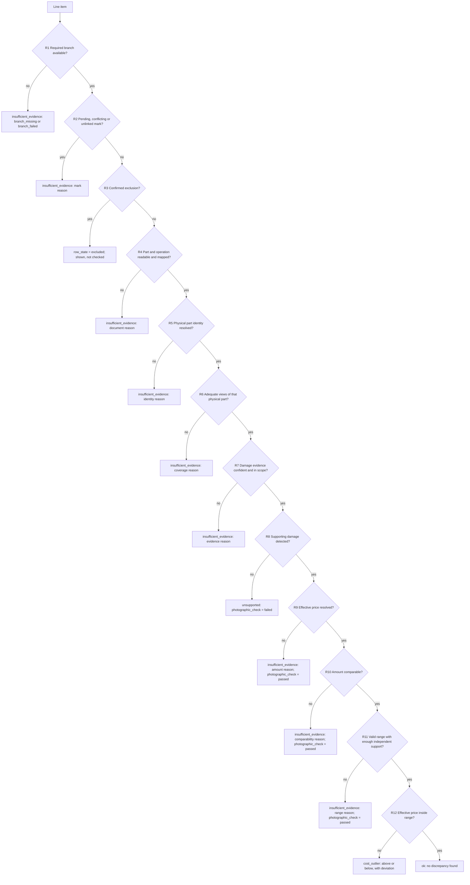

# M8 - Consolidation and checks

Owner: Lane 4. Runtime container: `cmev-consolidator`, Compose profiles `lean` and `full`. Code: `src/claim_cmev/comparison/`. No neural weights and no pipeline path. Source: [proposal v2](../CLAIM-CMEV_project_proposal_v2.md) sections 2.4, 8.1, 8.2, 8.3, 8.4, 9.2, 9.3, 9.4, 9.6, 10 (M8), 13.2 and 13.3. Status: specified for v2; no code and no measurements exist.

## Purpose and scope

M8 is where the system decides. It takes the image branch, the document branch and the pinned reference cost table and produces immutable findings by deterministic rule.

It runs three checks:

| Check | Question | Stored on |
| --- | --- | --- |
| Photo evidence | Is damage visible on the same physical part, with resolved identity and adequate views? | Each line item |
| Cost range | Is the effective price inside the reference range for the same part, operation and vehicle class? | Each line item |
| Missing repairs | Is supported visible damage absent from sufficiently complete declarations? | The assessment, plus zero or more possible additions |

M8 does not approve a claim, choose a settlement amount, detect fraud, infer hidden damage or choose a repair operation. Exceeding a reference interval means an unusual synthetic price, nothing more.

Requirements covered, from the [product specification](product_specification.md): FR-25 to FR-33, FR-42, FR-48, FR-49, FR-53, FR-54. Safety invariants: SI-01 to SI-11.

### No language model in the decision path

No large language model takes part in any decision. M8 combines the image branch, the document branch and the cost ranges with deterministic rules only, because findings must be reproducible, version pinned and immutable. An optional stretch service `cmev-explainer` may turn an already computed finding into a readable sentence. It is off by default, it never changes a result or a state, and its use is recorded in provenance.

The reason is practical. A finding must give the same answer for the same inputs every time, must be explainable by naming the rule that fired, must be pinned to a version set so a printed report can be reproduced years later, and must never invent a fact that no module produced. A sampled language model gives none of those four properties. Every sentence the surveyor reads is rendered from a reason code in the table below, so the wording is reviewable and testable.

## Inputs, outputs and dependencies

| Direction | Contract |
| --- | --- |
| Input | Part summary and coverage from [M3](module-03-part-summary-coverage.md); line items and declaration completeness from [M5](module-05-line-item-extraction.md); pen marks and their states from [M6](module-06-pen-mark-recognition.md); the pinned table from [M7](module-07-reference-cost-ranges.md); claim metadata including vehicle class and currency |
| Output | One immutable `assessment` with its findings, per-check results, reason codes, evidence references and version set; zero or more `ProposedRepairAddition` rows |
| Consumers | [M9](module-09-review-report.md) review overview, evidence panel and print view |
| Dependencies | [Integration contracts](integration_contracts.md), [data contracts](data_contracts.md), [evaluation plan](evaluation_plan.md) |

M8 loads no model. Its only external read besides the branch artifacts is the frozen cost table through `lookup_range`.

## Container and transport

| Item | Value |
| --- | --- |
| Container | `cmev-consolidator`, profiles `lean` and `full`. It runs in `lean` because it carries no weights, so the rules can be developed against fixtures |
| Consumer group | `cmev-consolidator` |
| Consumes | `cmev.cmd.consolidate.v1` |
| Produces | `cmev.evt.assessment-ready.v1`; on permanent failure `cmev.evt.job-failed.v1` plus the original message to `cmev.dlq.v1` |
| Message key | `claim_id` |
| Payload rule | Artifact references and object-store URIs only |

`cmev-orchestrator` joins `cmev.evt.part-summarised.v1`, `cmev.evt.line-items-extracted.v1` and `cmev.evt.pen-marks-detected.v1` for one `claim_id` and `input_revision`, then issues one `cmev.cmd.consolidate.v1`. `cmev-api` issues the same command directly for a reassessment. M8 subscribes to the command only and holds no cross-topic state.

Envelope fields read: `schema_version`, `claim_id`, `input_revision`, `job_key`, `versions`, `provenance`, `occurred_at`, `dedup_key`, `trace_id`.

| Payload field | Direction | Meaning |
| --- | --- | --- |
| `trigger` | read | `initial` or `reassessment` |
| `part_summary_uri`, `coverage_uri` | read | M3 artifacts, nullable when the image branch is absent |
| `line_items_uri`, `completeness` | read | M5 artifacts, nullable when the document branch is absent |
| `marks_uri` | read | M6 artifact, nullable |
| `cost_table_version` | read | The table this assessment pins. `cmev-api` chooses it at intake and never changes it afterwards |
| `branch_states` | read | Per branch: `succeeded`, `failed`, `absent` or `partial`, with reasons |
| `reuse_lineage[]` | read | Artifacts carried forward unchanged from an earlier revision, each with its producing job key and versions |
| `prior_assessment_revision` | read | Present on a reassessment, for lineage only. It never seeds a result |
| `assessment_revision` | written | New immutable revision |
| `assessment_uri` | written | Full finding set in the object store |
| `result_counts` | written | Count per overall result |
| `incomplete`, `incomplete_reasons[]` | written | True when a required branch failed or is partial |
| `superseded` | written | True when this assessment is for a revision that is no longer current |

**Duplicate delivery.** The consumer inserts a `job` row keyed by `job_key`, which is `claim_id`, `input_revision`, `task=consolidate`, `target=all` and a version signature of rule config version and `cost_table_version`. The key form is defined in the [technical specification](technical_specification.md). A unique-constraint violation means the assessment already exists. The consumer republishes the stored `cmev.evt.assessment-ready.v1` with the original `dedup_key` and commits the offset. Because the rules are deterministic and every input is pinned, a repeat would produce an identical assessment anyway; the constraint simply prevents a duplicate row.

**Superseded input revision.** Unlike [M6](module-06-pen-mark-recognition.md), M8 still does the work. Rule evaluation is cheap and the result is a legitimate historical assessment for that revision, which the audit trail needs. The consumer writes the assessment against its own `input_revision`, sets `superseded: true` on the event, and does **not** advance the claim's `current_assessment_revision`. `cmev-api` never shows a superseded assessment as current and never prints one.

## Processing specification: the ordered rules

The flow below is proposal section 8.1 with rule identifiers added. Apply the rules in order for each line item. The first rule that produces an outcome stops the flow for that item.



| Rule | Inputs | Condition | Outcome | Reason code |
| --- | --- | --- | --- | --- |
| R1 | `branch_states` | A required branch is `absent` or `failed` | `insufficient_evidence`, assessment `incomplete` | `branch_missing`, `branch_failed` |
| R2 | Pen marks linked to this entry, plus unlinked marks listing it as a candidate | Any linked mark is `pending`; or the row is `conflicting`; or an unlinked mark names this entry | `insufficient_evidence` | `mark_pending`, `mark_conflicting`, `mark_unlinked` |
| R3 | Pen marks | A linked mark is a `confirmed` exclusion | `row_state = excluded`, overall `not_evaluated` | `exclusion_confirmed` |
| R4 | M5 row fields | Part category or operation is null, unreadable or unmapped; or the row is flagged `partial` or `unreadable` | `insufficient_evidence` | `row_fields_incomplete`, `operation_unresolved`, `page_unreadable`, `extraction_incomplete` |
| R5 | M5 part and side, M3 identity, human confirmations | The declared part cannot be resolved to one physical part and side, including an unresolved side | `insufficient_evidence` | `part_identity_unresolved`, `side_unresolved` |
| R6 | M3 coverage state for that physical part | Coverage is `inadequate`, `not_visible` or `unresolved` | `insufficient_evidence` | `coverage_inadequate`, `coverage_not_visible`, `coverage_unresolved` |
| R7 | M3 observations, confidences, supported damage set | Damage evidence for the part is below the confidence threshold, or the relevant damage falls outside the six supported categories | `insufficient_evidence` | `damage_evidence_uncertain`, `damage_type_out_of_scope` |
| R8 | M3 observations on that physical part | No supporting damage observation exists | `unsupported`, `photographic_check = failed` | `no_supported_damage_in_adequate_views` |
| R8 pass | Same | A supporting observation exists | `photographic_check = passed`, continue | `damage_supported` |
| R9 | Effective price from M5 and M6 | The effective price is unresolved or unreadable | `insufficient_evidence`, `photographic_check` retained | `amount_unresolved`, `amount_unreadable` |
| R10 | Quantity, currency, cost basis, key eligibility, vehicle class | Quantity is missing or not exactly 1; currency is not the table currency; basis differs; the part and operation pair is not eligible; vehicle class is unknown | `insufficient_evidence`, `photographic_check` retained | `quantity_missing`, `quantity_not_one`, `currency_unsupported`, `basis_mismatch`, `unsupported_combination`, `unknown_vehicle_class` |
| R11 | `lookup_range` result | Lookup returns `no_key`, or `support_status` is `withheld`, or the bounds fail validation | `insufficient_evidence`, `photographic_check` retained | `no_key`, `insufficient_support`, `range_invalid` |
| R12 | Effective price, bounds | See the arithmetic below | `ok` or `cost_outlier` | `amount_in_range`, `amount_above_range`, `amount_below_range` (with `direction`) |

### Each check is stored separately

The three checks of proposal section 2.4 are the three questions the system answers. The stored `AssessmentFinding` record of [data contracts](data_contracts.md) section 9.1 splits the per-entry part of that into four sub-check fields, because the two gates need their own result too. Nothing is collapsed into one value.

| Field | Values | Role |
| --- | --- | --- |
| `documentary_check` | `passed`, `failed`, `insufficient`, `not_evaluated` | Rules R4 and R5: readability and mapping |
| `mark_state_check` | `passed`, `failed`, `insufficient`, `not_evaluated` | Rules R2 and R3: pending, conflicting or unlinked marks |
| `photographic_check` | `passed`, `failed`, `insufficient`, `not_evaluated` | Rules R6 to R8. `passed` means supporting damage in adequate views; `failed` means confidently none |
| `cost_check` | a `CostCheck`: `within_range`, `outside_range`, `insufficient_support`, `not_evaluated`, with `direction` of `below` or `above` | Rules R9 to R12 |
| `overall_result` | `ok`, `unsupported`, `cost_outlier`, `insufficient_evidence` | The ordered outcome |
| `row_state` | `active`, `excluded` | A confirmed exclusion is a row state, never an `ok` finding |

The missing-repairs check is not a per-entry field. It is an assessment-level status plus zero or more `ProposedRepairAddition` rows, because an addition belongs to an observation and not to a line item.

A skipped check is never recorded as `passed`. When the flow stops before a check is reached, that check is `not_evaluated` with reason `check_not_reached`, which is different from a check that was reached and withheld for a named reason.

**Direction is a separate field.** The cost check result is `outside_range`, and `direction` says `below` or `above`. This keeps the enum small and matches `CostCheck` in the contract.

**Settled contract point.** An excluded row was deliberately not checked, so it has no meaningful result among the four displayed values. The [data contracts](data_contracts.md) now carry a fifth stored value, `not_evaluated`, for exactly this case. This document writes `row_state = excluded`, `overall_result = not_evaluated`, all four per-check results `not_evaluated` and the reason `exclusion_confirmed`. The four v2 section 7.2 labels remain the only display labels, and the [interface specification](ui_specification.md) renders an excluded row with its own chip and no result chip. An excluded row must never be stored or displayed as `ok`.

This is why rules R9 to R11 explicitly retain `photographic_check = passed`. A supported photo check sitting beside a withheld cost check is a normal and useful state: the surveyor learns that the damage is visible and that the price could not be compared, and they learn why.

## Cost comparison arithmetic

All money is parsed from decimal strings into `Decimal`. No binary float appears at any point, in storage, in transport or in the comparison itself.

Preconditions, all required before any comparison. If any fails, `cost_check = not_evaluated` with that precondition's reason code:

1. The effective price `a` is present, is a valid decimal and is not negative.
2. `quantity` is present and exactly `1`. A missing quantity is never treated as 1.
3. `currency` equals the table currency. No currency is ever converted.
4. `cost_basis` equals the table basis. No basis is ever pooled.
5. Part, operation and vehicle class are resolved, and the part and operation pair is eligible.
6. `lookup_range` returned `support_status = "supported"`.
7. The bounds are valid: `L` and `U` are decimals, `L <= U`, both at or above zero.

Comparison. Quantise `a`, `L` and `U` once to two decimal places with `ROUND_HALF_UP`, then:

| Case | Result | `absolute_deviation` | `direction` |
| --- | --- | --- | --- |
| `L <= a <= U` | `within_range` | `0.00` | `none` |
| `a < L` | `outside_range` | `L - a`, always positive | `below` |
| `a > U` | `outside_range` | `a - U`, always positive | `above` |

Equality at a bound is inside the range. `a == L` and `a == U` both return `within_range`. This is stated explicitly because it is the most common off-by-one defect in this kind of rule.

Relative deviation is optional and for display only:

- `width = U - L`.
- If `width > 0`, `normalised_score = absolute_deviation / width`, as a `Decimal` quotient at four places.
- If `width == 0`, `normalised_score` is `null` with reason `zero_width_interval`. The code never divides.
- The implementation never divides by `a`, by `L`, by `U` or by a midpoint. A zero-width interval is a valid published range, so the guard is a required branch, not a defensive afterthought.

When a precondition fails there is **no deviation at all**. The fields are null with the same reason as the check. An incompatible amount does not get a partial or approximate deviation.

`cost_outlier` in either direction is an unusual synthetic price. It is not evidence of a wrong price, an inflated price or fraud. The display text and the printed report say so.

## Possible additions

The reverse direction, run once per assessment after the per-item rules.

| Rule | Condition | Outcome |
| --- | --- | --- |
| A1 | Declaration completeness is `partial`, `unreadable`, or `explicitly_empty` without a recorded human confirmation | The whole check is `not_evaluated` with `declaration_incomplete`. No additions are proposed |
| A2 | The observation's part identity or side is unresolved | Withheld, `addition_withheld_identity_unresolved` |
| A3 | The observation is below the confidence threshold, or its damage type is outside the supported six | Withheld, `addition_withheld_evidence_uncertain` |
| A4 | Coverage for that physical part is not `adequate` | Withheld, `addition_withheld_coverage` |
| A5 | Any line item has an unresolved part or side, an unreadable row, an unlinked mark or a pending exclusion that could be this part | Withheld as an ambiguity for review, `addition_withheld_ambiguous_row`, `addition_withheld_unlinked_mark`, `addition_withheld_pending_exclusion` |
| A6 | A line item exists whose resolved physical part equals the observation's part and side | No addition. A match is a match regardless of operation, because several operations on one part are legitimate |
| A7 | A **confirmed exclusion** exists on a row whose resolved physical part equals the observation's part **and side** | Suppress the addition and attach an informational damage note to that excluded row, `addition_suppressed_confirmed_exclusion_same_part` |
| A8 | None of the above | Propose the addition with its observations and evidence, `addition_proposed` |

Rule A7 is side-exact by construction. A confirmed exclusion on the **right** door does not suppress damage observed on the **left** door. The comparison is on the resolved physical part identity, which includes side, and an unresolved side never satisfies it. This case is a required deterministic test.

A proposed addition carries its observation identifiers, photographs and masks. It carries **no** invented repair operation and **no** invented amount. Those fields are empty for the surveyor to supply. A parser that returned no rows is not an explicitly empty estimate; only a recorded human confirmation makes a scope empty.

Possible additions are counted and reported separately from discrepancy flags and are never folded into the discrepancy precision figures.

## Reassessment and lineage

Assessments are immutable. A correction never edits one; it creates a new revision.

| Correction or event | Image branch rerun | Document branch rerun | M3 summary rerun | M8 rerun |
| --- | --- | --- | --- | --- |
| Mark confirm, reject, relink, add, amount entry | no | no | no | yes |
| Line item field correction: part, side, operation, quantity | no | no | no | yes |
| Vehicle class or currency correction | no | no | no | yes |
| Declaration completeness confirmation | no | no | no | yes |
| Part identity confirmation | no | no | yes | yes |
| Coverage confirmation | no | no | yes | yes |
| Accepted possible addition | no | no | no | yes |
| New photographs uploaded | yes | no | yes | yes |
| New estimate pages uploaded | no | yes | no | yes |
| Dismiss a finding with a reason, or add a note | no | no | no | no, review only |

For every "no", the unchanged artifact is carried forward in `reuse_lineage[]` with its original producing job key, model or parser version and artifact URI. The lineage proves that the new assessment used the same inference, and it is what makes a price correction cheap. Neural models are not rerun to recheck a number.

`cmev-api` publishes `cmev.cmd.consolidate.v1` directly for every row whose only "yes" is the M8 column. The M3 recompute command and the branch commands are defined in [integration contracts](integration_contracts.md); this document does not name them.

Rules that are always true:

- The old assessment stays readable and printable at its own revision, with its own version set and its own cost-table version.
- A dismissal belongs to the finding it was made against. It never transfers silently to a changed finding. A dismissal carries forward to a new assessment only when the finding identity and its content hash are both unchanged, and the carry-forward is recorded as its own event with a `carried_from` reference. Otherwise the finding is active again in the new assessment.
- A later cost table never changes an earlier assessment, because the table version is pinned in the assessment and earlier tables stay readable.
- Reassessment requests are idempotent on their job key.
- Finalization is rejected while a reassessment is unfinished or failed.

## Reason codes

Every finding, check and addition carries at least one code. Display text is rendered from the code, never composed freely.

| Code | Applies to | Meaning | Display text |
| --- | --- | --- | --- |
| `branch_missing` | result | A required branch produced nothing | Waiting for the other input |
| `branch_failed` | result | A required branch failed | Processing failed, this item was not checked |
| `mark_pending` | result | A linked mark is still pending | Confirm the pen mark on this row |
| `mark_conflicting` | result | Two marks on one row contradict each other | Two pen marks conflict on this row |
| `mark_unlinked` | result | A mark names this row as a candidate | A pen mark may belong to this row |
| `exclusion_confirmed` | row state | Confirmed exclusion | Excluded by the surveyor, not checked |
| `row_fields_incomplete` | result | A required field is missing or unreadable | Some details could not be read |
| `operation_unresolved` | result | The operation could not be mapped | The repair operation is unclear |
| `extraction_incomplete` | result | The row or page parse was partial | The estimate was only partly read |
| `page_unreadable` | result | The page could not be read | This page could not be read |
| `part_identity_unresolved` | result | No single physical part matches | The part could not be identified |
| `side_unresolved` | result | Left or right is unknown | The side of the vehicle is unknown |
| `coverage_inadequate` | photo check | Views do not cover enough of the part | Take more pictures of this part |
| `coverage_not_visible` | photo check | The part appears in no photograph | This part is not in any photograph |
| `coverage_unresolved` | photo check | Coverage could not be decided | Coverage of this part is unclear |
| `damage_evidence_uncertain` | photo check | Observations are below confidence | The damage evidence is unclear |
| `damage_type_out_of_scope` | photo check | The damage type is outside the supported six | This damage type is not supported |
| `damage_supported` | photo check | A supporting observation exists | Damage visible in the covering views |
| `no_supported_damage_in_adequate_views` | result | Confidently no supporting damage | No supporting damage detected in adequate views |
| `amount_unresolved` | cost check | A pending price change, so no effective price | The revised amount is not confirmed |
| `amount_unreadable` | cost check | The printed amount could not be read | The amount could not be read |
| `quantity_missing` | cost check | No quantity on the row | The quantity is missing |
| `quantity_not_one` | cost check | Quantity is not exactly 1 | Only single-part amounts are compared |
| `currency_unsupported` | cost check | Currency is not the table currency | Cost comparison supports SGD only |
| `basis_mismatch` | cost check | The basis differs from the table basis | This amount uses a different cost basis |
| `unsupported_combination` | cost check | The key is not in the frozen grid | No reference exists for this combination |
| `unknown_vehicle_class` | cost check | The vehicle class could not be resolved | The vehicle class is unknown |
| `no_key` | cost check | The key is not in the published table | No reference range for this combination |
| `insufficient_support` | cost check | Below the independent base-case minimum | Too few reference cases to compare |
| `range_invalid` | cost check | Crossed or malformed bounds | The reference range is not usable |
| `zero_width_interval` | cost check | The bounds are equal, so no relative deviation | Reference range has a single value |
| `amount_in_range` | cost check | Inside the bounds, equality included | Within the reference range |
| `amount_above_range` | cost check | Above the upper bound | Above the reference range |
| `amount_below_range` | cost check | Below the lower bound | Below the reference range |
| `check_not_reached` | any check | The ordered flow stopped earlier | Not checked |
| `declaration_incomplete` | missing repairs | Completeness not `complete` or confirmed empty | Confirm the estimate is complete |
| `addition_proposed` | addition | A candidate addition | Damage with no matching estimate row |
| `addition_withheld_identity_unresolved` | addition | Identity or side unresolved | Damage found, part not identified |
| `addition_withheld_evidence_uncertain` | addition | Evidence below threshold or out of scope | Damage evidence unclear |
| `addition_withheld_coverage` | addition | Coverage not adequate | Take more pictures before adding |
| `addition_withheld_ambiguous_row` | addition | A row could hide a match | An unclear row may already cover this |
| `addition_withheld_unlinked_mark` | addition | An unlinked mark could hide a match | Resolve the pen mark first |
| `addition_withheld_pending_exclusion` | addition | A pending exclusion could hide a match | Confirm the pen mark first |
| `addition_suppressed_confirmed_exclusion_same_part` | addition | Same physical part already excluded | Damage noted on an excluded row |

## Python adapter entry point

`consolidate` is a **pure function**. It performs no I/O, opens no socket and reads no clock. The container fetches the artifacts, calls it and writes the result. Determinism is testable because of this shape, and the deterministic rule tests of experiment A call exactly this function.

```python
# src/claim_cmev/comparison/adapter.py

def consolidate(
    request: ConsolidationRequest,   # claim, input_revision, coverage, observations, line_items,
                                     # pen_marks, completeness, branch_states, vehicle_class, versions
    *,
    config: RuleConfig,              # thresholds and config_version, loaded from configs/
    ranges: RangeLookup,             # a loaded, frozen M7 table; protocol: lookup(key) -> RangeResult
) -> ConsolidationResult:            # findings, per-check results, reason codes, additions,
                                     # incomplete flag, version set
    ...


# src/claim_cmev/comparison/cost_check.py  (pure)

def compare_amount(
    amount: Decimal | None,
    lookup: RangeResult,
    *,
    quantity: int | None,
    currency: str,
    cost_basis: str,
) -> CostCheckResult:                # status, deviation, direction, normalised_score, reason
    ...


# src/claim_cmev/comparison/additions.py  (pure)

def propose_additions(
    observations: Sequence[Observation],
    line_items: Sequence[LineItem],
    pen_marks: Sequence[PenMark],
    completeness: DeclarationCompleteness,
    *,
    config: RuleConfig,
) -> list[PossibleAddition]:
    ...
```

`RangeLookup` is satisfied by [M7](module-07-reference-cost-ranges.md)'s `lookup_range` bound to a loaded table, and by an in-memory stub in the rule tests.

## Artifacts and database rows

| Target | Path or table | Contents |
| --- | --- | --- |
| Object store | `s3://cmev/claims/{claim_id}/assessments/{assessment_revision}/assessment.json` | The full finding set with evidence references and the complete version set |
| `cmev-db` | `assessment` | `assessment_revision`, `claim_id`, `input_revision`, `cost_table_version`, `rule_config_version`, `model_versions`, `incomplete`, `incomplete_reasons`, `superseded`, `created_at`, `reuse_lineage` |
| `cmev-db` | `assessment.findings` | The `AssessmentFinding` record: `finding_id`, `assessment_revision`, `entry_id`, `row_state`, `overall_result`, `reasons[]`, `evidence_refs[]`, `applied_range_id`, `pinned_versions`, `created_at`, `explanation_sentence` nullable for the stretch explainer. This module adds `content_hash` |
| `cmev-db` | `assessment.finding_checks` | One row per sub-check: `finding_id`, `check_kind` of `documentary`, `mark_state`, `photographic` or `cost`, `status`, `reason_code`, and for the cost check `amount`, `lower_amount`, `upper_amount`, `absolute_deviation`, `direction`, `normalised_score`, `independent_base_case_count`, `range_id`, `cost_table_version`, `policy_version` |
| `cmev-db` | `assessment.possible_additions` | The `ProposedRepairAddition` record: `addition_id`, `assessment_revision`, `observation_ids`, `part_code`, `side`, `status`, `reason_code`, `evidence_refs`. It has no `entry_id`, no operation and no amount until the surveyor supplies them |
| `cmev-db` | `job` | Job key, state, attempts, lease, error text |

`content_hash` covers the finding's checks, reasons and evidence references. It is what decides whether a dismissal may carry forward.

## Configuration and thresholds

All values are **proposed**, selected on validation data and frozen before the final test. They live in `configs/pipeline/consolidation.yaml`, and `rule_config_version` is stored on every assessment.

| Key | Proposed default | Note |
| --- | --- | --- |
| `damage.min_observation_confidence` | `0.50` | Below this, R7 withholds |
| `damage.supported_types` | the six CarDD categories | Frozen with Lane 1 |
| `coverage.required_state` | `adequate` | R6 accepts nothing weaker |
| `coverage.require_human_confirmation_for_negative` | `true` | An `unsupported` result needs a recorded coverage confirmation |
| `identity.require_resolved_side` | `true` | R5 and A7 both need side |
| `cost.quantity_must_equal` | `1` | Fixed by the basis |
| `cost.money_places` | `2` | `ROUND_HALF_UP`, applied once |
| `cost.normalised_score_places` | `4` | Display only |
| `additions.min_observation_confidence` | `0.60` | Stricter than R7, because an addition asserts a new item |
| `additions.require_completeness` | `complete` or confirmed `explicitly_empty` | A1 |
| `explainer.enabled` | `false` | The optional `cmev-explainer` stretch service |

## Failure and uncertainty handling

| Situation | Behaviour |
| --- | --- |
| The image branch failed or is absent | Every item is `insufficient_evidence` with `branch_missing` or `branch_failed`. The assessment is `incomplete`. The document results are still shown |
| The document branch failed or is absent | The damage summary is still produced. The line-item section shows "waiting for the estimate". No item findings exist |
| One page of several failed | Rows from the readable pages are checked. Completeness is `partial`, so no additions are proposed |
| The pinned cost table file is missing | An operational error. The job fails, the claim is `incomplete`, and it is never confused with a table that holds no matching key |
| Input artifacts carry mixed input revisions | Reject to the DLQ. An assessment is never built from a mixed revision |
| An unknown schema version or label schema | Reject to the DLQ. Never reinterpret a v1 label as a v2 label |
| A transient store or database error | Retry in process, 3 attempts at 2s, 8s and 30s, then `cmev.evt.job-failed.v1` and `cmev.dlq.v1` |
| Fixture inputs | The assessment inherits `provenance.source_kind = "fixture"`, which the overview and the printed report display |

A failed job is an operational state. It never renders as a clean assessment with no findings.

## Acceptance criteria

The three experiments of proposal section 13.2 are the acceptance basis. They are reported separately and never merged.

### Experiment A: deterministic rule tests on structured inputs

Built inputs, no models. Every case must produce exactly the specified outcome, check values and reason codes. These tests establish rule correctness only, never model accuracy. Required cases, in `tests/contracts/` and `tests/unit/`:

Evidence and coverage:

1. Resolved part, adequate confirmed coverage, supporting damage present, compatible in-range amount, gives `ok` with zero discrepancy flags.
2. Resolved part, adequate confirmed coverage, no supporting damage, gives `unsupported`.
3. Damage observed on the right door, declaration for the left door, gives `insufficient_evidence`, never `ok` and never `unsupported`.
4. Unresolved side on the observation, gives `insufficient_evidence` with `side_unresolved`.
5. Sharp, large mask but a cropped view, gives `coverage_inadequate`, not `unsupported`.
6. The part appears in no photograph, gives `coverage_not_visible`.
7. Damage confidence below threshold, gives `damage_evidence_uncertain`.
8. A failed image job, gives `branch_failed`, and the assessment is `incomplete`.

Marks and amounts:

9. Pending exclusion, gives `insufficient_evidence` with `mark_pending`; the row is not excluded.
10. Confirmed exclusion, gives `row_state = excluded`, all checks `not_evaluated`, and never `ok`.
11. Rejected exclusion, the row is active and checked normally.
12. Pending price change, gives `amount_unresolved`; the printed amount is **not** compared. This is the single most important test in the suite.
13. Confirmed price change with an entered amount, the entered amount is compared, not the printed one.
14. A manually added mark behaves exactly like a detected and confirmed one.
15. An unlinked mark naming this row, gives `mark_unlinked`.
16. Conflicting marks on one row, gives `mark_conflicting`.
17. An unreadable printed amount with no mark, gives `amount_unreadable`, while `photographic_check` stays `passed`.

Extraction and additions:

18. Completeness `partial`, no additions proposed, reason `declaration_incomplete`.
19. Parser returned no rows, treated as `unreadable`, never as an empty scope.
20. Confirmed empty scope by a human, additions may be proposed.
21. An ambiguous row that could hide a match, addition withheld.
22. A confirmed exclusion on the same part and side, addition suppressed, damage note attached to that row.
23. A confirmed exclusion on the right door with damage on the left door, addition still proposed.
24. Two legitimate operations on one part, both rows checked, no spurious addition.

Cost arithmetic:

25. `a == L` gives `within_range`. 26. `a == U` gives `within_range`. 27. `a = L - 0.01` gives `outside_range`, direction `below`, absolute deviation `0.01`. 28. `a = U + 0.01` gives `outside_range`, direction `above`, absolute deviation `0.01`.
29. Zero-width interval with `a == L == U` gives `within_range` and a null `normalised_score` with `zero_width_interval`. No division occurs.
30. Quantity 2, no comparison, `quantity_not_one`, and no deviation.
31. Missing quantity, no comparison, `quantity_missing`. It is never read as 1.
32. Currency `MYR`, no comparison, `currency_unsupported`.
33. Different cost basis, no comparison, `basis_mismatch`.
34. Range withheld for support, `insufficient_support`, while `photographic_check` stays `passed`.
35. Range absent, `no_key`. 36. Unknown vehicle class, `unknown_vehicle_class`.

Revisions:

37. A corrected amount creates a new assessment, and the original finding remains readable.
38. A confirmed identity or coverage creates a new assessment that reuses the image artifacts by lineage, with no neural rerun recorded.
39. A dismissal on a changed finding does not carry forward.
40. A duplicate `cmev.cmd.consolidate.v1` delivery creates no second assessment row.
41. A message for a superseded revision writes a `superseded` assessment and does not advance the current pointer.
42. Finalization against a stale revision is rejected.

### Experiment B: full pipeline on controlled claim cases

Real photographs and real pages through the actual models and parser, with the expected outcome fixed independently of any prediction.

| Measure | Initial target | Reporting rule |
| --- | --- | --- |
| Precision of discrepancy flags | `>= 0.70` | Report `unsupported` and `cost_outlier` separately |
| Recall by introduced discrepancy type and magnitude | Report with counts | No single aggregate |
| False flags on constructed clean cases with compatible in-range prices | `<= 0.05` per case | Report the actual number and the case sizes |
| Correct withholding for unphotographed parts | `>= 0.95` | Also report opposite-side, cropped and ambiguous cases |
| Decision rate on assessable entries | Report the fraction receiving a substantive check | Give both the eligible and the total denominator |
| Possible additions | Separate precision and recall, plus withheld ambiguities | Never counted inside the discrepancy flags |
| Human assistance | Corrections and outcomes before and after review | Reported separately |

A legitimate exclusion or repricing is a normal workflow event, not an anomaly. An always-withhold system can pass the withholding target while helping nobody, so the decision rate is reported next to it every time.

### Experiment C: ordinary price calibration and injected anomalies

Owned with [M7](module-07-reference-cost-ranges.md). A calibrated 90 percent interval leaves about 10 percent of ordinary prices outside it, so a case with eight eligible ordinary rows has about 0.8 expected exceedances. The `<= 0.05` false-flag target of experiment B does **not** apply to that population, and the two must never be reported in one table. Injected anomalies go into independent base cases with labels set by the experiment, at a stated prevalence, and ordinary tail values stay in the analysis.

Targets above are hypotheses from proposal section 13.2, not measured results. Counts and denominators accompany every percentage.

## Worked example

Claim `CLM-2026-0142`, sedan_standard, SGD, input revision 3, cost table `2026.09.1`, rule config `rc-0.1.0`.

| Entry | Row | Marks | Coverage and damage | Effective price | Result |
| --- | --- | --- | --- | --- | --- |
| `e-003` | rear-door, repair, `480.00` | Confirmed exclusion | not evaluated | not evaluated | `row_state = excluded`, `not_evaluated`, `exclusion_confirmed` |
| `e-005` | front-bumper, replace, printed `1150.00` | Confirmed price change, entered `980.00` | adequate, 2 confirmed views, dent and scratch | `980.00` | `ok` |
| `e-007` | left-fender, repair, `320.00` | none | `inadequate`, cropped in both views | `320.00` | `insufficient_evidence`, `coverage_inadequate` |
| `e-009` | wing-mirror, replace, `210.00` | none | adequate, 2 views, crack | `210.00` | `insufficient_evidence`, `insufficient_support` |

Detail for `e-005`. R1 passes, both branches succeeded. R2 passes, the only linked mark is `confirmed`. R3 does not fire. R4 maps `FRT BUMPER` to `front-bumper` and `REPLACE` to `replace`. R5 resolves the physical part with a recorded human identity confirmation. R6 reads `adequate`. R7 passes at confidence `0.78`. R8 finds a supporting dent observation, so `photographic_check = passed`. R9 resolves the effective price to the confirmed entered amount `"980.00"`, not the printed `"1150.00"`. R10 passes: quantity `1`, currency `SGD`, basis `single_part_pre_tax_no_discount_v1`, key eligible, class `sedan_standard`. R11 returns `supported` with `L = "620.00"`, `U = "1020.00"`, `independent_base_case_count = 47`. R12 finds `620.00 <= 980.00 <= 1020.00`, so `cost_check = within_range`, `absolute_deviation = "0.00"`, `normalised_score = "0.0000"`, and the overall result is `ok`.

Detail for `e-009`. The flow reaches R11, which returns `withheld` with `insufficient_support` and 3 independent base cases. The finding stores `photographic_check = passed` with `damage_supported`, and `cost_check = not_evaluated` with `insufficient_support`. The overall result is `insufficient_evidence`. The overview shows a green photo check beside a grey cost check, and the reason text reads "Too few reference cases to compare". This is the separate-check behaviour working as intended.

Possible addition. A confident dent on the resolved `bonnet` has no matching row. Completeness is `complete`, no row mentions the bonnet, no unlinked mark and no pending exclusion touches it, and the only confirmed exclusion is on `rear-door`, a different part. Rule A8 proposes the addition with its two observations, with the operation and the amount left empty. The surveyor accepts it and supplies both.

Assessment header: `assessment_revision = 4`, `input_revision = 3`, `cost_table_version = "2026.09.1"`, `incomplete = false`, `superseded = false`, result counts `ok 1`, `insufficient_evidence 2`, `not_evaluated 1`, additions `1`.

## Implementation tasks

- [ ] Freeze the reason-code list and the display text with Lane 5 and the [UI specification](ui_specification.md), and register it in [data contracts](data_contracts.md).
- [ ] Implement `consolidate` as a pure function with the twelve ordered rules, with a fixed rule identifier on every outcome.
- [ ] Implement `compare_amount` with `Decimal` only, including the zero-width guard and the no-deviation-on-incompatible rule.
- [ ] Implement `propose_additions` with rules A1 to A8, including the side-exact suppression rule.
- [ ] Implement per-check storage so a supported photo check can sit beside a withheld cost check.
- [ ] Implement the `finding.content_hash` and the dismissal carry-forward rule.
- [ ] Implement the Kafka consumer, job-key idempotency, the superseded-revision path that still writes a historical assessment, retry and DLQ.
- [ ] Implement `reuse_lineage` handling so a price correction records no neural rerun.
- [ ] Build the experiment A case set as executable tests, covering all 42 required cases above.
- [ ] Build the experiment B controlled claim cases with expected outcomes fixed before any model runs.
- [ ] Run experiment C jointly with Lane 4's cost work, keeping ordinary exceedances and injected anomalies in separate tables.
- [ ] Publish targets, denominators, error analysis and limitations to `artifacts/evaluation/`.
- [ ] Compare the combined pipeline against single-branch information on the same controlled cases, withholding cross-modal decisions when a branch is absent.

## Open decisions

- Whether the cost check should still run on an `unsupported` row, for information only. Proposal section 8.1 stops the flow, which this document follows, so a row with no visible damage and an out-of-range price reports only `unsupported`. The team may prefer to evaluate both checks always and let the overall result stay `unsupported`.
- Whether `coverage.require_human_confirmation_for_negative` stays `true`. It is the safe reading of proposal section 8.1, and it means an `unsupported` result cannot be produced fully automatically, which affects the experiment B decision rate.
- The dismissal carry-forward rule. Carrying forward on an unchanged `content_hash` is **proposed**; never carrying forward is the stricter alternative.
- Whether a confirmed exclusion should suppress a possible addition when the side is unresolved on the excluded row. The current rule does not suppress, which means more additions to dismiss but no hidden damage.
- Whether `additions.min_observation_confidence` should really be stricter than `damage.min_observation_confidence`. Both are placeholders until validation data exists.
- The exact identity of a "required" branch for R1 when the surveyor uploads photographs only. Proposal section 9.2 allows that case and shows the damage summary, so the document branch is `absent` rather than required. The team should confirm that a photo-only claim can be finalized at all.
