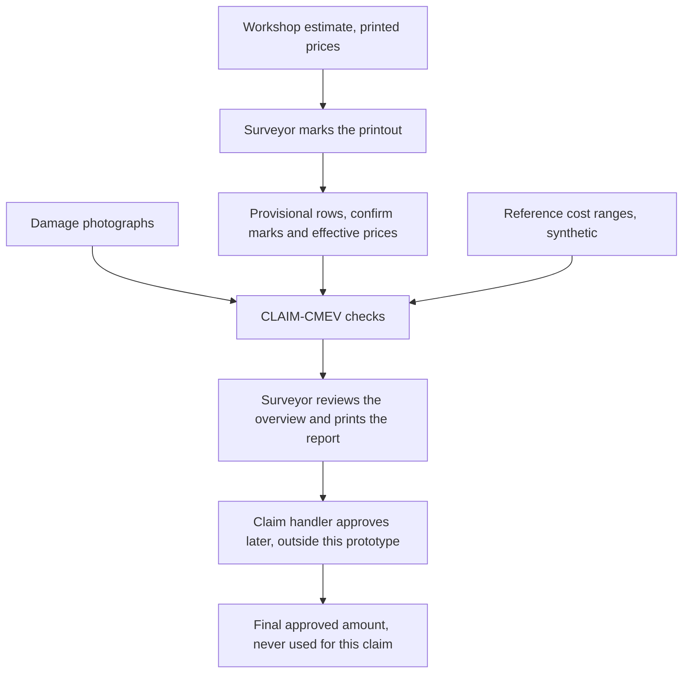
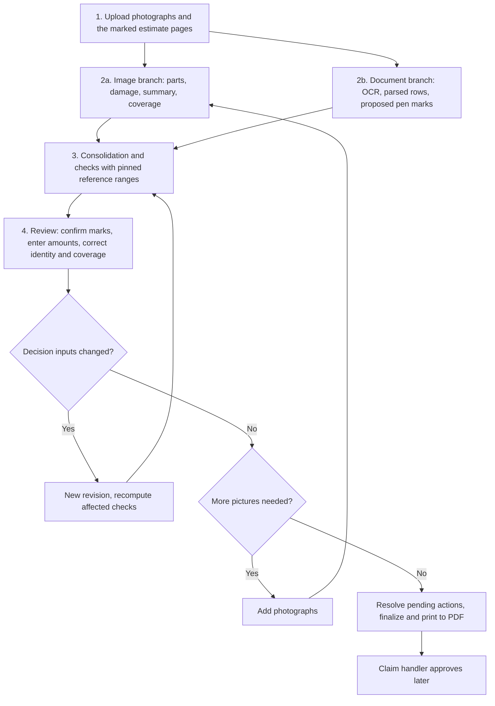

# Product specification

Status: implementation baseline for proposal v2. Nothing in this document is implemented or measured yet. Targets are hypotheses.
Owner: Lane 5 coordinates this document. Each lane owns the requirements tagged with its module. Named members are unassigned.
Source: [proposal v2](../CLAIM-CMEV_project_proposal_v2.md) sections 1, 2, 3, 5, 6, 7, 8, 10, 12 and 13. Runtime wording follows [ADR 0002](../adr/0002-containerised-event-runtime.md).

This document says **what** CLAIM-CMEV does and **why**. The [technical specification](technical_specification.md) and [application platform](application_platform.md) say how it is built. The [integration contracts](integration_contracts.md) and [data contracts](data_contracts.md) define the records. The [UI specification](ui_specification.md) defines the screens. The [evaluation plan](evaluation_plan.md) defines the measurements.

## 0. Two standing answers

### 0.1 Where the runtime differs from the original proposal v2

Proposal v2 section 9.1 originally planned two processes, one FastAPI API and one worker, with a database jobs table, no message broker, SQLite and local files. The team directed a different runtime on 2026-09-22. Each module now runs in its own container, and Kafka carries work between modules. Proposal v2 section 9.1 has since been rewritten to describe this same runtime directly; the table below is the historical record of the change.

| Item | Original proposal v2 section 9.1 | This specification |
| --- | --- | --- |
| Processes | One API process plus one worker process | One container per module, names fixed in [ADR 0002](../adr/0002-containerised-event-runtime.md) |
| Transport | Jobs table, polled, no message broker | Kafka topics on `cmev-kafka` (Redpanda) |
| Database | SQLite in write-ahead-log mode | PostgreSQL 16 in `cmev-db` |
| Binary storage | Local files | `cmev-objectstore` (MinIO) |
| Demonstration | Docker Compose optional | Two compose profiles, `lean` and `full` |

Every **domain** rule of v2 is unchanged. The decision rules of v2 section 8, the records of v2 section 9.3, the module scope of v2 section 10, the datasets of v2 section 11 and the evaluation of v2 section 13 all stand exactly as written.

The change increases platform effort. It adds container build and image work, topic and consumer-group design, message idempotency, dead-letter handling and broker-failure behaviour. That effort lands in Lane 5 and appears as new acceptance checks in [section 12](#12-functional-requirements-containerised-event-runtime) and in the [evaluation plan](evaluation_plan.md).

[ADR 0002](../adr/0002-containerised-event-runtime.md) estimates about 11 extra person-days for the full runtime. Lane 5 holds 5 implementation days, and the whole team holds 5 contingency days, so 11 days does not fit inside either. This is an unresolved budget conflict, not a solved one. The ADR names two responses and the team must choose one at the day-1 checkpoint: move the per-module Dockerfile and consumer wiring to each module owner, about 0.5 day each, or ship the `lean` profile and treat `full` as a stretch, which costs about 4 to 5 extra days instead of 11. If the conflict causes an overrun, it is reported against success criterion [SC-8](#16-success-criteria).

### 0.2 Where a large language model sits

No large language model sits in the decision path.

- Part and damage integration is deterministic mask overlap in M2.
- Vision and document integration is the deterministic rule set of v2 section 8, applied in M8.
- An optional stretch service `cmev-explainer` may turn an already-computed finding into a readable sentence. It is off by default. It never changes a result, a state or an amount.

A reader who asks "which model decides?" gets the same answer in every specification: rules decide, and the surveyor confirms.

---

## 1. The problem

A motor own-damage claim covers damage to the policyholder's own vehicle. The workshop writes an estimate. A surveyor inspects the vehicle, photographs the damage, and decides which estimate items to accept, reject or reprice. A claim handler approves the claim later.

### 1.1 The surveyor's working method

The surveyor prints the workshop estimate. They mark it with a pen. They photograph the damage. They then compare each printed row with the photographs by eye. Two problems remain.

| Problem | Effect today |
| --- | --- |
| Repeated manual checks | Every row is compared with the photographs by hand, for every claim |
| Records that do not compare | Photographs and marked printouts are stored as files. Nothing links vehicle, part, operation and price, so an earlier similar repair cannot be used as a reference |

CLAIM-CMEV assists that comparison. It does not replace the surveyor's judgement.

### 1.2 The marked workshop estimate

The document input is a printout of the workshop estimate, marked by the surveyor with a pen, then photographed with a phone or scanned. A workshop may call it a quotation or a repair list. It is not an invoice. Nothing has been paid at this stage. It can run to several pages.

Two pen-mark kinds are interpreted. Nothing else is.

| Mark | What the surveyor means | Name used everywhere in this project |
| --- | --- | --- |
| An "X" written over a line item or over its amount | They will not pay this item | **Exclusion mark** |
| A number written next to or above the printed amount | This is the new amount for this item | **Price change** |

Ticks, circles, initials and notes are not interpreted. They stay visible in the page image. The system never guesses their meaning.

Two derived terms follow.

- The **effective price** is the revised amount the surveyor entered and confirmed, or the readable printed amount when no price change is pending or confirmed. A pending price change leaves the effective price unresolved. It does **not** fall back to the printed amount.
- The **declared repair scope** is the set of non-excluded rows at their effective prices. Before confirmation it is provisional. Only a confirmed exclusion removes a row from the checks.

Every proposed mark is `pending`, `confirmed` or `rejected`. Confirming one mark never resolves another. The surveyor can add a mark the detector missed. Conflicting marks stay unresolved until the surveyor corrects the row association.

### 1.3 Three amounts that must stay separate

This is the single most important product rule. Mixing these three amounts corrupts the record.

| Amount | Where it comes from | How the system may use it | Where it is stored |
| --- | --- | --- | --- |
| **Workshop printed price** | Printed on the estimate, read by M4 and M5 | Shown for reference only | Line item, original extraction, immutable |
| **Surveyor's effective price** | Readable printed price with no pending change, or a revised amount the surveyor typed and confirmed | Checked against the reference range, only when resolved and comparable | Line item, reviewed value, with the review action that set it |
| **Final approved amount** | Recorded by the claim handler after this prototype ends | Never used in the assessment of the same claim. It may feed a later cost-reference refresh | Absent in the core scope. Shown as not recorded |

A surveyor edit is not an approval. The system never fabricates a final approval. Importing approvals is stretch S3 only.

### 1.4 The three checks

A **line item** is one row of the estimate: a part, a repair operation and a price. A **damage observation** is one finding from the image branch: a part, a damage type and the photographs that show it.

| Check | Question it answers | Example result |
| --- | --- | --- |
| Photo evidence | Is damage visible on the same physical part, with resolved identity and adequate views? | "Right rear door repair: no supported damage type detected in the confirmed adequate views" |
| Cost range | Is the effective price inside the reference range for the same part, operation and vehicle class? | "Front bumper replace: `1150.00` SGD, replacement basis, is above the reference range `620.00` to `890.00` SGD, 47 independent cases" |
| Missing repairs | Is supported visible damage absent from a sufficiently complete declaration? | "Dent on confirmed left fender, no matching estimate row found" |

If a part is not photographed, its identity is unresolved, or the view is cropped, obscured or poorly lit, the result is **insufficient evidence**. A sharp, large mask alone does not establish adequate coverage.

### 1.5 What the system does not do

- Approve or reject a claim, choose a settlement amount, or replace the surveyor's judgement.
- Treat an unphotographed part as an undamaged part.
- Detect staged accidents or fraud outside the estimate and the photographs.
- Train on fraud outcomes. The project has no fraud labels.
- Interpret any pen mark other than an exclusion mark and a price change.
- Read revised handwritten amounts automatically in the core scope. The surveyor types them.

### 1.6 Valid reasons for a mismatch

A repair or a price can be correct even when the photographs do not show why. The surveyor records a reason when they dismiss a finding. The reason stays in the record.

Fixed reason list: hidden damage found after dismantling; ADAS calibration or specialist procedure; parts price change; inadequate photograph; system error; other with a required note.

---

## 2. Safety invariants

These constraints outrank every other requirement in this document. A build that fails one of them is not acceptable, even if every screen works. Other specifications cite them by identifier.

| ID | Invariant | Why it exists | Enforced in |
| --- | --- | --- | --- |
| SI-01 | The three amounts of [section 1.3](#13-three-amounts-that-must-stay-separate) stay in separate fields with separate provenance | A mixed amount destroys the audit trail | M5, M6, M8, M9, contracts |
| SI-02 | An unphotographed, cropped, obscured or poorly lit part yields insufficient evidence, never a confident negative | Absence of an image is not absence of damage | M3, M8 |
| SI-03 | No left or right identity is inferred from an unsided part label. A left-door declaration cannot use right-door coverage or damage | HITL part labels carry no side | M1, M3, M8 |
| SI-04 | A pending, conflicting or unlinked mark withholds the affected checks. A pending price change never falls back to the printed amount | A guess about money is worse than no answer | M6, M8 |
| SI-05 | Failed or skipped processing is an explicit operational state, never an empty successful result | A silent failure looks like a clean claim | Every container, M9 |
| SI-06 | Original extractions, predictions and findings are immutable. A decision-changing correction creates a new revision | Contributors and auditors must see what the machine said first | M8, M9, platform |
| SI-07 | Reference costs are synthetic. Every display, export and printed report carries the synthetic marker and the fixed cost basis | A synthetic range must never be read as a real price finding | M7, M8, M9 |
| SI-08 | A cost range is absent with a reason when support is below the selected independent base-case minimum. There is no zero range | Sparse data must withhold, not invent | M7, M8 |
| SI-09 | Fixture output is marked as fixture in every record and can never be shown as real inference | A demonstration must not be mistaken for a result | Every container |
| SI-10 | Exceeding a reference interval indicates an unusual synthetic price. It is not proof of a wrong price and never proof of fraud | The project has no fraud labels and no real price data | M8, M9, report |
| SI-11 | Every finding stores the model, parser, configuration and cost-table versions that produced it. A later table never changes an existing assessment | A printed report must be reproducible | M8, platform |
| SI-12 | Human confirmation of part identity or coverage is recorded beside the model output. It never rewrites it | Assisted results and automatic results are reported separately | M3, M9 |

---

## 3. Users

| User | Role in this project | Surfaces they touch |
| --- | --- | --- |
| **P1 Surveyor** (primary) | Uploads the inputs, reviews the overview, edits, confirms marks, enters amounts, prints | Upload page, review overview, evidence panel, print view |
| P2 Claim handler | Receives the printed report. Records the final approval outside the prototype | Printed PDF only |
| P3 Investigator or compliance reviewer | Needs the stored record: inputs, model versions, findings, actions and reasons | Stored records. The audit view is described, not built |

They/them is used for the surveyor and the claim handler throughout this project's documents.

The intended buyer is a motor insurer. Commercial model, deployment stages and buyer value stay as written in proposal v1 section 5 and are not repeated.

---

## 4. Workflow

### 4.1 Worked example

The surveyor uploads six photographs and two estimate pages in a supported layout.

1. Item 3, "rear door, repair, `480.00` SGD", has a proposed exclusion. Checks are withheld until they confirm it. After confirmation the row is struck through and is not checked.
2. Item 5, "front bumper, replace, `1150.00` SGD", has a proposed price change. They type and confirm `980.00` SGD. A new assessment checks that amount against the pinned synthetic range `620.00` to `1020.00` SGD. The old extracted amount and the previous findings remain stored.
3. Item 7, "left fender, repair", has no adequate confirmed view. The overview asks for more pictures.
4. After the surveyor confirms declaration completeness, a bonnet dent with no matching row appears as a possible addition. They add it without an invented price.
5. They resolve the remaining mark actions and print the report. Outstanding insufficient-evidence results are printed with their reasons.

---

## 5. Product scope boundary

Three surfaces are built. Four views are described in the report only. This boundary is a commitment, not a preference.

| Surface | Built? | Content | Requirement range |
| --- | --- | --- | --- |
| Upload page | **Built** | Claim reference, vehicle make, model, year, currency, photographs, estimate pages, processing state | FR-01 to FR-06 |
| Review overview page with evidence panel | **Built** | Damage summary, line items, possible additions, finalize, evidence panel | FR-34 to FR-44 |
| Print view | **Built** | The finalized overview rendered as a report, printed to PDF by the browser | FR-45 to FR-47, FR-50 |
| Claim list | Described only | Queue of claims and their states | none |
| Cost-range detail | Described only | Full range, support count, generator provenance | none |
| Operations dashboard | Described only | Throughput and review activity | none |
| Audit view | Described only | Full revision and action history | none |

The built review overview must still show the essential range details, because the cost-range detail view is not built.

---

## 6. Result semantics

Four overall results. Each individual check is also stored and shown.

| Internal result | Label shown to the surveyor | Meaning |
| --- | --- | --- |
| `ok` | No discrepancy found | Supported by evidence and the effective price is within range |
| `unsupported` | No supporting damage detected in adequate views | Identity resolved, coverage confirmed adequate, and confidently no supported damage type detected |
| `cost_outlier` | Cost outside reference range | Supported by evidence, but the effective price falls outside the range |
| `insufficient_evidence` | More information needed | Pending mark, unresolved identity or amount, incomplete extraction, uncertain damage, inadequate views, or no compatible range |

Rules that govern the display:

- `insufficient_evidence` is informational. It must look different from a discrepancy flag. It is never a pass and never a failure.
- A confirmed exclusion is a separate row state. It is shown, struck through and not checked. It is never `ok`.
- A skipped check is `not_evaluated` with a reason, never a silent blank.
- A `cost_outlier` can be above or below the range. Neither direction proves anything about fraud (SI-10).

---

## 7. Functional requirements: intake

| ID | Requirement | How it is shown to be met | Module |
| --- | --- | --- | --- |
| FR-01 | Accept a claim with claim reference, vehicle make, model, year and currency. Model year is metadata and never enters a cost lookup | A claim with a year recorded produces the same cost lookup as the same claim without it | M9 |
| FR-02 | Accept damage photographs as JPEG or PNG and estimate pages as JPEG, PNG or PDF in one submission. Store every original unchanged | Byte-for-byte retrieval of each uploaded file | M9, platform |
| FR-03 | Reject an unreadable or unsupported file with a named reason. A rejected file is visible, never a silent absence | A corrupt page appears in the state list with its reason | M9 |
| FR-04 | Accept photographs with no estimate, and estimate pages with no photographs. Show the missing branch as waiting | Photo-only upload shows the damage summary and "waiting for the estimate" | M9, M8 |
| FR-05 | Show the claim state as queued, processing, ready for review, incomplete or failed. A failure never renders as a finished assessment with no findings (SI-05) | A killed container leaves the claim incomplete, not clean | M9, platform |
| FR-06 | Adding photographs or pages creates a new input revision. Earlier revisions and their assessments stay readable | Both revisions are retrievable after the second upload | Platform |

Currency note: the cost comparison supports SGD only. Other currencies stay visible with no cost check and a recorded reason.

## 8. Functional requirements: image branch

| ID | Requirement | How it is shown to be met | Module |
| --- | --- | --- | --- |
| FR-07 | Produce a part mask per photograph with per-class confidence, over the 21 HITL part categories plus background | A mask artifact and confidences exist per photograph | M1 |
| FR-08 | Preserve unresolved side on every part prediction (SI-03) | No model output carries a left or right value | M1 |
| FR-09 | Produce damage regions with a supported damage type and confidence, limited to the six CarDD categories | Per-class outputs exist for dent, scratch, crack, glass shatter, lamp broken and tire flat | M2 |
| FR-10 | Assign a damage region to a part by deterministic mask overlap only, above a validation-selected threshold, and only when the candidate is unambiguous. Otherwise keep unknown identity | An ambiguous region records candidates, not a choice | M2 |
| FR-11 | Group observations under one resolved physical part and side, and retain every source observation | Each summary row lists its member observation identifiers | M3 |
| FR-12 | Never sum repeated mask areas and never infer a count of physical damage instances | No field in any record reports a damage instance count | M3 |
| FR-13 | Publish a coverage state per part of `adequate`, `inadequate`, `not_visible` or `unresolved`, with quality reasons | Each state appears with at least one reason code | M3 |
| FR-14 | A negative finding requires a resolved physical part and a recorded confirmation that the views cover enough of it to judge (SI-02, SI-12) | An unconfirmed part cannot reach `unsupported` | M3, M8 |

## 9. Functional requirements: document branch

| ID | Requirement | How it is shown to be met | Module |
| --- | --- | --- | --- |
| FR-15 | Correct page perspective and rotation where the page boundary is found reliably, and record the transform back to the original page | A box on the corrected page maps back to the uploaded pixels | M4 |
| FR-16 | Produce located text with recognition confidence at the granularity the pinned OCR engine actually returns. Do not invent word boxes when only line boxes exist | The granularity recorded matches the engine smoke-test finding | M4 |
| FR-17 | Mark a page or row incomplete when correction or recognition fails, or when the print is obscured | A shadowed page yields an explicit partial state | M4 |
| FR-18 | Parse repair rows for the frozen two or three layout families using header aliases and relative column positions, not fixed page coordinates | A shifted template in the same family still parses | M5 |
| FR-19 | Keep uncertain fields explicit. Never substitute zero for missing text. Never set a missing quantity to one | A missing quantity is null with a reason | M5 |
| FR-20 | Preserve multiple operations on the same part as separate rows | Repair and paint on one panel stay two rows | M5 |
| FR-21 | Publish a declaration completeness status of `complete`, `partial`, `unreadable` or `explicitly_empty`. A no-row parse is never an empty scope | A blank parse shows `unreadable` or `partial`, and the surveyor must confirm an empty scope | M5 |
| FR-22 | Detect exclusion and price-change marks as boxes with class and score. Every proposal starts `pending` | No detection is auto-applied | M6 |
| FR-23 | Link a mark to a row only when the geometry identifies one row unambiguously. Otherwise keep the mark unlinked with its candidate rows | A mark above an amount that overlaps two rows stays unlinked | M6 |
| FR-24 | Treat an amount-shaped mark as a detected mark, not a read amount | No numeric value is produced by the core detector | M6 |

## 10. Functional requirements: consolidation

| ID | Requirement | How it is shown to be met | Module |
| --- | --- | --- | --- |
| FR-25 | Apply the per-line-item rules of proposal v2 section 8.1 and store every individual check result beside the overall result | A supported photo check coexists with a withheld cost check | M8 |
| FR-26 | Withhold the affected checks for a row with a pending, conflicting or unlinked mark, and explain what is missing (SI-04) | The row shows `insufficient_evidence` with the mark reason | M8 |
| FR-27 | Treat a confirmed exclusion as a separate row state. Show it, do not check it, never label it `ok` | The excluded row has no photo or cost result | M8, M9 |
| FR-28 | Never use the printed amount while a price change is pending (SI-04) | No cost check runs on a pending-change row | M8 |
| FR-29 | Compare an effective price only against a range keyed on part, operation, vehicle class and currency, under the pinned fixed cost basis. Equality at a bound is within range | A boundary-equal amount returns within range | M8, M7 |
| FR-30 | Withhold the cost check, with a reason, when the range is absent, support is below the selected independent base-case minimum, or quantity, currency or basis are incompatible (SI-08) | Each withheld case names its reason | M8 |
| FR-31 | Offer a possible addition only when the relevant declarations are sufficiently complete, identity is resolved and no row matches. Never invent an operation or an amount | An added item has empty operation and amount fields for the surveyor to fill | M8, M9 |
| FR-32 | Suppress a possible addition when the surveyor confirmed an exclusion for the same resolved part, and attach an informational damage note to that excluded row. An exclusion on the right door never suppresses left-door damage | The opposite-side case still raises the addition | M8 |
| FR-33 | Give every finding a short explanation and links to its photographs, masks, page box and range | Each finding resolves to retrievable evidence | M8 |

## 11. Functional requirements: review, finalize and record

| ID | Requirement | How it is shown to be met | Module |
| --- | --- | --- | --- |
| FR-34 | Show one review overview page with four sections: damage summary, line items, possible additions, finalize | The page renders all four from real records | M9 |
| FR-35 | Open an evidence panel beside a selected row, showing covering photographs with overlays, a one-tap link to the original photograph, and the page image with the row box and any mark boxes highlighted | Each link resolves to the correct original | M9 |
| FR-36 | Let the surveyor confirm, reject, correct or add a pen mark | All four actions persist with actor and time | M9, M6 |
| FR-37 | Let the surveyor enter a revised amount as an exact decimal with currency and cost basis, stored separately from any detector output or stretch suggestion (SI-01) | The typed amount and any suggestion are distinct fields | M9 |
| FR-38 | Let the surveyor correct part, side, operation or row association while the original extracted value stays visible (SI-06) | Both values appear after the edit | M9 |
| FR-39 | Let the surveyor confirm visible part identity and view coverage, recording actor, source and revision, without altering the model output (SI-12) | The model row is unchanged after confirmation | M9, M3 |
| FR-40 | Let the surveyor confirm declaration completeness, including explicitly confirming an empty scope | The `explicitly_empty` state requires a human action | M9, M5 |
| FR-41 | Let the surveyor dismiss a finding by selecting a reason from the fixed list, with a required note for "other" | The dismissal and reason survive reload on the same assessment | M9 |
| FR-42 | Create a new input and assessment revision for any decision-changing edit, then recompute the affected checks against the pinned version bundle. Reuse unchanged inference with recorded lineage | A price correction does not rerun the segmentation models | M8, platform |
| FR-43 | Make review saves idempotent under an idempotency key and an expected review revision. A repeat returns the original result. A stale conflicting write is rejected for reload | A replayed save creates no second action row | Platform, M9 |
| FR-44 | Allow finalize only when pending marks are resolved, unlinked marks are resolved, decision-changing edits have been assessed, and no required job is unfinished or failed | Finalize is blocked in each of those states | M9 |
| FR-45 | Render the print view with claim and vehicle details, damage summary, final line items with printed and effective prices, confirmed exclusions and mark decisions, accepted additions, findings, unresolved evidence and declaration gaps, dismissal reasons, the synthetic-cost label with the fixed basis, the final-approval status, and a footer of input, assessment and review revisions with model, parser, configuration and cost-table versions | Every listed element appears in the printed PDF | M9 |
| FR-46 | Keep insufficient-evidence results in the report with their reasons. Finalization never converts them into passes | The printed report shows them as open items | M9, M8 |
| FR-47 | Print to PDF from the browser. The stored review revision is authoritative and the PDF is a rendering of it | A reprint of the same revision matches | M9 |
| FR-48 | Store the producing model, parser, configuration or rule version on every result row, and the full version set plus cost-table version on every assessment (SI-11) | An old assessment reprints unchanged after a new cost table is published | All modules |
| FR-49 | Mark fixture output as fixture in every record, and block it from being presented as real inference (SI-09) | A fixture run is visibly labelled end to end | All modules |
| FR-50 | Show the final approved amount as not recorded unless an approval was actually imported in stretch S3 | The default report shows "not recorded" | M9 |

## 12. Functional requirements: containerised event runtime

New requirements created by the runtime change of [section 0.1](#01-where-the-runtime-differs-from-proposal-v2). They are additions to v2, not restatements of it.

| ID | Requirement | How it is shown to be met | Owner |
| --- | --- | --- | --- |
| FR-51 | Run each module as its own container using the canonical names `cmev-web`, `cmev-api`, `cmev-orchestrator`, `cmev-worker-parts`, `cmev-worker-damage`, `cmev-worker-summary`, `cmev-worker-ocr`, `cmev-worker-lineitems`, `cmev-worker-penmarks`, `cmev-consolidator`, `cmev-kafka`, `cmev-db`, `cmev-objectstore` | Every name appears in the compose files and in the running container list | Lane 5 |
| FR-52 | Carry every unit of work between modules over a Kafka topic on `cmev-kafka`. Every message carries claim identifier, input revision, schema version and the pinned version set | A consumer can reconstruct the full context from one message | Lane 5, all producers |
| FR-53 | Make each consumer idempotent on its job key of claim, input revision, task, target and version set. Duplicate delivery must produce no duplicate rows | A replayed message leaves row counts unchanged | Lane 5, module owners |
| FR-54 | Keep a message for a superseded input revision with that revision. It never replaces the current assessment (SI-06) | A late message for revision 1 does not alter revision 2 | Lane 5, M8 |
| FR-55 | Route a message that exhausts its retries to a dead-letter topic, mark the claim incomplete, and never show the claim as clean (SI-05) | The dead-letter case leaves a visible incomplete claim | Lane 5 |
| FR-56 | Survive broker unavailability. `cmev-api` rejects new work with a clear state instead of silently dropping it, and processing resumes after the broker returns | A broker stop and restart loses no accepted claim | Lane 5 |
| FR-57 | Survive a single consumer restart with no lost and no duplicated committed result | Restarting `cmev-worker-ocr` mid-claim still yields one complete result | Lane 5 |
| FR-58 | Provide two compose profiles. `full` runs every module container. `lean` runs web, api, `cmev-worker-combined`, kafka, db and object store for a laptop demonstration, where `cmev-worker-combined` is the same code with every module handler registered in one process | Both profiles start on the recorded demonstration machine, and the same claim produces identical findings under both | Lane 5 |
| FR-59 | Keep `cmev-explainer` disabled by default. When enabled it only rewrites an existing finding into a sentence and cannot change a result, a state or an amount (see [section 0.2](#02-where-a-large-language-model-sits)) | Findings are byte-identical with the service on and off | Lane 5, stretch |

---

## 13. Non-functional requirements

| ID | Requirement | Source | How it is shown to be met |
| --- | --- | --- | --- |
| NFR-01 | Large controls that are readable on a tablet under varied lighting | v2 §7.6 | Reviewed on a representative tablet viewport during the usability walkthrough |
| NFR-02 | One-tap access to the original photograph from any overlay or finding | v2 §7.6 | Timed during the usability walkthrough |
| NFR-03 | Model, parser, configuration and cost-table versions are visible in the interface, not only in the record | v2 §7.6 | Present on the overview and in the print footer |
| NFR-04 | A processing failure, missing evidence and a completed check are visually distinct, and not by colour alone | v2 §7.6, SI-05 | Distinguishable in greyscale and by label text |
| NFR-05 | An idempotent save, so a retried submission never duplicates a review action | v2 §7.6 | Covered by FR-43 and the service checks |
| NFR-06 | The decision path is deterministic. Given the same pinned inputs and versions, M8 returns the same findings | §0.2 | Repeat run comparison in `tests/integration` |
| NFR-07 | Latency and memory are measured on the recorded demonstration machine at the day-2 smoke test. No latency target is assumed before that measurement | v2 §9.1, §9.4 | Recorded numbers for a six-photo, two-page case |
| NFR-08 | Every experiment records seeds, data manifests and artifact hashes so it can be repeated | v2 §11.8 | Manifests under `artifacts/evaluation/` |
| NFR-09 | Datasets, checkpoints, claim material and generated exports stay in the documented ignored locations. Only manifests and aggregate results are tracked | v2 §9.6, AGENTS.md | Repository check |
| NFR-10 | Number plates and faces are hidden in any shared material | v2 §11.5 | Checked before any sample leaves the team |
| NFR-11 | Exact checkpoint, dataset and dependency licences are recorded in the model and dataset manifests | v2 §11.1 | Manifest field present for each artifact |
| NFR-12 | Restarting any single container loses no committed review action and duplicates none | §0.1, FR-57 | Service checks in `tests/e2e` |
| NFR-13 | The `lean` profile runs the full demonstration on one laptop without internet access to model hosts, using pre-pulled images and local weights | §0.1 | Offline demonstration rehearsal |
| NFR-14 | Every displayed or printed cost reference carries the synthetic marker and the fixed cost basis | SI-07 | Present in overview, evidence panel and PDF |
| NFR-15 | This is a prototype. There is no production identity provider, no availability target, no multi-tenant isolation and no real claim data. Evidence is still served through `cmev-api` with a claim authorisation check, and a presigned object-store URL is never handed to the browser | v2 §3.5, ADR 0002 | Stated in the report and the README, and checked in `tests/e2e` |

---

## 14. Milestone plan

Mapped to the elapsed-day checkpoints of proposal v2 section 12.2. Days are per member and assume concurrent lane work. They are not a promise that 50 person-days fit ten calendar days.

| Day | Milestone | Exit condition | New work from the runtime change |
| --- | --- | --- | --- |
| 1 | D1 Scope and access | Supported layout families, marking convention, rubric mapping and core dataset access status confirmed. First estimate and price fixtures created. Contract and adapter owners assigned. v1 to v2 specification alignment started | Container names and topic names agreed. The team chooses one of the two ADR 0002 responses to the 11-day platform overrun and records it |
| 2 | D2 Freeze and smoke test | Vocabulary, fixed cost basis, records and uncertainty rules frozen. Final-test membership reserved. Dependencies installed and a small real inference smoke test run on the demonstration hardware. Upload to fixture results to overview to save connected. CarDD access contingency decided if needed | `cmev-kafka`, `cmev-db` and `cmev-objectstore` start under the `lean` profile. One end-to-end fixture message flows through at least one worker topic |
| 3 to 4 | D3 Real baseline outputs | Bounded baseline candidates fine-tuned. OCR, parser, image outputs, mark proposals and cost checks connected to the review workflow with actual baseline outputs. Pending marks, manual amounts and recomputation exercised | Every module container builds and consumes its own topic. Duplicate-delivery and consumer-restart checks written |
| 5 | D4 Core feature cutoff | A baseline case runs through review and print. Remaining effort and validation results reviewed. A stretch goal starts only if its gate is met | `full` profile starts every container. Dead-letter routing in place |
| 6 | D5 Freeze for evaluation | Integration and recovery checks done. Validation and any separate calibration complete. Release configurations, thresholds and artifacts frozen | Broker-unavailability and superseded-revision checks pass |
| 7 | D6 Measurement | Untouched module and pipeline test sets, exploratory grouped-view cases and usability checks run. Denominators, failures and corrections recorded. Demonstration and evaluation artifacts produced | Service-check results recorded alongside model results |
| 8 | D7 Contingency | Failed runs and integration corrections absorbed. Repeated test exposure and changed versions recorded. No tuning on final test outcomes | Reserved for container and transport problems as well as model problems |
| 9 to 10 | D8 Report | Report and presentation delivered, including limitations, omitted stretch work and actual effort | The runtime change and its effort impact stated openly in the report |

Each milestone is judged by evidence, not by elapsed time.

---

## 15. Ownership lanes

From proposal v2 section 12.1. Each member has 10 person-days: 5 implementation and data, 2 integration and evaluation, 1 contingency, 2 report and presentation.

| Lane | Modules and containers owned | Core work in the five implementation days | Reserved integration and evaluation work |
| --- | --- | --- | --- |
| 1 Vision | M1, M2, M3. `cmev-worker-parts`, `cmev-worker-damage`, `cmev-worker-summary` | HITL and CarDD acquisition checks and conversion, shared M1 and M2 training code, conservative assignment, M3 summary, overlays | Worker adapter and artifact and coordinate checks, RQ1, exploratory RQ3, lead the assignment and vehicle annotation protocol |
| 2 Document extraction | M4, M5. `cmev-worker-ocr`, `cmev-worker-lineitems` | M4 preprocessing and OCR, M5 parser for the supported layout families, vocabulary mapping, completeness | Worker adapter and line-item contract, extraction and evidence-link checks, M4 and M5 evaluation |
| 3 Document synthesis and marks | M6. `cmev-worker-penmarks` | Estimate generator, mark synthesis, shared page collection and labels, M6 detector | Mark-to-row linking, confirmation cases, mark overlay integration, RQ2, page annotation quality |
| 4 Costs and checks | M7, M8. `cmev-consolidator` | Price generator, M7 percentile and LightGBM comparison, M8 rules and comparison integration, taxonomy and fixed cost basis | Structured discrepancy and uncertainty tests, RQ4, reassessment and pinned-range integration with Lane 5 |
| 5 Platform and front end | M9 plus the runtime. `cmev-web`, `cmev-api`, `cmev-orchestrator`, `cmev-kafka`, `cmev-db`, `cmev-objectstore` | Coordinate schema, intake and storage, Kafka topics and consumer groups, review APIs, upload page, overview, evidence panel, print view, compose profiles | Service, retry, revision and transport tests, full-pipeline harness, usability walkthrough, end-to-end demonstration |

Every module owner supplies their own callable adapter, fixture records, failure cases and evaluation outputs. Lane 5 coordinates integration. Lane 5 does not take over other lanes' adapters or module tests. All members contribute page marking and vehicle labels inside their own allocations. Lane 3 delivers an initial estimate layout and Lane 4 a price-generator interface on day 1, so document work does not wait until day 4.

---

## 16. Success criteria

From proposal v2 section 13.6, with the transport checks of [section 12](#12-functional-requirements-containerised-event-runtime) added to criterion 2.

| ID | Criterion |
| --- | --- |
| SC-1 | An unseen case completes upload, both core branches, consolidation, reviewed corrections and PDF export with real model output and source evidence. The amount of human assistance is explicitly recorded |
| SC-2 | The required deterministic safety checks and service checks pass, including the duplicate-delivery, consumer-restart, dead-letter, broker-unavailability and superseded-revision cases. Processing failure, pending marks, unknown identity and incompatible prices cannot appear as successful checks |
| SC-3 | Module targets and full-pipeline targets are measured on reserved test data. Each is reported as met or unmet. A working workflow does not establish model adequacy |
| SC-4 | Withholding on unphotographed parts reaches the initial target of at least 0.95, with decision rates on assessable cases also reported. An unmet target stays a shortfall |
| SC-5 | At least three required course aspects are demonstrated under the confirmed rubric mapping. No stretch model is needed to claim the planned course coverage |
| SC-6 | RQ1, RQ2 and RQ4 have measured results. RQ3 has a labelled exploratory case study with its scenario gaps and sample limits stated |
| SC-7 | Original extractions, reviewed values and final approvals stay separate. Every surveyor action and relevant version is retained. Absent approval and synthetic costs are visible in the report |
| SC-8 | Core work, contingency use and reporting fit the 50-person-day budget, or the overrun and the resulting scope reductions are reported. Stretch outcomes cannot conceal a core shortfall |

Functional completion, measured model performance and budget adherence are reported separately. These criteria do not assert production readiness or real-price validation.

---

## 17. Out of scope

Product scope:

- Production deployment, hosting, identity and live claims-system integration.
- Automated settlement, claim approval or rejection.
- Non-visual fraud detection and hidden structural damage.
- Real repair-price validation. Every reference range in this project is synthetic.
- Arbitrary workshop layouts. Only the frozen two or three layout families are supported. Other layouts remain available for manual entry.
- Automatic repair-operation selection.
- Pen marks other than the exclusion mark and the price change.
- Automatic reading of handwritten revised amounts in the core scope.
- The four described-only views of [section 5](#5-product-scope-boundary).
- New vehicle datasets and larger segmentation backbones.
- Multi-customer operation, billing and portfolio reporting.

Stretch goals are optional and are not part of core success: S1 LayoutLMv3 line-item extraction with CORD preparation, S2 TrOCR amount suggestions, S3 scripted final approval and cost-reference refresh, and the optional `cmev-explainer` service.

---

## 18. Product tasks

- [ ] Assign a named product owner and named lane members.
- [ ] Confirm the course rubric mapping before implementation starts.
- [ ] Confirm the marking convention with a practising surveyor, or record it as a project convention.
- [ ] Record the day-1 choice between the two ADR 0002 responses to the estimated 11 extra platform person-days, since neither Lane 5's 5 implementation days nor the team's 5 contingency days can absorb them.
- [ ] Freeze the supported layout families, part and side vocabulary, damage labels, operations, vehicle classes and eligible cost combinations.
- [ ] Freeze the fixed SGD cost basis and confirm that model year is excluded from generation, training and lookup.
- [ ] Review FR-01 to FR-59 and NFR-01 to NFR-15 with every module owner and record any that the team cannot commit to.
- [ ] Agree the dismissal reason list and test the "other" note interaction.
- [ ] Confirm the demonstration case and the demonstration hardware.
- [ ] Check that every safety invariant SI-01 to SI-12 has at least one deterministic test in `tests/contracts` or `tests/integration`.
- [ ] Record measured results, shortfalls and limitations against [section 16](#16-success-criteria) before declaring completion.
