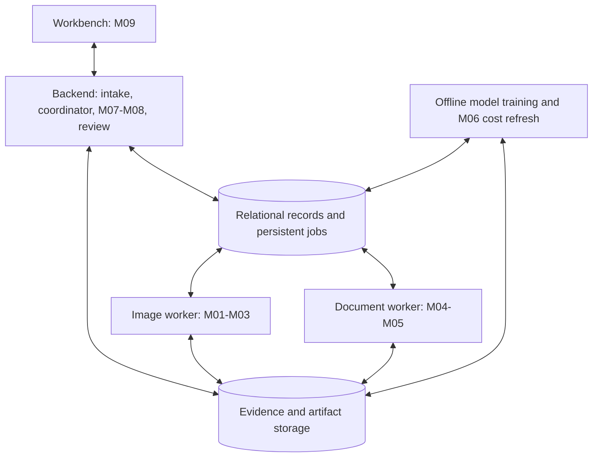

# Overall technical specification

Status: implementation baseline; library choices are proposed. Source: [proposal](../CLAIM-CMEV_project_proposal_v1.md), sections 9-16. Owners: Lane 5 for platform/deployment, Lane 4 for comparison/costs/taxonomy, Lanes 1-3 for models and source data.

## Architecture

Use one repository with four application runtime components and offline pipelines. Functional modules share versioned records; they are not nine independently deployed services.

The backend validates inputs, allocates revisions, coordinates tasks, loads the fixed cost reference, executes M07-M08, saves review events, and serves evidence/export APIs. Workers receive identifiers and artifact references, not raw image payloads in queue messages. A persistent database job table is sufficient for the prototype.

Image and document branches run independently. M01 supplies part masks to M02; M03 combines observations and coverage. M04 supplies page/layout data to M05. M08 waits for required successful branch results from the same input revision. Structured user entries replace the document branch only when explicitly selected as the declaration source. Photo-only work exposes an image summary and waits for declarations.

## Proposed technology baseline

| Area | Proposed choice | Reason and decision boundary |
| --- | --- | --- |
| Shared domain, workers, pipelines | Python package under `src/claim_cmev/` | Share model and validation code; pin Python and libraries after environment smoke test |
| Backend | FastAPI and Pydantic; relational adapter with migrations | Typed HTTP boundaries and a shared record validation layer |
| Workbench | React, TypeScript, Vite | Implement the three interactive screens and typed API client |
| Database / queue | PostgreSQL with persistent job rows | One persistence system for revisions, jobs, and review transactions |
| File storage | Local filesystem behind a storage adapter | Simple private prototype; preserve an object-storage-compatible reference contract |
| Vision | PyTorch, SegFormer; common training harness | Proposal-selected part and damage approach |
| Documents | Embedded PDF text plus OCR; LayoutLMv3 or Donut | Model and OCR engine chosen by measured source-location and extraction results |
| Costs | Gradient boosting plus quantile or conformal intervals | Proposal-selected interval approach; exact package and calibration method open |
| Local deployment | Docker Compose when entrypoints exist | Four component boundaries plus database; CPU/GPU profiles to be established |
| Verification | Python tests, frontend interaction tests, browser end-to-end checks | Exercise contracts and failure/recovery behaviour |

These are design choices, not installed dependencies or claims about current library versions. Record accepted choices in [ADRs](../adr/README.md); create manifests and lockfiles during bootstrap. GPU/CUDA compatibility and OCR system packages must be tested on the selected host.

## Repository and dependency boundaries

| Directory | Responsibility and dependency rule |
| --- | --- |
| `apps/api/` | HTTP/configuration entrypoint; calls domain services and storage adapters |
| `apps/workbench/` | Browser client; calls backend only, never database or worker directly |
| `workers/image/`, `workers/document/` | Job polling/lease and model-loading entrypoints |
| `src/claim_cmev/contracts/` | Serializable record definitions; no application imports |
| `src/claim_cmev/taxonomy/` | Versioned part, side, operation, damage and source-label mapping logic |
| `src/claim_cmev/vision/{parts,damage,multiview}/` | M01-M03 inference logic |
| `src/claim_cmev/documents/{text_layout,line_items}/` | M04-M05 inference logic |
| `src/claim_cmev/costs/{reference,anomaly}/` | M06 cost fitting/lookup contracts and M07 cost checks |
| `src/claim_cmev/comparison/` | M08 deterministic fusion and reverse matching |
| `src/claim_cmev/orchestration/` | Job and assessment state coordination |
| `src/claim_cmev/persistence/` | Transactions, repositories, and artifact storage adapters |
| `pipelines/{vision,documents,costs}/` | Offline conversion, training, calibration, evaluation, and refresh entrypoints |
| `configs/` | Small versioned configuration; no credentials or model binaries |
| `data/`, `artifacts/` | Local large data and generated outputs with separate tracked manifests |
| `infra/` | Compose definitions and forward database migrations |
| `tests/` | Unit, contracts, integration, e2e, evaluation, and synthetic fixtures |

Domain algorithms must be callable without HTTP or UI imports. Shared vision preprocessing belongs in the vision package; reusable training belongs in `pipelines/vision/`. Keep notebooks exploratory and move reproducible transformations into package or pipeline code.

## Processing and consistency

Use the [data contracts](data_contracts.md) for record fields and the [platform specification](application_platform.md) for endpoints and transitions.

- An immutable input revision lists exact source files, declaration source, metadata, and hashes.
- An assessment revision pins input revision, branch result IDs, model versions, taxonomy, thresholds/configuration, code revision, and cost table.
- A review revision references an assessment and preserves human actions separately.
- A worker's completion commits its result metadata and job status atomically. Artifact writes complete before publication; uncommitted artifacts are not treated as results.
- Job identity includes claim, input revision, task, and the complete execution version signature. Atomic leases and uniqueness constraints prevent competing retries from publishing duplicate results.
- A stale worker may complete its historical revision but cannot change the current assessment pointer.
- Missing files, corrupt inputs, worker failure, and model-load failure are explicit operational states. They cannot be converted into “no damage” or `ok`.
- A new cost table affects future assessments. Reassessment is explicit and creates a new assessment revision.

## Data architecture

The relational model stores claims, input revisions, files, processing runs/jobs, part coverage, per-image and merged observations, document pages/entries, cost-table metadata/ranges, assessments/findings, review events, approval imports, and reference-build membership. Artifact storage holds original photos/PDFs, rendered pages, masks, checkpoints, and exports.

Store money as decimal strings at the API boundary and exact decimal values in the database, with currency, amount basis, quantity, and applicable tax/labour/grade metadata. Never use binary floats for money. Null means unavailable; zero is not a missing-value substitute. Preserve declared, agreed, and approved amounts in separate fields and records.

Use foreign keys and revision-scoped uniqueness. Evidence references resolve through claim-authorised backend routes. Store original report text and source coordinates, not just normalised values. Preserve original image orientation and transformation metadata so overlays resolve correctly. Claims do not share evidence IDs accidentally.

### Dataset lifecycle

1. Register source/version, original licence/access evidence, permitted use, checksums, annotations, vehicle/template grouping availability, and real/synthetic provenance in a manifest.
2. Retain immutable raw files locally; convert labels and coordinates into the canonical vocabulary with a versioned mapping report.
3. Deduplicate and split before fitting. Keep vehicle groups and related synthetic views together; keep related report templates together. Record limitations when grouping identifiers are unavailable.
4. Produce distinct training, validation, calibration where required, and test partitions. Fit preprocessors, models, and thresholds without test data.
5. Store run configuration, split hashes, code version, random seeds, checkpoint provenance, metrics, and limitations.
6. Publish only evaluated artifacts with hashes and compatibility metadata.

HITL is the initial part source; supplementary side labels require mapping. VehiDE/CarDD and reserve datasets require access/licence checks. CrashCar101 supports joint-label and controlled multi-view experiments. DocILE is the primary document benchmark, supplemented by synthetic survey layouts. Dataset counts and licence claims from the proposal remain unverified until recorded by their owner.

The planned synthetic `prices_dataset.csv` is not present in this scaffold. Its stated 630 rows and workshop/operation/damage structure must be inspected before schema assumptions or coverage claims are made. Missing damage labels must not be silently fabricated. No public dataset currently established by the proposal provides real paired damage and approved line-item costs.

### Approval and reference refresh

A controlled importer records final approvals with external/test IDs, approval time, source, supersession relationships, and a synthetic marker. M06 reads only eligible approved records available before the build cutoff, plus explicitly documented synthetic seed data. Agreed-only values, duplicates, superseded approvals, incompatible units, and incomplete records are excluded with reasons.

A candidate reference build records exact member IDs, effective unique support counts, recency weighting policy, training/calibration splits, interval calibration, and range width. Evaluate before promotion. Store immutable prior tables, and atomically change the active table pointer only for future assessments. Rolling back changes that pointer, not historical findings. Apply temporal cutoffs and held-out claim groups to prevent an assessed claim's final outcome from leaking into its own assessment.

## Model engineering

| Module | Model/method | Required publication evidence |
| --- | --- | --- |
| M01 | Fine-tuned SegFormer, initial 21 part classes | mIoU, per-class IoU, side limitations, data/mapping versions |
| M02 | Fine-tuned SegFormer, initial 8 damage classes; mask overlap | mIoU, class results/AP, damage-to-part matching and RQ2 comparison |
| M03 | Investigate single-view projection to common vehicle representation | Duplicate reduction, merge/loss errors, vehicle-summary F1, coverage evidence |
| M04-M05 | PDF/OCR plus LayoutLMv3 or Donut | Extraction quality, complete-entry F1 and source localisation; results by domain |
| M06 | Gradient boosting with prediction intervals | Nominal/empirical coverage, average width, support counts and sparsity evaluation |
| M07-M08 | Versioned explicit comparison logic | Ordered-rule results, discrepancy precision/recall and withholding performance |

A model manifest must include model/task ID, checkpoint hash, base model and licence, runtime/environment requirements, preprocessing, output label schema, training config and split hashes, metrics by source/class, known limits, and publication status. Workers refuse incompatible manifests and publish the model actually loaded. Real, synthetic, fixture, and comparator outputs must be distinguishable.

Thresholds for image quality, detection confidence, mask matching, duplicate merging, extraction confidence, and minimum reference support remain calibration decisions. Store their values and selection evidence in versioned configs; no initial threshold is a validated result. The anomaly method's course classification needs confirmation.

## Deployment specification

Target: a private local or team demonstration environment, preferably the team's Linux/WSL development host once dependencies are verified. Production rollout is outside scope.

Compose should eventually define backend, workbench, image worker, document worker, and PostgreSQL. Put training/cost refresh in manually invoked jobs/profiles; do not start training with a claim submission. Only UI/API ports are exposed to the demonstration user. Worker and database access stays on the internal network. Serve evidence through the API; do not expose a raw storage directory.

Use named/persistent storage for the database and a configured artifact volume. Separate read-only serving model bundles from writable claim artifacts. Keep credentials in local environment/secrets configuration. Supply a documented demo identity and server-side claim access checks; production SSO is deferred.

Bootstrap sequence: install locked dependencies; start storage/database; apply migrations; register verified model/mapping/cost bundles; start API/workers; start workbench; submit a synthetic smoke case and verify evidence and review persistence. The repository currently reserves these locations and does not yet provide executable manifests.

Record CPU, RAM, GPU/VRAM, disk, and processing latency using representative cases. Select CPU/GPU resource limits from measurements. Report unavailable GPU/checkpoints explicitly; fixture mode cannot be presented as real inference.

Before a demonstration, snapshot database and matching artifacts. Exercise restoring a historical assessment and its evidence. On schema/model/config failure, keep the prior bundle available, stop incompatible processing, and preserve pending work. Use forward migrations with documented rollback/restore procedures.

## Observability and data handling

Log correlation IDs for claim, input revision, assessment, job, and attempt, plus duration and error codes. Avoid logging original report text, personal information, raw images, or secret values. Expose liveness separately from readiness (database, storage, compatible model and cost bundle). Record counts of retries, failed branches, insufficient-evidence reasons, review saves/conflicts, and reference-build exclusions.

Do not commit claim material, large datasets, checkpoints, generated reports, or secrets. Track only safe source, configs, synthetic fixtures, manifests and approved aggregate evaluation summaries. Verify source licences before download/use; define retention and anonymisation before any real claim intake. No production compliance certification is claimed.

## Technical tasks

- [ ] Accept/adjust the proposed stack and record ADRs; pin compatible dependencies.
- [ ] Implement and version shared contracts, taxonomy mappings, and fixture validation.
- [ ] Bootstrap the four runtime entrypoints and offline pipeline entrypoints.
- [ ] Implement migrations, artifact adapters, leases, uniqueness, and atomic publication.
- [ ] Implement the [platform](application_platform.md) and nine module specifications.
- [ ] Register datasets, source permissions, split manifests, and model publication manifests.
- [ ] Calibrate all thresholds and record selection evidence.
- [ ] Implement approval eligibility, deduplication, build membership, promotion, and rollback.
- [ ] Create private local deployment profiles and measure hardware requirements.
- [ ] Verify failure/retry, reconnect, stale results, historical reproduction, and restore.
- [ ] Freeze demonstration versions and collect the [evaluation evidence](evaluation_plan.md).
