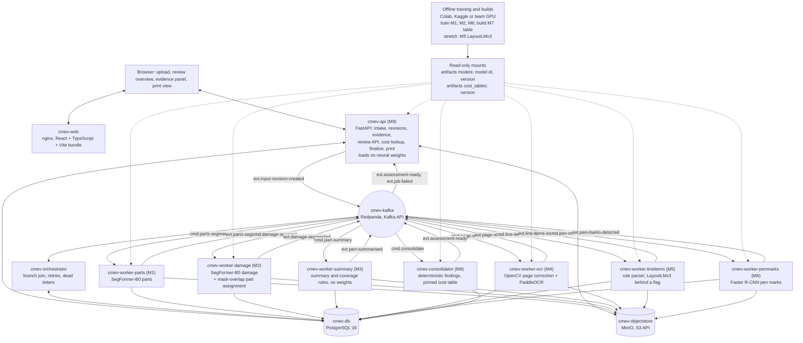
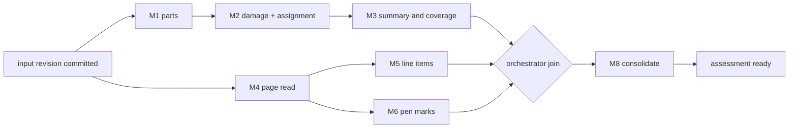
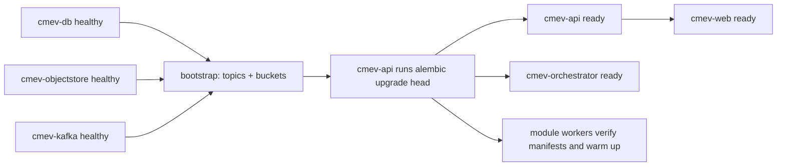

# Overall technical specification

Status: implementation baseline for the containerised event-driven runtime. Nothing in this document is implemented or measured; every library, image tag and number is **proposed** until the day-1 and day-2 smoke tests record a result.
Owner: Lane 5 for the platform, transport and deployment. Module owners own their own container image, consumer wiring and model loading.
Source: [proposal v2](../CLAIM-CMEV_project_proposal_v2.md) sections 8, 9, 10, 11, 13 and 16, plus the user's runtime directive of 2026-09-22 recorded in [ADR 0002](../adr/0002-containerised-event-runtime.md).

## 1. Purpose and scope

This document describes how CLAIM-CMEV runs online: which containers exist, what each one consumes and produces, how messages move between them, what is stored where, and how the system is deployed on a team machine.

It does not change any domain rule. The decision rules in proposal v2 section 8, the records in section 9.3, the module scope in section 10, the datasets in section 11 and the evaluation plan in section 13 apply exactly as written. Only the runtime and the transport change.

### 1.1 Declared change from the original proposal v2 section 9.1

Proposal v2 section 9.1 originally specified two processes built from one code base (one FastAPI API and one worker), a database jobs table, **no message broker**, SQLite in write-ahead-log mode, local files, and optional Docker Compose.

The user directed a different runtime on 2026-09-22: **containerise each module, and use Kafka, or a proposed equivalent, as the main transport between modules.** This specification targets that runtime, and proposal v2 section 9.1 has since been rewritten to describe it directly. The table below is the historical record of that change:

| Item | Original proposal v2 section 9.1 | This specification | Consequence |
| --- | --- | --- | --- |
| Process count | 2 (API, worker) plus browser | 12 containers in the `full` profile, 6 in the `lean` profile | More images, more health checks, more wiring |
| Transport | Database jobs table, polled | Kafka topics, at-least-once, key `claim_id` | New contracts, new failure modes, new operational skills |
| Database | SQLite with WAL | PostgreSQL 16 | Forced: see section 1.2 |
| File storage | Local files | MinIO behind the same storage adapter, host paths for the read-only registry | Adapter keeps both options open |
| Compose | Optional | Required, two profiles | Bootstrap must be scripted |
| M8 consolidation | Originally ran inside the API process | Runs in `cmev-consolidator`, its own container | Now consistent: proposal v2 section 9.4 was updated to match. See section 16.2 |
| Platform effort | Assumed small | Materially larger: see section 15 | Needs the `lean` fallback and shared ownership |

The original proposal v2 did not say any of this. It was a directed change on top of v2 and needed [ADR 0002](../adr/0002-containerised-event-runtime.md), which supersedes [ADR 0001](../adr/0001-prototype-runtime.md); the proposal text itself has since caught up with that decision.

### 1.2 Why containerising modules forces PostgreSQL

SQLite takes one writer at a time. Its write-ahead-log mode makes concurrent readers safe, not concurrent writers. It also relies on file locks that are unreliable across container boundaries and bind mounts.

In the `full` profile, six module containers plus the orchestrator, the consolidator and the API all commit rows for the same claim at overlapping times. Under SQLite these writers would serialise on one file lock, time out under `SQLITE_BUSY`, and lose the transactional guarantee that the job row and the result rows commit together. That guarantee is what makes at-least-once delivery safe.

PostgreSQL is therefore a **consequence of the user's directive**, not a separate decision to enlarge scope. If the team later returns to a single process, SQLite returns with it.

### 1.3 No language model sits in the decision path

This answer is identical in every CLAIM-CMEV specification.

- Part and damage integration is **deterministic mask overlap** in M2. A damage region is assigned to a part only when the overlap passes a validation-selected threshold and the candidate is unambiguous, exactly as proposal v2 section 10 M2 requires.
- Vision and document integration is the **deterministic rule set** in M8, that is the ordered rules in proposal v2 section 8.
- Reasons: findings must be reproducible, version-pinned and immutable. A finding is replayed from pinned inputs and a pinned code revision. A language model cannot be pinned to a reproducible output, cannot be evaluated inside the 50-person-day budget, and would make an assessment unreplayable.

An optional stretch service `cmev-explainer` may rewrite an already-computed finding into a readable sentence. It is off by default, it never changes a result, a check, a state or a stored value, and any sentence it produces is marked in `provenance` as generated text. It is not in the `lean` profile and it is not a success criterion.

## 2. Runtime overview



Reading the diagram: the browser talks only to `cmev-web` and `cmev-api`. No module worker is reachable from the browser. Every online hand-off between modules is a Kafka message. Every result is written to PostgreSQL and MinIO before the completion event is published. The offline training path never runs inside a claim request; it writes into the read-only registry, which containers mount.

### 2.1 Branch structure for one input revision



M2 depends on M1 because assignment needs the part masks. M5 and M6 both depend on M4 because both work on the corrected page image and the OCR boxes; they run in parallel. M3 depends on M2. The join needs three events: `part-summarised`, `line-items-extracted` and `pen-marks-detected`.

## 3. Service catalogue

All image tags are **proposed** and must be pinned by digest after the day-2 smoke test. "Tables written" names PostgreSQL schemas and tables from section 8. "Prefixes written" names MinIO prefixes from section 9.

| Container | Module | Base image (proposed) | Language and key dependencies | CPU or GPU | Topics consumed | Topics produced | Tables written | Object-store prefixes written | Readiness condition | Scaling unit |
| --- | --- | --- | --- | --- | --- | --- | --- | --- | --- | --- |
| `cmev-web` | M9 | `node:20-alpine` build stage, `nginx:1.27-alpine` runtime | TypeScript, React 18, Vite; static bundle only | CPU, negligible | none | none | none | none | nginx serves `/index.html` and `/healthz` returns 200 | One replica; static assets |
| `cmev-api` | M9 | `python:3.11-slim` | FastAPI, uvicorn, Pydantic v2, SQLAlchemy 2, Alembic, `confluent-kafka`, `boto3`, `python-multipart`, Pillow | CPU; loads no neural weights | `cmev.evt.assessment-ready.v1`, `cmev.evt.job-failed.v1` | `cmev.evt.input-revision-created.v1` via the outbox relay | `claim.*`, `review.*`, `ops.outbox`, `ops.idempotency_keys` | `claims/<claim_id>/input/**` | Alembic head matches the image's expected head; PostgreSQL reachable; MinIO `HeadBucket` succeeds; Kafka metadata fetched; the configured active cost-table version resolves | Stateless HTTP replicas behind nginx |
| `cmev-orchestrator` | none (platform) | `python:3.11-slim` | SQLAlchemy 2, `confluent-kafka`, no ML | CPU, small | every `cmev.evt.*` completion topic, `cmev.evt.job-failed.v1` | every `cmev.cmd.*` topic, `cmev.dlq.v1` | `ops.jobs`, `ops.job_attempts`, `ops.branch_state`, `ops.dead_letters`, `ops.outbox` | none | PostgreSQL reachable; partitions assigned on all consumed topics | Kafka partitions; at most one consumer per partition |
| `cmev-worker-parts` | M1 | `pytorch/pytorch:2.4.1-cuda12.1-cudnn9-runtime`, CPU variant `python:3.11-slim` + CPU wheels | PyTorch, `transformers` SegFormer-B0, Pillow, NumPy, `confluent-kafka`, `boto3` | GPU preferred, CPU supported | `cmev.cmd.parts-segment.v1` | `cmev.evt.parts-segmented.v1`, `cmev.evt.job-failed.v1` | `imaging.part_predictions`, `imaging.image_quality`, `ops.jobs`, `ops.consumed_messages` | `claims/<claim_id>/derived/<input_revision>/masks/parts/` | Model manifest read, weights hash matches the manifest, one warm-up inference on a bundled fixture image completes, partitions assigned | One container per GPU, or N CPU replicas up to the partition count |
| `cmev-worker-damage` | M2 | same as parts | PyTorch, `transformers`, NumPy, SciPy or OpenCV for connected components | GPU preferred, CPU supported | `cmev.cmd.damage-segment.v1` | `cmev.evt.damage-segmented.v1`, `cmev.evt.job-failed.v1` | `imaging.damage_observations`, `imaging.observation_candidates`, `ops.*` | `.../masks/damage/`, `.../overlays/damage/` | As parts, plus the part-mask objects named in the command resolve | One container per GPU, or N CPU replicas |
| `cmev-worker-summary` | M3 | `python:3.11-slim` | NumPy, Shapely (proposed), SQLAlchemy; **no weights** | CPU, small | `cmev.cmd.part-summary.v1` | `cmev.evt.part-summarised.v1`, `cmev.evt.job-failed.v1` | `imaging.part_coverage`, `imaging.summary_groups`, `imaging.summary_members`, `ops.*` | `.../overlays/summary/` | Rule configuration version loads and validates; partitions assigned | CPU replicas up to the partition count |
| `cmev-worker-ocr` | M4 | `python:3.11-slim` plus Paddle runtime packages (proposed; a Paddle-published image is the fallback) | OpenCV, PaddleOCR pinned version, PaddlePaddle, Pillow, `pdf2image` or PyMuPDF | CPU adequate; GPU optional | `cmev.cmd.page-read.v1` | `cmev.evt.page-read.v1`, `cmev.evt.job-failed.v1` | `document.page_readings`, `document.text_boxes`, `ops.*` | `.../pages/<page_no>/corrected.png` | PaddleOCR model files present in the image or the mounted cache, one warm-up OCR on a bundled fixture page completes | CPU replicas up to the partition count |
| `cmev-worker-lineitems` | M5 | `python:3.11-slim`; stretch variant adds `transformers` and PyTorch | Parser code, `regex`, `rapidfuzz` (proposed), optional LayoutLMv3 behind `CMEV_ENABLE_LAYOUTLMV3` | CPU; GPU only for the stretch model | `cmev.cmd.line-items-extract.v1` | `cmev.evt.line-items-extracted.v1`, `cmev.evt.job-failed.v1` | `document.line_items`, `document.line_item_fields`, `document.declaration_status`, `ops.*` | `.../overlays/lineitems/` | Layout-family rule pack and vocabulary version load and validate; the stretch model is **not** a startup dependency when disabled | CPU replicas up to the partition count |
| `cmev-worker-penmarks` | M6 | same as parts | PyTorch, torchvision Faster R-CNN ResNet-50 FPN, optional pinned TrOCR behind `CMEV_ENABLE_TROCR` | GPU preferred, CPU supported | `cmev.cmd.pen-marks-detect.v1` | `cmev.evt.pen-marks-detected.v1`, `cmev.evt.job-failed.v1` | `document.pen_marks`, `document.pen_mark_candidates`, `ops.*` | `.../overlays/marks/` | Detector manifest read and weights hash matches; warm-up detection on a bundled fixture page completes | One container per GPU, or N CPU replicas |
| `cmev-consolidator` | M8 | `python:3.11-slim` | Rule code, `decimal`, SQLAlchemy, Parquet or CSV reader for the cost table; **no weights** | CPU, small | `cmev.cmd.consolidate.v1` | `cmev.evt.assessment-ready.v1`, `cmev.evt.job-failed.v1` | `assessment.assessments`, `assessment.findings`, `assessment.finding_checks`, `assessment.possible_additions`, `ops.*` | `.../exports/` if a structured snapshot is written | The pinned cost-table version resolves under the read-only mount and its manifest validates; rule configuration version loads | CPU replicas up to the partition count |
| `cmev-kafka` | none | `redpandadata/redpanda:v24.2.x` | Redpanda, Kafka API compatible, no ZooKeeper | CPU; 1 to 2 GB RAM in development | n/a | n/a | n/a | n/a | `rpk cluster health` reports healthy and the broker's admin port answers | Single broker in development; not scaled in this project |
| `cmev-db` | none | `postgres:16-alpine` | PostgreSQL 16 | CPU | n/a | n/a | all | n/a | `pg_isready` succeeds | Single instance; not scaled |
| `cmev-objectstore` | none | `minio/minio:RELEASE.2024-xx` | MinIO server, S3 API | CPU, disk bound | n/a | n/a | n/a | n/a | `/minio/health/ready` returns 200 and the required buckets exist | Single instance; not scaled |
| `cmev-explainer` | stretch, none | `python:3.11-slim` | Off by default. Turns one computed finding into a sentence | CPU | `cmev.evt.assessment-ready.v1` | none; writes explanation text only | `assessment.finding_explanations` | none | Disabled unless `CMEV_ENABLE_EXPLAINER=true`; never a startup dependency of any other service | Not in either profile by default |

Notes that apply to every worker row:

- Every worker also writes `ops.jobs` and `ops.consumed_messages` as part of the same transaction that writes its module results. That single transaction is what makes at-least-once delivery safe.
- No worker calls another worker. No worker serves HTTP to the browser. Each exposes a private `/healthz` and `/readyz` on port 8080 for the Compose health check only.
- The offline training path is not a container in either profile. It runs in notebooks or scripts under `pipelines/` and publishes into the read-only registry described in section 9.3.

## 4. Are module workers independent agents?

**Yes, in the operational sense, and the answer matters for how the team divides work.**

Each module worker container is an autonomous consumer. Concretely:

| Property | What each worker owns |
| --- | --- |
| Model loading | Its own registry entry, its own weights, its own device choice, its own warm-up. No other container loads its weights |
| Lifecycle | Its own image, its own dependency set, its own Dockerfile, its own start, stop and restart |
| Work intake | Its own consumer group on its own command topic. It is never called synchronously by another module |
| Failure handling | Its own retry, its own backoff, its own `job-failed` event, its own dead-letter routing |
| Scaling | Its own replica count, bounded by its topic's partition count |
| Release | Its own model version and configuration version, recorded on every row it writes |
| Testing | Its own contract fixtures, replayable from a recorded command message without the rest of the system running |

This is what lets a five-member team work in parallel. Lane 1 can restart `cmev-worker-damage` with new weights while Lane 2 is editing the parser, and neither blocks the other. A module owner can develop against a single recorded message and a local PostgreSQL, with no browser and no other worker running.

**Independence does not mean any of the following.** State each one plainly, because the invariants in [AGENTS.md](../../AGENTS.md) depend on it:

- **No independent schema.** Every worker reads and writes the shared records in [data contracts](data_contracts.md) and the message envelope in [integration contracts](integration_contracts.md). A worker may not add a field to a shared record on its own. A schema change follows the contract-change workflow and lands in the shared package, not in one worker.
- **No independent taxonomy version.** Part, side, operation and damage vocabulary is one versioned artifact. A worker may not ship a private label mapping or renumber classes. Mismatched taxonomy versions are a startup refusal, not a silent remap.
- **No decision authority outside its module contract.** A worker publishes observations, extractions and proposals. It does not decide `ok`, `unsupported`, `cost_outlier` or `insufficient_evidence`. Only M8 in `cmev-consolidator` produces findings, and only from the pinned rule set in proposal v2 section 8.
- **No independent truth about state.** PostgreSQL holds the record of truth. A worker may not treat its own memory, its own cache or a Kafka offset as the claim's state.
- **No independent resolution of identity.** No worker may resolve a left or right side that its inputs do not support, or upgrade an unresolved identity to a resolved one. That rule from proposal v2 section 8.1 is unchanged by the runtime.
- **No autonomy over the input revision.** A worker processes the revision named in its command. It never chooses a different revision and never overwrites a newer one.

Short form for the team: workers are independent **processes**, not independent **authorities**.

## 5. Event flow for one claim

```mermaid
sequenceDiagram
    actor S as Surveyor
    participant W as cmev-web
    participant A as cmev-api
    participant DB as cmev-db
    participant K as cmev-kafka
    participant O as cmev-orchestrator
    participant P1 as cmev-worker-parts
    participant P2 as cmev-worker-damage
    participant P3 as cmev-worker-summary
    participant D4 as cmev-worker-ocr
    participant D5 as cmev-worker-lineitems
    participant D6 as cmev-worker-penmarks
    participant C as cmev-consolidator

    S->>W: Open upload page
    W->>A: POST /claims, POST /claims/id/files
    A->>DB: Stage files, store hashes
    S->>W: Submit
    W->>A: POST /claims/id/input-revisions
    A->>DB: One transaction: input revision + job rows + outbox row
    A-->>W: claim_id, input_revision, state queued
    A->>K: Outbox relay publishes evt.input-revision-created.v1

    K->>O: evt.input-revision-created.v1
    O->>DB: Create branch_state for this input revision
    O->>K: cmd.parts-segment.v1
    O->>K: cmd.page-read.v1

    par Image branch
        K->>P1: cmd.parts-segment.v1
        P1->>DB: part predictions + masks + job succeeded
        P1->>K: evt.parts-segmented.v1
        K->>O: evt.parts-segmented.v1
        O->>K: cmd.damage-segment.v1
        K->>P2: cmd.damage-segment.v1
        P2->>DB: damage observations, mask-overlap assignment
        P2->>K: evt.damage-segmented.v1
        K->>O: evt.damage-segmented.v1
        O->>K: cmd.part-summary.v1
        K->>P3: cmd.part-summary.v1
        P3->>DB: summary groups and coverage states
        P3->>K: evt.part-summarised.v1
    and Document branch
        K->>D4: cmd.page-read.v1
        D4->>DB: page readings, text boxes, corrected pages
        D4->>K: evt.page-read.v1
        K->>O: evt.page-read.v1
        O->>K: cmd.line-items-extract.v1
        O->>K: cmd.pen-marks-detect.v1
        K->>D5: cmd.line-items-extract.v1
        D5->>DB: line items, fields, declaration status
        D5->>K: evt.line-items-extracted.v1
        K->>D6: cmd.pen-marks-detect.v1
        D6->>DB: pen marks, candidate rows, all pending
        D6->>K: evt.pen-marks-detected.v1
    end

    K->>O: evt.part-summarised.v1, evt.line-items-extracted.v1, evt.pen-marks-detected.v1
    O->>DB: Mark branch_state complete; claim the single right to emit
    O->>K: cmd.consolidate.v1 (emitted once)
    K->>C: cmd.consolidate.v1
    C->>DB: Read branch results; apply section 8 rules with the pinned cost table
    C->>DB: Assessment revision, findings, checks, possible additions
    C->>K: evt.assessment-ready.v1
    K->>A: evt.assessment-ready.v1
    A->>DB: Move the claim's current assessment pointer
    S->>W: Open review overview
    W->>A: GET /claims/id/assessments/rev
    A-->>W: Findings, evidence references, pinned versions
```

Failure and partial cases in the same flow:

- If any worker fails after its retries, it publishes `cmev.evt.job-failed.v1`. The orchestrator records the failed stage, does **not** emit `cmd.consolidate.v1`, and the claim's processing state becomes `incomplete`. The successful branch's results stay readable, which is what proposal v2 section 9.2 requires.
- If the input revision contains photographs but no estimate pages, the orchestrator marks the document stages `not_required`, emits `cmd.consolidate.v1` with `document_branch: absent`, and the resulting assessment state is `awaiting_declared_entries`. Possible additions are withheld because declaration completeness is unknown, per proposal v2 section 8.2.
- A decision-changing correction creates a new input revision. The API sets `reuse_hint` on the new `input-revision-created` event listing the stages whose inputs are byte-identical. The orchestrator may skip those stages and reuse their prior result identifiers with recorded lineage, which is the explicit reuse allowed by proposal v2 section 8.4. It still emits `cmd.consolidate.v1` for the new revision.

## 6. Kafka operational specification

### 6.1 Broker choice

**Proposed: Redpanda, single broker, Kafka API compatible.** Reasons for a student team on a laptop or one Linux host:

- One container, no ZooKeeper and no KRaft controller quorum to configure.
- Lower memory than a JVM Kafka broker, which matters when three model containers already want RAM.
- The `rpk` CLI creates topics and inspects consumer lag in one command, which shortens the day-2 bootstrap.
- Clients are ordinary Kafka clients. If the team later swaps in Apache Kafka or Bitnami Kafka, only the image and the bootstrap address change. Nothing in the application code changes. This keeps the "or a proposed equivalent" option in the user's directive open.

Client library: **proposed `confluent-kafka` (librdkafka)** for both producers and consumers, because it gives explicit offset control, which the idempotency design in section 6.5 needs.

### 6.2 Topic naming and catalogue

Naming is `cmev.<kind>.<name>.v1`, where `cmd` is work to do and `evt` is a fact that has happened. Partition counts and retention below are development values and are **proposed**.

| Topic | Kind | Key | Partitions (dev) | Retention | Producer | Consumer group |
| --- | --- | --- | --- | --- | --- | --- |
| `cmev.evt.input-revision-created.v1` | evt | `claim_id` | 3 | 7 days | `cmev-api` outbox relay | `cmev-orchestrator` |
| `cmev.cmd.parts-segment.v1` | cmd | `claim_id` | 3 | 7 days | `cmev-orchestrator` | `cmev-worker-parts` |
| `cmev.evt.parts-segmented.v1` | evt | `claim_id` | 3 | 7 days | `cmev-worker-parts` | `cmev-orchestrator` |
| `cmev.cmd.damage-segment.v1` | cmd | `claim_id` | 3 | 7 days | `cmev-orchestrator` | `cmev-worker-damage` |
| `cmev.evt.damage-segmented.v1` | evt | `claim_id` | 3 | 7 days | `cmev-worker-damage` | `cmev-orchestrator` |
| `cmev.cmd.part-summary.v1` | cmd | `claim_id` | 3 | 7 days | `cmev-orchestrator` | `cmev-worker-summary` |
| `cmev.evt.part-summarised.v1` | evt | `claim_id` | 3 | 7 days | `cmev-worker-summary` | `cmev-orchestrator` |
| `cmev.cmd.page-read.v1` | cmd | `claim_id` | 3 | 7 days | `cmev-orchestrator` | `cmev-worker-ocr` |
| `cmev.evt.page-read.v1` | evt | `claim_id` | 3 | 7 days | `cmev-worker-ocr` | `cmev-orchestrator` |
| `cmev.cmd.line-items-extract.v1` | cmd | `claim_id` | 3 | 7 days | `cmev-orchestrator` | `cmev-worker-lineitems` |
| `cmev.evt.line-items-extracted.v1` | evt | `claim_id` | 3 | 7 days | `cmev-worker-lineitems` | `cmev-orchestrator` |
| `cmev.cmd.pen-marks-detect.v1` | cmd | `claim_id` | 3 | 7 days | `cmev-orchestrator` | `cmev-worker-penmarks` |
| `cmev.evt.pen-marks-detected.v1` | evt | `claim_id` | 3 | 7 days | `cmev-worker-penmarks` | `cmev-orchestrator` |
| `cmev.cmd.consolidate.v1` | cmd | `claim_id` | 3 | 7 days | `cmev-orchestrator` | `cmev-consolidator` |
| `cmev.evt.assessment-ready.v1` | evt | `claim_id` | 3 | 30 days | `cmev-consolidator` | `cmev-api`; optional `cmev-explainer` |
| `cmev.evt.job-failed.v1` | evt | `claim_id` | 3 | 30 days | any worker, consolidator | `cmev-orchestrator`, `cmev-api` |
| `cmev.dlq.v1` | dlq | `claim_id` | 1 | 30 days, compaction off | `cmev-orchestrator` | manual inspection; no automatic consumer |

Topic creation is explicit in the bootstrap script. Auto-creation is **disabled** so that a typo in a topic name fails loudly instead of silently creating a dead topic.

### 6.3 Keys, partitions and ordering

The message key is `claim_id`. Every message for one claim lands on one partition, so one claim keeps its order across all stages. Different claims spread across partitions and process in parallel.

Three partitions in development is a deliberate compromise: enough to demonstrate parallel claims and replica scaling, small enough that a laptop broker stays light. Partition count is fixed at bootstrap; increasing it later reshuffles keys and breaks per-claim ordering for in-flight work, so it is changed only on an empty topic.

Ordering guarantees the design relies on: per claim, per topic. The design does **not** rely on ordering across topics. The orchestrator's join in section 7.2 of [application_platform.md](application_platform.md) reads state from PostgreSQL, not from message arrival order, so `evt.line-items-extracted.v1` arriving before `evt.part-summarised.v1` is normal and harmless.

### 6.4 Consumer groups

One consumer group per service, named exactly after the container: `cmev-worker-parts`, `cmev-worker-damage`, `cmev-worker-summary`, `cmev-worker-ocr`, `cmev-worker-lineitems`, `cmev-worker-penmarks`, `cmev-consolidator`, `cmev-orchestrator`, `cmev-api`.

- Replicas of one service share its group, so each partition is consumed once.
- Maximum useful replicas equals the partition count. A fourth `cmev-worker-parts` replica on a three-partition topic idles.
- `enable.auto.commit=false`. Offsets are committed manually after the database transaction commits. See section 6.5.
- `max.poll.interval.ms` is set above the worst measured inference time for that worker, measured on day 2 and recorded. A model that takes longer than the configured interval causes a rebalance loop, which is the most likely first operational failure in this design.

### 6.5 At-least-once delivery and idempotent consumers

Delivery is at-least-once. A message can be delivered twice: after a rebalance, after a crash between the database commit and the offset commit, or after an orchestrator retry. Every consumer must therefore be idempotent.

The rule is the job-key uniqueness rule of proposal v2 section 9.6, extended by one field. **This is the canonical definition; every other document defers to it.** A job key is `(claim_id, input_revision, task, target, version_signature)`, written `<claim_id>:<input_revision>:<task>:<target>:<version_signature>`, where the version signature covers model, parser, taxonomy and configuration versions.

`target` names the scope one job covers. In the core scope a task is dispatched once per input revision and loops over every photograph or page inside the worker, so `target` is the fixed sentinel `all`. The field exists so that dispatching one command per photograph or per page later, if the day-4 latency measurement calls for it, changes the target value and not the key format. Two workers computing different key forms for the same work would break idempotency, so the field is mandatory even while it always holds `all`.

Proposal v2 section 9.6 gives the four-part form because it predates the per-module fan-out. The extra field is an addition, not a change of meaning.

Consumer algorithm, identical in every worker:

1. Receive the message. Validate the envelope and the `schema_version`. A message that fails validation goes straight to the dead-letter topic; it is not retried, because a retry will fail the same way.
2. Open one PostgreSQL transaction.
3. `INSERT INTO ops.consumed_messages (dedup_key, ...)`. `dedup_key` is unique. On conflict, this is a duplicate delivery: roll back, commit the offset, publish nothing, and record a duplicate counter. The first delivery already did the work.
4. `SELECT ... FOR UPDATE` the `ops.jobs` row for the job key. If its state is already `succeeded`, treat it as a duplicate exactly as in step 3.
5. Write the object-store artifacts first, under content-addressed temporary names, then move them to their final keys. An artifact that is not fully written is never referenced by a committed row.
6. Write the module result rows, set the job row to `succeeded`, and insert the completion event into `ops.outbox`, all in the same transaction.
7. Commit the transaction.
8. Commit the Kafka offset. If the process dies between step 7 and step 8, the redelivery is caught by step 3.
9. The outbox relay publishes the completion event. If it publishes twice, the orchestrator's own dedup key catches it.

The transactional outbox in step 6 is what removes the "did the database commit but not the publish?" gap. It is a small table and a small polling loop, and it is the single most important piece of this design to get right.

### 6.6 Retry, backoff and dead letters

Two kinds of failure:

| Failure kind | Examples | Handling |
| --- | --- | --- |
| Transient | Object store briefly unreachable, database connection dropped, GPU out of memory on one large image, OCR timeout | In-place retry inside the consumer: up to 3 attempts with backoff 2 s, 8 s, 30 s plus jitter. The offset is not committed until the attempt sequence ends |
| Permanent | Envelope fails schema validation, referenced artifact missing, taxonomy version mismatch, model manifest hash mismatch, unsupported media type | No retry. Publish `cmev.evt.job-failed.v1` with a stable reason code, route the original message to `cmev.dlq.v1`, commit the offset |

After in-place retries are exhausted, a transient failure is treated as permanent for that attempt: `job-failed` plus dead-letter routing. The job row keeps `attempt_count` and the last structured error.

**Proposed: no per-topic retry topics in the core scope.** In-place retry with bounded backoff plus an explicit operator retry is enough for this prototype and avoids thirteen extra topics. The cost is that a single slow poisoned message blocks its partition for up to about 40 seconds. That is acceptable at this scale and is recorded here so the team can change it deliberately if measurements say otherwise.

Operator retry: `POST /api/v1/claims/{claim_id}/jobs/{job_key}/retry` sets the job row to `pending`, increments `attempt_count`, and writes a fresh command into the outbox with a new `dedup_key`. It never duplicates a `succeeded` job.

Dead-letter contents: the original message, its headers, the consumer group, the reason code, the error text with claim content removed, and the timestamp. `cmev.dlq.v1` has no automatic consumer. Inspection is manual with `rpk topic consume cmev.dlq.v1`. A dead-lettered job shows in the UI as a failed branch with its reason code, never as a clean assessment.

### 6.7 Message size and why payloads carry references

Redpanda's default maximum message size is 1 MiB. A single claim photograph is commonly 2 to 8 MiB and a corrected page render can be larger. Image bytes therefore never travel through Kafka.

Every message carries **references only**: artifact identifiers and object-store URIs. A consumer fetches bytes from MinIO with its own credentials. Consequences worth stating:

- Messages stay in the low kilobytes. A command with ten photograph references is roughly 2 to 4 KB.
- Producers reject any message above **256 KiB** before sending. Hitting that limit means a list has grown unbounded and needs pagination, not a larger limit.
- A reference must be resolvable for the lifetime of the retention window plus the retry window. Evidence objects are never deleted during ordinary processing, which is already required by the invariant that original evidence is preserved.
- The consumer verifies the object's SHA-256 against the value in the message before use. A reference that does not resolve, or whose hash differs, is a permanent failure, not a retry.

### 6.8 Envelope and schema evolution

Every message, command or event, carries the same envelope. Field meanings are defined in [integration contracts](integration_contracts.md) and must match [data contracts](data_contracts.md).

| Envelope field | Meaning |
| --- | --- |
| `schema_version` | Contract version of this message body, validated at both ends |
| `claim_id` | Also the partition key |
| `input_revision` | The revision this work belongs to. A worker never substitutes another |
| `job_key` | `(claim_id, input_revision, task, version_signature)`, the uniqueness anchor from proposal v2 section 9.6 |
| `versions` | Model, parser, taxonomy, configuration and code revisions relevant to the task |
| `provenance` | `real / synthetic / fixture`, source identifiers, derivation references |
| `occurred_at` | UTC timestamp with timezone |
| `dedup_key` | Stable per delivery attempt; the unique key in `ops.consumed_messages` |
| `trace_id` | Correlates every log line, row and message for one claim run |

Serialisation: **proposed JSON with JSON Schema validation**, schemas versioned under `src/claim_cmev/contracts/events/`. Avro plus a schema registry is stronger, and is the obvious later upgrade, but it adds a registry container and a code-generation step that the budget in section 15 cannot absorb.

Evolution rules:

- Within `.v1`, only **additive optional** changes. New optional field, new optional reason code, new enum member in a field documented as open. Consumers ignore unknown fields.
- Any breaking change gets a new topic with `.v2`. Examples of breaking: removing a field, renaming a field, changing a type, changing the meaning of a value, making an optional field required.
- During a `.v1` to `.v2` transition the producer publishes to both topics for one working day while consumers move. The old topic is deleted only after its consumer group lag reaches zero.
- The `.v1` suffix is part of the topic name, never a header. That makes the version visible in `rpk topic list` and in every log line.
- A consumer that receives a `schema_version` it does not understand fails permanently with reason `schema_unsupported`. It never guesses.

### 6.9 Local development

- One broker, `cmev-kafka`, no replication (`replication.factor=1`). This is development only and is not a durability claim.
- Topics created by `infra/compose/bootstrap/create-topics.sh` using `rpk`, idempotent, safe to re-run.
- A developer working on one module runs `docker compose up cmev-db cmev-objectstore cmev-kafka` plus their own worker, and replays a recorded command with `rpk topic produce`. No browser, no other worker.
- `tests/integration/` includes a recorded message corpus so a module can be exercised without the broker at all, by calling the consumer handler directly with a parsed envelope.
- `rpk group describe <group>` shows consumer lag. Lag that does not fall is the first thing to check when the UI sits at `processing`.

## 7. Alternatives considered

| Option | Summary | Verdict |
| --- | --- | --- |
| **Database jobs table** (proposal v2 section 9.1) | Workers poll a `jobs` table, take a row under a lease, run, commit the result and the job state in one transaction | **Genuinely the better fit for v2 as written, and it is being set aside by directive, not because it was wrong.** It has one fewer container, no broker to learn, no consumer-group rebalance failure mode, exactly-once semantics from a single transaction, and it is trivially debuggable with SQL. Its real limits appear only at the scale this project does not reach. It is retained as the documented fallback in section 15 and keeps the same envelope shape so the switch is mechanical |
| **Redis Streams** | Consumer groups, `XADD`/`XREADGROUP`, pending-entry lists | Deferred. Lighter than Kafka and would work. But it adds a second data store whose durability defaults are weaker, and the team would still write the same idempotency and outbox code. It buys little over the jobs table and less than Kafka over the directive |
| **RabbitMQ** | Mature broker, per-message acknowledgement, dead-letter exchanges built in, good routing | Rejected for this directive. Its natural model is a work queue, not a replayable log. Replaying a claim's history, which is useful for debugging an immutable-assessment system, means republishing rather than re-reading. The user asked for Kafka or an equivalent, and a log is the closer match |
| **NATS JetStream** | Very light, fast, streams with consumers, good single-binary story | Deferred, and the strongest runner-up. Smaller footprint than Redpanda. Set aside because its client and operational idioms are less commonly known, and because Kafka API compatibility lets the team keep the Kafka clients the directive implies |
| **Celery with Redis or RabbitMQ** | Familiar Python task queue, retries and result backend included | Rejected. Celery's unit is a Python function call, so producers and consumers share a code base and a task signature. That directly conflicts with the container-per-module goal: each worker would need every module's task definitions importable. It also hides the message contract inside decorators, where it cannot be versioned as a `.v1` topic |
| **Synchronous HTTP between modules** | The API calls each worker in turn | Rejected. Model inference takes seconds to minutes. A synchronous chain gives the browser a long request, no durable record of in-flight work, and a failure in one module that loses the others' results |

## 8. Data architecture

PostgreSQL 16 is the record of truth. Kafka is transport. If Kafka is wiped, no claim record is lost; the affected input revisions are re-dispatched from their job rows. If PostgreSQL is lost, the claim record is lost.

### 8.1 Schema areas and main tables

Mapped to the records in proposal v2 section 9.3 and to [data contracts](data_contracts.md).

| Schema | Table | Holds | v2 section 9.3 record |
| --- | --- | --- | --- |
| `claim` | `claims` | Claim identity, external claim reference, created time, demo actor | Claim input |
| `claim` | `input_revisions` | Immutable revision: vehicle make, model, year (metadata only), resolved vehicle class or unknown, currency, declaration source, prior revision, corrected-input reference | Claim input |
| `claim` | `input_files` | File identity, role (`photograph` / `estimate_page`), media type, byte size, SHA-256, original filename, object key, page number, staging state | Claim input |
| `imaging` | `part_predictions` | Photo reference, part identity or unresolved, mask object key, confidence, model version, transform metadata | Part coverage |
| `imaging` | `image_quality` | Per-photo quality state, blur, lighting, crop and obstruction reasons, configuration version | Part coverage |
| `imaging` | `damage_observations` | Observation identity, photo reference, damage type, part identity or unresolved, overlap score, confidence, image-area measure, mask object key | Damage observation |
| `imaging` | `observation_candidates` | Retained candidate parts for an ambiguous assignment | Damage observation |
| `imaging` | `part_coverage` | Part identity, `adequate` / `inadequate` / `not_visible` / `unresolved`, covering photo references, per-view quality, reason codes | Part coverage |
| `imaging` | `summary_groups`, `summary_members` | Conservative part summary and every member observation identity. No inferred physical-damage count | Part summary |
| `document` | `page_readings` | Page reference, corrected-page object key, transform back to the original, OCR engine version, reading order, quality flags, granularity actually produced | Page reading |
| `document` | `text_boxes` | Located text with confidence and coordinates at the granularity the engine supplied | Page reading |
| `document` | `line_items` | Entry identity, original text, mapped part, side, operation, quantity, unit price, line total, currency, cost basis, page and box references, field uncertainty | Line item |
| `document` | `line_item_fields` | Per-field original text, mapped value, uncertainty and source box | Line item |
| `document` | `declaration_status` | `complete` / `partial` / `unreadable` / `explicitly_empty` and the source of any human confirmation | Declaration status |
| `document` | `pen_marks` | Mark identity, nullable entry identity, type, box, detection confidence, `pending` / `confirmed` / `rejected`, confirming review action | Pen mark |
| `document` | `pen_mark_candidates` | Retained candidate rows for an unlinked or ambiguous mark | Pen mark |
| `cost` | `cost_tables` | Table version, build identity, generator version, cutoff date, calibration method, synthetic marker, active flag | Reference cost range |
| `cost` | `cost_ranges` | Cost key (part, operation, vehicle class, currency), fixed cost basis, lower bound, upper bound, independent base-case support count | Reference cost range |
| `cost` | `cost_table_members` | Build membership and exclusion reasons for a table version | Reference cost range |
| `cost` | `approval_imports`, `approval_records` | Stretch S3 only. Explicitly synthetic final approvals with supersession lineage | Final approved amount |
| `assessment` | `assessments` | Assessment revision, input revision, pinned model, parser, taxonomy, configuration, code and cost-table versions, processing state | Finding |
| `assessment` | `findings` | Finding identity, entry or observation reference, overall result, explanation, evidence references | Finding |
| `assessment` | `finding_checks` | Each check separately: photo evidence, cost range, missing repair, with result and reason code. A withheld check is `not_evaluated` with a reason | Finding |
| `assessment` | `possible_additions` | Eligible observations without a matching row, with the ambiguity that withheld them | Finding |
| `assessment` | `finding_explanations` | Stretch `cmev-explainer` output only, marked as generated text | none |
| `review` | `review_revisions` | Review revision for one assessment, actor, state, finalized time | Review action |
| `review` | `review_actions` | Action type, actor, time, reason, original and new values, expected prior review revision, idempotency key | Review action |
| `ops` | `jobs` | Job key, claim, input revision, task, version signature, state, attempt count, structured error, result references | none: platform |
| `ops` | `job_attempts` | One row per attempt with topic, partition, offset, consumer group, container identity, duration | none: platform |
| `ops` | `branch_state` | Per input revision, one row tracking each required stage and the single `consolidate_emitted_at` | none: platform |
| `ops` | `consumed_messages` | `dedup_key` unique. The idempotency guard for at-least-once delivery | none: platform |
| `ops` | `outbox` | Pending outbound messages written in the same transaction as their results | none: platform |
| `ops` | `dead_letters` | Dead-lettered message metadata and reason code | none: platform |
| `ops` | `idempotency_keys` | HTTP idempotency keys with the request hash and the committed response | none: platform |
| `public` | `alembic_version` | Migration head | none: platform |

### 8.2 Money

Money is **never** a binary float. Three things always travel together and are never separated:

- amount: `NUMERIC(12,2)` in PostgreSQL, a decimal **string** in JSON and in every Kafka message;
- `currency`: ISO code, `CHAR(3)`. Cost comparison supports SGD only; other currencies are stored and displayed with no cost check;
- `cost_basis_version`: the fixed single-part basis from proposal v2 section 8.3.

Every money column also carries its **kind**, so the three amounts in proposal v2 section 2.3 can never be confused: `printed`, `effective` or `approved`. They live in separate columns and separate records. A surveyor's entered effective amount never overwrites the printed amount. An approved amount never enters the assessment of its own claim.

A null amount always carries a reason code. Zero is a value, not a missing value, and is never substituted for an unread field. Quantity is never silently set to one.

### 8.3 Revision tables

Three independent revision counters, all claim-local and monotonic:

| Revision | Table | Created by | Immutable content |
| --- | --- | --- | --- |
| `input_revision` | `claim.input_revisions` | Upload, added photographs, or a decision-changing correction | Exact file set, hashes, vehicle metadata, declaration source |
| `assessment_revision` | `assessment.assessments` | `cmev-consolidator` on `cmd.consolidate.v1` | Findings, checks, additions and every pinned version |
| `review_revision` | `review.review_revisions` | Any saved review action | The ordered human actions against one assessment |

Rules that the schema enforces with constraints, not with application care alone:

- An assessment row is insert-only. There is no `UPDATE` path for a finding.
- `(claim_id, assessment_revision)` and `(claim_id, review_revision)` are unique.
- A review revision references exactly one assessment revision.
- The claim's current assessment pointer moves forward only. A late result for an older input revision is stored against that revision and cannot move the pointer.

### 8.4 Job and idempotency tables

- `ops.jobs` unique index on `(claim_id, input_revision, task, version_signature)`. This is the job key from proposal v2 section 9.6 and it is the reason a redelivered command cannot produce a second result set.
- `ops.consumed_messages` unique index on `dedup_key`, with a retention job that deletes rows older than the topic retention window plus a margin.
- `ops.outbox` with `(id, topic, key, payload, created_at, published_at)`. The relay selects unpublished rows in id order, publishes, then stamps `published_at`. A crash mid-publish republishes, which the consumer dedup absorbs.
- `ops.branch_state` with one row per `(claim_id, input_revision)` and a `consolidate_emitted_at` column. The emit is claimed with `UPDATE ... SET consolidate_emitted_at = now() WHERE consolidate_emitted_at IS NULL RETURNING id`. Only one orchestrator replica gets a row back, so `cmd.consolidate.v1` is emitted once even with several replicas.
- `ops.idempotency_keys` unique on `(claim_id, endpoint, idempotency_key)`, storing the request hash and the committed response. Same key with the same payload replays the stored response. Same key with a different payload is a conflict.

### 8.5 Migration policy

- Alembic, forward-only. No destructive migration in the demonstration window.
- Migrations run in `cmev-api` at start, guarded by a PostgreSQL advisory lock so concurrent replicas do not race.
- Every image records the Alembic head it was built against. A worker whose expected head differs from the database head **refuses to start** and says so. A partially migrated cluster must not process claims.
- A schema change that alters a shared record follows the contract-change workflow: contract first, then migration, then producers, then consumers.
- Rollback is restore-from-snapshot, not a down-migration. Section 11.7 describes the snapshot.

## 9. Storage architecture

### 9.1 MinIO buckets and prefixes

| Bucket | Purpose | Access |
| --- | --- | --- |
| `cmev-evidence` | All claim material and everything derived from it | Read and write for API and workers; never reachable from the browser |
| `cmev-exports` | Structured assessment snapshots written at finalize | Read and write for API and consolidator |
| `cmev-artifacts` | Optional mirror of the model registry and cost tables when the team runs on more than one host | Read only for every container |

Prefix layout inside `cmev-evidence`, all under one claim so that an access check is a prefix check:

```
claims/<claim_id>/input/<input_revision>/originals/<file_id>.<ext>
claims/<claim_id>/input/<input_revision>/pages/<page_no>/original.<ext>
claims/<claim_id>/derived/<input_revision>/pages/<page_no>/corrected.png
claims/<claim_id>/derived/<input_revision>/masks/parts/<photo_id>.png
claims/<claim_id>/derived/<input_revision>/masks/damage/<photo_id>.png
claims/<claim_id>/derived/<input_revision>/overlays/damage/<photo_id>.png
claims/<claim_id>/derived/<input_revision>/overlays/summary/<part_key>.png
claims/<claim_id>/derived/<input_revision>/overlays/lineitems/<page_no>.png
claims/<claim_id>/derived/<input_revision>/overlays/marks/<page_no>.png
claims/<claim_id>/exports/<assessment_revision>/<review_revision>/assessment.json
```

Every object is immutable once its database row commits. A re-run writes under a new input revision, never over an existing key. Object keys are generated; the original filename stays in the database and is never used to build a key.

### 9.2 Serving evidence

Two options exist. The choice is deliberate.

| Option | Behaviour | Decision |
| --- | --- | --- |
| Presigned MinIO URL to the browser | Fast, takes bytes off the API | **Rejected for evidence.** A presigned URL carries no claim authorisation, works for anyone who has the link until it expires, cannot be revoked when a review session ends, and would appear in browser history and logs. Proposal v2's invariant that evidence resolves through claim-authorised routes would not hold |
| API-mediated fetch | `GET /api/v1/claims/{claim_id}/evidence/{artifact_id}` checks that the artifact belongs to that claim, then streams the object | **Chosen.** One authorisation point, one audit point. `ETag` from the object SHA-256 and long cache headers keep the cost low, because evidence objects are immutable |

Presigned URLs remain acceptable for internal transfers between containers on the private network, where credentials are already service-scoped. They are never handed to a browser.

### 9.3 Read-only model registry and cost tables

The registry stays a **host directory mounted read only** into the containers that need it, at the layout proposal v2 section 9.5 already defines:

```
artifacts/models/<model_id>/<version>/weights.*        parts, damage, penmarks, optional lineitems
artifacts/models/<model_id>/<version>/manifest.json    checkpoint, licence, split hashes, label schema,
                                                       preprocessing, metrics, limits, candidate or approved
artifacts/cost_tables/<version>/ranges.parquet         cost key, bounds, independent support count
artifacts/cost_tables/<version>/manifest.json          generator rules, split and cutoff, calibration,
                                                       membership, exclusions, synthetic marker
```

Reasons for a mount rather than a bucket: a model container must be able to start and verify its weights before MinIO is healthy; the hashes are checked against the manifest at start, so tampering is caught either way; and it keeps the offline path unchanged, because a Colab or Kaggle run produces a folder, not an S3 upload. The `cmev-artifacts` bucket mirrors the same tree when the team spreads containers across hosts.

Rules:

- Mounted `:ro`. No container may write into the registry at run time.
- A worker verifies the weight file's SHA-256 against its manifest at start and refuses to start on a mismatch.
- Every result row records the model or configuration version that produced it.
- A disabled stretch model has no registry entry requirement and is not a startup dependency.
- Fixture mode writes `provenance.source_kind = fixture` on every row and cannot be presented as inference.

## 10. Repository and dependency boundaries

Existing scaffold directories are kept. The worker layout changes because the two combined workers become six module workers plus two platform services.

| Directory | Responsibility and dependency rule | Status |
| --- | --- | --- |
| `apps/workbench/` | Browser client. Calls `cmev-api` only. Never PostgreSQL, MinIO or Kafka. Built into the `cmev-web` image | Exists |
| `apps/api/` | `cmev-api` entrypoint: HTTP, configuration, Kafka producer and result consumer, outbox relay. Calls domain services; loads no neural weights | Exists |
| `workers/_shared/` | Consumer runtime shared by every worker: envelope parse and validate, dedup insert, job-row transaction, backoff, dead-letter routing, health endpoint, structured logging. A worker that reimplements this is a review finding | **New, proposed** |
| `workers/parts/` | `cmev-worker-parts` entrypoint and Dockerfile. M1 model loading | **New, proposed** |
| `workers/damage/` | `cmev-worker-damage` entrypoint and Dockerfile. M2 model loading and overlap assignment | **New, proposed** |
| `workers/summary/` | `cmev-worker-summary` entrypoint and Dockerfile. M3, no weights | **New, proposed** |
| `workers/ocr/` | `cmev-worker-ocr` entrypoint and Dockerfile. M4 OpenCV and PaddleOCR | **New, proposed** |
| `workers/lineitems/` | `cmev-worker-lineitems` entrypoint and Dockerfile. M5 parser, optional LayoutLMv3 behind a flag | **New, proposed** |
| `workers/penmarks/` | `cmev-worker-penmarks` entrypoint and Dockerfile. M6 detector, optional TrOCR behind a flag | **New, proposed** |
| `workers/orchestrator/` | `cmev-orchestrator` entrypoint. Branch join, dispatch, retry, dead letters | **New, proposed** |
| `workers/consolidator/` | `cmev-consolidator` entrypoint. M8 rules, pinned cost table | **New, proposed** |
| `workers/combined/` | The `lean` profile's single worker. Imports every module handler and subscribes to every command topic in one process. Same handlers, same contracts, same records | **New, proposed** |
| `workers/image/`, `workers/document/` | v1 scaffold, superseded by the per-module directories above. Retire after the new layout exists; do not add code to them | Exists, to retire |
| `src/claim_cmev/contracts/` | Serializable record definitions and the message envelope. No application imports, no framework imports | Exists |
| `src/claim_cmev/contracts/events/` | JSON Schema files for every topic, one per `.v1` topic | **New, proposed** |
| `src/claim_cmev/messaging/` | Producer, consumer, outbox relay, dedup helper, retry policy. The only place Kafka client code lives | **New, proposed** |
| `src/claim_cmev/taxonomy/` | Versioned part, side, operation and damage mapping | Exists |
| `src/claim_cmev/vision/parts/` | M1 inference logic | Exists |
| `src/claim_cmev/vision/damage/` | M2 inference and mask-overlap assignment | Exists |
| `src/claim_cmev/vision/summary/` | M3 summary and coverage rules. Proposed rename of `vision/multiview/`, because v2 M3 no longer promises multi-view reconstruction | Exists as `multiview/`, rename **proposed** |
| `src/claim_cmev/documents/text_layout/` | M4 page correction and OCR wrapper | Exists |
| `src/claim_cmev/documents/line_items/` | M5 parser, layout families, vocabulary mapping | Exists |
| `src/claim_cmev/documents/marks/` | M6 detection post-processing and geometric row linking | **New, proposed** |
| `src/claim_cmev/costs/reference/` | M7 lookup contract; the offline fit lives in `pipelines/costs/` | Exists |
| `src/claim_cmev/costs/anomaly/` | v1 M07. v2 folds cost checks into M8. Retire or leave empty; do not add code | Exists, to retire |
| `src/claim_cmev/comparison/` | M8 deterministic rules from proposal v2 section 8 | Exists |
| `src/claim_cmev/orchestration/` | Branch-join policy and job state machine, shared by orchestrator and API | Exists |
| `src/claim_cmev/persistence/` | Repositories, transactions, storage adapter. The adapter keeps MinIO and a local filesystem behind one interface | Exists |
| `pipelines/{vision,documents,costs}/` | Offline conversion, training, calibration, evaluation, cost-table builds. Never imported by a worker at request time | Exists |
| `configs/` | Small versioned configuration. No credentials, no model binaries | Exists |
| `infra/compose/` | Compose base file, `lean` and `full` overlays, GPU overlay, bootstrap scripts, `.env.example` | Exists, empty |
| `infra/migrations/` | Alembic migrations | Exists, empty |
| `data/`, `artifacts/` | Large local data and generated outputs with tracked manifests only | Exists |
| `tests/` | `unit`, `contracts`, `integration`, `e2e`, `evaluation`, `fixtures`. Contract tests validate every recorded message against its JSON Schema | Exists |

Dependency rules that survive the container split:

- Domain algorithms must be callable without HTTP, Kafka or UI imports. A module handler is a function from a parsed command to written results; the worker entrypoint is the only place that knows about topics.
- A worker image installs only what its module needs. `cmev-worker-summary` and `cmev-consolidator` must not pull PyTorch.
- `src/claim_cmev/` is installed into every image as a package. Container independence is about processes, not about copied code.

## 11. Deployment

### 11.1 Profiles

| Profile | Services | Use |
| --- | --- | --- |
| `lean` | `cmev-web`, `cmev-api`, `cmev-worker-combined`, `cmev-kafka`, `cmev-db`, `cmev-objectstore` | Laptop demonstration and the fallback if Lane 5 runs late. The combined worker consumes every command topic in one process |
| `full` | Every service in section 3 | The architecture the directive asks for: one container per module, plus orchestrator and consolidator |

The `lean` profile runs the **same code, the same topic contracts and the same records**. The difference is process packaging only. A claim assessed under `lean` and the same claim assessed under `full` must produce identical findings from identical inputs and identical pinned versions. That equality is an acceptance test, not an assumption. In `lean` the combined worker also performs the orchestrator's join and the consolidator's rules in-process, but through the same topics, so the message trace is comparable.

Files, **proposed**:

```
infra/compose/docker-compose.yml          base: db, objectstore, kafka, web, api
infra/compose/docker-compose.lean.yml     adds cmev-worker-combined
infra/compose/docker-compose.full.yml     adds orchestrator, six module workers, consolidator
infra/compose/docker-compose.gpu.yml      adds GPU device reservations to the model workers
infra/compose/.env.example                tracked; the real .env is ignored
infra/compose/bootstrap/create-topics.sh  idempotent rpk topic creation
infra/compose/bootstrap/create-buckets.sh idempotent mc bucket creation
```

Invocation: `docker compose -f docker-compose.yml -f docker-compose.full.yml up`.

### 11.2 Dependency order



Compose expresses this with `depends_on` plus `condition: service_healthy`. The bootstrap runs as a one-shot service that exits zero. Workers wait on the migration service, not on the API, so a worker restart does not depend on the API being up.

### 11.3 Health and readiness

Liveness and readiness are separate, and the distinction is load bearing: a worker that is alive but has not loaded its model must not be given work.

| Service | `/healthz` liveness | `/readyz` readiness |
| --- | --- | --- |
| `cmev-api` | Process answers | Alembic head matches, PostgreSQL reachable, MinIO bucket head succeeds, Kafka metadata fetched, active cost-table version resolves |
| `cmev-orchestrator` | Process answers | PostgreSQL reachable, partitions assigned on every consumed topic |
| Model workers | Process answers | Manifest read, weight hash verified, warm-up inference completed, partitions assigned |
| `cmev-worker-summary`, `cmev-consolidator` | Process answers | Rule and configuration versions loaded, pinned cost table resolved for the consolidator, partitions assigned |
| `cmev-web` | nginx answers | Bundle present and `/api` reverse proxy resolves |

Each service also exposes `GET /version` returning image digest, code revision, contract `schema_version`, and the model or configuration versions it loaded. The UI shows these, which proposal v2 section 7.6 requires.

### 11.4 Environment configuration

One configuration shape for every container, read from environment variables, all prefixed `CMEV_`.

| Variable | Meaning |
| --- | --- |
| `CMEV_PROFILE` | `lean` or `full`. Recorded in logs and in `/version` |
| `CMEV_DATABASE_URL` | PostgreSQL DSN |
| `CMEV_KAFKA_BOOTSTRAP` | `cmev-kafka:9092` |
| `CMEV_KAFKA_CONSUMER_GROUP` | Defaults to the container name |
| `CMEV_OBJECT_STORE_ENDPOINT`, `_ACCESS_KEY`, `_SECRET_KEY`, `_BUCKET` | MinIO connection and default bucket |
| `CMEV_MODEL_REGISTRY_PATH` | Read-only mount point, default `/srv/artifacts/models` |
| `CMEV_COST_TABLE_PATH` | Read-only mount point, default `/srv/artifacts/cost_tables` |
| `CMEV_ACTIVE_COST_TABLE_VERSION` | The version new assessments pin. Changing it never alters an existing assessment |
| `CMEV_MODEL_ID`, `CMEV_MODEL_VERSION` | Per model worker |
| `CMEV_DEVICE` | `cpu` or `cuda:0` |
| `CMEV_MAX_ATTEMPTS`, `CMEV_BACKOFF_SECONDS` | Retry policy |
| `CMEV_ENABLE_LAYOUTLMV3`, `CMEV_ENABLE_TROCR`, `CMEV_ENABLE_EXPLAINER` | Stretch switches, all default `false` |
| `CMEV_FIXTURE_MODE` | `false` by default. When true, every row is marked fixture provenance |
| `CMEV_LOG_LEVEL`, `CMEV_LOG_FORMAT` | `INFO`, `json` |

A missing required variable is a **startup failure with a named variable**, never a silent default. A default that quietly points at a wrong model version is the kind of error this project cannot detect from its outputs.

### 11.5 Secrets

- Secrets live in `infra/compose/.env`, which is ignored by Git. `.env.example` is tracked with placeholder values.
- No credential is baked into an image, written into a compose file, or committed in a config file.
- MinIO root credentials are local development credentials only. Service accounts with bucket-scoped policies are **proposed** for the demonstration, so a worker's key cannot read `cmev-exports`.
- PostgreSQL uses one application role for the API and workers in the core scope. Per-service roles with per-schema grants are **proposed** and are a good contingency cut if time is short.
- Only `cmev-web` and `cmev-api` publish ports to the host. PostgreSQL, MinIO, Kafka and every worker stay on the internal Compose network. The MinIO console port is published only when a developer needs it and is not part of the demonstration.

### 11.6 GPU profile

`docker-compose.gpu.yml` adds device reservations to `cmev-worker-parts`, `cmev-worker-damage` and `cmev-worker-penmarks`. Honest constraints, to be replaced by measurements on day 2:

- The team is likely to have one GPU, not three. Three model containers each holding weights on one card is the expected failure. Mitigations, in order of preference: run the GPU workers one at a time by setting the others to `CMEV_DEVICE=cpu`; or run all three on CPU for the demonstration and reserve the GPU for offline training; or use the `lean` profile, where one process loads the models sequentially.
- Record peak VRAM, peak host RAM, container start time and per-stage latency on a six-photograph, two-page case, as proposal v2 section 9.1 already requires. Choose the device from that measurement. No latency target is assumed here.
- GPU absence is reported explicitly in `/version` and in the log line at start. It is never hidden behind a silent CPU fallback.

### 11.7 Bootstrap, snapshot and restore

Bootstrap:

1. Copy `.env.example` to `.env` and fill it.
2. `docker compose ... up cmev-db cmev-objectstore cmev-kafka` and wait for healthy.
3. Run the bootstrap one-shot: create topics with `rpk`, create buckets with `mc`. Both idempotent.
4. Start `cmev-api`, which runs `alembic upgrade head` under an advisory lock.
5. Place the verified model registry and cost table under the mounted `artifacts/` paths, and set `CMEV_ACTIVE_COST_TABLE_VERSION`.
6. Start the orchestrator, workers and consolidator. Confirm every `/readyz` is green.
7. Start `cmev-web`.
8. Submit the synthetic smoke case from `tests/fixtures/synthetic/`. Confirm: an assessment reaches `ready`, evidence resolves through the API, a review save persists and replays idempotently, and `/version` shows the expected versions.

Snapshot, before any demonstration:

- `pg_dump -Fc` of the whole database;
- `mc mirror` of `cmev-evidence` and `cmev-exports`;
- a record of the model registry versions, the cost-table version, every image digest and the code revision.

The three parts restore **together**. A database restored beside a different registry version is a broken snapshot, because the assessments name versions that are no longer present.

Kafka state is deliberately **not** in the snapshot. Kafka is transport, not the record of truth. After a restore, in-flight work is re-dispatched from the `ops.jobs` rows whose state is not terminal. Restoring a historical assessment and opening its evidence is an acceptance test in [evaluation plan](evaluation_plan.md), not an assumption.

## 12. Version pinning and immutability

- Every image is pinned by digest for the demonstration, not by a floating tag.
- Every model has a manifest with checkpoint hash, licence, split hashes, label schema, preprocessing, metrics and candidate or approved status. A worker publishes the model it actually loaded, which may differ from what was requested only by refusing to start.
- Every result row records the model or configuration version that produced it. Every assessment records the full set.
- **A cost-table update or a model update never changes an existing assessment.** A new table version becomes the default for future assessments only. Reassessment is explicit and creates a new assessment revision. Rolling back moves the active pointer; it does not rewrite history.
- The parser, the taxonomy, the coverage rules and the M8 rule set are versioned configuration, treated exactly like model versions.
- Fixture, synthetic and real provenance are distinguishable on every row, and fixture output can never be reported as inference.

## 13. Observability

### 13.1 Correlation

Every log line, every row and every message carries the same identifier set, so one claim run can be reconstructed end to end:

| Identifier | Source | Where it appears |
| --- | --- | --- |
| `trace_id` | Generated by `cmev-api` at input-revision commit | Envelope, logs, `ops.job_attempts` |
| `claim_id` | Claim record; also the Kafka partition key | Envelope, logs, every claim-scoped row |
| `input_revision` | Claim input | Envelope, logs, result rows |
| `job_key` | Job identity | Envelope, `ops.jobs`, logs |
| `assessment_revision`, `review_revision` | Assessment and review | Findings, review actions, print view |
| topic, partition, offset | Kafka consumer | `ops.job_attempts`, logs |
| consumer group, container name, image digest | Runtime | Logs, `/version` |
| model and configuration versions | Registry | Result rows, `ops.job_attempts`, logs |

Logs are structured JSON, one event per line. Minimum metrics: consumer lag per group, job attempts and failures per task, dead-letter depth, per-stage duration, assessments by state, withheld checks by reason code, review saves and conflicts.

### 13.2 What must never be logged

- Original estimate text, OCR output, extracted descriptions or amounts.
- Any personal data: names, plate numbers, addresses, phone numbers, policy or claim reference numbers from a real claim.
- Image bytes, mask bytes, or anything base64 encoded from a photograph.
- Object-store credentials, database passwords, presigned URLs or Kafka credentials.
- Full message payloads. Log the envelope fields in the table above and a reason code, not the body.

Error text that reaches a log or a dead-letter row is a stable reason code plus a redacted message. A stack trace is acceptable; a stack trace containing a line of the estimate is not. Real claim material never enters this prototype without a recorded retention and anonymisation decision, which does not yet exist.

## 14. Verification

| Layer | What it checks | Location |
| --- | --- | --- |
| Contract tests | Every recorded message validates against its topic's JSON Schema; every shared record round-trips | `tests/contracts/` |
| Handler tests | Each module handler runs from a parsed command with no broker | `tests/unit/`, `tests/integration/` |
| Idempotency tests | Duplicate delivery, consumer restart between database commit and offset commit, operator retry of a succeeded job | `tests/integration/` |
| Join tests | Both branches complete out of order; one branch fails; consolidate emitted exactly once under concurrent orchestrator replicas | `tests/integration/` |
| Profile equality | Same inputs and pinned versions produce identical findings under `lean` and `full` | `tests/e2e/` |
| End-to-end | Upload to assessment-ready to review to print, with the acceptance scenarios in [application platform](application_platform.md) | `tests/e2e/` |
| Evaluation | Module and pipeline targets from [evaluation plan](evaluation_plan.md). Separate from service checks | `tests/evaluation/` |

A failed or skipped check is not a passed check, and a fixture run is not a model result. Both rules come from [AGENTS.md](../../AGENTS.md) and are unchanged by the runtime.

## 15. Effort: an honest note

The containerised event runtime costs materially more platform time than proposal v2 section 9.1 originally assumed, before it was rewritten to match: two processes, one polled table and optional Compose. Stating the difference is not an argument against the directive; it is what the team needs in order to plan.

Rough additional effort against the v2 baseline. These are planning figures, not measurements:

| Extra work | Extra person-days (proposed) |
| --- | --- |
| Kafka setup, topic contracts, JSON Schemas, producer and consumer runtime | 2.0 |
| Transactional outbox, dedup table, idempotent consumer pattern and its tests | 1.5 |
| Orchestrator: branch join, single-emit claim, retry, dead-letter routing | 2.0 |
| Eight additional container images, Dockerfiles, health endpoints, dependency splits | 2.5 |
| PostgreSQL instead of SQLite: migrations, connection handling, per-service access | 1.0 |
| MinIO adapter, bucket policy, evidence route, bootstrap scripts | 1.0 |
| Two Compose profiles, dependency ordering, GPU overlay, profile-equality test | 1.0 |
| **Total** | **about 11 person-days** |

Proposal v2 section 12.1 gives each member 5 implementation days, 2 integration days, 1 contingency day and 2 report days. Lane 5 has 5 implementation days. **About 11 extra days does not fit into Lane 5's allocation.** Two responses, to be decided by the team rather than assumed here:

1. **Spread the container work to the module owners.** Each module owner writes their own Dockerfile and consumer entrypoint from the shared `workers/_shared/` template. That is roughly 0.5 day each, about 2 days total, moved out of Lane 5. Lane 5 keeps the transport, the outbox, the orchestrator and the profiles, about 7 days, which still exceeds its 5 implementation days by about 2 days.
2. **Ship `lean` and treat `full` as the stretch.** The `lean` profile costs roughly 4 to 5 days on top of v2 section 9.1, because it still needs Kafka, the outbox, the idempotency pattern, PostgreSQL and MinIO, but not eight images or the standalone orchestrator.

**Fallback:** the `lean` profile. It is named here as the planned fallback so that nobody has to invent one at the day-5 checkpoint.

**Cut order if Lane 5 runs late.** Cut from the top:

1. Drop the `full` profile for the demonstration and ship `lean`. Keep the `full` compose file in the repository, described and untested, and say so.
2. Collapse `cmev-orchestrator` into `cmev-api`. The join logic is table driven, so it moves without changing topics or records.
3. Drop MinIO for a mounted volume behind the same storage adapter. The adapter interface does not change.
4. Reduce every topic to one partition and one consumer. Ordering and idempotency are unaffected; only parallelism is lost.
5. Last resort: fall back to a database jobs table, the design originally in proposal v2 section 9.1 before it was rewritten to match ADR 0002, keeping the same envelope shape in the job payload so the topics can return later. Record this as a reversal of ADR 0002 in a new ADR rather than a quiet change.

**Never cut, whatever the runtime:** the invariants in proposal v2 section 12.4. Real model output in the demonstrated core branches, explicit failed and incomplete states, M8 uncertainty and opposite-side tests, mark confirmation and reassessment, version pinning, source evidence, review persistence, print to PDF, and the separation of printed, effective and approved amounts.

## 16. Open decisions

### 16.1 To resolve before the day-2 checkpoint

| Item | Owner | Where |
| --- | --- | --- |
| Accept [ADR 0002](../adr/0002-containerised-event-runtime.md); confirm Redpanda against a Kafka equivalent | Lane 5 with the team | ADR 0002 |
| Pin every image digest, Python version, PyTorch and CUDA build, and PaddleOCR version after the hardware smoke test | Lane 5 with model owners | This document, section 3 |
| Confirm JSON plus JSON Schema over Avro and a schema registry | Lane 5 | [Integration contracts](integration_contracts.md) |
| Fix partition counts, retention and `max.poll.interval.ms` from measured inference times | Lane 5 | Section 6 |
| Decide GPU allocation across three model containers, or CPU for the demonstration | Model owners | Section 11.6 |
| Decide per-service PostgreSQL roles and MinIO service accounts, or one shared role for the prototype | Lane 5 | Section 11.5 |
| Confirm the `workers/` directory rename and retire `workers/image/` and `workers/document/` | Lane 5 with module owners | Section 10 |
| Confirm the `vision/multiview/` to `vision/summary/` rename with the M3 owner | Lane 1 | Section 10 |

### 16.2 Contradictions with proposal v2 that the team must record

Proposal v2 sections 9.1 and 9.4 were rewritten on 2026-09-23 to describe the containerised/Kafka runtime directly, so the first five rows below are now resolved: the proposal text matches this specification. They are kept here as a record of what changed and why. Only the platform-effort row remains a live, unresolved conflict.

| Conflict | Original v2 text | This specification | Status |
| --- | --- | --- | --- |
| Where M8 runs | Section 9.4 stated M8 consolidation runs in the API process | M8 runs in `cmev-consolidator`, its own container, triggered by `cmd.consolidate.v1` | **Resolved.** Section 9.4 now names `cmev-consolidator`. The API consumes `evt.assessment-ready.v1` and moves the pointer |
| Number of workers | Section 9.1 stated one worker process handling an image job and a document job, sequentially | Six module workers with a dependency graph, running in parallel across branches | **Resolved.** Section 9.1 now describes the six-worker graph; the `lean` profile preserves the sequential shape as a fallback |
| Transport | Section 9.1 stated a jobs table and explicitly "no message broker" | Kafka topics | **Resolved.** Section 9.1 now names Kafka directly; recorded as superseded in ADR 0002 |
| Database | Section 9.1 stated SQLite in WAL mode | PostgreSQL 16 | **Resolved.** Section 9.1 now names PostgreSQL 16, forced by the directive, see section 1.2. Not an independent scope increase |
| Compose | Section 9.1 stated Compose is optional | Compose is required, with two profiles | **Resolved.** Section 9.1 now describes the `lean`/`full` profiles as required |
| Platform effort | Section 12.1 gives Lane 5 five implementation days | About 11 extra days, or about 5 for `lean` | **Unresolved.** The proposal's effort budget (§12.1, §41 changes-table) has not been revised to account for the containerised runtime. The team must either move work to module owners, accept `lean`, or accept an overrun and report it under section 13.6 criterion 8 |

Nothing above changes a domain rule. The decision rules in section 8, the records in section 9.3, the module scope in section 10, the datasets in section 11 and the evaluation plan in section 13 of proposal v2 are unchanged.

## 17. Technical tasks

- [ ] Accept ADR 0002 and record the supersession of ADR 0001.
- [ ] Write the message envelope and one JSON Schema per topic under `src/claim_cmev/contracts/events/`; add contract tests.
- [ ] Implement `src/claim_cmev/messaging/`: producer, consumer runtime, outbox relay, dedup helper, retry and dead-letter policy.
- [ ] Implement `workers/_shared/` and prove it with one worker before the other five copy it.
- [ ] Write the Alembic migrations for the schemas in section 8.1, including `ops.jobs`, `ops.consumed_messages`, `ops.outbox` and `ops.branch_state`.
- [ ] Implement the storage adapter over MinIO with the prefix layout in section 9.1, and the API-mediated evidence route.
- [ ] Mount the read-only model registry and cost tables; implement manifest and hash verification at worker start.
- [ ] Build the eleven images with pinned digests; add `/healthz`, `/readyz` and `/version` to every service.
- [ ] Write the Compose base file and the `lean`, `full` and `gpu` overlays plus the idempotent bootstrap scripts.
- [ ] Implement `cmev-orchestrator`: fan-out, branch join, single-emit claim, retry, dead-letter routing.
- [ ] Implement `cmev-consolidator` with the proposal v2 section 8 rules and the pinned cost table.
- [ ] Run the day-2 hardware smoke test: peak RAM and VRAM, container start time, per-stage latency on a six-photograph, two-page case. Pin versions from the result.
- [ ] Add the idempotency, join and profile-equality tests in section 14.
- [ ] Execute the acceptance scenarios in [application platform](application_platform.md).
- [ ] Script the snapshot and restore, and exercise restoring a historical assessment with its evidence.
- [ ] Record the actual platform effort against the estimate in section 15 and report any overrun.

## 18. Related documents

| Document | Relationship |
| --- | --- |
| [Product specification](product_specification.md) | Users, workflow and acceptance |
| [Application platform](application_platform.md) | The HTTP surface, job model, orchestrator join and review persistence in detail |
| [Integration contracts](integration_contracts.md) | The message envelope, topic payloads and adapter contracts |
| [Data contracts](data_contracts.md) | Shared record fields, identifiers, units and invariants |
| [Model training specification](model_training_specification.md) | The offline path that fills the model registry |
| [UI specification](ui_specification.md) | `cmev-web` screens and their API use |
| [Evaluation plan](evaluation_plan.md) | Targets, research questions and demonstration evidence |
| [ADR 0002](../adr/0002-containerised-event-runtime.md) | The runtime decision recorded here |
| [Module specifications](README.md) | M1 to M9, one per worker or service |
