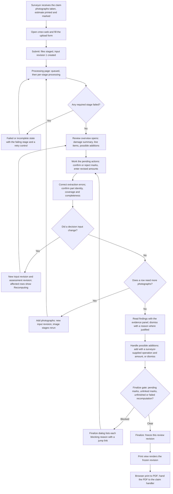
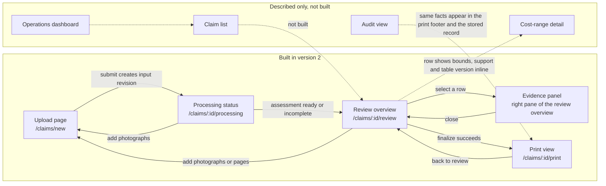

# User interface specification (M9 front end)

> Baseline implementation update (2026-09-22): the user requested a public information page, login and working claim dashboard, plus real FastAPI endpoints with explicitly mocked processing. New code lives in `src/workbench/` and `src/claim_cmev/api/`, superseding the earlier `apps/` locations for this implementation. See [ADR 0003](../adr/0003-fixture-ui-api-baseline.md) for the scoped extension; the specifications below remain the full target, not a claim that every requirement is implemented.

Status: target UI specification for version 2. ADR 0003 implements a verified fixture-backed slice under `src/workbench/`; unimplemented acceptance criteria remain the target. Owner: Lane 5 builds the front end, with Lane 4 for finding and cost semantics, Lane 3 for mark review and Lane 1 for evidence overlays. Source: [proposal v2](../CLAIM-CMEV_project_proposal_v2.md) sections 2.2, 2.3, 2.6, 5, 6, 7.1 to 7.6, 8.1 to 8.4, 9.3, 9.6, 10 (M9) and 13.5.

This document specifies the screens, fields, states, interactions and stories for the surveyor-facing application. The module contract lives in [M9](module-09-review-report.md); the transport contract lives in [integration contracts](integration_contracts.md) and the [application platform specification](application_platform.md); the record fields live in the [data contracts](data_contracts.md). Where this document names an endpoint or a payload field, that name is **proposed** and must match the platform and contract documents before coding starts.

## 1. Runtime boundary and scope

The user-directed runtime replaces proposal v2 section 9.1. The system runs as containers with Kafka between modules. Every domain rule in sections 8, 9.3 and 10 of the proposal is unchanged.

| Container | Role for the interface |
| --- | --- |
| `cmev-web` | This specification. React, TypeScript, Vite, built to static files and served by nginx. Talks only to `cmev-api` |
| `cmev-api` | The only origin the browser calls. FastAPI. Serves intake, processing status, assessment reads, review writes, evidence bytes and the report payload |
| `cmev-orchestrator` | Schedules module work over `cmev-kafka`. Not visible to the browser except as stage status |
| `cmev-worker-parts` (M1), `cmev-worker-damage` (M2), `cmev-worker-summary` (M3), `cmev-worker-ocr` (M4), `cmev-worker-lineitems` (M5), `cmev-worker-penmarks` (M6) | Produce the results the interface displays. Each appears as one processing stage |
| `cmev-consolidator` (M8) | Produces findings. The interface never recomputes a finding |
| `cmev-kafka` (Redpanda), `cmev-db` (PostgreSQL 16), `cmev-objectstore` (MinIO) | Not reachable from the browser. Evidence bytes are proxied by `cmev-api` |

Processing is asynchronous. The interface must therefore show honest queued, processing, incomplete and failed states and must never render a result that does not yet exist. A missing result is a state, not an empty list.

### 1.1 No language model in the decision path

No large language model sits in the decision path. Findings come from deterministic rules. An optional stretch service `cmev-explainer` may turn an already-computed finding into a readable sentence; it is off by default, never changes a result, and would be labelled in the interface if used. When the service is off, the interface shows the rule-generated reason codes and their fixed wording.

### 1.2 Built and described-only surfaces

| Surface | Commitment | Where specified |
| --- | --- | --- |
| Upload page | **Built** for the version 2 demonstration | Sections 5.1, 6.1 |
| Processing status page | **Built**. Required by the asynchronous runtime | Sections 5.2, 6.2 |
| Review overview page with evidence panel | **Built**. The main working screen | Sections 5.3 to 5.9, 6.3 to 6.12 |
| Print view | **Built**. Browser print to PDF | Sections 5.10, 6.13 |
| Claim list | Described only. No implementation commitment | Section 4.2, [mockups](../mockups/README.md) |
| Cost-range detail | Described only. The line-item row must still show bounds, support count and table version | Section 4.2 |
| Operations dashboard | Described only | Section 4.2 |
| Audit view | Described only. The stored record and the print footer carry the same facts | Section 4.2 |

Proposal v2 section 7.5 fixes this boundary. Describing a view is not a commitment to build it. Building an extra view consumes implementation days that the 50-person-day budget has not allocated.

---

## 2. Users and their goals

| User | Standing in this prototype | What they need from the interface | What they must never be given |
| --- | --- | --- | --- |
| **P1 Surveyor** (primary) | Uploads the claim, reviews, corrects, confirms, finalizes and prints | One list that links each estimate row to its photographs, its pen marks and its reference range; large controls they can use on a tablet beside the vehicle; a clear statement of what the system could not judge | A confident result built on a pending mark, an unresolved part, an inadequate view or a failed job |
| P2 Claim handler | Secondary. Receives the printed PDF; records the final approval outside the prototype | A printed report that states the exact reviewed revision, the synthetic cost basis and that no final approval is recorded | Any screen that looks like an approval or a settlement instruction |
| P3 Compliance reviewer | Secondary. Reads the stored record after the fact | Visible input, assessment and review revisions, model, parser and cost-table versions, every human action with its actor and reason, and the original extracted value beside every corrected value | An edited history, or a report whose numbers cannot be traced to a stored revision |

They use the same stored record. The surveyor works in `cmev-web`; the claim handler reads the PDF; the compliance reviewer reads the stored revisions and, in a later product, the described-only audit view.

Goals that are out of scope for the interface: approving a claim, choosing a settlement amount, ranking workshops, escalating a claim automatically, or recommending a repair operation.

---

## 3. The user journey

### 3.1 Journey diagram



### 3.2 Walkthrough

The narrative follows the worked example in proposal v2 section 6. Values below are synthetic.

1. **Receive the claim.** The surveyor inspects the vehicle, photographs the damage and marks the printed workshop estimate with a pen. An "X" means the item will not be paid. A handwritten number means a new price.
2. **Open the upload page.** They enter claim reference `CLM-2026-004821`, make `Toyota`, model `Corolla Altis`, year `2019`, vehicle class `compact-sedan` and currency `SGD`.
3. **Attach files.** Six photographs and two estimate pages. Each file shows its own staged or rejected state. The form does not submit while any file is rejected.
4. **Submit.** `cmev-api` commits input revision 1 and returns the claim id and the queued state. The browser moves to the processing page. Nothing is shown as ready.
5. **Wait.** The processing page lists eight stages: parts, damage, summary, page reading, line items, pen marks, consolidation and report readiness. Each stage shows queued, processing, done or failed. The page updates without a manual refresh.
6. **Handle a failure if one happens.** If the page-reading stage fails, the page says so, keeps the image results, offers retry and never shows a clean assessment. If only photographs were uploaded, the line-item section later says "waiting for the estimate".
7. **Open the review overview.** Assessment revision 1 is ready. The header shows input revision 1, assessment revision 1, review revision 0 and the cost-table version.
8. **Read the damage summary.** Front bumper: dent and scratch across three views. Left headlight: lamp broken across two views. Hood: dent across two views. Left front fender: one cropped view, coverage inadequate. Two observations keep an unresolved part identity and are listed separately.
9. **Work row 3.** "Rear door . repair . S$480.00" carries a proposed exclusion mark in the `pending` state. The result reads "More information needed - pending exclusion mark". The surveyor opens the evidence panel, sees the pen "X" over the row, and confirms the exclusion. The row becomes struck through and is not checked. A new input revision and assessment revision are created.
10. **Work row 1.** "Front bumper . replace . printed S$1,150.00" carries a proposed price change. The detector proposes a box, not an amount. The surveyor reads the handwriting and types `980.00`, then confirms. The effective price becomes S$980.00. A new assessment compares it with the pinned synthetic range S$620.00 to S$1,020.00 over 47 independent cases. The result becomes "No discrepancy found". The printed S$1,150.00 and the earlier findings stay stored and visible.
11. **Work row 5.** "Front fender (left) . repair . S$265.00" has one cropped view. The result reads "More information needed - views do not cover enough of the part". The surveyor takes two more photographs and adds them. That creates a new input revision; the image stages rerun and the journey returns to step 5 for those stages only.
12. **Work row 7.** The parser read "R/H SIDE SKIRT" and could not map it. The surveyor corrects the part to `rocker-panel` and the side to `right`. The original text stays visible beside the correction.
13. **Confirm declaration completeness.** The surveyor confirms that both estimate pages were uploaded and that the printed scope is complete. Only then does the possible-additions section propose the hood dent, which has no matching row.
14. **Handle the addition.** The surveyor adds "Hood . repair" and types the amount themselves. The system supplies no price and no operation.
15. **Read and dismiss a finding.** The left headlight replacement at S$610.00 is above the range S$240.00 to S$520.00 over 38 cases. The surveyor accepts the flag and leaves it, or dismisses it with the reason "parts price change". The dismissal is a review action against that finding; it does not change the finding.
16. **Finalize.** The finalize dialog lists any remaining blocker: a pending mark, an unlinked mark, or an unfinished or failed recomputation. When the list is empty the surveyor finalizes. The current review revision is frozen.
17. **Print.** The print view renders the frozen revision, including outstanding "More information needed" results with their reasons. The surveyor prints to PDF from the browser and hands it to the claim handler. Final approval stays outside this prototype.

---

## 4. Screen map and navigation

### 4.1 Map



### 4.2 Navigation rules

| Rule | Behaviour |
| --- | --- |
| Entry point | The demonstration starts at `/claims/new`. There is no claim list, so `cmev-web` keeps the last five claim ids in `localStorage` and shows them as recent links on the upload page |
| Deep links | `/claims/:id/review?assessment=<n>` opens a specific assessment revision. An older revision opens read-only with a banner and a link to the current one |
| Guarded route | `/claims/:id/print` requires a finalized review revision. Without one it redirects to the review overview and explains why |
| Unknown claim | A 404 from `cmev-api` renders a not-found screen, never an empty review overview |
| Browser back | Back from the print view returns to the review overview at the same scroll position and selected row |
| Described-only views | Are not routed. Their fields are listed in [the mockups README](../mockups/README.md) and remain design deliverables |

---

## 5. Mock-ups

These are monospace wireframes, not visual designs. They fix layout, labels, headings and states. Values are synthetic and illustrative.

### 5.1 Upload page, desktop

```text
+---------------------------------------------------------------------------------------------------------------+
| CLAIM-CMEV                                                       cmev-web 0.1.0   user: demo.surveyor         |
+---------------------------------------------------------------------------------------------------------------+
| New claim                                                                                                     |
|                                                                                                               |
| Claim details                                                                                                 |
|   Claim reference *        [ CLM-2026-004821                    ]  Your insurer reference. Not generated here |
|   Vehicle make *           [ Toyota                             ]                                             |
|   Vehicle model *          [ Corolla Altis                      ]                                             |
|   Vehicle year *           [ 2019    ]  Metadata only. Not used for the cost range                            |
|   Vehicle class *          [ compact-sedan                  (v) ]  Used for the cost range                    |
|   Currency *               [ SGD                            (v) ]  Cost check supports SGD only               |
|   Layout family hint       [ Not sure                       (v) ]  Optional. Helps the parser choose rules    |
|                                                                                                               |
| Damage photographs *  (JPEG or PNG, at least 1, at most 30)                                 [ Choose files ]  |
|   +---------------------------------------------------------------------------------------------------+       |
|   | [img]  IMG_2041.jpg   3.2 MB   4032x3024   staged                                          [remove] |     |
|   | [img]  IMG_2042.jpg   3.4 MB   4032x3024   staged                                          [remove] |     |
|   | [img]  IMG_2043.jpg   2.9 MB   4032x3024   staged                                          [remove] |     |
|   | [img]  IMG_2044.jpg   3.1 MB   4032x3024   staged                                          [remove] |     |
|   | [img]  IMG_2045.jpg   3.0 MB   4032x3024   staged                                          [remove] |     |
|   | [img]  IMG_2046.jpg   3.3 MB   4032x3024   staged                                          [remove] |     |
|   +---------------------------------------------------------------------------------------------------+       |
|                                                                                                               |
| Marked estimate pages  (JPEG, PNG or PDF, at most 10 pages)                                 [ Choose files ]  |
|   +---------------------------------------------------------------------------------------------------+       |
|   | [doc]  estimate_p1.jpg   2.1 MB   staged                                                   [remove] |     |
|   | [doc]  estimate_p2.jpg   2.0 MB   staged                                                   [remove] |     |
|   | [doc]  notes.heic       0.9 MB   rejected: media type image/heic is not accepted           [remove] |     |
|   +---------------------------------------------------------------------------------------------------+       |
|   (!) Remove the rejected file before you submit.                                                             |
|                                                                                                               |
| Notes for the record        [                                                                    ]            |
|                                                                                                               |
| Estimate pages are optional. Without them the review page says "waiting for the estimate".                    |
|                                                                                                               |
|                                                         [ Cancel ]   [ Upload and start processing ]          |
+---------------------------------------------------------------------------------------------------------------+
| Recent on this device:  CLM-2026-004798   CLM-2026-004802                                                     |
+---------------------------------------------------------------------------------------------------------------+
```

### 5.2 Processing state, desktop

```text
+---------------------------------------------------------------------------------------------------------------+
| CLAIM-CMEV   Claim CLM-2026-004821   Toyota Corolla Altis 2019   SGD                                          |
| Input revision 1    Assessment: not created yet                            Status: PROCESSING                 |
+---------------------------------------------------------------------------------------------------------------+
| Your claim is being processed. This page updates by itself. You can close it and come back.                   |
|                                                                                                               |
|  Stage                          Module   State         Detail                                                 |
|  ------------------------------------------------------------------------------------------------------       |
|  Part segmentation              M1       [ok] done     6 of 6 photographs                                     |
|  Damage segmentation            M2       [ok] done     6 of 6 photographs                                     |
|  Part summary and coverage      M3       [~] running   started 00:41 ago                                      |
|  Page reading                   M4       [ok] done     2 of 2 pages                                           |
|  Line-item extraction           M5       [~] running   page 2 of 2                                            |
|  Pen-mark detection             M6       [.] queued    waiting for line items                                 |
|  Consolidation and checks       M8       [.] queued    waiting for both branches                              |
|  Report ready                   M9       [.] queued    -                                                      |
|                                                                                                               |
|  Nothing is checked yet. No result is available until consolidation finishes.                                 |
|                                                                                                               |
|                                                  [ Add photographs ]   [ Open review when ready (disabled) ]  |
+---------------------------------------------------------------------------------------------------------------+

FAILED VARIANT
+---------------------------------------------------------------------------------------------------------------+
| Input revision 1    Assessment revision 1 (incomplete)                     Status: INCOMPLETE                 |
+---------------------------------------------------------------------------------------------------------------+
|  (x) Page reading failed. The estimate was not read, so no line items exist for this revision.                |
|      Error: page 2 could not be corrected for perspective (code M4_PAGE_BOUNDARY_NOT_FOUND)                   |
|      Attempt 2 of 3. Last attempt 00:12 ago.                                                                  |
|                                                                                                               |
|  Stage                          Module   State         Detail                                                 |
|  ------------------------------------------------------------------------------------------------------       |
|  Part segmentation              M1       [ok] done     6 of 6 photographs                                     |
|  Damage segmentation            M2       [ok] done     6 of 6 photographs                                     |
|  Part summary and coverage      M3       [ok] done     9 part slots, 2 unresolved observations                |
|  Page reading                   M4       [x]  failed   see the error above                                    |
|  Line-item extraction           M5       [-]  skipped  page reading did not produce a result                  |
|  Pen-mark detection             M6       [-]  skipped  no line items to link to                               |
|  Consolidation and checks       M8       [ok] partial  image branch only; line-item checks withheld           |
|                                                                                                               |
|  This is not a clean assessment. The document branch produced no result.                                      |
|                                                                                                               |
|            [ Retry page reading ]   [ Upload a clearer page ]   [ Open review with the image results only ]   |
+---------------------------------------------------------------------------------------------------------------+
```

### 5.3 Review overview, desktop

State: after the first assessment, before the surveyor has confirmed anything.

```text
+-----------------------------------------------------------------------------------------------------------------------+
| CLAIM-CMEV  Claim CLM-2026-004821   Toyota Corolla Altis 2019   Class compact-sedan   Currency SGD                    |
| Input rev 1 . Assessment rev 1 . Review rev 0     Status: READY     Saved 00:03 ago      [Add photographs] [Reassess] |
+-----------------------------------------------------------------------------------------------------------------------+
| 1. DAMAGE SUMMARY                                                                                  [collapse]         |
|  Part / side                Damage detected            Views   Coverage                 Actions                       |
|  ------------------------------------------------------------------------------------------------------------         |
|  Front bumper               dent, scratch              3       adequate                 [evidence] [expand]           |
|  Headlight (left)           lamp broken                2       adequate                 [evidence] [expand]           |
|  Hood                       dent                       2       adequate                 [evidence] [expand]           |
|  Grille                     no supported damage type   3       adequate                 [evidence] [expand]           |
|  Front fender (left)        not assessable             1       inadequate: cropped      [evidence] [confirm coverage] |
|  Rear door (side unknown)   dent                       1       unresolved identity      [evidence] [confirm identity] |
|  ------------------------------------------------------------------------------------------------------------         |
|  Unresolved observations (2): dent on candidates front-door / back-door; scratch on an unidentified panel             |
|  These cannot support or contradict any line item until their part identity is resolved.                              |
|                                                                                                                       |
| 2. LINE ITEMS   source: estimate_p1.jpg, estimate_p2.jpg   Declaration: PARTIAL (page 2 rows 6-8 uncertain)           |
|  (!) 1 pen mark is not linked to any row. Resolve it before you finalize.                        [show unlinked]      |
|                                                                                                                       |
|  #  Part / side . operation     Printed      Pen marks              Effective     [row state]                         |
|     Photo evidence | Cost check | Result                                                     Actions                  |
|  ------------------------------------------------------------------------------------------------------------         |
|  1  Front bumper . replace      S$1,150.00   [price change PENDING] unresolved                                        |
|     Supported, 3 views | not checked: price change pending | (i) More information needed      [marks] [amount] [ev]   |
|                                                                                                                       |
|  2  Front bumper . paint          S$320.00   none                    S$320.00                                         |
|     Supported, 3 views | within S$210.00-S$390.00, 31 cases | [ok] No discrepancy found       [correct] [evidence]    |
|                                                                                                                       |
|  3  Rear door . repair            S$480.00   [exclusion PENDING]     unresolved                                       |
|     not checked | not checked: pending exclusion mark | (i) More information needed           [marks] [evidence]      |
|                                                                                                                       |
|  4  Headlight (left) . replace    S$610.00   none                    S$610.00                                         |
|     Supported, 2 views | ABOVE S$240.00-S$520.00, 38 cases | [!] Cost outside reference range  [dismiss] [evidence]   |
|                                                                                                                       |
|  5  Front fender (left) . repair  S$265.00   none                    S$265.00                                         |
|     Take more pictures, 1 view cropped | not checked: coverage inadequate | (i) More information needed  [ev]         |
|                                                                                                                       |
|  6  Grille . replace              S$180.00   none                    S$180.00                                         |
|     No damage visible, 3 views | not evaluated | [!] No supporting damage detected in adequate views  [dismiss] [ev]  |
|                                                                                                                       |
|  7  "R/H SIDE SKIRT" . repair     S$220.00   none                    S$220.00      [part unresolved]                  |
|     not checked | not checked: part identity unresolved | (i) More information needed          [correct] [evidence]   |
|                                                                                                                       |
|  8  "ALIGNMENT & BALANCING"       S$120.00   none                    S$120.00      [operation unknown]                |
|     not checked | not checked: no compatible reference range | (i) More information needed     [correct] [evidence]   |
|  ------------------------------------------------------------------------------------------------------------         |
|  Rows 9 and 10 on page 2 are totals or tax lines. They are not repair rows and are not checked.   [show]              |
|                                                                                                                       |
| 3. POSSIBLE ADDITIONS                                                                                                 |
|  (i) Possible additions are hidden until you confirm that the printed scope is complete.                              |
|      Declaration state: PARTIAL. 3 rows on page 2 have uncertain fields.       [ Confirm declaration completeness ]   |
|                                                                                                                       |
| 4. FINALIZE                                                                                                           |
|  3 actions still block finalization.                                        [ Review blockers ]  [ Finalize ]         |
+-----------------------------------------------------------------------------------------------------------------------+
| Models: parts 0.3.1 . damage 0.2.4 . ocr paddle-2.7.0 . parser 0.4.0 . penmarks 0.1.9 | Cost table synthetic v3       |
| Cost basis: single part, SGD, before tax, quantity 1. Synthetic reference. Final approval: not recorded.              |
+-----------------------------------------------------------------------------------------------------------------------+
```

### 5.4 Review overview, tablet

Proposal v2 section 7.6 requires large controls readable on a tablet. Below about 900 CSS pixels the table becomes a stack of cards, one row per card, and the evidence panel becomes a full-width sheet.

```text
+--------------------------------------------------------------+
| CLM-2026-004821   Corolla Altis 2019                         |
| in 1 . as 1 . rev 0     READY        [menu]                  |
+--------------------------------------------------------------+
| [ Damage 6 ] [ Line items 8 ] [ Additions 0 ] [ Finalize ]   |
+--------------------------------------------------------------+
| LINE ITEMS                      filter: [ Needs action (v) ] |
|                                                              |
| +----------------------------------------------------------+ |
| | 1  Front bumper . replace                                | |
| |    Printed   S$1,150.00                                  | |
| |    Effective unresolved                                  | |
| |    Marks     [ price change  PENDING ]                   | |
| |    Evidence  Supported, 3 views                          | |
| |    Cost      not checked: price change pending           | |
| |    (i) More information needed                           | |
| |                                                          | |
| |    [   Confirm mark   ]  [  Enter amount  ]              | |
| |    [   Open evidence  ]  [    More ...    ]              | |
| +----------------------------------------------------------+ |
| +----------------------------------------------------------+ |
| | 3  Rear door . repair                     PENDING MARK   | |
| |    Printed   S$480.00                                    | |
| |    Effective unresolved                                  | |
| |    Marks     [ exclusion  PENDING ]                      | |
| |    (i) More information needed                           | |
| |    [   Confirm exclusion   ]  [  Reject mark  ]          | |
| |    [   Open evidence       ]                             | |
| +----------------------------------------------------------+ |
| +----------------------------------------------------------+ |
| | 4  Headlight (left) . replace                            | |
| |    Printed   S$610.00    Effective S$610.00              | |
| |    Evidence  Supported, 2 views                          | |
| |    Cost      ABOVE S$240.00-S$520.00, 38 cases           | |
| |    [!] Cost outside reference range                      | |
| |    [  Dismiss with reason  ]  [  Open evidence  ]        | |
| +----------------------------------------------------------+ |
|                                                              |
| [ 3 blockers ]                          [   Finalize   ]     |
+--------------------------------------------------------------+
```

Touch targets are at least 44 by 44 CSS pixels. No action hides behind hover. The filter defaults to "Needs action" on tablet and to "All rows" on desktop.

### 5.5 Evidence panel beside a selected row

```text
+--------------------------------------------------+-------------------------------------------------------------+
| LINE ITEMS (list narrows to 55%)                 | EVIDENCE  -  row 4  Headlight (left) . replace      [close] |
|                                                  |-------------------------------------------------------------|
|  3  Rear door . repair        S$480.00           | Photographs covering this part (2 of 6)                     |
|     [exclusion PENDING]                          |  +-------------------------------------------------------+  |
|                                                  |  |                                                       |  |
| >4  Headlight (left) . replace  S$610.00         |  |   IMG_2043.jpg  server-rendered overlay               |  |
|     Supported, 2 views                           |  |   parts overlay ON, damage overlay ON                 |  |
|     ABOVE S$240.00-S$520.00, 38 cases            |  |                                                       |  |
|     [!] Cost outside reference range             |  +-------------------------------------------------------+  |
|                                                  |  [ < prev ]  IMG_2043.jpg  1 of 2  [ next > ]               |
|  5  Front fender (left) . repair  S$265.00       |  Overlays: [x] parts  [x] damage     [ Open original ]      |
|     Take more pictures, 1 view cropped           |  Quality: sharp, lit, part not cropped                      |
|                                                  |  Coverage: adequate (model screening, not confirmed)        |
|                                                  |            [ Confirm these views cover the part ]           |
|                                                  |  Identity: headlight, side left, confirmed by demo.surveyor |
|                                                  |            2026-09-22 10:14 SGT                             |
|                                                  |-------------------------------------------------------------|
|                                                  | Estimate page                                               |
|                                                  |  +-------------------------------------------------------+  |
|                                                  |  |  estimate_p1.jpg  page 1 of 2, row box highlighted    |  |
|                                                  |  |  ...  4  HEADLAMP LH   RPL   1   610.00   610.00  ... |  |
|                                                  |  |                        no pen mark on this row        |  |
|                                                  |  +-------------------------------------------------------+  |
|                                                  |  [ Open original page ]   [ This box is wrong ]             |
|                                                  |-------------------------------------------------------------|
|                                                  | Cost range used                                             |
|                                                  |  key: headlight . replace . compact-sedan . SGD             |
|                                                  |  bounds: S$240.00 to S$520.00   independent cases: 38       |
|                                                  |  table: synthetic v3, built 2026-09-15, nominal 90%         |
|                                                  |  basis: single part, before tax, quantity 1                 |
|                                                  |  (i) Synthetic reference. Not real market prices.           |
+--------------------------------------------------+-------------------------------------------------------------+
```

### 5.6 Mark confirmation

Opened from the row action `[marks]` or from the evidence panel. One dialog per row lists every mark proposed for that row.

```text
+--------------------------------------------------------------------------------+
| Pen marks on row 3  -  Rear door . repair . printed S$480.00          [close]  |
+--------------------------------------------------------------------------------+
|  +--------------------------------------------------------------------------+  |
|  |  estimate_p1.jpg, page 1, crop around row 3, detected box drawn by the   |  |
|  |  server.   ...  3  REAR DOOR   REP   1   480.00   [ X ]  ...             |  |
|  +--------------------------------------------------------------------------+  |
|                                                                                |
|  Proposed mark                exclusion ("X")                                  |
|  Detection confidence         0.87                                             |
|  Linked to                    row 3   (unambiguous: single row overlap)        |
|  State                        PENDING                                          |
|                                                                                |
|  A confirmed exclusion removes this row from the checks. It stays visible and  |
|  struck through. This creates a new assessment.                                |
|                                                                                |
|   [ Confirm exclusion ]   [ Reject: not a mark ]   [ Link to another row (v) ] |
|                                                                                |
|  Nothing else on this row is affected. Other pending marks stay pending.       |
+--------------------------------------------------------------------------------+

ADD A MISSED MARK
+--------------------------------------------------------------------------------+
| Add a mark the system did not find                                    [close]  |
+--------------------------------------------------------------------------------+
|  Page            [ estimate_p2.jpg, page 2          (v) ]                      |
|  Row             [ 7  "R/H SIDE SKIRT" . repair     (v) ]  or [ not a row ]    |
|  Mark type       ( ) exclusion      (o) price change                           |
|  New amount      [ 180.00        ]  SGD, before tax, quantity 1                |
|  Why             [ I marked this row on paper; the detector missed it.      ]  |
|                                                                                |
|  This is recorded as a human-added mark, separate from the detector output.    |
|                                             [ Cancel ]   [ Add and confirm ]   |
+--------------------------------------------------------------------------------+
```

### 5.7 Manual amount entry

```text
+--------------------------------------------------------------------------------+
| Revised amount for row 1  -  Front bumper . replace                   [close]  |
+--------------------------------------------------------------------------------+
|  +--------------------------------------------------------------------------+  |
|  |  crop of the price-change mark, 3.2x zoom, server rendered               |  |
|  |          1,150.00   with  980  written above it                          |  |
|  +--------------------------------------------------------------------------+  |
|                        [ zoom - ]  [ zoom + ]  [ rotate ]  [ open page ]       |
|                                                                                |
|  Printed amount         S$1,150.00   (kept in the record, never overwritten)   |
|  Revised amount *       [ 980.00            ]  SGD                             |
|                         before tax, single part, quantity 1                    |
|  Read from              (o) the pen mark    ( ) agreed by telephone            |
|                                                                                |
|  (i) The system does not read handwriting. You type the amount and confirm it. |
|                                                                                |
|  Confirming replaces the effective price and creates a new assessment.         |
|  Until you confirm, this row stays "More information needed".                  |
|                                                                                |
|                                   [ Cancel ]   [ Confirm revised amount ]      |
+--------------------------------------------------------------------------------+
```

### 5.8 Possible additions

State: after the surveyor confirmed declaration completeness.

```text
+-----------------------------------------------------------------------------------------------------------------------+
| 3. POSSIBLE ADDITIONS                            Declaration: COMPLETE, confirmed by demo.surveyor 10:31 SGT          |
|  Damage the photographs support that no estimate row covers. The system proposes no price and no operation.           |
|                                                                                                                       |
|  Part / side      Damage   Views   Why it is proposed                       Actions                                   |
|  ------------------------------------------------------------------------------------------------------------         |
|  Hood             dent     2       identity resolved, coverage adequate,    [ Add to scope ] [ Dismiss ] [evidence]   |
|                                    no row mentions the hood                                                           |
|                                                                                                                       |
|  Withheld, shown for review only (not proposed as additions)                                                          |
|  ------------------------------------------------------------------------------------------------------------         |
|  unresolved part  dent     1       candidates front-door / back-door; a row could already cover it   [evidence]       |
|  Rear door        dent     1       row 3 is a confirmed exclusion on the same part; informational note added to       |
|                                    row 3 instead of an addition                                      [go to row 3]    |
+-----------------------------------------------------------------------------------------------------------------------+

ADD TO SCOPE
+--------------------------------------------------------------------------------+
| Add "Hood . dent" to the repair scope                                 [close]  |
+--------------------------------------------------------------------------------+
|  Part            hood            (from the confirmed observation)              |
|  Side            not applicable                                                |
|  Operation *     [ repair                     (v) ]  you choose this           |
|  Quantity *      [ 1    ]                                                      |
|  Amount          [                ]  SGD, before tax   [ ] leave blank for now |
|  Note            [ Agreed with the workshop by telephone on 22 Sep.         ]  |
|                                                                                |
|  (i) The system supplies no amount and no operation for an addition.           |
|  A blank amount stays unresolved and receives no cost check.                   |
|                                                   [ Cancel ]   [ Add row ]     |
+--------------------------------------------------------------------------------+
```

### 5.9 Finalize confirmation with blocking reasons

```text
+--------------------------------------------------------------------------------------------+
| Finalize this review                                                              [close]  |
+--------------------------------------------------------------------------------------------+
|  3 things must be resolved first.                                                          |
|                                                                                            |
|  (x) Row 3, Rear door . repair: the exclusion mark is still PENDING.            [go to]    |
|      Confirm it, reject it, or link it to another row.                                     |
|                                                                                            |
|  (x) Page 2: 1 pen mark is not linked to any row.                               [go to]    |
|      Link it, mark it as not a row, or reject it.                                          |
|                                                                                            |
|  (x) Assessment revision 3 is still RECOMPUTING after your amount change.       [refresh]  |
|      Finalize is available when it reaches READY.                                          |
|                                                                                            |
|  These will stay in the printed report and do not block finalization:                      |
|  (i) 3 rows are "More information needed". Their reasons are printed with them.            |
|  (i) 1 finding was dismissed with the reason "parts price change".                         |
|                                                                                            |
|  Finalizing freezes review revision 7 against assessment revision 3. Later edits create a  |
|  new review revision and you would finalize again.                                         |
|                                                                                            |
|                                      [ Keep reviewing ]   [ Finalize (disabled) ]          |
+--------------------------------------------------------------------------------------------+

CLEAR VARIANT
|  Nothing blocks finalization.                                                              |
|  (i) 3 rows remain "More information needed". Finalizing does not turn them into passes.   |
|                                      [ Keep reviewing ]   [ Finalize and open print view ] |
```

### 5.10 Print view

```text
+---------------------------------------------------------------------------------------------------------------+
|  [ Print to PDF ]   [ Back to review ]        This page is the printable rendering. Use your browser's print. |
+---------------------------------------------------------------------------------------------------------------+
|                                                                                                               |
|  CLAIM-CMEV ASSESSMENT REPORT                                            printed 2026-09-22 10:48 SGT         |
|  ===========================================================================================================  |
|  Claim reference   CLM-2026-004821            Vehicle   Toyota Corolla Altis 2019                             |
|  Vehicle class     compact-sedan              Currency  SGD                                                   |
|  Reviewed by       demo.surveyor              Finalized 2026-09-22 10:47 SGT                                  |
|  Input revision 3 . Assessment revision 3 . Review revision 7 (frozen)                                        |
|                                                                                                               |
|  1. DAMAGE SUMMARY                                                                                            |
|  Part / side              Damage detected          Views  Coverage                                            |
|  Front bumper             dent, scratch            3      adequate                                            |
|  Headlight (left)         lamp broken              2      adequate                                            |
|  Hood                     dent                     2      adequate                                            |
|  Grille                   no supported damage type 3      adequate                                            |
|  Front fender (left)      dent                     3      adequate, confirmed by surveyor                     |
|  Unresolved observations: 2. Listed in section 5.                                                             |
|                                                                                                               |
|  2. LINE ITEMS                                                                                                |
|  #  Part / side . operation   Printed      Effective   Evidence        Cost check              Result         |
|  1  Front bumper . replace    S$1,150.00   S$980.00    Supported 3v    within 620.00-1,020.00  No discrepancy |
|  2  Front bumper . paint        S$320.00   S$320.00    Supported 3v    within 210.00-390.00    No discrepancy |
|  3  Rear door . repair          S$480.00   excluded    -               not checked             EXCLUDED       |
|  4  Headlight (left) . replace  S$610.00   S$610.00    Supported 2v    above 240.00-520.00     Cost outside   |
|  5  Front fender (left)...      S$265.00   S$265.00    Supported 3v    within 180.00-340.00    No discrepancy |
|  6  Grille . replace            S$180.00   S$180.00    No damage 3v    not evaluated           No supporting  |
|                                                                                               damage detected |
|  7  Rocker panel (right)...     S$220.00   S$220.00    Supported 2v    no compatible range     More info      |
|  8  Alignment . unknown         S$120.00   S$120.00    -               no compatible range     More info      |
|  9  Hood . repair (added)             -    S$340.00    Supported 2v    within 260.00-450.00    No discrepancy |
|                                                                                                               |
|  3. MARK DECISIONS                                                                                            |
|  Row 3  exclusion      confirmed  demo.surveyor  10:19 SGT   detector confidence 0.87                         |
|  Row 1  price change   confirmed  demo.surveyor  10:24 SGT   amount typed by the surveyor: S$980.00           |
|  Page 2 stray mark     rejected   demo.surveyor  10:39 SGT   "ink smudge, not a mark"                         |
|                                                                                                               |
|  4. FINDINGS AND REASONS                                                                                      |
|  Row 4  Cost outside reference range. Effective S$610.00 is S$90.00 above the upper bound S$520.00.           |
|         Dismissed 10:41 SGT, reason "parts price change": headlamp supplier increased the price in August.    |
|  Row 6  No supporting damage detected in adequate views. 3 confirmed views, no supported damage type.         |
|  Row 7  More information needed: no compatible reference range for rocker panel . repair . compact-sedan.     |
|  Row 8  More information needed: operation could not be mapped, so no range applies.                          |
|                                                                                                               |
|  5. WHAT COULD NOT BE JUDGED                                                                                  |
|  2 damage observations keep an unresolved part identity and support no conclusion either way.                 |
|  No result in this report means that a repair is unnecessary or that a price is wrong.                        |
|                                                                                                               |
|  6. COST REFERENCE                                                                                            |
|  Synthetic reference table v3, built 2026-09-15. Nominal interval 90%.                                        |
|  Basis: one part, SGD, before tax, quantity 1, no discount. These are not real market prices.                 |
|  Final approved amount: NOT RECORDED. Approval happens outside this prototype.                                |
|                                                                                                               |
|  ---------------------------------------------------------------------------------------------------------    |
|  Versions: parts 0.3.1 . damage 0.2.4 . summary rules 0.5.0 . ocr paddle-2.7.0 . parser 0.4.0 .               |
|  penmarks 0.1.9 . consolidation rules 0.6.2 . cost table synthetic v3 . schema 0.2.0                          |
|  Claim CLM-2026-004821 . input 3 . assessment 3 . review 7 . page 1 of 3                                      |
+---------------------------------------------------------------------------------------------------------------+
```

---

## 6. Field specifications

Data source names below are **proposed** and follow the records in proposal v2 section 9.3 and the [data contracts](data_contracts.md).

### 6.1 Upload page

| Field | Control | Source field | Editable | Validation | Default | Empty state | Effect |
| --- | --- | --- | --- | --- | --- | --- | --- |
| Claim reference | Single-line text | `ClaimInput.external_reference` | Yes | Required. 3 to 40 characters. Letters, digits, hyphen, slash | Empty | "Enter your insurer's claim reference" | Shown in every header, the print view and the browser tab title |
| Vehicle make | Text with suggestions | `ClaimInput.make` | Yes | Required. 1 to 40 characters | Empty | Inline hint | Metadata. Printed in the report |
| Vehicle model | Text with suggestions | `ClaimInput.model` | Yes | Required. 1 to 60 characters | Empty | Inline hint | Metadata. Printed in the report |
| Vehicle year | Number | `ClaimInput.year` | Yes | Required. 1980 to current year plus 1 | Empty | Inline hint | Metadata only. Helper text states it does not change the reference range (proposal v2 section 8.3) |
| Vehicle class | Select | `ClaimInput.vehicle_class` | Yes | Required. One of the versioned class list, or `unknown` | `unknown` | "Select a class" | Part of the cost key. `unknown` shows a warning that no cost check will run |
| Currency | Select | `ClaimInput.currency` | Yes | Required. ISO 4217 | `SGD` | Not empty | Non-SGD shows "Cost checks support SGD only. Other checks still run" |
| Layout family hint | Select | `ClaimInput.layout_hint` | Yes | Optional. One of the supported families or `not_sure` | `not_sure` | Not empty | **Proposed** parser hint. Never overrides the parser's own detection |
| Damage photographs | Multi-file input plus drag target | `ClaimFile[]` with `kind=photo` | Yes, until submit | At least 1. At most 30 **proposed**. `image/jpeg` or `image/png`. At most 15 MB each **proposed**. Client checks extension and size; the server decides | Empty | "No photographs added" with the accepted types | Each file is staged by `POST /claims/{id}/files` and shows its own state |
| Photograph row: thumbnail, name, size, pixel size, state, remove | Read-only plus button | `ClaimFile` | Remove only | Server may reject with a reason code | - | - | A rejected row blocks submit until it is removed |
| Estimate pages | Multi-file input plus drag target | `ClaimFile[]` with `kind=estimate_page` | Yes, until submit | Optional. `image/jpeg`, `image/png` or `application/pdf`. At most 10 pages total **proposed** | Empty | "No estimate pages added. The review page will say waiting for the estimate" | Drives the document branch |
| Notes for the record | Multi-line text | `ClaimInput.intake_note` | Yes | Optional. At most 500 characters | Empty | Optional label | Stored with the input revision and printed in the report appendix |
| Idempotency key | Hidden | Request header `Idempotency-Key` | No | UUID v4 generated once per form instance | Generated | - | A repeated submit returns the same input revision instead of a second claim |
| Upload and start processing | Primary button | - | - | Disabled while any file is rejected, any required field is invalid, or a submit is in flight | Disabled | - | Calls `POST /claims`, then `POST /claims/{id}/files`, then `POST /claims/{id}/input-revisions`, then routes to the processing page |
| Cancel | Secondary button | - | - | Asks for confirmation when files are staged | - | - | Discards staged files. Staged files without a committed revision are not a claim input |
| Recent on this device | Link list | `localStorage` | No | At most 5 entries | Empty, hidden | Hidden | Replaces the described-only claim list for the demonstration |

### 6.2 Processing status page

| Field | Control | Source field | Editable | Empty state | Effect |
| --- | --- | --- | --- | --- | --- |
| Claim header | Read-only | `ClaimInput` | No | - | Reference, vehicle, currency, input revision |
| Overall status | Status badge | `processing.state` | No | `queued` | One of queued, processing, ready, incomplete, failed. Drives the page shape |
| Stage name, module | Read-only row | `processing.stages[].name`, `.module` | No | Eight fixed rows | Fixed order M1, M2, M3, M4, M5, M6, M8, report readiness |
| Stage state | Status badge plus icon plus text | `processing.stages[].state` | No | `queued` | queued, running, done, failed, skipped, partial |
| Stage detail | Read-only text | `processing.stages[].detail` | No | "-" | Progress counts or the reason for skipping |
| Error code and message | Read-only block | `processing.stages[].error` | No | Hidden | Stable reason code plus readable text. Never a raw stack trace |
| Attempt count | Read-only text | `processing.stages[].attempt`, `.max_attempts` | No | Hidden | "Attempt 2 of 3" |
| Retry stage | Button | - | - | Hidden unless failed and retries remain | `POST /claims/{id}/jobs/{job_id}/retry`. Reuses the job key, so a success is not duplicated |
| Add photographs | Button | - | - | Always available | Routes to the upload form in add-files mode |
| Open review | Button | - | - | Disabled until `ready`, `incomplete` or `partial` | Disabled means no assessment exists. The label says why |
| Live update notice | Text plus `aria-live` region | - | No | - | "Updated 5 seconds ago". Shows a reconnect notice when the stream drops |

### 6.3 Claim header on the review overview

| Field | Control | Source field | Editable | Effect |
| --- | --- | --- | --- | --- |
| Claim reference, make, model, year | Read-only | `ClaimInput` | No | Identity |
| Vehicle class | Read-only chip | `ClaimInput.vehicle_class` | No | `unknown` shows a warning chip: cost checks withheld |
| Currency | Read-only chip | `ClaimInput.currency` | No | Non-SGD shows the same warning |
| Input revision, assessment revision, review revision | Read-only | `assessment.input_revision`, `.assessment_revision`, `review.review_revision` | No | Required by proposal v2 section 7.6. Clicking opens a revision list, read-only |
| Status badge | Badge | `assessment.state` | No | ready, incomplete, recomputing, failed, finalized |
| Save status | Text plus `aria-live` | Local pending-action queue | No | saved, saving, retrying, offline with N pending, conflict |
| Add photographs | Button | - | - | New input revision, image stages rerun |
| Reassess | Button | - | - | `POST /claims/{id}/assessments`. Disabled while a recomputation is in flight |
| Version footer | Read-only | `assessment.versions` | No | Model, parser, rule and cost-table versions, plus the synthetic marker and cost basis |

### 6.4 Damage summary section

| Field | Control | Source field | Editable | Validation | Empty state | Effect |
| --- | --- | --- | --- | --- | --- | --- |
| Part / side | Read-only text | `PartCoverage.part_code`, `.side` | No | - | - | `unknown` side is printed as "side unknown", never guessed |
| Damage detected | Read-only list of damage codes | `DamageObservation.damage_type` grouped by part | No | - | "no supported damage type detected" | Only the six supported damage categories appear |
| Views | Read-only count | count of `PartCoverage.covering_photo_ids` | No | - | "0" | Count of covering photographs, not of damage instances |
| Coverage | Badge plus reason | `PartCoverage.state`, `.reasons` | No | - | `unresolved` | adequate, inadequate, not_visible, unresolved, each with its reason code |
| Confirmed by | Read-only text | `PartCoverage.human_confirmation` | No | - | Hidden | Actor and timestamp when a human confirmed identity or coverage |
| Expand | Disclosure | `DamageObservation.member_observation_ids` | No | - | - | Lists each source observation: photograph, damage type, confidence, image-area measure |
| Confirm identity | Button | - | - | Enabled only when identity is unresolved | - | Opens the evidence panel at the identity control |
| Confirm coverage | Button | - | - | Enabled when coverage is `inadequate` or `unresolved` and at least one view exists | - | Opens the evidence panel at the coverage control |
| Unresolved observations | Read-only list | observations with no resolved part | No | - | Hidden when none | States plainly that they support no conclusion either way |

### 6.5 Line-item table

Columns 1 to 8 follow proposal v2 section 7.2. Columns 9 to 15 are required by the rules in section 8 and by the asynchronous runtime.

| # | Column | Control | Source field | Editable | Validation | Default and empty state | What it does |
| --- | --- | --- | --- | --- | --- | --- | --- |
| 1 | Row number | Read-only | `LineItem.row_number` | No | - | - | Matches the printed row order. Stable entry id is shown on hover and in the panel |
| 2 | Part | Text plus mapped chip | `LineItem.part_code`, `.original_part_text` | Yes, through the correct dialog | Must be a versioned part code or `unknown` | Original text always visible under the mapped value | `unknown` or `ambiguous` blocks the photo check and shows "part identity unresolved" |
| 3 | Side | Select | `LineItem.side` | Yes | `left`, `right`, `centre`, `not_applicable`, `unknown` | `unknown` | A declaration for the left part never uses right-side coverage |
| 4 | Operation | Select plus original text | `LineItem.operation`, `.original_operation_text` | Yes | `repair`, `replace`, `refinish`, `other`, `unknown` | `unknown` | `unknown` or `other` receives no cost range |
| 5 | Quantity | Number, read-only until corrected | `LineItem.quantity` | Yes | Positive decimal | Null with reason `not_readable`. Never defaulted to 1 | Quantity other than 1 receives no cost check under the fixed basis |
| 6 | Printed price | Money, read-only | `LineItem.printed_amount` | No | - | Null with reason, shown as "not readable" | Never overwritten. Always visible beside the effective price |
| 7 | Pen marks | Chip list plus action | `PenMark[]` for this entry | Through the mark dialog | Each chip shows type and state | "none" | pending, confirmed, rejected. A pending chip forces "More information needed" |
| 8 | Effective price | Money or reason chip | `LineItem.effective_amount` | Through the amount dialog | Positive decimal with currency and basis | "unresolved: price change pending" | Only a confirmed revised amount or a readable printed amount with no pending change |
| 9 | Photo evidence | Text plus view count | `Finding.photographic_check` | No | - | "not checked" | Supported (n views), No damage visible (n views), Take more pictures |
| 10 | Cost check | Text with bounds and support | `Finding.cost_check` | No | - | "not checked: reason" | within, above, below, or not checked with a reason code |
| 11 | Result | Badge plus label | `Finding.overall_result` | No | - | "not evaluated" | One of the four labels in section 7.3 |
| 12 | Row state | Badge | derived | No | - | none | excluded, pending mark, part unresolved, coverage inadequate, no compatible range, recomputing, dismissed |
| 13 | Extraction uncertainty | Small warning icon plus list | `LineItem.field_uncertainty` | No | - | Hidden | Names each uncertain field. Never silently resolved |
| 14 | Source | Link | `LineItem.page`, `.boxes` | No | - | "no source" for an added row | Opens the evidence panel at the estimate page |
| 15 | Actions | Buttons | - | - | Enabled by precondition, see section 8 | - | marks, amount, correct, dismiss, evidence |

Row-level rules:

- A confirmed exclusion strikes the row through, greys it, adds an "Excluded by surveyor" chip and removes it from the checks. Exclusion is a row state, not an `ok` result.
- A row is never removed from the table. The printed estimate is the record.
- Totals, tax and heading rows are listed in a collapsed strip. They are labelled "not a repair row" and never carry a result.
- A row whose assessment is recomputing shows the previous result greyed with a "Recomputing" chip. It never shows a new result before `cmev-consolidator` produces one.

### 6.6 Unlinked marks strip

| Field | Control | Source field | Editable | Effect |
| --- | --- | --- | --- | --- |
| Count | Badge plus text | `PenMark[]` where `entry_id` is null | No | Shown at the top of the line-item section. Blocks finalization |
| Page and box | Link plus thumbnail | `PenMark.page`, `.box` | No | Opens the evidence panel on that page crop |
| Proposed type | Chip | `PenMark.mark_type` | No | exclusion or price change |
| Candidate rows | Select | `PenMark.candidate_entry_ids` | Yes | Lists the rows the geometry could not separate |
| Link to row | Button | - | - | Creates a new input revision and assessment revision |
| Not a row | Button | - | - | Records that the mark refers to no row. Requires a short note |
| Reject | Button | - | - | Records a false detection |

### 6.7 Mark confirmation dialog

| Field | Control | Source field | Editable | Validation | Effect |
| --- | --- | --- | --- | --- | --- |
| Page crop | Server-rendered image | `GET /claims/{id}/files/{file_id}?render=mark_crop&mark_id=` | No | - | Shows the detected box on the page |
| Proposed mark type | Read-only chip | `PenMark.mark_type` | No | - | exclusion or price change |
| Detection confidence | Read-only number | `PenMark.confidence` | No | - | Shown to two decimals. Null shows "not available", never 0 |
| Linked to | Read-only or select | `PenMark.entry_id`, `.candidate_entry_ids` | Yes | Must be an existing row or "not a row" | Relinking creates a new input revision |
| State | Badge | `PenMark.state` | No | - | pending, confirmed, rejected |
| Confirm exclusion | Primary button | - | - | Enabled when state is `pending` and the mark is linked | New input and assessment revision |
| Reject: not a mark | Button | - | - | Enabled when state is `pending` | New input and assessment revision |
| Link to another row | Button plus select | - | - | - | New input and assessment revision |
| Consequence text | Static text | - | No | - | States what confirming does before the surveyor commits |

### 6.8 Manual amount dialog

| Field | Control | Source field | Editable | Validation | Default | Effect |
| --- | --- | --- | --- | --- | --- | --- |
| Mark crop | Server-rendered image with zoom | `render=mark_crop` | No | - | 3.2x | Lets the surveyor read their own handwriting |
| Printed amount | Read-only money | `LineItem.printed_amount` | No | - | - | Stays in the record |
| Revised amount | Money text input | `ReviewAction.new_value.amount` | Yes | Required. Decimal with at most 2 places. Greater than 0. At most 999,999.99 **proposed**. Rejects thousands separators on submit and normalises them on blur | Empty | Becomes the effective price after confirmation |
| Currency and basis | Read-only text | `ClaimInput.currency`, cost basis version | No | - | SGD, before tax, single part, quantity 1 | Prevents a basis mismatch |
| Source of the amount | Radio | `ReviewAction.source` | Yes | Required | "the pen mark" | Records provenance of the human value |
| TrOCR suggestion | Read-only chip, stretch only | `PenMark.suggested_amount` | No | - | Hidden when the stretch model is off | Labelled "suggestion, not confirmed". Never pre-fills the input |
| Confirm revised amount | Primary button | - | - | Disabled until valid | Disabled | New input and assessment revision |

### 6.9 Correct row dialog

| Field | Control | Source field | Editable | Validation | Effect |
| --- | --- | --- | --- | --- | --- |
| Original text | Read-only | `LineItem.original_*_text` | No | - | Always shown beside the correction |
| Part | Searchable select | `LineItem.part_code` | Yes | Versioned part list or `unknown` | Changes the photographic match |
| Side | Select | `LineItem.side` | Yes | Five values | Never inferred from the part name |
| Operation | Select | `LineItem.operation` | Yes | Five values | Changes the cost key |
| Quantity | Number | `LineItem.quantity` | Yes | Positive decimal or blank with a reason | Blank stays null with a reason |
| Printed amount correction | Money | `LineItem.printed_amount` | Yes | Decimal, 2 places | Records an OCR correction. The original OCR value stays visible |
| Reason | Select plus note | `ReviewAction.reason` | Yes | Required: `ocr_error`, `mapping_error`, `wrong_row`, `other` with note | Stored with the action |
| Save correction | Primary button | - | - | Disabled until at least one field changed | New input and assessment revision |

### 6.10 Dismiss finding dialog

| Field | Control | Source field | Editable | Validation | Effect |
| --- | --- | --- | --- | --- | --- |
| Finding summary | Read-only | `Finding.reasons` | No | - | The exact text that will be printed |
| Reason | Radio list | `ReviewAction.reason_code` | Yes | Required. One of: hidden damage found after dismantling, ADAS calibration or specialist procedure, parts price change, inadequate photograph, system error, other | Selecting a reason saves without a second confirmation |
| Note | Multi-line text | `ReviewAction.note` | Yes | Required when reason is `other`. At most 300 characters | Stored and printed |
| Effect text | Static | - | No | - | "This records your judgement against finding F-14. It does not change the finding or the assessment" |

### 6.11 Possible additions section

| Field | Control | Source field | Editable | Validation | Empty state | Effect |
| --- | --- | --- | --- | --- | --- | --- |
| Gate notice | Static block | `DeclarationStatus.state` | No | - | Shown while the state is not `complete` | Hides proposals until completeness is confirmed |
| Confirm declaration completeness | Button | - | - | Enabled when at least one page was read | - | New input and assessment revision. Records actor and time |
| Part / side | Read-only | `ProposedAddition.part_code`, `.side` | No | - | - | Only resolved identities are proposed |
| Damage | Read-only | `ProposedAddition.damage_type` | No | - | - | - |
| Views | Read-only count | supporting observations | No | - | - | - |
| Why it is proposed | Read-only text | `ProposedAddition.reason` | No | - | - | States the safeguards that were satisfied |
| Add to scope | Button | - | - | - | - | Opens the add dialog |
| Dismiss | Button plus reason | - | - | Reason required | - | Review revision only |
| Withheld list | Read-only table | ambiguities from proposal v2 section 8.2 | No | - | Hidden when none | Shows why an observation is not proposed. Never counted as an addition |
| Add dialog: operation | Select | `LineItem.operation` | Yes | Required. Never pre-filled | - | The surveyor chooses |
| Add dialog: quantity | Number | `LineItem.quantity` | Yes | Required. Positive | 1 | - |
| Add dialog: amount | Money | `LineItem.effective_amount` | Yes | Optional. Decimal, 2 places | Blank | Blank stays unresolved with a reason and receives no cost check |
| Add dialog: note | Text | `ReviewAction.note` | Yes | Optional, 300 characters | - | Stored |
| Add row | Primary button | - | - | Disabled until operation and quantity are valid | - | New input and assessment revision. The row joins the line-item table marked "added by surveyor" |

### 6.12 Evidence panel

| Field | Control | Source field | Editable | Effect |
| --- | --- | --- | --- | --- |
| Selected row header | Read-only | current selection | No | Names the row or the summary part the panel describes |
| Covering photographs | Server-rendered images with prev and next | `GET /claims/{id}/files/{file_id}?render=overlay&parts=1&damage=1` | No | The server draws the overlays. The browser only places the image |
| Overlay toggles | Two checkboxes | query parameters | Yes | Requests a different server rendering. Preference is remembered per session |
| Open original | Button | `GET /claims/{id}/files/{file_id}` | No | One tap to the unmodified photograph, required by proposal v2 section 7.6 |
| Quality | Read-only text | `ImageQuality.reasons` | No | blur, lighting, crop, obstruction |
| Coverage state and source | Badge plus text | `PartCoverage.state`, `.human_confirmation` | No | States whether a human confirmed it or the model screened it |
| Confirm these views cover the part | Button | - | - | New input and assessment revision. Records actor, time and the views it refers to |
| Identity and source | Badge plus text | `PartCoverage.part_code`, `.side`, `.human_confirmation` | No | Never rewrites the model prediction |
| Confirm part identity | Button plus part and side selects | - | Yes | New input and assessment revision. Stored beside the prediction |
| Estimate page | Server-rendered page image with the row box highlighted | `render=page_highlight&entry_id=` | No | Highlight comes from the server |
| Open original page | Button | `GET /files/{file_id}` | No | Unmodified page image |
| This box is wrong | Button | - | - | Opens the correct row dialog at the source field |
| Detected mark boxes | Server-rendered overlay | `render=page_highlight&marks=1` | No | Shows every mark proposed on the page |
| Cost range used | Read-only block | `Finding.cost_range_ref` | No | Key, bounds, independent case count, table version, build date, nominal coverage, basis and the synthetic marker. This is the inline substitute for the described-only cost-range detail view |
| Evidence load failure | Inline error plus retry | - | - | Keeps the review context and the link to the original file |

### 6.13 Print view

| Field | Control | Source field | Editable | Effect |
| --- | --- | --- | --- | --- |
| Print to PDF | Button, hidden when printing | - | - | Calls `window.print()`. The route is also printable directly |
| Back to review | Link, hidden when printing | - | - | Returns to the review overview |
| Report header | Read-only | frozen report payload | No | Claim, vehicle, reviewer, finalize timestamp, all three revisions |
| Sections 1 to 6 | Read-only | frozen report payload | No | Exactly the content listed in proposal v2 section 7.4 |
| Synthetic marker and basis | Read-only | cost table manifest | No | Required. Not a footnote |
| Final approval line | Read-only | `ApprovalRecord` or absence | No | "NOT RECORDED" unless a stretch import actually happened |
| Page footer | Read-only, repeats on every printed page | `assessment.versions` | No | Versions, revisions and page number |

---

## 7. States and status display

### 7.1 Claim and assessment states

| State | When | Text shown | Colour role | Icon | Must not |
| --- | --- | --- | --- | --- | --- |
| `queued` | Input revision committed, no stage started | "Queued. Nothing has been processed yet" | neutral | clock outline | Show any result area |
| `processing` | At least one stage running | "Processing. This page updates by itself" | neutral, animated | rotating arc, static under reduced motion | Show a partial result as final |
| `ready` | All required stages done and consolidation committed | "Ready for review" | positive | filled check | Imply that every check succeeded |
| `incomplete` | One required branch failed or was skipped, useful results remain | "Incomplete. The document branch produced no result" | caution | half-filled square | Look like `ready` |
| `awaiting_estimate` | Photographs only | "Waiting for the estimate" | informational | document outline | Show an empty line-item table with no explanation |
| `failed` | Required processing cannot produce a usable result | "Processing failed" | negative | cross in a circle | Ever render result badges or a finalize button |
| `recomputing` | A decision-changing action created a new assessment that is not committed | "Recomputing after your change" | neutral, animated | rotating arc | Show the new result before it exists |
| `finalized` | A review revision is frozen | "Finalized, review revision 7" | positive outline | lock | Allow silent edits. Editing starts a new review revision and unfreezes the finalize gate |

### 7.2 Row states

| Row state | Trigger | Text | Colour role | Icon and shape | Rule |
| --- | --- | --- | --- | --- | --- |
| Pending mark | Any mark on the row is `pending` | "Pending exclusion mark" or "Pending price change" | caution | dashed outline chip, pen icon | Forces `insufficient_evidence` and blocks finalize |
| Confirmed exclusion | An exclusion mark is `confirmed` | "Excluded by surveyor" | muted | struck-through row plus solid grey chip | Not checked. Never an `ok` result. Strike-through is never the only signal |
| Rejected mark | A mark is `rejected` | "Detection rejected" | muted | chip with a small cross | The row returns to ordinary checking |
| Unlinked mark | A mark has no entry id | "1 mark is not linked to any row" | caution | banner above the table | Blocks finalize |
| Unresolved identity | Part code is `unknown` or `ambiguous`, or side is `unknown` where it matters | "Part identity unresolved" | informational | dotted underline on the part cell | Withholds the photo check. No side is inferred |
| Inadequate coverage | `PartCoverage.state` is `inadequate` or `not_visible` | "Take more pictures" | informational | camera-plus icon | Withholds a negative finding |
| No compatible range | Cost key has no range or too little support | "No compatible reference range" | informational | range icon with a slash | Withholds the cost check. Never shown as a zero range |
| Uncertain extraction | Any `field_uncertainty` entry | "Check this value" plus the field names | caution | small warning triangle on the cell | The value stays visible and correctable |
| Recomputing | Assessment revision superseded | "Recomputing" | neutral | rotating arc | Old result greyed, no new claim made |
| Dismissed finding | A dismissal exists for the current finding | "Dismissed: parts price change" | muted | speech-bubble icon | The finding itself is unchanged and still printed |

### 7.3 Finding results

| Internal value | Display label | Category | Colour role | Icon and border | Reason text |
| --- | --- | --- | --- | --- | --- |
| `ok` | No discrepancy found | outcome | positive, low saturation | check in a solid-border chip | "Supported by 3 views and within S$620.00 to S$1,020.00 over 47 independent cases" |
| `unsupported` | No supporting damage detected in adequate views | **discrepancy flag** | warning, solid border | exclamation in a solid-border chip | "3 confirmed covering views, no supported damage type detected" |
| `cost_outlier` | Cost outside reference range | **discrepancy flag** | warning, solid border | up or down arrow against a bar, solid border | "S$610.00 is S$90.00 above the upper bound S$520.00, 38 independent cases" |
| `insufficient_evidence` | More information needed | **informational** | neutral blue-grey, dashed border | lowercase "i" in a dashed-border chip | The specific missing item, for example "pending exclusion mark" or "views do not cover enough of the part" |

Required distinctions:

1. `insufficient_evidence` must look different from a discrepancy flag. The proposed difference is threefold: a different colour role, a dashed rather than solid border, and a different icon shape. It never uses the warning colour.
2. A processing failure must never look like a clean assessment. When a stage failed, the affected rows show "not evaluated" with the failure reason and no result chip at all. The header shows `incomplete` or `failed`. A zero-finding count is never displayed as a success message.
3. `ok` is stated as "no discrepancy found in the available checks", not as "correct". The tooltip names which checks ran.
4. An excluded row shows no result chip. It shows the exclusion chip.

### 7.4 Save states

| State | Text | Where | Behaviour |
| --- | --- | --- | --- |
| `saved` | "Saved 00:03 ago" | Header, `aria-live="polite"` | Default resting state |
| `saving` | "Saving..." | Header plus the affected row | The row control is disabled, not hidden |
| `retrying` | "Retrying, attempt 2" | Header | Exponential backoff. Same idempotency key |
| `offline` | "Offline. 2 actions waiting" | Header banner | Actions stay in the durable queue |
| `conflict` | "Someone else saved review revision 8. Your change was not applied" | Blocking banner with "Reload and reapply" and "Discard mine" | Local work is preserved until the surveyor chooses |
| `rejected` | "Not saved: the server rejected this action" plus the reason | Row-level error | Never silently dropped |

### 7.5 Accessibility rules

- Colour is never the only signal. Every state carries an icon shape and a text label. Border style separates informational from warning.
- Contrast is at least 4.5 to 1 for text and 3 to 1 for icons and borders, checked in a bright and a dim setting, because surveyors work outdoors.
- Touch targets are at least 44 by 44 CSS pixels. Row actions are buttons, not hover-only affordances.
- Every dialog traps focus, returns focus to the control that opened it, and closes on Escape.
- The line-item table is a real `<table>` with `<th scope>` headers. Each row has an accessible name of the form "Row 4, headlight left, replace, cost outside reference range".
- Status changes announce through `aria-live="polite"`. Failures announce through `role="alert"`.
- `prefers-reduced-motion` replaces spinners with a static badge and a text timestamp.
- The page works at 200% browser zoom and at a 320 CSS pixel width without horizontal scrolling of text.
- Keyboard: `j` and `k` move between rows, `e` opens evidence, `Enter` opens the row's primary action. Every shortcut has a visible button.

---

## 8. Interactions and rules

`ACT` is the review-action type in the request body. Unless stated otherwise, every write goes to `POST /api/v1/claims/{claim_id}/assessments/{assessment_revision}/review-events` with an `Idempotency-Key` header and an `expected_review_revision` field. Endpoint names are **proposed**.

| Action | Precondition | API call | Optimistic update | Conflict behaviour | Revision effect |
| --- | --- | --- | --- | --- | --- |
| Confirm exclusion mark | Mark state is `pending` and linked to one row | `ACT=confirm_mark`, `decision=exclude` | Chip flips to `confirmed` and the row greys immediately. The result chip is replaced by `Recomputing`, never by a new result | 409 returns the current review revision. The banner offers reload and reapply. The local action stays queued | New input revision and new assessment revision |
| Reject mark | Mark state is `pending` | `ACT=reject_mark` with a short reason | Chip flips to `rejected`. Result chip becomes `Recomputing` | As above | New input revision and new assessment revision |
| Add missed mark | The surveyor selected a page, and a row or "not a row" | `ACT=add_mark` with page, box or row, type and optional amount | The new chip appears marked "added by surveyor". Result becomes `Recomputing` | As above | New input revision and new assessment revision |
| Correct row link of a mark | Mark is `pending` or `unlinked` and a candidate row exists | `ACT=relink_mark` with the target entry id or `not_a_row` | Chip moves to the target row. Both rows show `Recomputing` | As above | New input revision and new assessment revision |
| Enter revised amount | The row has a `pending` or `confirmed` price change, or the surveyor chose "enter amount" | `ACT=confirm_amount` with amount, currency, basis and source | Effective price shows the typed value with a `Recomputing` chip on the cost check. The printed price stays visible | As above | New input revision and new assessment revision |
| Correct part, side or operation | The row exists and is not a confirmed exclusion | `ACT=correct_entry` with changed fields and a reason | The mapped chips update. Original text stays. Result becomes `Recomputing` | As above | New input revision and new assessment revision |
| Confirm part identity | The observation or row has an unresolved or ambiguous identity, and a photograph shows the part | `ACT=confirm_identity` with part, side, the photo ids it refers to and the actor | Identity chip shows "confirmed by you". The model prediction stays displayed beside it | As above | New input revision and new assessment revision |
| Confirm coverage | Coverage is `inadequate` or `unresolved` and at least one covering view exists | `ACT=confirm_coverage` with the photo ids and the supported damage types judged | Coverage badge shows "adequate, confirmed by you". Affected rows show `Recomputing` | As above | New input revision and new assessment revision |
| Confirm declaration completeness | At least one page was read | `ACT=confirm_declaration_complete` | The gate notice is replaced by a spinner in the additions section. Nothing is proposed until the new assessment arrives | As above | New input revision and new assessment revision |
| Dismiss finding with reason | A finding exists on the current assessment revision and is not already dismissed | `ACT=dismiss_finding` with `finding_id` and `reason_code` | Applied at once. The row shows the dismissal chip. The finding text does not change | 409 returns the current review revision. The dismissal is reapplied automatically when it still refers to the same finding id | Review revision only |
| Add review note | Any row, observation or the claim | `ACT=add_note` | Applied at once | Reapplied like a dismissal | Review revision only |
| Add possible addition to scope | Declaration completeness confirmed, the candidate is not dismissed, and the surveyor supplied an operation and quantity | `ACT=add_entry` with part, side, operation, quantity, optional amount | The new row appears at the end of the table marked "added by surveyor", with `Recomputing` | As above | New input revision and new assessment revision |
| Dismiss possible addition | A candidate is listed | `ACT=dismiss_addition` with a reason | Applied at once, candidate moves to a dismissed list | Reapplied like a dismissal | Review revision only |
| Add photographs or pages | Any time before finalize | `POST /claims/{id}/files` then `POST /claims/{id}/input-revisions` | Routes to the processing page. The review overview is not updated in place | A concurrent input revision makes the client reload the newest revision | New input revision. Image or document stages rerun. New assessment revision |
| Retry a failed stage | Stage state is `failed` and attempts remain | `POST /claims/{id}/jobs/{job_id}/retry` | Stage returns to `queued`. No result is invented | A completed stage returns the existing result instead of rerunning | No new revision. The same job key is reused |
| Request reassessment | An assessment exists and no recomputation is in flight | `POST /claims/{id}/assessments` with the input revision and an idempotency key | Header state becomes `recomputing` | A repeat with the same key returns the same assessment revision | New assessment revision from the same input revision |
| Finalize | No pending mark, no unlinked mark, no unfinished or failed required job, no recomputation in flight | `POST /claims/{id}/assessments/{rev}/finalize` with `expected_review_revision` | Nothing is applied optimistically. The dialog waits for the server | 409 with the list of blockers, refreshed from the server | New review revision, marked frozen. No new assessment |
| Print | A frozen review revision exists | `GET /claims/{id}/assessments/{rev}/report?review_revision=` then `window.print()` | None | If the frozen revision no longer matches, the print route refuses and explains | None |
| Open evidence, toggle overlay, open original | A row or summary part is selected | `GET /claims/{id}/files/{file_id}` with render parameters | Image swap only | Load failure shows a retry and keeps the review context | None |

Cross-cutting rules:

1. **Never fake a result.** An action that changes a decision input may update the input it changed. It may not update the photo check, the cost check or the result. Those show `Recomputing` until `cmev-consolidator` commits the new assessment.
2. **One action, one revision.** The client sends one action per request by default. A batch is allowed only when the surveyor commits several fields in one dialog, and the batch is atomic.
3. **Durable queue.** Every action is written to IndexedDB before the request is sent, keyed by claim, assessment revision, actor and client action id. It survives reload and connection loss and replays once.
4. **Idempotency.** The same client action id and payload always return the original committed result. The same key with a different payload is a conflict, not an overwrite.
5. **Stale review.** A rejected stale write never overwrites a newer decision. Local work is preserved and shown.
6. **Finalize is a gate, not a cleanup.** It does not confirm marks for the surveyor, does not resolve identities, and does not turn "More information needed" into a pass.
7. **Editing after finalize** is allowed. It creates a new review revision, clears the frozen flag and requires finalizing again before printing.

---

## 9. User stories

Priority: **R** required for the version 2 demonstration, **S** should have if time allows, **D** described only, not built.

### Epic A, intake and upload

| ID | Story | Acceptance criteria | Priority | Screens and endpoints |
| --- | --- | --- | --- | --- |
| UI-101 | As a surveyor, I want to upload the photographs and the marked estimate with the claim details, so that processing can start | Given valid details and at least one photograph, when they submit, then one claim and one input revision are created and the browser moves to the processing page showing `queued` | R | Upload. `POST /claims`, `POST /claims/{id}/files`, `POST /claims/{id}/input-revisions` |
| UI-102 | As a surveyor, I want each rejected file explained, so that I can fix the upload instead of guessing | Given a `.heic` file, when it is staged, then the row shows the rejected media type and submit stays disabled until the row is removed | R | Upload. `POST /claims/{id}/files` |
| UI-103 | As a surveyor, I want to upload photographs before I have the estimate, so that the damage review can start early | Given no estimate pages, when they submit, then the review overview shows the damage summary and the line-item section reads "waiting for the estimate" | R | Upload, Review. `GET /claims/{id}/processing` |
| UI-104 | As a surveyor, I want to be told when the cost check cannot run, so that I do not expect a range | Given currency `MYR` or vehicle class `unknown`, when the form is completed, then a warning states that cost checks are withheld and the later rows show "no compatible reference range" | R | Upload, Review |

### Epic B, waiting and failure visibility

| ID | Story | Acceptance criteria | Priority | Screens and endpoints |
| --- | --- | --- | --- | --- |
| UI-201 | As a surveyor, I want to see which stage is running, so that I know the system is working | Given a queued claim, when the parts stage starts, then its row changes to running within 5 seconds without a manual refresh, and the page states that nothing is checked yet | R | Processing. `GET /claims/{id}/events`, fallback `GET /claims/{id}/processing` |
| UI-202 | As a surveyor, I want a failed stage stated plainly with a retry, so that I never mistake a failure for a clean result | Given the page-reading stage fails, when I open the processing page, then it shows `failed` with the reason code, the attempt count and a retry control, and no result badge or finalize control appears anywhere | R | Processing. `POST /claims/{id}/jobs/{job_id}/retry` |
| UI-203 | As a surveyor, I want an incomplete assessment labelled as incomplete, so that I do not read it as complete | Given the document branch failed and the image branch succeeded, when the review overview opens, then the header shows `incomplete`, the damage summary is shown and every line-item check reads "not evaluated: document branch failed" | R | Processing, Review. `GET /claims/{id}/assessments/{rev}` |

### Epic C, reviewing the damage summary

| ID | Story | Acceptance criteria | Priority | Screens and endpoints |
| --- | --- | --- | --- | --- |
| UI-301 | As a surveyor, I want one row per part with its damage, view count and coverage, and the source observations underneath, so that I can judge the photographic evidence | Given 6 photographs, when the summary renders, then each resolved part shows its damage types, its view count and its coverage state, expanding lists every member observation, and unresolved observations appear in a separate list that states they support no conclusion | R | Review. `GET /claims/{id}/assessments/{rev}` |
| UI-302 | As a surveyor, I want to confirm the identity of a part I can see, so that an unresolved observation can be used | Given an observation with candidates front-door and back-door, when I confirm "back door, right" in the evidence panel, then the confirmation is stored with my name and time, the model prediction stays visible, and a new assessment is created | R | Evidence panel. `ACT=confirm_identity` |
| UI-303 | As a surveyor, I want to confirm that the views cover enough of a part, so that a negative finding is allowed | Given coverage `inadequate` with one cropped view, when I add two views and confirm coverage, then the coverage badge reads "adequate, confirmed by you" and the affected rows recompute | R | Evidence panel. `ACT=confirm_coverage` |

### Epic D, reviewing line items

| ID | Story | Acceptance criteria | Priority | Screens and endpoints |
| --- | --- | --- | --- | --- |
| UI-401 | As a surveyor, I want one row per estimate line with its printed price, marks, effective price, evidence, cost check and result, so that I can work the list in order | Given 8 parsed rows, when the table renders, then every column in section 6.5 is populated or shows an explicit reason, and the original text is visible under each mapped value | R | Review. `GET /claims/{id}/assessments/{rev}` |
| UI-402 | As a surveyor, I want to correct a part, side or operation the parser got wrong, so that the checks use the right key | Given row 7 reads "R/H SIDE SKIRT" as unresolved, when I set part `rocker-panel` and side `right` with reason `mapping_error`, then the original text stays visible, a new assessment is created and the row shows `Recomputing` until it arrives | R | Review. `ACT=correct_entry` |
| UI-403 | As a surveyor, I want to confirm that the printed scope is complete, so that missing repairs can be proposed | Given declaration state `partial`, when I confirm completeness, then the state becomes `complete` with my name and time, and the possible-additions section only then proposes candidates | R | Review. `ACT=confirm_declaration_complete` |

### Epic E, pen marks and amounts

| ID | Story | Acceptance criteria | Priority | Screens and endpoints |
| --- | --- | --- | --- | --- |
| UI-501 | As a surveyor, I want to confirm an exclusion mark, so that the row is removed from the checks | Given row 3 has a pending exclusion, when I confirm it, then the row is struck through with an "Excluded by surveyor" chip, carries no result chip, and a new input and assessment revision exist | R | Mark dialog. `ACT=confirm_mark` |
| UI-502 | As a surveyor, I want to reject a false detection, so that a smudge does not block my review | Given a pending mark over an ink smudge, when I reject it with a note, then the chip reads `rejected`, the row returns to ordinary checking and the detection stays in the record | R | Mark dialog. `ACT=reject_mark` |
| UI-503 | As a surveyor, I want to add a mark the detector missed, so that my paper decision is recorded | Given row 7 has no detected mark, when I add a price change of `180.00` and confirm it, then the mark is stored as human-added, separate from detector output, and the effective price updates after the new assessment | R | Add mark dialog. `ACT=add_mark` |
| UI-504 | As a surveyor, I want to link a mark to the right row, so that the correct item is excluded | Given a mark linked to row 4 that belongs to row 5, when I relink it, then both rows recompute and the original link stays in the record | R | Mark dialog, unlinked strip. `ACT=relink_mark` |
| UI-505 | As a surveyor, I want to type the revised amount I wrote on paper, so that the cost check uses the real figure | Given a pending price change on row 1, when I type `980.00` and confirm, then the effective price is S$980.00, the printed S$1,150.00 stays visible, and the cost check re-runs against the pinned range | R | Amount dialog. `ACT=confirm_amount` |
| UI-506 | As a surveyor, I want unlinked marks shown at the top of the list, so that I do not miss one | Given one unlinked mark on page 2, when the review overview renders, then a banner states the count, links to the page crop and warns that finalization is blocked | R | Review, evidence panel |

### Epic F, findings and evidence

| ID | Story | Acceptance criteria | Priority | Screens and endpoints |
| --- | --- | --- | --- | --- |
| UI-601 | As a surveyor, I want each result to say why, so that I can judge it without opening every photograph | Given a `cost_outlier`, when I read the row, then the reason names the effective amount, the bounds, the deviation and the independent case count, and names no language model because none is used | R | Review |
| UI-602 | As a surveyor, I want the covering photographs with overlays and one tap to the original, so that I can check the evidence myself | Given I select row 4, when the evidence panel opens, then it shows the covering views with server-rendered part and damage overlays, and "Open original" loads the unmodified photograph in one action | R | Evidence panel. `GET /claims/{id}/files/{file_id}` |
| UI-603 | As a surveyor, I want the estimate page with my row highlighted, so that I can see what was read | Given I select any parsed row, when the evidence panel opens, then it shows the page with the server-rendered row box and any detected mark boxes, and a control to report a wrong box | R | Evidence panel. `render=page_highlight` |
| UI-604 | As a surveyor, I want to dismiss a finding by choosing a reason, so that my judgement is recorded without extra clicks | Given a `cost_outlier` on row 4, when I select "parts price change", then the action saves without a second confirmation, the row shows the dismissal, the finding text is unchanged, and only a review revision is created | R | Dismiss dialog. `ACT=dismiss_finding` |
| UI-605 | As a surveyor, I want missing information to look different from a discrepancy, so that I do not treat a gap as a problem with the claim | Given rows with `insufficient_evidence` and `cost_outlier`, when both render, then they differ in colour role, border style, icon shape and wording, and a contrast and non-colour check passes on both | R | Review, print |

### Epic G, possible additions

| ID | Story | Acceptance criteria | Priority | Screens and endpoints |
| --- | --- | --- | --- | --- |
| UI-701 | As a surveyor, I want damage with no matching row listed separately, so that I can decide whether to add it | Given a confirmed hood dent and no hood row, when completeness is confirmed, then the hood appears under possible additions with the reason it qualified, and never inside the line-item results | R | Review |
| UI-702 | As a surveyor, I want to add an addition with my own operation and amount, so that the system never invents a price | Given the hood candidate, when I add it, then operation and quantity are required, amount may be left blank with a reason, no value is pre-filled, and the new row is labelled "added by surveyor" | R | Add dialog. `ACT=add_entry` |
| UI-703 | As a surveyor, I want withheld ambiguities shown but not proposed, so that I understand why something is missing | Given an observation with unresolved part identity and a confirmed exclusion on the same part, when the section renders, then both appear in a separate "withheld, shown for review only" list with their reasons and neither can be added in one click | R | Review |

### Epic H, saving, recomputation and conflicts

| ID | Story | Acceptance criteria | Priority | Screens and endpoints |
| --- | --- | --- | --- | --- |
| UI-801 | As a surveyor, I want a changed row to say it is recomputing, so that I never read a stale or invented result | Given I confirm an amount, when the response is committed, then the cost check and the result show `Recomputing` until the new assessment arrives, and no new result is displayed before then | R | Review. `ACT=confirm_amount`, `GET /claims/{id}/events` |
| UI-802 | As a surveyor, I want my action saved once even if the connection drops, so that I do not repeat work or duplicate it | Given a save that times out after the server committed, when the client retries with the same key, then the server returns the original result and the interface shows one saved action | R | Review. review-events with `Idempotency-Key` |
| UI-803 | As a surveyor, I want a visible conflict instead of a silent overwrite, so that another person's decision is not lost | Given review revision 8 exists and my action expects 7, when I save, then a blocking banner explains the conflict, keeps my local change and offers reload and reapply or discard | R | Review. 409 from review-events |
| UI-804 | As a surveyor, I want new photographs to create a new revision, so that earlier results stay available | Given I add two photographs, when the upload commits, then a new input revision is created, the image stages rerun, the earlier assessment stays readable at its own URL and the header shows the new revisions | R | Upload, Processing, Review |

### Epic I, finalize and print

| ID | Story | Acceptance criteria | Priority | Screens and endpoints |
| --- | --- | --- | --- | --- |
| UI-901 | As a surveyor, I want finalization blocked with a list of what to fix, so that I do not print an unresolved review | Given one pending mark, one unlinked mark and one recomputation in flight, when I open the finalize dialog, then all three are listed with jump links, the finalize button is disabled, and outstanding "More information needed" rows are listed separately as non-blocking | R | Finalize dialog. `POST /assessments/{rev}/finalize` |
| UI-902 | As a surveyor, I want finalizing to freeze exactly what I reviewed and print it, so that the PDF matches the record | Given no blockers, when I finalize, then the review revision is frozen, the print view renders only that revision, the footer names every version and revision, unresolved results are printed with their reasons, and final approval reads "NOT RECORDED" | R | Print. `GET /assessments/{rev}/report` |

### Epic J, the stored record and the described-only views

| ID | Story | Acceptance criteria | Priority | Screens and endpoints |
| --- | --- | --- | --- | --- |
| UI-1001 | As a compliance reviewer, I want to reconstruct what was decided and by whom, so that I can audit the assessment | Given a finalized claim, when I read the print view and the stored revisions, then I can see each original extracted value, each correction with actor, time and reason, each mark decision, each dismissal reason and all pinned versions | R | Print, stored record. `GET /claims/{id}/assessments/{rev}` |
| UI-1002 | As a claim handler or operations manager, I want a claim list, a cost-range detail view, an operations dashboard and an audit view | These are described only. Their fields are listed in [the mockups README](../mockups/README.md). The line-item row and the evidence panel must still show bounds, support count, table version and basis, because the cost-range detail view is not built | D | Not routed |

---

## 10. Front-end implementation notes

### 10.1 Container and code location

`apps/workbench/` builds the `cmev-web` image: a Vite production build served by nginx. nginx serves the static files and proxies `/api/` to `cmev-api`. The browser never addresses `cmev-kafka`, `cmev-db` or `cmev-objectstore`. Proxy buffering is disabled on the events path so that server-sent events arrive promptly.

### 10.2 Proposed component tree

```text
apps/workbench/
  Dockerfile                      build with Vite, serve with nginx
  nginx.conf                      static files plus /api and /api/v1/.../events proxy
  package.json                    scripts: dev, build, gen:api, test, lint
  openapi/cmev-api.json           schema pulled from cmev-api, committed for reproducible builds
  src/
    main.tsx
    app/router.tsx                routes listed in section 4
    app/config.ts                 API base URL, feature flags including explainer_enabled
    api/generated/                openapi-typescript output. Never hand-edited
    api/client.ts                 fetch wrapper: base URL, errors, Idempotency-Key
    api/queries.ts                query and mutation definitions
    api/events.ts                 SSE subscription with polling fallback
    screens/UploadScreen.tsx
    screens/ProcessingScreen.tsx
    screens/ReviewOverviewScreen.tsx
    screens/PrintReportScreen.tsx
    screens/NotFoundScreen.tsx
    components/claim/ClaimHeader.tsx, VersionFooter.tsx, SaveStatusBar.tsx, ConflictBanner.tsx
    components/upload/UploadForm.tsx, FileDropZone.tsx, FileRow.tsx
    components/processing/StageList.tsx, StageRow.tsx, RetryButton.tsx
    components/damage/DamageSummaryTable.tsx, DamageSummaryRow.tsx, ObservationList.tsx
    components/lineitems/LineItemTable.tsx, LineItemRow.tsx, LineItemCard.tsx, MoneyCell.tsx,
                         MarkChip.tsx, CostCheckCell.tsx, ResultBadge.tsx, RowStateChip.tsx
    components/marks/MarkDialog.tsx, AddMarkDialog.tsx, RelinkMarkControl.tsx, UnlinkedMarkBanner.tsx
    components/amounts/AmountDialog.tsx, MoneyInput.tsx
    components/corrections/CorrectEntryDialog.tsx
    components/evidence/EvidencePanel.tsx, PhotoViewer.tsx, OverlayToggles.tsx,
                        PageViewer.tsx, CostRangeCard.tsx
    components/additions/AdditionsSection.tsx, AddAdditionDialog.tsx, WithheldList.tsx
    components/review/DismissDialog.tsx, NoteField.tsx, FinalizeDialog.tsx
    components/common/Button.tsx, Field.tsx, Dialog.tsx, Badge.tsx, StatusIcon.tsx, SkipLink.tsx
    state/useAssessment.ts, useProcessingStream.ts, useReviewQueue.ts, useSelection.ts
    state/pendingActions.ts       IndexedDB durable queue
    styles/tokens.css, base.css, print.css
    test/                         component tests and the state-display fixtures
```

`LineItemCard.tsx` is the tablet rendering of `LineItemRow.tsx`. Both read one view model so that the desktop and tablet layouts cannot drift.

### 10.3 State management, **proposed**

| Concern | Approach |
| --- | --- |
| Server state | TanStack Query. One query key per resource and revision, for example `["assessment", claimId, assessmentRevision]`. A revision change creates a new key rather than mutating a cache entry, so a stale assessment cannot be displayed as current |
| Selection and panel state | A small reducer in `useSelection.ts`. Selected row, evidence tab and open dialog live in the URL query string so that a reload restores the view |
| Pending review actions | `pendingActions.ts` over IndexedDB. Records `{client_action_id, claim_id, assessment_revision, actor, payload, expected_review_revision, attempts, state}`. Written before the request, cleared on an acknowledged commit |
| Derived display state | Pure functions in `state/derive.ts` that map a finding plus row plus marks to a row state. These functions are unit tested against the fixtures in section 12 |
| No global mutable store | Avoid Redux. The queue plus query cache is enough for four screens |

### 10.4 Typed API client

1. `cmev-api` publishes `/api/v1/openapi.json`.
2. `npm run gen:api` downloads it to `openapi/cmev-api.json` and runs `openapi-typescript` into `src/api/generated/`.
3. `src/api/client.ts` wraps `fetch` with the base URL, JSON handling, typed errors and the `Idempotency-Key` header.
4. CI runs `npm run gen:api` and fails when the result differs from the committed output. A contract change therefore breaks the build instead of failing at runtime.
5. Generated files are never edited by hand. A needed shape that the schema lacks is a contract change, handled through the [contract change workflow](../agent-workflows.md).

### 10.5 Processing status transport

**Proposed:** server-sent events as the primary transport, polling as the fallback.

| Item | Decision |
| --- | --- |
| Primary | `GET /api/v1/claims/{id}/events` returns `text/event-stream`. `cmev-api` consumes the Kafka status topics and pushes `stage_changed`, `assessment_ready` and `review_revision_changed` events |
| Fallback | If the stream fails to open or drops twice, fall back to `GET /claims/{id}/processing` every 3 seconds, backing off to 10 seconds after 2 minutes, and stop after 15 minutes with a manual refresh control |
| Build order | Implement polling first because it is simple to test and needs no proxy tuning. Add the stream behind the `sse_enabled` flag once `cmev-api` publishes it |
| Correctness | Every event carries the claim id and the revision it refers to. An event for an older revision is ignored. The client always reconciles by refetching the named resource rather than trusting the event payload as state |
| Honesty | A dropped stream shows "Reconnecting" and a last-updated time. It never freezes an old state while looking live |

### 10.6 Image overlays

The server renders overlays and highlights, as proposal v2 section 9.1 requires. The browser places images and does no mask drawing.

| Need | Request | Client work |
| --- | --- | --- |
| Photograph with part and damage overlays | `GET /claims/{id}/files/{photo_id}?render=overlay&parts=1&damage=1&assessment={rev}` | Show the returned image. Toggling a layer requests a different rendering |
| Original photograph | `GET /claims/{id}/files/{photo_id}` | One action from the panel. Opens in the same panel with a back control, not a new tab, so the review context survives |
| Estimate page with the row highlighted | `GET /claims/{id}/files/{page_id}?render=page_highlight&entry_id={id}&marks=1` | Show the returned image |
| Mark crop for reading handwriting | `GET /claims/{id}/files/{page_id}?render=mark_crop&mark_id={id}&zoom=3.2` | Show and allow further CSS zoom |
| Keyboard focus ring on a box | Normalised box from the record | The only client-side drawing allowed: a focus outline positioned over the scaled image, never a substitute for the rendered overlay |

Rendered images are cached by URL. The `assessment` parameter keeps a stale overlay out of a new revision. A failed render shows an error with retry and a link to the original file.

### 10.7 Print stylesheet

| Item | Approach |
| --- | --- |
| Route | `/claims/:id/print?assessment={rev}&review={rev}` fetches the frozen report payload in one request. It never assembles the report from live queries |
| Page setup | `@page { size: A4 portrait; margin: 14mm; }` |
| Hidden when printing | Navigation, buttons, toggles, the save status bar and the evidence panel, using a `.no-print` class and `@media print` |
| Table behaviour | `thead { display: table-header-group }` repeats column headings on each page. `tr, .finding-block { break-inside: avoid }` |
| Colour | Printed states must survive a monochrome printer. Every badge prints its text label and icon shape; background colour is decorative only |
| Footer | The claim, revisions, versions and page number repeat on every page through a fixed running footer block |
| Trigger | A `Print to PDF` button calls `window.print()`. The route is also printable directly through the browser menu |

### 10.8 Idempotent save

Proposal v2 section 7.6 requires that a retried submission does not duplicate a review action.

1. A `client_action_id` (UUID v4) is created when the surveyor commits the action, not when the request is sent.
2. The action is written to IndexedDB before the request.
3. The request carries `Idempotency-Key: <client_action_id>` and `expected_review_revision`.
4. A 2xx response clears the queue entry and stores the new review revision.
5. A network error or timeout retries the same key with exponential backoff, at most 5 attempts, then leaves the entry visible as `rejected` with a manual retry.
6. A 409 conflict stops the retry, keeps the entry and raises the conflict banner.
7. A reload replays queued entries in creation order before enabling new edits.
8. An acceptance test simulates a timeout after a server commit and asserts exactly one stored action.

---

## 11. Acceptance criteria

The usability evaluation in proposal v2 section 13.5 uses two members outside the implementing lane, three cases each, measuring time, edits, mark-link corrections, amount entry, finding comprehension and evidence access. The interface must make those measurements possible without changing the surveyor's behaviour.

- [ ] AC-01 An unseen claim completes upload, asynchronous processing, review, finalize and print to PDF in `cmev-web` against `cmev-api`, using real module output rather than fixtures. Fixture mode, if used earlier, is labelled in the interface.
- [ ] AC-02 Queued, processing, ready, incomplete and failed states render distinctly, and a forced stage failure never produces a result badge, a zero-findings success message or an enabled finalize control.
- [ ] AC-03 `insufficient_evidence` differs from `unsupported` and `cost_outlier` in colour role, border style, icon shape and wording, verified in a greyscale screenshot and by an automated contrast check.
- [ ] AC-04 Every line-item column in section 6.5 renders with its source field or an explicit reason, and the original extracted value stays visible beside every corrected value.
- [ ] AC-05 A pending mark blocks the row result, blocks finalize, and never falls back to the printed price for a pending price change.
- [ ] AC-06 Confirming a mark, entering an amount, correcting a row, confirming identity, confirming coverage, confirming completeness and adding an addition each create a new input and assessment revision, and the row shows `Recomputing` instead of a new result until the assessment is committed.
- [ ] AC-07 Dismissing a finding and dismissing an addition create a review revision only, survive a reload on the same assessment, and leave the finding text unchanged.
- [ ] AC-08 A save that times out after the server commits results in exactly one stored action after replay, and a stale write produces a visible conflict that preserves local work.
- [ ] AC-09 One action opens the original photograph from a photographic finding, and the estimate page highlight aligns with the row the surveyor selected.
- [ ] AC-10 The finalize dialog lists every blocking reason with a jump link and cannot finalize while a required job or recomputation is unfinished or failed.
- [ ] AC-11 The print view renders only the frozen review revision, prints outstanding "More information needed" rows with their reasons, states the synthetic cost basis, states that final approval is not recorded, and repeats the version footer on every page.
- [ ] AC-12 The review overview is usable on a tablet viewport at 1024 by 768 and at 768 by 1024, with touch targets of at least 44 by 44 CSS pixels and no hover-only action.
- [ ] AC-13 Keyboard-only review completes confirm mark, enter amount, open evidence, dismiss finding and finalize, with visible focus and correct focus return from every dialog.
- [ ] AC-14 A review-event export for one claim lets the usability analysis count edits, mark-link corrections and amount entries per case and measure elapsed review time from stored timestamps.
- [ ] AC-15 The interface names no language model anywhere in a decision path. If `cmev-explainer` is enabled, every sentence it produced is labelled as generated text beside an unchanged rule-based result.

### 11.1 Implementation tasks

- [ ] T-01 Scaffold `apps/workbench` with Vite, TypeScript, the nginx Dockerfile and the `cmev-web` compose service.
- [ ] T-02 Add `gen:api` and the CI drift check against the committed OpenAPI schema.
- [ ] T-03 Build the upload form, staged-file list and rejection handling with the field rules in section 6.1.
- [ ] T-04 Build the processing screen with polling, then add the event stream behind a flag.
- [ ] T-05 Build the claim header, version footer and save-status bar.
- [ ] T-06 Build the damage summary with observation expansion and unresolved observations.
- [ ] T-07 Build the line-item table and its tablet card layout from one view model.
- [ ] T-08 Build the state and result display components with fixtures for every state in section 7.
- [ ] T-09 Build the mark dialog, add-mark dialog, relink control and the unlinked-mark banner.
- [ ] T-10 Build the amount dialog with the money input, basis text and the stretch suggestion slot.
- [ ] T-11 Build the correct-entry dialog and the completeness confirmation.
- [ ] T-12 Build the evidence panel, overlay toggles, original-file access and the cost-range card.
- [ ] T-13 Build the possible-additions section, the add dialog and the withheld list.
- [ ] T-14 Build the durable pending-action queue, idempotent retry and conflict banner.
- [ ] T-15 Build the finalize dialog with server-supplied blockers.
- [ ] T-16 Build the print route and the print stylesheet, and verify a browser PDF.
- [ ] T-17 Write component tests for every row state and result label, including the greyscale check.
- [ ] T-18 Run the tablet, keyboard, evidence-failure and reconnect checks with the [workbench verification workflow](../agent-workflows.md).
- [ ] T-19 Prepare the usability script, the three cases per reviewer and the review-event export.
- [ ] T-20 Record the results, the limitations and the small-sample caveat; do not infer deployment savings.

---

## 12. Open interface decisions

These need a team decision before or during day 2. None of them is settled by this document.

| ID | Decision | Options | Proposed default | Owner |
| --- | --- | --- | --- | --- |
| OQ-01 | Does confirming an exclusion require a second confirmation step | one tap, or tap plus confirm | One tap with a 5-second undo, because it creates a new assessment | Lane 5 with a surveyor |
| OQ-02 | Whether a batch of row edits can be committed in one dialog | one action per request, or an atomic batch | Atomic batch only inside the correct-entry dialog | Lane 5 |
| OQ-03 | Default table filter on desktop | all rows, or needs action | All rows on desktop, needs action on tablet | Lane 5 |
| OQ-04 | Whether the surveyor can finalize while an `insufficient_evidence` row remains | allowed with reasons printed, or blocked | Allowed. Proposal v2 section 7.2 keeps them informational | Lane 4 |
| OQ-05 | File limits: photograph count, page count and maximum file size | to be set after the day-2 hardware smoke test | 30 photographs, 10 pages, 15 MB per file | Lane 5 with Lane 1 |
| OQ-06 | Transport for processing status in the demonstration | polling only, or events with fallback | Events with polling fallback; polling ships first | Lane 5 |
| OQ-07 | Whether a rejected mark can be restored | permanent, or restorable | Restorable through add-mark, which records a new human action | Lane 3 |
| OQ-08 | Authentication for the demonstration | fixed demo actor, or a login | Fixed demo actor recorded on every action. Real identity is out of scope | Lane 5 |
| OQ-09 | Whether the print view offers a page-break preview | none, or a preview | None. The browser print preview is enough | Lane 5 |
| OQ-10 | Whether `cmev-explainer` appears at all in the demonstration | off, or on with labels | Off. It is a stretch service and changes no result | Lane 4 |

## 13. Related documents

| Document | Relationship |
| --- | --- |
| [M9 review overview and report](module-09-review-report.md) | The module contract. It links here for the interface detail |
| [Integration contracts](integration_contracts.md) | Topic and payload definitions between `cmev-api` and the workers |
| [Application platform](application_platform.md) | Endpoint behaviour, job keys, idempotency and revision safety |
| [Data contracts](data_contracts.md) | Field names, money, coordinates, vocabulary and reasons |
| [Product specification](product_specification.md) | Users, scope boundary and result labels |
| [Technical specification](technical_specification.md) | Containers, build and deployment |
| [Evaluation plan](evaluation_plan.md) | Where the usability measurements in section 11 are reported |
| [Mockups README](../mockups/README.md) | The described-only views and their required fields |
| [Proposal v2](../CLAIM-CMEV_project_proposal_v2.md) | The governing plan for scope, rules and budget |
